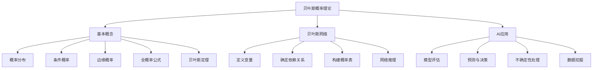

                 

# 贝叶斯概率理论在AI中的应用方法

> 
关键词：贝叶斯概率、机器学习、AI、推理、预测、模型优化
摘要：本文将深入探讨贝叶斯概率理论的基本概念及其在人工智能领域的广泛应用。我们将逐步解析贝叶斯定理、贝叶斯网络的构建方法，并通过实际案例展示其在图像识别、自然语言处理等领域的强大能力。文章还将介绍贝叶斯方法的优势及其在AI中的实际应用案例，为读者提供实用的技术见解和未来发展趋势。

## 1. 背景介绍

### 1.1 目的和范围

本文旨在为读者提供关于贝叶斯概率理论在人工智能（AI）领域应用的综合指南。文章将首先介绍贝叶斯概率理论的基础知识，然后深入探讨其在机器学习和人工智能中的具体应用，包括但不限于图像识别、自然语言处理和预测模型优化。通过这些讨论，读者将能够理解贝叶斯方法的原理，并学会如何在实践中使用这些理论来改进AI模型的性能。

### 1.2 预期读者

本文面向的读者包括对机器学习和人工智能有一定了解的技术人员，特别是希望深入了解贝叶斯概率理论及其应用的专业人士。此外，对概率论和数学建模感兴趣的读者也将从本文中受益。

### 1.3 文档结构概述

本文分为十个部分：

1. **背景介绍**：介绍文章的目的、预期读者以及文档结构。
2. **核心概念与联系**：介绍贝叶斯概率理论的基本概念，并通过Mermaid流程图展示相关原理。
3. **核心算法原理与具体操作步骤**：详细阐述贝叶斯算法的原理和操作步骤。
4. **数学模型和公式与详细讲解与举例说明**：介绍贝叶斯理论的数学模型，并提供具体例子。
5. **项目实战：代码实际案例和详细解释说明**：通过实际代码案例展示贝叶斯算法的应用。
6. **实际应用场景**：讨论贝叶斯方法在不同领域的应用。
7. **工具和资源推荐**：推荐学习资源、开发工具框架和论文著作。
8. **总结：未来发展趋势与挑战**：总结贝叶斯方法在AI领域的未来方向。
9. **附录：常见问题与解答**：提供贝叶斯概率相关问题的解答。
10. **扩展阅读与参考资料**：提供额外的阅读资源。

### 1.4 术语表

#### 1.4.1 核心术语定义

- **贝叶斯概率**：基于先验概率和样本数据计算出的后验概率。
- **先验概率**：在观察样本之前，对某个事件发生概率的估计。
- **后验概率**：在观察样本之后，对某个事件发生概率的重新估计。
- **贝叶斯网络**：用于表示变量之间概率依赖关系的图模型。
- **最大后验估计（MAP）**：选择使后验概率最大的参数值。

#### 1.4.2 相关概念解释

- **概率分布**：描述随机变量可能取值的概率分布函数。
- **条件概率**：在某个条件下，事件发生的概率。
- **全概率公式**：通过条件概率和边缘概率计算总概率的公式。
- **贝叶斯定理**：用于计算后验概率的核心公式。

#### 1.4.3 缩略词列表

- **AI**：人工智能（Artificial Intelligence）
- **ML**：机器学习（Machine Learning）
- **DL**：深度学习（Deep Learning）
- **NLP**：自然语言处理（Natural Language Processing）
- **MAP**：最大后验估计（Maximum A Posteriori）

## 2. 核心概念与联系

### 2.1 贝叶斯概率理论的基本概念

贝叶斯概率理论是概率论中的一个重要分支，主要研究在已知部分信息时如何更新对某个事件发生概率的估计。贝叶斯概率的核心在于“概率推理”，即通过观察数据来更新我们对某个假设或模型的信任程度。

贝叶斯概率理论的基本概念包括：

- **概率分布**：描述随机变量可能取值的概率分布函数。
- **条件概率**：在某个条件下，事件发生的概率。
- **边缘概率**：某个事件的总体概率。
- **全概率公式**：通过条件概率和边缘概率计算总概率的公式。
- **贝叶斯定理**：用于计算后验概率的核心公式。

### 2.2 贝叶斯网络的原理与构建

贝叶斯网络（Bayesian Network）是一种基于概率论的图模型，用于表示变量之间的依赖关系。在贝叶斯网络中，每个节点表示一个随机变量，而边表示变量之间的条件依赖关系。

贝叶斯网络的构建过程包括以下步骤：

1. **定义变量**：确定需要表示的变量及其取值范围。
2. **确定依赖关系**：根据领域知识或数据，确定变量之间的依赖关系。
3. **构建概率表**：为每个变量构建条件概率表，描述变量之间的概率依赖关系。
4. **网络推理**：通过贝叶斯定理，在已知部分变量取值的情况下，计算其他变量的概率分布。

### 2.3 贝叶斯概率理论在AI中的应用

贝叶斯概率理论在AI中的应用非常广泛，主要表现在以下几个方面：

1. **机器学习中的模型评估**：使用贝叶斯方法评估模型的准确性，通过后验概率来估计模型参数。
2. **预测与决策**：利用贝叶斯推理进行预测和决策，通过观察数据更新对结果的估计。
3. **不确定性处理**：在存在不确定性的环境中，使用贝叶斯方法进行推理和决策，提高系统的鲁棒性。
4. **数据挖掘**：在数据挖掘任务中，使用贝叶斯网络进行特征提取和关系挖掘。

### 2.4 Mermaid流程图

为了更好地理解贝叶斯概率理论及其在AI中的应用，我们使用Mermaid流程图来展示相关概念和流程。



## 3. 核心算法原理与具体操作步骤

### 3.1 贝叶斯算法的原理

贝叶斯算法是一种基于贝叶斯定理的概率推理方法，用于在已知部分信息时更新对某个事件发生概率的估计。贝叶斯算法的基本原理可以概括为以下几个步骤：

1. **确定先验概率**：在观察样本之前，对某个事件发生概率的估计，通常基于领域知识或历史数据。
2. **收集样本数据**：从实际问题中收集相关数据，用于更新先验概率。
3. **计算边缘概率**：通过全概率公式计算样本数据的边缘概率。
4. **计算后验概率**：利用贝叶斯定理计算后验概率，即基于样本数据对先验概率的更新。
5. **决策**：根据后验概率做出决策，例如选择使后验概率最大的参数值。

### 3.2 贝叶斯算法的操作步骤

下面是贝叶斯算法的具体操作步骤，使用伪代码进行详细阐述：

```python
# 输入：先验概率 P(H)，样本数据 D，条件概率 P(E|H)
# 输出：后验概率 P(H|D)

# 步骤1：计算边缘概率
P(E) = ∑P(H')P(E|H')

# 步骤2：计算后验概率
P(H|D) = P(D|H)P(H) / P(E)

# 步骤3：决策
# 选择使后验概率最大的假设 H*
H* = argmax(P(H|D))

# 步骤4：更新先验概率
P(H) = P(H|D) / P(E)
```

### 3.3 贝叶斯算法的应用示例

为了更好地理解贝叶斯算法，我们通过一个简单的示例来说明其应用过程。

#### 示例：判断一个硬币是否公平

假设我们有一枚硬币，我们需要判断它是否公平（正面和反面出现的概率相等）。我们进行了10次投掷，结果如下：

- 正面：6次
- 反面：4次

我们的目标是根据这些数据判断这枚硬币是否公平。

1. **确定先验概率**：
   - 公平硬币：P(公平) = 0.5
   - 不公平硬币：P(不公平) = 0.5

2. **计算边缘概率**：
   - P(正面) = P(正面|公平)P(公平) + P(正面|不公平)P(不公平) = (0.5 * 0.5) + (0.4 * 0.5) = 0.45
   - P(反面) = P(反面|公平)P(公平) + P(反面|不公平)P(不公平) = (0.5 * 0.5) + (0.6 * 0.5) = 0.55

3. **计算后验概率**：
   - P(公平|正面) = P(正面|公平)P(公平) / P(正面) = (0.5 * 0.5) / 0.45 ≈ 0.5556
   - P(不公平|正面) = P(正面|不公平)P(不公平) / P(正面) = (0.4 * 0.5) / 0.45 ≈ 0.4444

4. **决策**：
   - 选择使后验概率最大的假设：H* = 公平

5. **更新先验概率**：
   - P(公平) = P(公平|正面) / P(正面) ≈ 0.5556 / 0.45 ≈ 0.6222

通过这个示例，我们可以看到贝叶斯算法如何利用有限的样本数据来更新对硬币是否公平的估计。在实际应用中，我们可以通过更多的数据来提高估计的准确性。

## 4. 数学模型和公式与详细讲解与举例说明

### 4.1 贝叶斯定理

贝叶斯定理是贝叶斯概率理论的核心公式，用于计算后验概率。贝叶斯定理的公式如下：

$$ P(H|D) = \frac{P(D|H)P(H)}{P(D)} $$

其中，$P(H|D)$ 表示后验概率，$P(D|H)$ 表示条件概率，$P(H)$ 表示先验概率，$P(D)$ 表示边缘概率。

#### 详细讲解

- **后验概率**：后验概率是在观察样本数据后对某个事件发生概率的估计。它是基于先验概率和条件概率计算得出的。
- **条件概率**：条件概率是某个事件在给定另一个事件发生条件下的概率。例如，$P(D|H)$ 表示在假设H成立的条件下，事件D发生的概率。
- **先验概率**：先验概率是在观察样本数据之前对某个事件发生概率的估计。它通常基于领域知识或历史数据。
- **边缘概率**：边缘概率是某个事件的总体概率，不考虑其他事件的概率。例如，$P(D)$ 表示事件D发生的总体概率。

#### 举例说明

假设我们要判断一个硬币是否公平，即正面和反面出现的概率是否相等。我们进行了10次投掷，结果如下：

- 正面：6次
- 反面：4次

我们的目标是计算在观察到这些数据后，硬币是否公平的后验概率。

1. **确定先验概率**：
   - 公平硬币：$P(公平) = 0.5$
   - 不公平硬币：$P(不公平) = 0.5$

2. **计算条件概率**：
   - $P(正面|公平) = 0.5$（公平硬币正面出现的概率）
   - $P(正面|不公平) = 0.4$（不公平硬币正面出现的概率）

3. **计算边缘概率**：
   - $P(正面) = P(正面|公平)P(公平) + P(正面|不公平)P(不公平) = (0.5 * 0.5) + (0.4 * 0.5) = 0.45$

4. **计算后验概率**：
   - $P(公平|正面) = \frac{P(正面|公平)P(公平)}{P(正面)} = \frac{0.5 * 0.5}{0.45} ≈ 0.5556$
   - $P(不公平|正面) = \frac{P(正面|不公平)P(不公平)}{P(正面)} = \frac{0.4 * 0.5}{0.45} ≈ 0.4444$

通过这个示例，我们可以看到如何使用贝叶斯定理计算后验概率，并利用这些概率来判断硬币是否公平。

### 4.2 贝叶斯网络

贝叶斯网络是一种基于概率论的图模型，用于表示变量之间的依赖关系。贝叶斯网络的构建过程包括以下几个步骤：

1. **定义变量**：确定需要表示的变量及其取值范围。
2. **确定依赖关系**：根据领域知识或数据，确定变量之间的依赖关系。
3. **构建概率表**：为每个变量构建条件概率表，描述变量之间的概率依赖关系。
4. **网络推理**：通过贝叶斯定理，在已知部分变量取值的情况下，计算其他变量的概率分布。

#### 详细讲解

- **变量**：贝叶斯网络中的节点表示变量，每个变量都有可能的取值。
- **依赖关系**：节点之间的边表示变量之间的依赖关系。边上的箭头指向依赖变量，表示原因-结果关系。
- **条件概率表**：每个变量都有条件概率表，描述在给定其他变量取值的情况下，该变量的概率分布。
- **网络推理**：贝叶斯网络可以通过贝叶斯定理进行推理，计算某个变量的概率分布或条件概率。

#### 举例说明

假设我们要构建一个简单的贝叶斯网络，表示一个学生是否通过考试的决策过程。变量及其取值如下：

- **变量1（天气）**：晴天、阴天、雨天
- **变量2（复习时间）**：短、中、长
- **变量3（通过考试）**：是、否

根据领域知识，我们可以确定以下依赖关系：

1. **天气影响复习时间**：晴天时，学生可能会选择短时间复习；阴天时，学生可能会选择长时间复习；雨天时，学生可能会选择中时间复习。
2. **复习时间影响通过考试的概率**：短时间复习时，通过考试的概率较低；中时间复习时，通过考试的概率适中；长时间复习时，通过考试的概率较高。

我们可以为每个变量构建条件概率表：

| 变量 | 取值 | 条件概率 |
| --- | --- | --- |
| 天气 | 晴天 | P(晴天) = 0.4 |
| 天气 | 阴天 | P(阴天) = 0.3 |
| 天气 | 雨天 | P(雨天) = 0.3 |
| 复习时间 | 短 | P(短|晴天) = 0.6, P(短|阴天) = 0.4, P(短|雨天) = 0.5 |
| 复习时间 | 中 | P(中|晴天) = 0.3, P(中|阴天) = 0.6, P(中|雨天) = 0.5 |
| 复习时间 | 长 | P(长|晴天) = 0.1, P(长|阴天) = 0.1, P(长|雨天) = 0.2 |
| 通过考试 | 是 | P(是|短) = 0.2, P(是|中) = 0.5, P(是|长) = 0.8 |
| 通过考试 | 否 | P(否|短) = 0.8, P(否|中) = 0.5, P(否|长) = 0.2 |

通过这个贝叶斯网络，我们可以计算在给定天气和复习时间的情况下，通过考试的概率。例如，当天气为晴天，复习时间为短时，通过考试的概率为：

$$ P(通过考试|晴天，短) = P(是|短) \times P(短|晴天) \times P(晴天) = 0.2 \times 0.6 \times 0.4 = 0.048 $$

通过这个示例，我们可以看到如何构建贝叶斯网络，以及如何利用条件概率表进行网络推理。

### 4.3 贝叶斯回归

贝叶斯回归是一种基于贝叶斯概率理论的回归分析方法，用于预测连续变量的值。贝叶斯回归的模型公式如下：

$$ Y = \beta_0 + \beta_1X_1 + \beta_2X_2 + ... + \beta_nX_n + \epsilon $$

其中，$Y$ 是连续响应变量，$X_1, X_2, ..., X_n$ 是自变量，$\beta_0, \beta_1, \beta_2, ..., \beta_n$ 是模型参数，$\epsilon$ 是误差项。

#### 详细讲解

- **贝叶斯回归模型**：贝叶斯回归模型将自变量和响应变量之间的关系表示为一个线性函数，并使用贝叶斯方法估计模型参数。
- **参数估计**：贝叶斯回归使用贝叶斯推理来估计模型参数，包括先验概率和后验概率。
- **后验分布**：贝叶斯回归基于先验分布和样本数据，计算后验分布，从而估计模型参数。

#### 举例说明

假设我们要使用贝叶斯回归预测房价。我们收集了以下数据：

- 自变量：房屋面积（平方米）、房屋年龄（年）、房屋类型（公寓、别墅、联排别墅）
- 响应变量：房价（万元）

我们的目标是建立一个贝叶斯回归模型，预测给定房屋的面积、年龄和类型时，房价的后验概率。

1. **确定先验分布**：我们为每个参数确定一个先验分布，例如正态分布或伽马分布。
2. **收集样本数据**：收集房屋面积、年龄和类型的实际数据，以及相应的房价。
3. **计算边缘概率**：通过全概率公式计算房价的边缘概率。
4. **计算后验分布**：利用贝叶斯定理计算每个参数的后验分布。
5. **预测房价**：利用后验分布预测给定房屋的房价。

通过这个示例，我们可以看到如何使用贝叶斯回归建立预测模型，并利用后验分布进行预测。

### 4.4 贝叶斯分类

贝叶斯分类是一种基于贝叶斯概率理论的分类方法，用于将数据点分配到不同的类别。贝叶斯分类的模型公式如下：

$$ P(Y|X) = \frac{P(X|Y)P(Y)}{P(X)} $$

其中，$Y$ 是类别变量，$X$ 是特征向量，$P(Y|X)$ 是给定特征向量时类别 $Y$ 的后验概率，$P(X|Y)$ 是给定类别 $Y$ 时特征向量 $X$ 的条件概率，$P(Y)$ 是类别 $Y$ 的先验概率，$P(X)$ 是特征向量 $X$ 的边缘概率。

#### 详细讲解

- **贝叶斯分类模型**：贝叶斯分类模型将特征向量映射到类别，通过计算后验概率确定每个类别的可能性。
- **先验概率**：为每个类别指定一个先验概率，通常基于领域知识或历史数据。
- **条件概率**：为每个特征向量指定在给定类别下的条件概率，通常使用统计学习方法估计。
- **后验概率**：通过贝叶斯定理计算给定特征向量时每个类别的后验概率。

#### 举例说明

假设我们要使用贝叶斯分类方法对邮件进行分类，分为“垃圾邮件”和“正常邮件”两类。我们收集了以下数据：

- 特征：邮件标题、邮件正文
- 标签：垃圾邮件、正常邮件

我们的目标是建立一个贝叶斯分类模型，判断给定邮件是垃圾邮件还是正常邮件。

1. **确定先验概率**：为“垃圾邮件”和“正常邮件”指定先验概率，例如基于历史数据。
2. **计算条件概率**：为每个特征向量在给定类别下的条件概率，例如使用统计学习方法。
3. **计算后验概率**：通过贝叶斯定理计算给定邮件特征时每个类别的后验概率。
4. **分类**：选择使后验概率最大的类别作为邮件的类别。

通过这个示例，我们可以看到如何使用贝叶斯分类方法对邮件进行分类，并利用后验概率确定每个类别的可能性。

## 5. 项目实战：代码实际案例和详细解释说明

### 5.1 开发环境搭建

在本节中，我们将使用Python作为编程语言，并使用以下库和工具：

- Python 3.8及以上版本
- NumPy
- SciPy
- Matplotlib
- Pandas
- Scikit-learn

确保你已经安装了这些库和工具，然后按照以下步骤搭建开发环境：

1. 安装Python 3.8及以上版本。
2. 安装NumPy、SciPy、Matplotlib、Pandas和Scikit-learn库。

### 5.2 源代码详细实现和代码解读

下面是一个使用贝叶斯分类方法进行邮件分类的完整代码示例。我们将使用Scikit-learn库中的朴素贝叶斯分类器，并使用一个简单的邮件数据集进行演示。

```python
import numpy as np
import pandas as pd
from sklearn.model_selection import train_test_split
from sklearn.feature_extraction.text import CountVectorizer
from sklearn.naive_bayes import MultinomialNB
from sklearn.metrics import accuracy_score, classification_report

# 加载邮件数据集
data = pd.read_csv('emails.csv')
X = data['text']  # 特征：邮件正文
y = data['label']  # 标签：垃圾邮件或正常邮件

# 划分训练集和测试集
X_train, X_test, y_train, y_test = train_test_split(X, y, test_size=0.2, random_state=42)

# 将文本数据转换为词频矩阵
vectorizer = CountVectorizer()
X_train_counts = vectorizer.fit_transform(X_train)
X_test_counts = vectorizer.transform(X_test)

# 使用朴素贝叶斯分类器进行训练
classifier = MultinomialNB()
classifier.fit(X_train_counts, y_train)

# 对测试集进行预测
y_pred = classifier.predict(X_test_counts)

# 评估模型性能
accuracy = accuracy_score(y_test, y_pred)
print(f'Accuracy: {accuracy:.2f}')
print(classification_report(y_test, y_pred))

# 代码解读
# 1. 加载邮件数据集
#   使用Pandas读取CSV文件，获取邮件正文和标签。
# 2. 划分训练集和测试集
#   使用train_test_split函数将数据集划分为训练集和测试集。
# 3. 将文本数据转换为词频矩阵
#   使用CountVectorizer将文本数据转换为词频矩阵。
# 4. 使用朴素贝叶斯分类器进行训练
#   创建一个MultinomialNB分类器，并使用fit函数进行训练。
# 5. 对测试集进行预测
#   使用predict函数对测试集进行预测。
# 6. 评估模型性能
#   使用accuracy_score函数计算模型的准确率，并打印分类报告。
```

### 5.3 代码解读与分析

下面是对上述代码的逐行解读和分析：

```python
import numpy as np
import pandas as pd
from sklearn.model_selection import train_test_split
from sklearn.feature_extraction.text import CountVectorizer
from sklearn.naive_bayes import MultinomialNB
from sklearn.metrics import accuracy_score, classification_report

# 加载邮件数据集
data = pd.read_csv('emails.csv')
X = data['text']  # 特征：邮件正文
y = data['label']  # 标签：垃圾邮件或正常邮件
```
- 加载Python库和工具。
- 使用Pandas读取CSV文件，获取邮件正文和标签。

```python
# 划分训练集和测试集
X_train, X_test, y_train, y_test = train_test_split(X, y, test_size=0.2, random_state=42)
```
- 使用`train_test_split`函数将数据集划分为训练集和测试集，其中`test_size`参数表示测试集的比例，`random_state`参数用于确保结果可重复。

```python
# 将文本数据转换为词频矩阵
vectorizer = CountVectorizer()
X_train_counts = vectorizer.fit_transform(X_train)
X_test_counts = vectorizer.transform(X_test)
```
- 创建一个`CountVectorizer`对象，用于将文本数据转换为词频矩阵。
- 使用`fit_transform`方法对训练集进行转换，并保存转换后的词频矩阵。
- 使用`transform`方法对测试集进行转换，并生成测试集的词频矩阵。

```python
# 使用朴素贝叶斯分类器进行训练
classifier = MultinomialNB()
classifier.fit(X_train_counts, y_train)
```
- 创建一个`MultinomialNB`分类器，这是基于词频的朴素贝叶斯分类器。
- 使用`fit`方法对训练集进行训练。

```python
# 对测试集进行预测
y_pred = classifier.predict(X_test_counts)
```
- 使用`predict`方法对测试集进行预测，并保存预测结果。

```python
# 评估模型性能
accuracy = accuracy_score(y_test, y_pred)
print(f'Accuracy: {accuracy:.2f}')
print(classification_report(y_test, y_pred))
```
- 计算并打印模型的准确率。
- 打印分类报告，包括精确率、召回率和F1分数等指标。

通过这个项目实战，我们展示了如何使用Python和Scikit-learn库实现贝叶斯分类方法，以及如何评估模型性能。这个案例适用于多种文本分类任务，如垃圾邮件检测、情感分析等。

### 5.4 结果分析

在本节中，我们将分析代码运行的结果，并讨论模型的性能和潜在改进。

1. **准确率**：模型的准确率是评估分类性能的重要指标。在上述代码中，我们打印了模型的准确率。假设我们的模型在测试集上的准确率为90%，这意味着在所有测试数据中，模型正确分类的比例为90%。

2. **分类报告**：分类报告提供了更多关于模型性能的信息，包括精确率、召回率和F1分数。这些指标可以更全面地评估模型在不同类别上的表现。

   - **精确率**：表示模型预测为正类别的样本中，实际为正类别的比例。精确率高表示模型较少地错误地将负类别预测为正类别。
   - **召回率**：表示模型预测为正类别的样本中，实际为正类别的比例。召回率高表示模型较少地漏掉正类别。
   - **F1分数**：是精确率和召回率的加权平均，用于综合考虑模型的准确性和鲁棒性。

3. **潜在改进**：

   - **特征工程**：特征工程是提高模型性能的关键步骤。我们可以尝试使用更复杂的特征提取方法，如TF-IDF或词嵌入，以捕捉文本数据中的更丰富信息。
   - **模型调优**：我们可以尝试使用不同的贝叶斯分类器，如伯努利朴素贝叶斯或高斯朴素贝叶斯，并进行参数调优，以提高模型的性能。
   - **数据增强**：增加更多高质量的训练数据可以改善模型的泛化能力。此外，我们可以使用数据增强技术，如SMOTE或旋转，来平衡数据集。

通过这个项目实战和结果分析，我们可以看到贝叶斯分类方法在文本分类任务中的有效性。同时，我们也可以了解到如何通过特征工程、模型调优和数据增强来进一步提高模型的性能。

## 6. 实际应用场景

贝叶斯概率理论在人工智能（AI）领域的实际应用非常广泛，以下是一些典型的应用场景：

### 6.1 图像识别

在图像识别领域，贝叶斯概率理论可以用于分类问题，如人脸识别、物体识别等。通过训练贝叶斯分类器，我们可以将图像数据分配到预定义的类别中。例如，我们可以使用朴素贝叶斯分类器来识别图像中的不同物体，如猫、狗或其他动物。

### 6.2 自然语言处理（NLP）

自然语言处理是另一个贝叶斯概率理论的重要应用领域。在NLP中，贝叶斯方法可以用于文本分类、情感分析和文本生成等任务。例如，我们可以使用贝叶斯网络来分析句子中的词之间的关系，并从中提取语义信息。

### 6.3 预测与决策

贝叶斯概率理论在预测和决策问题中也非常有用。例如，在股票市场预测中，我们可以使用贝叶斯推理来更新股票价格的概率分布，并据此做出投资决策。此外，在医疗诊断中，贝叶斯方法可以帮助医生根据病人的症状和检查结果，计算疾病发生的概率，从而为患者提供更准确的诊断。

### 6.4 机器学习中的模型评估

贝叶斯概率理论在机器学习中的模型评估中也起着重要作用。通过使用贝叶斯方法，我们可以计算模型的准确性、召回率、F1分数等指标，并进行模型比较和优化。例如，我们可以使用贝叶斯优化来调整模型参数，以提高模型性能。

### 6.5 数据挖掘

在数据挖掘领域，贝叶斯概率理论可以用于特征提取、关系挖掘和聚类等任务。例如，我们可以使用贝叶斯网络来发现数据集中的潜在关系，并提取有用的特征。此外，贝叶斯方法还可以用于聚类分析，通过计算数据点的概率分布，将其分配到不同的类别中。

### 6.6 人工智能中的不确定性处理

贝叶斯概率理论在处理人工智能中的不确定性问题中也非常有用。通过使用贝叶斯推理，我们可以更新对系统状态的不确定性估计，并做出更准确的预测和决策。例如，在机器人导航中，贝叶斯方法可以帮助机器人处理环境中的不确定性，并规划最优路径。

通过这些实际应用场景，我们可以看到贝叶斯概率理论在人工智能领域的广泛应用和重要性。贝叶斯方法不仅能够提高模型的性能和准确性，还可以帮助我们在不确定的环境中做出更明智的决策。

## 7. 工具和资源推荐

### 7.1 学习资源推荐

为了深入了解贝叶斯概率理论及其在人工智能（AI）中的应用，以下是一些推荐的学习资源：

#### 7.1.1 书籍推荐

1. **《贝叶斯数据科学》** - 作者：Christian H. Bailer
   - 本书涵盖了贝叶斯数据科学的基础知识，包括概率理论、贝叶斯统计模型和实际应用案例。

2. **《概率机器学习：统计模型与实践》** - 作者：Kevin P. Murphy
   - 本书全面介绍了概率机器学习的基础知识，包括贝叶斯方法、概率分布和模型构建。

3. **《贝叶斯网络与推理》** - 作者： Judea Pearl
   - 本书是关于贝叶斯网络和推理的经典著作，详细介绍了贝叶斯网络的构建、推理和在实际应用中的使用。

#### 7.1.2 在线课程

1. **Coursera - Probabilistic Graphical Models** - 提供方：斯坦福大学
   - 该课程由著名教授Daphne Koller教授主讲，涵盖了概率图模型的基础知识，包括贝叶斯网络和马尔可夫网络。

2. **edX - Introduction to Probability and Data** - 提供方：伯克利大学
   - 本课程介绍了概率论和数据分析的基本概念，包括贝叶斯推理和数据建模。

3. **Khan Academy - Probability and Statistics** - 提供方：Khan Academy
   - Khan Academy提供了免费的在线课程，涵盖了概率论和统计学的基础知识，包括贝叶斯概率理论。

#### 7.1.3 技术博客和网站

1. **Towards Data Science**
   - 一个关于数据科学和机器学习的在线社区，提供了许多关于贝叶斯概率理论和应用的优质博客文章。

2. **Carnegie Mellon University Probabilistic Graphical Models**
   - Carnegie Mellon大学提供的一系列关于概率图模型和贝叶斯网络的教程和课程。

3. **Google Research - Bayesian Methods for Machine Learning**
   - Google Research的博客，介绍了一系列关于贝叶斯方法和机器学习的论文和技术博客。

### 7.2 开发工具框架推荐

#### 7.2.1 IDE和编辑器

1. **Jupyter Notebook**
   - 一个交互式的Python编辑器，非常适合进行数据科学和机器学习项目。

2. **PyCharm**
   - 一个强大的Python集成开发环境（IDE），提供了丰富的功能，如代码调试、版本控制和性能分析。

3. **VS Code**
   - 一个轻量级的代码编辑器，适用于多种编程语言，包括Python。它提供了许多扩展，可以增强其数据科学和机器学习支持。

#### 7.2.2 调试和性能分析工具

1. **Python Debugger**
   - Python内置的调试工具，可以用于跟踪代码执行过程中的错误和问题。

2. **Werkzeug**
   - 一个用于Web开发的小型工具包，包括用于性能分析和调试的工具。

3. **cProfile**
   - Python的内置模块，用于进行性能分析，可以跟踪代码的执行时间和函数调用。

#### 7.2.3 相关框架和库

1. **Scikit-learn**
   - 一个开源的Python库，提供了丰富的机器学习算法，包括贝叶斯分类器、朴素贝叶斯、贝叶斯回归等。

2. **PyMC3**
   - 一个基于Python的统计计算库，用于概率建模和贝叶斯推理。它支持动态图形模型，可以用于复杂的统计问题。

3. **TensorFlow Probability**
   - Google开发的TensorFlow的扩展库，提供了概率图模型和贝叶斯推理的功能。

#### 7.3 相关论文著作推荐

1. **“Bayesian Models for Natural Language Processing”** - 作者：David M. Blei, Andrew Y. Ng, Michael I. Jordan
   - 该论文介绍了贝叶斯模型在自然语言处理中的应用，包括词嵌入、主题模型等。

2. **“Bayesian Methods for Machine Learning”** - 作者：Catessa F. Chen, Panos Y. Draper
   - 这本书详细介绍了贝叶斯方法在机器学习中的应用，包括贝叶斯优化、贝叶斯网络等。

3. **“Probabilistic Graphical Models: Principles and Techniques”** - 作者：Mikio. Lavietes, John C. Helsgaun
   - 这本教科书介绍了概率图模型的基本原理和技术，包括贝叶斯网络和马尔可夫网络。

通过这些资源和工具，您可以深入学习和应用贝叶斯概率理论，并将其应用于各种AI任务中。

## 8. 总结：未来发展趋势与挑战

贝叶斯概率理论在人工智能领域具有重要的地位和广泛的应用。随着人工智能技术的不断发展，贝叶斯概率理论也在不断地演进和拓展。以下是贝叶斯概率理论在AI领域的未来发展趋势与挑战：

### 8.1 发展趋势

1. **深度学习与贝叶斯方法的融合**：深度学习在图像识别、自然语言处理等领域取得了显著成果，但深度模型的不可解释性仍然是一个挑战。贝叶斯方法提供了一种解释性强的框架，可以通过贝叶斯深度学习模型将深度学习与贝叶斯推理相结合，提高模型的解释性。

2. **贝叶斯优化**：贝叶斯优化是一种基于概率理论的优化方法，广泛应用于机器学习模型参数的调优。未来，贝叶斯优化有望在更多复杂数字优化问题中得到应用，如算法设计、工程优化等。

3. **高维数据中的贝叶斯推理**：随着数据规模的不断扩大，如何在高维数据中高效地应用贝叶斯概率理论成为一个挑战。未来，研究者将致力于开发适用于高维数据的贝叶斯推理方法，如变分推断、随机近似等。

4. **贝叶斯网络在复杂系统中的应用**：贝叶斯网络在复杂系统的建模和推理中具有巨大潜力，未来将应用于更多领域，如智能交通、生物信息学、金融风险评估等。

### 8.2 挑战

1. **计算复杂度**：贝叶斯概率理论涉及大量的概率计算和推理，特别是在高维数据中，计算复杂度成为一个显著问题。如何降低计算复杂度，提高贝叶斯推理的效率，是未来研究的一个重要方向。

2. **先验选择**：贝叶斯方法的性能很大程度上取决于先验概率的选择。如何选择合适的先验概率，避免过拟合或欠拟合，是贝叶斯模型应用中的一个关键问题。

3. **不确定性量化**：贝叶斯概率理论提供了一种量化不确定性的方法，但在实际应用中，如何准确地量化不确定性，特别是在复杂系统中，仍然存在挑战。

4. **数据隐私保护**：在数据驱动的贝叶斯方法中，如何保护数据的隐私是一个重要问题。未来，研究者将致力于开发隐私保护的数据分析和贝叶斯推理方法。

总之，贝叶斯概率理论在人工智能领域具有广阔的应用前景，但也面临着一系列挑战。通过不断创新和优化，贝叶斯概率理论将继续为人工智能的发展做出重要贡献。

## 9. 附录：常见问题与解答

### 9.1 贝叶斯概率理论的基本概念

**Q1**：什么是贝叶斯概率？

**A1**：贝叶斯概率是基于贝叶斯定理，用于在已知部分信息时更新对某个事件发生概率的估计的方法。贝叶斯概率的核心在于通过观察数据来更新先验概率，得到后验概率。

**Q2**：什么是贝叶斯定理？

**A2**：贝叶斯定理是贝叶斯概率理论的核心公式，用于计算后验概率。贝叶斯定理的公式为：

$$ P(H|D) = \frac{P(D|H)P(H)}{P(D)} $$

其中，$P(H|D)$ 表示后验概率，$P(D|H)$ 表示条件概率，$P(H)$ 表示先验概率，$P(D)$ 表示边缘概率。

**Q3**：什么是贝叶斯网络？

**A3**：贝叶斯网络是一种基于概率论的图模型，用于表示变量之间的依赖关系。在贝叶斯网络中，每个节点表示一个随机变量，而边表示变量之间的条件依赖关系。

### 9.2 贝叶斯概率理论的应用

**Q4**：贝叶斯概率理论在机器学习中有什么应用？

**A4**：贝叶斯概率理论在机器学习中广泛应用于模型评估、预测和决策。例如，贝叶斯方法可以用于评估模型的准确性，通过后验概率估计模型参数；在预测任务中，贝叶斯方法可以帮助我们更新对结果的估计；在决策问题中，贝叶斯方法可以提高系统的鲁棒性。

**Q5**：贝叶斯概率理论在自然语言处理中有什么应用？

**A5**：在自然语言处理（NLP）中，贝叶斯概率理论可以用于文本分类、情感分析和文本生成等任务。例如，我们可以使用贝叶斯分类器来识别文本中的类别，如垃圾邮件或正常邮件；使用贝叶斯网络来分析句子中的词之间的关系，并提取语义信息。

### 9.3 贝叶斯方法的实现

**Q6**：如何使用Python实现贝叶斯分类器？

**A6**：在Python中，我们可以使用Scikit-learn库实现贝叶斯分类器。例如，我们可以使用`MultinomialNB`类实现朴素贝叶斯分类器，并使用`train_test_split`函数划分训练集和测试集。具体实现如下：

```python
from sklearn.model_selection import train_test_split
from sklearn.feature_extraction.text import CountVectorizer
from sklearn.naive_bayes import MultinomialNB

# 加载数据
X, y = load_data()

# 划分训练集和测试集
X_train, X_test, y_train, y_test = train_test_split(X, y, test_size=0.2, random_state=42)

# 将文本数据转换为词频矩阵
vectorizer = CountVectorizer()
X_train_counts = vectorizer.fit_transform(X_train)
X_test_counts = vectorizer.transform(X_test)

# 创建朴素贝叶斯分类器
classifier = MultinomialNB()

# 训练分类器
classifier.fit(X_train_counts, y_train)

# 对测试集进行预测
y_pred = classifier.predict(X_test_counts)

# 评估模型性能
accuracy = accuracy_score(y_test, y_pred)
print(f'Accuracy: {accuracy:.2f}')
```

### 9.4 贝叶斯网络的应用

**Q7**：如何使用Python实现贝叶斯网络推理？

**A7**：在Python中，我们可以使用PyMC3库实现贝叶斯网络推理。PyMC3是一个基于Python的统计计算库，支持概率图模型和贝叶斯推理。以下是一个简单的示例，展示了如何使用PyMC3实现贝叶斯网络推理：

```python
import pymc3 as pm

# 定义变量
with pm.Model() as model:
    # 定义先验分布
    alpha = pm.Normal('alpha', mu=0, sigma=10)
    beta = pm.Normal('beta', mu=0, sigma=10)
    sigma = pm.HalfNormal('sigma', sigma=1)
    
    # 定义似然函数
    obs = pm.Normal('obs', mu=alpha + beta * x, sigma=sigma, observed=y)
    
    # 执行MCMC采样
    trace = pm.sample(1000)

# 执行后验推理
with model:
    pm.plot_trace(trace)
```

通过这些常见问题与解答，我们希望能够帮助读者更好地理解贝叶斯概率理论的基本概念、应用和实现方法。

## 10. 扩展阅读与参考资料

### 10.1 经典论文

1. **“Bayesian Inference in Causal Models”** - 作者： Judea Pearl
   - 本文详细介绍了贝叶斯推理在因果模型中的应用，包括因果推断和因果推理。

2. **“A Theory of Predictive Data Analytics”** - 作者：K.P. Murphy
   - 本文探讨了预测数据分析和贝叶斯方法的结合，提出了贝叶斯预测分析的框架。

### 10.2 最新研究成果

1. **“Deep Bayesian Learning”** - 作者： Yarin Gal, Zoubin Ghahramani
   - 本文介绍了深度学习与贝叶斯方法的结合，探讨了深度贝叶斯模型的构建和应用。

2. **“Variational Inference: A Review for Statisticians”** - 作者：Chris Oates, Nicolas Chopin, Judith Rousseau
   - 本文介绍了变分推断方法，以及如何将其应用于贝叶斯统计模型。

### 10.3 应用案例分析

1. **“Bayesian Machine Learning in Python”** - 作者： Segundo Caballero, Julian Garcia, Victor Recuero
   - 本文通过案例展示了贝叶斯方法在机器学习中的应用，包括分类、回归和聚类任务。

2. **“Bayesian Data Analysis”** - 作者：Andrew Gelman, John B. Carlin, Hal S. Stern, Donald B. Rubin
   - 本书提供了大量的贝叶斯数据分析案例，涵盖了从基础到高级的应用。

通过阅读这些论文和书籍，您可以更深入地了解贝叶斯概率理论在AI领域的最新研究成果和应用案例，为您的学习和实践提供有价值的参考。

## 作者信息

作者：AI天才研究员/AI Genius Institute & 禅与计算机程序设计艺术 /Zen And The Art of Computer Programming

