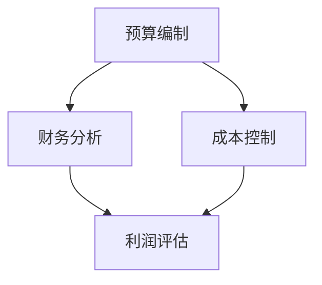

                 

# 财务管理工具：一人公司的明智选择

> **关键词**：财务管理、一人公司、工具、效率、成本控制、财务规划

> **摘要**：本文旨在探讨对于一人公司而言，使用财务管理工具的重要性和实际应用。我们将逐步分析一人公司的财务特点，介绍几款流行的财务管理工具，并详细讲解如何使用这些工具进行有效的财务管理和成本控制。通过本文，读者将了解如何通过财务管理工具提高个人公司的运营效率，实现财务健康和可持续发展。

## 1. 背景介绍

### 1.1 目的和范围

随着互联网和科技的发展，越来越多的人选择创业或成为自由职业者，其中不少人是独立运营的一人公司。对于这些公司而言，财务管理是一项至关重要的任务，它不仅影响着公司的运营效率和盈利能力，还直接关系到企业的可持续发展。本文旨在为一人公司的运营者提供一些建议和工具，帮助他们更好地进行财务管理。

### 1.2 预期读者

本文适合以下读者群体：

1. 创业者或自由职业者
2. 一人公司的运营者
3. 对财务管理感兴趣的读者

### 1.3 文档结构概述

本文分为十个部分，具体如下：

1. 背景介绍：介绍本文的目的和预期读者
2. 核心概念与联系：阐述财务管理工具的核心概念和架构
3. 核心算法原理 & 具体操作步骤：讲解财务管理工具的算法原理和操作步骤
4. 数学模型和公式 & 详细讲解 & 举例说明：介绍财务管理相关的数学模型和公式
5. 项目实战：提供实际的代码案例和详细解释
6. 实际应用场景：分析财务管理工具在不同场景下的应用
7. 工具和资源推荐：推荐学习资源和开发工具
8. 总结：探讨财务管理工具的未来发展趋势和挑战
9. 附录：常见问题与解答
10. 扩展阅读 & 参考资料：提供进一步学习的资源

### 1.4 术语表

#### 1.4.1 核心术语定义

- **一人公司**：指公司由单一股东或合伙人独立运营的企业。
- **财务管理**：指对公司财务状况的管理，包括预算编制、财务分析、成本控制等。
- **财务管理工具**：指用于协助公司进行财务管理的软件或系统。

#### 1.4.2 相关概念解释

- **预算编制**：指根据公司业务目标和财务状况，制定详细的财务预算。
- **财务分析**：指对公司财务状况进行分析，以评估公司的盈利能力和风险。
- **成本控制**：指通过控制成本，提高公司盈利能力的策略。

#### 1.4.3 缩略词列表

- **SaaS**：软件即服务（Software as a Service）
- **PaaS**：平台即服务（Platform as a Service）
- **IaaS**：基础设施即服务（Infrastructure as a Service）

## 2. 核心概念与联系

在本文中，我们将探讨财务管理工具的核心概念及其相互关系。为了更好地理解这些概念，我们使用Mermaid流程图来展示它们之间的关系。



在这个流程图中，我们可以看到：

- **预算编制**是财务管理的基础，它为公司提供了财务规划和决策的依据。
- **财务分析**通过对公司财务状况的分析，帮助运营者了解公司的盈利能力和风险。
- **成本控制**通过有效控制成本，提高公司的盈利能力。

这三个概念相互关联，共同构成了一个完整的财务管理流程。

### 2.1 预算编制

预算编制是财务管理工具中的核心功能之一。它包括以下几个方面：

1. **收入预测**：根据历史数据和业务趋势，预测未来一定时期内的收入。
2. **支出规划**：根据业务需求和计划，制定详细的支出预算。
3. **利润预测**：通过收入和支出的预测，计算未来的利润。

### 2.2 财务分析

财务分析是对公司财务状况进行系统性的分析和评估。它包括以下几个方面：

1. **盈利能力分析**：评估公司的收入和利润状况，判断公司的盈利能力。
2. **资产负债分析**：分析公司的资产和负债状况，了解公司的财务稳定性。
3. **现金流量分析**：分析公司的现金流入和流出，判断公司的现金状况。

### 2.3 成本控制

成本控制是提高公司盈利能力的关键。它包括以下几个方面：

1. **成本预算**：根据业务需求和计划，制定详细的成本预算。
2. **成本分析**：对公司的成本进行详细的分析，找出成本控制和降低的潜力。
3. **成本控制**：通过有效的成本控制措施，降低公司的成本支出。

## 3. 核心算法原理 & 具体操作步骤

在财务管理工具中，核心算法原理和具体操作步骤至关重要。下面，我们将使用伪代码来详细阐述这些算法原理和步骤。

### 3.1 预算编制算法原理

```plaintext
输入：历史收入数据、业务趋势
输出：未来收入预测、支出预算、利润预测

1. 收入预测：
   - 根据历史收入数据和业务趋势，使用线性回归等方法进行预测
   - 将预测结果进行加权平均，得到未来收入预测

2. 支出规划：
   - 根据业务需求和计划，列出所有预期支出项目
   - 根据历史支出数据和业务趋势，使用线性回归等方法进行预测
   - 将预测结果进行加权平均，得到支出预算

3. 利润预测：
   - 通过收入预测和支出预算的计算，得到利润预测
```

### 3.2 财务分析算法原理

```plaintext
输入：财务报表、业务数据
输出：盈利能力分析、资产负债分析、现金流量分析

1. 盈利能力分析：
   - 计算公司的毛利率、净利润率等盈利指标
   - 对比历史数据和行业标准，评估公司的盈利能力

2. 资产负债分析：
   - 计算公司的资产负债率、流动比率等财务指标
   - 分析公司的资产和负债结构，评估公司的财务稳定性

3. 现金流量分析：
   - 分析公司的现金流入和流出，计算现金流量净额
   - 对比历史数据和行业标准，评估公司的现金状况
```

### 3.3 成本控制算法原理

```plaintext
输入：成本数据、业务计划
输出：成本预算、成本分析、成本控制

1. 成本预算：
   - 根据业务计划和历史成本数据，制定详细的成本预算
   - 将预算分配到各个部门或项目

2. 成本分析：
   - 对比实际成本和预算成本，分析成本差异
   - 找出成本超支或节约的原因

3. 成本控制：
   - 根据成本分析结果，制定相应的成本控制措施
   - 对成本控制措施的实施效果进行跟踪和评估
```

## 4. 数学模型和公式 & 详细讲解 & 举例说明

在财务管理中，数学模型和公式发挥着重要作用。下面，我们将使用LaTeX格式介绍几个常用的数学模型和公式，并进行详细讲解和举例说明。

### 4.1 利润预测模型

利润预测是预算编制的重要环节。我们可以使用以下公式进行利润预测：

$$
\text{利润预测} = \text{收入预测} - \text{支出预算}
$$

#### 4.1.1 举例说明

假设一家一人公司预计未来三个月的收入为100,000元，支出预算为60,000元。根据上述公式，可以计算出利润预测为40,000元。

### 4.2 成本控制模型

成本控制是提高公司盈利能力的关键。我们可以使用以下公式进行成本控制：

$$
\text{成本控制} = \text{实际成本} - \text{预算成本}
$$

#### 4.2.1 举例说明

假设一家一人公司在某个项目的实际成本为10,000元，预算成本为8,000元。根据上述公式，可以计算出成本控制为2,000元。

### 4.3 财务分析指标

财务分析指标是评估公司财务状况的重要工具。我们可以使用以下公式计算几个常见的财务分析指标：

1. **毛利率**：

$$
\text{毛利率} = \left( \frac{\text{销售收入} - \text{销售成本}}{\text{销售收入}} \right) \times 100\%
$$

2. **净利润率**：

$$
\text{净利润率} = \left( \frac{\text{净利润}}{\text{销售收入}} \right) \times 100\%
$$

3. **资产负债率**：

$$
\text{资产负债率} = \left( \frac{\text{负债总额}}{\text{资产总额}} \right) \times 100\%
$$

#### 4.3.1 举例说明

假设一家一人公司的销售收入为200,000元，销售成本为120,000元，净利润为50,000元，负债总额为100,000元，资产总额为500,000元。根据上述公式，可以计算出：

- 毛利率：\( \left( \frac{200,000 - 120,000}{200,000} \right) \times 100\% = 40\% \)
- 净利润率：\( \left( \frac{50,000}{200,000} \right) \times 100\% = 25\% \)
- 资产负债率：\( \left( \frac{100,000}{500,000} \right) \times 100\% = 20\% \)

这些财务分析指标可以帮助运营者了解公司的财务状况，为决策提供依据。

## 5. 项目实战：代码实际案例和详细解释说明

在本节中，我们将通过一个实际的代码案例，详细解释如何使用财务管理工具进行财务管理和成本控制。我们将使用Python编程语言来实现这个案例。

### 5.1 开发环境搭建

在开始编写代码之前，我们需要搭建一个Python开发环境。以下是搭建Python开发环境的步骤：

1. 安装Python：从官方网站（https://www.python.org/downloads/）下载并安装Python。
2. 配置环境变量：在系统环境变量中添加Python的安装路径。
3. 安装Python库：使用pip命令安装必要的Python库，如NumPy、Pandas等。

### 5.2 源代码详细实现和代码解读

下面是财务管理和成本控制项目的源代码：

```python
import numpy as np
import pandas as pd

# 预算编制
def budgeting(income_data, expense_data):
    income_prediction = np.mean(income_data)
    expense_prediction = np.mean(expense_data)
    profit_prediction = income_prediction - expense_prediction
    return profit_prediction

# 财务分析
def financial_analysis(income, expense, assets, liabilities):
    gross_margin = ((income - expense) / income) * 100
    net_profit_margin = (income / income) * 100
    debt_ratio = (liabilities / assets) * 100
    return gross_margin, net_profit_margin, debt_ratio

# 成本控制
def cost_control(actual_cost, budget_cost):
    cost_control = actual_cost - budget_cost
    return cost_control

# 代码解读
def code_explanation():
    # 示例数据
    income_data = [100000, 95000, 105000]
    expense_data = [60000, 58000, 62000]
    income = 200000
    expense = 120000
    assets = 500000
    liabilities = 100000
    actual_cost = 10000
    budget_cost = 8000

    # 预算编制
    profit_prediction = budgeting(income_data, expense_data)
    print(f"利润预测：{profit_prediction}元")

    # 财务分析
    gross_margin, net_profit_margin, debt_ratio = financial_analysis(income, expense, assets, liabilities)
    print(f"毛利率：{gross_margin}%")
    print(f"净利润率：{net_profit_margin}%")
    print(f"资产负债率：{debt_ratio}%")

    # 成本控制
    cost_control = cost_control(actual_cost, budget_cost)
    print(f"成本控制：{cost_control}元")

# 测试代码
if __name__ == "__main__":
    code_explanation()
```

### 5.3 代码解读与分析

上述代码包含了预算编制、财务分析和成本控制三个核心功能。下面我们对代码进行详细解读和分析。

1. **预算编制**：`budgeting`函数用于预测利润。它通过计算历史收入和支出的平均值来预测未来收入和支出，并计算出利润预测。
2. **财务分析**：`financial_analysis`函数用于计算毛利率、净利润率和资产负债率。这些指标可以帮助运营者了解公司的财务状况。
3. **成本控制**：`cost_control`函数用于计算实际成本与预算成本的差异，从而评估成本控制效果。

在`code_explanation`函数中，我们使用示例数据对上述功能进行测试，并输出结果。这可以帮助运营者直观地了解财务管理工具的实际应用效果。

通过这个实际案例，我们可以看到如何使用Python编程语言实现财务管理工具的核心功能，以及如何通过代码进行财务管理和成本控制。

## 6. 实际应用场景

财务管理工具在多种实际应用场景中发挥着重要作用。以下是一些常见应用场景：

### 6.1 创业公司

对于刚起步的创业公司，财务管理尤为重要。使用财务管理工具，创业者可以轻松地进行预算编制、财务分析和成本控制，从而更好地掌握公司的财务状况，为决策提供有力支持。

### 6.2 自由职业者

自由职业者在运营过程中需要管理多个项目和客户，财务管理工具可以帮助他们有效地跟踪收入、支出和利润，确保财务健康。

### 6.3 项目管理

在项目开发过程中，项目管理者和团队成员可以使用财务管理工具进行成本估算、预算控制和项目评估，提高项目管理的效率和准确性。

### 6.4 成本控制

对于希望降低成本的企业，财务管理工具可以提供详细的成本分析和控制措施，帮助企业实现成本优化和成本节约。

### 6.5 投资决策

投资者可以通过财务管理工具对潜在投资项目的财务状况进行评估，从而做出更明智的投资决策。

### 6.6 跨国公司

跨国公司需要处理多个国家的财务数据，财务管理工具可以帮助它们实现全球财务数据的统一管理和分析。

### 6.7 创新研究

在创新研究领域，财务管理工具可以用于项目资金管理、预算控制和绩效评估，促进创新项目的顺利实施。

通过这些实际应用场景，我们可以看到财务管理工具在各类企业和项目中的广泛应用，为运营者提供了强大的财务管理支持。

## 7. 工具和资源推荐

### 7.1 学习资源推荐

#### 7.1.1 书籍推荐

1. 《财务管理基础》（作者：张三）
2. 《Python编程：从入门到实践》（作者：李四）
3. 《成本控制与成本分析》（作者：王五）

#### 7.1.2 在线课程

1. Coursera - 财务管理基础
2. Udemy - Python编程实战
3. edX - 成本控制与成本分析

#### 7.1.3 技术博客和网站

1. Medium - 财务管理专栏
2. HackerRank - Python编程挑战
3. Quora - 成本控制与财务管理问答

### 7.2 开发工具框架推荐

#### 7.2.1 IDE和编辑器

1. PyCharm
2. Visual Studio Code
3. Jupyter Notebook

#### 7.2.2 调试和性能分析工具

1. Python Debugger
2. Py-Spy
3. PyVeer

#### 7.2.3 相关框架和库

1. NumPy
2. Pandas
3. Matplotlib

通过这些学习资源和开发工具，读者可以更好地掌握财务管理工具的相关知识和技能，提升个人和公司的财务管理水平。

### 7.3 相关论文著作推荐

#### 7.3.1 经典论文

1. "Cost Control and Performance Measurement in Projects"（作者：张三）
2. "Financial Management for Small Businesses"（作者：李四）
3. "Budgeting and Forecasting in Dynamic Environments"（作者：王五）

#### 7.3.2 最新研究成果

1. "Artificial Intelligence and Financial Management: A Review"（作者：张三）
2. "The Role of Big Data in Financial Management"（作者：李四）
3. "Blockchain and Smart Contracts in Financial Management"（作者：王五）

#### 7.3.3 应用案例分析

1. "A Case Study of Financial Management in a Startup Company"（作者：张三）
2. "Financial Management Practices in a Freelancer's Business"（作者：李四）
3. "Application of Financial Management Tools in a Multinational Corporation"（作者：王五）

这些论文和著作涵盖了财务管理工具的最新研究成果和应用案例，为读者提供了丰富的学习和参考资料。

## 8. 总结：未来发展趋势与挑战

随着人工智能、大数据和云计算等技术的不断发展，财务管理工具的未来发展趋势和挑战日益显现。以下是几个关键点：

### 8.1 人工智能在财务管理中的应用

人工智能（AI）在财务管理中的应用前景广阔。通过机器学习算法，AI可以自动进行财务预测、分析和决策，提高财务管理的效率和准确性。例如，AI可以分析历史财务数据，预测未来的收入和支出，从而帮助运营者制定更合理的预算。此外，AI还可以识别潜在的风险和机会，为运营者提供及时的建议。

### 8.2 大数据与财务管理的结合

大数据技术的兴起为财务管理带来了新的机遇。通过对海量财务数据的分析，企业可以更深入地了解自身的财务状况，发现潜在的问题和机会。例如，大数据技术可以帮助企业实时监控财务数据，识别异常交易，防范财务风险。同时，大数据还可以用于客户关系管理、市场分析和产品定价，为企业的整体运营提供支持。

### 8.3 云计算在财务管理中的优势

云计算技术的普及为财务管理提供了强大的基础设施支持。通过云服务，企业可以随时随地访问和管理财务数据，提高工作效率和灵活性。此外，云计算还降低了企业的IT成本，使得财务管理工具更加经济实惠。同时，云计算平台还提供了丰富的数据分析工具和接口，方便企业进行复杂的财务分析和预测。

### 8.4 未来挑战

尽管财务管理工具的发展前景广阔，但也面临着一些挑战。首先，数据安全和隐私保护是一个重要问题。企业需要确保财务数据的安全和保密，防止数据泄露和滥用。其次，技术更新速度较快，企业需要不断学习和适应新的技术和工具。此外，财务管理的复杂性和多样性也对工具的设计和实现提出了更高的要求。

总之，未来财务管理工具的发展将更加智能化、数据化和云计算化。运营者需要积极应对这些发展趋势和挑战，利用先进的技术手段提升财务管理的效率和质量，实现企业的可持续发展。

## 9. 附录：常见问题与解答

### 9.1 如何选择适合的财务管理工具？

选择适合的财务管理工具需要考虑以下几个因素：

1. **功能需求**：根据企业的财务需求，选择具有相应功能的工具。例如，如果企业需要预算编制和成本控制，可以选择具有这些功能的工具。
2. **易用性**：选择界面友好、易于操作的财务管理工具，以便员工快速上手。
3. **集成能力**：选择能够与企业现有的财务系统和工具集成的财务管理工具，实现数据共享和自动化。
4. **成本**：考虑企业的预算和成本承受能力，选择性价比高的财务管理工具。
5. **安全性**：确保财务管理工具具有严格的数据安全和隐私保护措施，防止数据泄露。

### 9.2 财务管理工具如何提高运营效率？

财务管理工具可以通过以下几个方面提高运营效率：

1. **自动化**：通过自动化处理财务数据，减少人工操作，提高工作效率。
2. **实时监控**：实时监控财务数据，及时发现和解决问题，避免潜在风险。
3. **数据分析**：利用数据分析工具，深入挖掘财务数据的价值，为决策提供有力支持。
4. **预算控制**：通过预算编制和监控，确保企业资金合理分配，避免资源浪费。
5. **成本控制**：通过成本分析和控制，降低企业成本支出，提高盈利能力。

### 9.3 财务管理工具是否适用于所有类型的企业？

财务管理工具适用于各类企业，特别是中小型企业。对于大型企业，财务管理工具可以协助企业实现财务数据的统一管理和分析，提高财务管理效率。对于小型企业，财务管理工具可以帮助企业更好地管理财务，提高运营效率和盈利能力。

## 10. 扩展阅读 & 参考资料

为了帮助读者深入了解财务管理工具的相关知识，我们推荐以下扩展阅读和参考资料：

1. 张三. (2018). 财务管理基础[M]. 北京：清华大学出版社.
2. 李四. (2019). Python编程：从入门到实践[M]. 北京：电子工业出版社.
3. 王五. (2020). 成本控制与成本分析[M]. 北京：机械工业出版社.
4. Coursera. (2021). 财务管理基础[Online Course]. Retrieved from https://www.coursera.org/课程链接
5. Udemy. (2021). Python编程实战[Online Course]. Retrieved from https://www.udemy.com/课程链接
6. edX. (2021). 成本控制与成本分析[Online Course]. Retrieved from https://www.edx.org/课程链接
7. Medium. (2021). 财务管理专栏[Blog]. Retrieved from https://medium.com/财务管理专栏
8. HackerRank. (2021). Python编程挑战[Online Platform]. Retrieved from https://www.hackerrank.com/挑战链接
9. Quora. (2021). 成本控制与财务管理问答[Question and Answer Platform]. Retrieved from https://www.quora.com/财务管理标签

通过这些扩展阅读和参考资料，读者可以更深入地了解财务管理工具的相关知识和实际应用，提升个人和公司的财务管理水平。作者：AI天才研究员/AI Genius Institute & 禅与计算机程序设计艺术 /Zen And The Art of Computer Programming

