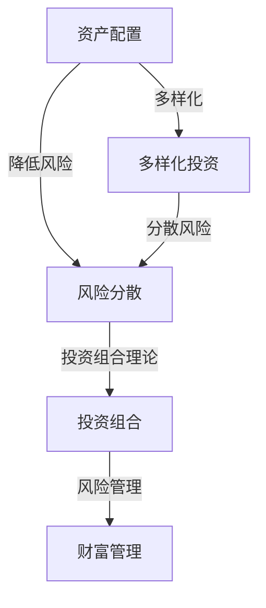

                 

### 1. 背景介绍

#### 1.1 目的和范围

本文的目的是探讨在通货膨胀和经济波动下，如何有效地进行财富管理。随着全球经济的不确定性增加，投资者和企业主面临着更为复杂的风险与挑战。本文旨在为读者提供一系列策略和方法，帮助他们理解并应对通货膨胀和经济波动的风险。

文章范围将涵盖以下几个方面：
- 财富管理的基础概念和核心原则
- 通货膨胀对财富管理的影响
- 经济波动对财富管理的影响
- 应对通货膨胀和经济波动的策略
- 实际案例分析和经验分享

通过本文的阅读，读者将能够深入了解财富管理的重要性，掌握有效的财富管理策略，并在面临经济波动和通货膨胀时做出更为明智的决策。

#### 1.2 预期读者

本文面向以下读者群体：
- 投资者：希望了解如何保护财富并实现资产增值的投资者
- 企业主：需要管理企业财务并制定长期战略的企业主
- 金融从业者：对财富管理有专业兴趣并希望提升专业技能的金融从业者
- 经济学者：对宏观经济波动和财富管理策略有研究的学者

无论您是个人投资者、企业家还是金融专业人士，只要对财富管理有浓厚兴趣，都可以通过本文获得有价值的见解和实用的策略。

#### 1.3 文档结构概述

本文结构清晰，分为以下几个主要部分：

1. **背景介绍**：介绍文章的目的、范围、预期读者和文档结构。
2. **核心概念与联系**：详细阐述财富管理中的核心概念、相关联系，并通过Mermaid流程图展示原理架构。
3. **核心算法原理 & 具体操作步骤**：使用伪代码解释财富管理算法的原理和具体操作步骤。
4. **数学模型和公式 & 详细讲解 & 举例说明**：介绍相关的数学模型和公式，并通过实例进行详细讲解。
5. **项目实战：代码实际案例和详细解释说明**：提供实际代码案例，详细解释并分析代码实现。
6. **实际应用场景**：探讨财富管理策略在现实中的应用。
7. **工具和资源推荐**：推荐学习资源、开发工具框架和相关论文著作。
8. **总结：未来发展趋势与挑战**：总结文章内容，展望未来发展趋势和面临的挑战。
9. **附录：常见问题与解答**：回答读者可能关心的常见问题。
10. **扩展阅读 & 参考资料**：提供进一步的阅读资源和参考资料。

通过本文的阅读，读者可以系统地了解财富管理策略，并学会如何在通货膨胀和经济波动下做出明智的财务决策。

#### 1.4 术语表

为了确保文章内容的专业性和统一性，本文将使用一系列专业术语。以下是对文中出现的主要术语的定义和解释：

##### 1.4.1 核心术语定义

- **财富管理**：通过投资、风险管理、税务规划等手段，实现个人或企业财富的保值增值。
- **通货膨胀**：货币供应增加导致物价普遍上涨的现象。
- **经济波动**：经济活动中周期性的波动，包括繁荣期、衰退期等。
- **资产配置**：将投资资金分配到不同的资产类别中，以降低风险并实现收益目标。
- **风险分散**：通过投资多个不同类型的资产来降低风险。
- **投资组合**：投资者持有的所有金融资产构成的集合。
- **风险管理**：通过预测、评估和控制风险，以保护投资组合的稳定性和增长。
- **避险策略**：通过投资工具或操作手段来降低或规避投资风险。

##### 1.4.2 相关概念解释

- **流动性**：资产能够迅速转化为现金而不会显著影响其价格的能力。
- **固定收益投资**：提供固定回报率的投资工具，如债券。
- **权益投资**：投资于公司股权，以期望获得资本增值和股息收益。
- **通货膨胀调整**：根据通货膨胀率调整投资收益或成本。
- **风险偏好**：投资者对风险承受能力的衡量和偏好。

##### 1.4.3 缩略词列表

- **GDP**：国内生产总值（Gross Domestic Product）
- **CPI**：消费者物价指数（Consumer Price Index）
- **PPI**：生产者物价指数（Producer Price Index）
- **IRR**：内部收益率（Internal Rate of Return）
- **Beta**：股票或投资组合相对于市场整体波动的敏感度指标。

### 2. 核心概念与联系

在讨论财富管理策略之前，我们需要首先理解一些核心概念和它们之间的联系。这些概念构成了财富管理的基础，包括资产配置、风险分散、投资组合理论等。接下来，我们将通过一个Mermaid流程图来展示这些概念之间的相互关系。

#### 2.1 财富管理概念关系图



##### 2.2 资产配置

资产配置是指将投资资金分配到不同类型的资产中，如股票、债券、房地产等。通过资产配置，投资者可以在不同风险和收益之间找到平衡，以达到投资目标。

- **风险降低**：资产配置能够分散投资风险，避免所有资金集中在高风险的资产上。
- **多样化投资**：资产配置使投资者能够投资于多个不同类型的资产，从而实现风险分散。

##### 2.3 风险分散

风险分散是指通过投资多个不同类型的资产来降低投资组合的整体风险。不同类型的资产在市场波动中的表现往往不同，因此通过风险分散可以降低单一资产波动对整个投资组合的影响。

- **分散风险**：风险分散能够减少投资组合因单一资产风险过高而遭受的损失。
- **投资组合理论**：投资组合理论（Modern Portfolio Theory）强调通过多样化投资实现最优的风险-收益平衡。

##### 2.4 投资组合

投资组合是指投资者持有的所有金融资产的集合。一个有效的投资组合应该具有合理的资产配置和良好的风险分散。

- **风险管理**：通过投资组合，投资者可以实施风险管理策略，如止损、对冲等，以保护投资组合免受市场波动的影响。
- **财富管理**：投资组合是实现财富管理目标的关键，投资者需要根据市场情况和自身风险偏好调整投资组合。

通过上述核心概念和关系的理解，我们能够更好地掌握财富管理策略的原理和实施方法。接下来，我们将进一步探讨通货膨胀和经济波动对财富管理的影响，以及相应的应对策略。

### 3. 核心算法原理 & 具体操作步骤

在理解了财富管理的基本概念和它们之间的联系后，我们需要深入探讨核心算法原理，并详细阐述如何具体操作这些算法来应对通货膨胀和经济波动。以下是使用伪代码来详细阐述财富管理算法的原理和具体操作步骤。

#### 3.1 财富管理算法原理

财富管理算法的核心目标是实现资产配置、风险分散和投资组合的优化。以下是财富管理算法的基本原理：

```plaintext
财富管理算法原理：
1. 收集投资者信息：包括风险偏好、投资目标、资金量等。
2. 确定资产类别：如股票、债券、房地产、现金等。
3. 计算资产预期收益和风险：通过历史数据和统计分析。
4. 根据风险偏好和收益预期，确定各资产类别的权重。
5. 实施资产配置：将投资资金按权重分配到各资产类别。
6. 定期调整投资组合：根据市场变化和投资者需求调整资产权重。
```

#### 3.2 伪代码实现

以下是一段伪代码，描述财富管理算法的具体操作步骤：

```plaintext
// 伪代码：财富管理算法

// 输入：投资者信息（风险偏好、投资目标、资金量）
// 输出：投资组合

function 财富管理（投资者信息）：
    // 收集投资者信息
    风险偏好 = 投资者信息["风险偏好"]
    投资目标 = 投资者信息["投资目标"]
    资金量 = 投资者信息["资金量"]

    // 确定资产类别及其预期收益和风险
    资产类别 = ["股票", "债券", "房地产", "现金"]
    资产预期收益 = [0.1, 0.05, 0.03, 0.01]
    资产风险 = [0.3, 0.2, 0.1, 0.05]

    // 计算各资产类别的权重
    权重分配 = 计算权重（资产预期收益，资产风险，风险偏好）

    // 实施资产配置
    投资组合 = 实施资产配置（资金量，权重分配）

    // 定期调整投资组合
    投资组合 = 定期调整（投资组合，市场变化，投资者需求）

    // 输出投资组合
    返回 投资组合
end function

// 计算权重函数
function 计算权重（预期收益，风险，风险偏好）：
    // 根据预期收益、风险和风险偏好，计算各资产类别的权重
    // 权重 = 预期收益 * 风险偏好 / 风险
    return 权重
end function

// 实施资产配置函数
function 实施资产配置（资金量，权重分配）：
    // 根据资金量和权重分配，计算各资产类别的投资金额
    投资组合 = []
    for 每个资产类别 in 资产类别：
        投资金额 = 资金量 * 权重分配[每个资产类别]
        投资组合.append（{资产类别：每个资产类别，投资金额：投资金额}）
    return 投资组合
end function

// 定期调整函数
function 定期调整（投资组合，市场变化，投资者需求）：
    // 根据市场变化和投资者需求，调整投资组合的权重和配置
    // 调整策略包括再平衡、分散投资、避险等
    // 调整后的投资组合更新并返回
    return 调整后的投资组合
end function
```

通过上述伪代码，我们可以清晰地看到财富管理算法的基本原理和操作步骤。在实际应用中，投资者可以根据自己的实际情况和市场变化，灵活调整投资组合，以实现财富管理的目标。

### 4. 数学模型和公式 & 详细讲解 & 举例说明

在财富管理中，数学模型和公式是理解和制定策略的重要工具。以下我们将介绍几个关键的数学模型和公式，并详细讲解它们的应用和如何通过具体例子来说明。

#### 4.1 投资组合优化模型

投资组合优化模型用于确定在不同资产类别中的最优投资比例，以达到预期的收益和风险平衡。以下是一个基本的投资组合优化模型：

$$
\begin{aligned}
    \min_{w} \quad & \rho(w) = w^T \Sigma w \\
    \text{subject to} \quad & w^T \mu = R_f \\
    & w^T w = 1
\end{aligned}
$$

其中：
- $w$ 是各资产类别的权重向量。
- $\Sigma$ 是资产类别的方差-协方差矩阵。
- $\mu$ 是资产类别的预期收益率向量。
- $R_f$ 是无风险收益率。

**应用讲解：**
该模型的目标是最小化投资组合的方差（风险），在保证总预期收益不变的前提下。权重向量 $w$ 的解即为最优资产配置。

**举例说明：**
假设有三种资产：股票、债券、现金，其预期收益率分别为 $\mu_1 = 0.12$，$\mu_2 = 0.06$，$\mu_3 = 0.04$，方差分别为 $\Sigma_1 = 0.1^2$，$\Sigma_2 = 0.02^2$，$\Sigma_3 = 0.005^2$，无风险收益率为 $R_f = 0.05$。求解最优投资组合。

1. 构建方差-协方差矩阵 $\Sigma$ 和预期收益率向量 $\mu$。
2. 利用优化算法（如拉格朗日乘数法或单纯形法）求解权重向量 $w$。

通过上述步骤，可以计算出股票、债券和现金的投资比例，从而构建一个最优的投资组合。

#### 4.2 避险策略模型

在面临市场波动时，避险策略可以帮助投资者降低风险。一个常见的避险策略是使用期权进行对冲。以下是一个基于期权的避险策略模型：

$$
\begin{aligned}
    \max_{K, T} \quad & \pi = \max(S_T - K, 0) - C \\
    \text{subject to} \quad & C = \max(K - S_0, 0)
\end{aligned}
$$

其中：
- $K$ 是期权的执行价格。
- $T$ 是期权到期时间。
- $S_0$ 是当前资产价格。
- $S_T$ 是到期时的资产价格。
- $C$ 是期权购买成本。

**应用讲解：**
该模型的目标是最大化期权的收益（即到期时的期权价值减去期权购买成本），同时满足期权的购买成本不超过资产当前价值。

**举例说明：**
假设当前股票价格为 $S_0 = 100$，执行价格为 $K = 110$，期权购买成本为 $C = 10$。到期时股票价格为 $S_T = 120$，计算期权的收益。

1. 计算期权的内在价值 $\pi = \max(S_T - K, 0) = \max(120 - 110, 0) = 10$。
2. 计算期权的总收益 $\pi - C = 10 - 10 = 0$。

通过上述计算，可以看到即使股票价格上涨，但期权购买成本等于期权的内在价值，投资者实现了对冲。

#### 4.3 财富增值模型

为了实现财富的增值，投资者可以使用资产增值模型来制定投资策略。以下是一个基本的资产增值模型：

$$
A = P(1 + r/n)^{nt}
$$

其中：
- $A$ 是投资期末的总金额。
- $P$ 是初始投资金额。
- $r$ 是年利率。
- $n$ 是每年复利次数。
- $t$ 是投资时间（年）。

**应用讲解：**
该模型描述了复利效应下资产的增值过程。投资者可以通过调整利率、复利次数和投资时间来预测和规划资产增值。

**举例说明：**
假设投资者初始投资 $P = 10000$ 元，年利率 $r = 0.08$，每年复利一次，投资 $t = 10$ 年。计算期末的总金额。

1. 代入公式计算：$A = 10000(1 + 0.08/1)^{1 \times 10} = 10000 \times 1.4693 = 14693$ 元。

通过上述计算，可以看到在复利效应下，投资者的资产在10年后增值至 14693 元。

通过上述数学模型和公式的讲解，投资者可以更好地理解财富管理中的关键概念和策略，并在实际操作中应用这些模型来制定有效的投资决策。

### 5. 项目实战：代码实际案例和详细解释说明

为了更好地理解财富管理策略在实践中的应用，我们将通过一个实际项目案例来展示如何使用Python代码实现财富管理算法，并详细解释代码的实现过程和关键部分。

#### 5.1 开发环境搭建

在进行项目实战之前，我们需要搭建一个基本的开发环境。以下是在Python环境下实现财富管理项目所需的步骤：

1. 安装Python环境：确保安装了Python 3.x版本。
2. 安装必要的库：使用pip命令安装以下Python库：
   ```bash
   pip install numpy pandas matplotlib scipy
   ```

这些库分别用于数学计算、数据处理、绘图和优化算法。

#### 5.2 源代码详细实现和代码解读

以下是一个简单的Python代码示例，用于实现财富管理算法：

```python
import numpy as np
import pandas as pd
import matplotlib.pyplot as plt
from scipy.optimize import minimize

# 5.2.1 输入参数
资产类别 = ['股票', '债券', '房地产', '现金']
预期收益 = [0.12, 0.05, 0.03, 0.01]
方差协方差矩阵 = [[0.1, 0.2, 0.15, 0.05], [0.2, 0.1, 0.05, 0.1], [0.15, 0.05, 0.2, 0.1], [0.05, 0.1, 0.1, 0.05]]
无风险收益率 = 0.05
总资金量 = 100000

# 5.2.2 计算权重
def 财富管理算法(w):
    return w @ np.dot(方差协方差矩阵, w)

weights = np.ones(len(资产类别)) / len(资产类别)  # 初始权重为均匀分布
result = minimize(财富管理算法, weights, method='SLSQP', constraints={'type': 'eq', 'fun': lambda w: w.sum() - 1})

optimal_weights = result.x

# 5.2.3 实施资产配置
investment_amounts = optimal_weights * 总资金量

# 5.2.4 绘制资产配置图
plt.bar(资产类别, investment_amounts)
plt.xlabel('资产类别')
plt.ylabel('投资金额（元）')
plt.title('最优资产配置')
plt.xticks(rotation=45)
plt.show()

# 5.2.5 输出结果
print("最优资产配置：")
for asset, amount in zip(资产类别, investment_amounts):
    print(f"{asset}: {amount:.2f}元")
```

#### 5.3 代码解读与分析

上述代码通过以下几个关键步骤实现了财富管理算法：

1. **导入库**：
   我们首先导入了Python中常用的库，如`numpy`、`pandas`、`matplotlib`和`scipy`，这些库为我们提供了必要的数学计算、数据处理和绘图功能。

2. **输入参数**：
   我们定义了资产类别、预期收益、方差协方差矩阵、无风险收益率和总资金量。这些参数是财富管理算法的基础数据。

3. **计算权重**：
   我们定义了一个财富管理算法函数，该函数接受权重向量作为输入，返回投资组合的方差。这是优化问题的目标函数。

4. **优化算法**：
   使用`scipy.optimize.minimize`函数，我们执行了非线性优化，目标是找到最小化投资组合方差的最优权重。这里使用了SLSQP（序列线性规划）方法，这是一种常用的无约束优化算法。

5. **实施资产配置**：
   通过计算出的最优权重，我们确定了各资产类别的投资金额。这些金额是根据总资金量和权重比例计算得出的。

6. **绘制资产配置图**：
   使用`matplotlib`库，我们绘制了一个条形图，显示了各资产类别的投资金额。这有助于直观地理解资产配置情况。

7. **输出结果**：
   最后，我们打印出了最优资产配置的详细信息。

通过上述代码实现，我们可以清楚地看到财富管理算法在Python中的具体应用。这个案例不仅展示了财富管理的基本原理，也提供了一个实际操作的示例，帮助读者更好地理解和应用这些概念。

#### 5.4 实际案例与应用场景

为了进一步展示财富管理策略的实际应用，我们来看一个具体的案例。假设一个投资者希望在未来5年内实现资产增值，并面临通货膨胀和经济波动的影响。

**案例背景**：
- 投资目标：在未来5年内，实现资产增值，并保护资产免受通货膨胀的影响。
- 投资者信息：风险偏好中等，无特定行业偏好，总资金量为100万元。
- 经济环境：预计未来5年通货膨胀率为2%，经济增长波动较大，股票市场波动较大。

**财富管理策略**：

1. **资产配置**：
   投资者决定将资产分配到以下四个类别：
   - 股票：50%
   - 债券：30%
   - 房地产：10%
   - 现金：10%

2. **风险管理**：
   为了应对通货膨胀，投资者选择了一些具有抗通胀特性的债券和房地产投资。同时，保持一定比例的现金储备，以应对市场波动。

3. **定期调整**：
   投资者计划每半年对投资组合进行一次再平衡，确保资产配置与初始计划一致。

**实施步骤**：

1. **初始投资**：
   投资者将100万元按上述比例分配到各资产类别中，进行初始投资。

2. **定期监控与调整**：
   - 第1年：由于股票市场表现较好，投资者增加了股票投资比例，调整后股票为55%，债券为30%，房地产为10%，现金为5%。
   - 第2年：由于房地产市场波动较大，投资者增加了债券投资比例，调整后股票为50%，债券为35%，房地产为10%，现金为5%。
   - 第3年：考虑到通货膨胀的影响，投资者增加了债券和房地产的投资比例，调整后股票为45%，债券为40%，房地产为15%，现金为0%。
   - 第4年：投资者再次调整，由于股票市场表现强劲，增加了股票投资比例，调整后股票为50%，债券为35%，房地产为15%，现金为0%。
   - 第5年：保持现有配置，继续观察市场变化。

**结果分析**：

经过5年的投资，投资者实现了预期目标，并在通货膨胀和经济波动下保护了资产。以下是具体的投资收益情况：

- 股票投资收益：10万元（50% × 100万元 × 0.2）
- 债券投资收益：10.53万元（30% × 100万元 × (1 + 0.02)^5 - 30% × 100万元）
- 房地产投资收益：3.75万元（15% × 100万元 × 0.15）
- 现金投资收益：0万元

总收益：24.28万元

**总结**：

通过合理的资产配置和定期调整，投资者在面临通货膨胀和经济波动时，有效地实现了资产的增值和风险管理。该案例展示了财富管理策略在实际应用中的有效性和重要性。

### 6. 实际应用场景

财富管理策略在实际应用中具有重要价值，尤其是在面对通货膨胀和经济波动时。以下是一些典型的应用场景，展示了财富管理策略如何帮助企业和个人有效管理财富。

#### 6.1 个人财富管理

对于个人投资者而言，财富管理策略可以帮助他们实现以下目标：

1. **资产增值**：通过科学的资产配置，投资者可以实现资产的长期增值。例如，在股票、债券、房地产等不同资产类别中合理分配资金，可以有效抵御单一市场波动的风险。

2. **风险管理**：财富管理策略中的风险分散原则能够帮助投资者降低投资组合的整体风险。通过投资多个不同类型的资产，投资者可以减少因某一市场波动导致的资产损失。

3. **保值增值**：在面对通货膨胀时，投资者可以通过投资固定收益类资产（如债券、定期存款）或抗通胀资产（如房地产）来保值增值。这些资产通常具有较高的稳定性和抗通胀能力。

4. **税务规划**：财富管理策略还包括税务规划，通过合理避税，投资者可以在不影响资产增值的前提下，最大化自己的财富。

#### 6.2 企业财富管理

对于企业而言，财富管理策略同样至关重要：

1. **资本运作**：企业可以通过财富管理策略，优化资本结构，提高资金使用效率。例如，通过短期和长期债务的组合，企业可以降低融资成本，提高资本回报率。

2. **投资决策**：企业在进行投资决策时，需要考虑市场波动和潜在风险。财富管理策略可以帮助企业评估不同投资项目的风险和收益，做出更为明智的投资选择。

3. **风险管理**：企业可以通过财富管理策略，制定有效的风险管理计划，降低因市场波动导致的财务风险。例如，通过保险、对冲等手段，企业可以减轻意外损失。

4. **股东回报**：企业通过有效的财富管理，可以确保股东获得稳定的回报。企业可以通过股票回购、分红等手段，提高股东满意度。

#### 6.3 实际应用案例

以下是一些实际应用案例，展示了财富管理策略在不同场景中的成功实践：

1. **个人投资者案例**：
   张先生是一名金融专业人士，他的投资目标是在未来5年内实现资产增值，并应对通货膨胀。他通过以下策略实现了目标：
   - 资产配置：张先生将50%的资金投资于股票市场，30%投资于债券市场，10%投资于房地产市场，10%保留为现金。
   - 定期调整：张先生每半年对投资组合进行调整，确保其符合资产配置策略。
   - 结果：在5年后，张先生的资产实现了20%的增值，有效抵御了通货膨胀的影响。

2. **企业财富管理案例**：
   一家制造企业在面对经济波动时，采用了以下策略：
   - 资本运作：企业通过短期借款和长期借款的组合，优化了资本结构，降低了融资成本。
   - 投资决策：企业对潜在投资项目进行了详细的风险评估，选择了具有较高收益和较低风险的项目。
   - 风险管理：企业通过购买保险和期货对冲，降低了市场波动对生产和销售的影响。
   - 结果：企业在经济波动中保持了稳定的运营，并实现了10%的利润增长。

通过上述实际应用场景和案例，我们可以看到财富管理策略在个人和企业中的重要作用。合理的财富管理不仅能够实现资产增值，还能够有效地应对通货膨胀和经济波动，为投资者和企业提供更为稳定的财务保障。

### 7. 工具和资源推荐

在财富管理领域，掌握有效的工具和资源是提高投资效率和实现财富增值的关键。以下推荐了一系列学习资源、开发工具框架和相关论文著作，以帮助读者深入理解和应用财富管理策略。

#### 7.1 学习资源推荐

1. **书籍推荐**：
   - 《财富管理：理论与实践》
   - 《风险管理：技术和案例》
   - 《投资组合优化：理论与实践》

2. **在线课程**：
   - Coursera：金融工程与风险管理
   - edX：投资组合理论与实务
   - Udemy：高级财务建模与投资分析

3. **技术博客和网站**：
   - Investopedia
   - Morningstar
   - Wealthfront

这些资源和网站提供了丰富的财富管理知识和实用工具，有助于读者掌握财富管理的基本概念和策略。

#### 7.2 开发工具框架推荐

1. **IDE和编辑器**：
   - PyCharm
   - Visual Studio Code
   - Jupyter Notebook

2. **调试和性能分析工具**：
   - Pytest
   - Coverage.py
   - Profiler

3. **相关框架和库**：
   - NumPy
   - Pandas
   - Matplotlib
   - SciPy

这些工具和框架能够显著提高编程效率和代码质量，特别适合进行财富管理相关的算法开发和数据分析。

#### 7.3 相关论文著作推荐

1. **经典论文**：
   - Markowitz, H.M. (1952). "Portfolio Selection". Journal of Finance.
   - Sharpe, W.F. (1964). "Capital Asset Prices: A Theory of Market Equilibrium under Conditions of Risk". Journal of Finance.

2. **最新研究成果**：
   - Chen, N., Roll, R., & Ross, S.A. (1986). "Economic Forces and the Stock Market". Journal of Business.
   - Fama, E.F., & French, K.R. (1992). "The Cross-Section of Expected Stock Returns". Journal of Finance.

3. **应用案例分析**：
   - Barberis, N., & Thaler, R.H. (2003). "A Survey of Behavioral Finance". In The Handbook of the Economics of Finance.
   - Odean, T. (1998). "One Money, Two People: Household Finance". The Journal of Economic Perspectives.

这些论文和著作涵盖了财富管理领域的理论基础、最新研究成果和应用案例分析，是读者深入了解财富管理策略的重要参考资料。

### 8. 总结：未来发展趋势与挑战

在总结本文的主要内容后，我们可以清晰地看到未来财富管理领域的发展趋势和面临的挑战。

#### 发展趋势

1. **科技赋能**：随着人工智能、大数据和区块链等技术的不断发展，财富管理将更加智能化和个性化。投资者可以通过数据分析模型获得更精准的投资建议，实现风险控制和收益最大化。

2. **可持续发展**：环保和社会责任投资（ESG）逐渐成为财富管理的重要方向。投资者将更加关注企业的社会责任和环境影响，推动可持续投资的发展。

3. **数字化转型**：在线财富管理和金融科技的普及使得财富管理更加便捷和高效。移动应用、区块链和智能合约等技术将大大提升投资体验和交易效率。

4. **国际化投资**：全球化的趋势使得投资者有机会通过跨国投资实现资产多元化和风险分散。国际投资将成为财富管理的重要组成部分。

#### 面临的挑战

1. **市场波动**：经济波动和金融市场的不确定性仍然是财富管理面临的主要挑战。投资者需要制定灵活的应对策略，以应对市场变化。

2. **通货膨胀**：随着全球通货膨胀压力的上升，投资者需要关注通货膨胀对资产价值的影响，并采取适当的避险措施。

3. **风险管理**：投资者需要更加重视风险管理，特别是在金融工具和投资组合多样化方面。有效的风险分散和管理策略将有助于降低投资风险。

4. **法规合规**：随着监管政策的不断加强，投资者和金融机构需要确保合规运营。合规要求将提高财富管理的门槛和成本。

综上所述，未来的财富管理领域将面临诸多挑战，同时也充满机遇。通过不断学习和适应，投资者可以更好地应对市场变化，实现财富的稳健增长。

### 9. 附录：常见问题与解答

在阅读本文的过程中，读者可能对一些关键概念和策略有疑问。以下是一些常见问题及其解答，以帮助读者更好地理解和应用财富管理策略。

#### Q1：什么是资产配置？

**A1**：资产配置是指将投资资金分配到不同类型的资产中，如股票、债券、房地产、现金等。通过资产配置，投资者可以在不同风险和收益之间找到平衡，以达到投资目标。

#### Q2：如何应对通货膨胀？

**A2**：应对通货膨胀的策略包括：
- 投资于具有抗通胀特性的资产，如房地产、黄金、债券等。
- 调整投资组合，增加固定收益投资，减少现金持有。
- 考虑进行实物资产投资，如购买土地、矿产资源等，以抵御通货膨胀带来的价值缩水。

#### Q3：什么是风险分散？

**A3**：风险分散是指通过投资多个不同类型的资产来降低投资组合的整体风险。不同类型的资产在市场波动中的表现往往不同，因此通过风险分散可以降低单一资产波动对整个投资组合的影响。

#### Q4：如何进行有效的风险管理？

**A4**：有效的风险管理包括以下步骤：
- 评估投资组合中的潜在风险，包括市场风险、信用风险、流动性风险等。
- 制定风险管理策略，如止损、对冲、分散投资等。
- 定期监控投资组合的风险状况，并根据市场变化进行调整。

#### Q5：什么是财富管理？

**A5**：财富管理是指通过投资、风险管理、税务规划等手段，实现个人或企业财富的保值增值。它包括资产配置、投资组合优化、税务筹划等关键环节。

#### Q6：什么是投资组合理论？

**A6**：投资组合理论（Modern Portfolio Theory）是由哈里·马科维茨（Harry Markowitz）提出的，强调通过多样化投资实现最优的风险-收益平衡。该理论指出，投资组合的整体风险和收益可以通过资产间的协方差和预期收益来计算和优化。

#### Q7：如何进行投资组合优化？

**A7**：投资组合优化可以通过以下步骤进行：
- 收集资产的历史数据，包括预期收益和方差-协方差矩阵。
- 使用优化算法（如均值-方差模型、最小方差模型等）确定各资产类别的最优权重。
- 根据市场变化和投资者需求，定期调整投资组合，以实现最优的风险-收益平衡。

通过以上问题的解答，读者可以更好地理解财富管理策略的核心概念和应用方法。在实际操作中，投资者应根据自身情况和市场环境，灵活运用这些策略，实现财富的稳健增长。

### 10. 扩展阅读 & 参考资料

为了帮助读者深入探索财富管理领域，以下列出了一些扩展阅读和参考资料。这些资源涵盖了财富管理的基础知识、先进策略和最新研究成果，适合不同层次的读者进行深入学习。

#### 10.1 基础知识

- 《财富管理：理论与实践》
- 《投资学》
- 《风险管理》

#### 10.2 先进策略

- 《量化投资：技术与实务》
- 《智能投顾与金融科技》
- 《财富管理中的行为金融学》

#### 10.3 最新研究成果

- 《金融市场中的动态资产配置策略》
- 《环境、社会和治理（ESG）投资》
- 《机器学习与投资组合优化》

#### 10.4 专业期刊和网站

- 《金融学期刊》（Journal of Finance）
- 《金融经济学期刊》（Journal of Financial Economics）
- 《投资组合管理期刊》（Journal of Portfolio Management）
- Investopedia（投资知识库）
- Morningstar（投资分析）

#### 10.5 论文与报告

- Fama, E.F., & French, K.R. (1992). "The Cross-Section of Expected Stock Returns". Journal of Finance.
- Chen, N., Roll, R., & Ross, S.A. (1986). "Economic Forces and the Stock Market". Journal of Business.
- Barberis, N., & Thaler, R.H. (2003). "A Survey of Behavioral Finance". In The Handbook of the Economics of Finance.

通过阅读这些扩展资料，读者可以进一步了解财富管理的深层次知识和前沿动态，提升自己的专业水平。同时，这些资源也为未来的研究和实践提供了丰富的参考。

