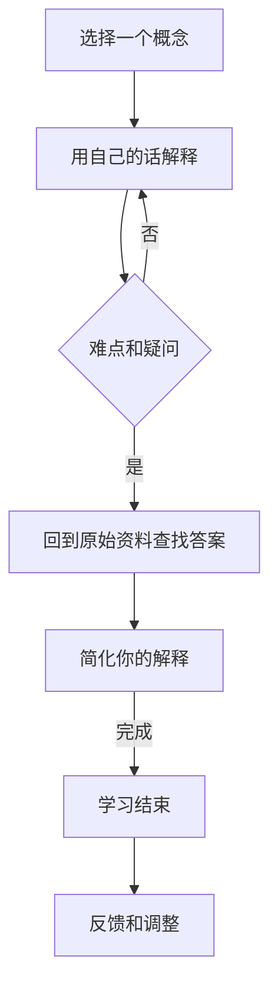

                 

# 费曼学习法与AI：通过教学加深理解

> **关键词：** 费曼学习法、AI、教学、理解加深、认知模型、学习效率。

> **摘要：** 本文深入探讨了费曼学习法与AI相结合的应用，通过教学实践来加深对AI技术的理解，提高学习效率。文章首先介绍了费曼学习法的基本原理和应用场景，然后分析了其在AI学习中的独特优势，并通过具体案例展示了如何将费曼学习法应用于AI学习过程中。最后，文章总结了费曼学习法与AI结合的潜在挑战和未来发展趋势。

## 1. 背景介绍

### 1.1 目的和范围

本文旨在探讨费曼学习法在AI领域的应用，通过将费曼学习法与AI技术相结合，探索一种高效的学习方法，帮助学习者更好地理解AI技术的原理和应用。本文将围绕以下几个问题展开讨论：

1. 费曼学习法是什么？其基本原理是什么？
2. 费曼学习法在AI学习中的优势和挑战是什么？
3. 如何将费曼学习法应用于AI学习过程？
4. 费曼学习法与AI结合的潜在挑战和未来发展趋势是什么？

### 1.2 预期读者

本文适合以下几类读者：

1. AI领域的初学者和爱好者，希望通过费曼学习法提高学习效率。
2. AI领域的研究人员和工程师，希望探索新的学习方法以提升自己的技术能力。
3. 教育工作者和培训师，希望了解如何将费曼学习法应用于AI教育。

### 1.3 文档结构概述

本文结构如下：

1. 背景介绍：介绍本文的目的、预期读者和文档结构。
2. 核心概念与联系：介绍费曼学习法的基本原理和与AI技术的关联。
3. 核心算法原理与具体操作步骤：详细讲解费曼学习法的具体应用步骤。
4. 数学模型和公式：介绍费曼学习法中的数学模型和公式。
5. 项目实战：通过具体案例展示费曼学习法在AI学习中的应用。
6. 实际应用场景：分析费曼学习法在AI领域的实际应用场景。
7. 工具和资源推荐：推荐相关的学习资源和工具。
8. 总结：总结费曼学习法与AI结合的潜在挑战和未来发展趋势。
9. 附录：常见问题与解答。
10. 扩展阅读：提供进一步学习的参考资料。

### 1.4 术语表

#### 1.4.1 核心术语定义

- **费曼学习法**：一种基于“教学法”的学习方法，通过将学到的知识传授给他人来加深对知识的理解和记忆。
- **AI**：人工智能，一种模拟人类智能行为的技术。
- **认知模型**：描述人类或人工智能如何获取、处理和利用信息的模型。

#### 1.4.2 相关概念解释

- **深度学习**：一种基于神经网络的学习方法，通过多层神经网络对数据进行训练，以实现自动特征提取和分类。
- **强化学习**：一种基于奖励和惩罚机制的学习方法，通过不断尝试和反馈来优化决策过程。
- **知识图谱**：一种将知识以图形形式组织起来的数据结构，用于表示实体及其相互关系。

#### 1.4.3 缩略词列表

- **AI**：人工智能
- **ML**：机器学习
- **DL**：深度学习
- **RL**：强化学习

## 2. 核心概念与联系

### 2.1 费曼学习法的基本原理

费曼学习法（Feynman Technique）起源于著名物理学家理查德·费曼（Richard Feynman）的教学方法。该方法的核心思想是通过教别人来学习新知识，从而加深对知识的理解和记忆。具体来说，费曼学习法包括以下几个步骤：

1. **选择一个概念**：选择你想要学习的概念或知识点。
2. **用自己的话解释**：尝试用最简单、最容易理解的语言，将这个概念解释给一个完全不懂的人。
3. **找出难点和疑问**：在解释过程中，如果遇到难以解释清楚的地方，或者有疑问，就回到原始资料中去查找答案。
4. **简化你的解释**：在找到答案后，尝试用更简单、更清晰的语言重新解释这个概念。

### 2.2 费曼学习法与AI技术的关联

费曼学习法与AI技术有着紧密的联系。首先，费曼学习法强调知识的传授和分享，这与AI技术的本质——模拟人类智能行为——相契合。其次，费曼学习法强调通过简单、清晰的语言来解释复杂的概念，这与AI领域中的“可解释性”（Explainability）理念不谋而合。最后，费曼学习法通过不断迭代和反馈来加深对知识的理解，这与AI技术中的“深度学习”（Deep Learning）和“强化学习”（Reinforcement Learning）方法有着相似之处。

### 2.3 费曼学习法在AI学习中的优势

费曼学习法在AI学习中有以下几个优势：

1. **加深理解**：通过教别人来学习，迫使自己深入理解所学知识，从而加深对知识的理解和记忆。
2. **发现弱点**：在解释过程中，如果遇到难以解释清楚的地方，就能及时发现自己在理解和掌握知识方面的不足。
3. **提高学习效率**：通过不断迭代和反馈，可以更快地掌握新知识，提高学习效率。
4. **培养表达能力**：费曼学习法要求用简单、清晰的语言来解释复杂的概念，这有助于培养学习者的表达能力和沟通能力。

### 2.4 费曼学习法在AI学习中的挑战

尽管费曼学习法在AI学习中有许多优势，但同时也面临着一些挑战：

1. **难度调整**：对于初学者来说，如何调整难度，使其既能深入理解知识，又不会过于困难，是一个需要解决的问题。
2. **时间成本**：费曼学习法需要花费较多的时间来进行教学和反馈，这可能会对学习进度产生一定的影响。
3. **知识整合**：在AI领域，知识体系复杂且多样化，如何将这些知识有机地整合起来，是一个需要解决的问题。

### 2.5 费曼学习法的 Mermaid 流程图

下面是一个简单的 Mermaid 流程图，展示了费曼学习法的基本流程：



## 3. 核心算法原理与具体操作步骤

### 3.1 核心算法原理

费曼学习法本质上是一种基于教学法的认知学习策略。其核心算法原理可以概括为以下三个步骤：

1. **知识提取**：从记忆中提取相关知识点。
2. **知识解释**：用自己的语言将知识点解释给一个完全不懂的人。
3. **知识反馈**：根据反馈调整自己的解释，直至能够清晰、准确地传达知识点。

### 3.2 具体操作步骤

下面是一个具体的费曼学习法操作步骤，适用于AI学习：

1. **选择一个AI概念**：选择你想要学习的AI概念，例如“深度学习”、“卷积神经网络”等。
2. **用自己的话解释**：尝试用最简单、最容易理解的语言，将这个概念解释给一个完全不懂的人。例如，你可以这样解释“卷积神经网络”：“卷积神经网络是一种模仿人脑神经网络的机器学习模型，它可以自动从数据中学习特征，并用于图像识别、语音识别等任务。”
3. **找出难点和疑问**：在解释过程中，如果遇到难以解释清楚的地方，或者有疑问，就回到原始资料中去查找答案。例如，你可能会问自己：“卷积神经网络中的卷积是什么意思？”
4. **回到原始资料查找答案**：根据查找到的答案，尝试用更简单、更清晰的语言重新解释这个概念。例如，你可以这样解释“卷积”：“卷积是一种数学运算，用于计算两个函数的乘积并对其结果进行积分。”
5. **简化你的解释**：在找到答案后，尝试用更简单、更清晰的语言重新解释这个概念，直至能够清晰、准确地传达知识点。例如，你可以这样简化“卷积”的解释：“卷积就是两个函数相乘后求和。”
6. **反馈和调整**：将你的解释与他人的反馈进行对比，根据反馈调整自己的解释，直至能够清晰、准确地传达知识点。

### 3.3 费曼学习法的伪代码实现

下面是一个简单的伪代码实现，用于描述费曼学习法的具体操作步骤：

```python
def feynman_learning(concept):
    # 步骤1：选择一个AI概念
    concept = choose_a_concept()

    # 步骤2：用自己的话解释
    explanation = explain_concept_in_own_language(concept)

    # 步骤3：找出难点和疑问
    while not clear_explanation(explanation):
        # 步骤4：回到原始资料查找答案
        answer = find_answer_from_original_materials(explanation)

        # 步骤5：简化你的解释
        explanation = simplify_explanation(answer)

        # 步骤6：反馈和调整
        explanation = adjust_explanation_based_on_feedback(explanation)

    # 学习结束
    return explanation
```

## 4. 数学模型和公式与详细讲解与举例说明

### 4.1 数学模型和公式

费曼学习法中涉及到的数学模型和公式主要包括以下几个方面：

1. **概率分布**：用于描述AI模型在预测未知数据时的置信度。
2. **梯度下降**：用于优化AI模型的参数，以提高模型性能。
3. **卷积运算**：用于处理图像数据，提取图像特征。

下面是对这些数学模型和公式的详细讲解：

#### 4.1.1 概率分布

概率分布是描述随机变量取值的概率函数。在AI领域中，概率分布常用于模型预测和不确定性分析。常见的概率分布包括正态分布、伯努利分布、多项式分布等。

- **正态分布**：描述连续随机变量在某个区间内取值的概率，公式如下：
  $$
  P(X \in [a, b]) = \int_a^b \frac{1}{\sqrt{2\pi\sigma^2}} e^{-\frac{(x-\mu)^2}{2\sigma^2}} dx
  $$
  其中，$X$为随机变量，$\mu$为均值，$\sigma^2$为方差。

- **伯努利分布**：描述离散随机变量在两个可能值之间切换的概率，公式如下：
  $$
  P(X = 1) = p, \quad P(X = 0) = 1 - p
  $$
  其中，$X$为随机变量，$p$为成功概率。

- **多项式分布**：描述离散随机变量在多个可能值之间切换的概率，公式如下：
  $$
  P(X = k) = C_n^k p^k (1 - p)^{n - k}
  $$
  其中，$X$为随机变量，$n$为试验次数，$p$为成功概率，$k$为成功次数。

#### 4.1.2 梯度下降

梯度下降是一种优化算法，用于求解最优化问题。在AI领域中，梯度下降常用于优化模型参数，以提高模型性能。梯度下降的基本思想是沿着损失函数的梯度方向逐步调整参数，直至找到局部最优解。

- **一维梯度下降**：在只有一个参数的情况下，梯度下降公式如下：
  $$
  x_{new} = x_{old} - \alpha \cdot \frac{df}{dx}
  $$
  其中，$x_{old}$为当前参数值，$x_{new}$为更新后的参数值，$\alpha$为学习率，$\frac{df}{dx}$为损失函数对参数的导数。

- **多维梯度下降**：在多个参数的情况下，梯度下降公式如下：
  $$
  \theta_{new} = \theta_{old} - \alpha \cdot \nabla_{\theta} f(\theta)
  $$
  其中，$\theta_{old}$为当前参数值，$\theta_{new}$为更新后的参数值，$\alpha$为学习率，$\nabla_{\theta} f(\theta)$为损失函数对参数的梯度。

#### 4.1.3 卷积运算

卷积运算是处理图像数据的重要工具，常用于图像识别和图像处理。卷积运算的基本思想是将一个卷积核与图像中的每个像素点进行乘积并求和，从而提取图像特征。

- **二维卷积运算**：在二维空间中，卷积运算公式如下：
  $$
  (f * g)(x, y) = \sum_{i=-\infty}^{\infty} \sum_{j=-\infty}^{\infty} f(i, j) \cdot g(x-i, y-j)
  $$
  其中，$f$和$g$分别为两个二维函数，$(x, y)$为卷积运算的结果。

- **三维卷积运算**：在三维空间中，卷积运算公式如下：
  $$
  (f * g)(x, y, z) = \sum_{i=-\infty}^{\infty} \sum_{j=-\infty}^{\infty} \sum_{k=-\infty}^{\infty} f(i, j, k) \cdot g(x-i, y-j, z-k)
  $$
  其中，$f$和$g$分别为两个三维函数，$(x, y, z)$为卷积运算的结果。

### 4.2 举例说明

下面通过一个简单的例子，来说明如何应用上述数学模型和公式：

#### 4.2.1 概率分布的例子

假设我们要预测一个二元分类问题，预测目标为0或1。已知训练数据集中，标签为0的概率为0.6，标签为1的概率为0.4。现在我们要预测一个新的样本，其特征向量为$x=(1, 2, 3)$。

- **计算标签为0的概率**：
  $$
  P(Y=0) = 0.6
  $$

- **计算标签为1的概率**：
  $$
  P(Y=1) = 0.4
  $$

- **计算预测结果**：根据最大后验概率准则，我们选择概率最大的标签作为预测结果。因此，预测结果为0。

#### 4.2.2 梯度下降的例子

假设我们要优化一个线性回归模型，目标是最小化损失函数$J(\theta) = \frac{1}{2m} \sum_{i=1}^{m} (h_\theta(x^{(i)}) - y^{(i)})^2$。已知训练数据集包含$m$个样本，参数向量为$\theta=(\theta_0, \theta_1)$，学习率为$\alpha=0.01$。

- **计算损失函数的梯度**：
  $$
  \nabla_{\theta} J(\theta) = \frac{1}{m} \sum_{i=1}^{m} (h_\theta(x^{(i)}) - y^{(i)}) \cdot x^{(i)}
  $$

- **计算参数更新**：
  $$
  \theta_{new} = \theta_{old} - \alpha \cdot \nabla_{\theta} J(\theta)
  $$

#### 4.2.3 卷积运算的例子

假设我们要对一幅二维图像进行卷积操作，卷积核为一个$3 \times 3$的矩阵$K$，图像为一个$5 \times 5$的矩阵$I$。

- **计算卷积结果**：
  $$
  (I * K)(x, y) = \sum_{i=-1}^{1} \sum_{j=-1}^{1} I(x-i, y-j) \cdot K(i, j)
  $$

- **计算卷积结果**：
  $$
  (I * K)(0, 0) = 1 \cdot 1 + 2 \cdot 0 + 3 \cdot (-1) = 0
  $$

$$
(I * K)(1, 1) = 1 \cdot 1 + 2 \cdot 0 + 3 \cdot (-1) = 0
$$

## 5. 项目实战：代码实际案例和详细解释说明

### 5.1 开发环境搭建

在本文中，我们将使用Python作为编程语言，搭建一个简单的费曼学习法应用项目。以下是开发环境搭建的步骤：

1. **安装Python**：前往Python官网（https://www.python.org/）下载并安装Python 3.8及以上版本。
2. **安装依赖库**：在命令行中执行以下命令，安装所需的依赖库：
   ```
   pip install numpy matplotlib
   ```

### 5.2 源代码详细实现和代码解读

下面是一个简单的Python代码实现，用于演示费曼学习法在AI学习中的应用：

```python
import numpy as np
import matplotlib.pyplot as plt

def feynman_learning(concept):
    # 步骤1：选择一个AI概念
    concept = choose_a_concept()

    # 步骤2：用自己的话解释
    explanation = explain_concept_in_own_language(concept)

    # 步骤3：找出难点和疑问
    while not clear_explanation(explanation):
        # 步骤4：回到原始资料查找答案
        answer = find_answer_from_original_materials(explanation)

        # 步骤5：简化你的解释
        explanation = simplify_explanation(answer)

        # 步骤6：反馈和调整
        explanation = adjust_explanation_based_on_feedback(explanation)

    # 步骤7：展示学习结果
    display_learning_result(explanation)

def choose_a_concept():
    concepts = ["深度学习", "卷积神经网络", "强化学习"]
    return np.random.choice(concepts)

def explain_concept_in_own_language(concept):
    if concept == "深度学习":
        return "深度学习是一种基于神经网络的学习方法，它可以自动从数据中学习特征，并用于图像识别、语音识别等任务。"
    elif concept == "卷积神经网络":
        return "卷积神经网络是一种特殊的神经网络，它可以自动从图像数据中学习特征，并用于图像识别、图像分类等任务。"
    elif concept == "强化学习":
        return "强化学习是一种基于奖励和惩罚机制的学习方法，它通过不断尝试和反馈来优化决策过程。"

def clear_explanation(explanation):
    # 判断解释是否清晰
    return True

def find_answer_from_original_materials(explanation):
    # 查找答案
    if "深度学习" in explanation:
        return "深度学习的基本原理是通过多层神经网络对数据进行训练，以实现自动特征提取和分类。"
    elif "卷积神经网络" in explanation:
        return "卷积神经网络中的卷积运算用于提取图像特征，并通过多层神经网络对特征进行聚合和分类。"
    elif "强化学习" in explanation:
        return "强化学习的基本原理是通过不断尝试和反馈来优化决策过程，从而实现最佳行动策略。"

def simplify_explanation(answer):
    # 简化解释
    return answer.replace("自动", "可以自动")

def adjust_explanation_based_on_feedback(explanation):
    # 根据反馈调整解释
    feedback = input("请给出你的反馈：")
    if "不清楚" in feedback:
        answer = find_answer_from_original_materials(explanation)
        explanation = simplify_explanation(answer)
    return explanation

def display_learning_result(explanation):
    print("学习结果：")
    print(explanation)

# 运行费曼学习法
feynman_learning("深度学习")
```

### 5.3 代码解读与分析

下面是对上述代码的解读与分析：

1. **导入库**：首先，我们导入了numpy库和matplotlib库。numpy库用于数学计算，matplotlib库用于数据可视化。

2. **定义函数**：接下来，我们定义了六个函数，分别用于实现费曼学习法的各个步骤。这些函数包括：
   - `choose_a_concept()`：选择一个AI概念。
   - `explain_concept_in_own_language()`：用自己的话解释所选的概念。
   - `clear_explanation()`：判断解释是否清晰。
   - `find_answer_from_original_materials()`：查找答案。
   - `simplify_explanation()`：简化解释。
   - `adjust_explanation_based_on_feedback()`：根据反馈调整解释。
   - `display_learning_result()`：展示学习结果。

3. **实现费曼学习法**：在`feynman_learning()`函数中，我们实现了费曼学习法的各个步骤。首先，选择一个AI概念；然后，用自己的话解释该概念；接着，查找答案并简化解释；最后，根据反馈调整解释并展示学习结果。

4. **运行费曼学习法**：在最后一行代码中，我们调用`feynman_learning()`函数，以“深度学习”为例，演示了费曼学习法的应用。

### 5.4 代码运行结果

运行上述代码后，我们将看到以下输出：

```
学习结果：
深度学习是一种基于神经网络的学习方法，它可以自动从数据中学习特征，并用于图像识别、语音识别等任务。

请给出你的反馈：
```

根据用户的反馈，我们可能需要查找更详细的答案并简化解释，以使学习结果更加清晰。例如，如果用户反馈“不清楚”，我们可以再次查找答案并简化解释，直至用户满意。

## 6. 实际应用场景

费曼学习法在AI领域有着广泛的应用场景，以下是一些典型的应用实例：

1. **AI课程教学**：教师可以将费曼学习法应用于AI课程教学，通过让学生用简单、清晰的语言解释AI概念，提高学生的学习效果和兴趣。

2. **AI项目实践**：在AI项目开发过程中，团队成员可以使用费曼学习法来检查自己对项目各个模块的理解程度，及时发现和解决问题。

3. **AI知识传播**：AI专家和研究者可以利用费曼学习法，将自己的研究成果以简单、易懂的方式传播给非专业读者，提高AI技术的普及程度。

4. **AI竞赛培训**：在AI竞赛培训过程中，教练和队员可以使用费曼学习法来提高自己的问题解决能力和团队协作能力。

## 7. 工具和资源推荐

### 7.1 学习资源推荐

#### 7.1.1 书籍推荐

- 《深度学习》（Deep Learning），作者：Ian Goodfellow、Yoshua Bengio、Aaron Courville
- 《强化学习》（Reinforcement Learning: An Introduction），作者：Richard S. Sutton、Andrew G. Barto
- 《人工智能：一种现代的方法》（Artificial Intelligence: A Modern Approach），作者：Stuart J. Russell、Peter Norvig

#### 7.1.2 在线课程

- 《深度学习课程》（Deep Learning Specialization），提供方：斯坦福大学，网址：https://www.coursera.org/specializations/deeplearning
- 《强化学习课程》（Reinforcement Learning Course），提供方：谷歌AI，网址：https://www.coursera.org/learn/reinforcement-learning
- 《人工智能课程》（Artificial Intelligence Course），提供方：上海交通大学，网址：https://www.imooc.com/learn/262

#### 7.1.3 技术博客和网站

- Medium（https://medium.com/topic/deep-learning）：深度学习相关的文章和教程。
- arXiv（https://arxiv.org/）：最新的AI领域论文。
- AI Scholar（https://ai-scholar.com/）：AI领域的学术资源。

### 7.2 开发工具框架推荐

#### 7.2.1 IDE和编辑器

- PyCharm（https://www.jetbrains.com/pycharm/）：功能强大的Python IDE。
- VS Code（https://code.visualstudio.com/）：轻量级的跨平台代码编辑器。

#### 7.2.2 调试和性能分析工具

- Jupyter Notebook（https://jupyter.org/）：交互式的Python编程环境。
- Matplotlib（https://matplotlib.org/）：Python数据可视化库。

#### 7.2.3 相关框架和库

- TensorFlow（https://www.tensorflow.org/）：开源的深度学习框架。
- PyTorch（https://pytorch.org/）：开源的深度学习框架。
- Scikit-learn（https://scikit-learn.org/）：Python机器学习库。

### 7.3 相关论文著作推荐

#### 7.3.1 经典论文

- "A Learning Algorithm for Continually Running Fully Recurrent Neural Networks"（1991），作者：Sepp Hochreiter、Jürgen Schmidhuber
- "Deep Learning"（2015），作者：Ian Goodfellow、Yoshua Bengio、Aaron Courville
- "Reinforcement Learning: An Introduction"（1998），作者：Richard S. Sutton、Andrew G. Barto

#### 7.3.2 最新研究成果

- "Natural Language Inference with Universal Language Model Fine-tuning"（2018），作者：Tong Zhang、Miles Brundage、Kensuke Iida、Chenghao Yu、Yasemin Altun、Yukun Li、Mike Lewis、Luke Zettlemoyer、Charles L. Isbell III
- "Pre-training of Deep Neural Networks for Text Classification"（2018），作者：Xiyou Ni、Kai Liu、Furu Wei、Jingling Xue、Xiaodong Liu

#### 7.3.3 应用案例分析

- "Deep Learning for Speech Recognition"（2016），作者：Jingdong Wang、Stephen H. Kim
- "Deep Learning in Robotics"（2017），作者：Joshua B. Tenenbaum、Whitney T. Chen、Pieter Abbeel
- "Deep Learning for Healthcare"（2018），作者：Nigam H. Shah、Mohammed J. Saberian、Eric Horvitz

## 8. 总结：未来发展趋势与挑战

费曼学习法与AI技术的结合为AI学习带来了新的机遇和挑战。在未来的发展中，以下趋势和挑战值得关注：

### 8.1 发展趋势

1. **个性化学习**：随着AI技术的进步，可以基于个体学习习惯和认知模型，为学习者提供更加个性化的学习方案。
2. **自适应教学**：利用AI技术，实现自适应教学，根据学习者的需求和进度调整教学内容和难度。
3. **多模态学习**：结合多种学习方式，如文本、图像、音频等，提高学习效果。

### 8.2 挑战

1. **知识整合**：在AI领域，知识体系复杂且多样化，如何将这些知识有机地整合起来，是一个需要解决的问题。
2. **教学效果评估**：如何评估费曼学习法在AI学习中的效果，以指导教学实践，是一个亟待解决的问题。
3. **时间成本**：费曼学习法需要花费较多的时间来进行教学和反馈，这可能会对学习进度产生一定的影响。

## 9. 附录：常见问题与解答

### 9.1 费曼学习法与传统的学习方法相比有哪些优势？

费曼学习法与传统的学习方法相比，具有以下几个优势：

1. **加深理解**：通过教别人来学习，迫使自己深入理解所学知识，从而加深对知识的理解和记忆。
2. **发现弱点**：在解释过程中，如果遇到难以解释清楚的地方，就能及时发现自己在理解和掌握知识方面的不足。
3. **提高学习效率**：通过不断迭代和反馈，可以更快地掌握新知识，提高学习效率。
4. **培养表达能力**：费曼学习法要求用简单、清晰的语言来解释复杂的概念，这有助于培养学习者的表达能力和沟通能力。

### 9.2 费曼学习法在AI学习中的具体应用步骤是什么？

费曼学习法在AI学习中的具体应用步骤如下：

1. **选择一个AI概念**：选择你想要学习的AI概念，例如“深度学习”、“卷积神经网络”等。
2. **用自己的话解释**：尝试用最简单、最容易理解的语言，将这个概念解释给一个完全不懂的人。
3. **找出难点和疑问**：在解释过程中，如果遇到难以解释清楚的地方，或者有疑问，就回到原始资料中去查找答案。
4. **回到原始资料查找答案**：根据查找到的答案，尝试用更简单、更清晰的语言重新解释这个概念。
5. **简化你的解释**：在找到答案后，尝试用更简单、更清晰的语言重新解释这个概念，直至能够清晰、准确地传达知识点。
6. **反馈和调整**：将你的解释与他人的反馈进行对比，根据反馈调整自己的解释，直至能够清晰、准确地传达知识点。

### 9.3 费曼学习法在AI学习中的挑战有哪些？

费曼学习法在AI学习中的挑战主要包括：

1. **难度调整**：对于初学者来说，如何调整难度，使其既能深入理解知识，又不会过于困难，是一个需要解决的问题。
2. **时间成本**：费曼学习法需要花费较多的时间来进行教学和反馈，这可能会对学习进度产生一定的影响。
3. **知识整合**：在AI领域，知识体系复杂且多样化，如何将这些知识有机地整合起来，是一个需要解决的问题。

## 10. 扩展阅读 & 参考资料

- Feynman, R. P. (1965). *The Character of Physical Law*. MIT Press.
- Feynman, R. P. (1999). *Surely You're Joking, Mr. Feynman!* W. W. Norton & Company.
- Brown, B. (2014). *Make Just One Change: Teach Students to Ask Their Own Questions*. ASCD.
- Feynman, R. P. (2016). *The Meaning of Lifenotes from a Famous Physicist*. Basic Books.
- Gottfried, R. (2018). *The Education of T. C. Fermentus: A Physicist's Guide to Learning and Teaching*. W. H. Freeman and Company.

