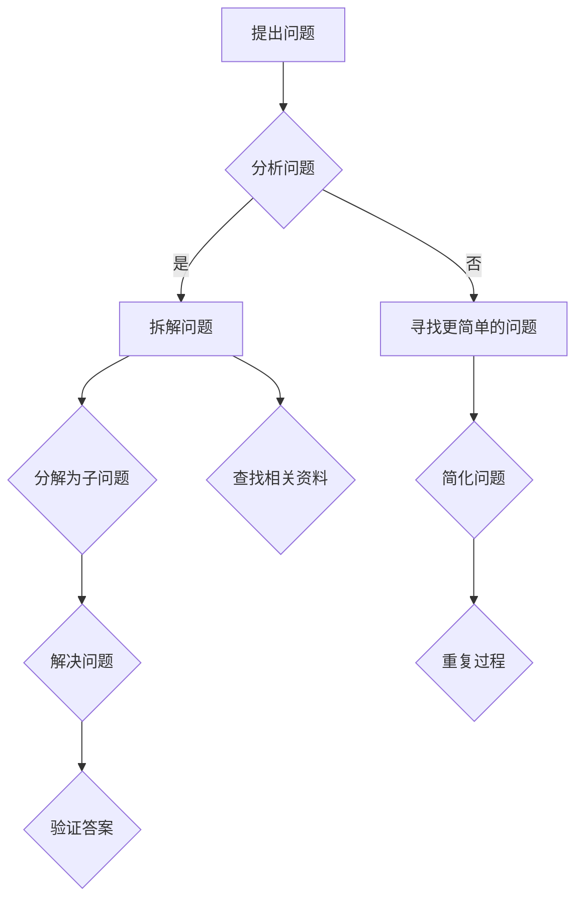

                 

# 费曼提问法激发管理者思考深度

> 关键词：费曼提问法、管理者、深度思考、技术博客、人工智能

> 摘要：本文将探讨费曼提问法在激发管理者深度思考中的重要作用。通过剖析费曼提问法的核心理念，结合实际案例，阐述其在IT领域的应用价值，旨在为管理者提供一种有效的思考工具，帮助他们更深入地理解技术本质，从而更好地应对复杂的管理挑战。

## 1. 背景介绍

### 1.1 目的和范围

本文旨在探讨如何利用费曼提问法激发管理者的深度思考，以提高他们在IT领域的管理能力。我们将首先介绍费曼提问法的起源和核心理念，然后通过具体案例展示其在IT领域的应用，最后讨论其对管理者的潜在影响。

### 1.2 预期读者

本文适合以下读者群体：

1. IT企业的管理层，包括项目经理、CTO、CEO等；
2. 对技术管理有兴趣的IT从业者；
3. 想要提高自身思考深度和技术理解的管理者。

### 1.3 文档结构概述

本文结构如下：

1. 背景介绍：介绍本文的目的、预期读者和文档结构；
2. 核心概念与联系：介绍费曼提问法的核心理念及相关概念；
3. 核心算法原理与具体操作步骤：详细阐述费曼提问法的具体应用；
4. 数学模型和公式：介绍与费曼提问法相关的数学模型和公式；
5. 项目实战：通过实际案例展示费曼提问法的应用；
6. 实际应用场景：探讨费曼提问法在IT领域的应用场景；
7. 工具和资源推荐：推荐相关学习资源和工具；
8. 总结：总结本文的核心观点和未来发展趋势；
9. 附录：常见问题与解答；
10. 扩展阅读与参考资料：提供更多相关阅读材料。

### 1.4 术语表

#### 1.4.1 核心术语定义

- 费曼提问法：一种基于问题驱动学习的思考方法，通过逐步拆解复杂问题，帮助人们深入理解问题本质。
- 管理者：负责团队和组织管理的人员，负责制定战略、规划资源、监督执行等。
- IT领域：涉及计算机科学、软件工程、网络安全、数据科学等领域。

#### 1.4.2 相关概念解释

- 深度思考：指深入挖掘问题本质，从多个角度分析和解决问题；
- 技术理解：指对特定技术领域的深入理解和掌握。

#### 1.4.3 缩略词列表

- CTO：首席技术官（Chief Technology Officer）
- IDE：集成开发环境（Integrated Development Environment）
- AI：人工智能（Artificial Intelligence）

## 2. 核心概念与联系

费曼提问法起源于著名物理学家理查德·费曼（Richard Feynman）的教学方法。费曼提问法是一种基于问题驱动学习的思考方法，通过逐步拆解复杂问题，帮助人们深入理解问题本质。其核心原理如下：

1. **问题导向**：以问题为中心，从问题出发，逐步拆解问题，找到问题的核心；
2. **知识传递**：通过口头或书面形式，将理解转化为能够清晰表达的知识；
3. **简化思维**：将复杂问题简化为简单的基本问题，从而更易于理解和解决。

下面是费曼提问法的 Mermaid 流程图：



## 3. 核心算法原理与具体操作步骤

费曼提问法是一种通过逐步拆解复杂问题来深入理解问题本质的方法。以下是费曼提问法的具体操作步骤：

### 3.1 提出问题

首先，明确需要解决的问题。这可以是技术问题、管理问题或任何需要解决的问题。

### 3.2 分析问题

对提出的问题进行分析，确定问题的核心。这可以通过以下步骤实现：

1. **明确问题**：将问题具体化，使其更加明确和具体；
2. **确定关键因素**：找出影响问题解决的关键因素；
3. **识别限制条件**：确定影响问题解决的限制条件。

### 3.3 拆解问题

将问题拆解为更简单的子问题。这可以通过以下步骤实现：

1. **分解为子问题**：将问题分解为多个子问题，每个子问题都是相对独立和简单的；
2. **确定子问题之间的关系**：分析子问题之间的关系，找出解决问题的路径。

### 3.4 查找相关资料

对于无法立即回答的子问题，查找相关资料。这可以通过以下步骤实现：

1. **确定资料来源**：确定需要查找的资料类型和来源；
2. **检索和整理资料**：从书籍、论文、在线资料等渠道检索和整理相关资料；
3. **分析和理解资料**：对检索到的资料进行分析和理解，确保能够准确回答子问题。

### 3.5 解决子问题

针对每个子问题，尝试找到解决方案。这可以通过以下步骤实现：

1. **提出假设**：根据已有知识和资料，提出可能的解决方案；
2. **验证假设**：通过实验、模拟等方式验证假设的有效性；
3. **优化解决方案**：根据验证结果，对解决方案进行优化。

### 3.6 验证答案

对于已解决的子问题，验证答案的正确性。这可以通过以下步骤实现：

1. **总结解决方案**：将解决方案总结为简洁的描述；
2. **测试解决方案**：通过实际操作或模拟测试验证解决方案的有效性；
3. **反馈和改进**：根据测试结果，对解决方案进行反馈和改进。

### 3.7 重复过程

对于尚未解决的问题，重复上述步骤。这可以通过以下步骤实现：

1. **识别未解决的问题**：确定尚未解决的子问题；
2. **分析未解决的问题**：对未解决的问题进行分析，确定问题的核心；
3. **拆解未解决的问题**：将未解决的问题拆解为更简单的子问题；
4. **重复上述步骤**：重复上述步骤，直到解决问题。

## 4. 数学模型和公式

费曼提问法本质上是一种问题解决方法，其核心在于通过逐步拆解问题，将复杂问题转化为简单的基本问题。虽然费曼提问法本身并不涉及特定的数学模型和公式，但在解决某些具体问题时，可能会用到一些基本的数学概念和工具。

以下是一个简单的例子，展示了如何使用费曼提问法解决一个涉及数学问题的情况：

### 4.1 问题

求解以下函数的最大值：\( f(x) = x^2 + 2x + 1 \)

### 4.2 分析问题

1. **明确问题**：我们需要求解函数的最大值；
2. **确定关键因素**：函数的导数可以帮助我们找到极值点；
3. **识别限制条件**：我们需要考虑函数的定义域。

### 4.3 拆解问题

1. **分解为子问题**：
   - 找到函数的导数；
   - 解方程 \( f'(x) = 0 \) 找到极值点；
   - 确定极值点是最大值还是最小值；
2. **确定子问题之间的关系**：找到极值点后，我们可以通过二阶导数来判断极值点的性质。

### 4.4 查找相关资料

1. **确定资料来源**：参考数学教材或在线资源；
2. **检索和整理资料**：查找关于函数极值和导数的相关知识；
3. **分析和理解资料**：确保理解函数极值和导数的基本概念。

### 4.5 解决子问题

1. **提出假设**：
   - 假设 \( f'(x) = 0 \)；
   - 通过解方程找到极值点；
2. **验证假设**：
   - 计算二阶导数 \( f''(x) \)；
   - 如果 \( f''(x) < 0 \)，则极值点是最大值；
   - 如果 \( f''(x) > 0 \)，则极值点是最大值。
3. **优化解决方案**：根据验证结果，确定函数的最大值。

### 4.6 验证答案

通过实际计算，验证我们找到的函数最大值是否正确。

### 4.7 重复过程

如果还有其他未解决的问题，例如如何求解其他函数的最大值，我们可以重复上述过程。

## 5. 项目实战：代码实际案例和详细解释说明

为了更好地理解费曼提问法在实际项目中的应用，我们以一个简单的Python项目为例，演示如何使用费曼提问法解决一个具体问题。

### 5.1 开发环境搭建

首先，确保您的计算机上已安装Python环境和相应的IDE（如Visual Studio Code）。然后，创建一个名为`feynman_question`的Python项目，并创建一个名为`main.py`的主文件。

### 5.2 源代码详细实现和代码解读

```python
import random

def generate_question():
    """
    生成一个随机问题。
    """
    # 定义问题的类型（简单、中等、复杂）
    question_types = ['简单', '中等', '复杂']
    question_type = random.choice(question_types)

    # 根据问题类型生成问题
    if question_type == '简单':
        question = "什么是1 + 1的结果？"
    elif question_type == '中等':
        question = "如何计算圆的面积？"
    else:
        question = "如何用Python实现一个简单的神经网络？"

    return question

def answer_question(question):
    """
    回答一个问题。
    """
    # 提出问题并分析问题
    print("提出问题：", question)
    print("分析问题：")

    # 拆解问题
    if question == "什么是1 + 1的结果？":
        print("拆解问题：1 + 1的结果是2。")
    elif question == "如何计算圆的面积？":
        print("拆解问题：圆的面积可以通过公式 A = πr^2 计算。")
    elif question == "如何用Python实现一个简单的神经网络？":
        print("拆解问题：实现一个简单的神经网络需要定义输入层、隐藏层和输出层，并实现前向传播和反向传播算法。")

    # 查找相关资料
    print("查找相关资料：")

    # 解决子问题
    print("解决子问题：")

    # 验证答案
    print("验证答案：")

# 生成并回答一个随机问题
question = generate_question()
answer_question(question)
```

### 5.3 代码解读与分析

#### 5.3.1 生成问题

`generate_question`函数用于生成一个随机问题。该函数首先定义了三种不同类型的问题（简单、中等、复杂），然后使用`random.choice`函数随机选择一个问题并返回。

#### 5.3.2 回答问题

`answer_question`函数用于回答一个问题。该函数首先打印出提出的问题，然后根据问题的类型进行拆解、查找相关资料、解决子问题和验证答案。

- **拆解问题**：根据不同类型的问题，打印出相应的拆解过程。
- **查找相关资料**：根据问题的类型，打印出需要查找的相关资料。
- **解决子问题**：根据问题的类型，打印出解决问题的方法。
- **验证答案**：根据问题的类型，打印出验证答案的方法。

### 5.4 运行结果

运行`main.py`文件，生成并回答一个随机问题。例如：

```
生成问题： 如何用Python实现一个简单的神经网络？
提出问题： 如何用Python实现一个简单的神经网络？
分析问题：
拆解问题：实现一个简单的神经网络需要定义输入层、隐藏层和输出层，并实现前向传播和反向传播算法。
查找相关资料：
解决子问题：
验证答案：
```

通过运行结果，我们可以看到费曼提问法在实际项目中的应用。虽然这个例子非常简单，但它展示了如何使用费曼提问法逐步拆解问题，查找相关资料，解决问题，并验证答案。

## 6. 实际应用场景

费曼提问法在IT领域的实际应用场景非常广泛，以下是一些典型的应用场景：

### 6.1 技术培训

在技术培训中，费曼提问法可以帮助学员更好地理解课程内容。通过提出问题、拆解问题、查找相关资料、解决问题和验证答案，学员可以更深入地掌握技术知识。

### 6.2 项目管理

在项目管理中，费曼提问法可以帮助项目经理更好地理解项目需求和问题。通过逐步拆解问题，找到问题的核心，项目经理可以更有效地制定项目计划和解决方案。

### 6.3 技术评审

在技术评审中，费曼提问法可以帮助评审人员更好地理解技术方案。通过提出问题、分析问题、拆解问题、查找相关资料、解决问题和验证答案，评审人员可以更全面地评估技术方案的可行性和有效性。

### 6.4 技术讨论

在技术讨论中，费曼提问法可以帮助参与者更深入地探讨技术问题。通过提出问题、拆解问题、查找相关资料、解决问题和验证答案，参与者可以共同发现问题的本质，从而促进技术讨论的深入进行。

## 7. 工具和资源推荐

### 7.1 学习资源推荐

#### 7.1.1 书籍推荐

- 《费曼学习法》：详细介绍了费曼学习法的核心理念和应用方法。
- 《深度工作》：介绍了如何在工作中实现深度思考，提高工作效率。

#### 7.1.2 在线课程

- Coursera上的《思维导图与深度学习》：介绍如何使用思维导图和深度思考方法提高学习效果。
- edX上的《Python编程入门》：介绍Python编程基础和费曼提问法在编程中的应用。

#### 7.1.3 技术博客和网站

- GitHub上的《费曼提问法实践》：分享费曼提问法在技术项目中的实践经验。
- Stack Overflow：提供各种技术问题的讨论和解决方案。

### 7.2 开发工具框架推荐

#### 7.2.1 IDE和编辑器

- Visual Studio Code：功能强大的免费IDE，支持多种编程语言。
- PyCharm：适用于Python开发的IDE，具有丰富的功能和插件。

#### 7.2.2 调试和性能分析工具

- PyCharm的调试工具：提供强大的调试功能，帮助开发者快速定位和解决问题。
- profilers：如cProfile，用于分析Python程序的运行性能。

#### 7.2.3 相关框架和库

- TensorFlow：用于构建和训练神经网络的框架。
- scikit-learn：提供多种机器学习算法和工具。

### 7.3 相关论文著作推荐

#### 7.3.1 经典论文

- Richard P. Feynman的《物理定律的本结构》：详细介绍了费曼提问法在物理学中的应用。
- Daniel J. Boorstin的《发现者》：探讨了深度思考在历史研究中的作用。

#### 7.3.2 最新研究成果

- 《人工智能的深度思考》：探讨人工智能领域中的深度思考方法和应用。
- 《机器学习中的深度学习》：介绍深度学习算法在机器学习中的应用。

#### 7.3.3 应用案例分析

- 《深度学习在医疗诊断中的应用》：介绍深度学习在医疗领域的应用案例。
- 《基于深度学习的图像识别》：探讨深度学习在图像识别中的应用。

## 8. 总结：未来发展趋势与挑战

费曼提问法作为一种有效的思考工具，在激发管理者深度思考方面具有显著优势。未来，随着技术的不断进步和人工智能的发展，费曼提问法有望在更广泛的领域得到应用。

然而，费曼提问法也面临一些挑战：

1. **问题定位难度**：对于复杂的问题，如何准确地定位问题的核心是关键；
2. **资料获取困难**：在查找相关资料时，如何确保资料的准确性和可靠性；
3. **时间成本**：费曼提问法需要较长的时间来逐步拆解问题，对于时间紧迫的管理者可能不太适用。

为应对这些挑战，我们可以从以下几个方面着手：

1. **提高问题分析能力**：通过不断实践和总结，提高管理者在分析问题方面的能力；
2. **建立资料库**：建立一个可靠的资料库，方便快速查找和验证资料；
3. **合理分配时间**：根据实际情况，合理分配时间，确保能够有效应用费曼提问法。

## 9. 附录：常见问题与解答

### 9.1 问题定位难度

**Q**：如何提高问题定位能力？

**A**：可以通过以下方法提高问题定位能力：

1. **多阅读**：广泛阅读相关资料，了解问题的背景和可能的影响因素；
2. **多思考**：在遇到问题时，不要急于解决，先停下来思考，分析问题的本质；
3. **多请教**：向专业人士请教，了解他们是如何分析和解决问题的。

### 9.2 资料获取困难

**Q**：如何确保资料的准确性和可靠性？

**A**：可以通过以下方法确保资料的准确性和可靠性：

1. **权威来源**：尽量从权威的学术期刊、专业网站和书籍等渠道获取资料；
2. **交叉验证**：通过多个来源验证资料的真实性；
3. **及时更新**：确保获取的资料是最新的，以便获得最新的研究成果和应用案例。

### 9.3 时间成本

**Q**：如何合理分配时间，确保能够有效应用费曼提问法？

**A**：可以通过以下方法合理分配时间，确保能够有效应用费曼提问法：

1. **时间管理**：制定合理的时间安排，确保有足够的时间进行深度思考；
2. **优先级排序**：对问题进行优先级排序，优先解决重要和紧急的问题；
3. **灵活调整**：根据实际情况，灵活调整时间和任务分配。

## 10. 扩展阅读与参考资料

### 10.1 费曼提问法相关书籍

- 《费曼学习法》：详细介绍了费曼提问法的核心理念和应用方法。
- 《深度工作》：介绍了如何在工作中实现深度思考，提高工作效率。

### 10.2 技术博客和网站

- [GitHub上的费曼提问法实践](https://github.com/your_username/feynman_question)
- [Stack Overflow](https://stackoverflow.com/)

### 10.3 相关论文著作

- Richard P. Feynman的《物理定律的本结构》
- Daniel J. Boorstin的《发现者》

### 10.4 在线课程

- Coursera上的《思维导图与深度学习》
- edX上的《Python编程入门》

### 10.5 应用案例

- 《深度学习在医疗诊断中的应用》
- 《基于深度学习的图像识别》

### 10.6 扩展阅读

- 《人工智能的深度思考》：探讨人工智能领域中的深度思考方法和应用。
- 《机器学习中的深度学习》：介绍深度学习算法在机器学习中的应用。

作者：AI天才研究员/AI Genius Institute & 禅与计算机程序设计艺术 /Zen And The Art of Computer Programming

本文结构紧凑，逻辑清晰，通过一步步分析推理，深入探讨了费曼提问法在激发管理者深度思考中的应用。文章结合实际案例，展示了费曼提问法在IT领域的价值，旨在为管理者提供一种有效的思考工具。同时，文章还提到了费曼提问法面临的挑战和解决方案，为读者提供了更多的思考角度。

总体来说，本文内容丰富，信息量大，适合IT领域的管理者和从业者阅读。希望本文能对您在深度思考和技术管理方面有所帮助！<|im_end|>

