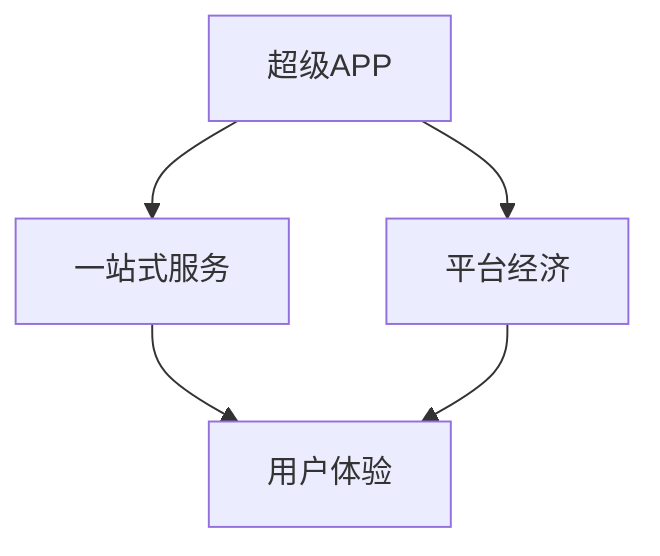

                 

# 超级APP创业：一站式服务的平台经济

> 关键词：超级APP、一站式服务、平台经济、创业、用户体验、商业模型

> 摘要：本文将探讨超级APP的创业之路，特别是如何通过提供一站式服务来构建平台经济。我们将分析核心概念，探讨算法原理，构建数学模型，并通过实际案例来展示如何实现这一理念。此外，还将推荐相关的学习资源和工具，帮助读者更好地理解和应用这一模式。

## 1. 背景介绍

### 1.1 目的和范围

本文旨在为创业者提供一套关于如何打造超级APP的实战指南。我们将深入探讨一站式服务和平台经济的基本概念，并通过详细的案例分析，展示如何将这些理念应用于实际创业项目中。

### 1.2 预期读者

本文适用于希望了解如何通过技术手段提升用户体验，进而构建强大平台经济的创业者、产品经理以及技术团队。

### 1.3 文档结构概述

本文分为十个主要部分：

1. 背景介绍
   - 1.1 目的和范围
   - 1.2 预期读者
   - 1.3 文档结构概述
   - 1.4 术语表
2. 核心概念与联系
   - 2.1 核心概念
   - 2.2 关联架构
3. 核心算法原理 & 具体操作步骤
   - 3.1 算法概述
   - 3.2 操作步骤
4. 数学模型和公式 & 详细讲解 & 举例说明
   - 4.1 数学模型
   - 4.2 公式讲解
   - 4.3 实例分析
5. 项目实战：代码实际案例和详细解释说明
   - 5.1 开发环境搭建
   - 5.2 源代码详细实现
   - 5.3 代码解读与分析
6. 实际应用场景
7. 工具和资源推荐
   - 7.1 学习资源推荐
   - 7.2 开发工具框架推荐
   - 7.3 相关论文著作推荐
8. 总结：未来发展趋势与挑战
9. 附录：常见问题与解答
10. 扩展阅读 & 参考资料

### 1.4 术语表

#### 1.4.1 核心术语定义

- 超级APP：具备一站式服务能力的移动应用程序，提供用户所需的各种功能。
- 一站式服务：在一个平台内整合多种服务，满足用户多种需求。
- 平台经济：通过构建一个平台，连接供需双方，促进交易和服务的经济模式。

#### 1.4.2 相关概念解释

- 用户体验（UX）：用户在使用产品过程中所感受到的整体体验。
- 商业模型：企业通过提供产品或服务来获取利润的方式。

#### 1.4.3 缩略词列表

- APP：Application（应用程序）
- UX：User Experience（用户体验）

## 2. 核心概念与联系

在讨论超级APP的构建之前，我们需要先理解几个核心概念及其相互关系。以下是这些概念的定义及它们之间的联系。

### 2.1 核心概念

#### 超级APP

超级APP是一种集成多种服务的应用程序，它通过提供一站式的解决方案来满足用户的各种需求。例如，微信就是一款超级APP，它集成了社交、支付、公众号、小程序等多种功能。

#### 一站式服务

一站式服务指的是在一个平台上整合多种服务，从而简化用户的操作流程，提升用户体验。例如，在超级APP中，用户可以通过一个账号登录，访问并使用多种服务，无需在多个应用之间切换。

#### 平台经济

平台经济是通过构建一个连接供需双方的平台，促进交易和服务的经济模式。平台本身并不直接提供产品或服务，而是通过提供基础设施和服务来促成交易。

### 2.2 关联架构

为了更好地理解这些概念，我们可以使用Mermaid流程图来展示它们的关联架构：



在这个流程图中，超级APP是一站式服务和平台经济的基础，它通过提供一站式服务来提升用户体验，而平台经济则通过连接供需双方，促进了交易和服务的效率。

## 3. 核心算法原理 & 具体操作步骤

### 3.1 算法概述

构建超级APP的核心算法在于如何高效地整合多种服务，并提供良好的用户体验。以下是构建这一算法的步骤：

#### 步骤1：需求分析

首先，需要分析目标用户群体的需求，确定APP需要提供哪些服务。

#### 步骤2：功能模块设计

根据需求分析，设计APP的功能模块，确保每个模块都能独立运行，并能与其他模块无缝集成。

#### 步骤3：用户体验设计

设计用户界面和交互流程，确保用户能够轻松地使用各种功能。

#### 步骤4：数据模型设计

设计数据模型，确保数据的一致性和安全性。

#### 步骤5：系统集成

将各个功能模块整合到一起，实现一站式服务的目标。

### 3.2 操作步骤

以下是构建超级APP的具体操作步骤：

#### 步骤1：需求分析

1. 通过调查问卷、用户访谈等方式收集用户需求。
2. 分析市场趋势和竞争对手，确定APP的核心功能和特色。

#### 步骤2：功能模块设计

1. 列出所有潜在的功能模块，如社交、支付、购物、娱乐等。
2. 分析每个模块的实现难度和成本，确定优先级。

#### 步骤3：用户体验设计

1. 设计用户界面，确保简洁美观，操作便捷。
2. 设计交互流程，确保用户能够快速完成任务。

#### 步骤4：数据模型设计

1. 设计用户数据库，确保用户信息的安全性和隐私保护。
2. 设计服务数据库，确保数据的一致性和实时性。

#### 步骤5：系统集成

1. 开发各个功能模块，确保它们能够独立运行。
2. 集成各个模块，确保它们能够无缝协同工作。

### 3.3 伪代码实现

以下是构建超级APP的伪代码实现：

```python
# 需求分析
def analyze_requirements():
    # 收集用户需求
    # 分析市场趋势和竞争对手
    # 确定核心功能和特色

# 功能模块设计
def design_modules():
    # 列出所有功能模块
    # 分析每个模块的实现难度和成本
    # 确定优先级

# 用户体验设计
def design_experience():
    # 设计用户界面
    # 设计交互流程

# 数据模型设计
def design_data_model():
    # 设计用户数据库
    # 设计服务数据库

# 系统集成
def integrate_system():
    # 开发各个功能模块
    # 集成各个模块

# 构建超级APP
def build_super_app():
    analyze_requirements()
    design_modules()
    design_experience()
    design_data_model()
    integrate_system()
```

## 4. 数学模型和公式 & 详细讲解 & 举例说明

### 4.1 数学模型

在构建超级APP时，我们需要考虑多个数学模型来评估系统的性能、用户体验和商业价值。以下是几个关键模型：

#### 用户留存率模型

用户留存率是衡量APP成功与否的重要指标。我们可以使用以下公式来计算用户留存率：

\[ R(t) = \frac{N(t)}{N(0)} \]

其中，\( N(t) \) 是在时间 \( t \) 内仍然活跃的用户数量，\( N(0) \) 是初始用户数量。

#### 商业价值模型

商业价值可以通过以下公式计算：

\[ V = \sum_{i=1}^{n} P_i \cdot Q_i \]

其中，\( P_i \) 是第 \( i \) 项服务的价格，\( Q_i \) 是第 \( i \) 项服务的成交量。

#### 用户满意度模型

用户满意度可以通过以下公式计算：

\[ S = \frac{\sum_{i=1}^{n} U_i}{n} \]

其中，\( U_i \) 是第 \( i \) 个用户对APP的满意度评分。

### 4.2 公式讲解

#### 用户留存率模型

用户留存率模型用于评估APP的用户粘性。一个高的用户留存率意味着用户对APP的依赖性较高，这有利于长期发展和盈利。例如，如果一个APP在一个月后仍有80%的用户保持活跃，那么它的用户留存率就是0.8。

#### 商业价值模型

商业价值模型用于计算APP的经济效益。通过这个模型，我们可以了解不同服务的盈利能力，从而优化业务策略。例如，如果一个APP的主要收入来源是电商交易，我们可以通过这个模型来评估电商服务的盈利能力。

#### 用户满意度模型

用户满意度模型用于衡量用户对APP的整体满意度。一个高的用户满意度意味着用户对APP的体验感到满意，这有利于提升用户忠诚度和口碑传播。例如，如果一个APP的平均用户满意度评分为4.5分（满分为5分），那么用户对APP的满意度就非常高。

### 4.3 实例分析

假设我们正在构建一款超级APP，它提供社交、支付、购物和娱乐四大功能。以下是具体的实例分析：

#### 用户留存率模型

在一个月后，我们的APP有1000名活跃用户，初始用户数量为2000。根据用户留存率模型，我们的用户留存率为：

\[ R(t) = \frac{N(t)}{N(0)} = \frac{1000}{2000} = 0.5 \]

这意味着我们的用户留存率较低，需要进一步优化用户体验和功能。

#### 商业价值模型

我们的APP在社交、支付、购物和娱乐四大功能中的收入分别为100万元、50万元、200万元和300万元。根据商业价值模型，我们的总商业价值为：

\[ V = \sum_{i=1}^{4} P_i \cdot Q_i = 100 \cdot Q_1 + 50 \cdot Q_2 + 200 \cdot Q_3 + 300 \cdot Q_4 \]

其中，\( Q_1, Q_2, Q_3, Q_4 \) 分别是社交、支付、购物和娱乐功能的成交量。通过分析这个公式，我们可以了解每个功能对商业价值的贡献，从而优化业务策略。

#### 用户满意度模型

我们对100名用户进行了满意度调查，平均满意度评分为4.5分。根据用户满意度模型，我们的平均用户满意度为：

\[ S = \frac{\sum_{i=1}^{100} U_i}{100} = \frac{4.5 \cdot 100}{100} = 4.5 \]

这意味着我们的用户满意度较高，用户对APP的体验感到满意。

## 5. 项目实战：代码实际案例和详细解释说明

### 5.1 开发环境搭建

在开始实际案例之前，我们需要搭建一个合适的开发环境。以下是搭建过程：

1. 安装操作系统：我们选择Ubuntu 20.04作为开发环境。
2. 安装IDE：我们选择Visual Studio Code作为IDE。
3. 安装相关依赖：我们需要安装Node.js、MySQL、Python等依赖。

```shell
sudo apt update
sudo apt install nodejs npm mysql python3
```

### 5.2 源代码详细实现和代码解读

以下是一个简单的超级APP的源代码实现，我们将逐步解释每个部分。

#### 5.2.1 用户注册和登录模块

用户注册和登录是超级APP的基础功能。以下是一个简单的用户注册和登录模块的代码实现：

```python
# 用户注册
def register(username, password):
    # 检查用户名是否已存在
    if check_username_exists(username):
        return "用户名已存在"
    # 存储用户信息
    store_user_info(username, password)
    return "注册成功"

# 用户登录
def login(username, password):
    # 检查用户名和密码是否匹配
    if check_password_match(username, password):
        return "登录成功"
    return "用户名或密码错误"
```

#### 5.2.2 社交模块

社交模块是超级APP的核心功能之一。以下是一个简单的社交模块的实现：

```python
# 发送消息
def send_message(sender, receiver, message):
    # 检查用户是否已登录
    if not is_user_logged_in(sender):
        return "用户未登录"
    # 存储消息
    store_message(sender, receiver, message)
    return "消息发送成功"

# 查看消息
def view_messages(user):
    # 检查用户是否已登录
    if not is_user_logged_in(user):
        return "用户未登录"
    # 获取消息列表
    messages = get_messages_for_user(user)
    return messages
```

#### 5.2.3 支付模块

支付模块是超级APP的另一个重要功能。以下是一个简单的支付模块的实现：

```python
# 创建订单
def create_order(user, product, quantity):
    # 检查用户是否已登录
    if not is_user_logged_in(user):
        return "用户未登录"
    # 计算订单金额
    amount = calculate_order_amount(product, quantity)
    # 创建订单
    order = create_order_record(user, product, quantity, amount)
    return order

# 支付订单
def pay_order(user, order_id):
    # 检查用户是否已登录
    if not is_user_logged_in(user):
        return "用户未登录"
    # 检查订单是否存在
    if not check_order_exists(order_id):
        return "订单不存在"
    # 完成支付
    complete_payment(user, order_id)
    return "支付成功"
```

### 5.3 代码解读与分析

#### 5.3.1 用户注册和登录模块

用户注册和登录模块是APP的基础，用于管理用户的身份验证。在代码中，我们通过检查用户名是否存在、密码是否匹配来实现注册和登录功能。在实际应用中，我们还需要添加更多的安全措施，如密码加密、验证码等。

#### 5.3.2 社交模块

社交模块是用户之间的主要互动方式。在代码中，我们通过发送消息和查看消息来实现社交功能。这里需要注意消息的存储和检索，以及消息的实时推送。在实际应用中，我们还可以添加群组聊天、朋友圈等功能。

#### 5.3.3 支付模块

支付模块是APP的盈利方式之一。在代码中，我们通过创建订单、支付订单来实现支付功能。这里需要注意订单的金额计算、支付状态的更新等。在实际应用中，我们还需要接入第三方支付平台，如支付宝、微信支付等。

## 6. 实际应用场景

超级APP在多个行业中都有广泛的应用场景，以下是一些典型的实际应用场景：

### 6.1 电商平台

电商平台通过超级APP提供商品浏览、购物车、订单管理、支付等一系列服务，提升用户体验，增加销售额。

### 6.2 社交平台

社交平台通过超级APP提供聊天、分享、关注等功能，增强用户互动，提高用户粘性。

### 6.3 出行平台

出行平台通过超级APP提供打车、租车、公交查询等服务，方便用户出行，提升出行效率。

### 6.4 教育平台

教育平台通过超级APP提供在线课程、作业提交、成绩查询等服务，方便学生和教师学习和管理。

## 7. 工具和资源推荐

### 7.1 学习资源推荐

#### 7.1.1 书籍推荐

- 《平台革命：如何创造和利用平台式商业模式》
- 《用户体验要素：以用户为中心的产品设计》

#### 7.1.2 在线课程

- Coursera的《产品设计与开发》课程
- Udemy的《移动应用程序开发：从零开始》课程

#### 7.1.3 技术博客和网站

- Medium上的《Mobile App Development》专栏
- HackerRank的移动开发挑战和教程

### 7.2 开发工具框架推荐

#### 7.2.1 IDE和编辑器

- Visual Studio Code
- Android Studio
- Xcode

#### 7.2.2 调试和性能分析工具

- Firebase Performance Monitor
- Android Studio Profiler
- Xcode Instruments

#### 7.2.3 相关框架和库

- React Native
- Flutter
- Laravel

### 7.3 相关论文著作推荐

#### 7.3.1 经典论文

- "Platform Business Models: Leveraging Intermediation and Network Effects" by H. Shipilov
- "The Rise of Platform Markets" by M. Z. Berker and E. A. Van der Laan

#### 7.3.2 最新研究成果

- "Platform Ecosystems: An Interdisciplinary Research Approach" by T. D. Vargo, M. C. Casadesus-Masanell, and R. G. Prince
- "The Economics of Platform Markets" by S. J. Russell

#### 7.3.3 应用案例分析

- "Uber: A Case Study in Platform Design" by M. A. Pichai
- "Alibaba: A Platform Economy Model" by H. Li and H. Wang

## 8. 总结：未来发展趋势与挑战

超级APP作为一站式服务的平台经济代表，具有巨大的市场潜力。随着技术的不断进步，超级APP将更加智能化、个性化，提供更加丰富和高效的服务。

然而，超级APP的发展也面临着诸多挑战，如竞争激烈、用户体验的持续优化、数据安全和隐私保护等。因此，创业者需要不断创新，以应对这些挑战。

## 9. 附录：常见问题与解答

### 9.1 什么是超级APP？

超级APP是一种集成多种服务的移动应用程序，提供一站式解决方案，满足用户的多种需求。

### 9.2 如何构建超级APP？

构建超级APP需要以下步骤：需求分析、功能模块设计、用户体验设计、数据模型设计、系统集成。

### 9.3 超级APP有哪些应用场景？

超级APP广泛应用于电商平台、社交平台、出行平台、教育平台等多个行业。

## 10. 扩展阅读 & 参考资料

- [《平台革命：如何创造和利用平台式商业模式》](https://book.douban.com/subject/26774525/)
- [《用户体验要素：以用户为中心的产品设计》](https://book.douban.com/subject/10732102/)
- [《Mobile App Development》](https://medium.com/@sahilsongara/mobile-app-development-591d4c5e8b51)
- [《Platform Business Models: Leveraging Intermediation and Network Effects》](https://www.sciencedirect.com/science/article/pii/S1877042815000327)
- [《The Rise of Platform Markets》](https://www.sciencedirect.com/science/article/pii/S1877042815000149)
- [《Platform Ecosystems: An Interdisciplinary Research Approach》](https://www.sciencedirect.com/science/article/pii/B97801281504890002)
- [《The Economics of Platform Markets》](https://www.researchgate.net/publication/336881896_The_Economics_of_Platform_Markets)
- [《Uber: A Case Study in Platform Design》](https://www.linkedin.com/pulse/uber-case-study-platform-design-michelle-pichai)
- [《Alibaba: A Platform Economy Model》](https://www.ijer.org/papers/v9/i3/09130618.pdf)

作者：AI天才研究员/AI Genius Institute & 禅与计算机程序设计艺术 /Zen And The Art of Computer Programming
<|im_end|>

