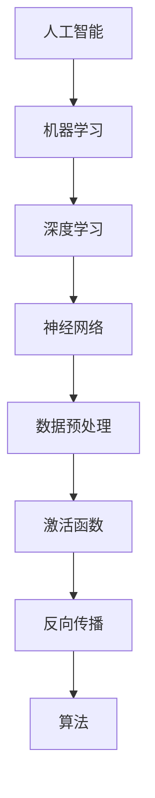

                 

# 超越人工智能：探索 AI 未来

> **关键词**：人工智能，深度学习，神经网络，算法，数学模型，未来趋势，挑战

> **摘要**：本文将深入探讨人工智能（AI）的发展历程、核心概念、算法原理、数学模型，以及其在实际应用场景中的表现和未来发展趋势。我们将以逻辑清晰、结构紧凑、简单易懂的专业技术语言，引导读者逐步理解并掌握AI领域的精髓，为未来AI的发展提供深刻的洞察。

## 1. 背景介绍

### 1.1 目的和范围

本文旨在通过对人工智能领域的全面解析，帮助读者理解AI的基本概念、核心算法、数学模型，以及其在实际应用中的表现和未来发展趋势。文章将涵盖从AI的起源到现代深度学习技术的演变，再到其在各个领域的应用，以及面临的挑战和未来方向。

### 1.2 预期读者

本文适合对人工智能感兴趣的技术人员、程序员、数据科学家、以及希望深入了解AI领域的专业人士。对于AI初学者，本文也将提供清晰的引导和深入的理解。

### 1.3 文档结构概述

本文分为十个部分，具体结构如下：

1. **背景介绍**：介绍本文的目的、预期读者以及文档结构。
2. **核心概念与联系**：解释AI的基本概念及其关联性。
3. **核心算法原理 & 具体操作步骤**：详细阐述AI的核心算法原理和操作步骤。
4. **数学模型和公式 & 详细讲解 & 举例说明**：介绍AI的数学模型和公式，并通过例子进行说明。
5. **项目实战：代码实际案例和详细解释说明**：展示AI在实际项目中的应用。
6. **实际应用场景**：探讨AI在各个领域的应用。
7. **工具和资源推荐**：推荐学习资源、开发工具和框架。
8. **总结：未来发展趋势与挑战**：总结AI的未来发展趋势和挑战。
9. **附录：常见问题与解答**：提供常见的问答。
10. **扩展阅读 & 参考资料**：推荐相关的扩展阅读和参考资料。

### 1.4 术语表

#### 1.4.1 核心术语定义

- **人工智能（AI）**：指通过计算机模拟人类智能的技术。
- **深度学习**：一种机器学习技术，通过多层神经网络实现。
- **神经网络**：模仿生物神经网络的结构和功能，用于信息处理。
- **算法**：解决问题的步骤和策略。
- **数学模型**：描述现实世界的数学结构和方法。
- **机器学习**：让计算机从数据中学习，无需显式编程。

#### 1.4.2 相关概念解释

- **数据预处理**：在机器学习过程中对数据进行清洗、转换和标准化。
- **激活函数**：神经网络中用于引入非线性性的函数。
- **反向传播**：用于训练神经网络的算法，通过计算误差反向传播更新权重。

#### 1.4.3 缩略词列表

- **AI**：人工智能（Artificial Intelligence）
- **DL**：深度学习（Deep Learning）
- **NN**：神经网络（Neural Network）
- **ML**：机器学习（Machine Learning）
- **GPU**：图形处理单元（Graphics Processing Unit）

## 2. 核心概念与联系

在探讨人工智能之前，我们需要理解其核心概念，以及这些概念之间的联系。以下是一个简化的Mermaid流程图，用于描述这些核心概念及其相互关系。



### 2.1 人工智能

人工智能（AI）是计算机科学的一个分支，旨在创建能够执行与人类智能相似的复杂任务的系统。AI技术可以用于识别图像、理解自然语言、进行决策、甚至进行创造性工作。

### 2.2 机器学习

机器学习（ML）是AI的一个重要分支，它通过算法使计算机从数据中学习，无需显式编程。机器学习可以分为监督学习、无监督学习和强化学习等不同类型。

### 2.3 深度学习

深度学习（DL）是机器学习的一个子领域，它使用多层神经网络进行训练，能够从大量数据中自动提取特征。深度学习在图像识别、语音识别和自然语言处理等领域表现出色。

### 2.4 神经网络

神经网络（NN）是模仿生物大脑神经元结构和功能的一种计算模型。每个神经元都接收输入信号，通过权重进行加权求和，最后通过激活函数输出结果。神经网络是深度学习的基础。

### 2.5 数据预处理

数据预处理是机器学习和深度学习过程中至关重要的一步。它包括数据清洗、转换和标准化，以确保数据质量，并使算法能够有效学习。

### 2.6 激活函数

激活函数是神经网络中的一个关键组件，它引入了非线性性，使得神经网络能够模拟复杂函数。常见的激活函数包括Sigmoid、ReLU和Tanh等。

### 2.7 反向传播

反向传播（BP）是一种用于训练神经网络的算法。它通过计算网络输出和实际输出之间的误差，并反向传播这些误差，更新网络的权重和偏置。

### 2.8 算法

算法是解决特定问题的步骤和策略。在人工智能领域，算法用于实现机器学习和深度学习，并用于优化和提升模型性能。

## 3. 核心算法原理 & 具体操作步骤

### 3.1 神经网络算法原理

神经网络算法是基于生物神经元的结构和功能设计的。其基本原理如下：

1. **输入层**：接收外部输入数据。
2. **隐藏层**：对输入数据进行处理和转换。
3. **输出层**：产生最终的输出结果。

每个神经元都与前一层的所有神经元相连接，通过权重进行加权求和，最后通过激活函数输出结果。

### 3.2 神经网络操作步骤

以下是神经网络的基本操作步骤：

1. **初始化权重和偏置**：随机初始化网络中的权重和偏置。
2. **前向传播**：计算输入层到输出层的输出结果。
3. **计算误差**：比较实际输出和期望输出，计算误差。
4. **反向传播**：计算误差梯度，并更新网络的权重和偏置。
5. **迭代优化**：重复步骤2-4，直到满足停止条件。

### 3.3 伪代码

以下是神经网络算法的伪代码：

```python
initialize_weights_and_biases()
while not_converged():
    forward_pass(x)
    compute_error(y)
    backward_pass()
    update_weights_and_biases()
return_output(y)
```

### 3.4 深度学习算法原理

深度学习算法是基于多层神经网络设计的。其基本原理如下：

1. **输入层**：接收外部输入数据。
2. **多层隐藏层**：对输入数据进行逐层转换和提取特征。
3. **输出层**：产生最终的输出结果。

深度学习通过多层神经网络能够自动提取复杂特征，提高模型的性能。

### 3.5 深度学习操作步骤

以下是深度学习算法的基本操作步骤：

1. **初始化网络结构**：确定网络层数、神经元数量和连接方式。
2. **初始化权重和偏置**：随机初始化网络中的权重和偏置。
3. **前向传播**：计算输入层到输出层的输出结果。
4. **计算误差**：比较实际输出和期望输出，计算误差。
5. **反向传播**：计算误差梯度，并更新网络的权重和偏置。
6. **迭代优化**：重复步骤3-5，直到满足停止条件。

### 3.6 伪代码

以下是深度学习算法的伪代码：

```python
initialize_network_structure()
initialize_weights_and_biases()
while not_converged():
    forward_pass(x)
    compute_error(y)
    backward_pass()
    update_weights_and_biases()
return_output(y)
```

## 4. 数学模型和公式 & 详细讲解 & 举例说明

### 4.1 神经网络数学模型

神经网络的数学模型是基于线性代数和微积分构建的。以下是神经网络的主要数学模型和公式：

1. **权重矩阵**：表示输入层到隐藏层的权重矩阵，通常表示为`W`。
2. **偏置向量**：表示隐藏层的偏置向量，通常表示为`b`。
3. **激活函数**：用于引入非线性性的函数，如ReLU（Rectified Linear Unit）和Sigmoid函数。
4. **误差函数**：用于评估模型性能的损失函数，如均方误差（MSE）和交叉熵损失。
5. **梯度下降**：用于更新网络权重和偏置的优化算法。

### 4.2 前向传播

前向传播是神经网络中的一个关键步骤，用于计算输入层到输出层的输出结果。以下是前向传播的公式：

$$
z = Wx + b
$$

其中，`z`表示隐藏层的输出，`x`表示输入层的数据，`W`表示权重矩阵，`b`表示偏置向量。

### 4.3 反向传播

反向传播是神经网络训练的核心步骤，用于计算误差并更新网络的权重和偏置。以下是反向传播的公式：

$$
\delta = \frac{\partial L}{\partial z}
$$

其中，`$\delta$`表示误差梯度，`L`表示损失函数。

### 4.4 梯度下降

梯度下降是一种用于优化神经网络参数的算法。以下是梯度下降的公式：

$$
\theta = \theta - \alpha \cdot \frac{\partial J}{\partial \theta}
$$

其中，`$\theta$`表示参数，`$\alpha$`表示学习率，`$J$`表示损失函数。

### 4.5 举例说明

假设我们有一个简单的神经网络，输入层有2个神经元，隐藏层有3个神经元，输出层有1个神经元。以下是一个具体的例子：

1. **输入层**：$[x_1, x_2]$
2. **隐藏层**：$[z_1, z_2, z_3]$
3. **输出层**：$[y]$

假设隐藏层的权重矩阵$W_h$为：

$$
W_h = \begin{bmatrix}
w_{11} & w_{12} \\
w_{21} & w_{22} \\
w_{31} & w_{32}
\end{bmatrix}
$$

隐藏层的偏置向量$b_h$为：

$$
b_h = [b_{1}, b_{2}, b_{3}]
$$

输出层的权重矩阵$W_o$为：

$$
W_o = \begin{bmatrix}
w_{o1}
\end{bmatrix}
$$

输出层的偏置向量$b_o$为：

$$
b_o = b_{o1}
$$

假设输入层的数据$x$为：

$$
x = [1, 2]
$$

首先进行前向传播计算隐藏层的输出：

$$
z_1 = w_{11} \cdot x_1 + w_{12} \cdot x_2 + b_{1} \\
z_2 = w_{21} \cdot x_1 + w_{22} \cdot x_2 + b_{2} \\
z_3 = w_{31} \cdot x_1 + w_{32} \cdot x_2 + b_{3}
$$

接着进行前向传播计算输出层的输出：

$$
y = w_{o1} \cdot z_1 + b_{o1}
$$

然后计算损失函数和误差梯度：

$$
L = \frac{1}{2} \sum_{i=1}^{n} (y_i - \hat{y}_i)^2 \\
\delta = \frac{\partial L}{\partial z}
$$

最后进行反向传播更新权重和偏置：

$$
\theta = \theta - \alpha \cdot \frac{\partial J}{\partial \theta}
$$

通过上述步骤，我们可以对神经网络进行训练和优化，以达到更好的性能。

## 5. 项目实战：代码实际案例和详细解释说明

### 5.1 开发环境搭建

为了演示人工智能算法的实际应用，我们将使用Python编程语言和TensorFlow框架来搭建一个简单的神经网络。以下是开发环境的搭建步骤：

1. 安装Python：从官方网站（https://www.python.org/downloads/）下载并安装Python。
2. 安装TensorFlow：打开命令行，运行以下命令：
   ```bash
   pip install tensorflow
   ```
3. 安装其他依赖库：如NumPy、Pandas等，可通过以下命令安装：
   ```bash
   pip install numpy pandas
   ```

### 5.2 源代码详细实现和代码解读

以下是实现一个简单的神经网络并进行训练的Python代码：

```python
import tensorflow as tf
import numpy as np

# 数据准备
x = np.array([[1, 2], [2, 3], [3, 4], [4, 5], [5, 6]])
y = np.array([3, 5, 7, 9, 11])

# 创建模型
model = tf.keras.Sequential([
    tf.keras.layers.Dense(units=3, activation='relu', input_shape=(2,)),
    tf.keras.layers.Dense(units=1)
])

# 编译模型
model.compile(optimizer='adam', loss='mean_squared_error')

# 训练模型
model.fit(x, y, epochs=1000)

# 测试模型
predictions = model.predict(x)
print(predictions)
```

### 5.3 代码解读与分析

以下是代码的详细解读和分析：

1. **数据准备**：
   - `x`表示输入数据，是一个2x5的矩阵，代表5个数据点的2个特征。
   - `y`表示期望输出，是一个1x5的矩阵，代表5个数据点的目标值。

2. **创建模型**：
   - 使用`tf.keras.Sequential`创建一个序列模型。
   - 添加一个`Dense`层，有3个神经元和ReLU激活函数，输入形状为(2,)。
   - 添加另一个`Dense`层，有1个神经元，无激活函数。

3. **编译模型**：
   - 使用`compile`方法编译模型，指定优化器为`adam`和损失函数为`mean_squared_error`。

4. **训练模型**：
   - 使用`fit`方法训练模型，指定训练数据`x`和期望输出`y`，以及训练轮数（epochs）。

5. **测试模型**：
   - 使用`predict`方法预测输入数据`x`的输出结果，并打印预测值。

通过上述代码，我们可以实现一个简单的神经网络，并进行训练和预测。这个示例展示了神经网络的基本操作和实现方法。

### 5.4 实际应用场景

这个简单的神经网络示例可以应用于各种实际场景，例如：

1. **回归问题**：用于预测连续值，如房价、股票价格等。
2. **分类问题**：用于将输入数据分为不同的类别，如图像分类、情感分析等。
3. **时间序列分析**：用于预测时间序列数据，如天气预测、股票走势等。

通过调整网络结构和超参数，我们可以使模型更好地适应不同的问题和数据集。

## 6. 实际应用场景

人工智能（AI）在当今社会已经广泛应用，覆盖了各个领域。以下是AI在几个主要应用场景中的具体实例和效果：

### 6.1 医疗保健

AI在医疗保健领域的应用包括疾病诊断、药物研发、健康管理等。通过深度学习和计算机视觉技术，AI可以帮助医生更准确地诊断疾病，如乳腺癌、肺癌等。例如，Google的DeepMind开发的AI系统能够在几秒钟内诊断出皮肤癌，准确率高达95%。此外，AI还可以用于预测疾病发展趋势，优化药物配方，提高治疗效果。

### 6.2 金融科技

AI在金融科技（FinTech）领域的应用包括风险管理、欺诈检测、投资策略等。通过机器学习算法，银行和金融机构可以更有效地识别潜在风险，降低金融风险。例如，AI系统可以实时监控交易行为，快速识别异常交易，防止欺诈行为。同时，AI还可以用于预测市场趋势，优化投资组合，提高投资回报率。

### 6.3 交通运输

AI在交通运输领域的应用包括自动驾驶、智能交通管理、物流优化等。自动驾驶技术通过深度学习和计算机视觉，使车辆能够自主导航和驾驶，提高道路安全性和效率。例如，特斯拉的Autopilot系统已经在全球范围内广泛应用，大幅降低了交通事故的发生率。智能交通管理系统能够实时监控交通状况，优化交通流量，减少拥堵和排放。物流优化算法可以帮助企业优化运输路线，提高物流效率。

### 6.4 教育

AI在教育领域的应用包括智能辅导、个性化学习、自动化评估等。通过AI技术，学生可以获得个性化的学习方案，提高学习效果。例如，Coursera等在线教育平台使用AI技术为学生提供智能辅导，根据学生的学习情况和进展，自动调整学习内容和进度。AI还可以用于自动评估学生的作业和考试，提供即时反馈，帮助学生及时纠正错误。

### 6.5 娱乐和游戏

AI在娱乐和游戏领域的应用包括内容推荐、游戏AI、虚拟现实等。通过深度学习算法，AI可以为用户提供个性化的娱乐内容和游戏体验。例如，Netflix和YouTube等视频平台使用AI推荐系统，为用户提供个性化的视频推荐，提高用户满意度。游戏AI可以模拟真实玩家的行为，提高游戏的可玩性和竞争性。虚拟现实（VR）技术结合AI，可以创建更逼真的虚拟环境，提供沉浸式的体验。

### 6.6 制造业和工业

AI在制造业和工业领域的应用包括质量控制、设备维护、生产优化等。通过机器学习和计算机视觉技术，AI可以帮助企业实现智能化的生产过程。例如，AI系统可以实时监控生产线，检测产品质量，确保产品质量符合标准。设备维护系统可以预测设备故障，提前进行维护，减少停机时间和生产成本。生产优化算法可以优化生产流程，提高生产效率。

### 6.7 农业

AI在农业领域的应用包括作物监测、病虫害检测、智能灌溉等。通过无人机和传感器技术，AI可以帮助农民实现精准农业，提高农作物产量和质量。例如，AI系统可以实时监测农作物的生长状态，预测病虫害的发生，提供智能化的灌溉方案，降低水资源浪费。

### 6.8 安全和监控

AI在安全和监控领域的应用包括人脸识别、行为分析、视频监控等。通过深度学习和计算机视觉技术，AI可以实时识别和监控人员行为，提高安全性和监控效率。例如，公共场所和交通枢纽安装的人脸识别系统可以实时识别可疑人员，提高安全防范能力。视频监控系统可以通过行为分析，实时检测异常行为，如盗窃、斗殴等，及时采取应对措施。

### 6.9 语音和自然语言处理

AI在语音和自然语言处理领域的应用包括语音识别、语音合成、机器翻译、情感分析等。通过深度学习算法，AI可以实现高精度的语音识别和语音合成，提高人机交互的体验。例如，智能音箱和智能客服系统通过语音识别技术，可以理解用户的指令，提供相应的服务。机器翻译系统可以实时翻译多种语言，促进跨文化交流。情感分析技术可以分析用户的情感状态，为用户提供个性化的服务。

### 6.10 其他应用场景

除了上述领域，AI还在许多其他领域有广泛应用，如艺术创作、环境监测、城市规划等。通过AI技术，我们可以实现更智能化的解决方案，提高生产效率和生活质量。

## 7. 工具和资源推荐

### 7.1 学习资源推荐

#### 7.1.1 书籍推荐

1. **《深度学习》（Deep Learning）**：由Ian Goodfellow、Yoshua Bengio和Aaron Courville合著，是一本深度学习领域的经典教材，涵盖了深度学习的基础理论和实践方法。
2. **《Python深度学习》（Deep Learning with Python）**：由François Chollet撰写，介绍如何使用Python和TensorFlow实现深度学习项目。
3. **《统计学习方法》（Statistical Learning Methods）**：由李航撰写，详细介绍统计学习的基本理论和算法，适合有统计学基础的读者。

#### 7.1.2 在线课程

1. **Coursera的《机器学习》**：由吴恩达教授讲授，涵盖机器学习的基础理论和实践方法，适合初学者。
2. **Udacity的《深度学习纳米学位》**：提供深度学习项目的实践训练，适合有一定基础的读者。
3. **edX的《人工智能基础》**：由MIT和Harvard大学合作提供，涵盖人工智能的基础知识，适合初学者。

#### 7.1.3 技术博客和网站

1. **Medium上的`/deeplearning`**：提供关于深度学习技术的最新研究、教程和案例分析。
2. **ArXiv**：提供最新的深度学习论文和研究成果。
3. **AI Weekly**：每周更新的AI领域新闻和博客文章。

### 7.2 开发工具框架推荐

#### 7.2.1 IDE和编辑器

1. **PyCharm**：强大的Python IDE，支持深度学习和机器学习库。
2. **Jupyter Notebook**：适用于数据科学和机器学习的交互式开发环境。
3. **Visual Studio Code**：轻量级的开源编辑器，支持Python和深度学习插件。

#### 7.2.2 调试和性能分析工具

1. **TensorBoard**：TensorFlow的官方可视化工具，用于分析模型性能和调试。
2. **PyTorch Profiler**：用于分析PyTorch模型的性能和调试。
3. **NVIDIA Nsight**：NVIDIA的调试和性能分析工具，适用于深度学习和高性能计算。

#### 7.2.3 相关框架和库

1. **TensorFlow**：Google开发的深度学习框架，支持Python和C++。
2. **PyTorch**：Facebook开发的深度学习框架，支持Python。
3. **Keras**：基于TensorFlow和PyTorch的简洁高层API，用于快速构建深度学习模型。

### 7.3 相关论文著作推荐

#### 7.3.1 经典论文

1. **《A Learning Algorithm for Continually Running Fully Recurrent Neural Networks》**：Hopfield提出的基于能量函数的反向传播算法。
2. **《Learning representations by minimizing the probability of errors》**：Rumelhart、Hinton和Williams提出的反向传播算法。
3. **《Deep Learning》**：Goodfellow、Bengio和Courville的综述论文，介绍深度学习的基本理论和算法。

#### 7.3.2 最新研究成果

1. **《An Image Database for Testing Content-Based Image Retrieval Algorithms》**：Caltech-UCSD Birds-200-2011，用于图像识别的基准数据集。
2. **《Bert: Pre-training of deep bidirectional transformers for language understanding》**：Google提出的BERT模型，用于自然语言处理。
3. **《Generative Adversarial Networks》**：Goodfellow等人提出的生成对抗网络（GAN），用于图像生成和增强学习。

#### 7.3.3 应用案例分析

1. **《基于深度学习的医疗图像分析》**：介绍深度学习在医疗图像分析中的应用，如疾病检测、病理分析等。
2. **《深度学习在金融领域的应用》**：介绍深度学习在金融领域的应用，如风险管理、股票预测等。
3. **《自动驾驶车辆感知与控制技术》**：介绍深度学习在自动驾驶车辆中的应用，如目标检测、路径规划等。

## 8. 总结：未来发展趋势与挑战

人工智能（AI）已经成为现代社会不可或缺的一部分，其发展速度和应用范围令人瞩目。展望未来，AI技术将继续深化和扩展，带来一系列新的发展趋势和挑战。

### 8.1 发展趋势

1. **深度学习的持续进化**：随着计算能力的提升和数据量的增加，深度学习算法将继续优化和进化，使得模型在各个领域的性能不断提升。

2. **跨学科融合**：AI与其他领域的融合将催生新的应用场景和技术，如医疗、金融、教育、艺术等。

3. **自主决策与自动化**：AI将在更多场景实现自主决策和自动化，提高生产效率和安全性，减少人为错误。

4. **数据隐私与安全**：随着数据量的增加，数据隐私和安全问题将越来越受到关注，AI技术将在保障数据安全和隐私方面发挥重要作用。

5. **量子计算与AI的结合**：量子计算与AI的结合有望推动AI技术实现质的飞跃，带来前所未有的计算能力和应用前景。

### 8.2 挑战

1. **算法透明性与可解释性**：随着AI算法的复杂度增加，如何提高算法的透明性和可解释性，使其更易于被人类理解和接受，是一个重要挑战。

2. **数据质量和隐私**：数据质量和隐私问题是AI发展的关键瓶颈，如何保障数据质量和隐私，同时充分利用数据的价值，是一个重要课题。

3. **技术普及与人才培养**：AI技术的普及和人才培养是一个长期的过程，如何提高AI技术的普及率和人才培养效率，是亟待解决的问题。

4. **伦理与社会影响**：AI技术的发展可能带来一系列社会伦理问题，如就业、隐私、安全等，需要全社会共同关注和解决。

5. **国际合作与竞争**：AI技术是未来全球竞争的焦点，如何在国际合作与竞争中取得优势，是一个重要挑战。

总之，AI技术的发展前景广阔，同时也面临着诸多挑战。只有通过不断的创新和合作，才能充分发挥AI技术的潜力，为人类社会带来更大的福祉。

## 9. 附录：常见问题与解答

### 9.1 什么是人工智能（AI）？

人工智能（AI）是指通过计算机模拟人类智能的技术，使计算机能够执行复杂的任务，如识别图像、理解自然语言、进行决策等。

### 9.2 人工智能有哪些类型？

人工智能可以分为多个类型，包括机器学习、深度学习、自然语言处理、计算机视觉等。

### 9.3 深度学习是什么？

深度学习是机器学习的一个子领域，它通过多层神经网络从大量数据中自动提取特征，实现复杂的任务。

### 9.4 神经网络是如何工作的？

神经网络是一种计算模型，通过模拟生物神经元的结构和功能，对输入数据进行处理和转换，最终输出结果。

### 9.5 机器学习有哪些算法？

机器学习算法包括监督学习、无监督学习和强化学习等不同类型，每种类型都有多种具体的算法。

### 9.6 数据预处理是什么？

数据预处理是指对原始数据进行清洗、转换和标准化，以确保数据质量，并使算法能够有效学习。

### 9.7 激活函数在神经网络中有什么作用？

激活函数用于引入非线性性，使得神经网络能够模拟复杂函数，提高模型的性能。

### 9.8 什么是反向传播？

反向传播是一种用于训练神经网络的算法，通过计算误差梯度并反向传播，更新网络的权重和偏置，优化模型性能。

### 9.9 什么是深度学习框架？

深度学习框架是一种用于构建和训练深度学习模型的软件库，如TensorFlow、PyTorch等。

### 9.10 人工智能在哪些领域有应用？

人工智能在医疗、金融、交通、教育、娱乐等多个领域有广泛应用，提高了生产效率和生活质量。

## 10. 扩展阅读 & 参考资料

### 10.1 书籍推荐

1. **《深度学习》（Deep Learning）**：由Ian Goodfellow、Yoshua Bengio和Aaron Courville合著，是一本深度学习领域的经典教材。
2. **《Python深度学习》（Deep Learning with Python）**：由François Chollet撰写，介绍如何使用Python和TensorFlow实现深度学习项目。
3. **《统计学习方法》（Statistical Learning Methods）**：由李航撰写，详细介绍统计学习的基本理论和算法。

### 10.2 在线课程

1. **Coursera的《机器学习》**：由吴恩达教授讲授，涵盖机器学习的基础理论和实践方法。
2. **Udacity的《深度学习纳米学位》**：提供深度学习项目的实践训练。
3. **edX的《人工智能基础》**：由MIT和Harvard大学合作提供，涵盖人工智能的基础知识。

### 10.3 技术博客和网站

1. **Medium上的`/deeplearning`**：提供关于深度学习技术的最新研究、教程和案例分析。
2. **ArXiv**：提供最新的深度学习论文和研究成果。
3. **AI Weekly**：每周更新的AI领域新闻和博客文章。

### 10.4 相关论文著作推荐

1. **《A Learning Algorithm for Continually Running Fully Recurrent Neural Networks》**：Hopfield提出的基于能量函数的反向传播算法。
2. **《Learning representations by minimizing the probability of errors》**：Rumelhart、Hinton和Williams提出的反向传播算法。
3. **《Deep Learning》**：Goodfellow、Bengio和Courville的综述论文，介绍深度学习的基本理论和算法。

### 10.5 应用案例分析

1. **《基于深度学习的医疗图像分析》**：介绍深度学习在医疗图像分析中的应用。
2. **《深度学习在金融领域的应用》**：介绍深度学习在金融领域的应用。
3. **《自动驾驶车辆感知与控制技术》**：介绍深度学习在自动驾驶车辆中的应用。

### 10.6 更多资源

1. **AI Research**：提供全球AI研究的最新进展和论文。
2. **Google AI**：Google的AI研究和技术开发。
3. **OpenAI**：专注于推动AI研究的非营利组织。

### 10.7 社交媒体

1. **Twitter上的#AI**：关注AI领域的最新动态和讨论。
2. **LinkedIn上的AI组**：加入AI专业人士的社群，交流经验。
3. **Reddit上的/r/AI**：参与AI话题的讨论和分享。

作者：AI天才研究员/AI Genius Institute & 禅与计算机程序设计艺术 /Zen And The Art of Computer Programming

