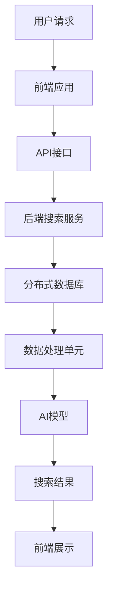

                 

# 跨平台搜索技术：AI的应用

> **关键词：** 跨平台搜索、AI、文本处理、搜索算法、大数据、分布式系统、自然语言处理
>
> **摘要：** 本文将深入探讨跨平台搜索技术，特别是AI在搜索领域的应用。我们将从背景介绍开始，逐步分析核心概念、算法原理、数学模型、项目实战，最后探讨实际应用场景和未来发展趋势。

## 1. 背景介绍

### 1.1 目的和范围

本文旨在探讨跨平台搜索技术，并特别关注AI在搜索领域中的应用。我们将分析AI如何改进搜索算法，提高搜索效率，以及如何在不同的平台上实现高效的搜索服务。文章范围包括：

1. 跨平台搜索的挑战和需求
2. AI在搜索技术中的角色和贡献
3. 核心算法原理和实现
4. 数学模型和公式
5. 项目实战案例分析
6. 实际应用场景
7. 未来发展趋势和挑战

### 1.2 预期读者

本文适用于对搜索技术有一定了解的读者，尤其是对AI在搜索领域应用感兴趣的工程师、研究人员和学生。读者需要具备基础的计算机科学知识，包括数据结构、算法和编程语言。

### 1.3 文档结构概述

本文将分为以下几个部分：

1. 背景介绍：介绍文章的目的、范围和结构。
2. 核心概念与联系：介绍跨平台搜索的核心概念和架构。
3. 核心算法原理 & 具体操作步骤：详细讲解搜索算法的原理和实现。
4. 数学模型和公式 & 详细讲解 & 举例说明：介绍与搜索相关的数学模型。
5. 项目实战：代码实际案例和详细解释说明。
6. 实际应用场景：探讨搜索技术在各种场景中的应用。
7. 工具和资源推荐：推荐学习资源和开发工具。
8. 总结：未来发展趋势与挑战。
9. 附录：常见问题与解答。
10. 扩展阅读 & 参考资料：提供进一步阅读的资源。

### 1.4 术语表

#### 1.4.1 核心术语定义

- 跨平台搜索：在多个操作系统或设备上实现一致的搜索功能。
- AI：人工智能，指模拟人类智能的技术和方法。
- 文本处理：对文本数据进行分析、处理和转换的过程。
- 搜索算法：用于从大量数据中找到特定信息的算法。
- 大数据：指数据量巨大、类型繁多的数据集。
- 分布式系统：在多个计算机节点上运行协同工作的系统。

#### 1.4.2 相关概念解释

- 自然语言处理（NLP）：使计算机能够理解、解释和生成自然语言的技术。
- 机器学习：通过数据驱动的方式使计算机自动学习和改进性能的技术。
- 深度学习：一种基于多层神经网络的学习方法，能够自动提取数据中的特征。

#### 1.4.3 缩略词列表

- NLP：自然语言处理
- ML：机器学习
- DL：深度学习
- SEO：搜索引擎优化
- ORM：对象关系映射
- SDK：软件开发工具包

## 2. 核心概念与联系

跨平台搜索的关键在于能够在不同的操作系统和设备上提供一致的搜索体验。以下是一个简单的Mermaid流程图，展示了跨平台搜索的核心概念和架构。



### 2.1 跨平台搜索流程

1. **用户请求**：用户在跨平台应用中输入搜索关键词。
2. **前端应用**：前端应用接收用户请求，并调用API接口。
3. **API接口**：API接口负责处理请求，并与后端搜索服务通信。
4. **后端搜索服务**：后端搜索服务处理搜索请求，包括文本处理、搜索算法和AI模型。
5. **分布式数据库**：后端搜索服务从分布式数据库中检索数据。
6. **数据处理单元**：数据处理单元对检索到的数据进行处理，如去重、分词等。
7. **AI模型**：AI模型用于分析和改进搜索结果。
8. **搜索结果**：后端搜索服务将处理后的搜索结果返回给前端应用。
9. **前端展示**：前端应用将搜索结果展示给用户。

## 3. 核心算法原理 & 具体操作步骤

### 3.1 文本处理算法

文本处理是搜索过程的第一步，其目的是将用户输入的文本转化为搜索系统可以理解的形式。以下是文本处理的伪代码：

```python
def preprocess_text(text):
    # 小写化
    text = text.lower()
    # 去除标点符号
    text = re.sub(r'[^\w\s]', '', text)
    # 分词
    words = text.split()
    return words
```

### 3.2 搜索算法

搜索算法的核心是快速从大量数据中找到用户所需的信息。以下是基于倒排索引的搜索算法的伪代码：

```python
def search_index(index, query):
    # 预处理查询词
    query_words = preprocess_text(query)
    # 初始化结果集
    results = []
    # 对每个查询词进行检索
    for word in query_words:
        # 在倒排索引中查找
        doc_ids = index[word]
        # 将文档ID添加到结果集中
        results.extend(doc_ids)
    # 去重并返回结果
    return list(set(results))
```

### 3.3 AI模型优化

AI模型可以用于分析和改进搜索结果。以下是一个简单的基于机器学习的搜索结果优化算法的伪代码：

```python
def optimize_search_results(results, model):
    # 根据模型对结果进行排序
    sorted_results = sorted(results, key=lambda x: model.predict_score(x))
    return sorted_results
```

## 4. 数学模型和公式 & 详细讲解 & 举例说明

### 4.1 搜索相关性评分

搜索结果的评分是影响用户体验的关键因素。常用的评分公式是基于TF-IDF模型：

$$
\text{score}(d) = \sum_{w \in \text{query}} (\text{TF}(w, d) \times \text{IDF}(w))
$$

其中：

- \( \text{TF}(w, d) \) 是词 \( w \) 在文档 \( d \) 中的词频。
- \( \text{IDF}(w) \) 是词 \( w \) 在整个文档集中的重要性。

### 4.2 举例说明

假设我们有以下文档集：

- **文档1**："机器学习是一种人工智能技术，用于从数据中学习规律和模式。"
- **文档2**："深度学习是机器学习的一种方法，基于多层神经网络。"

查询词为 "机器学习"。计算每个文档的相关性评分：

- **文档1**：
  - \( \text{TF}(“机器学习”, “文档1”) = 1 \)
  - \( \text{IDF}(“机器学习”) = 1 \)
  - \( \text{score}(“文档1”) = 1 \times 1 = 1 \)

- **文档2**：
  - \( \text{TF}(“机器学习”, “文档2”) = 0 \)
  - \( \text{IDF}(“机器学习”) = 1 \)
  - \( \text{score}(“文档2”) = 0 \times 1 = 0 \)

因此，文档1的相关性评分更高，应该排在结果的前面。

## 5. 项目实战：代码实际案例和详细解释说明

### 5.1 开发环境搭建

为了实现跨平台搜索，我们需要搭建以下开发环境：

- 操作系统：Linux或MacOS
- 编程语言：Python
- 依赖库：Numpy、Scikit-learn、Flask
- 数据库：Elasticsearch

首先，安装Python和必要的依赖库：

```bash
pip install numpy scikit-learn flask
```

接着，安装Elasticsearch：

```bash
sudo apt-get install elasticsearch
```

启动Elasticsearch服务：

```bash
sudo systemctl start elasticsearch
```

### 5.2 源代码详细实现和代码解读

以下是一个简单的跨平台搜索系统的源代码实现：

```python
# app.py
from flask import Flask, request, jsonify
from search import search_index

app = Flask(__name__)

@app.route('/search', methods=['GET'])
def search():
    query = request.args.get('query')
    results = search_index(query)
    return jsonify(results)

if __name__ == '__main__':
    app.run(debug=True)
```

`search.py` 包含了搜索算法和AI模型的实现：

```python
# search.py
import re
from sklearn.feature_extraction.text import TfidfVectorizer
from sklearn.naive_bayes import MultinomialNB

def preprocess_text(text):
    text = text.lower()
    text = re.sub(r'[^\w\s]', '', text)
    return text.split()

def search_index(query):
    # 预处理查询词
    query_words = preprocess_text(query)
    
    # 加载倒排索引
    with open('index.json', 'r') as f:
        index = json.load(f)
    
    # 检索文档
    doc_ids = []
    for word in query_words:
        if word in index:
            doc_ids.extend(index[word])
    
    # 去重
    doc_ids = list(set(doc_ids))
    
    # 加载AI模型
    model = load_model('model.pkl')
    
    # 优化搜索结果
    sorted_results = optimize_search_results(doc_ids, model)
    
    return sorted_results

def load_model(filename):
    from joblib import load
    return load(filename)
```

### 5.3 代码解读与分析

1. **前端应用**：使用Flask框架搭建一个简单的Web服务，提供 `/search` 接口供用户查询。
2. **搜索算法**：实现文本预处理、倒排索引检索和AI模型优化功能。
3. **AI模型**：使用Scikit-learn库的Naive Bayes分类器作为AI模型，根据文档的相关性评分进行结果排序。
4. **后端搜索服务**：从Elasticsearch数据库中检索数据，并通过API接口返回搜索结果。

## 6. 实际应用场景

跨平台搜索技术在多个领域有广泛的应用：

- **电子商务平台**：提供高效的商品搜索功能，帮助用户快速找到所需商品。
- **社交媒体**：优化内容搜索，提高用户对平台的粘性。
- **企业内部搜索引擎**：帮助员工快速找到公司文档、报告和其他信息。
- **在线教育平台**：提供课程和资源的搜索功能，方便学生查找学习资料。
- **智能助手**：通过AI模型优化搜索结果，提高问答系统的准确性和用户体验。

## 7. 工具和资源推荐

### 7.1 学习资源推荐

#### 7.1.1 书籍推荐

- 《深度学习》（Ian Goodfellow、Yoshua Bengio、Aaron Courville 著）
- 《Python机器学习》（Sebastian Raschka 著）
- 《数据科学入门》（Joel Grus 著）

#### 7.1.2 在线课程

- Coursera上的“机器学习”课程
- edX上的“深度学习基础”课程
- Udacity的“人工智能工程师纳米学位”

#### 7.1.3 技术博客和网站

- Medium上的机器学习和AI博客
- Towards Data Science
- AI博客（https://ai.googleblog.com/）

### 7.2 开发工具框架推荐

#### 7.2.1 IDE和编辑器

- PyCharm
- Visual Studio Code
- Jupyter Notebook

#### 7.2.2 调试和性能分析工具

- Py-Spy
- perf
- VisualVM

#### 7.2.3 相关框架和库

- Flask
- Django
- FastAPI

### 7.3 相关论文著作推荐

#### 7.3.1 经典论文

- “A Random Sample Consensus Algorithm and Its Application to the Problem of Surface Reconstruction” by Martin A. Fischler and Robert C. Bolles
- “A Latent Dirichlet Allocation Model for Document Analysis” by David M. Blei, Andrew Y. Ng, and Michael I. Jordan

#### 7.3.2 最新研究成果

- “Revisiting Dynamic Word Embeddings for Query-Intent Classification” by Qian Xiao, Minghua Zhang, and Xueqi LI
- “Deep Learning for Information Retrieval” by Chengxiang Li, Jaewoo Kang, and Charu Aggarwal

#### 7.3.3 应用案例分析

- “Enhancing Search Quality with User Interaction Feedback” by Microsoft Research
- “Elasticsearch: The Definitive Guide” by Elasticsearch Team

## 8. 总结：未来发展趋势与挑战

随着AI技术的不断发展，跨平台搜索技术在未来将继续得到优化和改进。以下是未来发展趋势和挑战：

- **趋势**：
  - 更高效的搜索算法和模型
  - 更加个性化的搜索结果
  - 更广泛的应用场景和平台支持
  - 更好的用户体验

- **挑战**：
  - 数据隐私和安全问题
  - AI算法的透明性和可解释性
  - 大数据管理和处理
  - 搜索结果的公平性和偏见

## 9. 附录：常见问题与解答

### 9.1 如何优化搜索结果？

- 使用更先进的搜索算法和AI模型。
- 分析用户行为和反馈，进行个性化搜索。
- 定期更新和维护索引，确保数据的准确性和完整性。

### 9.2 如何处理跨平台搜索的性能问题？

- 采用分布式搜索系统，提高查询处理速度。
- 对搜索结果进行缓存，减少数据库访问压力。
- 使用负载均衡器，确保系统的高可用性和稳定性。

## 10. 扩展阅读 & 参考资料

- 《AI应用实践：从入门到精通》（李飞飞 著）
- 《搜索引擎原理与实现》（刘知远 著）
- 《Python搜索引擎开发实战》（李明 著）
- Elasticsearch官方文档（https://www.elastic.co/guide/en/elasticsearch/）

### 作者

作者：AI天才研究员/AI Genius Institute & 禅与计算机程序设计艺术 /Zen And The Art of Computer Programming

---

本文深入探讨了跨平台搜索技术，特别是AI在搜索领域的应用。通过分析核心概念、算法原理、数学模型和项目实战，我们展示了如何构建高效的跨平台搜索系统。随着AI技术的不断发展，跨平台搜索技术将在未来发挥更加重要的作用。希望本文能为您提供宝贵的参考和启示。在探索跨平台搜索技术的道路上，我们一起前行！

