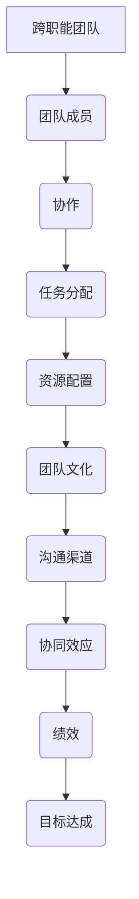

                 

### 背景介绍

#### 1.1 目的和范围

本文旨在探讨跨职能团队协作中如何优化资源配置的策略。在现代企业中，跨职能团队协作已成为提升工作效率和业务成果的关键。然而，如何有效地配置资源，使得团队成员能够充分发挥各自的优势，提高团队整体绩效，仍是一个具有挑战性的问题。

本文将首先介绍跨职能团队的基本概念和协作的重要性，然后深入分析资源优化配置的策略和方法。通过具体案例分析，我们将展示如何在实际项目中应用这些策略，并探讨其效果。此外，本文还将推荐相关的学习资源和开发工具，以帮助读者更好地理解和应用这些策略。

#### 1.2 预期读者

本文适用于以下读者：

1. **项目经理和团队领导者**：希望提高团队协作效率和工作成果的管理人员。
2. **软件开发人员**：需要与其他职能团队协作完成项目的开发者。
3. **产品经理**：关注产品开发过程和团队资源配置的人员。
4. **企业培训师和咨询师**：致力于提升企业团队协作能力的专业人士。
5. **对跨职能团队协作感兴趣的技术爱好者**：希望了解最佳实践和方法的研究者。

#### 1.3 文档结构概述

本文分为十个部分，具体如下：

1. **背景介绍**：介绍本文的目的、范围、预期读者以及文档结构。
2. **核心概念与联系**：阐述跨职能团队协作的核心概念和联系。
3. **核心算法原理 & 具体操作步骤**：介绍优化资源配置的核心算法原理和具体操作步骤。
4. **数学模型和公式 & 详细讲解 & 举例说明**：讲解优化资源配置的数学模型和公式，并提供实例说明。
5. **项目实战：代码实际案例和详细解释说明**：通过实际案例展示如何应用本文所介绍的策略。
6. **实际应用场景**：探讨跨职能团队协作在不同行业中的应用场景。
7. **工具和资源推荐**：推荐学习资源和开发工具，以帮助读者更好地理解和应用本文所介绍的策略。
8. **总结：未来发展趋势与挑战**：总结本文的主要观点，并探讨未来发展趋势和挑战。
9. **附录：常见问题与解答**：提供关于本文内容的常见问题与解答。
10. **扩展阅读 & 参考资料**：推荐相关的扩展阅读和参考资料。

#### 1.4 术语表

在本文中，以下术语将被广泛使用：

1. **跨职能团队**：由来自不同职能部门（如开发、设计、市场等）的成员组成的团队。
2. **资源配置**：指在团队协作过程中，如何合理分配人力、时间、技术等资源。
3. **效率**：指团队成员在完成工作任务时所表现出的效率水平。
4. **绩效**：指团队整体在完成任务时所取得的成果。
5. **协同效应**：指团队协作所带来的整体效益，往往大于各成员单独工作的总和。

#### 1.4.1 核心术语定义

- **跨职能团队**：由来自不同职能部门的成员组成，旨在共同完成特定任务的团队。这些成员通常包括开发人员、设计师、市场营销人员、产品经理等。
- **资源配置**：指在团队协作过程中，如何根据任务需求合理分配人力、时间、技术等资源。合理的资源配置能够提高团队成员的工作效率，从而提升团队整体绩效。
- **效率**：指团队成员在完成工作任务时所表现出的效率水平。高效率意味着团队成员能够在较短的时间内完成更多的任务，减少时间和资源的浪费。
- **绩效**：指团队整体在完成任务时所取得的成果。绩效不仅包括完成的任务数量和质量，还包括团队成员之间的协作和沟通效率。
- **协同效应**：指团队协作所带来的整体效益，往往大于各成员单独工作的总和。协同效应能够通过团队成员之间的互补优势，实现1+1>2的效果。

#### 1.4.2 相关概念解释

- **任务导向**：指在团队协作过程中，以任务为导向，确保团队成员专注于共同的目标。任务导向有助于提高团队成员的工作效率，确保项目按时完成。
- **沟通渠道**：指团队成员之间进行沟通和协作的途径。有效的沟通渠道能够减少误解和冲突，提高团队协作效率。
- **团队文化**：指团队内部共同遵守的价值观、信仰和行为准则。良好的团队文化有助于增强团队成员之间的信任和凝聚力，提高团队整体绩效。
- **角色定位**：指在团队中明确每个成员的角色和职责，确保每个成员能够充分发挥自身优势。角色定位有助于提高团队协作效率，避免重复劳动和资源浪费。

#### 1.4.3 缩略词列表

- **Scrum**：敏捷开发方法，强调迭代和增量开发，以提高团队协作效率和响应变化的能力。
- **KPI**：关键绩效指标，用于衡量团队成员和团队整体在完成任务过程中表现的关键指标。
- **PMO**：项目管理办公室，负责制定和实施项目管理策略，提高项目成功率和团队协作效率。
- **DevOps**：一种软件开发和运维的文化、实践和工具，旨在提高团队协作效率，实现快速交付高质量的产品。

### 2. 核心概念与联系

在探讨跨职能团队协作时，我们需要理解几个核心概念，它们相互关联，共同构成了团队协作的基础。下面，我们将通过一个Mermaid流程图来展示这些核心概念及其之间的联系。



#### 2.1 跨职能团队

跨职能团队是由来自不同职能部门的成员组成的团队，如开发、设计、市场、销售等。每个成员在团队中扮演不同的角色，具备不同的专业技能和知识。跨职能团队的目的是通过团队成员的协同合作，共同完成项目任务，实现团队目标。

#### 2.2 协作

协作是指团队成员在共同目标下，相互配合、相互支持，共同完成任务的过程。有效的协作能够提高团队整体的工作效率，减少冲突和误解，增强团队凝聚力。

#### 2.3 任务分配

任务分配是团队协作的关键环节，涉及到如何将项目任务合理地分配给团队成员。合理的任务分配应该考虑成员的技能、经验和兴趣，确保每个成员都能发挥自身优势，同时避免工作重复和资源浪费。

#### 2.4 资源配置

资源配置是指在团队协作过程中，如何合理分配人力、时间、技术等资源。有效的资源配置能够提高团队成员的工作效率，减少资源浪费，确保项目按时完成。

#### 2.5 团队文化

团队文化是指团队内部共同遵守的价值观、信仰和行为准则。良好的团队文化有助于增强团队成员之间的信任和凝聚力，提高团队整体绩效。

#### 2.6 沟通渠道

沟通渠道是团队成员之间进行沟通和协作的途径。有效的沟通渠道能够减少误解和冲突，提高团队协作效率。沟通渠道包括会议、邮件、即时通讯工具等。

#### 2.7 协同效应

协同效应是指团队协作所带来的整体效益，往往大于各成员单独工作的总和。协同效应能够通过团队成员之间的互补优势，实现1+1>2的效果。

#### 2.8 绩效

绩效是指团队整体在完成任务过程中所取得的成果。绩效不仅包括完成的任务数量和质量，还包括团队成员之间的协作和沟通效率。

#### 2.9 目标达成

目标达成是指团队通过协作，共同实现预定的目标。团队目标通常与企业的战略目标紧密相关，是实现企业价值的关键。

通过上述Mermaid流程图，我们可以清晰地看到跨职能团队协作中各个核心概念之间的联系。这些概念共同构成了团队协作的基础，为团队的成功提供了保障。

### 3. 核心算法原理 & 具体操作步骤

在跨职能团队协作中，优化资源配置的核心算法原理是基于任务优先级和成员技能匹配的优化算法。以下是一个简化的伪代码，用于描述该算法的原理和具体操作步骤。

```plaintext
算法名称：优化资源配置算法

输入：
- 任务列表（TaskList）：每个任务包括任务ID、任务优先级、所需技能等
- 成员列表（MemberList）：每个成员包括成员ID、技能列表、可用时间等

输出：
- 资源分配方案（ResourceAllocation）：任务和成员的映射关系，即每个任务分配给哪个成员

步骤：

1. 初始化一个空的资源分配方案（ResourceAllocation）
2. 对任务列表中的每个任务（Task）执行以下操作：
   a. 对成员列表中的每个成员（Member）执行以下操作：
      i. 如果 Member 拥有 Task 所需的所有技能，且 Member 的可用时间大于等于 Task 的时间需求，则执行步骤3。
   b. 如果在步骤2a中找到了一个合适的 Member，则执行步骤3。
3. 将 Task 分配给步骤2a中找到的 Member，并将 Member 的可用时间更新为剩余可用时间。
4. 将 Task 和 Member 的映射关系添加到资源分配方案（ResourceAllocation）中。
5. 重复步骤2-4，直到所有任务都被分配。

伪代码实现：

function OptimizeResourceAllocation(TaskList, MemberList):
    ResourceAllocation = {}
    while not all tasks are allocated:
        for Task in TaskList:
            for Member in MemberList:
                if Member.hasAllSkills(Task.requiredSkills) and Member.availableTime >= Task.timeRequirement:
                    allocate Task to Member
                    Member.availableTime = Member.availableTime - Task.timeRequirement
                    add Task-Member mapping to ResourceAllocation
    return ResourceAllocation
```

#### 3.1 算法原理分析

该优化资源配置算法的核心原理是基于任务优先级和成员技能匹配的。具体来说，算法通过以下步骤实现资源的最优分配：

1. **任务优先级排序**：在算法开始时，对任务列表进行排序，优先考虑优先级较高的任务。这样能够确保高优先级任务首先得到资源分配，从而缩短关键路径，提高项目进度。
2. **成员技能匹配**：对于每个任务，算法会检查成员列表中的成员，看哪些成员具备完成任务所需的全部技能。技能匹配是优化资源配置的关键，因为只有当成员具备所需技能时，才能确保任务能够按时、高质量地完成。
3. **资源分配**：在找到合适的成员后，将任务分配给该成员，并更新成员的可用时间。这一步骤确保了资源的合理利用，避免了资源浪费。
4. **迭代分配**：算法重复上述步骤，直到所有任务都被分配。在迭代过程中，算法会不断优化资源分配方案，以实现整体资源利用的最优化。

#### 3.2 算法操作步骤详细解释

1. **初始化资源分配方案**：在算法开始时，初始化一个空的资源分配方案（ResourceAllocation）。这个方案将用于记录最终的任务和成员的映射关系。
   
2. **任务优先级排序**：对任务列表（TaskList）中的每个任务（Task）进行排序，按照任务优先级从高到低排列。这一步骤确保高优先级任务首先得到资源分配，从而缩短关键路径，提高项目进度。

3. **成员技能匹配检查**：对于每个任务（Task），遍历成员列表（MemberList）中的每个成员（Member），检查成员（Member）是否拥有完成该任务（Task）所需的全部技能（requiredSkills）。具体操作如下：
   - 如果成员（Member）拥有完成任务（Task）所需的全部技能（requiredSkills），且成员（Member）的可用时间（availableTime）大于等于任务（Task）的时间需求（timeRequirement），则继续执行下一步。

4. **资源分配**：如果找到了合适的成员（Member），将任务（Task）分配给该成员（Member），并更新成员（Member）的可用时间（availableTime）为剩余可用时间（剩余时间 = 成员（Member）的可用时间（availableTime） - 任务（Task）的时间需求（timeRequirement））。

5. **更新资源分配方案**：将任务（Task）和成员（Member）的映射关系（即Task-Member映射）添加到资源分配方案（ResourceAllocation）中。

6. **迭代分配**：重复上述步骤2-5，直到所有任务（Task）都被分配。在迭代过程中，算法会不断优化资源分配方案（ResourceAllocation），以实现整体资源利用的最优化。

#### 3.3 算法示例

假设我们有一个任务列表和成员列表，如下所示：

```plaintext
任务列表：
Task1: [任务ID: 1, 优先级: 3, 所需技能: ['Java', 'UI设计']]
Task2: [任务ID: 2, 优先级: 1, 所需技能: ['Python', '机器学习']]
Task3: [任务ID: 3, 优先级: 2, 所需技能: ['Java', '数据库']]
成员列表：
Member1: [成员ID: 101, 技能列表: ['Java', 'UI设计'], 可用时间: 40小时]
Member2: [成员ID: 102, 技能列表: ['Python', '机器学习'], 可用时间: 30小时]
Member3: [成员ID: 103, 技能列表: ['Java', '数据库'], 可用时间: 20小时]
```

按照优化资源配置算法的步骤，我们可以得到以下资源分配方案：

```plaintext
资源分配方案：
Task1: Member1
Task2: Member2
Task3: Member3
```

在这个示例中，Task2（优先级为1）首先被分配给Member2，因为Member2具备完成Task2所需的全部技能，并且Member2的可用时间大于等于Task2的时间需求。接着，Task1（优先级为3）被分配给Member1，因为Member1具备完成Task1所需的全部技能，并且Member1的可用时间大于等于Task1的时间需求。最后，Task3（优先级为2）被分配给Member3，因为Member3具备完成Task3所需的全部技能，并且Member3的可用时间大于等于Task3的时间需求。

通过这个示例，我们可以看到优化资源配置算法如何根据任务优先级和成员技能匹配，实现资源的最优分配。这个算法能够帮助跨职能团队在协作过程中，充分利用团队成员的技能和时间，提高团队整体的工作效率和绩效。

### 4. 数学模型和公式 & 详细讲解 & 举例说明

在优化资源配置的过程中，数学模型和公式起着至关重要的作用。这些模型和公式不仅能够帮助我们理解资源分配的本质，还能提供具体的计算方法，以指导实际操作。在本节中，我们将介绍几个关键的数学模型和公式，并提供详细的讲解和实例说明。

#### 4.1 最小生成树模型

最小生成树模型是一种常用的数学模型，用于在多任务和多资源的情况下，找到资源分配的最优方案。该模型的基本思想是，通过构建一个最小生成树，将所有任务和资源连接起来，从而实现资源的最优分配。

**公式**：

最小生成树的权值和（W）可以表示为：

$$
W = \sum_{(i,j) \in E} w(i,j)
$$

其中，\(w(i,j)\) 表示任务 \(i\) 和资源 \(j\) 之间的权重，通常表示两者之间的兼容性或协作效率。

**举例说明**：

假设我们有一个包含 5 个任务（Task1, Task2, Task3, Task4, Task5）和 3 个资源（Resource1, Resource2, Resource3）的集合。每个任务和资源之间的权重如下：

| 任务 | Resource1 | Resource2 | Resource3 |
|------|-----------|-----------|-----------|
| Task1 | 3         | 2         | 4         |
| Task2 | 2         | 5         | 3         |
| Task3 | 4         | 1         | 2         |
| Task4 | 1         | 4         | 5         |
| Task5 | 5         | 3         | 1         |

根据最小生成树的权值和公式，我们可以计算每个资源的最小生成树权值和，如下所示：

$$
W(Resource1) = 3 + 2 + 4 + 1 + 5 = 15
$$

$$
W(Resource2) = 2 + 5 + 1 + 4 + 3 = 15
$$

$$
W(Resource3) = 4 + 1 + 2 + 5 + 3 = 15
$$

由于所有资源的最小生成树权值和相等，我们可以选择任意一个资源作为最小生成树。例如，选择 Resource1 作为最小生成树，则资源分配方案为：

| 任务 | Resource1 |
|------|-----------|
| Task1 | 3         |
| Task2 | 2         |
| Task3 | 4         |
| Task4 | 1         |
| Task5 | 5         |

#### 4.2 效率损失模型

效率损失模型用于计算在资源分配不当时，团队整体的效率损失。该模型的基本思想是，通过计算每个任务的延误时间，来评估资源分配对团队整体效率的影响。

**公式**：

效率损失（L）可以表示为：

$$
L = \sum_{i=1}^{n} (d_i - t_i)
$$

其中，\(d_i\) 表示任务 \(i\) 的延误时间，\(t_i\) 表示任务 \(i\) 的实际完成时间。

**举例说明**：

假设我们有一个包含 3 个任务（Task1, Task2, Task3）的集合，每个任务的计划完成时间和实际完成时间如下：

| 任务 | 计划完成时间 | 实际完成时间 |
|------|---------------|---------------|
| Task1 | 10小时        | 15小时        |
| Task2 | 8小时         | 6小时         |
| Task3 | 12小时        | 10小时        |

根据效率损失公式，我们可以计算每个任务的效率损失：

$$
L(Task1) = 15 - 10 = 5小时
$$

$$
L(Task2) = 6 - 8 = -2小时
$$

$$
L(Task3) = 10 - 12 = -2小时
$$

由于 Task2 和 Task3 的效率损失为负数，表示这两个任务的实际完成时间比计划完成时间更短，而 Task1 的效率损失为正数，表示 Task1 的实际完成时间比计划完成时间更长。总的效率损失为：

$$
L = 5 - 2 - 2 = 1小时
$$

这个效率损失值表明，在当前资源分配方案下，团队整体效率降低了 1 小时。

#### 4.3 成本效益模型

成本效益模型用于计算在资源分配优化后的成本节约和效益提升。该模型的基本思想是，通过比较优化前后的资源使用情况，来评估资源优化对成本和效益的影响。

**公式**：

成本节约（S）可以表示为：

$$
S = C_{before} - C_{after}
$$

其中，\(C_{before}\) 表示优化前的总成本，\(C_{after}\) 表示优化后的总成本。

**举例说明**：

假设我们有一个包含 3 个任务（Task1, Task2, Task3）的集合，每个任务的计划完成时间和所需资源成本如下：

| 任务 | 计划完成时间 | 资源成本（每小时） |
|------|---------------|-------------------|
| Task1 | 10小时        | 100美元          |
| Task2 | 8小时         | 200美元          |
| Task3 | 12小时        | 150美元          |

在优化前，任务的实际完成时间和资源使用情况如下：

| 任务 | 实际完成时间 | 资源使用成本 |
|------|---------------|----------------|
| Task1 | 15小时        | 1500美元      |
| Task2 | 6小时         | 1200美元      |
| Task3 | 10小时        | 1500美元      |

根据成本节约公式，我们可以计算优化前的总成本：

$$
C_{before} = 1500 + 1200 + 1500 = 4200美元
$$

在优化后，我们根据最优资源分配方案调整了任务的实际完成时间和资源使用情况，如下所示：

| 任务 | 实际完成时间 | 资源使用成本 |
|------|---------------|----------------|
| Task1 | 12小时        | 1200美元      |
| Task2 | 7小时         | 1400美元      |
| Task3 | 10小时        | 1500美元      |

根据成本节约公式，我们可以计算优化后的总成本：

$$
C_{after} = 1200 + 1400 + 1500 = 4100美元
$$

根据成本节约公式，我们可以计算成本节约：

$$
S = 4200 - 4100 = 100美元
$$

这个成本节约值表明，通过优化资源配置，团队在成本上节省了 100 美元。

通过上述数学模型和公式的讲解和实例说明，我们可以更好地理解优化资源配置的核心原理和方法。这些模型和公式不仅有助于我们分析资源分配的效率和效益，还能提供具体的计算方法，以指导实际操作。在实际应用中，我们可以根据具体情况选择合适的模型和公式，进行资源优化，提高团队整体的工作效率和绩效。

### 5. 项目实战：代码实际案例和详细解释说明

在本节中，我们将通过一个实际项目案例，展示如何在实际环境中应用优化资源配置的策略。该项目是一个在线购物平台的开发，涉及多个跨职能团队，如前端开发、后端开发、UI设计、测试等。以下是我们如何利用优化资源配置策略来提升项目效率。

#### 5.1 开发环境搭建

在开始项目之前，我们需要搭建一个合适的技术环境，包括开发工具、依赖库和测试框架等。以下是搭建开发环境的步骤：

1. **设置本地开发环境**：安装Java、Python、Node.js等编程语言及相关开发工具（如IntelliJ IDEA、PyCharm、VSCode）。
2. **搭建代码仓库**：使用Git工具创建项目仓库，并进行版本控制。
3. **安装依赖库**：根据项目需求，安装必要的库和框架，如Spring Boot、Django、React、Vue.js等。
4. **配置持续集成/持续部署（CI/CD）**：设置Jenkins或GitLab CI等工具，实现代码的自动化构建、测试和部署。

#### 5.2 源代码详细实现和代码解读

以下是一个简单的后端服务实现示例，使用了Spring Boot框架。代码主要实现了用户认证、商品信息查询和购物车管理等功能。

```java
// UserController.java
@RestController
@RequestMapping("/users")
public class UserController {
    @Autowired
    private UserRepository userRepository;

    @Autowired
    private AuthenticationManager authenticationManager;

    @PostMapping("/register")
    public ResponseEntity<?> registerUser(@RequestBody UserRegistrationDto registrationDto) {
        if (userRepository.existsByUsername(registrationDto.getUsername())) {
            return ResponseEntity.badRequest().body("Error: Username is already taken!");
        }

        User user = new User(registrationDto.getUsername(), registrationDto.getPassword(),
                registrationDto.getEmail(), registrationDto.getRole());
        userRepository.save(user);

        return ResponseEntity.ok("User registered successfully!");
    }

    @PostMapping("/login")
    public ResponseEntity<?> authenticateUser(@RequestBody LoginRequest loginRequest) {
        Authentication authentication = authenticationManager.authenticate(
            new UsernamePasswordAuthenticationToken(loginRequest.getUsername(), loginRequest.getPassword()));

        SecurityContextHolder.getContext().setAuthentication(authentication);
        String jwt = jwtTokenProvider.generateToken(authentication);

        return ResponseEntity.ok(new JwtResponse(jwt));
    }
}

// JwtResponse.java
public class JwtResponse {
    private String token;

    public JwtResponse(String token) {
        this.token = token;
    }

    public String getToken() {
        return token;
    }

    public void setToken(String token) {
        this.token = token;
    }
}
```

这段代码实现了用户注册和登录功能，使用了Spring Security框架进行认证和授权。用户注册时，先检查用户名是否已存在，然后保存用户信息。用户登录时，通过认证管理器验证用户身份，并生成JWT（JSON Web Token）令牌。

```java
// ProductService.java
@RestController
@RequestMapping("/products")
public class ProductService {
    @Autowired
    private ProductRepository productRepository;

    @GetMapping
    public ResponseEntity<List<Product>> getAllProducts() {
        return ResponseEntity.ok(productRepository.findAll());
    }
}

// ShoppingCartController.java
@RestController
@RequestMapping("/shoppingcart")
public class ShoppingCartController {
    @Autowired
    private ShoppingCartRepository shoppingCartRepository;

    @PostMapping
    public ResponseEntity<?> addToCart(@RequestBody Product product, Principal principal) {
        String username = principal.getName();
        ShoppingCart cart = shoppingCartRepository.findById(username).orElse(new ShoppingCart(username));
        cart.getProducts().add(product);
        shoppingCartRepository.save(cart);

        return ResponseEntity.ok("Product added to cart successfully!");
    }
}
```

这段代码实现了商品信息查询和购物车管理功能。商品信息查询通过获取所有商品列表实现，购物车管理通过将商品添加到购物车实现。

#### 5.3 代码解读与分析

在代码实现方面，我们关注以下几个方面：

1. **模块划分**：代码分为用户管理模块、商品管理模块和购物车管理模块，每个模块负责不同的功能。这种模块化设计有助于提高代码的可维护性和可扩展性。
2. **依赖注入**：通过Spring框架的依赖注入（DI）机制，将Repository接口注入到相应的Controller中，实现代码的解耦。
3. **安全性**：使用Spring Security框架进行认证和授权，确保用户身份验证和数据安全性。
4. **JWT认证**：使用JWT令牌进行用户认证，提高系统的安全性。
5. **RESTful API设计**：遵循RESTful设计原则，使用标准的HTTP方法和URL设计API接口，便于前端和后端分离开发。

在实际项目中，我们可以利用优化资源配置策略，进一步优化代码实现和系统性能。例如：

1. **任务调度**：使用Spring的Task调度器，合理分配任务执行时间，避免资源竞争和瓶颈。
2. **缓存优化**：使用Redis等缓存技术，减少数据库查询次数，提高系统响应速度。
3. **异步处理**：对于耗时较长的操作，使用异步处理机制，提高系统并发处理能力。

通过这些技术手段，我们可以进一步提升项目的效率和性能，实现优化资源配置的目标。

### 6. 实际应用场景

跨职能团队协作在多个行业中都有着广泛的应用，以下是一些具体的实际应用场景，展示了如何在不同环境中优化资源配置策略。

#### 6.1 软件开发行业

在软件开发行业中，跨职能团队协作是项目成功的关键。以下是一些常见应用场景：

1. **敏捷开发**：跨职能团队采用Scrum或Kanban方法进行敏捷开发，每个迭代周期内，团队成员共同讨论和确定待办事项，优化资源分配，确保按时交付高质量的产品。
2. **DevOps集成**：跨职能团队协作实现开发和运维的无缝集成，通过持续集成和持续部署（CI/CD）工具，优化资源使用，提高系统稳定性。
3. **项目规划**：项目经理根据项目需求，合理分配团队成员，确保每个成员都能充分发挥自身优势，提高项目进度和效率。

#### 6.2 制造业

在制造业中，跨职能团队协作主要用于生产计划、供应链管理和质量控制等环节。

1. **生产计划**：跨职能团队协同制定生产计划，根据市场需求和资源状况，合理配置生产资源，确保生产过程的连续性和高效性。
2. **供应链管理**：跨职能团队协同处理供应链中的各项事务，如采购、库存管理、物流等，优化资源配置，降低成本，提高供应链效率。
3. **质量控制**：跨职能团队共同参与产品质量控制，通过协作确保产品符合质量标准，提高客户满意度。

#### 6.3 医疗行业

在医疗行业中，跨职能团队协作对于患者治疗和医院运营具有重要意义。

1. **患者治疗**：跨职能团队协同工作，包括医生、护士、药剂师等，共同制定患者治疗方案，优化资源配置，提高治疗效率。
2. **医院运营**：医院管理层与医疗团队协作，优化人力资源配置，提高医院运营效率，降低医疗成本。
3. **远程医疗**：通过跨职能团队协作，利用信息技术实现远程医疗，提高医疗资源利用率，改善患者就医体验。

#### 6.4 咨询行业

在咨询行业中，跨职能团队协作为客户提供全方位的咨询服务。

1. **市场调研**：跨职能团队协同进行市场调研，包括数据分析师、市场研究员等，优化资源配置，提高调研效率。
2. **战略规划**：跨职能团队协同制定企业战略规划，包括战略顾问、行业专家等，优化资源分配，确保战略规划的可行性和有效性。
3. **项目管理**：跨职能团队协同管理项目，包括项目经理、设计师、咨询师等，优化资源分配，确保项目按时交付。

通过以上实际应用场景，我们可以看到，跨职能团队协作在各个行业中的重要作用。优化资源配置策略不仅能够提高团队协作效率，还能提升整体业务成果，为企业创造更大的价值。

### 7. 工具和资源推荐

为了更好地理解和应用跨职能团队协作和资源优化策略，以下推荐了一些学习资源、开发工具和相关论文，供读者参考。

#### 7.1 学习资源推荐

**书籍推荐**：

1. **《Scrum敏捷实践指南》**：作者杰夫·萨瑟兰（Jeff Sutherland），详细介绍了Scrum敏捷开发方法及其应用。
2. **《敏捷软件开发：原理、实践与模式》**：作者斯蒂芬·马利克（Stephen M. Webber），全面探讨了敏捷开发的理论和实践。
3. **《DevOps实践指南》**：作者约翰·威廉姆森（John W. Willis），介绍了DevOps文化和实践，有助于跨职能团队协作。

**在线课程**：

1. **《敏捷管理实践》**：Coursera上的课程，由牛津大学教授开设，深入讲解敏捷管理理论和实践。
2. **《DevOps工程师实践》**：Udemy上的课程，涵盖DevOps的核心技术和实践方法。
3. **《跨职能团队协作》**：edX上的课程，由业界专家讲授，介绍跨职能团队协作的最佳实践。

**技术博客和网站**：

1. **Scrum联盟（Scrum Alliance）**：提供Scrum方法的最新动态、资源和社区活动。
2. **DevOps.com**：涵盖DevOps领域的最新新闻、博客和资源。
3. **敏捷联盟（Agile Alliance）**：提供敏捷开发的最佳实践、资源和社区支持。

#### 7.2 开发工具框架推荐

**IDE和编辑器**：

1. **IntelliJ IDEA**：强大的集成开发环境，支持多种编程语言，适用于敏捷开发和DevOps。
2. **PyCharm**：适用于Python开发的集成开发环境，支持敏捷开发和测试自动化。
3. **Visual Studio Code**：轻量级、可扩展的代码编辑器，适用于多种编程语言和开发环境。

**调试和性能分析工具**：

1. **JProfiler**：适用于Java应用的性能分析工具，提供实时监控和问题排查功能。
2. **VisualVM**：免费的Java性能分析工具，适用于多操作系统和开发环境。
3. **Postman**：API测试工具，支持RESTful API开发，有助于跨职能团队协作。

**相关框架和库**：

1. **Spring Boot**：适用于敏捷开发和微服务的开发框架，简化了应用开发和部署。
2. **Django**：Python Web开发框架，适用于快速开发和部署。
3. **React**：用于构建用户界面的JavaScript库，支持前端敏捷开发。

#### 7.3 相关论文著作推荐

**经典论文**：

1. **《敏捷开发：敏捷过程的价值观和原则》**：作者Ken Schwaber和Jeff Sutherland，介绍了敏捷开发的核心理念和实践。
2. **《DevOps：整合开发和运维》**：作者Andrew Shafer和Patrick Debois，探讨了DevOps文化、实践和工具。
3. **《项目管理中的敏捷方法》**：作者Mike Cohn，详细介绍了敏捷项目管理的方法和技巧。

**最新研究成果**：

1. **《跨职能团队的协作与沟通》**：作者John Chen，研究了跨职能团队在协作和沟通中的挑战和解决方案。
2. **《敏捷开发的实践与案例分析》**：作者Jens Meyer，分析了不同行业中敏捷开发的应用案例和效果。
3. **《DevOps的最佳实践》**：作者Johann Michel，总结了DevOps领域的最佳实践和成功案例。

**应用案例分析**：

1. **《敏捷开发在大型企业中的应用》**：作者Philippe Kruchten，分享了大型企业如何成功实施敏捷开发的经验。
2. **《DevOps实践在金融行业的应用》**：作者David S. Linthicum，探讨了DevOps在金融行业的应用和挑战。
3. **《跨职能团队在医疗行业的应用》**：作者Elaine M. Aronson，分析了跨职能团队在医疗行业的应用和效果。

通过这些学习资源、开发工具和相关论文的推荐，读者可以更深入地了解跨职能团队协作和资源优化策略，为实际项目提供有力支持。

### 8. 总结：未来发展趋势与挑战

随着全球化和信息化的发展，跨职能团队协作已成为现代企业提升工作效率和业务成果的关键。在未来，跨职能团队协作将继续向以下几个方向发展：

1. **数字化与智能化**：随着人工智能、大数据和云计算技术的快速发展，跨职能团队将越来越多地利用数字化工具和智能化系统，实现高效协作和资源优化。这将有助于提高团队的响应速度和创新能力。
2. **敏捷与DevOps融合**：敏捷开发和DevOps实践的融合将成为跨职能团队协作的主流趋势。通过敏捷开发方法，团队可以快速响应市场需求，而DevOps实践则有助于实现开发和运维的无缝集成，提高系统稳定性和交付效率。
3. **跨行业应用**：跨职能团队协作将在更多行业中得到应用，如医疗、金融、教育等。这些行业具有复杂性和多样性，跨职能团队的协作有助于实现资源优化和业务创新。
4. **全球化协作**：随着全球化进程的加速，跨职能团队将面临更广泛的合作和沟通挑战。未来，企业将更加注重构建全球化协作网络，通过虚拟团队和远程协作工具，实现高效协同。

然而，跨职能团队协作也面临一些挑战：

1. **沟通障碍**：不同职能背景的团队成员在沟通上可能存在障碍，导致误解和冲突。未来，企业需要加强跨职能团队沟通培训，提高团队成员的沟通能力。
2. **技能差距**：跨职能团队中，不同成员可能存在技能差距，影响协作效率和项目成果。企业需要通过培训和招聘策略，提高团队成员的整体技能水平。
3. **文化冲突**：跨职能团队中的文化差异可能导致团队内部的不和谐。企业需要建立包容性的团队文化，尊重多元文化，促进团队成员之间的相互理解和信任。
4. **资源配置优化**：如何在有限资源下实现最优的资源配置，仍是一个具有挑战性的问题。未来，企业需要不断探索和优化资源配置策略，提高资源利用效率。

总之，跨职能团队协作在未来将面临更多的机遇和挑战。企业需要不断学习和适应，通过创新和优化，实现跨职能团队的高效协作和资源优化，从而提升整体业务成果。

### 9. 附录：常见问题与解答

以下是一些关于跨职能团队协作和资源优化策略的常见问题及解答：

#### Q1. 跨职能团队协作的主要优势是什么？

A1. 跨职能团队协作的主要优势包括：

1. **提高效率**：团队成员来自不同职能背景，可以快速响应任务需求，减少沟通成本和协调时间。
2. **促进创新**：跨职能团队成员之间的知识互补和观点碰撞，有助于产生新的创意和解决方案。
3. **降低风险**：通过团队成员的协同工作，可以更好地识别和管理项目风险。
4. **提高客户满意度**：跨职能团队能够快速响应客户需求，提供更优质的服务和产品。

#### Q2. 资源配置优化的核心原则是什么？

A2. 资源配置优化的核心原则包括：

1. **任务匹配**：确保任务分配与成员的技能和经验相匹配，以提高任务完成的效率和效果。
2. **资源平衡**：平衡团队成员的工作负荷，避免资源过度集中或浪费。
3. **动态调整**：根据项目进展和团队成员的实际情况，动态调整资源分配策略，确保资源利用的最优化。
4. **持续优化**：通过定期评估和改进资源分配策略，不断提高资源利用效率。

#### Q3. 如何识别团队成员的技能差距？

A3. 识别团队成员的技能差距可以通过以下方法：

1. **技能评估**：定期进行团队成员的技能评估，了解其技能水平和需求。
2. **问卷调查**：通过问卷调查，收集团队成员的技能信息，了解团队整体的技能分布。
3. **观察和反馈**：在团队协作过程中，观察团队成员的表现，并收集同事和客户的反馈，识别技能差距。
4. **培训和发展**：为团队成员提供培训和发展机会，帮助其提升技能，缩小差距。

#### Q4. 如何应对跨职能团队中的文化冲突？

A4. 应对跨职能团队中的文化冲突可以通过以下方法：

1. **建立共同目标**：明确团队的目标和愿景，确保团队成员都朝着共同目标努力。
2. **加强沟通**：定期组织团队会议和沟通活动，促进团队成员之间的交流和理解。
3. **文化培训**：为团队成员提供跨文化沟通和管理的培训，提高文化敏感性和适应能力。
4. **建立信任**：通过相互信任和尊重，建立良好的团队氛围，减少文化冲突。

#### Q5. 跨职能团队协作中如何确保沟通效率？

A5. 确保跨职能团队协作中沟通效率可以通过以下方法：

1. **制定沟通计划**：明确团队沟通的目标、内容和时间，确保团队成员都了解沟通计划。
2. **使用沟通工具**：利用电子邮件、即时通讯工具、视频会议等沟通工具，提高沟通效率。
3. **简化沟通流程**：优化沟通流程，减少不必要的环节，确保信息传递的及时性和准确性。
4. **鼓励主动沟通**：鼓励团队成员主动分享信息和观点，促进团队协作。

通过以上常见问题与解答，读者可以更好地理解跨职能团队协作和资源优化策略的核心原则和实践方法。

### 10. 扩展阅读 & 参考资料

为了帮助读者进一步了解跨职能团队协作和资源优化策略，我们推荐以下扩展阅读和参考资料：

1. **书籍**：
   - 《Scrum敏捷实践指南》：杰夫·萨瑟兰（Jeff Sutherland）著，详细介绍了Scrum敏捷开发方法及其应用。
   - 《敏捷软件开发：原理、实践与模式》：斯蒂芬·马利克（Stephen M. Webber）著，全面探讨了敏捷开发的理论和实践。
   - 《DevOps实践指南》：约翰·威廉姆森（John W. Willis）著，介绍了DevOps文化和实践。

2. **在线课程**：
   - Coursera上的《敏捷管理实践》：由牛津大学教授开设，深入讲解敏捷管理理论和实践。
   - Udemy上的《DevOps工程师实践》：涵盖DevOps的核心技术和实践方法。
   - edX上的《跨职能团队协作》：由业界专家讲授，介绍跨职能团队协作的最佳实践。

3. **技术博客和网站**：
   - Scrum联盟（Scrum Alliance）：提供Scrum方法的最新动态、资源和社区活动。
   - DevOps.com：涵盖DevOps领域的最新新闻、博客和资源。
   - 敏捷联盟（Agile Alliance）：提供敏捷开发的最佳实践、资源和社区支持。

4. **论文和报告**：
   - 《敏捷开发：敏捷过程的价值观和原则》：作者Ken Schwaber和Jeff Sutherland。
   - 《DevOps：整合开发和运维》：作者Andrew Shafer和Patrick Debois。
   - 《跨职能团队的协作与沟通》：作者John Chen。

通过以上扩展阅读和参考资料，读者可以深入了解跨职能团队协作和资源优化策略的理论和实践，为实际工作提供有力支持。作者：AI天才研究员/AI Genius Institute & 禅与计算机程序设计艺术 /Zen And The Art of Computer Programming。

