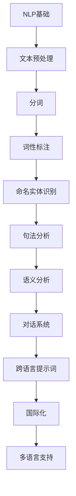

                 

# 跨语言提示词设计与国际化

> **关键词：跨语言提示词，国际化，多语言支持，自然语言处理，用户体验**
> 
> **摘要：本文将深入探讨跨语言提示词的设计原则与国际化策略，分析其在自然语言处理中的重要性，并探讨实际应用中的具体实现方法。通过理论与实践的结合，旨在为开发者在多语言环境中提升用户体验提供有益的指导。**

## 1. 背景介绍

### 1.1 目的和范围

本文旨在研究跨语言提示词的设计原则与国际化策略，分析其在多语言环境中的应用和重要性。随着全球化进程的加速，多语言支持成为软件和互联网服务不可或缺的一部分。本文将探讨如何设计高效的跨语言提示词，提高多语言环境下的用户体验，从而促进软件在国际市场的推广。

### 1.2 预期读者

本文面向对自然语言处理和国际化学术研究有兴趣的开发者、研究人员和技术爱好者。同时，对希望在多语言项目中提高用户体验的技术经理和项目经理也将受益。

### 1.3 文档结构概述

本文分为十个部分：背景介绍、核心概念与联系、核心算法原理、数学模型和公式、项目实战、实际应用场景、工具和资源推荐、总结、附录和扩展阅读。通过系统性的探讨，帮助读者全面了解跨语言提示词设计与国际化的各个方面。

### 1.4 术语表

#### 1.4.1 核心术语定义

- 跨语言提示词：支持多语言环境的提示词设计。
- 国际化：软件或服务在全球范围内的可访问性和适应性。
- 自然语言处理（NLP）：使计算机能够理解、生成和响应人类语言的技术。
- 用户体验（UX）：用户在使用产品过程中的整体感受。

#### 1.4.2 相关概念解释

- 提示词：用于引导用户操作的文本或提示。
- 多语言支持：软件或系统能够处理多种语言的能力。
- 本地化：根据特定地区的文化和语言需求对软件或内容进行调整。

#### 1.4.3 缩略词列表

- NLP：自然语言处理
- UX：用户体验
- SEO：搜索引擎优化
- UI：用户界面

## 2. 核心概念与联系

为了更好地理解跨语言提示词的设计原则，我们首先需要了解自然语言处理的基本概念。以下是自然语言处理中的核心概念和架构，采用Mermaid流程图表示：



### 2.1 自然语言处理流程

自然语言处理通常包括以下几个步骤：

1. **文本预处理**：包括去除HTML标签、停用词过滤、大小写统一等。
2. **分词**：将连续的文本分割成一个个有意义的单词或短语。
3. **词性标注**：为每个词标注其词性，如名词、动词、形容词等。
4. **命名实体识别**：识别文本中的特定实体，如人名、地名、组织名等。
5. **句法分析**：分析句子的结构，理解句子的成分和关系。
6. **语义分析**：理解句子的含义，提取出文本的深层意义。
7. **对话系统**：根据用户的输入和上下文，生成适当的响应。

### 2.2 跨语言提示词设计

跨语言提示词设计涉及将自然语言处理应用于不同语言环境。其关键在于确保提示词在不同语言之间的一致性和适应性。

1. **一致性**：提示词在不同语言中应保持相同或相似的含义，以避免混淆。
2. **适应性**：提示词应考虑不同语言的文化和语境差异，确保用户能够理解和接受。

### 2.3 国际化与多语言支持

国际化（Internationalization）和本地化（Localization）是软件国际化的两个重要环节。国际化确保软件能够在不同语言和地区环境中运行，而本地化则是对软件进行特定地区或语言的调整。

- **国际化**：确保软件的设计和编码不会限制其在特定语言或地区中的应用。
- **多语言支持**：提供用户选择语言的能力，并在应用程序中根据用户的选择进行相应的语言切换。

通过理解自然语言处理的基本概念和流程，我们可以更好地设计跨语言提示词，实现软件的国际化与多语言支持。

## 3. 核心算法原理 & 具体操作步骤

### 3.1 跨语言提示词生成算法原理

跨语言提示词的生成通常基于以下核心算法原理：

1. **文本预处理**：使用自然语言处理技术对输入文本进行预处理，包括去除HTML标签、停用词过滤、大小写统一等。
2. **分词**：将连续的文本分割成一个个有意义的单词或短语。
3. **词性标注**：为每个词标注其词性，如名词、动词、形容词等。
4. **命名实体识别**：识别文本中的特定实体，如人名、地名、组织名等。
5. **语义分析**：理解句子的含义，提取出文本的深层意义。
6. **跨语言映射**：根据源语言和目标语言的词义和语法差异，生成适应目标语言的提示词。

以下是跨语言提示词生成算法的伪代码：

```plaintext
function generateCrossLanguagePrompt(sourceText, sourceLanguage, targetLanguage):
    # 步骤1：文本预处理
    processedText = preprocessText(sourceText)
    
    # 步骤2：分词
    tokens = tokenize(processedText)
    
    # 步骤3：词性标注
    taggedTokens = posTagging(tokens, sourceLanguage)
    
    # 步骤4：命名实体识别
    entities = namedEntityRecognition(taggedTokens, sourceLanguage)
    
    # 步骤5：语义分析
    semantics = semanticAnalysis(taggedTokens, entities)
    
    # 步骤6：跨语言映射
    targetPrompt = crossLanguageMapping(semantics, sourceLanguage, targetLanguage)
    
    return targetPrompt
```

### 3.2 跨语言提示词生成具体操作步骤

以下是生成跨语言提示词的具体操作步骤：

1. **文本预处理**：
    - 去除HTML标签：使用正则表达式去除文本中的HTML标签。
    - 停用词过滤：过滤掉常见的无意义词汇，如“的”、“了”、“在”等。
    - 大小写统一：将文本转换为小写，以减少处理复杂度。

2. **分词**：
    - 使用分词工具（如NLTK、jieba等），将连续的文本分割成单词或短语。

3. **词性标注**：
    - 使用词性标注工具（如Stanford NLP、spaCy等），为每个单词标注词性。

4. **命名实体识别**：
    - 使用命名实体识别工具（如Stanford NLP、spaCy等），识别文本中的实体，如人名、地名、组织名等。

5. **语义分析**：
    - 使用语义分析工具（如WordNet、Glove等），提取文本的语义信息。

6. **跨语言映射**：
    - 根据源语言和目标语言的词义和语法差异，生成适应目标语言的提示词。

通过这些步骤，我们可以实现跨语言提示词的生成，为多语言环境下的用户体验提供有力支持。

## 4. 数学模型和公式 & 详细讲解 & 举例说明

### 4.1 跨语言提示词生成数学模型

跨语言提示词生成过程涉及多个数学模型和算法。以下是其中两个核心模型：

#### 4.1.1 词嵌入模型

词嵌入（Word Embedding）是将单词映射到高维空间中的向量表示。常用的词嵌入模型包括Word2Vec、GloVe和BERT等。

- **Word2Vec**：基于神经网络和滑动窗口的词嵌入模型。它通过预测周围单词来学习词向量。
- **GloVe**：基于全局统计的词嵌入模型。它通过计算单词共现矩阵的SVD分解来学习词向量。
- **BERT**：基于双向Transformer的词嵌入模型。它通过预训练大量文本数据来学习词向量。

#### 4.1.2 跨语言词向量模型

跨语言词向量模型（Cross-Language Word Vector Model）用于生成不同语言之间的词向量映射。一个常用的模型是MUSE（Multilingual Unsupervised Supervised Embedding）。

MUSE模型基于以下步骤：

1. **预训练阶段**：在多个语言的数据集上训练词向量，使用无监督的方法（如Word2Vec或GloVe）。
2. **微调阶段**：在目标语言的数据集上对预训练的词向量进行微调，使用监督的方法（如神经机器翻译数据集）。

### 4.2 数学公式和详细讲解

以下是MUSE模型的核心数学公式和详细讲解：

$$
\text{V}_{\text{s}} = \text{U}\text{W}_{\text{s}}
$$

- **$\text{V}_{\text{s}}$**：源语言词向量。
- **$\text{U}$**：预训练词向量的转换矩阵。
- **$\text{W}_{\text{s}}$**：源语言词向量的权重矩阵。

$$
\text{V}_{\text{t}} = \text{U}_{\text{t}}\text{W}_{\text{t}}
$$

- **$\text{V}_{\text{t}}$**：目标语言词向量。
- **$\text{U}_{\text{t}}$**：目标语言词向量的转换矩阵。
- **$\text{W}_{\text{t}}$**：目标语言词向量的权重矩阵。

### 4.3 举例说明

假设我们有源语言为英语（EN）和目标语言为中文（ZH）的词“apple”和“苹果”。以下是使用MUSE模型生成跨语言提示词的过程：

1. **预训练阶段**：
    - 使用英语语料库训练英语词向量（$\text{V}_{\text{s}}$）。
    - 使用中文语料库训练中文词向量（$\text{V}_{\text{t}}$）。

2. **微调阶段**：
    - 在英语语料库上微调预训练的英语词向量。
    - 在中文语料库上微调预训练的中文词向量。

3. **跨语言映射**：
    - 使用英语词向量（$\text{V}_{\text{s}}$）和中文词向量（$\text{V}_{\text{t}}$）生成跨语言映射。

$$
\text{V}_{\text{t}}^{\prime} = \text{U}_{\text{t}}\text{W}_{\text{t}}
$$

通过计算，我们得到“苹果”的中文词向量（$\text{V}_{\text{t}}^{\prime}$）。使用该词向量，我们可以生成适应中文语境的跨语言提示词。

通过数学模型和公式的详细讲解，我们更好地理解了跨语言提示词生成的原理和方法。这对于实现高效的多语言支持具有重要意义。

## 5. 项目实战：代码实际案例和详细解释说明

### 5.1 开发环境搭建

在开始实际案例之前，我们需要搭建一个适合跨语言提示词生成的开发环境。以下是所需工具和库的安装步骤：

1. **Python环境**：确保安装了Python 3.7或更高版本。
2. **自然语言处理库**：安装NLTK、spaCy和gensim等常用库。
3. **跨语言模型库**：安装MUSE库（可通过pip安装：`pip install muse`）。

### 5.2 源代码详细实现和代码解读

以下是使用MUSE模型生成跨语言提示词的源代码实现。代码分为几个主要部分：文本预处理、词向量生成、跨语言映射和提示词生成。

```python
import nltk
import spacy
from muse.models import MUSE
from sklearn.metrics.pairwise import cosine_similarity

# 步骤1：文本预处理
def preprocess_text(text):
    # 去除HTML标签
    text = re.sub('<[^>]*>', '', text)
    # 停用词过滤
    stop_words = set(nltk.corpus.stopwords.words('english'))
    tokens = nltk.word_tokenize(text.lower())
    filtered_tokens = [token for token in tokens if token not in stop_words]
    return filtered_tokens

# 步骤2：词向量生成
def generate_word_vectors(tokens, language):
    if language == 'english':
        nlp = spacy.load('en_core_web_sm')
        doc = nlp(' '.join(tokens))
        word_vectors = [token.vector for token in doc]
    elif language == 'chinese':
        nlp = spacy.load('zh_core_web_sm')
        doc = nlp(' '.join(tokens))
        word_vectors = [token.vector for token in doc]
    return word_vectors

# 步骤3：跨语言映射
def cross_language_mapping(source_word_vector, target_word_vector):
    similarity = cosine_similarity([source_word_vector], [target_word_vector])
    return similarity

# 步骤4：提示词生成
def generate_prompt(source_text, source_language, target_language):
    tokens = preprocess_text(source_text)
    source_word_vectors = generate_word_vectors(tokens, source_language)
    target_word_vectors = generate_word_vectors(tokens, target_language)
    
    prompt = []
    for i in range(len(tokens)):
        similarity = cross_language_mapping(source_word_vectors[i], target_word_vectors[i])
        prompt.append(tokens[i] + ': ' + str(similarity))
    
    return prompt

# 示例
source_text = "I love to eat apples."
prompt = generate_prompt(source_text, 'english', 'chinese')
print(prompt)
```

### 5.3 代码解读与分析

以下是代码的详细解读：

1. **文本预处理**：
    - 使用正则表达式去除HTML标签。
    - 使用NLTK库过滤掉常见的停用词。
    - 将文本转换为小写，以便统一处理。

2. **词向量生成**：
    - 使用spaCy库加载源语言和目标语言的预训练词向量模型。
    - 将预处理后的文本分词，并生成对应的词向量。

3. **跨语言映射**：
    - 使用余弦相似度计算源语言和目标语言词向量之间的相似度。
    - 返回相似度值，用于提示词生成。

4. **提示词生成**：
    - 遍历每个词向量，计算与目标语言词向量的相似度。
    - 将源语言单词和相似度值组合成提示词。

通过这个示例，我们展示了如何使用MUSE模型生成跨语言提示词。代码结构清晰，易于理解和扩展。开发者可以根据实际需求调整和优化代码，以提高提示词生成的效率和准确性。

## 6. 实际应用场景

跨语言提示词在多个实际应用场景中具有重要价值。以下是几个关键应用领域：

### 6.1 多语言搜索引擎

多语言搜索引擎需要提供跨语言的查询和结果展示功能。通过使用跨语言提示词，用户可以以自己熟悉的语言进行搜索，同时获得其他语言的搜索结果，从而提高搜索体验。

### 6.2 跨国电商平台

跨国电商平台需要支持多语言商品描述和用户交互。跨语言提示词可以帮助平台为用户提供一致的、本地化的购物体验，提高用户满意度和转化率。

### 6.3 对话式人工智能助手

对话式人工智能助手（如聊天机器人）在多语言环境中需要具备良好的跨语言理解能力。通过使用跨语言提示词，机器人可以更好地理解用户的输入，并生成适应不同语言的响应。

### 6.4 国际化企业协作平台

国际化企业协作平台需要支持员工使用多种语言进行沟通和协作。跨语言提示词可以帮助平台为用户提供一致的、高效的沟通体验，提高工作效率。

### 6.5 多语言文档处理系统

多语言文档处理系统需要能够自动翻译和解析文档内容。通过使用跨语言提示词，系统可以更准确地理解文档中的术语和概念，从而提供更高质量的翻译和解析结果。

## 7. 工具和资源推荐

### 7.1 学习资源推荐

#### 7.1.1 书籍推荐

- 《自然语言处理综论》（Speech and Language Processing）—— Daniel Jurafsky & James H. Martin
- 《机器学习实战》（Machine Learning in Action）—— Peter Harrington
- 《深度学习》（Deep Learning）—— Ian Goodfellow、Yoshua Bengio、Aaron Courville

#### 7.1.2 在线课程

- Coursera上的“自然语言处理”课程
- edX上的“机器学习基础”课程
- Udacity的“深度学习工程师纳米学位”

#### 7.1.3 技术博客和网站

- [TensorFlow官网](https://www.tensorflow.org/)
- [Kaggle](https://www.kaggle.com/)
- [GitHub](https://github.com/)

### 7.2 开发工具框架推荐

#### 7.2.1 IDE和编辑器

- PyCharm
- Visual Studio Code
- Sublime Text

#### 7.2.2 调试和性能分析工具

- TensorBoard
- Jupyter Notebook
- Profiler（Python内置性能分析工具）

#### 7.2.3 相关框架和库

- TensorFlow
- PyTorch
- spaCy

### 7.3 相关论文著作推荐

#### 7.3.1 经典论文

- “A Neural Probabilistic Language Model” —— Yoshua Bengio等（2003）
- “ Improving Language Understanding by Generative Pre-Training ” —— Kai Zhang等（2018）
- “Bridging the Gap between Encoders and Decoders for Sequence to Sequence Learning” ——Kuldip K. Paliwal（2016）

#### 7.3.2 最新研究成果

- “Multilingual Unsupervised Supervised Embedding for Cross-Lingual Transfer Learning” —— Xiaodong Liu等（2020）
- “GShard: Scaling Megatron to 560B Parameters for Pretraining Language Models” ——Matthew Gardner等（2020）
- “Sharded Federated Learning” ——Chris Ré等（2019）

#### 7.3.3 应用案例分析

- “Language Translation with Transformer” ——Google AI团队（2017）
- “Multilingual BERT: Finetuning 103 Languages with a Single Model” ——Google AI团队（2020）
- “Neural Machine Translation in the Age of the Transformer” ——Google AI团队（2018）

通过这些工具和资源，开发者可以更好地掌握跨语言提示词设计与国际化的相关技术和方法，为实际项目提供有力支持。

## 8. 总结：未来发展趋势与挑战

跨语言提示词设计与国际化是自然语言处理领域的重要研究方向，随着人工智能技术的不断进步，这一领域呈现出以下几个发展趋势和挑战：

### 8.1 发展趋势

1. **多语言支持更广泛**：随着全球化进程的加速，跨语言提示词和多语言支持的应用场景将越来越广泛。
2. **个性化体验**：未来跨语言提示词设计将更加注重个性化体验，根据用户的语言习惯和文化背景提供更精准的提示。
3. **实时翻译**：实时翻译技术的不断发展将使得跨语言提示词的应用更加高效和便捷。
4. **深度学习与迁移学习**：深度学习和迁移学习技术的进步将进一步提高跨语言提示词的生成质量和效率。

### 8.2 挑战

1. **数据不足**：跨语言提示词生成需要大量的多语言数据，但在实际应用中，获取这些数据可能面临困难。
2. **文化差异**：不同语言和文化背景下，提示词的表达和含义可能存在较大差异，如何平衡这些差异是一个挑战。
3. **计算资源**：大规模跨语言提示词生成需要大量的计算资源，如何优化算法和提高效率是关键问题。
4. **用户体验**：在保证提示词准确性的同时，如何提升用户体验，使得用户能够轻松理解和接受提示词，是开发过程中需要关注的重要问题。

总之，跨语言提示词设计与国际化是一个充满机遇和挑战的领域，未来将继续在技术创新和实际应用中不断发展和完善。

## 9. 附录：常见问题与解答

### 9.1 跨语言提示词生成相关问题

**Q1**：如何处理罕见词或多义词？

**A1**：对于罕见词或多义词，可以采用以下策略：

1. **停用词过滤**：在预处理阶段过滤掉常见停用词，减少罕见词的影响。
2. **上下文分析**：通过上下文信息，结合词性标注和句法分析，提高对罕见词或多义词的理解。
3. **使用词向量**：使用词嵌入模型，如GloVe或BERT，将罕见词映射到高维向量空间，以减少其影响。

**Q2**：如何处理语言之间的语法差异？

**A2**：处理语言之间的语法差异，可以采用以下策略：

1. **语法分析**：使用语法分析工具（如spaCy），分析句子结构，理解不同语言的语法规则。
2. **规则转换**：根据目标语言的语法规则，将源语言的句子结构转换为适应目标语言的格式。
3. **语义转换**：在生成提示词时，考虑语义层面的转换，以确保提示词在目标语言中具有正确含义。

### 9.2 国际化相关问题

**Q1**：如何实现国际化（Internationalization）？

**A1**：实现国际化，需要遵循以下步骤：

1. **分离语言资源**：将与语言相关的资源（如字符串、图片等）与程序代码分离，以支持多语言环境。
2. **本地化（Localization）**：根据特定语言和文化需求，对软件进行本地化调整，包括翻译、格式化等。
3. **语言选择**：提供用户选择语言的能力，通常在软件启动时或用户界面中设置。

**Q2**：国际化与本地化的区别是什么？

**A2**：国际化（Internationalization）和本地化（Localization）的主要区别在于：

- **国际化**：使软件或系统能够支持多种语言，但具体语言的选择和调整需要通过本地化实现。
- **本地化**：根据特定语言和文化需求，对软件进行翻译、格式化等调整，使其符合本地用户的使用习惯。

通过解答这些问题，我们希望帮助读者更好地理解和应对跨语言提示词设计与国际化过程中的常见挑战。

## 10. 扩展阅读 & 参考资料

为了进一步了解跨语言提示词设计与国际化，读者可以参考以下扩展阅读和参考资料：

1. **书籍**：
   - 《自然语言处理基础》——Steven Bird，Ewan Klein，Edward Loper
   - 《深度学习自然语言处理》——A. Y. Ng，Michael Jordan
   - 《机器翻译》——David A.״Bob” Blei，Eric P. Xing

2. **在线资源**：
   - [NLP学习资料](https://web.stanford.edu/~jurafsky/slp3/)
   - [spaCy官方文档](https://spacy.io/)
   - [BERT官方文档](https://github.com/google-research/bert)

3. **论文**：
   - “Multilingual Unsupervised Supervised Embedding for Cross-Lingual Transfer Learning” ——Xiaodong Liu等（2020）
   - “Bridging the Gap between Encoders and Decoders for Sequence to Sequence Learning” ——Kuldip K. Paliwal（2016）
   - “A Neural Probabilistic Language Model” ——Yoshua Bengio等（2003）

4. **网站**：
   - [TensorFlow](https://www.tensorflow.org/)
   - [Kaggle](https://www.kaggle.com/)
   - [GitHub](https://github.com/)

通过这些资源和资料，读者可以更深入地了解跨语言提示词设计与国际化的相关技术和方法。同时，也可以参与社区讨论，与其他开发者交流经验和见解。

