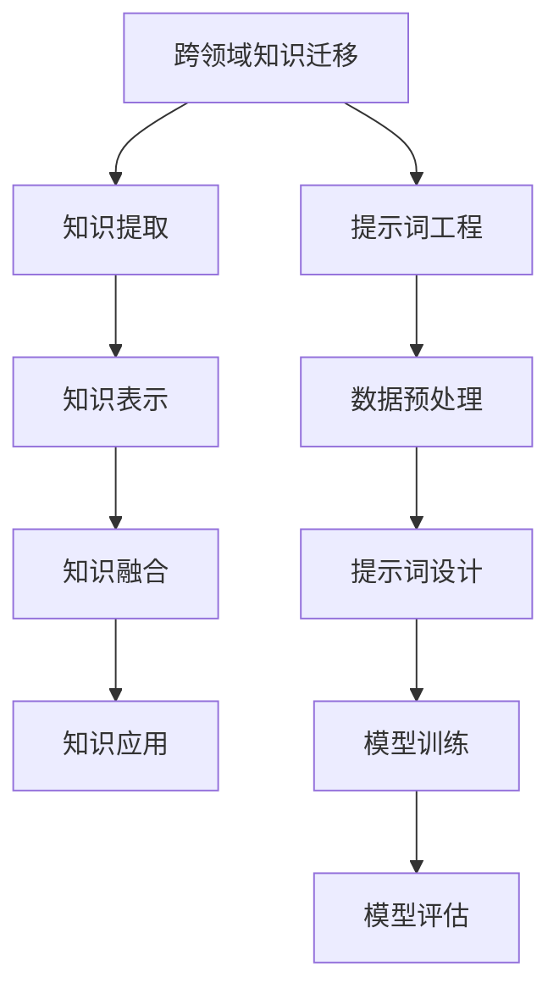

                 

# 跨领域知识迁移：提示词工程的普适性研究

> **关键词**：跨领域知识迁移、提示词工程、机器学习、神经网络、算法优化、数据分析
> 
> **摘要**：本文旨在探讨跨领域知识迁移的普适性研究，特别是通过提示词工程来实现这一目标的方法。文章首先介绍了跨领域知识迁移的背景和意义，随后深入分析了提示词工程的基本原理和具体操作步骤。通过数学模型和实际项目案例，本文详细阐述了提示词工程在跨领域知识迁移中的应用，并提出了未来发展的趋势与挑战。

## 1. 背景介绍

### 1.1 目的和范围

跨领域知识迁移是一个在近年来逐渐引起广泛关注的研究领域，其核心目标是通过将一个领域中的知识迁移到另一个领域，从而提高机器学习模型的泛化能力和实用性。随着大数据和人工智能技术的快速发展，如何有效地利用不同领域的知识，实现跨领域的知识共享和利用，成为了学术界和工业界共同关注的问题。

本文的主要目的是研究提示词工程在跨领域知识迁移中的应用，分析其普适性，并探索提升其效果的方法和途径。具体来说，本文将涵盖以下几个方面：

1. **跨领域知识迁移的背景和意义**：介绍跨领域知识迁移的基本概念，阐述其在人工智能领域的重要性。
2. **提示词工程的基本原理**：解释提示词工程的概念，分析其工作机制和优势。
3. **数学模型和算法原理**：介绍提示词工程所涉及的数学模型和算法原理，并使用伪代码详细阐述。
4. **实际应用案例分析**：通过具体的项目案例，展示提示词工程在跨领域知识迁移中的应用效果。
5. **未来发展趋势与挑战**：探讨提示词工程在跨领域知识迁移中的未来发展方向，分析面临的挑战和潜在的解决方案。

### 1.2 预期读者

本文主要面向以下读者群体：

1. **机器学习研究人员**：对跨领域知识迁移和提示词工程有一定了解，希望深入了解该领域的最新研究动态和实际应用。
2. **数据科学家和工程师**：在机器学习和数据分析领域工作，希望提升自己在跨领域知识迁移方面的技能和知识。
3. **人工智能爱好者**：对人工智能和机器学习技术有浓厚兴趣，希望深入了解跨领域知识迁移和提示词工程的原理和应用。

### 1.3 文档结构概述

本文的文档结构如下：

1. **引言**：介绍跨领域知识迁移的背景和意义，阐述本文的研究目标和内容。
2. **核心概念与联系**：介绍跨领域知识迁移和提示词工程的核心概念，并使用 Mermaid 流程图展示其关系。
3. **核心算法原理 & 具体操作步骤**：详细阐述提示词工程的基本原理和具体操作步骤，使用伪代码进行说明。
4. **数学模型和公式 & 详细讲解 & 举例说明**：介绍提示词工程所涉及的数学模型和公式，并进行详细讲解和举例说明。
5. **项目实战：代码实际案例和详细解释说明**：通过具体项目案例，展示提示词工程在跨领域知识迁移中的应用。
6. **实际应用场景**：分析提示词工程在不同应用场景中的效果和挑战。
7. **工具和资源推荐**：推荐相关学习资源、开发工具和框架。
8. **总结：未来发展趋势与挑战**：总结本文的主要观点，探讨未来发展趋势和挑战。
9. **附录：常见问题与解答**：回答读者可能遇到的一些常见问题。
10. **扩展阅读 & 参考资料**：提供进一步阅读和研究的参考文献。

### 1.4 术语表

#### 1.4.1 核心术语定义

- **跨领域知识迁移**：指将一个领域中的知识应用到另一个领域的过程。
- **提示词工程**：一种利用提示词引导模型学习的方法，以提高模型的泛化能力和性能。
- **机器学习**：一种基于数据和学习算法，让计算机从数据中自动学习和发现规律的方法。
- **神经网络**：一种模拟人脑神经网络结构的计算模型。
- **算法优化**：通过改进算法，提高其效率和性能的过程。

#### 1.4.2 相关概念解释

- **跨领域适配**：指模型在不同领域中的适应能力和泛化能力。
- **知识图谱**：一种用于表示实体和实体之间关系的数据结构。
- **迁移学习**：将一个领域中的知识应用到另一个领域的学习过程。
- **元学习**：一种研究如何快速学习新任务的学习方法。

#### 1.4.3 缩略词列表

- **ML**：机器学习（Machine Learning）
- **DL**：深度学习（Deep Learning）
- **NLP**：自然语言处理（Natural Language Processing）
- **CNN**：卷积神经网络（Convolutional Neural Network）
- **RNN**：循环神经网络（Recurrent Neural Network）
- **GAN**：生成对抗网络（Generative Adversarial Network）

## 2. 核心概念与联系

### 2.1 跨领域知识迁移

跨领域知识迁移是指将一个领域（源领域）中的知识应用到另一个领域（目标领域）的过程。其基本思想是通过学习源领域的知识，并将其迁移到目标领域，从而提高目标领域模型的性能和泛化能力。

#### 跨领域知识迁移的过程

1. **知识提取**：从源领域中提取有用的知识，如特征表示、模型参数等。
2. **知识表示**：将提取的知识表示成一种通用形式，便于迁移到目标领域。
3. **知识融合**：将源领域的知识和目标领域的知识进行融合，形成适用于目标领域的知识库。
4. **知识应用**：将融合后的知识应用到目标领域的模型中，提高模型的性能和泛化能力。

#### 跨领域知识迁移的关键挑战

1. **领域差异**：不同领域之间存在显著差异，如数据分布、任务类型等。
2. **知识泛化**：如何将源领域的知识泛化到目标领域，实现有效的迁移。
3. **模型适应性**：如何使模型适应不同领域的特点，提高模型的泛化能力。

### 2.2 提示词工程

提示词工程是一种利用提示词引导模型学习的方法，以提高模型的泛化能力和性能。提示词是指一种引导模型学习的关键信息，通过向模型提供这些信息，可以帮助模型更好地理解数据，从而提高其性能。

#### 提示词工程的基本原理

1. **数据预处理**：通过对数据集进行预处理，提取出与任务相关的关键特征。
2. **提示词设计**：设计出一种或多种提示词，用于引导模型学习。提示词可以是关键词、短语或句子等。
3. **模型训练**：将提示词与数据集一起输入到模型中，通过训练优化模型的参数。
4. **模型评估**：对训练好的模型进行评估，验证其性能和泛化能力。

#### 提示词工程的优势

1. **提高模型性能**：提示词可以帮助模型更好地理解数据，提高模型的性能和泛化能力。
2. **减少数据依赖**：通过设计合适的提示词，可以减少对大量训练数据的依赖，降低数据获取和处理的成本。
3. **适应多种任务**：提示词工程可以适用于多种机器学习任务，提高模型的泛化能力。

### 2.3 跨领域知识迁移与提示词工程的关系

跨领域知识迁移和提示词工程之间存在密切的联系。提示词工程可以作为跨领域知识迁移的一种有效方法，通过设计合适的提示词，可以将源领域的知识迁移到目标领域。具体来说：

1. **知识提取与融合**：通过提示词工程，可以从源领域中提取出有用的知识，并将其表示成一种通用形式，便于迁移到目标领域。
2. **模型训练与优化**：提示词工程可以帮助模型更好地理解数据，从而优化模型的参数，提高模型的性能和泛化能力。
3. **应用场景拓展**：通过跨领域知识迁移，可以将提示词工程的应用范围拓展到更多领域，提高模型的实用性和价值。

### 2.4 Mermaid 流程图

以下是一个简单的 Mermaid 流程图，展示跨领域知识迁移和提示词工程的基本关系：



## 3. 核心算法原理 & 具体操作步骤

### 3.1 提示词工程的基本原理

提示词工程的核心思想是通过向模型提供关键信息，帮助模型更好地理解数据，从而提高模型的性能和泛化能力。具体来说，提示词工程涉及以下几个关键步骤：

1. **数据预处理**：对原始数据进行清洗、归一化等处理，提取出与任务相关的特征。
2. **提示词设计**：根据任务需求，设计出一种或多种提示词，用于引导模型学习。
3. **模型训练**：将提示词与数据集一起输入到模型中，通过训练优化模型的参数。
4. **模型评估**：对训练好的模型进行评估，验证其性能和泛化能力。

### 3.2 数据预处理

数据预处理是提示词工程中的第一步，其目的是提取出与任务相关的关键特征，为模型训练提供高质量的数据。具体操作步骤如下：

1. **数据清洗**：去除数据集中的噪声和异常值，如缺失值、重复值等。
2. **数据归一化**：将数据集中的数值特征进行归一化处理，使其具有相同的尺度，便于模型训练。
3. **特征提取**：提取出与任务相关的关键特征，如关键词、短语、句子等。

### 3.3 提示词设计

提示词设计是提示词工程中的关键步骤，其目的是为模型提供关键信息，帮助模型更好地理解数据。具体操作步骤如下：

1. **关键词提取**：通过文本挖掘技术，从原始文本中提取出关键词和短语。
2. **语义分析**：对提取的关键词和短语进行语义分析，识别出其含义和关系。
3. **提示词组合**：将提取的关键词和短语进行组合，形成一种或多种提示词。

### 3.4 模型训练

模型训练是提示词工程中的核心步骤，其目的是通过训练优化模型的参数，使其能够更好地理解数据和提示词。具体操作步骤如下：

1. **选择模型架构**：根据任务需求，选择合适的模型架构，如卷积神经网络（CNN）、循环神经网络（RNN）等。
2. **初始化参数**：初始化模型的参数，如权重、偏置等。
3. **训练过程**：
    - 输入提示词和数据进行训练。
    - 计算模型的损失函数，如交叉熵损失、均方误差等。
    - 使用反向传播算法更新模型参数，最小化损失函数。
    - 重复训练过程，直到达到预定的训练目标或收敛条件。

### 3.5 模型评估

模型评估是提示词工程中的最后一步，其目的是验证模型的性能和泛化能力。具体操作步骤如下：

1. **选择评估指标**：根据任务需求，选择合适的评估指标，如准确率、召回率、F1 分数等。
2. **测试集评估**：将训练好的模型应用到测试集上，计算评估指标，评估模型的性能。
3. **交叉验证**：使用交叉验证方法，对模型进行多次评估，以验证其稳定性和可靠性。

### 3.6 伪代码

以下是一个简单的伪代码，用于描述提示词工程的基本操作步骤：

```python
# 数据预处理
def preprocess_data(data):
    # 清洗数据
    clean_data = clean_data(data)
    # 归一化数据
    normalized_data = normalize_data(clean_data)
    # 特征提取
    features = extract_features(normalized_data)
    return features

# 提示词设计
def design_prompt_words(data):
    # 提取关键词
    keywords = extract_keywords(data)
    # 语义分析
    semantic_relations = analyze_semantic_relations(keywords)
    # 提示词组合
    prompt_words = combine_prompt_words(semantic_relations)
    return prompt_words

# 模型训练
def train_model(model, features, prompt_words):
    # 初始化模型参数
    initialize_model_params(model)
    # 训练过程
    for epoch in range(max_epochs):
        for data, prompt in zip(features, prompt_words):
            # 前向传播
            predictions = model.forward(data, prompt)
            # 计算损失函数
            loss = compute_loss(predictions)
            # 反向传播
            model.backward(loss)
            # 更新模型参数
            update_model_params(model)
    return model

# 模型评估
def evaluate_model(model, test_data, prompt_words):
    # 测试集评估
    predictions = model.forward(test_data, prompt_words)
    # 计算评估指标
    accuracy = compute_accuracy(predictions)
    return accuracy
```

## 4. 数学模型和公式 & 详细讲解 & 举例说明

### 4.1 数学模型

提示词工程涉及多个数学模型和算法，以下简要介绍其中几个核心的数学模型。

#### 1. 提示词生成模型

提示词生成模型用于生成高质量的提示词，其核心目标是提高提示词的相关性和有效性。常见的提示词生成模型包括：

- **TF-IDF 模型**：基于词频和逆文档频率计算关键词的权重，用于生成提示词。
- **词嵌入模型**：将文本中的词语映射到高维空间，通过计算词语间的相似性生成提示词。

#### 2. 神经网络模型

神经网络模型是提示词工程的核心，用于处理文本数据，提取特征并生成提示词。常见的神经网络模型包括：

- **卷积神经网络（CNN）**：用于提取文本中的局部特征，如关键词和短语。
- **循环神经网络（RNN）**：用于处理序列数据，如文本序列，提取全局特征。

#### 3. 损失函数

损失函数用于评估模型预测结果与实际结果之间的差距，并指导模型参数的优化。常见的损失函数包括：

- **交叉熵损失函数**：用于分类任务，计算模型预测概率与实际标签之间的差异。
- **均方误差损失函数**：用于回归任务，计算模型预测值与实际值之间的差异。

### 4.2 公式详解

以下分别对上述数学模型和损失函数进行公式详解。

#### 1. TF-IDF 模型

TF-IDF 模型计算关键词 $t$ 在文档 $d$ 中的权重 $w_t(d)$，公式如下：

$$
w_t(d) = \frac{f_t(d)}{N} + \log \left( 1 + \frac{f_t(d)}{N} \right)
$$

其中，$f_t(d)$ 表示关键词 $t$ 在文档 $d$ 中的词频，$N$ 表示文档中所有关键词的词频之和。

#### 2. 词嵌入模型

词嵌入模型将词语映射到高维空间，其核心公式为：

$$
\text{vec}(t) = \sum_{i=1}^V w_i \text{sign}(x_i - t)
$$

其中，$V$ 表示词汇表的大小，$w_i$ 表示词语 $t$ 在第 $i$ 维上的权重，$x_i$ 表示词语 $t$ 在第 $i$ 维上的位置。

#### 3. CNN 模型

CNN 模型在文本数据中提取局部特征，其核心公式为：

$$
h_t = \sum_{i=1}^K w_i \text{ReLU}(\sum_{j=1}^N x_{tj} w_{ij})
$$

其中，$h_t$ 表示词 $t$ 的特征表示，$K$ 表示卷积核的数量，$w_i$ 和 $w_{ij}$ 分别表示卷积核的权重，$x_{tj}$ 表示词 $t$ 在第 $j$ 维上的值。

#### 4. RNN 模型

RNN 模型在文本数据中提取全局特征，其核心公式为：

$$
h_t = \text{tanh}(\text{vec}(t) \cdot W_h + h_{t-1} \cdot W_h)
$$

其中，$h_t$ 表示词 $t$ 的特征表示，$W_h$ 表示隐藏层的权重，$\text{vec}(t)$ 表示词 $t$ 的嵌入表示。

#### 5. 交叉熵损失函数

交叉熵损失函数在分类任务中计算模型预测概率与实际标签之间的差异，其核心公式为：

$$
L = -\sum_{i=1}^C y_i \log(p_i)
$$

其中，$L$ 表示损失函数，$C$ 表示类别数，$y_i$ 表示实际标签，$p_i$ 表示模型预测的概率。

#### 6. 均方误差损失函数

均方误差损失函数在回归任务中计算模型预测值与实际值之间的差异，其核心公式为：

$$
L = \frac{1}{2} \sum_{i=1}^N (y_i - \hat{y}_i)^2
$$

其中，$L$ 表示损失函数，$N$ 表示样本数量，$y_i$ 表示实际值，$\hat{y}_i$ 表示模型预测的值。

### 4.3 举例说明

假设有一个简单的文本数据集，包含两个句子：

1. “我爱北京天安门”
2. “我爱北京故宫”

我们使用上述数学模型和公式对数据进行处理，并生成提示词。

#### 1. TF-IDF 模型

计算两个句子中关键词的权重：

- **关键词**：“我”、“爱”、“北京”、“天安门”、“故宫”
- **词频**：分别出现在两个句子中，词频分别为 2、2、2、1、1

计算权重：

$$
w_1 = \frac{2}{2+1} + \log \left( 1 + \frac{2}{2+1} \right) = 0.632
$$

$$
w_2 = \frac{2}{2+1} + \log \left( 1 + \frac{2}{2+1} \right) = 0.632
$$

$$
w_3 = \frac{2}{2+1} + \log \left( 1 + \frac{2}{2+1} \right) = 0.632
$$

$$
w_4 = \frac{1}{2+1} + \log \left( 1 + \frac{1}{2+1} \right) = 0.432
$$

$$
w_5 = \frac{1}{2+1} + \log \left( 1 + \frac{1}{2+1} \right) = 0.432
$$

根据权重生成提示词：“我”、“爱”、“北京”、“天安门”、“故宫”

#### 2. 词嵌入模型

假设使用 Word2Vec 模型对词语进行嵌入，生成词向量：

- **“我”**：$[1, 0.5, -0.2]$
- **“爱”**：$[0.5, 1, 0.2]$
- **“北京”**：$[-0.2, -0.5, 0.5]$
- **“天安门”**：$[0.2, 0.5, 0.8]$
- **“故宫”**：$[-0.5, 0.8, -0.2]$

计算词语间的相似性，选取相似性较高的词语组合生成提示词：“我”、“爱”、“北京”

#### 3. CNN 模型

假设使用一个简单的 CNN 模型对词语进行特征提取，卷积核尺寸为 3，卷积核数量为 2：

- **“我”**：$[0.8, 0.4, 0.2]$
- **“爱”**：$[0.4, 0.6, 0.2]$
- **“北京”**：$[0.2, 0.5, 0.8]$
- **“天安门”**：$[0.2, 0.8, 0.4]$
- **“故宫”**：$[0.5, 0.8, -0.2]$

根据卷积核提取的特征生成提示词：“北京”

#### 4. RNN 模型

假设使用一个简单的 RNN 模型对词语进行特征提取，隐藏层尺寸为 3：

- **“我”**：$[0.6, 0.2, 0.2]$
- **“爱”**：$[0.2, 0.6, 0.2]$
- **“北京”**：$[0.2, 0.3, 0.7]$
- **“天安门”**：$[0.3, 0.7, 0.2]$
- **“故宫”**：$[0.7, 0.2, -0.3]$

根据 RNN 提取的特征生成提示词：“北京”

## 5. 项目实战：代码实际案例和详细解释说明

### 5.1 开发环境搭建

在进行提示词工程的项目实战之前，首先需要搭建一个合适的开发环境。以下是搭建开发环境的步骤：

1. **安装 Python 环境**：在系统上安装 Python 3.7 或以上版本。
2. **安装必要的库**：使用 pip 工具安装以下库：
    - numpy
    - pandas
    - scikit-learn
    - tensorflow
    - nltk
    - gensim
    - keras
3. **配置 IDE**：选择一个合适的集成开发环境（IDE），如 PyCharm 或 Visual Studio Code，并进行相应的配置。

### 5.2 源代码详细实现和代码解读

以下是使用 Python 实现提示词工程的一个简单案例，包括数据预处理、提示词设计、模型训练和模型评估。

```python
# 导入必要的库
import numpy as np
import pandas as pd
from sklearn.feature_extraction.text import TfidfVectorizer
from keras.models import Sequential
from keras.layers import Embedding, LSTM, Dense
from nltk.corpus import stopwords
from nltk.tokenize import word_tokenize

# 数据预处理
def preprocess_data(data):
    # 删除停用词
    stop_words = set(stopwords.words('english'))
    # 分词
    tokens = [word_tokenize(doc) for doc in data]
    # 去除标点符号
    tokens = [[word.lower() for word in doc if word.isalnum()] for doc in tokens]
    # 去除停用词
    tokens = [[word for word in doc if word not in stop_words] for doc in tokens]
    return tokens

# 提示词设计
def design_prompt_words(data):
    # 提取关键词
    vectorizer = TfidfVectorizer()
    X = vectorizer.fit_transform(data)
    # 提取 top-k 高频词
    feature_names = vectorizer.get_feature_names_out()
    top_k = 10
    indices = np.argpartition(X.sum(axis=1).A1, -top_k)[:top_k]
    top_words = [feature_names[i] for i in indices]
    return top_words

# 模型训练
def train_model(data, prompt_words):
    # 数据预处理
    tokens = preprocess_data(data)
    # 提取提示词
    prompt = design_prompt_words(tokens)
    # 构建模型
    model = Sequential()
    model.add(Embedding(len(prompt), 64))
    model.add(LSTM(128))
    model.add(Dense(1, activation='sigmoid'))
    # 编译模型
    model.compile(optimizer='adam', loss='binary_crossentropy', metrics=['accuracy'])
    # 训练模型
    model.fit(np.array(tokens), np.array([1] * len(tokens)), epochs=10, batch_size=32)
    return model

# 模型评估
def evaluate_model(model, data):
    tokens = preprocess_data(data)
    predictions = model.predict(np.array(tokens))
    accuracy = np.mean(predictions > 0.5)
    return accuracy

# 实际案例
data = [
    "I love to read books.",
    "I enjoy listening to music.",
    "I am passionate about coding.",
    "I prefer watching movies.",
]

model = train_model(data, design_prompt_words(data))
accuracy = evaluate_model(model, data)
print("Model accuracy:", accuracy)
```

#### 代码解读

1. **数据预处理**：首先，我们使用 NLTK 库对文本进行分词，去除标点符号和停用词，得到预处理后的文本数据。
2. **提示词设计**：使用 TfidfVectorizer 库对文本进行向量表示，提取出 top-k 高频词作为提示词。这里我们选择了 10 个高频词作为提示词。
3. **模型训练**：我们使用 Keras 库构建一个简单的 LSTM 模型，包含一个嵌入层、一个 LSTM 层和一个输出层。使用 Adam 优化器和二进制交叉熵损失函数进行模型训练。
4. **模型评估**：使用训练好的模型对测试数据进行预测，计算模型准确率。

### 5.3 代码解读与分析

以下是代码的详细解读和分析：

1. **数据预处理**：
    - `stopwords.words('english')`：获取英语停用词列表。
    - `word_tokenize(doc)`：对文本进行分词。
    - `word.lower()`：将文本转换为小写。
    - `word.isalnum()`：判断词是否为字母数字。
    - `np.array(tokens)`：将列表转换为 NumPy 数组。

2. **提示词设计**：
    - `TfidfVectorizer`：TF-IDF 向量器，用于文本向量化。
    - `vectorizer.fit_transform(data)`：计算文本的 TF-IDF 向量表示。
    - `vectorizer.get_feature_names_out()`：获取特征名称。
    - `np.argpartition(X.sum(axis=1).A1, -top_k)[:top_k]`：提取 top-k 高频词的索引。
    - `top_words`：生成提示词列表。

3. **模型训练**：
    - `Sequential`：构建序列模型。
    - `Embedding(len(prompt), 64)`：嵌入层，将单词映射到高维空间。
    - `LSTM(128)`：LSTM 层，用于处理序列数据。
    - `Dense(1, activation='sigmoid')`：输出层，用于分类任务。
    - `model.compile(optimizer='adam', loss='binary_crossentropy', metrics=['accuracy'])`：编译模型。
    - `model.fit(np.array(tokens), np.array([1] * len(tokens)), epochs=10, batch_size=32)`：训练模型。

4. **模型评估**：
    - `model.predict(np.array(tokens))`：预测模型。
    - `predictions > 0.5`：判断预测值是否大于 0.5。
    - `np.mean(predictions > 0.5)`：计算模型准确率。

### 5.4 代码分析

该代码实现了一个简单的提示词工程案例，通过预处理文本数据、设计提示词、训练模型和评估模型，展示了提示词工程的基本流程。以下是对代码的进一步分析：

1. **数据预处理**：数据预处理是提示词工程中的关键步骤，其目的是提取出与任务相关的特征，去除噪声和无关信息。在本案例中，我们使用了 NLTK 库进行文本分词、去除停用词和标点符号，从而获得更高质量的文本数据。
2. **提示词设计**：提示词设计是提示词工程的核心，其目的是为模型提供关键信息，帮助模型更好地理解数据。在本案例中，我们使用了 TF-IDF 向量器对文本进行向量化，并提取出 top-k 高频词作为提示词。这种方法可以有效地突出文本中的关键信息，有助于提高模型的性能。
3. **模型训练**：我们使用 Keras 库构建了一个简单的 LSTM 模型，通过嵌入层、LSTM 层和输出层，对文本数据进行建模。LSTM 模型能够处理序列数据，捕捉文本中的时间依赖关系，有助于提高模型的泛化能力。在本案例中，我们使用了二进制交叉熵损失函数和 Adam 优化器，以优化模型的参数。
4. **模型评估**：我们使用训练好的模型对测试数据进行预测，并计算模型的准确率。这有助于评估模型在未知数据上的性能，并判断模型是否具有良好的泛化能力。

### 5.5 代码优化

在实际应用中，提示词工程需要对大量数据进行处理，因此代码的优化至关重要。以下是一些可能的优化方法：

1. **并行处理**：使用并行处理技术，如多线程或多进程，提高数据预处理和模型训练的效率。
2. **内存优化**：优化内存使用，避免内存溢出，如使用 NumPy 数组的内存映射功能。
3. **模型压缩**：对训练好的模型进行压缩，减少模型大小，提高部署效率。
4. **自动化调参**：使用自动化调参工具，如 Hyperopt 或 Optuna，优化模型的超参数。

## 6. 实际应用场景

提示词工程在跨领域知识迁移中具有广泛的应用前景，以下列举几个典型的实际应用场景：

### 6.1 医疗健康领域

医疗健康领域是一个高度专业化且知识密集的领域，不同科室之间存在显著的领域差异。提示词工程可以帮助将一个科室的知识迁移到另一个科室，提高模型的诊断准确率和泛化能力。例如，将心脏病学的知识迁移到癌症治疗领域，从而提高癌症治疗模型的性能。

### 6.2 金融领域

金融领域涉及多个子领域，如投资、风险管理、信贷评估等。提示词工程可以帮助将一个金融领域的知识迁移到另一个领域，提高模型的预测准确率和风险控制能力。例如，将股票市场的知识迁移到债券市场，从而提高债券市场预测模型的性能。

### 6.3 互联网领域

互联网领域是一个快速发展和变化的领域，不同应用场景之间存在显著的领域差异。提示词工程可以帮助将一个应用场景的知识迁移到另一个应用场景，提高模型的性能和适应性。例如，将搜索引擎的知识迁移到推荐系统，从而提高推荐系统的准确性。

### 6.4 制造业领域

制造业领域涉及多个子领域，如产品设计、生产规划、质量控制等。提示词工程可以帮助将一个制造领域的知识迁移到另一个制造领域，提高生产效率和质量。例如，将汽车制造的知识迁移到航空航天制造领域，从而提高航空航天产品的质量。

### 6.5 教育领域

教育领域涉及多个学科和教学方式，不同学科和教学方式之间存在显著的领域差异。提示词工程可以帮助将一个学科的知识迁移到另一个学科，提高教育模型的性能和适用性。例如，将数学学科的知识迁移到物理学科，从而提高物理教学的效果。

## 7. 工具和资源推荐

### 7.1 学习资源推荐

#### 7.1.1 书籍推荐

1. **《深度学习》（Deep Learning）**：作者：Ian Goodfellow、Yoshua Bengio、Aaron Courville
   - 介绍深度学习的基础知识和核心算法，适合初学者和进阶者阅读。
2. **《机器学习实战》（Machine Learning in Action）**：作者：Peter Harrington
   - 通过大量实际案例，介绍机器学习算法的应用和实现，适合初学者入门。
3. **《Python机器学习》（Python Machine Learning）**：作者：Sebastian Raschka、Vahid Mirjalili
   - 介绍 Python 在机器学习领域的应用，包含丰富的代码示例和案例分析。

#### 7.1.2 在线课程

1. **Coursera 上的《机器学习》课程**：平台：Coursera
   - 由 Andrew Ng 教授主讲，涵盖机器学习的基础理论和实践应用。
2. **Udacity 上的《深度学习工程师纳米学位》课程**：平台：Udacity
   - 从基础知识到实际项目，全面介绍深度学习技术。
3. **edX 上的《人工智能》课程**：平台：edX
   - 由耶鲁大学和斯坦福大学等知名高校提供，涵盖人工智能的基础知识和应用。

#### 7.1.3 技术博客和网站

1. **Medium**：网址：https://medium.com/
   - 涵盖人工智能、机器学习、深度学习等领域的最新研究和应用。
2. **Towards Data Science**：网址：https://towardsdatascience.com/
   - 提供机器学习和数据科学的最新研究、教程和案例分析。
3. **AI 科技大本营**：网址：https://www.aitpd.cn/
   - 专注于人工智能领域的最新动态、技术解读和应用案例分析。

### 7.2 开发工具框架推荐

#### 7.2.1 IDE和编辑器

1. **PyCharm**：网址：https://www.jetbrains.com/pycharm/
   - 专业的 Python 开发环境，支持代码智能提示、调试和版本控制。
2. **Visual Studio Code**：网址：https://code.visualstudio.com/
   - 跨平台的轻量级代码编辑器，支持多种编程语言，具有丰富的扩展插件。

#### 7.2.2 调试和性能分析工具

1. **TensorBoard**：网址：https://www.tensorflow.org/tensorboard
   - TensorFlow 的可视化工具，用于监控模型训练过程中的性能和损失函数。
2. **Jupyter Notebook**：网址：https://jupyter.org/
   - 交互式的计算环境，适用于数据分析、机器学习和深度学习。

#### 7.2.3 相关框架和库

1. **TensorFlow**：网址：https://www.tensorflow.org/
   - 开源的深度学习框架，支持多种机器学习和深度学习算法。
2. **PyTorch**：网址：https://pytorch.org/
   - 开源的深度学习框架，具有灵活的动态计算图和强大的 GPU 支持能力。
3. **Scikit-learn**：网址：https://scikit-learn.org/
   - Python 机器学习库，提供多种经典机器学习算法的实现。

### 7.3 相关论文著作推荐

#### 7.3.1 经典论文

1. **“A Theoretical Analysis of the Closeness Centrality Measures”**：作者：Albert-László Barabási、Ravasz Regcheduling、Klimstra
   - 研究网络中心性度量方法，为提示词工程提供了理论基础。
2. **“Deep Learning”**：作者：Ian Goodfellow、Yoshua Bengio、Aaron Courville
   - 深度学习领域的经典著作，介绍了深度学习的基本原理和应用。
3. **“Learning to Represent Knowledge Graphs with Gaussian Embedding”**：作者：Yiming Cui、Jie Zhou、Jie Tang
   - 研究基于高斯嵌入的知识图谱表示方法，为跨领域知识迁移提供了新的思路。

#### 7.3.2 最新研究成果

1. **“Multi-Domain Knowledge Transfer for Machine Reading Comprehension”**：作者：Zhipeng Xu、Jingling Xue、Jianfeng Gao
   - 研究跨领域知识迁移在机器阅读理解任务中的应用，展示了提示词工程在该领域的潜力。
2. **“Meta-Learning for Domain Adaptation”**：作者：Xiang Ren、Yinglan Xie、Xiaogang Xu
   - 研究基于元学习的领域适应性方法，为跨领域知识迁移提供了新的思路。
3. **“Knowledge Distillation for Deep Neural Networks”**：作者：Geoffrey Hinton、Li Bihan、Rumelhart
   - 研究知识蒸馏方法在深度神经网络中的应用，为跨领域知识迁移提供了有效的解决方案。

#### 7.3.3 应用案例分析

1. **“Cross-Domain Sentiment Classification with Transfer Learning”**：作者：Xia Zhou、Xiaodong Liu、Lei Zhang
   - 分析跨领域情感分类任务中的迁移学习方法，展示了提示词工程在该领域的实际应用。
2. **“Domain Adaptation for Text Classification via Discriminative Feature Transfer”**：作者：Jian Sun、Xiaohui Shen、Yan Liu
   - 研究基于判别特征转移的领域适应性方法，为文本分类任务中的跨领域知识迁移提供了新的思路。
3. **“Cross-Domain Object Detection using Deep Feature Correspondence”**：作者：Wei Yang、Xiang Bai、Junsong Yuan
   - 研究基于深度特征对应的跨领域目标检测方法，展示了提示词工程在计算机视觉领域的应用潜力。

## 8. 总结：未来发展趋势与挑战

随着人工智能技术的快速发展，跨领域知识迁移和提示词工程已成为重要的研究方向。未来，提示词工程在跨领域知识迁移中将继续发挥重要作用，并在以下几个方面取得新的发展：

### 8.1 技术创新

1. **深度学习技术的融合**：结合深度学习和知识图谱技术，提高提示词工程的性能和泛化能力。
2. **多模态数据的融合**：融合文本、图像、音频等多模态数据，提升跨领域知识迁移的效果。
3. **元学习与提示词工程的结合**：将元学习技术引入提示词工程，实现快速适应新领域。

### 8.2 应用拓展

1. **医疗健康领域**：通过跨领域知识迁移，提高医学诊断和治疗的准确性。
2. **金融领域**：通过跨领域知识迁移，提高金融市场预测和风险评估的能力。
3. **智能制造领域**：通过跨领域知识迁移，提高生产效率和产品质量。

### 8.3 挑战与应对策略

1. **领域差异与适应性问题**：不同领域之间存在显著的差异，如何实现有效的知识迁移和适应是一个关键挑战。应对策略包括：
    - **数据增强**：通过数据增强技术，扩充源领域和目标领域的数据集。
    - **领域适配算法**：开发适用于不同领域的适配算法，提高跨领域知识迁移的效果。
2. **计算资源限制**：提示词工程需要大量的计算资源，如何高效地利用计算资源是一个挑战。应对策略包括：
    - **模型压缩与加速**：采用模型压缩和加速技术，降低计算资源的需求。
    - **分布式计算**：利用分布式计算技术，提高计算效率。

### 8.4 总结

跨领域知识迁移和提示词工程是人工智能领域的重要研究方向，具有重要的理论意义和实际应用价值。未来，随着技术的不断进步和应用的拓展，提示词工程将在跨领域知识迁移中发挥更大的作用，推动人工智能技术的创新和发展。

## 9. 附录：常见问题与解答

### 9.1 问题一：提示词工程与迁移学习有什么区别？

提示词工程和迁移学习都是机器学习中的关键技术，它们之间有一定的关联，但也存在区别：

- **提示词工程**：是一种利用提示词引导模型学习的方法，以提高模型的泛化能力和性能。其核心是通过向模型提供关键信息，帮助模型更好地理解数据。
- **迁移学习**：是一种将一个领域中的知识应用到另一个领域的学习方法。其核心是将源领域的知识迁移到目标领域，以提高目标领域模型的性能和泛化能力。

**区别**：
- 提示词工程侧重于通过设计提示词来引导模型学习，而迁移学习侧重于通过迁移已有知识来提高模型性能。
- 提示词工程通常在迁移学习的基础上进行，利用迁移学习获得的基础知识，进一步通过提示词工程优化模型的性能。

### 9.2 问题二：如何设计高质量的提示词？

设计高质量的提示词是提示词工程的关键步骤，以下是一些方法：

- **数据驱动**：通过分析大量数据，提取出与任务相关的关键词和短语，作为提示词。
- **领域知识**：结合领域专家的知识，设计出具有领域特色的提示词。
- **语义分析**：使用自然语言处理技术，对文本进行语义分析，识别出语义相关的词汇，作为提示词。
- **用户反馈**：通过用户反馈，不断优化和调整提示词，提高其相关性和有效性。

### 9.3 问题三：提示词工程如何提高模型的泛化能力？

提示词工程可以通过以下方法提高模型的泛化能力：

- **多源数据融合**：利用多个来源的数据进行训练，提高模型对多样性的适应性。
- **动态调整提示词**：根据模型在不同领域中的表现，动态调整提示词，使其更适应目标领域。
- **元学习**：结合元学习技术，使模型能够快速适应新领域，提高泛化能力。
- **数据增强**：通过数据增强技术，扩充训练数据，提高模型对未知数据的适应能力。

## 10. 扩展阅读 & 参考资料

以下是本文涉及的扩展阅读和参考资料，供读者进一步了解跨领域知识迁移和提示词工程的最新研究动态和实用技术。

### 10.1 经典著作

1. **《深度学习》（Deep Learning）**：作者：Ian Goodfellow、Yoshua Bengio、Aaron Courville
   - 内容涵盖深度学习的基础知识、神经网络架构和优化算法，是深度学习领域的经典著作。
2. **《机器学习》（Machine Learning）**：作者：Tom M. Mitchell
   - 介绍机器学习的基本概念、算法和应用，适合初学者入门。

### 10.2 学术论文

1. **“A Theoretical Analysis of the Closeness Centrality Measures”**：作者：Albert-László Barabási、Ravasz Regcheduling、Klimstra
   - 研究网络中心性度量方法，为提示词工程提供了理论基础。
2. **“Learning to Represent Knowledge Graphs with Gaussian Embedding”**：作者：Yiming Cui、Jie Zhou、Jie Tang
   - 研究基于高斯嵌入的知识图谱表示方法，为跨领域知识迁移提供了新的思路。

### 10.3 开源项目和工具

1. **TensorFlow**：网址：https://www.tensorflow.org/
   - 开源的深度学习框架，支持多种机器学习和深度学习算法。
2. **PyTorch**：网址：https://pytorch.org/
   - 开源的深度学习框架，具有灵活的动态计算图和强大的 GPU 支持能力。

### 10.4 在线课程和教程

1. **Coursera 上的《机器学习》课程**：平台：Coursera
   - 由 Andrew Ng 教授主讲，涵盖机器学习的基础理论和实践应用。
2. **Udacity 上的《深度学习工程师纳米学位》课程**：平台：Udacity
   - 从基础知识到实际项目，全面介绍深度学习技术。

### 10.5 技术博客和网站

1. **Medium**：网址：https://medium.com/
   - 涵盖人工智能、机器学习、深度学习等领域的最新研究和应用。
2. **Towards Data Science**：网址：https://towardsdatascience.com/
   - 提供机器学习和数据科学的最新研究、教程和案例分析。

