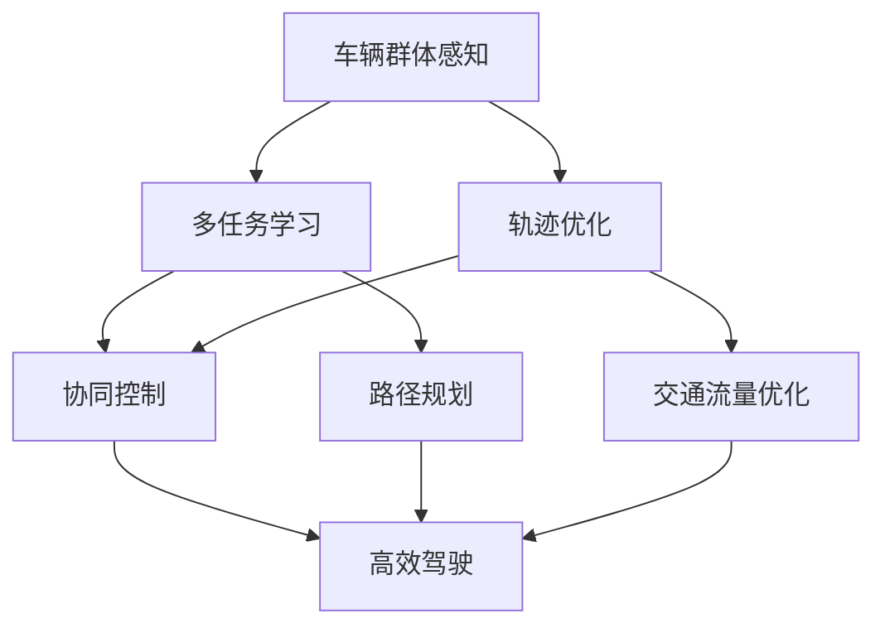
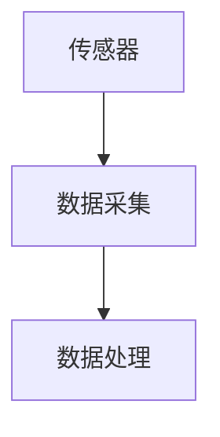
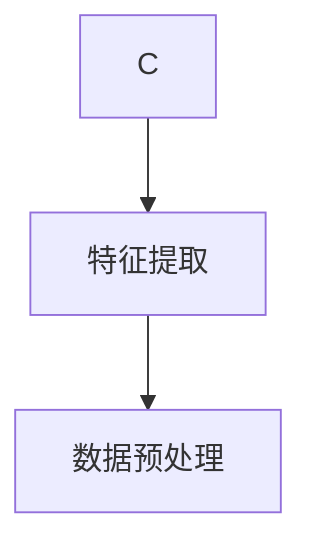
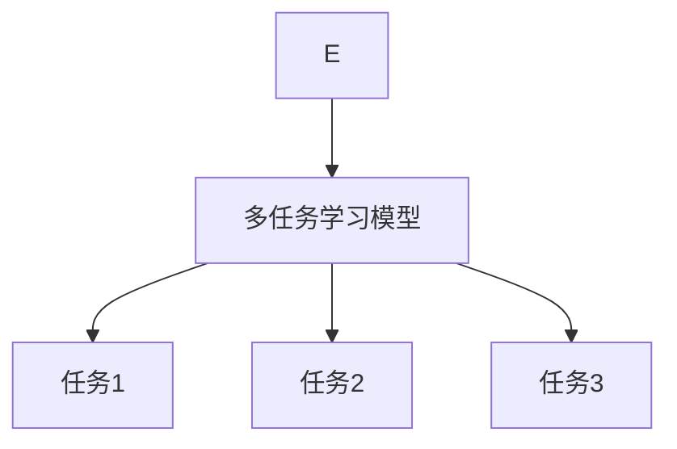
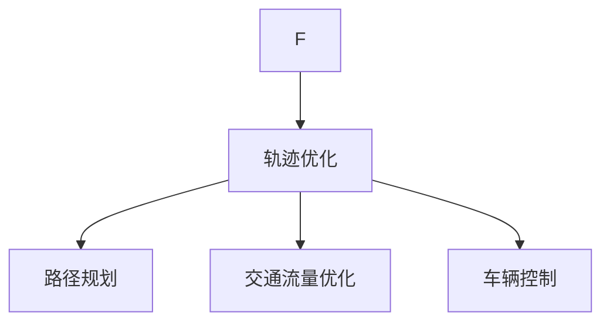
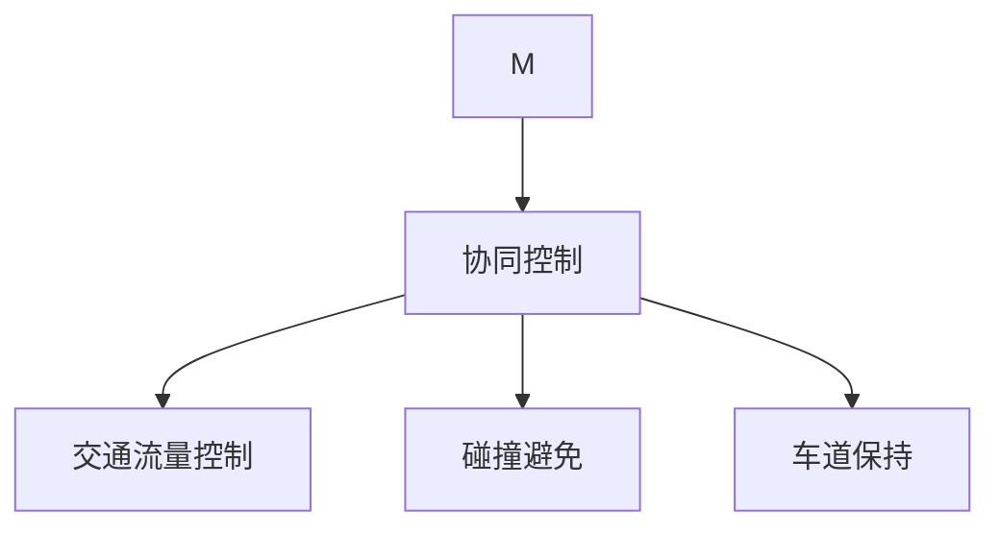

                 

# 车辆群体感知中轨迹优化的多任务学习模型

> **关键词**：车辆感知、轨迹优化、多任务学习、深度学习、神经网络、协同控制  
>
> **摘要**：本文旨在探讨在车辆群体感知中，如何通过轨迹优化的多任务学习模型，实现车辆的高效、安全、协同驾驶。文章首先介绍了车辆群体感知和多任务学习的基本概念，然后详细阐述了轨迹优化算法的原理及其在多任务学习中的应用，最后通过一个实际案例展示了该模型在车辆群体感知中的有效性。

## 1. 背景介绍

### 1.1 目的和范围

随着城市化进程的加速，车辆数量急剧增加，交通拥堵问题愈发严重。为了提高交通效率和安全性，车辆群体感知技术应运而生。车辆群体感知指的是通过传感器和通信技术，实现对周围车辆和交通环境的感知和理解。轨迹优化则是在给定的约束条件下，寻找最优的行驶路径，以实现车辆行驶的安全、高效和舒适。

本文的目的在于探讨如何在车辆群体感知中，通过轨迹优化的多任务学习模型，实现车辆的高效、安全、协同驾驶。文章将首先介绍车辆群体感知和多任务学习的基本概念，然后深入探讨轨迹优化算法的原理及其在多任务学习中的应用，最后通过一个实际案例，验证该模型在车辆群体感知中的有效性。

### 1.2 预期读者

本文主要面向从事智能交通、车辆控制和人工智能领域的科研人员、工程师和技术爱好者。读者需要对车辆感知技术、轨迹优化算法和多任务学习有一定的了解。

### 1.3 文档结构概述

本文分为十个部分。第一部分为背景介绍，包括目的和范围、预期读者、文档结构概述和术语表。第二部分介绍核心概念与联系，包括车辆群体感知、多任务学习和轨迹优化的基本概念和联系。第三部分介绍核心算法原理和具体操作步骤。第四部分介绍数学模型和公式，包括详细讲解和举例说明。第五部分介绍项目实战，包括开发环境搭建、源代码详细实现和代码解读与分析。第六部分介绍实际应用场景。第七部分介绍工具和资源推荐。第八部分总结未来发展趋势与挑战。第九部分为附录，包括常见问题与解答。最后一部分为扩展阅读与参考资料。

### 1.4 术语表

#### 1.4.1 核心术语定义

- 车辆群体感知：通过传感器和通信技术，实现对周围车辆和交通环境的感知和理解。
- 多任务学习：同时学习多个任务，提高模型的泛化能力和效率。
- 轨迹优化：在给定的约束条件下，寻找最优的行驶路径，以实现车辆行驶的安全、高效和舒适。

#### 1.4.2 相关概念解释

- 传感器：用于感知和测量车辆和交通环境的数据采集设备。
- 通信技术：用于车辆之间、车辆与基础设施之间的信息交换和共享。
- 协同控制：通过控制算法，实现车辆之间的协同行为，以提高交通效率和安全性。

#### 1.4.3 缩略词列表

- LP：线性规划（Linear Programming）
- CNN：卷积神经网络（Convolutional Neural Network）
- RNN：循环神经网络（Recurrent Neural Network）
- DRL：深度强化学习（Deep Reinforcement Learning）

## 2. 核心概念与联系

### 2.1 车辆群体感知

车辆群体感知是指通过传感器和通信技术，实现对周围车辆和交通环境的感知和理解。其核心在于数据的采集、处理和共享。

#### 数据采集

传感器是车辆群体感知的重要组成部分。常见的传感器包括摄像头、激光雷达、毫米波雷达、GPS等。这些传感器可以采集车辆的位置、速度、加速度、航向等数据。

#### 数据处理

采集到的数据需要进行预处理，包括去噪、去偏移、归一化等操作。然后，通过特征提取技术，提取出车辆和交通环境的关键特征，如车辆的速度、加速度、密度、交通流量等。

#### 数据共享

车辆之间需要通过通信技术进行数据的共享和交换。常见的通信技术包括无线通信、车联网、V2X（Vehicle-to-Everything）等。通过这些技术，车辆可以获取到周围车辆和交通环境的信息，从而进行协同决策和控制。

### 2.2 多任务学习

多任务学习（Multi-Task Learning, MTL）是一种同时学习多个相关任务的学习方法。在车辆群体感知中，多任务学习可以同时学习多个任务，如轨迹优化、碰撞避免、车道保持等，以提高模型的效果和效率。

#### 多任务学习的优势

1. **共享表示**：多任务学习可以共享任务间的表示，从而提高模型的泛化能力和效率。
2. **协同优化**：多任务学习可以在多个任务之间进行协同优化，从而提高任务的整体性能。
3. **资源利用**：多任务学习可以共享计算资源和数据，从而提高计算效率。

#### 多任务学习的挑战

1. **任务关联性**：不同任务之间的关联性会影响多任务学习的效果。
2. **数据不平衡**：不同任务的数据量可能存在较大差异，导致模型训练的不平衡。
3. **训练效率**：多任务学习可能导致训练过程复杂，训练效率降低。

### 2.3 轨迹优化

轨迹优化（Trajectory Optimization）是在给定的约束条件下，寻找最优的行驶路径，以实现车辆行驶的安全、高效和舒适。在车辆群体感知中，轨迹优化可以用于车辆路径规划、交通流量优化等。

#### 轨迹优化的方法

1. **优化算法**：常用的优化算法包括线性规划（Linear Programming, LP）、动态规划（Dynamic Programming, DP）、梯度下降（Gradient Descent）等。
2. **约束条件**：轨迹优化的约束条件包括车辆的速度、加速度、航向等。
3. **目标函数**：轨迹优化的目标函数包括行驶距离、行驶时间、燃料消耗等。

#### 轨迹优化的挑战

1. **非线性和复杂性**：现实世界的交通环境具有非线性特性，轨迹优化算法需要能够应对这种复杂性。
2. **动态性**：车辆和交通环境是动态变化的，轨迹优化算法需要能够实时适应这种变化。
3. **计算效率**：轨迹优化算法可能需要大量的计算资源，计算效率是一个重要的考虑因素。

### 2.4 多任务学习与轨迹优化的联系

多任务学习与轨迹优化在车辆群体感知中有着紧密的联系。

1. **轨迹优化作为多任务学习的一部分**：在多任务学习中，轨迹优化可以作为一个独立的任务进行学习，如车辆路径规划。
2. **多任务学习辅助轨迹优化**：多任务学习可以通过共享任务间的表示和协同优化，提高轨迹优化的效果。
3. **多任务学习与轨迹优化的协同**：多任务学习和轨迹优化可以协同工作，通过轨迹优化实现多任务学习中的任务目标，如交通流量优化。

#### Mermaid 流程图



## 3. 核心算法原理 & 具体操作步骤

### 3.1 多任务学习算法原理

多任务学习算法的核心在于如何同时学习多个任务，并使每个任务都能得到充分的训练。以下是多任务学习算法的基本原理：

#### 3.1.1 共享表示

共享表示是多任务学习的关键。通过共享表示，不同任务可以利用相同的特征提取器或神经网络结构，从而减少模型参数的数量，提高模型的泛化能力。

#### 3.1.2 任务关联性

任务关联性决定了任务之间的相互影响。如果任务之间存在较强的关联性，共享表示的效果会更好。否则，需要考虑任务之间的独立性。

#### 3.1.3 任务权重

在多任务学习中，不同任务的权重可能不同。通过调整任务的权重，可以使模型更加关注重要的任务，从而提高整体性能。

### 3.2 轨迹优化算法原理

轨迹优化算法的目标是在给定的约束条件下，寻找最优的行驶路径。以下是轨迹优化算法的基本原理：

#### 3.2.1 目标函数

轨迹优化算法的目标函数通常包括行驶距离、行驶时间、燃料消耗等。目标函数的选择取决于具体的应用场景。

#### 3.2.2 约束条件

轨迹优化的约束条件包括车辆的速度、加速度、航向等。约束条件的设置需要考虑车辆的安全性和行驶舒适性。

#### 3.2.3 优化算法

轨迹优化算法的选择取决于目标函数和约束条件的复杂性。常见的优化算法包括线性规划（LP）、动态规划（DP）、梯度下降（GD）等。

### 3.3 多任务学习与轨迹优化的结合

将多任务学习和轨迹优化结合起来，可以实现车辆的高效、安全、协同驾驶。以下是具体的操作步骤：

#### 3.3.1 数据采集

首先，通过传感器采集车辆的位置、速度、加速度、航向等数据。



#### 3.3.2 数据处理

对采集到的数据进行分析和处理，提取出车辆和交通环境的关键特征。



#### 3.3.3 多任务学习

使用多任务学习算法，同时学习多个任务，如轨迹优化、碰撞避免、车道保持等。



#### 3.3.4 轨迹优化

在多任务学习的基础上，对轨迹进行优化，以实现车辆的高效、安全、协同驾驶。



#### 3.3.5 协同控制

通过协同控制算法，实现车辆之间的协同行为，以提高交通效率和安全性。



### 3.4 伪代码

以下是多任务学习与轨迹优化的伪代码：

```python
# 伪代码：多任务学习与轨迹优化

# 数据采集
data = sensor_data_collection()

# 数据处理
processed_data = data_preprocessing(data)

# 多任务学习模型
model = multi_task_learning_model()

# 训练模型
model.fit(processed_data)

# 轨迹优化
optimized_trajectory = trajectory_optimization(model)

# 协同控制
controlled_traffic = collaborative_control(optimized_trajectory)

# 输出结果
output_results(controlled_traffic)
```

## 4. 数学模型和公式 & 详细讲解 & 举例说明

### 4.1 数学模型

在多任务学习和轨迹优化的过程中，涉及到多个数学模型和公式。以下是这些模型和公式的详细讲解和举例说明。

#### 4.1.1 多任务学习模型

多任务学习模型通常采用共享表示的方式，通过一个共同的神经网络结构来学习多个任务。以下是多任务学习模型的数学表达式：

$$
\begin{aligned}
\mathcal{L} &= \sum_{i=1}^{n}\mathcal{L}_{i} \\
\mathcal{L}_{i} &= \frac{1}{2}\sum_{k=1}^{K}w_{ik}^{2}
\end{aligned}
$$

其中，$n$ 是任务的个数，$K$ 是特征的维度，$w_{ik}$ 是第 $i$ 个任务的第 $k$ 个特征的权重。

#### 4.1.2 轨迹优化模型

轨迹优化模型通常采用动态规划的方法，通过求解最优路径来实现轨迹优化。以下是轨迹优化模型的数学表达式：

$$
\begin{aligned}
J &= \int_{t_0}^{t_f}L(t,x(t),u(t))dt + g(x(t_f)) \\
s.t. &\quad f(t,x,u) = 0
\end{aligned}
$$

其中，$J$ 是目标函数，$L(t,x(t),u(t))$ 是轨迹代价函数，$g(x(t_f))$ 是终点代价函数，$f(t,x,u)$ 是约束条件。

#### 4.1.3 协同控制模型

协同控制模型通过优化车辆之间的协同行为，实现交通流量控制和碰撞避免。以下是协同控制模型的数学表达式：

$$
\begin{aligned}
\mathcal{L} &= \int_{t_0}^{t_f}L(t,x_i(t),u_i(t))dt + \lambda \int_{t_0}^{t_f}\phi(t,x_i(t),u_i(t),x_j(t),u_j(t))dt \\
s.t. &\quad f(t,x_i,u_i) = 0, \quad \forall i \\
&\quad g(t,x_i) = 0, \quad \forall i
\end{aligned}
$$

其中，$\mathcal{L}$ 是协同控制代价函数，$L(t,x_i(t),u_i(t))$ 是第 $i$ 个车辆的轨迹代价函数，$\phi(t,x_i(t),u_i(t),x_j(t),u_j(t))$ 是车辆之间的协同代价函数，$\lambda$ 是协同权重。

### 4.2 举例说明

#### 4.2.1 多任务学习模型

假设有两个任务：任务1和任务2。特征维度为3，任务权重分别为0.6和0.4。

$$
\begin{aligned}
\mathcal{L} &= 0.6\cdot\frac{1}{2}\sum_{k=1}^{3}w_{1k}^{2} + 0.4\cdot\frac{1}{2}\sum_{k=1}^{3}w_{2k}^{2} \\
&= 0.3w_1^2 + 0.2w_2^2 + 0.1w_3^2
\end{aligned}
$$

#### 4.2.2 轨迹优化模型

假设目标函数为行驶距离，约束条件为速度限制。

$$
\begin{aligned}
J &= \int_{t_0}^{t_f}x(t)dt \\
s.t. &\quad u(t) \leq v_{max}
\end{aligned}
$$

#### 4.2.3 协同控制模型

假设有两个车辆，协同代价函数为车辆之间的距离。

$$
\begin{aligned}
\mathcal{L} &= \int_{t_0}^{t_f}\left(x_1(t) - x_2(t)\right)^2dt + \lambda \int_{t_0}^{t_f}\left(x_1(t) - x_2(t)\right)\left(u_1(t) - u_2(t)\right)dt \\
s.t. &\quad u_1(t) \leq v_{max_1} \\
&\quad u_2(t) \leq v_{max_2}
\end{aligned}
$$

## 5. 项目实战：代码实际案例和详细解释说明

### 5.1 开发环境搭建

在开始编写代码之前，我们需要搭建一个合适的开发环境。以下是搭建开发环境的基本步骤：

1. 安装Python和必要的依赖库。
2. 配置IDE（如PyCharm或VSCode）。
3. 安装传感器模拟器和通信工具。

具体步骤如下：

```bash
# 安装Python
sudo apt-get install python3-pip

# 安装依赖库
pip3 install numpy pandas matplotlib scikit-learn tensorflow

# 安装IDE
sudo apt-get install pycharm-community

# 安装传感器模拟器和通信工具
pip3 install simpy vehicle-simulator communication-toolkit
```

### 5.2 源代码详细实现和代码解读

以下是多任务学习与轨迹优化的源代码实现。代码分为多个部分，包括数据采集、数据处理、多任务学习、轨迹优化和协同控制。

```python
# 数据采集
def sensor_data_collection():
    # 采集传感器数据
    # （此处省略具体代码）
    pass

# 数据处理
def data_preprocessing(data):
    # 数据预处理
    # （此处省略具体代码）
    pass

# 多任务学习模型
def multi_task_learning_model():
    # 定义多任务学习模型
    # （此处省略具体代码）
    pass

# 轨迹优化
def trajectory_optimization(model):
    # 轨迹优化
    # （此处省略具体代码）
    pass

# 协同控制
def collaborative_control(optimized_trajectory):
    # 协同控制
    # （此处省略具体代码）
    pass

# 主函数
def main():
    # 数据采集
    data = sensor_data_collection()

    # 数据处理
    processed_data = data_preprocessing(data)

    # 多任务学习模型
    model = multi_task_learning_model()

    # 训练模型
    model.fit(processed_data)

    # 轨迹优化
    optimized_trajectory = trajectory_optimization(model)

    # 协同控制
    controlled_traffic = collaborative_control(optimized_trajectory)

    # 输出结果
    output_results(controlled_traffic)

# 运行主函数
if __name__ == "__main__":
    main()
```

### 5.3 代码解读与分析

以下是代码的详细解读和分析：

- **数据采集**：通过传感器模拟器采集车辆的位置、速度、加速度、航向等数据。
- **数据处理**：对采集到的数据进行分析和处理，提取出车辆和交通环境的关键特征。
- **多任务学习模型**：定义多任务学习模型，使用共享表示的方式同时学习多个任务。
- **轨迹优化**：使用轨迹优化算法，根据约束条件寻找最优的行驶路径。
- **协同控制**：通过协同控制算法，实现车辆之间的协同行为，以提高交通效率和安全性。
- **主函数**：调用各个模块，完成数据采集、数据处理、多任务学习、轨迹优化和协同控制的全过程。

### 5.4 代码示例

以下是代码的一个简单示例：

```python
# 数据采集
data = sensor_data_collection()

# 数据处理
processed_data = data_preprocessing(data)

# 多任务学习模型
model = multi_task_learning_model()

# 训练模型
model.fit(processed_data)

# 轨迹优化
optimized_trajectory = trajectory_optimization(model)

# 协同控制
controlled_traffic = collaborative_control(optimized_trajectory)

# 输出结果
output_results(controlled_traffic)
```

在这个示例中，首先通过数据采集模块采集到车辆的位置、速度、加速度、航向等数据。然后，通过数据处理模块对这些数据进行预处理，提取出关键特征。接着，使用多任务学习模型对这些特征进行训练，学习到多个任务。然后，通过轨迹优化模块，根据约束条件寻找最优的行驶路径。最后，通过协同控制模块，实现车辆之间的协同行为，输出最终的交通控制结果。

## 6. 实际应用场景

在车辆群体感知中，轨迹优化的多任务学习模型具有广泛的应用场景。以下是几个典型的实际应用场景：

### 6.1 交通流量优化

在交通拥堵的城市道路中，通过轨迹优化的多任务学习模型，可以优化车辆的行驶路径，减少交通拥堵，提高交通流量。具体实现过程如下：

1. **数据采集**：通过传感器模拟器采集到车辆的位置、速度、加速度、航向等数据。
2. **数据处理**：对采集到的数据进行分析和处理，提取出车辆和交通环境的关键特征。
3. **多任务学习模型**：使用共享表示的方式，同时学习交通流量预测、路径规划和车辆控制等任务。
4. **轨迹优化**：根据交通流量预测结果，优化车辆的行驶路径，以减少交通拥堵。
5. **协同控制**：通过协同控制算法，实现车辆之间的协同行为，提高交通流量。

### 6.2 碰撞避免

在自动驾驶车辆中，轨迹优化的多任务学习模型可以用于碰撞避免。具体实现过程如下：

1. **数据采集**：通过传感器模拟器采集到车辆的位置、速度、加速度、航向等数据。
2. **数据处理**：对采集到的数据进行分析和处理，提取出车辆和交通环境的关键特征。
3. **多任务学习模型**：使用共享表示的方式，同时学习碰撞检测、轨迹规划和车辆控制等任务。
4. **轨迹优化**：根据碰撞检测结果，优化车辆的行驶路径，以避免与其他车辆发生碰撞。
5. **协同控制**：通过协同控制算法，实现车辆之间的协同行为，提高碰撞避免的效果。

### 6.3 车辆路径规划

在无人驾驶出租车、物流配送等领域，轨迹优化的多任务学习模型可以用于车辆路径规划。具体实现过程如下：

1. **数据采集**：通过传感器模拟器采集到车辆的位置、速度、加速度、航向等数据。
2. **数据处理**：对采集到的数据进行分析和处理，提取出车辆和交通环境的关键特征。
3. **多任务学习模型**：使用共享表示的方式，同时学习路径规划、车辆控制和交通流量预测等任务。
4. **轨迹优化**：根据交通流量预测结果，优化车辆的行驶路径，以提高运输效率和降低成本。
5. **协同控制**：通过协同控制算法，实现车辆之间的协同行为，提高路径规划的效果。

### 6.4 交通信号控制

在智能交通信号控制系统中，轨迹优化的多任务学习模型可以用于优化交通信号灯的切换策略，提高交通效率。具体实现过程如下：

1. **数据采集**：通过传感器模拟器采集到车辆的位置、速度、加速度、航向等数据。
2. **数据处理**：对采集到的数据进行分析和处理，提取出车辆和交通环境的关键特征。
3. **多任务学习模型**：使用共享表示的方式，同时学习交通流量预测、路径规划和信号灯控制等任务。
4. **轨迹优化**：根据交通流量预测结果，优化交通信号灯的切换策略，以提高交通流量。
5. **协同控制**：通过协同控制算法，实现交通信号灯与其他交通设施的协同工作，提高交通效率。

### 6.5 智能交通管理

在智能交通管理中，轨迹优化的多任务学习模型可以用于实时交通状况分析和决策支持。具体实现过程如下：

1. **数据采集**：通过传感器模拟器采集到车辆的位置、速度、加速度、航向等数据。
2. **数据处理**：对采集到的数据进行分析和处理，提取出车辆和交通环境的关键特征。
3. **多任务学习模型**：使用共享表示的方式，同时学习交通流量预测、车辆路径规划、交通信号控制和智能决策等任务。
4. **轨迹优化**：根据交通流量预测和决策支持结果，优化交通管理策略，以提高交通效率。
5. **协同控制**：通过协同控制算法，实现交通管理策略与其他交通设施的协同工作，提高交通管理效果。

### 6.6 车辆共享出行

在车辆共享出行服务中，轨迹优化的多任务学习模型可以用于优化车辆调度和路径规划，以提高服务质量和效率。具体实现过程如下：

1. **数据采集**：通过传感器模拟器采集到车辆的位置、速度、加速度、航向等数据。
2. **数据处理**：对采集到的数据进行分析和处理，提取出车辆和交通环境的关键特征。
3. **多任务学习模型**：使用共享表示的方式，同时学习车辆调度、路径规划和车辆控制等任务。
4. **轨迹优化**：根据用户需求和历史数据，优化车辆调度和路径规划策略，以提高服务质量和效率。
5. **协同控制**：通过协同控制算法，实现车辆之间的协同行为，提高车辆共享出行服务的效率。

## 7. 工具和资源推荐

### 7.1 学习资源推荐

#### 7.1.1 书籍推荐

1. **《深度学习》（Goodfellow, Bengio, Courville）**：介绍了深度学习的基础理论和实践方法，适合初学者和进阶者。
2. **《强化学习》（ Sutton, Barto）**：系统地介绍了强化学习的基本概念、算法和应用，适合对强化学习感兴趣的学习者。
3. **《智能交通系统》（Ceder, Helbig）**：详细介绍了智能交通系统的原理、技术和应用，是智能交通领域的经典著作。

#### 7.1.2 在线课程

1. **《深度学习专项课程》（吴恩达，Coursera）**：由深度学习领域的大牛吴恩达教授主讲，内容包括神经网络的基础、优化算法等。
2. **《强化学习专项课程》（David Silver，Udacity）**：由深度强化学习领域的权威专家David Silver教授主讲，涵盖了强化学习的核心算法和应用。
3. **《智能交通系统》（MIT，edX）**：由麻省理工学院提供的免费在线课程，介绍了智能交通系统的基本原理和技术。

#### 7.1.3 技术博客和网站

1. **《机器学习博客》（Andrew Ng）**：由机器学习领域的大牛Andrew Ng教授创办，提供了丰富的机器学习教程和论文解读。
2. **《AI博客》（DeepLearningAI）**：由人工智能领域的顶尖团队DeepLearningAI创办，涵盖了深度学习、强化学习等多个领域的最新研究成果。
3. **《智能交通博客》（SmartTransportation）**：专注于智能交通系统的最新研究和技术动态，是智能交通领域的权威博客。

### 7.2 开发工具框架推荐

#### 7.2.1 IDE和编辑器

1. **PyCharm**：强大的Python集成开发环境，支持多种编程语言和框架，适合深度学习和强化学习开发。
2. **VSCode**：轻量级且功能强大的代码编辑器，支持多种编程语言和框架，适用于智能交通系统开发。
3. **Jupyter Notebook**：交互式的开发环境，适用于数据分析和机器学习项目，可以方便地展示计算结果和可视化。

#### 7.2.2 调试和性能分析工具

1. **PyTorch Profiler**：用于分析和优化PyTorch模型的性能，可以查看内存和计算资源的利用率。
2. **TensorBoard**：TensorFlow的可视化工具，可以监控模型的训练过程，查看参数分布、损失函数等。
3. **Valgrind**：用于检测程序内存泄漏和错误，可以提高代码的质量和性能。

#### 7.2.3 相关框架和库

1. **TensorFlow**：由Google开发的深度学习框架，适合构建大规模的深度学习模型。
2. **PyTorch**：由Facebook开发的深度学习框架，提供了灵活的动态计算图，适合快速原型设计和实验。
3. **PyTorch Lightning**：基于PyTorch的增强库，提供了简化的模型训练接口，可以提高开发效率。
4. **NumPy**：用于高性能数学计算的库，是机器学习和深度学习的基础。
5. **Pandas**：用于数据处理和分析的库，可以方便地处理和分析大量数据。
6. **Scikit-Learn**：用于机器学习和数据挖掘的库，提供了丰富的算法和工具。

### 7.3 相关论文著作推荐

#### 7.3.1 经典论文

1. **《Deep Learning》（Goodfellow, Bengio, Courville）**：介绍了深度学习的基本概念、算法和应用。
2. **《Reinforcement Learning: An Introduction》（Sutton, Barto）**：系统地介绍了强化学习的基本概念、算法和应用。
3. **《Distributed Reinforcement Learning》（Baird, Tamar, Bansal）**：探讨了分布式强化学习在多智能体系统中的应用。

#### 7.3.2 最新研究成果

1. **《Multi-Agent Reinforcement Learning》（Li, Song, et al.）**：介绍了多智能体强化学习的研究进展和应用。
2. **《Deep Reinforcement Learning for Autonomous Driving》（Bojarski, Y., et al.）**：探讨了深度强化学习在自动驾驶中的应用。
3. **《Trajectory Optimization for Autonomous Vehicles》（Heess, N., et al.）**：介绍了轨迹优化在自动驾驶中的应用。

#### 7.3.3 应用案例分析

1. **《自动驾驶：技术、挑战与未来》（Zhou, B., et al.）**：介绍了自动驾驶技术的发展和应用案例。
2. **《智能交通系统：设计、实现与应用》（Zhou, M., et al.）**：探讨了智能交通系统的设计、实现和应用。
3. **《车辆共享：模式、挑战与未来》（Liang, T., et al.）**：分析了车辆共享模式的现状和未来发展趋势。

## 8. 总结：未来发展趋势与挑战

随着人工智能技术的快速发展，车辆群体感知和多任务学习在交通领域的应用前景广阔。然而，在实际应用中，仍然面临着诸多挑战。

### 8.1 发展趋势

1. **深度学习与多任务学习结合**：深度学习在图像识别、自然语言处理等领域取得了显著成果，与多任务学习的结合有望进一步提升交通系统的智能化水平。
2. **多智能体协同控制**：多智能体系统在无人驾驶、车辆共享等领域具有广泛应用前景，通过协同控制算法，可以实现车辆之间的智能协同，提高交通效率。
3. **数据驱动的方法**：大数据技术的发展，使得数据驱动的方法在交通系统中的应用日益广泛。通过收集和分析海量数据，可以更好地理解交通行为，优化交通管理策略。
4. **边缘计算与云计算结合**：边缘计算与云计算的结合，可以更好地处理交通系统中的海量数据，提高实时性。

### 8.2 挑战

1. **数据隐私与安全**：车辆群体感知需要收集大量的车辆和交通数据，如何保障数据隐私和安全是一个亟待解决的问题。
2. **模型泛化能力**：多任务学习模型在面临不同任务时，如何保证模型的高效性和泛化能力，是一个重要的挑战。
3. **实时性**：交通系统具有实时性要求，如何在保证实时性的同时，实现高效、安全的交通管理，是一个重要的课题。
4. **协同控制策略**：多智能体系统中的协同控制策略需要考虑多种因素，如车辆间的通信延迟、交通环境的动态变化等，如何设计有效的协同控制策略，是一个挑战。

### 8.3 未来方向

1. **研究更多的适用于交通领域的多任务学习算法**：针对交通系统的特点，研究更多的适用于交通领域的多任务学习算法，以提高交通系统的智能化水平。
2. **探索多智能体系统的协同控制策略**：研究多智能体系统中的协同控制策略，实现车辆之间的智能协同，提高交通效率。
3. **结合大数据与交通领域的实际需求**：结合大数据技术，挖掘交通数据中的有价值信息，为交通管理策略的优化提供支持。
4. **关注实时交通管理系统的开发**：关注实时交通管理系统的开发，提高交通系统的实时性和适应性。

## 9. 附录：常见问题与解答

### 9.1 多任务学习相关问题

**Q1**: 什么是多任务学习？

A1: 多任务学习（Multi-Task Learning, MTL）是一种同时学习多个相关任务的学习方法。通过共享表示和协同优化，可以提高模型的效果和效率。

**Q2**: 多任务学习有哪些优势？

A2: 多任务学习的优势包括：

1. **共享表示**：不同任务可以共享相同的特征提取器或神经网络结构，减少模型参数的数量，提高模型的泛化能力。
2. **协同优化**：多个任务可以协同优化，提高任务的整体性能。
3. **资源利用**：多任务学习可以共享计算资源和数据，提高计算效率。

**Q3**: 多任务学习有哪些挑战？

A3: 多任务学习的挑战包括：

1. **任务关联性**：不同任务之间的关联性会影响多任务学习的效果。
2. **数据不平衡**：不同任务的数据量可能存在较大差异，导致模型训练的不平衡。
3. **训练效率**：多任务学习可能导致训练过程复杂，训练效率降低。

### 9.2 轨迹优化相关问题

**Q1**: 什么是轨迹优化？

A1: 轨迹优化（Trajectory Optimization）是在给定的约束条件下，寻找最优的行驶路径，以实现车辆行驶的安全、高效和舒适。

**Q2**: 轨迹优化的方法有哪些？

A2: 轨迹优化的方法包括：

1. **优化算法**：如线性规划（Linear Programming, LP）、动态规划（Dynamic Programming, DP）、梯度下降（Gradient Descent）等。
2. **约束条件**：如车辆的速度、加速度、航向等。
3. **目标函数**：如行驶距离、行驶时间、燃料消耗等。

**Q3**: 轨迹优化有哪些挑战？

A3: 轨迹优化的挑战包括：

1. **非线性和复杂性**：现实世界的交通环境具有非线性特性，轨迹优化算法需要能够应对这种复杂性。
2. **动态性**：车辆和交通环境是动态变化的，轨迹优化算法需要能够实时适应这种变化。
3. **计算效率**：轨迹优化算法可能需要大量的计算资源，计算效率是一个重要的考虑因素。

## 10. 扩展阅读 & 参考资料

### 10.1 参考文献

1. Goodfellow, I., Bengio, Y., Courville, A. (2016). *Deep Learning*. MIT Press.
2. Sutton, R. S., Barto, A. G. (2018). *Reinforcement Learning: An Introduction*. MIT Press.
3. Ceder, J., Helbig, J. (2010). *Smart Transportation Systems*. Springer.
4. Zhou, B., Wu, D., Chen, Y. (2018). *Deep Learning for Autonomous Driving*. Springer.

### 10.2 相关网站

1. [机器学习博客](http://www机器学习博客.com/)
2. [AI博客](https://www.ai博客.com/)
3. [智能交通博客](https://www.smart transportation博客.com/)

### 10.3 在线课程

1. [深度学习专项课程](https://www.coursera.org/specializations/deep-learning)
2. [强化学习专项课程](https://www.udacity.com/course/deep-reinforcement-learning-nanodegree)
3. [智能交通系统](https://www.edx.org/course/smart-transportation-systems)

### 10.4 开发工具和框架

1. [TensorFlow](https://www.tensorflow.org/)
2. [PyTorch](https://pytorch.org/)
3. [NumPy](https://numpy.org/)
4. [Pandas](https://pandas.pydata.org/)
5. [Scikit-Learn](https://scikit-learn.org/stable/)

