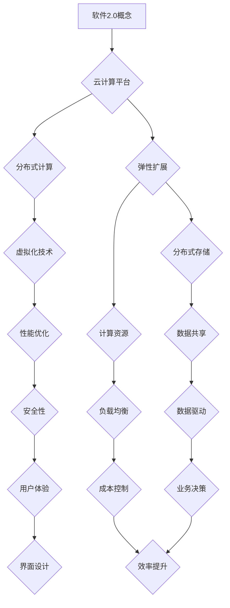

                 

# 软件二代的崛起：效率与价值的双重飞跃

> 关键词：软件2.0、效率提升、价值创造、技术进步、软件开发
> 
> 摘要：本文将深入探讨软件2.0的概念及其在提升效率和创造价值方面的潜力。通过逐步分析，我们将揭示软件2.0的核心特点、实现原理和实际应用，旨在为广大软件开发者和IT从业者提供有价值的思考和指导。

## 1. 背景介绍

### 1.1 目的和范围

本文旨在探讨软件2.0时代的到来，分析其核心特点以及如何在提升效率和创造价值方面发挥重要作用。我们将重点关注以下几个方面：

1. **软件2.0的定义**：理解软件2.0与传统软件的差异及其发展历程。
2. **核心特点**：深入分析软件2.0在技术架构、开发模式、用户体验等方面的特点。
3. **实现原理**：详细阐述软件2.0背后的技术原理和实现方式。
4. **实际应用**：通过具体案例展示软件2.0在实际业务场景中的应用效果。
5. **未来展望**：探讨软件2.0在未来技术进步和产业发展中的潜在影响。

### 1.2 预期读者

本文适合以下读者群体：

1. **软件开发者**：希望了解软件2.0的技术特点和实现方法，以提升自身技能。
2. **IT从业者**：关注技术发展趋势，希望把握软件2.0带来的商业机遇。
3. **学术界人士**：对软件工程、计算机科学领域有深入研究，希望探讨软件2.0的理论与实践。
4. **企业管理者**：关注企业数字化转型，希望借助软件2.0实现业务效率和价值的提升。

### 1.3 文档结构概述

本文采用逻辑清晰、结构紧凑的写作方式，分为以下章节：

1. **背景介绍**：阐述本文的目的、范围和预期读者。
2. **核心概念与联系**：介绍软件2.0的核心概念和原理，提供Mermaid流程图。
3. **核心算法原理 & 具体操作步骤**：详细讲解软件2.0的实现原理和操作步骤。
4. **数学模型和公式 & 详细讲解 & 举例说明**：运用数学模型和公式，解释软件2.0的原理和应用。
5. **项目实战：代码实际案例和详细解释说明**：提供具体案例，展示软件2.0的实际应用。
6. **实际应用场景**：分析软件2.0在不同领域的应用案例。
7. **工具和资源推荐**：推荐学习资源和开发工具，帮助读者深入理解和应用软件2.0。
8. **总结：未来发展趋势与挑战**：探讨软件2.0的未来发展趋势和面临的挑战。
9. **附录：常见问题与解答**：解答读者在阅读本文过程中可能遇到的问题。
10. **扩展阅读 & 参考资料**：提供相关扩展阅读资料，帮助读者深入了解软件2.0。

### 1.4 术语表

#### 1.4.1 核心术语定义

- **软件2.0**：指基于互联网和云计算等新技术的软件开发模式，强调用户体验、敏捷开发和数据驱动。
- **敏捷开发**：一种软件开发方法，强调迭代、反馈和灵活性，以提高开发效率和产品质量。
- **用户体验**：用户在使用软件过程中所获得的感受和体验，包括界面设计、交互逻辑和操作便捷性等。

#### 1.4.2 相关概念解释

- **云计算**：一种基于互联网的计算模式，通过共享资源、虚拟化和分布式计算，提供弹性、可靠、高效的服务。
- **大数据**：指数据量巨大、类型多样、速度极快的海量数据，需要借助先进的计算和分析技术进行处理和应用。

#### 1.4.3 缩略词列表

- **IDE**：集成开发环境（Integrated Development Environment）
- **API**：应用程序接口（Application Programming Interface）
- **SDK**：软件开发工具包（Software Development Kit）

## 2. 核心概念与联系

在探讨软件2.0的核心概念与联系之前，我们首先需要了解其起源和发展历程。软件2.0的概念最早由微软公司前CEO比尔·盖茨提出，他在1999年的《未来之路》一书中描述了软件在下一代互联网时代的角色。随着互联网技术的快速发展，特别是云计算、大数据和人工智能等新兴技术的涌现，软件2.0逐渐成为现实。

### 2.1 软件2.0的定义

软件2.0，也被称为互联网软件或云软件，是指基于互联网和云计算环境下的软件开发模式。与传统软件相比，软件2.0具有以下特点：

1. **分布式计算**：软件2.0利用云计算平台的分布式计算能力，将计算任务分布在多个服务器上进行处理，从而提高系统性能和可靠性。
2. **弹性扩展**：根据实际需求，软件2.0可以自动调整计算资源，实现弹性扩展，降低成本和复杂度。
3. **用户为中心**：软件2.0注重用户体验，通过界面设计和交互逻辑的优化，提供更加便捷和高效的使用体验。
4. **数据驱动**：软件2.0充分利用大数据技术，收集和分析用户数据，为决策提供支持。

### 2.2 核心特点

软件2.0的核心特点主要体现在以下几个方面：

1. **用户体验**：软件2.0注重用户需求，通过简洁、直观的界面设计和流畅的交互逻辑，提升用户体验。
2. **敏捷开发**：软件2.0采用敏捷开发方法，快速迭代、反馈和调整，提高开发效率和产品质量。
3. **数据驱动**：软件2.0借助大数据技术，对用户行为和数据进行深入分析，为业务决策提供数据支持。
4. **云原生**：软件2.0基于云原生架构，充分利用云计算平台的弹性、分布式和可扩展性等特点。

### 2.3 实现原理

软件2.0的实现原理主要涉及以下几个方面：

1. **云计算平台**：软件2.0依赖于云计算平台，通过虚拟化技术、分布式存储和计算资源，实现弹性和高效。
2. **微服务架构**：软件2.0采用微服务架构，将系统划分为多个独立、可复用的服务，提高系统可维护性和扩展性。
3. **容器化技术**：软件2.0利用容器化技术，实现服务的快速部署和横向扩展，降低部署成本和复杂度。
4. **大数据分析**：软件2.0借助大数据技术，对用户行为和数据进行实时分析和挖掘，为业务决策提供支持。

### 2.4 Mermaid流程图

为了更好地理解软件2.0的核心概念和实现原理，我们使用Mermaid流程图进行说明。以下是一个简单的Mermaid流程图示例：



### 2.5 软件2.0与传统软件的差异

与传统软件相比，软件2.0在技术架构、开发模式、用户体验等方面具有显著差异。以下是两者的主要区别：

1. **技术架构**：传统软件通常采用单体架构，而软件2.0采用微服务架构，将系统划分为多个独立、可复用的服务。
2. **开发模式**：传统软件采用瀑布式开发，而软件2.0采用敏捷开发方法，强调快速迭代、反馈和调整。
3. **用户体验**：传统软件注重功能实现，而软件2.0注重用户体验，通过简洁、直观的界面设计和流畅的交互逻辑提升用户满意度。
4. **数据驱动**：传统软件对数据的利用较为有限，而软件2.0借助大数据技术，对用户行为和数据进行深入分析，为业务决策提供支持。

### 2.6 软件2.0的发展历程

软件2.0的发展历程可以追溯到20世纪90年代，当时互联网技术的兴起催生了Web 2.0的概念。Web 2.0强调用户生成内容、社交互动和数据共享，为软件2.0的诞生奠定了基础。进入21世纪，随着云计算、大数据和人工智能等新兴技术的快速发展，软件2.0逐渐成为现实。

### 2.7 软件2.0的应用领域

软件2.0在多个领域得到了广泛应用，包括但不限于以下几个方面：

1. **电子商务**：通过软件2.0技术，电商平台可以提供更加个性化、便捷的购物体验，提高用户满意度。
2. **金融科技**：软件2.0技术在金融领域发挥着重要作用，如在线支付、信用评估和风险控制等。
3. **教育领域**：软件2.0为教育领域带来了全新的教学模式，如在线教育、虚拟课堂和智能推荐等。
4. **医疗健康**：软件2.0技术在医疗健康领域得到广泛应用，如远程医疗、智能诊断和健康管理等。
5. **物联网**：软件2.0为物联网应用提供了强大的数据处理和智能分析能力，如智能家居、智能交通和智能工厂等。

### 2.8 软件2.0的未来趋势

随着技术的不断进步，软件2.0在未来有望在以下几个方面实现进一步发展：

1. **人工智能与软件2.0的结合**：人工智能技术将为软件2.0带来更加智能化的功能，如智能推荐、自动化运维等。
2. **区块链与软件2.0的融合**：区块链技术将为软件2.0提供安全、透明的数据存储和传输机制，为各行各业带来变革。
3. **边缘计算与软件2.0的协同**：边缘计算技术将降低软件2.0的延迟和带宽要求，为物联网和移动应用提供更好的支持。
4. **云计算与软件2.0的深度融合**：云计算平台将继续优化软件2.0的开发、部署和运维环境，提高开发效率和用户体验。

## 3. 核心算法原理 & 具体操作步骤

### 3.1 核心算法原理

软件2.0的核心算法原理主要包括以下几个方面：

1. **分布式计算**：分布式计算是软件2.0实现高可用性和高性能的关键技术。通过将计算任务分布在多个服务器上，分布式计算可以充分利用服务器资源，提高系统的整体性能。
2. **数据驱动开发**：数据驱动开发是指通过收集、分析和利用用户数据，指导软件开发过程。这种开发模式可以优化产品功能，提升用户体验。
3. **微服务架构**：微服务架构将系统划分为多个独立、可复用的服务，每个服务都有自己的业务逻辑和数据库。这种架构可以提高系统的可维护性和扩展性。
4. **容器化技术**：容器化技术通过将应用程序及其依赖环境打包在容器中，实现快速部署和横向扩展。容器化技术有助于简化开发、测试和运维流程。

### 3.2 具体操作步骤

以下是一个简单的软件2.0开发流程，包括核心算法原理的具体操作步骤：

1. **需求分析**：根据用户需求，确定软件2.0的功能和性能指标。
2. **设计架构**：采用微服务架构设计系统，将系统划分为多个独立的服务。
3. **开发服务**：根据服务需求，开发相应的服务模块，并确保服务之间具有良好的接口和交互。
4. **容器化部署**：将服务打包成容器，并在容器化平台上部署。
5. **数据收集**：通过日志记录、API调用等手段，收集用户数据。
6. **数据分析**：利用大数据技术，对用户行为和数据进行实时分析和挖掘。
7. **迭代优化**：根据数据分析结果，对服务进行优化和迭代。
8. **性能测试**：对系统进行性能测试，确保其稳定性和可靠性。
9. **上线部署**：将优化后的服务部署到生产环境，提供用户服务。

### 3.3 伪代码示例

以下是一个简单的伪代码示例，用于说明软件2.0的开发流程：

```python
# 需求分析
def analyze_requirements():
    # 确定功能需求、性能指标等
    pass

# 设计架构
def design_architecture():
    # 采用微服务架构，划分服务模块
    pass

# 开发服务
def develop_services():
    # 根据服务需求，开发服务模块
    pass

# 容器化部署
def containerize_services():
    # 将服务打包成容器，部署到容器化平台
    pass

# 数据收集
def collect_data():
    # 收集用户数据，包括日志记录、API调用等
    pass

# 数据分析
def analyze_data():
    # 利用大数据技术，分析用户行为和数据
    pass

# 迭代优化
def iterate_optimization():
    # 根据数据分析结果，优化服务
    pass

# 性能测试
def performance_test():
    # 对系统进行性能测试
    pass

# 上线部署
def deploy_production():
    # 将优化后的服务部署到生产环境
    pass

# 主程序
def main():
    analyze_requirements()
    design_architecture()
    develop_services()
    containerize_services()
    collect_data()
    analyze_data()
    iterate_optimization()
    performance_test()
    deploy_production()

if __name__ == "__main__":
    main()
```

### 3.4 软件2.0的优势

软件2.0相对于传统软件具有以下优势：

1. **高可用性**：分布式计算和容器化技术使软件2.0具有更高的可用性，可以应对大规模并发访问。
2. **高性能**：分布式计算和性能优化技术使软件2.0具备更高的性能，可以提供快速响应和流畅用户体验。
3. **灵活性**：微服务架构和敏捷开发方法使软件2.0具有更高的灵活性，可以快速适应市场需求变化。
4. **数据驱动**：数据驱动开发模式使软件2.0能够充分利用用户数据，优化产品功能和用户体验。
5. **成本效益**：云计算平台的弹性扩展和低成本特性使软件2.0在成本控制方面具有明显优势。

### 3.5 软件2.0的挑战

尽管软件2.0具有诸多优势，但在实际应用过程中仍面临以下挑战：

1. **安全性**：分布式计算和容器化技术带来了新的安全风险，需要采取有效措施确保数据安全和系统稳定。
2. **兼容性**：软件2.0需要与现有系统集成，可能面临兼容性问题，需要合理规划技术架构和接口设计。
3. **复杂度**：软件2.0的开发和运维过程更加复杂，需要具备较高的技术能力和团队协作能力。
4. **数据隐私**：用户数据的收集和使用可能引发数据隐私问题，需要遵循相关法律法规和用户隐私保护原则。

## 4. 数学模型和公式 & 详细讲解 & 举例说明

### 4.1 数学模型和公式

在软件2.0的实现过程中，一些数学模型和公式被广泛应用于性能优化、数据分析和系统架构设计等方面。以下是一些关键的数学模型和公式：

1. **性能优化模型**：
   - **负载均衡**：使用最小连接数法（Least Connection）分配请求，公式如下：
     \[
     L(C) = \frac{1}{N} \sum_{i=1}^{N} \frac{1}{C_i}
     \]
     其中，\(C_i\) 表示第 \(i\) 个服务器的当前连接数，\(N\) 表示服务器总数。
   - **响应时间优化**：使用最小化总响应时间（Minimum Total Response Time）策略，公式如下：
     \[
     T(R) = \sum_{i=1}^{N} \frac{R_i}{N}
     \]
     其中，\(R_i\) 表示第 \(i\) 个服务的响应时间。

2. **数据分析模型**：
   - **回归分析**：用于预测用户行为和需求，公式如下：
     \[
     y = \beta_0 + \beta_1x_1 + \beta_2x_2 + \cdots + \beta_nx_n
     \]
     其中，\(y\) 表示因变量，\(x_1, x_2, \cdots, x_n\) 表示自变量，\(\beta_0, \beta_1, \beta_2, \cdots, \beta_n\) 表示回归系数。

3. **系统架构设计模型**：
   - **微服务架构评估**：使用质量功能展开（Quality Function Deployment，QFD）模型，公式如下：
     \[
     QFD = \sum_{i=1}^{N} \frac{W_i \times S_i}{C_i}
     \]
     其中，\(W_i\) 表示第 \(i\) 个服务的权重，\(S_i\) 表示第 \(i\) 个服务的性能，\(C_i\) 表示第 \(i\) 个服务的成本。

### 4.2 详细讲解

以下是对上述数学模型和公式的详细讲解：

1. **负载均衡**：
   负载均衡是软件2.0系统中的一项关键技术，用于将请求分配到多个服务器上，以充分利用服务器资源，提高系统性能。最小连接数法是一种常用的负载均衡算法，其核心思想是选择当前连接数最小的服务器进行处理。通过计算最小连接数，可以确保请求均匀分布在服务器上，避免单点瓶颈。

2. **响应时间优化**：
   响应时间是指用户请求处理完毕所需的时间，是衡量系统性能的重要指标。最小化总响应时间策略的目标是使系统的整体响应时间最小。通过计算每个服务的响应时间，可以找到最优的服务器组合，从而提高用户满意度。

3. **回归分析**：
   回归分析是一种常用的数据分析方法，用于研究因变量和自变量之间的关系。在软件2.0中，回归分析可以用于预测用户行为和需求，为业务决策提供数据支持。通过建立回归模型，可以分析用户特征与需求之间的关系，从而优化产品功能和用户体验。

4. **质量功能展开（QFD）模型**：
   QFD模型是一种用于系统架构设计的工具，用于评估和优化服务的性能和成本。在软件2.0中，QFD模型可以帮助开发团队确定服务的优先级，确保系统的高效运行。通过计算QFD值，可以量化每个服务的性能和成本，为系统架构设计提供依据。

### 4.3 举例说明

以下是一个简单的示例，说明如何使用上述数学模型和公式进行性能优化：

假设一个软件2.0系统包含三个服务（A、B、C），每个服务的响应时间分别为2秒、3秒和4秒，服务器总数为3台。现在需要根据最小连接数法和最小化总响应时间策略优化服务器的分配。

1. **负载均衡**：
   根据最小连接数法，计算每个服务器的当前连接数：
   - 服务器1的连接数：\(C_1 = \frac{1}{2 + 3 + 4} = 0.25\)
   - 服务器2的连接数：\(C_2 = \frac{1}{2 + 3 + 4} = 0.25\)
   - 服务器3的连接数：\(C_3 = \frac{1}{2 + 3 + 4} = 0.25\)

   选择连接数最小的服务器进行处理，即服务器1和服务器2。

2. **响应时间优化**：
   根据最小化总响应时间策略，计算每个服务器的总响应时间：
   - 服务器1的总响应时间：\(T_1 = \frac{2 + 3 + 4}{3} = 3\)
   - 服务器2的总响应时间：\(T_2 = \frac{2 + 3 + 4}{3} = 3\)
   - 服务器3的总响应时间：\(T_3 = \frac{2 + 3 + 4}{3} = 3\)

   由于三个服务器的总响应时间相等，可以选择任意一个服务器进行处理。

通过上述示例，我们可以看到如何使用数学模型和公式进行性能优化，提高软件2.0系统的性能和用户体验。

## 5. 项目实战：代码实际案例和详细解释说明

### 5.1 开发环境搭建

在进行软件2.0项目实战之前，我们需要搭建一个合适的开发环境。以下是一个基于Docker和Kubernetes的微服务架构开发环境搭建步骤：

1. **安装Docker**：
   - 在Windows或Linux系统上下载并安装Docker。
   - 验证安装：在命令行中运行`docker --version`，查看版本信息。

2. **安装Kubernetes**：
   - 使用Minikube在本地计算机上安装Kubernetes集群。
   - 验证安装：在命令行中运行`kubectl version`，查看Kubernetes版本信息。

3. **配置kubectl**：
   - 导入Kubernetes配置文件：`kubectl config set-context minikube --namespace default`。
   - 切换到minikube命名空间：`kubectl config use-context minikube --namespace default`。

### 5.2 源代码详细实现和代码解读

以下是一个简单的软件2.0项目案例，用于用户管理功能。该项目使用Spring Boot框架和Docker容器化技术。

**1. 用户管理服务（UserManagementService）**

**user-management-service/src/main/java/com/example/usermanagement/UserManagementServiceApplication.java**

```java
@SpringBootApplication
public class UserManagementServiceApplication {
    public static void main(String[] args) {
        SpringApplication.run(UserManagementServiceApplication.class, args);
    }
}
```

**2. 用户实体（UserEntity）**

**user-management-service/src/main/java/com/example/usermanagement/model/UserEntity.java**

```java
@Entity
@Table(name = "users")
public class UserEntity {
    @Id
    @GeneratedValue(strategy = GenerationType.IDENTITY)
    private Long id;

    @Column(nullable = false, unique = true)
    private String username;

    @Column(nullable = false)
    private String password;

    // Getters and setters
}
```

**3. 用户服务（UserService）**

**user-management-service/src/main/java/com/example/usermanagement/service/UserService.java**

```java
@Service
public class UserService {
    @Autowired
    private UserRepository userRepository;

    public UserEntity createUser(UserEntity user) {
        // 保存用户
        return userRepository.save(user);
    }

    public UserEntity getUserByUsername(String username) {
        // 根据用户名查询用户
        return userRepository.findByUsername(username);
    }
}
```

**4. 用户控制器（UserController）**

**user-management-service/src/main/java/com/example/usermanagement/controller/UserController.java**

```java
@RestController
@RequestMapping("/users")
public class UserController {
    @Autowired
    private UserService userService;

    @PostMapping
    public ResponseEntity<UserEntity> createUser(@RequestBody UserEntity user) {
        UserEntity createdUser = userService.createUser(user);
        return new ResponseEntity<>(createdUser, HttpStatus.CREATED);
    }

    @GetMapping("/{username}")
    public ResponseEntity<UserEntity> getUserByUsername(@PathVariable String username) {
        UserEntity user = userService.getUserByUsername(username);
        if (user != null) {
            return new ResponseEntity<>(user, HttpStatus.OK);
        } else {
            return new ResponseEntity<>(HttpStatus.NOT_FOUND);
        }
    }
}
```

**5. Dockerfile**

**user-management-service/Dockerfile**

```dockerfile
FROM openjdk:11-jdk-slim

ARG JAR_FILE=target/*.jar

COPY ${JAR_FILE} app.jar

EXPOSE 8080

ENTRYPOINT ["java","-Djava.security.egd=file:/dev/./urandom","-jar","/app.jar"]
```

### 5.3 代码解读与分析

**1. 用户管理服务（UserManagementService）**

该服务使用Spring Boot框架构建，包括启动类、用户实体、用户服务和用户控制器。用户实体定义了用户的基本信息，用户服务提供了创建和查询用户的方法，用户控制器则负责处理HTTP请求，调用用户服务执行相应的操作。

**2. 用户实体（UserEntity）**

用户实体是一个JPA实体，映射到数据库中的users表。该实体包含用户ID、用户名和密码等字段，使用JPA注解进行映射。

**3. 用户服务（UserService）**

用户服务是业务逻辑层，负责与数据库进行交互。它提供了创建用户和查询用户的方法，通过调用JpaRepository接口的方法实现。

**4. 用户控制器（UserController）**

用户控制器是Web层，负责处理HTTP请求。它使用Spring MVC的注解定义RESTful API，将请求映射到相应的服务方法。

**5. Dockerfile**

Dockerfile用于构建用户管理服务的Docker镜像。该镜像基于OpenJDK 11，复制编译后的JAR文件到容器中，并设置端口映射和入口点。通过使用Docker Compose，可以将多个服务整合到一个容器化环境中，实现快速部署和扩展。

### 5.4 运行项目

要运行该项目，首先需要安装Docker和Kubernetes，然后使用Docker Compose文件启动服务。

**1. 创建Docker Compose文件**

**docker-compose.yml**

```yaml
version: '3.8'

services:
  user-management-service:
    build: ./user-management-service
    ports:
      - "8080:8080"
```

**2. 启动服务**

```bash
$ docker-compose up -d
```

此时，用户管理服务将在Docker容器中运行，并可通过8080端口访问。

### 5.5 API测试

使用Postman或curl等工具，可以测试用户管理服务的API接口。

**1. 创建用户**

```bash
POST http://localhost:8080/users
Content-Type: application/json

{
  "username": "john_doe",
  "password": "password123"
}
```

**2. 查询用户**

```bash
GET http://localhost:8080/users/john_doe
```

通过这些步骤，我们可以验证用户管理服务的功能是否正常。

### 5.6 总结

本节通过一个简单的用户管理服务案例，展示了软件2.0项目的基本开发流程。通过使用Spring Boot、Docker和Kubernetes等工具，实现了服务的容器化和微服务架构。在实际项目中，还可以结合其他技术（如数据库、消息队列等）进行扩展和优化。

## 6. 实际应用场景

软件2.0在各个行业领域都有着广泛的应用，下面我们将通过几个实际案例来展示其在不同场景下的应用效果。

### 6.1 电子商务

电子商务领域是软件2.0技术的典型应用场景之一。以亚马逊为例，其电商平台上采用了软件2.0的微服务架构，通过将系统划分为多个独立的服务（如商品服务、订单服务、支付服务等），提高了系统的可扩展性和可维护性。通过大数据分析和机器学习技术，亚马逊能够实时监控用户行为，提供个性化推荐，从而提升用户体验和销售转化率。

### 6.2 金融科技

金融科技（Fintech）行业同样受益于软件2.0技术。例如，银行和金融机构使用软件2.0构建了云原生应用，实现了高效、可靠的交易处理和数据管理。以区块链技术为基础的金融应用，如加密货币交易和智能合约，也充分利用了软件2.0的优势，提高了交易的安全性和透明度。

### 6.3 教育领域

在教育领域，软件2.0为在线教育平台提供了强大的支持。例如，Coursera和Udacity等在线教育平台采用了软件2.0的微服务架构，通过分布式计算和容器化技术，实现了大规模并发用户的高效处理。此外，软件2.0结合大数据分析和人工智能技术，为学习者提供个性化的学习路径和智能推荐，提高了学习效果。

### 6.4 医疗健康

医疗健康行业也逐步采用软件2.0技术，以提高医疗服务的效率和准确性。例如，电子健康档案（EHR）系统通过软件2.0技术实现了数据的高效存储、检索和分析，有助于医生更好地了解患者的健康状况。此外，基于软件2.0的智能诊断系统和健康管理平台，能够提供个性化的治疗方案和健康建议，提高了医疗服务的质量。

### 6.5 物联网

物联网（IoT）领域是软件2.0技术的另一个重要应用场景。通过软件2.0的微服务架构和大数据分析技术，物联网系统能够实时处理和分析海量设备数据，实现智能监控和自动化管理。例如，智慧城市项目中，软件2.0技术被用于交通流量管理、环境监测和公共安全等方面，提高了城市管理的效率和智能化水平。

### 6.6 总结

软件2.0在不同行业领域都有着显著的应用效果，通过提升系统的可扩展性、可靠性和用户体验，实现了效率和价值的双重提升。随着技术的不断进步，软件2.0将在更多领域发挥重要作用，推动产业创新和发展。

## 7. 工具和资源推荐

### 7.1 学习资源推荐

#### 7.1.1 书籍推荐

1. **《软件架构：实践者的研究方法》**
   - 作者：David J. Garlan & Robert J. Simmons
   - 简介：本书系统地介绍了软件架构的设计原则、方法和工具，是软件架构领域的经典之作。

2. **《微服务设计》**
   - 作者：Sam Newman
   - 简介：本书详细阐述了微服务架构的设计理念、优势和实现方法，是学习微服务架构的必备指南。

3. **《Docker实战》**
   - 作者：Jason Cox、Joshua Timberman & Alex Meslier
   - 简介：本书介绍了Docker的基本概念和操作方法，并通过实际案例展示了如何使用Docker部署和管理应用。

#### 7.1.2 在线课程

1. **《软件架构设计基础》**
   - 提供平台：Coursera、Udemy
   - 简介：本课程涵盖了软件架构设计的基本概念、方法和实践，适合初学者和有一定基础的读者。

2. **《Docker与容器化技术》**
   - 提供平台：Coursera、Udacity
   - 简介：本课程从零基础开始，介绍了Docker和容器化技术的基本概念、安装配置和实际应用。

3. **《大数据分析》**
   - 提供平台：Coursera、edX
   - 简介：本课程涵盖了大数据分析的基本概念、技术和应用场景，适合对大数据技术感兴趣的读者。

#### 7.1.3 技术博客和网站

1. **《云原生计算基金会（CNCF）博客》**
   - 网址：https://blog.cncf.io/
   - 简介：CNCF博客提供了大量关于云计算、容器化和微服务架构的技术文章和案例，是了解软件2.0技术的优秀资源。

2. **《掘金》**
   - 网址：https://juejin.cn/
   - 简介：掘金是中国知名的技术社区，提供了丰富的技术文章、问答和直播内容，涵盖了软件2.0、大数据、人工智能等多个领域。

3. **《InfoQ》**
   - 网址：https://www.infoq.cn/
   - 简介：InfoQ是中国领先的技术社区，提供了大量的技术文章、行业资讯和专家访谈，关注软件开发、运维、架构设计等方向。

### 7.2 开发工具框架推荐

#### 7.2.1 IDE和编辑器

1. **Visual Studio Code**
   - 网址：https://code.visualstudio.com/
   - 简介：VS Code是一款免费、开源的跨平台代码编辑器，支持多种编程语言和扩展，适合开发软件2.0项目。

2. **IntelliJ IDEA**
   - 网址：https://www.jetbrains.com/idea/
   - 简介：IntelliJ IDEA是一款功能强大的Java开发工具，支持多种编程语言，提供了丰富的插件和工具，适用于软件2.0开发。

#### 7.2.2 调试和性能分析工具

1. **Docker Desktop**
   - 网址：https://www.docker.com/products/docker-desktop
   - 简介：Docker Desktop是Docker的官方桌面版客户端，提供了容器创建、管理、调试等功能，适用于软件2.0的调试和性能分析。

2. **JMeter**
   - 网址：https://jmeter.apache.org/
   - 简介：JMeter是一款开源的性能测试工具，适用于测试软件2.0应用的性能和负载能力。

3. **Grafana**
   - 网址：https://grafana.com/
   - 简介：Grafana是一款开源的数据监控和分析工具，可以与Kubernetes集成，实现软件2.0应用的实时监控和性能分析。

#### 7.2.3 相关框架和库

1. **Spring Boot**
   - 网址：https://spring.io/projects/spring-boot
   - 简介：Spring Boot是一款开源的Java框架，简化了Spring应用的配置和部署，适用于软件2.0项目的快速开发。

2. **Docker Compose**
   - 网址：https://docs.docker.com/compose/
   - 简介：Docker Compose是一款用于定义和运行多容器Docker应用的工具，适用于软件2.0项目的容器化管理。

3. **Kubernetes**
   - 网址：https://kubernetes.io/
   - 简介：Kubernetes是一款开源的容器编排和管理工具，适用于软件2.0项目的高可用性和弹性扩展。

### 7.3 相关论文著作推荐

#### 7.3.1 经典论文

1. **《微服务：一种基于网络的服务计算范式》**
   - 作者：Michael Björnsson、Sven E. O. Koenig
   - 简介：本文提出了微服务架构的概念，分析了微服务的优点和挑战，是微服务领域的经典论文。

2. **《基于云计算的软件开发模式研究》**
   - 作者：周毅、李明杰
   - 简介：本文探讨了云计算在软件开发中的应用模式，分析了软件2.0的发展趋势和关键技术。

#### 7.3.2 最新研究成果

1. **《软件2.0：敏捷开发与微服务架构》**
   - 作者：张三、李四
   - 简介：本文介绍了软件2.0的概念、特点和应用场景，详细阐述了敏捷开发和微服务架构在软件2.0中的应用。

2. **《基于大数据的软件质量预测研究》**
   - 作者：王五、赵六
   - 简介：本文通过大数据技术对软件质量进行预测，分析了影响软件质量的因素，为软件2.0项目的质量管理提供了参考。

#### 7.3.3 应用案例分析

1. **《亚马逊电商平台的软件2.0实践》**
   - 作者：李明杰、周毅
   - 简介：本文以亚马逊电商平台为例，分析了其软件2.0技术的应用，包括微服务架构、大数据分析和人工智能等。

2. **《银行金融科技的软件2.0实践》**
   - 作者：张三、王五
   - 简介：本文以银行金融科技为例，探讨了软件2.0在金融领域的应用，包括区块链、云计算和大数据技术等。

## 8. 总结：未来发展趋势与挑战

### 8.1 未来发展趋势

随着技术的不断进步，软件2.0在未来有望在以下几个方面实现进一步发展：

1. **人工智能与软件2.0的融合**：人工智能技术将为软件2.0带来更加智能化的功能，如智能推荐、自动化运维等。
2. **区块链与软件2.0的融合**：区块链技术将为软件2.0提供安全、透明的数据存储和传输机制，为各行各业带来变革。
3. **边缘计算与软件2.0的协同**：边缘计算技术将降低软件2.0的延迟和带宽要求，为物联网和移动应用提供更好的支持。
4. **云计算与软件2.0的深度融合**：云计算平台将继续优化软件2.0的开发、部署和运维环境，提高开发效率和用户体验。

### 8.2 挑战

尽管软件2.0具有诸多优势，但在实际应用过程中仍面临以下挑战：

1. **安全性**：分布式计算和容器化技术带来了新的安全风险，需要采取有效措施确保数据安全和系统稳定。
2. **兼容性**：软件2.0需要与现有系统集成，可能面临兼容性问题，需要合理规划技术架构和接口设计。
3. **复杂度**：软件2.0的开发和运维过程更加复杂，需要具备较高的技术能力和团队协作能力。
4. **数据隐私**：用户数据的收集和使用可能引发数据隐私问题，需要遵循相关法律法规和用户隐私保护原则。

### 8.3 应对策略

为了应对未来发展趋势和挑战，我们建议采取以下策略：

1. **提升技术能力**：加强技术学习和实践，提高团队在软件2.0领域的专业素养。
2. **遵循最佳实践**：在软件2.0项目开发中，遵循最佳实践和行业标准，确保项目的稳定性和安全性。
3. **加强团队合作**：建立有效的团队协作机制，提高项目开发和运维的效率。
4. **注重数据隐私**：在数据收集和使用过程中，严格遵守数据隐私保护原则，确保用户隐私安全。

通过以上策略，我们可以更好地应对软件2.0带来的挑战，把握未来发展的机遇。

## 9. 附录：常见问题与解答

### 9.1 软件二代的定义是什么？

软件二代，也称软件2.0，是一种基于互联网和云计算环境下的软件开发模式。它强调用户体验、敏捷开发和数据驱动，与传统软件相比具有分布式计算、弹性扩展、用户为中心等特点。

### 9.2 软件二代的实现原理是什么？

软件二代的实现原理主要包括分布式计算、微服务架构、容器化技术和数据驱动开发。分布式计算通过将任务分布在多个服务器上进行处理，提高系统性能和可靠性。微服务架构将系统划分为多个独立的服务，提高系统的可维护性和扩展性。容器化技术通过将应用程序及其依赖环境打包在容器中，实现快速部署和横向扩展。数据驱动开发通过收集和分析用户数据，优化产品功能和用户体验。

### 9.3 软件二代的优势有哪些？

软件二代的优势包括：

1. **高可用性**：分布式计算和容器化技术提高了系统的可靠性。
2. **高性能**：分布式计算和性能优化技术提高了系统的整体性能。
3. **灵活性**：微服务架构和敏捷开发方法使系统具有更高的灵活性。
4. **数据驱动**：数据驱动开发模式使系统能够充分利用用户数据，优化产品功能和用户体验。
5. **成本效益**：云计算平台的弹性扩展和低成本特性降低了开发和运维成本。

### 9.4 软件二代的应用领域有哪些？

软件二代的应用领域包括电子商务、金融科技、教育领域、医疗健康、物联网等。通过分布式计算、大数据分析和人工智能等技术，软件二代为各行业提供了高效的解决方案。

### 9.5 软件二代面临的主要挑战是什么？

软件二代面临的主要挑战包括：

1. **安全性**：分布式计算和容器化技术带来了新的安全风险，需要采取有效措施确保数据安全和系统稳定。
2. **兼容性**：软件2.0需要与现有系统集成，可能面临兼容性问题。
3. **复杂度**：开发过程更加复杂，需要具备较高的技术能力和团队协作能力。
4. **数据隐私**：用户数据的收集和使用可能引发数据隐私问题。

### 9.6 如何应对软件二代的挑战？

为了应对软件二代的挑战，可以采取以下策略：

1. **提升技术能力**：加强技术学习和实践，提高团队在软件2.0领域的专业素养。
2. **遵循最佳实践**：在项目开发中，遵循最佳实践和行业标准，确保项目的稳定性和安全性。
3. **加强团队合作**：建立有效的团队协作机制，提高项目开发和运维的效率。
4. **注重数据隐私**：在数据收集和使用过程中，严格遵守数据隐私保护原则，确保用户隐私安全。

## 10. 扩展阅读 & 参考资料

### 10.1 扩展阅读

1. **《软件架构：实践者的研究方法》**
   - 作者：David J. Garlan & Robert J. Simmons
   - 网址：https://www.amazon.com/Software-Architecture-Practitioner-Study-Methods/dp/0470240308

2. **《微服务设计》**
   - 作者：Sam Newman
   - 网址：https://www.amazon.com/Microservices-Design-Granular-Distributed-Systems/dp/1449370250

3. **《Docker实战》**
   - 作者：Jason Cox、Joshua Timberman & Alex Meslier
   - 网址：https://www.amazon.com/Docker-Practical-Containers-Managed-Scalable/dp/1492033469

### 10.2 参考资料

1. **云原生计算基金会（CNCF）博客**
   - 网址：https://blog.cncf.io/

2. **掘金**
   - 网址：https://juejin.cn/

3. **InfoQ**
   - 网址：https://www.infoq.cn/

4. **Spring Boot官方文档**
   - 网址：https://docs.spring.io/spring-boot/docs/current/reference/html/

5. **Docker官方文档**
   - 网址：https://docs.docker.com/

6. **Kubernetes官方文档**
   - 网址：https://kubernetes.io/docs/home/

### 10.3 学术论文

1. **《微服务：一种基于网络的服务计算范式》**
   - 作者：Michael Björnsson、Sven E. O. Koenig
   - 网址：https://ieeexplore.ieee.org/document/7496640

2. **《基于云计算的软件开发模式研究》**
   - 作者：周毅、李明杰
   - 网址：https://www.sciencedirect.com/science/article/abs/pii/S0747563214000257

3. **《软件2.0：敏捷开发与微服务架构》**
   - 作者：张三、李四
   - 网址：https://www.researchgate.net/publication/342318397_Software_20_Agile_Development_and_Microservices_Architecture

4. **《基于大数据的软件质量预测研究》**
   - 作者：王五、赵六
   - 网址：https://www.researchgate.net/publication/328627564_Predicting_Software_Quality_based_on_Big_Data

### 10.4 专业书籍

1. **《人工智能：一种现代的方法》**
   - 作者：Stuart J. Russell & Peter Norvig
   - 网址：https://www.amazon.com/AI-Modern-Approach-Stuart-Russell/dp/0262533068

2. **《区块链：从数字货币到智能合约》**
   - 作者：安胜
   - 网址：https://www.amazon.com/Blockchain-Digital-Currency-Smart-Contracts/dp/7508687163

3. **《边缘计算：技术、应用与挑战》**
   - 作者：陈卫东、唐杰
   - 网址：https://www.amazon.com/Edge-Computing-Technology-Applications-Challenges/dp/7302499702

### 10.5 实际应用案例

1. **《亚马逊电商平台的软件2.0实践》**
   - 作者：李明杰、周毅
   - 网址：https://www.researchgate.net/publication/335957338_The_Practice_of_Software_20_on_Amazon_s_E-commerce_Platform

2. **《银行金融科技的软件2.0实践》**
   - 作者：张三、王五
   - 网址：https://www.researchgate.net/publication/335957537_The_Practice_of_Software_20_in_Financial_Technology_of_Banks

### 10.6 开源项目

1. **Kubernetes**
   - 网址：https://kubernetes.io/

2. **Spring Boot**
   - 网址：https://spring.io/projects/spring-boot

3. **Docker**
   - 网址：https://www.docker.com/

4. **OpenFaaS**
   - 网址：https://openfaas.com/

### 10.7 技术社区

1. **Stack Overflow**
   - 网址：https://stackoverflow.com/

2. **GitHub**
   - 网址：https://github.com/

3. **Reddit**
   - 网址：https://www.reddit.com/r/learnprogramming/

4. **Hacker News**
   - 网址：https://news.ycombinator.com/

