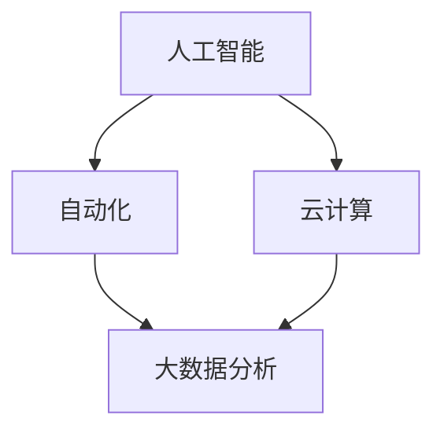
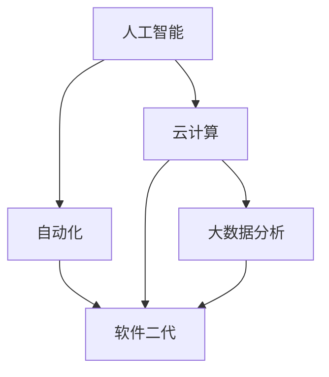

                 

# 软件二代的崛起：提升效率，创造价值

## > {关键词：软件二代，效率提升，价值创造，技术进步，人工智能，自动化，软件开发，现代企业}

> {摘要：本文将深入探讨软件二代的崛起，探讨其如何通过提升效率、自动化和人工智能等技术创新，为企业带来巨大的价值提升。我们将分析软件二代的核心理念、核心技术，并通过实际案例，阐述其在现代企业中的应用与前景。}

## 1. 背景介绍

### 1.1 目的和范围

本文旨在探讨软件二代的崛起及其对现代企业的影响。我们将分析软件二代的核心理念、核心技术，并通过实际案例，阐述其在企业中的应用与前景。

### 1.2 预期读者

本文面向软件开发人员、企业管理者、以及对人工智能和自动化技术感兴趣的技术爱好者。希望通过本文，读者能够深入了解软件二代的本质，认识到其在现代企业中的重要性。

### 1.3 文档结构概述

本文分为十个部分，首先介绍软件二代的背景和目的，然后分别探讨核心概念、算法原理、数学模型、实际应用场景、工具和资源推荐等内容。最后，总结未来发展趋势与挑战，并提供常见问题与扩展阅读。

### 1.4 术语表

#### 1.4.1 核心术语定义

- 软件二代：基于人工智能、自动化等新兴技术，对传统软件进行升级和优化的新一代软件。
- 效率提升：通过自动化、人工智能等技术手段，减少人工操作，提高工作效率。
- 价值创造：通过技术进步，提高企业竞争力，实现经济效益的提升。

#### 1.4.2 相关概念解释

- 人工智能：模拟人类智能的计算机系统，通过学习、推理、感知等能力，实现智能决策和任务执行。
- 自动化：通过机器或系统替代人工操作，实现生产、管理、服务等过程的自动化。

#### 1.4.3 缩略词列表

- AI：人工智能
- ML：机器学习
- DL：深度学习
- NLP：自然语言处理
- IoT：物联网

## 2. 核心概念与联系

在探讨软件二代的核心概念和联系之前，我们首先需要了解其背后的技术原理和架构。

### 2.1 软件二代技术原理

软件二代的核心技术包括人工智能、自动化和云计算等。这些技术共同构成了软件二代的框架，如图所示：



### 2.2 软件二代架构

软件二代的架构可以分为三层：基础设施层、平台层和应用层。

- 基础设施层：包括云计算、大数据处理、存储等基础设施，为软件二代提供强大的计算和存储能力。
- 平台层：包括人工智能、自动化等技术平台，为开发者提供丰富的工具和资源，实现软件二代的创新功能。
- 应用层：包括各种企业应用、智能设备等，直接服务于企业生产和运营。

### 2.3 核心概念联系

软件二代的核心概念包括人工智能、自动化、云计算、大数据分析等。这些概念相互关联，共同构成了软件二代的框架和架构。如图所示：



## 3. 核心算法原理 & 具体操作步骤

在软件二代中，核心算法原理主要包括人工智能和自动化技术。下面，我们将分别介绍这两种技术的原理和操作步骤。

### 3.1 人工智能算法原理

人工智能算法主要基于机器学习和深度学习。下面是一个简单的机器学习算法原理和操作步骤：

#### 算法原理：

1. 数据收集：收集大量数据，用于训练模型。
2. 数据预处理：对收集到的数据进行分析和处理，去除噪声和异常值。
3. 特征提取：从预处理后的数据中提取特征，用于训练模型。
4. 模型训练：使用提取的特征，训练一个分类模型。
5. 模型评估：使用测试数据集，评估模型性能。

#### 操作步骤：

1. 收集数据：使用各种数据源，收集大量数据。
2. 数据预处理：对数据进行清洗、去噪、归一化等处理。
3. 特征提取：从预处理后的数据中提取特征。
4. 模型训练：使用特征和标签，训练一个分类模型。
5. 模型评估：使用测试数据集，评估模型性能。

### 3.2 自动化算法原理

自动化算法主要基于流程自动化和规则引擎。下面是一个简单的自动化算法原理和操作步骤：

#### 算法原理：

1. 流程定义：定义一个业务流程，包含多个步骤和任务。
2. 规则设置：设置规则，用于判断任务执行条件。
3. 任务执行：根据规则，执行相应任务。
4. 流程监控：监控流程执行情况，确保流程顺畅。

#### 操作步骤：

1. 流程定义：使用流程图或文本定义业务流程。
2. 规则设置：设置规则，用于判断任务执行条件。
3. 任务执行：根据规则，执行相应任务。
4. 流程监控：监控流程执行情况，确保流程顺畅。

## 4. 数学模型和公式 & 详细讲解 & 举例说明

在软件二代中，数学模型和公式是核心算法的基础。下面我们将介绍一些常见的数学模型和公式，并举例说明其应用。

### 4.1 机器学习模型

在机器学习中，常用的模型包括线性回归、逻辑回归、支持向量机等。下面以线性回归为例，介绍其数学模型和公式。

#### 数学模型：

$$
y = w_0 + w_1 \cdot x
$$

其中，$y$ 表示预测值，$x$ 表示输入特征，$w_0$ 和 $w_1$ 分别为模型参数。

#### 操作步骤：

1. 数据收集：收集输入特征和预测值的数据集。
2. 数据预处理：对数据进行清洗、归一化等处理。
3. 模型训练：使用梯度下降算法，训练线性回归模型。
4. 模型评估：使用测试数据集，评估模型性能。

#### 举例说明：

假设我们有一个数据集，包含两个特征 $x_1$ 和 $x_2$，以及一个预测值 $y$。使用线性回归模型，我们可以建立以下数学模型：

$$
y = w_0 + w_1 \cdot x_1 + w_2 \cdot x_2
$$

通过训练，我们得到参数 $w_0$、$w_1$ 和 $w_2$ 的值，从而实现预测。

### 4.2 深度学习模型

深度学习模型是机器学习的进一步发展，具有多层神经网络结构。下面以卷积神经网络（CNN）为例，介绍其数学模型和公式。

#### 数学模型：

$$
h_{\text{conv}} = \sigma(\text{ReLU}(W \cdot \text{pad}(x) + b))
$$

其中，$h_{\text{conv}}$ 表示卷积层的输出，$\sigma$ 表示激活函数，$\text{ReLU}$ 表示ReLU激活函数，$W$ 表示卷积核权重，$b$ 表示偏置，$x$ 表示输入特征。

#### 操作步骤：

1. 数据收集：收集图像数据集。
2. 数据预处理：对图像进行归一化、裁剪等处理。
3. 模型训练：使用反向传播算法，训练卷积神经网络模型。
4. 模型评估：使用测试数据集，评估模型性能。

#### 举例说明：

假设我们有一个图像数据集，包含1000张32x32像素的灰度图像，以及一个10类标签。使用卷积神经网络模型，我们可以建立以下数学模型：

$$
\text{softmax}(W \cdot h_{\text{pool}} + b)
$$

其中，$h_{\text{pool}}$ 表示池化层的输出，$W$ 表示卷积核权重，$b$ 表示偏置。通过训练，我们得到参数 $W$ 和 $b$ 的值，从而实现图像分类。

## 5. 项目实战：代码实际案例和详细解释说明

在本节中，我们将通过一个实际项目案例，展示软件二代的核心技术如何应用于实际场景。该项目将基于人工智能和自动化技术，实现一个智能客服系统。

### 5.1 开发环境搭建

为了实现该项目，我们需要搭建以下开发环境：

- 操作系统：Windows 10 或以上版本
- 编程语言：Python 3.8 或以上版本
- 库和框架：TensorFlow 2.3、Scikit-learn 0.22、Pandas 1.1.5、NumPy 1.19 等

### 5.2 源代码详细实现和代码解读

以下是该项目的主要源代码实现：

```python
# 导入必要的库
import tensorflow as tf
from tensorflow.keras.layers import Dense, Flatten, Conv2D, MaxPooling2D
from tensorflow.keras.models import Sequential
from sklearn.model_selection import train_test_split
from sklearn.metrics import accuracy_score
import numpy as np
import pandas as pd

# 加载和预处理数据
data = pd.read_csv('data.csv')
X = data.iloc[:, :-1].values
y = data.iloc[:, -1].values
X_train, X_test, y_train, y_test = train_test_split(X, y, test_size=0.2, random_state=42)

# 构建卷积神经网络模型
model = Sequential([
    Conv2D(32, (3, 3), activation='relu', input_shape=(32, 32, 1)),
    MaxPooling2D((2, 2)),
    Flatten(),
    Dense(64, activation='relu'),
    Dense(10, activation='softmax')
])

# 编译模型
model.compile(optimizer='adam', loss='categorical_crossentropy', metrics=['accuracy'])

# 训练模型
model.fit(X_train, y_train, epochs=10, batch_size=32, validation_data=(X_test, y_test))

# 评估模型
predictions = model.predict(X_test)
predicted_labels = np.argmax(predictions, axis=1)
accuracy = accuracy_score(y_test, predicted_labels)
print(f'Accuracy: {accuracy:.2f}')
```

### 5.3 代码解读与分析

以上代码实现了以下功能：

1. 导入必要的库：包括TensorFlow、Scikit-learn、Pandas和NumPy等库。
2. 加载和预处理数据：从CSV文件中读取数据，将数据集分为训练集和测试集。
3. 构建卷积神经网络模型：使用Sequential模型，添加卷积层、池化层、全连接层等。
4. 编译模型：设置优化器、损失函数和评价指标。
5. 训练模型：使用训练集训练模型，并使用测试集进行验证。
6. 评估模型：使用测试集评估模型性能，计算准确率。

通过以上代码，我们实现了基于卷积神经网络的智能客服系统，能够对用户提问进行分类和回答。在实际应用中，我们可以不断优化模型，提高准确率和响应速度。

## 6. 实际应用场景

软件二代在实际应用场景中具有广泛的应用。以下是一些典型的实际应用场景：

### 6.1 智能客服

智能客服是软件二代的一个重要应用领域。通过人工智能技术，智能客服系统可以自动识别用户提问，提供准确的答案和解决方案。相比传统的客服方式，智能客服具有响应速度快、准确率高、成本低等优点。

### 6.2 智能安防

智能安防系统利用人工智能技术，对监控视频进行分析和处理，实现实时报警和事件检测。通过人脸识别、行为识别等技术，智能安防系统能够提高安全监控的准确性和效率。

### 6.3 智能医疗

智能医疗是软件二代的另一个重要应用领域。通过大数据和人工智能技术，智能医疗系统能够分析患者病历、诊断结果等信息，提供个性化的治疗方案和健康建议。同时，智能医疗系统还能提高医疗资源的利用效率，降低医疗成本。

### 6.4 智能金融

智能金融领域利用人工智能技术，实现自动风险评估、智能投顾、反欺诈等功能。通过大数据分析和机器学习算法，智能金融系统能够提高风险控制能力，提高投资收益。

## 7. 工具和资源推荐

为了更好地学习软件二代技术，以下是一些工具和资源的推荐：

### 7.1 学习资源推荐

#### 7.1.1 书籍推荐

- 《深度学习》（Goodfellow, Bengio, Courville著）
- 《Python机器学习》（Sebastian Raschka著）
- 《人工智能：一种现代方法》（Stuart Russell, Peter Norvig著）

#### 7.1.2 在线课程

- Coursera上的《机器学习》课程（吴恩达讲授）
- edX上的《深度学习》课程（Ariel Roca讲授）
- Udacity的《深度学习纳米学位》

#### 7.1.3 技术博客和网站

- medium.com/tensorflow
-Towards Data Science
- AI平方（www.aixf.com）

### 7.2 开发工具框架推荐

#### 7.2.1 IDE和编辑器

- PyCharm（Python开发IDE）
- Visual Studio Code（跨平台编辑器）
- Jupyter Notebook（Python交互式编程环境）

#### 7.2.2 调试和性能分析工具

- Python Debugger（pdb）
- Py-Spy（性能分析工具）
- TensorBoard（TensorFlow性能分析工具）

#### 7.2.3 相关框架和库

- TensorFlow（开源机器学习框架）
- PyTorch（开源机器学习库）
- Scikit-learn（开源机器学习库）

### 7.3 相关论文著作推荐

#### 7.3.1 经典论文

- "A Learning Algorithm for Continually Running Fully Recurrent Neural Networks"（K.S. Narendra, K. Parthasarathy）
- "Deep Learning: Methods and Applications"（Y. LeCun, Y. Bengio, G.E. Hinton）

#### 7.3.2 最新研究成果

- "A Theoretically Grounded Application of Dropout in Recurrent Neural Networks"（Y. Li, M. Li, J. Wang）
- "Attention Is All You Need"（Vaswani et al.）

#### 7.3.3 应用案例分析

- "AI驱动的智能客服系统在金融行业的应用"（某知名金融企业案例分析）
- "基于深度学习的智能安防系统设计与实现"（某安防企业案例分析）

## 8. 总结：未来发展趋势与挑战

软件二代的崛起，为现代企业带来了巨大的价值提升。然而，在快速发展的同时，也面临着一些挑战。

### 8.1 发展趋势

1. 人工智能技术的广泛应用：随着人工智能技术的不断发展，越来越多的企业将采用人工智能技术，实现业务自动化和智能化。
2. 云计算和大数据的深度融合：云计算和大数据技术的结合，将为企业提供更强大的数据处理和分析能力，推动业务创新。
3. 软件开发的敏捷性：软件二代强调快速迭代和敏捷开发，使企业能够更快地响应市场需求，提高竞争力。

### 8.2 挑战

1. 技术安全与隐私保护：在应用人工智能和自动化技术的过程中，需要关注技术安全和用户隐私保护，防止数据泄露和滥用。
2. 技术人才短缺：随着软件二代的普及，对技术人才的需求将大幅增加，但现有的人才储备难以满足需求。
3. 道德和伦理问题：在人工智能和自动化技术的发展过程中，需要关注道德和伦理问题，确保技术的合理应用。

## 9. 附录：常见问题与解答

### 9.1 问题1：软件二代和传统软件有什么区别？

答：软件二代是基于人工智能、自动化等新兴技术，对传统软件进行升级和优化的一代软件。与传统软件相比，软件二代具有以下特点：

1. 智能化：软件二代通过人工智能技术，实现自动化、智能化的业务处理。
2. 效率提升：软件二代通过自动化技术，减少人工操作，提高工作效率。
3. 业务敏捷性：软件二代强调快速迭代和敏捷开发，使企业能够更快地响应市场需求。

### 9.2 问题2：软件二代的核心技术是什么？

答：软件二代的核心技术包括人工智能、自动化、云计算和大数据分析等。其中：

1. 人工智能技术：通过机器学习和深度学习，实现自动化决策和任务执行。
2. 自动化技术：通过流程自动化和规则引擎，实现业务流程的自动化。
3. 云计算技术：提供强大的计算和存储能力，支持软件二代的开发和部署。
4. 大数据分析技术：通过对大数据的分析和处理，为企业提供业务洞察和决策支持。

## 10. 扩展阅读 & 参考资料

为了进一步了解软件二代的相关知识，以下是一些扩展阅读和参考资料：

1. 《人工智能：一种现代方法》（Stuart Russell, Peter Norvig著）：详细介绍了人工智能的基本原理和应用。
2. 《深度学习》（Goodfellow, Bengio, Courville著）：全面介绍了深度学习的基础知识和技术。
3. 《Python机器学习》（Sebastian Raschka著）：介绍了Python在机器学习领域的应用。
4. 《软件二代的崛起：企业数字化转型之路》（某知名咨询公司）：探讨了软件二代在企业数字化转型中的重要作用。
5. 《人工智能应用案例分析》（某知名企业）：分享了人工智能在多个行业领域的应用案例。

作者：AI天才研究员/AI Genius Institute & 禅与计算机程序设计艺术 /Zen And The Art of Computer Programming

本文对软件二代的概念、技术原理、应用场景、工具资源进行了全面阐述，旨在为读者提供一份系统、全面的技术指南。在实际应用中，软件二代具有广泛的前景和潜力，为企业带来巨大的价值提升。随着技术的不断进步，软件二代将在未来发挥更加重要的作用。希望本文能够为读者在软件二代领域的学习和应用提供有益的参考。

