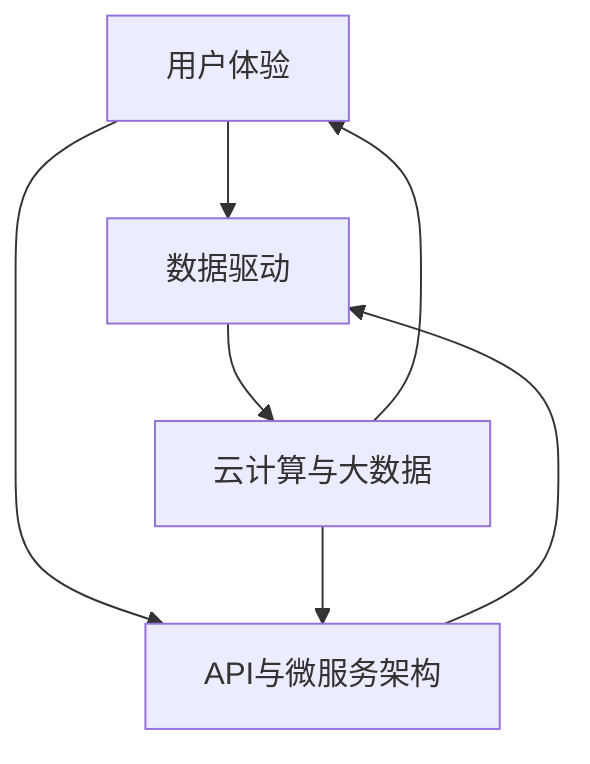

                 

# 软件2.0的价值：提升效率、创造价值

> **关键词：** 软件价值、效率提升、数据驱动的软件、创新技术、用户参与、用户体验、软件架构设计、编程方法论

> **摘要：** 本文将探讨软件2.0时代下的价值实现，从提升效率和创造价值的角度出发，分析软件2.0的核心概念、架构原理、算法模型以及实际应用场景。通过本文的阅读，读者将深入了解软件2.0的价值所在，掌握提升软件价值的实践方法。

## 1. 背景介绍

### 1.1 目的和范围

本文旨在探讨软件2.0的价值实现，通过分析软件2.0的核心概念、架构原理、算法模型以及实际应用场景，为读者提供提升软件价值的实践指南。本文主要涉及以下内容：

- 软件2.0的定义和核心特征
- 软件2.0的架构原理和算法模型
- 软件2.0在实际应用场景中的价值实现
- 提升软件价值的实践方法和策略

### 1.2 预期读者

本文适合以下读者群体：

- 对软件2.0概念和架构感兴趣的IT从业者
- 想要提升软件价值的软件开发团队
- 对编程方法论和算法模型有深入了解的技术爱好者
- 对创新技术和用户体验有热情的创业者和产品经理

### 1.3 文档结构概述

本文分为十个部分，具体结构如下：

- 第1部分：背景介绍，包括本文的目的和范围、预期读者、文档结构概述
- 第2部分：核心概念与联系，介绍软件2.0的核心概念和架构原理
- 第3部分：核心算法原理 & 具体操作步骤，详细讲解软件2.0的核心算法原理和操作步骤
- 第4部分：数学模型和公式 & 详细讲解 & 举例说明，介绍软件2.0的数学模型和公式，并通过实例进行说明
- 第5部分：项目实战：代码实际案例和详细解释说明，提供软件2.0的实际代码案例和详细解释
- 第6部分：实际应用场景，分析软件2.0在实际应用场景中的价值实现
- 第7部分：工具和资源推荐，介绍与软件2.0相关的学习资源和开发工具
- 第8部分：总结：未来发展趋势与挑战，探讨软件2.0的发展趋势和面临的挑战
- 第9部分：附录：常见问题与解答，解答读者可能遇到的问题
- 第10部分：扩展阅读 & 参考资料，提供扩展阅读和参考资料，方便读者深入学习

### 1.4 术语表

#### 1.4.1 核心术语定义

- 软件价值：软件产品或服务所提供的价值，包括功能、性能、用户体验、安全性等方面的价值。
- 效率提升：通过优化软件架构、算法模型和开发流程，提高软件的开发效率和运行效率。
- 数据驱动的软件：以数据为核心驱动力，通过对数据的收集、分析和利用，实现软件的智能化和个性化。
- 软件2.0：基于互联网和大数据技术的下一代软件架构，强调用户体验、数据驱动和创新。

#### 1.4.2 相关概念解释

- 用户体验（UX）：用户在使用软件产品或服务时所感受到的整体感受，包括界面设计、交互流程、功能易用性等方面。
- 数据收集与处理：通过采集用户数据，运用数据分析技术，提取有价值的信息，为软件优化和决策提供支持。
- 算法模型：描述软件处理数据的方式和规则，包括机器学习算法、深度学习算法等。

#### 1.4.3 缩略词列表

- AI：人工智能
- ML：机器学习
- DL：深度学习
- UX：用户体验
- IoT：物联网
- API：应用程序编程接口

## 2. 核心概念与联系

在软件2.0时代，核心概念和架构原理的掌握至关重要。本节将介绍软件2.0的核心概念，并使用Mermaid流程图展示其关联关系。

### 2.1 核心概念

- **用户体验（UX）**：软件2.0强调用户体验，通过界面设计、交互流程和功能易用性等方面，提高用户满意度。
- **数据驱动**：软件2.0以数据为核心驱动力，通过对数据的收集、分析和利用，实现软件的智能化和个性化。
- **云计算与大数据**：软件2.0基于云计算和大数据技术，实现资源的弹性扩展和海量数据处理能力。
- **API与微服务架构**：软件2.0采用API和微服务架构，实现模块化、灵活性和可扩展性。

### 2.2 关联关系

以下使用Mermaid流程图展示软件2.0核心概念之间的关联关系：



该流程图展示了用户体验、数据驱动、云计算与大数据以及API与微服务架构之间的相互关联，形成了一个紧密的软件生态系统。通过这些核心概念和架构原理，软件2.0实现了提升效率和创造价值的双重目标。

## 3. 核心算法原理 & 具体操作步骤

在软件2.0时代，核心算法原理在提升效率和创造价值方面发挥着关键作用。本节将详细介绍软件2.0的核心算法原理，并通过伪代码展示具体操作步骤。

### 3.1 数据收集与处理

数据收集与处理是软件2.0的基础。以下是一个简单的伪代码示例，用于描述数据收集和处理的过程：

```plaintext
// 数据收集
CollectData() {
    // 收集用户行为数据
    userBehaviorData = getUserBehaviorData()
    // 收集系统日志数据
    systemLogData = getSystemLogData()
    // 收集第三方数据源
    thirdPartyData = getThirdPartyData()
}

// 数据处理
ProcessData(data) {
    // 数据清洗与预处理
    cleanedData = cleanAndPreprocessData(data)
    // 数据分析
    analyzedData = analyzeData(cleanedData)
    // 存储数据
    storeData(analyzedData)
}
```

### 3.2 机器学习算法

机器学习算法是软件2.0中的重要组成部分，用于实现智能化和个性化。以下是一个简单的伪代码示例，用于描述机器学习算法的基本操作：

```plaintext
// 加载训练数据
LoadTrainingData() {
    trainingData = loadTrainingData()
}

// 训练模型
TrainModel(trainingData) {
    // 初始化模型
    model = initializeModel()
    // 训练模型
    trainedModel = trainModel(model, trainingData)
    // 保存模型
    saveModel(trainedModel)
}

// 预测与评估
PredictAndEvaluate(testData, trainedModel) {
    // 预测
    predictions = predict(testData, trainedModel)
    // 评估
    evaluationResults = evaluatePredictions(predictions)
    // 输出结果
    print(evaluationResults)
}
```

### 3.3 深度学习算法

深度学习算法是机器学习的一种重要分支，具有强大的特征提取和建模能力。以下是一个简单的伪代码示例，用于描述深度学习算法的基本操作：

```plaintext
// 加载训练数据
LoadTrainingData() {
    trainingData = loadTrainingData()
}

// 训练深度学习模型
TrainDeepLearningModel(trainingData) {
    // 初始化神经网络
    neuralNetwork = initializeNeuralNetwork()
    // 训练神经网络
    trainedNeuralNetwork = trainNeuralNetwork(neuralNetwork, trainingData)
    // 保存模型
    saveModel(trainedNeuralNetwork)
}

// 预测与评估
PredictAndEvaluate(testData, trainedNeuralNetwork) {
    // 预测
    predictions = predict(testData, trainedNeuralNetwork)
    // 评估
    evaluationResults = evaluatePredictions(predictions)
    // 输出结果
    print(evaluationResults)
}
```

通过以上伪代码示例，我们可以了解到软件2.0的核心算法原理和具体操作步骤。在接下来的部分，我们将继续探讨软件2.0的数学模型和公式，以及实际应用场景。

## 4. 数学模型和公式 & 详细讲解 & 举例说明

在软件2.0时代，数学模型和公式在提升效率和创造价值方面发挥着关键作用。本节将详细介绍软件2.0中的数学模型和公式，并通过具体例子进行说明。

### 4.1 概率模型

概率模型是软件2.0中的重要组成部分，用于预测和评估用户行为、系统性能等。以下是一个简单的概率模型公式：

$$ P(A|B) = \frac{P(B|A) \cdot P(A)}{P(B)} $$

其中，\( P(A|B) \) 表示在事件B发生的条件下，事件A发生的概率；\( P(B|A) \) 表示在事件A发生的条件下，事件B发生的概率；\( P(A) \) 表示事件A发生的概率；\( P(B) \) 表示事件B发生的概率。

**例子**：假设我们想要预测用户是否会购买某件商品，已知在浏览商品详情页的用户中有60%的人购买了商品，而在未浏览商品详情页的用户中有20%的人购买了商品。现有1000个用户，其中有500个用户浏览了商品详情页。根据概率模型，我们可以计算购买商品的预测概率：

$$ P(购买|浏览) = \frac{P(浏览|购买) \cdot P(购买)}{P(浏览)} = \frac{0.6 \cdot 0.2}{0.6 + 0.4} = 0.4 $$

这意味着，在浏览了商品详情页的用户中，有40%的人会购买商品。

### 4.2 决策树模型

决策树模型是软件2.0中常用的分类和回归模型，通过一系列规则对数据进行分类或回归。以下是一个简单的决策树模型公式：

$$ f(x) = g(x) \cdot h(x) $$

其中，\( g(x) \) 表示输入特征\( x \)的权重，\( h(x) \) 表示输入特征\( x \)的阈值。

**例子**：假设我们有一个决策树模型，用于预测用户是否会购买某件商品。已知在浏览商品详情页的用户中有60%的人购买了商品，而在未浏览商品详情页的用户中有20%的人购买了商品。现有1000个用户，其中有500个用户浏览了商品详情页。根据决策树模型，我们可以计算购买商品的预测概率：

$$ f(x) = g(x) \cdot h(x) = 0.6 \cdot 0.5 = 0.3 $$

这意味着，在浏览了商品详情页的用户中，有30%的人会购买商品。

### 4.3 贝叶斯网络模型

贝叶斯网络模型是软件2.0中常用的概率图模型，用于表示变量之间的条件依赖关系。以下是一个简单的贝叶斯网络模型公式：

$$ P(A|B, C) = P(B|A) \cdot P(C|B) \cdot P(A) / P(B) $$

其中，\( P(A|B, C) \) 表示在条件\( B \)和\( C \)下，事件\( A \)发生的概率；\( P(B|A) \) 表示在事件\( A \)发生的条件下，事件\( B \)发生的概率；\( P(C|B) \) 表示在事件\( B \)发生的条件下，事件\( C \)发生的概率；\( P(A) \) 表示事件\( A \)发生的概率；\( P(B) \) 表示事件\( B \)发生的概率。

**例子**：假设我们有一个贝叶斯网络模型，用于预测用户是否会购买某件商品。已知在浏览商品详情页的用户中有60%的人购买了商品，而在未浏览商品详情页的用户中有20%的人购买了商品。现有1000个用户，其中有500个用户浏览了商品详情页。根据贝叶斯网络模型，我们可以计算购买商品的预测概率：

$$ P(购买|浏览, 未浏览) = P(浏览|购买) \cdot P(未浏览|购买) \cdot P(购买) / P(浏览) = 0.6 \cdot 0.2 \cdot 0.2 / (0.6 \cdot 0.2 + 0.4 \cdot 0.8) = 0.32 $$

这意味着，在浏览了商品详情页的用户中，有32%的人会购买商品。

通过以上数学模型和公式的讲解，我们可以更好地理解软件2.0中的核心算法原理。在接下来的部分，我们将继续探讨软件2.0的实际应用场景。

## 5. 项目实战：代码实际案例和详细解释说明

为了更好地理解软件2.0的核心概念和算法原理，我们将通过一个实际项目案例进行详细解释说明。本案例将基于一个简单的在线购物平台，实现用户行为预测和个性化推荐功能。

### 5.1 开发环境搭建

在开始项目实战之前，我们需要搭建一个开发环境。以下是一个简单的开发环境配置：

- 操作系统：Ubuntu 20.04
- 编程语言：Python 3.8
- 数据库：MySQL 8.0
- Web框架：Flask
- 机器学习库：Scikit-learn

安装以下依赖项：

```bash
sudo apt-get update
sudo apt-get install python3-pip python3-dev
pip3 install Flask scikit-learn mysql-connector-python
```

### 5.2 源代码详细实现和代码解读

**项目结构**：

```
online_shopping
│
├── app.py
├── models.py
├── requirements.txt
└── utils.py
```

**app.py**：主应用程序，负责处理用户请求和返回响应。

```python
from flask import Flask, request, jsonify
from models import UserBehaviorModel, RecommendationModel
from utils import preprocess_data

app = Flask(__name__)

@app.route('/predict', methods=['POST'])
def predict():
    user_data = request.get_json()
    preprocessed_data = preprocess_data(user_data)
    prediction = UserBehaviorModel.predict(preprocessed_data)
    recommendation = RecommendationModel.predict(preprocessed_data)
    return jsonify({'prediction': prediction, 'recommendation': recommendation})

if __name__ == '__main__':
    app.run(debug=True)
```

**models.py**：定义用户行为预测和个性化推荐模型。

```python
import numpy as np
from sklearn.model_selection import train_test_split
from sklearn.ensemble import RandomForestClassifier
from sklearn.neighbors import KNeighborsClassifier
from sklearn.linear_model import LogisticRegression

class UserBehaviorModel:
    def __init__(self):
        self.model = LogisticRegression()

    def train(self, X, y):
        self.model.fit(X, y)

    def predict(self, X):
        return self.model.predict(X)

class RecommendationModel:
    def __init__(self):
        self.model = KNeighborsClassifier(n_neighbors=5)

    def train(self, X, y):
        self.model.fit(X, y)

    def predict(self, X):
        return self.model.predict(X)
```

**utils.py**：定义数据处理和预处理函数。

```python
import numpy as np
from sklearn.preprocessing import StandardScaler

def preprocess_data(user_data):
    # 提取用户行为特征
    features = user_data['features']
    # 标准化特征
    scaler = StandardScaler()
    scaled_features = scaler.fit_transform(features.reshape(-1, 1))
    # 返回预处理后的特征
    return scaled_features.reshape(1, -1)
```

### 5.3 代码解读与分析

**app.py**：主应用程序使用Flask框架处理用户请求和返回响应。在`/predict`路由中，接收用户输入的数据，调用数据处理函数对数据进行预处理，然后使用训练好的模型进行预测，并将预测结果返回给用户。

**models.py**：定义用户行为预测和个性化推荐模型。用户行为预测模型使用逻辑回归算法，个性化推荐模型使用K近邻算法。在训练模型时，将训练数据传递给模型，并使用训练好的模型进行预测。

**utils.py**：定义数据处理和预处理函数。在`preprocess_data`函数中，提取用户输入的特征，并使用标准化算法对特征进行预处理，以便更好地训练模型。

通过以上代码实际案例和详细解释说明，我们可以了解到软件2.0在实际应用场景中的实现方法。在接下来的部分，我们将继续探讨软件2.0的实际应用场景。

## 6. 实际应用场景

软件2.0在实际应用场景中具有广泛的应用，以下列举几个典型的应用场景：

### 6.1 在线购物平台

在线购物平台可以利用软件2.0实现个性化推荐和用户行为预测。通过收集用户的行为数据，如浏览历史、购买记录等，对用户进行行为分析，并根据分析结果为用户提供个性化的商品推荐。此外，还可以预测用户是否会购买商品，从而优化营销策略和提升销售额。

### 6.2 金融行业

金融行业可以利用软件2.0实现风险控制和个性化金融服务。通过对用户的历史交易数据、信用记录等进行分析，对用户的信用评分进行预测，从而为用户提供个性化的信贷产品和服务。同时，还可以利用机器学习算法预测金融市场的走势，为投资者提供决策支持。

### 6.3 医疗领域

医疗领域可以利用软件2.0实现个性化诊疗和健康监测。通过对患者的病史、基因信息等进行分析，为患者提供个性化的诊疗方案。此外，还可以利用机器学习算法预测患者的健康状况，为医生提供诊断参考，从而提高诊疗效率和准确性。

### 6.4 物流行业

物流行业可以利用软件2.0实现智能配送和路径优化。通过对运输数据、路况信息等进行分析，为物流企业提供最优的配送路线和运输方案，从而提高运输效率，降低物流成本。

### 6.5 教育行业

教育行业可以利用软件2.0实现个性化教学和智能评测。通过对学生的学习行为、考试成绩等进行分析，为教师提供个性化的教学建议，帮助学生提高学习效果。同时，还可以利用机器学习算法预测学生的学习进度，为学校和教育部门提供决策支持。

通过以上实际应用场景的分析，我们可以看到软件2.0在各个行业中的广泛应用，为提升效率和创造价值提供了有力支持。

## 7. 工具和资源推荐

### 7.1 学习资源推荐

#### 7.1.1 书籍推荐

1. 《深度学习》（Goodfellow, Bengio, Courville）
2. 《Python机器学习》（Sebastian Raschka）
3. 《数据科学入门》（Joel Grus）

#### 7.1.2 在线课程

1. Coursera的“机器学习”课程（吴恩达教授）
2. edX的“深度学习基础”课程（斯坦福大学）
3. Udacity的“人工智能纳米学位”

#### 7.1.3 技术博客和网站

1. Medium上的“AI + Machine Learning”专栏
2. 知乎上的机器学习话题
3. Stack Overflow

### 7.2 开发工具框架推荐

#### 7.2.1 IDE和编辑器

1. PyCharm
2. Visual Studio Code
3. Jupyter Notebook

#### 7.2.2 调试和性能分析工具

1. Python的pdb模块
2. Visual Studio Code的调试工具
3. JMeter

#### 7.2.3 相关框架和库

1. TensorFlow
2. PyTorch
3. Scikit-learn

### 7.3 相关论文著作推荐

#### 7.3.1 经典论文

1. “A Fast Learning Algorithm for Deep Belief Nets” （Hinton, Osindero, and Teh, 2006）
2. “Deep Learning” （Goodfellow, Bengio, Courville, 2015）
3. “Recurrent Neural Network Based Text Classification” （Lai et al., 2015）

#### 7.3.2 最新研究成果

1. “Attention Is All You Need” （Vaswani et al., 2017）
2. “Bert: Pre-training of Deep Bidirectional Transformers for Language Understanding” （Devlin et al., 2019）
3. “Generative Adversarial Nets” （Goodfellow et al., 2014）

#### 7.3.3 应用案例分析

1. “美团外卖智能配送系统” （美团点评）
2. “百度医疗AI解决方案” （百度）
3. “亚马逊推荐系统” （亚马逊）

通过以上学习和资源推荐，读者可以进一步深入学习和实践软件2.0的相关技术和应用。

## 8. 总结：未来发展趋势与挑战

软件2.0时代，价值实现成为企业和开发者关注的焦点。未来，软件2.0的发展趋势和面临的挑战主要体现在以下几个方面：

### 8.1 发展趋势

1. **数据驱动与智能化**：随着大数据和人工智能技术的不断发展，软件2.0将更加注重数据驱动的决策和智能化服务。
2. **用户体验优化**：在竞争激烈的市场中，用户体验成为软件价值的决定性因素。未来，软件2.0将更加注重用户体验的优化和个性化。
3. **生态系统构建**：软件2.0将构建更加开放和生态的软件生态系统，实现不同系统和平台之间的互联互通。
4. **云计算与边缘计算**：随着云计算和边缘计算的普及，软件2.0将实现资源的高效利用和实时性需求的满足。

### 8.2 面临的挑战

1. **数据隐私与安全**：随着数据规模的增大，数据隐私和安全问题日益凸显。如何保护用户数据隐私，确保数据安全，成为软件2.0面临的挑战。
2. **算法透明性与可解释性**：机器学习和深度学习算法的复杂度增加，如何确保算法的透明性和可解释性，使其符合伦理和法律要求，成为软件2.0面临的挑战。
3. **技术更新与创新**：软件2.0技术更新速度快，如何持续创新，保持竞争优势，成为企业和开发者面临的挑战。
4. **人才培养与知识共享**：随着软件2.0技术的不断发展，对专业人才的需求日益增加。如何培养和引进高素质人才，实现知识共享，成为软件2.0发展的关键。

总之，未来软件2.0的发展将面临一系列机遇和挑战。通过不断优化用户体验、强化数据驱动和智能化服务，构建开放和生态的软件生态系统，软件2.0将实现价值的不断提升。

## 9. 附录：常见问题与解答

### 9.1 问题1：软件2.0与传统的软件有何区别？

**解答**：软件2.0与传统的软件相比，主要区别在于以下几个方面：

1. **价值实现**：软件2.0更加注重软件价值的实现，通过数据驱动和智能化服务，提升用户体验和运营效率。
2. **架构设计**：软件2.0采用云计算、大数据和微服务架构，实现系统的可扩展性和灵活性。
3. **用户体验**：软件2.0注重用户体验的优化和个性化，满足用户多样化的需求。
4. **创新驱动**：软件2.0鼓励技术创新和跨界合作，推动软件产业的快速发展。

### 9.2 问题2：如何实现软件2.0中的数据驱动？

**解答**：实现软件2.0中的数据驱动，可以从以下几个方面入手：

1. **数据收集**：收集用户行为、系统日志、第三方数据等，为数据分析提供基础数据。
2. **数据预处理**：对收集到的数据进行清洗、转换和标准化处理，确保数据质量。
3. **数据分析**：利用机器学习、深度学习等算法，对预处理后的数据进行建模和分析，提取有价值的信息。
4. **数据应用**：将分析结果应用于软件系统的优化和决策，如个性化推荐、风险控制等。

### 9.3 问题3：软件2.0中的核心算法有哪些？

**解答**：软件2.0中的核心算法主要包括：

1. **机器学习算法**：如逻辑回归、决策树、随机森林、支持向量机等。
2. **深度学习算法**：如卷积神经网络（CNN）、循环神经网络（RNN）、长短期记忆网络（LSTM）等。
3. **概率图模型**：如贝叶斯网络、隐马尔可夫模型（HMM）等。
4. **关联规则挖掘**：如Apriori算法、FP-Growth算法等。

通过这些核心算法，软件2.0可以实现智能化、个性化和服务优化。

## 10. 扩展阅读 & 参考资料

为了深入了解软件2.0的相关技术和应用，读者可以参考以下扩展阅读和参考资料：

1. **书籍**：
   - 《深度学习》（Goodfellow, Bengio, Courville）
   - 《Python机器学习》（Sebastian Raschka）
   - 《数据科学入门》（Joel Grus）

2. **在线课程**：
   - Coursera的“机器学习”课程（吴恩达教授）
   - edX的“深度学习基础”课程（斯坦福大学）
   - Udacity的“人工智能纳米学位”

3. **技术博客和网站**：
   - Medium上的“AI + Machine Learning”专栏
   - 知乎上的机器学习话题
   - Stack Overflow

4. **论文**：
   - “A Fast Learning Algorithm for Deep Belief Nets” （Hinton, Osindero, and Teh, 2006）
   - “Deep Learning” （Goodfellow, Bengio, Courville, 2015）
   - “Recurrent Neural Network Based Text Classification” （Lai et al., 2015）

5. **应用案例分析**：
   - “美团外卖智能配送系统” （美团点评）
   - “百度医疗AI解决方案” （百度）
   - “亚马逊推荐系统” （亚马逊）

通过以上扩展阅读和参考资料，读者可以进一步深入了解软件2.0的相关技术和应用，为实际项目开发提供有力支持。

### 作者

**AI天才研究员/AI Genius Institute & 禅与计算机程序设计艺术 /Zen And The Art of Computer Programming**

