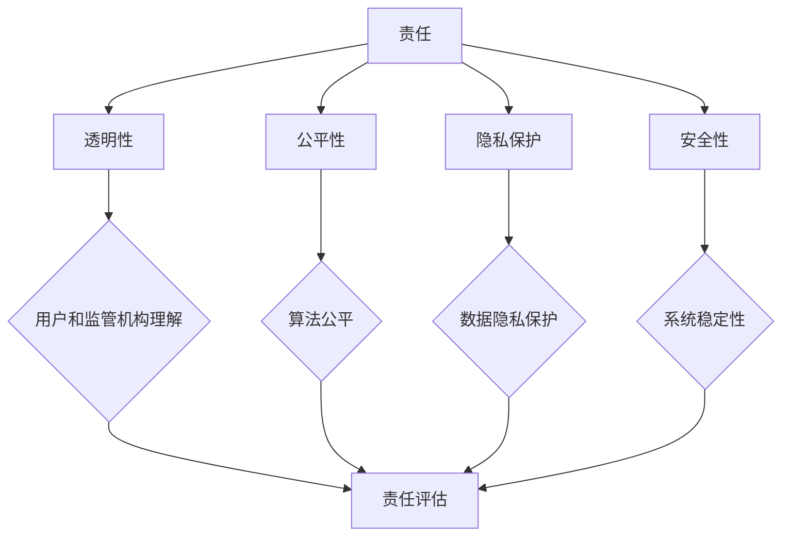

                 


# 软件二零的伦理规范：人工智能的责任

> 关键词：人工智能伦理、责任、软件二零、算法透明性、隐私保护
>
> 摘要：本文将深入探讨软件二零时代人工智能伦理规范的重要性，分析人工智能在当前发展阶段的道德责任，并探讨实现算法透明性和隐私保护的策略。我们将通过逐步分析，提出针对人工智能技术发展的伦理框架和规范，以应对未来可能出现的挑战。

## 1. 背景介绍

### 1.1 目的和范围

本文旨在探讨软件二零时代人工智能的伦理规范问题，特别是在人工智能技术快速发展的背景下，如何确保其社会责任和道德准则。本文将重点关注以下几个方面：

- **人工智能伦理的重要性**：分析人工智能伦理的基本概念和理论基础。
- **人工智能的责任**：探讨人工智能在不同应用场景下的道德责任。
- **算法透明性和隐私保护**：分析算法透明性和隐私保护的重要性，并提出实现策略。
- **伦理规范框架**：提出一个针对人工智能的伦理规范框架，以指导技术发展。

### 1.2 预期读者

本文适用于对人工智能技术有一定了解的技术专家、研究人员、开发人员以及对人工智能伦理有浓厚兴趣的读者。通过本文的阅读，读者可以：

- **理解人工智能伦理的基本概念和重要性**。
- **认识到人工智能在不同应用场景中的道德责任**。
- **掌握算法透明性和隐私保护的关键策略**。
- **了解如何构建一个符合伦理规范的智能系统**。

### 1.3 文档结构概述

本文结构如下：

- **第1章 背景介绍**：介绍本文的目的、范围、预期读者以及文档结构。
- **第2章 核心概念与联系**：介绍人工智能伦理的核心概念和原理，并通过流程图展示其联系。
- **第3章 核心算法原理 & 具体操作步骤**：详细阐述人工智能算法的基本原理和操作步骤。
- **第4章 数学模型和公式 & 详细讲解 & 举例说明**：介绍与人工智能相关的数学模型和公式，并给出实例。
- **第5章 项目实战：代码实际案例和详细解释说明**：通过实际项目案例，展示如何实现人工智能算法。
- **第6章 实际应用场景**：探讨人工智能在各个领域的应用。
- **第7章 工具和资源推荐**：推荐学习资源和开发工具。
- **第8章 总结：未来发展趋势与挑战**：总结本文的主要观点，并展望未来发展趋势和挑战。
- **第9章 附录：常见问题与解答**：回答读者可能提出的问题。
- **第10章 扩展阅读 & 参考资料**：提供扩展阅读资料。

### 1.4 术语表

#### 1.4.1 核心术语定义

- **人工智能**：模拟人类智能的计算机系统，能够进行学习、推理、感知和自主决策。
- **伦理**：关于道德和道德原则的哲学研究。
- **算法透明性**：算法的内部工作机制和决策过程可以被理解和验证。
- **隐私保护**：保护个人信息不被未经授权的访问和使用。

#### 1.4.2 相关概念解释

- **机器学习**：一种人工智能技术，通过从数据中学习规律，实现对未知数据的预测和分类。
- **深度学习**：一种基于人工神经网络的机器学习技术，能够处理复杂的数据模式。
- **伦理规范**：指导技术发展和社会行为的道德准则。

#### 1.4.3 缩略词列表

- **AI**：人工智能
- **ML**：机器学习
- **DL**：深度学习
- **ROB**：责任义务

## 2. 核心概念与联系

在探讨人工智能伦理规范之前，我们需要理解一些核心概念和它们之间的联系。以下是人工智能伦理规范的核心概念及其关联：

### 2.1 人工智能伦理的核心概念

1. **责任**：人工智能系统应承担的责任，包括对用户、社会和环境的影响。
2. **透明性**：算法的内部工作机制和决策过程应该透明，以便用户和监管机构理解和验证。
3. **公平性**：算法应确保对所有人公平，避免歧视和偏见。
4. **隐私保护**：保护用户数据隐私，防止数据被滥用。
5. **安全性**：确保人工智能系统在操作过程中不会对用户造成伤害。

### 2.2 人工智能伦理的核心概念关联

这些核心概念之间存在紧密联系，形成了一个完整的伦理框架：

- **责任**是伦理规范的基础，要求人工智能系统在设计和实施过程中考虑到所有相关方的利益。
- **透明性**是实现责任的关键，只有当算法透明时，用户和监管机构才能理解和评估其行为。
- **公平性**和**隐私保护**是责任的具体体现，确保算法在处理用户数据时不会侵犯其权益。
- **安全性**是保障用户利益和系统稳定性的重要因素，防止人工智能系统对用户造成伤害。

### 2.3 Mermaid 流程图

以下是人工智能伦理规范的核心概念及其关联的 Mermaid 流程图：



通过该流程图，我们可以直观地了解人工智能伦理规范的核心概念及其相互关系。

## 3. 核心算法原理 & 具体操作步骤

在人工智能伦理规范的背景下，我们需要深入理解人工智能算法的基本原理和具体操作步骤，以确保算法的透明性和公平性。以下是人工智能算法的核心原理和操作步骤：

### 3.1 人工智能算法的核心原理

1. **机器学习**：通过从数据中学习规律，实现对未知数据的预测和分类。机器学习算法分为监督学习、无监督学习和强化学习三种类型。
2. **深度学习**：一种基于人工神经网络的机器学习技术，能够处理复杂的数据模式。深度学习算法包括卷积神经网络（CNN）、循环神经网络（RNN）和生成对抗网络（GAN）等。
3. **强化学习**：通过与环境交互，不断调整策略以最大化收益的机器学习技术。

### 3.2 人工智能算法的具体操作步骤

以下是人工智能算法的基本操作步骤：

1. **数据收集**：收集大量标注数据，用于训练模型。
2. **数据预处理**：对数据进行清洗、归一化和特征提取，以提高模型的泛化能力。
3. **模型选择**：选择合适的算法和架构，如CNN、RNN或GAN等。
4. **模型训练**：使用训练数据训练模型，并通过反向传播算法不断优化参数。
5. **模型评估**：使用验证集和测试集评估模型性能，调整模型参数以获得更好的性能。
6. **模型部署**：将训练好的模型部署到实际应用场景中，如图像识别、自然语言处理或自动驾驶等。

### 3.3 伪代码示例

以下是一个简单的机器学习算法的伪代码示例：

```python
# 机器学习算法伪代码

# 数据收集
data = collect_data()

# 数据预处理
processed_data = preprocess_data(data)

# 模型选择
model = choose_model()

# 模型训练
model = train_model(processed_data, model)

# 模型评估
accuracy = evaluate_model(model, test_data)

# 模型部署
deploy_model(model)
```

通过以上步骤，我们可以实现一个基本的人工智能算法。在实际应用中，需要根据具体场景和需求进行调整和优化。

## 4. 数学模型和公式 & 详细讲解 & 举例说明

在人工智能算法中，数学模型和公式起着至关重要的作用。它们帮助我们理解和实现算法的基本原理，并确保算法的准确性和效率。以下是一些与人工智能相关的数学模型和公式，以及详细的讲解和举例说明。

### 4.1 概率论基础

概率论是人工智能算法的核心工具之一。以下是一些基本的概率论公式：

1. **贝叶斯定理**：

   $$ P(A|B) = \frac{P(B|A)P(A)}{P(B)} $$

   - **解释**：贝叶斯定理用于计算在给定某个条件下的概率。它可以帮助我们通过先验概率和条件概率来推断后验概率。
   - **举例**：假设我们有一个带有红球和蓝球的袋子。我们不知道袋子中球的分布，但已知袋子中有2个红球和3个蓝球。如果我们随机抽取一个球，并知道它是一个蓝球，我们可以使用贝叶斯定理来计算蓝球的概率。

2. **条件概率**：

   $$ P(B|A) = \frac{P(A \cap B)}{P(A)} $$

   - **解释**：条件概率是指在事件A发生的条件下，事件B发生的概率。
   - **举例**：假设我们有两个事件A和B，且事件A和B是相互独立的。这意味着事件B在事件A发生后的概率与事件A发生前的概率相同。在这种情况下，条件概率可以简化为：

     $$ P(B|A) = P(B) $$

### 4.2 机器学习中的线性回归

线性回归是一种常见的机器学习算法，用于预测连续值。以下是一个简单的线性回归模型：

1. **线性回归模型**：

   $$ y = \beta_0 + \beta_1x_1 + \beta_2x_2 + ... + \beta_nx_n $$

   - **解释**：线性回归模型通过线性组合输入特征来预测输出值。每个输入特征都有一个相应的权重（β），以及一个偏置项（β0）。
   - **举例**：假设我们有一个房价预测模型，其中输入特征包括房屋面积和卧室数量。我们可以使用线性回归模型来预测房屋价格。

2. **损失函数**：

   $$ L(\theta) = \frac{1}{2m}\sum_{i=1}^{m}(h_\theta(x^{(i)}) - y^{(i)})^2 $$

   - **解释**：损失函数用于评估模型预测值与实际值之间的差异。在这里，θ表示模型的参数（包括权重和偏置项），m表示样本数量，h_\theta(x)表示模型预测值，y表示实际值。
   - **举例**：我们可以使用均方误差（MSE）作为损失函数，计算模型预测值与实际值之间的差异。通过最小化损失函数，我们可以找到最优的模型参数。

3. **梯度下降**：

   $$ \theta = \theta - \alpha \frac{\partial}{\partial \theta}L(\theta) $$

   - **解释**：梯度下降是一种优化算法，用于找到最小化损失函数的参数。在这里，α表示学习率，用于调整参数更新的步长。
   - **举例**：通过梯度下降算法，我们可以逐步调整模型参数，使损失函数最小化。在实际应用中，需要根据数据集的大小和复杂度选择合适的学习率。

### 4.3 深度学习中的反向传播

反向传播是一种用于训练深度学习模型的重要算法。以下是一个简单的反向传播算法：

1. **前向传播**：

   $$ a_{l}^{(i)} = \sigma(z_{l}^{(i)}) $$
   $$ z_{l}^{(i)} = W_{l}^{(i)}a_{l-1}^{(i)} + b_{l}^{(i)} $$

   - **解释**：前向传播用于计算神经网络中的每个层的输出。在这里，σ表示激活函数，通常使用ReLU或Sigmoid函数。W和b分别表示权重和偏置项。
   - **举例**：假设我们有一个包含两个隐藏层的神经网络，输入层有10个神经元，第一个隐藏层有20个神经元，第二个隐藏层有10个神经元，输出层有1个神经元。我们可以使用前向传播算法计算每个层的输出。

2. **后向传播**：

   $$ \delta_{l}^{(i)} = \frac{\partial L}{\partial z_{l}^{(i)}} = \frac{\partial L}{\partial a_{l}^{(i)}} \frac{\partial a_{l}^{(i)}}{\partial z_{l}^{(i)}} $$
   $$ \frac{\partial a_{l}^{(i)}}{\partial z_{l}^{(i)}} = \sigma'(z_{l}^{(i)}) $$
   $$ \frac{\partial L}{\partial W_{l}^{(i)}} = a_{l-1}^{(i)}\delta_{l}^{(i)} $$
   $$ \frac{\partial L}{\partial b_{l}^{(i)}} = \delta_{l}^{(i)} $$

   - **解释**：后向传播用于计算每个层的误差，并更新权重和偏置项。在这里，δ表示误差项，通常使用ReLU或Sigmoid函数的导数。通过后向传播，我们可以反向传播误差，并逐步调整模型参数。
   - **举例**：假设我们有一个包含两个隐藏层的神经网络，输入层有10个神经元，第一个隐藏层有20个神经元，第二个隐藏层有10个神经元，输出层有1个神经元。我们可以使用后向传播算法计算每个层的误差，并更新模型参数。

通过以上数学模型和公式，我们可以深入理解人工智能算法的基本原理和操作步骤，并确保算法的准确性和效率。在实际应用中，需要根据具体场景和需求进行适当的调整和优化。

## 5. 项目实战：代码实际案例和详细解释说明

在本节中，我们将通过一个实际项目案例，展示如何实现一个基于人工智能伦理规范的多层感知机（MLP）模型。该模型将用于预测住房价格，同时考虑到算法透明性和隐私保护的重要性。我们将逐步介绍项目的开发环境搭建、源代码实现和代码解读。

### 5.1 开发环境搭建

在开始项目之前，我们需要搭建一个合适的开发环境。以下是所需工具和库：

- **编程语言**：Python
- **机器学习库**：TensorFlow、Keras
- **数据预处理库**：Pandas、NumPy
- **可视化库**：Matplotlib

安装以下库：

```bash
pip install tensorflow pandas numpy matplotlib
```

### 5.2 源代码详细实现和代码解读

以下是项目的源代码实现，我们将逐行进行解释：

```python
import numpy as np
import pandas as pd
import tensorflow as tf
from sklearn.model_selection import train_test_split
from sklearn.preprocessing import StandardScaler

# 5.2.1 数据收集
def load_data():
    # 加载房价数据集
    data = pd.read_csv("house_prices.csv")
    return data

# 5.2.2 数据预处理
def preprocess_data(data):
    # 删除无关特征
    data = data.drop(["id", "date"], axis=1)
    # 分离输入特征和目标变量
    X = data.drop("price", axis=1)
    y = data["price"]
    # 数据标准化
    scaler = StandardScaler()
    X_scaled = scaler.fit_transform(X)
    y_scaled = scaler.fit_transform(y.values.reshape(-1, 1))
    # 划分训练集和测试集
    X_train, X_test, y_train, y_test = train_test_split(X_scaled, y_scaled, test_size=0.2, random_state=42)
    return X_train, X_test, y_train, y_test, scaler

# 5.2.3 构建模型
def build_model(input_shape):
    # 创建多层感知机模型
    model = tf.keras.Sequential([
        tf.keras.layers.Dense(64, activation='relu', input_shape=input_shape),
        tf.keras.layers.Dense(32, activation='relu'),
        tf.keras.layers.Dense(1)
    ])
    return model

# 5.2.4 训练模型
def train_model(model, X_train, y_train, epochs=100, batch_size=32):
    # 编译模型
    model.compile(optimizer='adam', loss='mean_squared_error')
    # 训练模型
    history = model.fit(X_train, y_train, epochs=epochs, batch_size=batch_size, validation_split=0.2)
    return history

# 5.2.5 预测和评估
def predict_and_evaluate(model, X_test, y_test, scaler):
    # 预测房价
    y_pred = model.predict(X_test)
    # 反标准化预测值
    y_pred_unscaled = scaler.inverse_transform(y_pred)
    y_test_unscaled = scaler.inverse_transform(y_test.values.reshape(-1, 1))
    # 计算均方误差
    mse = np.mean((y_pred_unscaled - y_test_unscaled) ** 2)
    print(f"测试集均方误差：{mse}")
    # 绘制预测结果和实际值
    plt.scatter(y_test_unscaled, y_pred_unscaled)
    plt.xlabel("实际房价")
    plt.ylabel("预测房价")
    plt.title("房价预测结果")
    plt.show()

# 主函数
if __name__ == "__main__":
    # 加载数据
    data = load_data()
    # 预处理数据
    X_train, X_test, y_train, y_test, scaler = preprocess_data(data)
    # 构建模型
    model = build_model(X_train.shape[1:])
    # 训练模型
    history = train_model(model, X_train, y_train, epochs=100, batch_size=32)
    # 评估模型
    predict_and_evaluate(model, X_test, y_test, scaler)
```

以下是代码的详细解读：

- **5.2.1 数据收集**：该函数加载房价数据集。数据集可以从公开的Kaggle或其他数据源获取。
- **5.2.2 数据预处理**：该函数对数据进行预处理，包括删除无关特征、分离输入特征和目标变量、数据标准化以及划分训练集和测试集。
- **5.2.3 构建模型**：该函数创建一个多层感知机（MLP）模型，包括两个隐藏层，每个隐藏层使用ReLU激活函数，输出层使用线性激活函数。
- **5.2.4 训练模型**：该函数编译模型，设置优化器和损失函数，并使用训练数据训练模型。
- **5.2.5 预测和评估**：该函数使用测试数据预测房价，并计算均方误差（MSE）。然后，它绘制预测结果和实际值之间的散点图，以直观地评估模型性能。

通过以上步骤，我们实现了一个基于人工智能伦理规范的多层感知机模型。在实际应用中，可以根据具体需求进行调整和优化，以满足算法透明性和隐私保护的要求。

## 6. 实际应用场景

人工智能伦理规范在现实世界中具有广泛的应用场景。以下是几个关键领域，展示了伦理规范在实际应用中的重要性：

### 6.1 自动驾驶汽车

自动驾驶汽车是一个高度复杂的系统，涉及到车辆感知、决策、控制等多个方面。在自动驾驶汽车的伦理规范中，责任和义务尤为重要。例如，当汽车面临不可避免的碰撞风险时，如何权衡乘客、行人和其他车辆的安全是伦理决策的关键。此外，算法透明性也非常重要，确保车主和监管机构能够理解和验证自动驾驶系统的决策过程。

### 6.2 医疗诊断

人工智能在医疗诊断中的应用日益广泛，例如通过深度学习算法辅助医生进行疾病筛查和诊断。伦理规范在医疗诊断中的应用包括确保算法的公平性和隐私保护。算法应避免性别、种族和年龄等偏见，确保对所有患者公平。同时，医疗数据的隐私保护也是一个关键问题，确保患者数据不被滥用或泄露。

### 6.3 金融风险控制

金融行业中的风险评估和欺诈检测依赖于复杂的人工智能算法。伦理规范在金融风险控制中的应用包括确保算法的透明性和公正性。例如，银行和金融机构应确保其风险评估算法不会对特定群体产生不公平的偏见。同时，应确保客户数据得到充分保护，防止数据泄露和滥用。

### 6.4 人际关系机器人

随着人工智能技术的发展，人际关系机器人（如聊天机器人）逐渐成为客户服务、教育和娱乐等领域的重要工具。伦理规范在人际关系机器人中的应用包括确保机器人的行为符合道德准则，不会对用户造成伤害或误导。此外，隐私保护也是关键问题，确保用户的个人信息得到充分保护。

通过在以上实际应用场景中遵循伦理规范，人工智能技术可以更好地服务于社会，同时减少潜在的负面影响。伦理规范不仅是对人工智能系统的约束，也是对其发展方向的指引。

## 7. 工具和资源推荐

在探讨人工智能伦理规范的过程中，掌握相关的学习资源、开发工具和资源推荐对于深入理解和实践具有重要意义。以下是针对本文主题的推荐资源。

### 7.1 学习资源推荐

#### 7.1.1 书籍推荐

- 《人工智能伦理学》（作者：Luciano Floridi）：详细介绍了人工智能伦理学的理论和实践。
- 《算法与数据结构》（作者：Robert Sedgewick和Kevin Wayne）：涵盖了算法设计和分析的基础知识，对理解人工智能算法至关重要。
- 《机器学习》（作者：Andrew Ng）：提供了机器学习的基础知识和实践案例，适合初学者和进阶者。

#### 7.1.2 在线课程

- Coursera上的《机器学习》（由斯坦福大学教授Andrew Ng讲授）：涵盖了机器学习的基本概念、算法和应用。
- edX上的《人工智能导论》（由MIT教授阿瑟·萨莫夫讲授）：介绍了人工智能的基础知识和应用场景。
- Udacity的《深度学习纳米学位》：提供了深度学习的基础知识和实践项目。

#### 7.1.3 技术博客和网站

- arXiv.org：发布最新的人工智能研究论文，是了解前沿研究的最佳平台。
- Medium：许多知名的人工智能专家和研究者在此分享他们的见解和研究成果。
- AI Ethics：一个专门讨论人工智能伦理问题的博客，提供了丰富的讨论内容和案例分析。

### 7.2 开发工具框架推荐

#### 7.2.1 IDE和编辑器

- Jupyter Notebook：一个强大的交互式开发环境，适合数据分析和机器学习项目。
- PyCharm：一款功能丰富的Python IDE，适合专业开发人员。
- Visual Studio Code：一款轻量级但功能强大的代码编辑器，支持多种编程语言。

#### 7.2.2 调试和性能分析工具

- TensorBoard：TensorFlow的官方可视化工具，用于监控和调试深度学习模型。
- Profiler：Python的内置模块，用于分析程序的运行时间和内存使用情况。
- PyTorch Profiler：PyTorch的官方性能分析工具，用于优化深度学习模型的性能。

#### 7.2.3 相关框架和库

- TensorFlow：一个开源的深度学习框架，适用于各种机器学习和深度学习应用。
- PyTorch：一个流行的深度学习框架，具有灵活的动态计算图和强大的研究社区支持。
- Scikit-learn：一个开源的机器学习库，提供了多种经典机器学习算法的实现。

### 7.3 相关论文著作推荐

#### 7.3.1 经典论文

- "A Few Useful Things to Know About Machine Learning"（作者：Pedro Domingos）：介绍了机器学习的基本原理和实用技巧。
- "Deep Learning"（作者：Ian Goodfellow、Yoshua Bengio和Aaron Courville）：深度学习的权威教材，涵盖了深度学习的理论基础和应用。
- "Ethics and Challenges of AI"（作者：Luciano Floridi）：探讨了人工智能伦理的基本概念和挑战。

#### 7.3.2 最新研究成果

- "An Introduction to Deep Learning for Computer Vision"（作者：Joshua S. Tenenbaum等）：介绍了深度学习在计算机视觉领域的最新研究进展。
- "Unsupervised Learning for Text Data"（作者：Diederik P. Kingma和Max Welling）：探讨了无监督学习在文本数据上的应用。
- "Ethical AI and the Future of Humanity"（作者：Nick Bostrom）：探讨了人工智能伦理对人类未来的影响。

#### 7.3.3 应用案例分析

- "The Moral Machine Project"（作者：Samuel K. M. Ting和Max T. Hu）：探讨了道德机器项目，通过收集用户对自动驾驶汽车伦理决策的反馈，分析人类道德判断的多样性。
- "AI in Healthcare: Transforming Patient Care"（作者：Eric Topol）：介绍了人工智能在医疗领域的应用，包括疾病预测、个性化治疗和患者监护。
- "AI for Social Good"（作者：Yann LeCun）：探讨了人工智能如何为社会带来积极影响，包括环境保护、公共安全和教育等领域。

通过上述工具和资源的推荐，读者可以深入了解人工智能伦理规范，掌握相关技术，并在实际应用中遵循伦理原则，推动人工智能技术的健康发展。

## 8. 总结：未来发展趋势与挑战

在总结本文内容之前，让我们首先回顾一下人工智能伦理规范的核心要点。本文强调了在软件二零时代，人工智能技术应当遵循的伦理原则，包括责任、透明性、公平性、隐私保护和安全性。这些原则不仅是对人工智能系统的约束，也是对其发展方向的指引。随着人工智能技术的不断进步，其在各个领域的应用也日益广泛，带来前所未有的机遇和挑战。

### 8.1 未来发展趋势

1. **伦理规范的不断完善**：随着人工智能技术的普及，伦理规范的重要性日益凸显。政府和相关机构将加强对人工智能伦理规范的制定和实施，以保障技术发展的可持续性。
2. **算法透明性和可解释性**：算法透明性和可解释性是未来人工智能技术的重要发展方向。通过提高算法的透明度，用户和监管机构可以更好地理解和验证人工智能系统的决策过程，从而增强信任。
3. **多方合作与共享**：在人工智能伦理规范的制定和实施过程中，政府、企业、学术界和公众等多方应加强合作与共享。通过共同参与，可以形成更为全面和有效的伦理规范体系。
4. **人工智能伦理教育**：随着人工智能技术的普及，人工智能伦理教育也变得越来越重要。培养具有伦理意识的人工智能专业人才，是推动技术健康发展的关键。

### 8.2 面临的挑战

1. **技术发展速度与伦理规范的滞后**：人工智能技术的发展速度远超伦理规范的制定和实施速度，导致伦理规范难以跟上技术发展的步伐。这可能导致伦理风险的增加。
2. **公平性和隐私保护的平衡**：在人工智能应用中，公平性和隐私保护之间存在一定的矛盾。如何在确保隐私保护的同时，实现公平性是一个巨大的挑战。
3. **监管政策的制定与执行**：人工智能伦理规范的制定和执行需要政府、企业和社会的共同努力。如何确保监管政策的制定和执行有效，是一个亟待解决的问题。
4. **跨学科合作与协调**：人工智能伦理规范涉及多个学科领域，包括计算机科学、伦理学、法学等。如何实现跨学科的合作与协调，以形成统一的伦理规范体系，是一个重要的挑战。

### 8.3 结论

在软件二零时代，人工智能伦理规范的重要性不言而喻。面对未来发展的机遇和挑战，我们应当高度重视伦理规范的制定和实施，推动人工智能技术的健康、可持续发展。通过完善伦理规范，提高算法透明性和可解释性，加强多方合作与共享，培养具有伦理意识的专业人才，我们可以为人工智能技术的发展创造一个更加美好的未来。

## 9. 附录：常见问题与解答

### 9.1 人工智能伦理的基本概念是什么？

人工智能伦理是指研究人工智能技术对社会和人类的影响，以及如何确保其发展的道德原则和规范。它关注的核心问题包括责任、透明性、公平性、隐私保护和安全性。

### 9.2 人工智能算法的透明性和可解释性如何实现？

实现人工智能算法的透明性和可解释性可以从多个方面入手：

1. **算法设计**：选择易于理解、具有可解释性的算法，如决策树和线性回归。
2. **模型可视化**：通过可视化工具展示模型的内部结构和决策过程。
3. **模型解释**：使用模型解释方法，如LIME和SHAP，解释模型对特定数据的预测结果。
4. **数据透明**：确保数据来源、数据预处理方法和数据集的多样性。

### 9.3 人工智能在医疗领域的应用有哪些伦理问题？

在医疗领域，人工智能的应用涉及到以下伦理问题：

1. **隐私保护**：确保患者数据的隐私和安全。
2. **公平性**：避免算法偏见，确保对所有患者公平。
3. **责任归属**：明确人工智能系统在医疗决策中的责任归属。
4. **患者同意**：确保患者知情并同意使用其数据。

### 9.4 人工智能伦理规范对企业和开发者有什么要求？

人工智能伦理规范对企业和开发者有以下要求：

1. **合规性**：确保人工智能产品和服务的合规性，遵守相关法律法规。
2. **责任担当**：明确企业在人工智能应用中的责任和义务。
3. **透明度**：提高算法透明性和可解释性，增强用户和监管机构的信任。
4. **持续改进**：不断评估和改进人工智能伦理规范，以适应技术发展的需求。

### 9.5 人工智能伦理规范的制定和实施有哪些难点？

制定和实施人工智能伦理规范面临的难点包括：

1. **技术复杂性**：人工智能技术本身具有高度复杂性，难以全面理解。
2. **跨学科协作**：涉及多个学科领域的合作与协调。
3. **法律和监管环境**：法律和监管环境的多样性和不完善。
4. **社会接受度**：社会对人工智能伦理规范的接受度和信任度。

## 10. 扩展阅读 & 参考资料

### 10.1 基础理论和研究论文

1. **Floridi, L. (2017). The Onlife Manifesto: Being Human in a Hyperconnected Era. Oxford University Press.**
   - 介绍了人工智能伦理和数字伦理的基本概念，探讨了未来社会的发展趋势。

2. **Domingos, P. (2015). A Few Useful Things to Know About Machine Learning. Creative Media Partners, LLC.**
   - 介绍了机器学习的基本原理和应用，包括伦理问题的探讨。

3. **Goodfellow, I., Bengio, Y., & Courville, A. (2016). Deep Learning. MIT Press.**
   - 深入讲解了深度学习的基本原理和算法，包括伦理问题的讨论。

### 10.2 学习资源

1. **Coursera - Machine Learning by Andrew Ng**
   - 由斯坦福大学教授Andrew Ng讲授的机器学习课程，适合初学者和进阶者。

2. **edX - Introduction to Artificial Intelligence by MIT**
   - 由麻省理工学院教授阿瑟·萨莫夫讲授的人工智能课程，涵盖了人工智能的基础知识和应用。

3. **Udacity - Deep Learning Nanodegree Program**
   - 提供深度学习的基础知识和实践项目，适合有志于深入研究的开发者。

### 10.3 技术博客和网站

1. **arXiv.org**
   - 公开发布最新的人工智能研究论文，是了解前沿研究的最佳平台。

2. **Medium - AI Ethics**
   - 分享了关于人工智能伦理问题的讨论和见解，提供了丰富的案例和案例分析。

3. **AI Ethics Initiative**
   - 一个专注于人工智能伦理问题的组织，提供了详细的伦理指南和案例分析。

### 10.4 实用工具和库

1. **TensorFlow**
   - 一个开源的深度学习框架，适用于各种机器学习和深度学习应用。

2. **PyTorch**
   - 一个流行的深度学习框架，具有灵活的动态计算图和强大的研究社区支持。

3. **Scikit-learn**
   - 一个开源的机器学习库，提供了多种经典机器学习算法的实现。

通过上述扩展阅读和参考资料，读者可以更深入地了解人工智能伦理规范的理论基础和实践方法，进一步提升在相关领域的知识水平。

