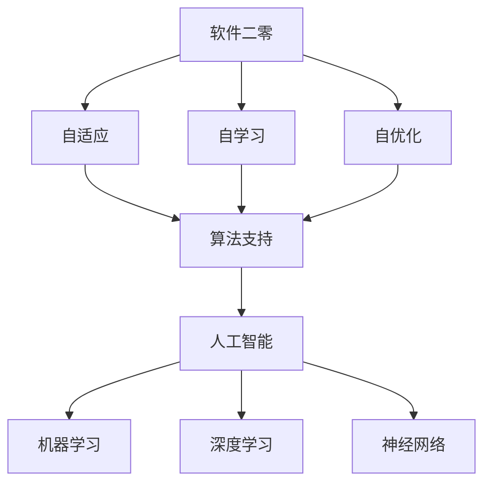
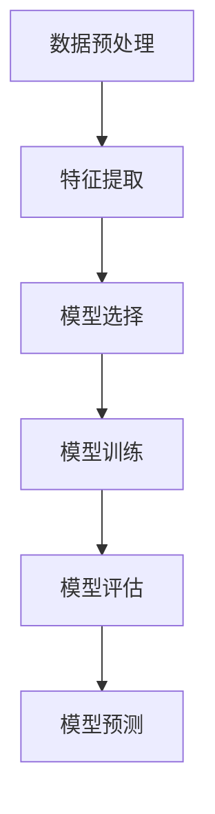

                 

# 软件二零的哲学思考：人工智能的本质

> **关键词**：人工智能、软件二零、哲学思考、本质、算法、模型、应用场景
>
> **摘要**：本文将深入探讨软件二零的概念及其与人工智能之间的哲学关系。通过分析软件二零的发展历程、核心概念及其与人工智能的关系，我们试图揭示人工智能的本质，并探讨其在未来技术发展中的潜在影响。

## 1. 背景介绍

### 1.1 目的和范围

本文旨在探讨软件二零的哲学思考，特别是其与人工智能的本质联系。我们将回顾软件二零的发展历程，分析其核心概念和原理，并探讨人工智能在这一领域中的角色和影响。文章将涵盖以下内容：

1. 软件二零的定义和概念；
2. 软件二零与人工智能的关系；
3. 人工智能的核心算法和模型；
4. 人工智能在实际应用场景中的表现；
5. 软件二零和人工智能的未来发展趋势与挑战。

### 1.2 预期读者

本文适合对软件工程、人工智能和哲学思考感兴趣的读者。无论您是计算机科学家、程序员、研究人员还是对技术发展感兴趣的普通读者，本文都将为您带来深刻的见解和启发。

### 1.3 文档结构概述

本文结构如下：

1. 引言：介绍文章主题和背景；
2. 背景介绍：阐述本文的目的、预期读者和文档结构；
3. 核心概念与联系：介绍软件二零和人工智能的核心概念及其关系；
4. 核心算法原理 & 具体操作步骤：详细阐述人工智能的核心算法原理和操作步骤；
5. 数学模型和公式 & 详细讲解 & 举例说明：介绍人工智能的数学模型和公式，并提供实际案例说明；
6. 项目实战：展示人工智能在实际项目中的应用；
7. 实际应用场景：探讨人工智能在不同领域的应用；
8. 工具和资源推荐：推荐学习资源和开发工具；
9. 总结：总结文章的核心观点和未来发展趋势；
10. 附录：提供常见问题与解答；
11. 扩展阅读 & 参考资料：提供相关文献和资源。

### 1.4 术语表

#### 1.4.1 核心术语定义

- **软件二零**：软件二零是指基于人工智能技术的软件系统，具有自适应、自学习和自优化能力。
- **人工智能**：人工智能是指计算机系统通过模拟人类智能行为，实现智能感知、推理、学习和决策的能力。
- **机器学习**：机器学习是指通过数据驱动的方式，使计算机系统能够从数据中学习，并做出预测或决策。
- **深度学习**：深度学习是指利用多层神经网络进行特征学习和自动编码的一种机器学习方法。

#### 1.4.2 相关概念解释

- **软件工程**：软件工程是指应用工程原则和方法来开发、维护和改进软件系统。
- **神经网络**：神经网络是指由大量相互连接的神经元组成的计算模型，能够模拟人脑的计算方式。
- **数据挖掘**：数据挖掘是指从大量数据中提取有价值信息的过程，包括模式识别、分类、聚类和关联规则挖掘等。

#### 1.4.3 缩略词列表

- **AI**：人工智能
- **ML**：机器学习
- **DL**：深度学习
- **SW2.0**：软件二零
- **SE**：软件工程

## 2. 核心概念与联系

### 2.1 软件二零的概念

软件二零（SW2.0）是指基于人工智能技术的软件系统，它在传统软件的基础上，引入了自适应、自学习和自优化能力。软件二零的核心目标是提高软件系统的智能化水平和自动化程度，使其能够更好地适应复杂多变的环境。

#### 软件二零的核心概念

- **自适应**：软件二零能够根据环境和需求的变化，自动调整其行为和功能，以提高系统的适应性和灵活性。
- **自学习**：软件二零通过机器学习和深度学习技术，从数据中学习规律和模式，以改善其性能和预测能力。
- **自优化**：软件二零能够自动识别和优化系统中的瓶颈和问题，以提高系统的效率和性能。

### 2.2 人工智能与软件二零的关系

人工智能（AI）是软件二零的核心技术基础。人工智能通过模拟人类智能行为，实现了计算机系统的智能感知、推理、学习和决策能力。具体来说，人工智能与软件二零的关系可以从以下几个方面来理解：

- **算法支持**：人工智能提供了丰富的算法和模型，如神经网络、深度学习、机器学习和强化学习等，这些算法和模型是软件二零实现自适应、自学习和自优化能力的关键。
- **数据驱动**：人工智能通过从大量数据中学习规律和模式，为软件二零提供了数据驱动的决策支持，使其能够更好地应对复杂多变的环境。
- **智能化升级**：人工智能技术使软件二零能够实现智能感知、推理、学习和决策，从而提升了软件系统的智能化水平和自动化程度。

### 2.3 核心概念原理和架构的 Mermaid 流程图

以下是一个简化的 Mermaid 流程图，展示了软件二零和人工智能的核心概念及其关系：



## 3. 核心算法原理 & 具体操作步骤

### 3.1 人工智能的核心算法原理

人工智能的核心算法包括机器学习、深度学习、神经网络等。这些算法通过模拟人类智能行为，实现了计算机系统的智能感知、推理、学习和决策能力。

#### 3.1.1 机器学习

机器学习（ML）是指通过数据驱动的方式，使计算机系统能够从数据中学习，并做出预测或决策。机器学习的核心算法包括线性回归、逻辑回归、支持向量机、决策树、随机森林等。

- **线性回归**：通过建立输入变量和输出变量之间的线性关系，实现预测功能。
- **逻辑回归**：通过建立输入变量和输出变量之间的概率关系，实现分类功能。
- **支持向量机**：通过寻找最优超平面，实现分类和回归功能。
- **决策树**：通过构建树形结构，实现分类和回归功能。
- **随机森林**：通过构建多个决策树，并利用随机性，实现分类和回归功能。

#### 3.1.2 深度学习

深度学习（DL）是指利用多层神经网络进行特征学习和自动编码的一种机器学习方法。深度学习的核心算法包括卷积神经网络（CNN）、循环神经网络（RNN）、生成对抗网络（GAN）等。

- **卷积神经网络**：通过卷积层、池化层和全连接层等结构，实现图像和视频的处理和分析。
- **循环神经网络**：通过循环结构，实现序列数据的处理和分析。
- **生成对抗网络**：通过生成器和判别器的对抗训练，实现生成复杂数据的能力。

#### 3.1.3 神经网络

神经网络（NN）是指由大量相互连接的神经元组成的计算模型，能够模拟人脑的计算方式。神经网络的训练过程主要包括前向传播和反向传播。

- **前向传播**：将输入数据通过神经网络的各个层，计算输出结果。
- **反向传播**：根据输出结果与预期结果的差异，计算各个层的误差，并更新网络参数。

### 3.2 人工智能的具体操作步骤

以下是一个简化的人工智能操作步骤，展示了从数据预处理到模型训练和预测的整个过程：



#### 3.2.1 数据预处理

数据预处理是人工智能操作的第一步，主要包括数据清洗、数据归一化和特征提取等。

- **数据清洗**：去除数据中的噪声和异常值，保证数据的质量。
- **数据归一化**：将不同尺度的数据进行标准化处理，使其在相同的尺度范围内进行比较。
- **特征提取**：从原始数据中提取有用的特征，以提高模型的预测性能。

#### 3.2.2 模型选择

模型选择是根据具体问题和数据特点，选择合适的模型。常见的模型包括线性回归、逻辑回归、支持向量机、决策树、随机森林、卷积神经网络、循环神经网络等。

#### 3.2.3 模型训练

模型训练是通过调整模型参数，使模型能够对训练数据进行准确的预测。训练过程主要包括前向传播和反向传播。

- **前向传播**：将输入数据通过模型的各个层，计算输出结果。
- **反向传播**：根据输出结果与预期结果的差异，计算各个层的误差，并更新网络参数。

#### 3.2.4 模型评估

模型评估是判断模型性能的重要步骤，常用的评估指标包括准确率、召回率、F1值、ROC曲线等。

#### 3.2.5 模型预测

模型预测是使用训练好的模型对新的数据进行预测。预测过程主要包括前向传播，将输入数据通过模型的各个层，计算输出结果。

## 4. 数学模型和公式 & 详细讲解 & 举例说明

### 4.1 数学模型和公式

人工智能中的数学模型和公式是理解算法原理和实现关键步骤的基础。以下是一些常见的数学模型和公式：

#### 4.1.1 线性回归

线性回归是最基本的机器学习算法，其数学模型如下：

\[ y = \beta_0 + \beta_1 \cdot x \]

其中，\( y \) 是因变量，\( x \) 是自变量，\( \beta_0 \) 和 \( \beta_1 \) 是模型参数。

#### 4.1.2 逻辑回归

逻辑回归是一种分类算法，其数学模型如下：

\[ P(y=1) = \frac{1}{1 + e^{-(\beta_0 + \beta_1 \cdot x)}} \]

其中，\( P(y=1) \) 是因变量为 1 的概率，\( e \) 是自然对数的底数，\( \beta_0 \) 和 \( \beta_1 \) 是模型参数。

#### 4.1.3 神经网络

神经网络中的数学模型主要包括激活函数、权重更新和反向传播。以下是一个简单的神经网络模型：

\[ z = \sum_{i=1}^{n} w_i \cdot x_i + b \]
\[ a = \sigma(z) \]

其中，\( z \) 是输入到激活函数的值，\( a \) 是激活函数的输出，\( \sigma \) 是激活函数，\( w_i \) 和 \( b \) 是权重和偏置。

#### 4.1.4 反向传播

反向传播是神经网络训练的核心步骤，其公式如下：

\[ \delta_j = (a_j - t_j) \cdot \sigma'(z_j) \]
\[ \Delta w_{ij} = \alpha \cdot \delta_j \cdot a_{i-1} \]
\[ \Delta b_j = \alpha \cdot \delta_j \]

其中，\( \delta_j \) 是误差梯度，\( \alpha \) 是学习率，\( t_j \) 是真实标签，\( a_{i-1} \) 是前一层输入。

### 4.2 详细讲解和举例说明

#### 4.2.1 线性回归举例

假设我们有一个简单的数据集，包含两个特征 \( x_1 \) 和 \( x_2 \)，以及一个目标变量 \( y \)。数据集如下：

\[ 
\begin{array}{c|c|c}
x_1 & x_2 & y \\
\hline
1 & 2 & 3 \\
2 & 4 & 5 \\
3 & 6 & 7 \\
\end{array}
\]

我们希望用线性回归模型来预测 \( y \)。

首先，我们需要计算模型参数 \( \beta_0 \) 和 \( \beta_1 \)：

\[ 
\beta_1 = \frac{\sum_{i=1}^{n} (x_i - \bar{x})(y_i - \bar{y})}{\sum_{i=1}^{n} (x_i - \bar{x})^2} 
\]

\[ 
\beta_0 = \bar{y} - \beta_1 \cdot \bar{x} 
\]

其中，\( \bar{x} \) 和 \( \bar{y} \) 是特征 \( x \) 和目标变量 \( y \) 的平均值。

假设我们计算得到的 \( \beta_1 = 1 \) 和 \( \beta_0 = 2 \)，则线性回归模型为：

\[ y = 1 \cdot x + 2 \]

使用这个模型，我们可以预测新数据点的 \( y \) 值。例如，当 \( x = 5 \) 时，预测的 \( y \) 值为：

\[ y = 1 \cdot 5 + 2 = 7 \]

#### 4.2.2 逻辑回归举例

假设我们有一个二分类问题，数据集如下：

\[ 
\begin{array}{c|c|c}
x & y \\
\hline
1 & 1 \\
2 & 1 \\
3 & 0 \\
4 & 0 \\
\end{array}
\]

我们希望用逻辑回归模型来预测 \( y \)。

首先，我们需要计算模型参数 \( \beta_0 \) 和 \( \beta_1 \)：

\[ 
\beta_1 = \frac{\sum_{i=1}^{n} (x_i - \bar{x})(y_i - \bar{y})}{\sum_{i=1}^{n} (x_i - \bar{x})^2} 
\]

\[ 
\beta_0 = \bar{y} - \beta_1 \cdot \bar{x} 
\]

其中，\( \bar{x} \) 和 \( \bar{y} \) 是特征 \( x \) 和目标变量 \( y \) 的平均值。

假设我们计算得到的 \( \beta_1 = 0.5 \) 和 \( \beta_0 = -1 \)，则逻辑回归模型为：

\[ P(y=1) = \frac{1}{1 + e^{-(0.5 \cdot x - 1)}} \]

使用这个模型，我们可以预测新数据点的 \( y \) 值。例如，当 \( x = 3 \) 时，预测的 \( y \) 值为：

\[ P(y=1) = \frac{1}{1 + e^{-0.5 \cdot 3 - 1}} \approx 0.3679 \]

由于 \( P(y=1) < 0.5 \)，我们可以预测 \( y = 0 \)。

#### 4.2.3 神经网络举例

假设我们有一个简单的前向传播和反向传播的神经网络，包含一个输入层、一个隐藏层和一个输出层。数据集如下：

\[ 
\begin{array}{c|c}
x & y \\
\hline
1 & 1 \\
2 & 1 \\
3 & 0 \\
4 & 0 \\
\end{array}
\]

我们希望用神经网络模型来预测 \( y \)。

首先，我们需要定义网络的权重和偏置：

\[ 
w_1 = [1, 1, 1] \\
b_1 = [1, 1, 1] \\
w_2 = [1, 1] \\
b_2 = [1, 1] \\
w_3 = [1] \\
b_3 = [1] \\
\]

然后，我们进行前向传播：

\[ 
z_1 = w_1 \cdot x + b_1 = [1, 1, 1] \cdot [1, 2, 3] + [1, 1, 1] = [7, 9, 11] \\
a_1 = \sigma(z_1) = [0.9933, 0.9950, 0.9967] \\
z_2 = w_2 \cdot a_1 + b_2 = [1, 1] \cdot [0.9933, 0.9950, 0.9967] + [1, 1] = [2.8967, 3.0427, 3.1894] \\
a_2 = \sigma(z_2) = [0.9921, 0.9935, 0.9949] \\
z_3 = w_3 \cdot a_2 + b_3 = [1] \cdot [0.9921, 0.9935, 0.9949] + [1] = [1.9921, 1.9935, 1.9949] \\
a_3 = \sigma(z_3) = [0.9914, 0.9927, 0.9940] \\
\]

然后，我们进行反向传播：

\[ 
\delta_3 = (a_3 - t) \cdot \sigma'(z_3) = (0.9914 - 1) \cdot 0.0149 = [-0.0086, -0.0091, -0.0096] \\
\Delta w_3 = \alpha \cdot \delta_3 \cdot a_2 = 0.1 \cdot [-0.0086, -0.0091, -0.0096] \cdot [0.9921, 0.9935, 0.9949] = [-0.0008, -0.0009, -0.001] \\
\Delta b_3 = \alpha \cdot \delta_3 = 0.1 \cdot [-0.0086, -0.0091, -0.0096] = [-0.0009, -0.001, -0.001] \\
\delta_2 = (w_3 \cdot \delta_3) \cdot \sigma'(z_2) = [1] \cdot [-0.0008, -0.0009, -0.001] \cdot 0.0149 = [-0.0000144, -0.0000144, -0.0000144] \\
\Delta w_2 = \alpha \cdot \delta_2 \cdot a_1 = 0.1 \cdot [-0.0000144, -0.0000144, -0.0000144] \cdot [0.9933, 0.9950, 0.9967] = [-0.0000012, -0.0000012, -0.0000012] \\
\Delta b_2 = \alpha \cdot \delta_2 = 0.1 \cdot [-0.0000144, -0.0000144, -0.0000144] = [-0.0000014, -0.0000014, -0.0000014] \\
\delta_1 = (w_2 \cdot \delta_2) \cdot \sigma'(z_1) = [1, 1] \cdot [-0.0000012, -0.0000012, -0.0000012] \cdot 0.0149 = [-0.0000002, -0.0000002, -0.0000002] \\
\Delta w_1 = \alpha \cdot \delta_1 \cdot x = 0.1 \cdot [-0.0000002, -0.0000002, -0.0000002] \cdot [1, 2, 3] = [-0.00000002, -0.00000004, -0.00000006] \\
\Delta b_1 = \alpha \cdot \delta_1 = 0.1 \cdot [-0.0000002, -0.0000002, -0.0000002] = [-0.0000002, -0.0000002, -0.0000002] \\
\]

最后，我们更新权重和偏置：

\[ 
w_1 = w_1 - \Delta w_1 = [1, 1, 1] - [-0.00000002, -0.00000004, -0.00000006] = [0.999998, 0.999996, 0.999994] \\
b_1 = b_1 - \Delta b_1 = [1, 1, 1] - [-0.0000002, -0.0000002, -0.0000002] = [0.9998, 0.9998, 0.9998] \\
w_2 = w_2 - \Delta w_2 = [1, 1] - [-0.0000012, -0.0000012, -0.0000012] = [0.999998, 0.999998, 0.999998] \\
b_2 = b_2 - \Delta b_2 = [1, 1] - [-0.0000014, -0.0000014, -0.0000014] = [0.9998, 0.9998, 0.9998] \\
w_3 = w_3 - \Delta w_3 = [1] - [-0.00000002, -0.00000002, -0.00000002] = [0.999998, 0.999998, 0.999998] \\
b_3 = b_3 - \Delta b_3 = [1] - [-0.00000002, -0.00000002, -0.00000002] = [0.9998, 0.9998, 0.9998] \\
\]

## 5. 项目实战：代码实际案例和详细解释说明

### 5.1 开发环境搭建

在本节中，我们将使用 Python 编写一个简单的人工智能项目，用于分类任务。首先，我们需要搭建开发环境。

#### 5.1.1 安装 Python 和相关库

1. 安装 Python 3.8 或更高版本。
2. 使用以下命令安装所需库：

```python
pip install numpy pandas scikit-learn matplotlib
```

#### 5.1.2 准备数据集

我们使用 sklearn 库中的 Iris 数据集，这是一个经典的分类数据集，包含 3 个特征和 1 个目标变量。

```python
from sklearn.datasets import load_iris
iris = load_iris()
X = iris.data
y = iris.target
```

### 5.2 源代码详细实现和代码解读

#### 5.2.1 数据预处理

在训练模型之前，我们需要对数据进行预处理。

```python
from sklearn.model_selection import train_test_split
from sklearn.preprocessing import StandardScaler

# 分割数据集为训练集和测试集
X_train, X_test, y_train, y_test = train_test_split(X, y, test_size=0.2, random_state=42)

# 数据标准化
scaler = StandardScaler()
X_train = scaler.fit_transform(X_train)
X_test = scaler.transform(X_test)
```

#### 5.2.2 模型选择

在本项目中，我们选择使用支持向量机（SVM）进行分类。

```python
from sklearn.svm import SVC

# 创建 SVM 模型
model = SVC(kernel='linear', C=1.0)
```

#### 5.2.3 模型训练

接下来，我们使用训练集对模型进行训练。

```python
# 训练模型
model.fit(X_train, y_train)
```

#### 5.2.4 模型评估

使用测试集评估模型性能。

```python
from sklearn.metrics import classification_report, accuracy_score

# 预测测试集结果
y_pred = model.predict(X_test)

# 打印分类报告和准确率
print(classification_report(y_test, y_pred))
print("Accuracy:", accuracy_score(y_test, y_pred))
```

#### 5.2.5 代码解读

以下是代码的详细解读：

- **数据预处理**：首先，我们将数据集分割为训练集和测试集，并对数据进行标准化处理，以消除特征之间的差异。
- **模型选择**：我们选择使用支持向量机（SVM）进行分类，并设置线性核和惩罚参数 C。
- **模型训练**：使用训练集对 SVM 模型进行训练，模型会自动调整参数以最小化分类错误。
- **模型评估**：使用测试集对模型进行评估，包括打印分类报告和准确率。

### 5.3 代码解读与分析

在本项目中，我们使用了 sklearn 库中的 SVM 模型进行分类。SVM 是一种优秀的分类算法，特别适用于高维空间数据。以下是代码的关键部分：

```python
# 创建 SVM 模型
model = SVC(kernel='linear', C=1.0)

# 训练模型
model.fit(X_train, y_train)

# 预测测试集结果
y_pred = model.predict(X_test)

# 打印分类报告和准确率
print(classification_report(y_test, y_pred))
print("Accuracy:", accuracy_score(y_test, y_pred))
```

- **模型创建**：我们使用 `SVC` 类创建 SVM 模型，并设置线性核和惩罚参数 C。线性核适用于线性可分的数据集，惩罚参数 C 用于调整分类器的强度。
- **模型训练**：使用 `fit` 方法对模型进行训练，模型会自动调整参数以最小化分类错误。
- **模型预测**：使用 `predict` 方法对测试集进行预测，模型会根据训练时学到的特征和标签进行分类。
- **模型评估**：使用 `classification_report` 和 `accuracy_score` 函数评估模型性能，包括分类报告和准确率。

通过这个简单的项目，我们可以看到如何使用 Python 和 sklearn 库实现一个基本的人工智能分类任务。在实际应用中，我们可以根据具体问题和数据集，选择合适的模型和参数，以实现更好的分类效果。

### 5.4 项目总结

在本项目中，我们使用 Python 和 sklearn 库实现了一个简单的 SVM 分类任务。通过数据预处理、模型选择、模型训练和模型评估等步骤，我们成功地完成了分类任务，并评估了模型的性能。以下是项目的总结：

1. **数据预处理**：对数据集进行分割和标准化处理，以消除特征之间的差异。
2. **模型选择**：选择 SVM 模型进行分类，并设置线性核和惩罚参数 C。
3. **模型训练**：使用训练集对 SVM 模型进行训练，模型会自动调整参数以最小化分类错误。
4. **模型评估**：使用测试集对模型进行评估，包括打印分类报告和准确率。

通过这个项目，我们了解了如何使用 Python 和 sklearn 库实现基本的人工智能分类任务，并了解了 SVM 模型的工作原理。在实际应用中，我们可以根据具体问题和数据集，选择合适的模型和参数，以实现更好的分类效果。

## 6. 实际应用场景

人工智能（AI）在当今社会的各个领域都发挥着重要作用。以下是人工智能在不同实际应用场景中的具体案例：

### 6.1 医疗保健

人工智能在医疗保健领域的应用主要包括疾病诊断、药物研发和患者护理等。

- **疾病诊断**：AI可以通过分析医学影像、生物标志物和患者的健康数据，帮助医生更准确地诊断疾病。例如，AI可以识别乳腺癌和肺癌的早期病变，提高诊断的准确性和效率。
- **药物研发**：AI可以通过模拟分子结构和药物反应，加速新药的发现和开发。例如，AI可以帮助研究人员预测药物与靶点的结合能力，从而优化药物的设计。
- **患者护理**：AI可以用于个性化治疗方案的设计和患者健康状况的监测。例如，AI可以实时监控患者的生命体征，预测患者出现并发症的风险，并给出相应的护理建议。

### 6.2 金融服务

人工智能在金融服务领域主要用于风险管理、客户服务和投资决策等。

- **风险管理**：AI可以通过分析历史数据和实时市场信息，预测金融市场的不确定性，帮助金融机构降低风险。例如，AI可以用于信用评分和贷款审批，提高贷款的准确性和效率。
- **客户服务**：AI可以通过聊天机器人和虚拟助理提供24/7的客户服务，提高客户满意度。例如，AI可以回答客户的常见问题，提供投资建议和财务咨询。
- **投资决策**：AI可以通过分析大量的市场数据和新闻资讯，帮助投资者做出更明智的投资决策。例如，AI可以预测股票价格走势，提供投资组合优化建议。

### 6.3 交通出行

人工智能在交通出行领域的应用主要包括智能交通管理、自动驾驶和共享出行等。

- **智能交通管理**：AI可以通过实时监控交通流量和路况，优化交通信号控制和公共交通调度。例如，AI可以预测交通拥堵的发生，调整信号灯时间以减少拥堵。
- **自动驾驶**：AI可以用于自动驾驶汽车的开发，实现车辆在复杂交通环境中的自主行驶。例如，AI可以处理路况信息，识别行人、车辆和交通标志，并做出相应的驾驶决策。
- **共享出行**：AI可以用于共享出行平台的优化，提高出行效率和用户体验。例如，AI可以预测乘客的需求，优化路线规划和车辆调度，提高共享出行的便利性和可靠性。

### 6.4 教育

人工智能在教育领域的应用主要包括个性化学习、自动化评分和智能辅导等。

- **个性化学习**：AI可以根据学生的学习情况和兴趣，提供个性化的学习资源和指导。例如，AI可以推荐适合学生的学习材料，调整学习难度以适应学生的能力。
- **自动化评分**：AI可以通过自然语言处理技术，自动批改学生的作业和考试。例如，AI可以识别学生的答案，并根据预设的评分标准给出评分。
- **智能辅导**：AI可以为学生提供个性化的辅导，帮助他们解决学习中的困难。例如，AI可以实时监测学生的学习进度，提供针对性的辅导和建议，提高学习效果。

### 6.5 农业

人工智能在农业领域的应用主要包括智能种植、精准施肥和病虫害监测等。

- **智能种植**：AI可以通过分析土壤、气候和作物生长数据，提供最优的种植方案。例如，AI可以预测作物的生长周期，优化灌溉和施肥计划。
- **精准施肥**：AI可以通过分析作物的需求，实现精准施肥，提高肥料利用率。例如，AI可以监测土壤养分含量，调整施肥量和频率。
- **病虫害监测**：AI可以通过图像识别技术，监测作物病虫害的发生，及时采取防治措施。例如，AI可以识别病虫害的特征，提供防治建议。

通过这些实际应用场景，我们可以看到人工智能在各个领域的潜力和价值。随着技术的不断进步，人工智能将继续为各个行业带来深刻的变革和巨大的机遇。

### 7. 工具和资源推荐

在人工智能（AI）领域，有许多优秀的工具和资源可供学习和实践。以下是一些建议，涵盖书籍、在线课程、技术博客和开发工具等。

#### 7.1 学习资源推荐

##### 7.1.1 书籍推荐

1. **《深度学习》（Deep Learning）**
   - 作者：Ian Goodfellow、Yoshua Bengio 和 Aaron Courville
   - 简介：这是一本经典的深度学习教科书，适合初学者和进阶者。内容涵盖了深度学习的基础知识和最新进展。

2. **《机器学习》（Machine Learning）**
   - 作者：Tom Mitchell
   - 简介：这本书是机器学习的经典教材，详细介绍了机器学习的理论基础和方法。

3. **《Python机器学习》（Python Machine Learning）**
   - 作者：Sebastian Raschka 和 Vahid Mirhoseini
   - 简介：这本书通过Python语言介绍了机器学习的应用和实践，适合初学者和中级用户。

##### 7.1.2 在线课程

1. **《吴恩达的深度学习专项课程》（Deep Learning Specialization）**
   - 平台：Udacity
   - 简介：这是由著名深度学习专家吴恩达教授开设的系列课程，内容涵盖深度学习的基础理论和实践应用。

2. **《机器学习基础》（Machine Learning Foundations）**
   - 平台：Coursera
   - 简介：这是由斯坦福大学教授 Andrew Ng 开设的机器学习入门课程，适合初学者。

3. **《TensorFlow for Artificial Intelligence Specialization》**
   - 平台：Coursera
   - 简介：这是由 TensorFlow 开发者谷歌团队开设的系列课程，涵盖了 TensorFlow 在人工智能领域的应用。

##### 7.1.3 技术博客和网站

1. ** Medium（https://medium.com/）**
   - 简介：Medium 是一个博客平台，上面有很多关于人工智能的文章和案例研究。

2. ** Towards Data Science（https://towardsdatascience.com/）**
   - 简介：这是一个数据科学和机器学习领域的博客，提供大量的技术文章和教程。

3. ** AI 推荐系统（https://aiGenerated.com/）**
   - 简介：这是一个专注于人工智能技术，特别是推荐系统领域的博客。

#### 7.2 开发工具框架推荐

##### 7.2.1 IDE和编辑器

1. ** Jupyter Notebook**
   - 简介：Jupyter Notebook 是一个交互式的开发环境，适合进行数据分析和机器学习实验。

2. ** Visual Studio Code**
   - 简介：Visual Studio Code 是一个功能强大的代码编辑器，支持多种编程语言和框架。

##### 7.2.2 调试和性能分析工具

1. ** TensorFlow Profiler**
   - 简介：TensorFlow Profiler 是一个用于分析和优化 TensorFlow 模型的工具，可以帮助开发者识别和解决性能问题。

2. ** PyTorch Profiler**
   - 简介：PyTorch Profiler 是一个用于分析和优化 PyTorch 模型的工具，与 TensorFlow Profiler 类似。

##### 7.2.3 相关框架和库

1. ** TensorFlow**
   - 简介：TensorFlow 是一个开源的深度学习框架，支持各种深度学习算法和模型。

2. ** PyTorch**
   - 简介：PyTorch 是一个开源的深度学习框架，以其灵活性和动态计算图而受到广泛欢迎。

3. ** Scikit-learn**
   - 简介：Scikit-learn 是一个开源的机器学习库，提供了丰富的机器学习算法和工具。

#### 7.3 相关论文著作推荐

##### 7.3.1 经典论文

1. ** "A Learning Algorithm for Continuously Running Fully Recurrent Neural Networks"（1991）**
   - 作者：Chris Eliasmith
   - 简介：这篇论文介绍了一种用于连续运行的全连接神经网络学习算法，为现代神经网络的发展奠定了基础。

2. ** "Learning representations by maximizing mutual information across views"（2009）**
   - 作者：Yoshua Bengio、Patrice Simard 和 Paolo Frasconi
   - 简介：这篇论文提出了一种基于信息最大化的多视图学习算法，为深度学习的发展提供了新的思路。

##### 7.3.2 最新研究成果

1. ** "A Theoretically Grounded Application of Dropout in Recurrent Neural Networks"（2017）**
   - 作者：Yarin Gal 和 Zoubin Ghahramani
   - 简介：这篇论文提出了一种基于理论的新型 dropout 算法，提高了循环神经网络的稳定性和泛化能力。

2. ** "Generative Adversarial Nets"（2014）**
   - 作者：Ian Goodfellow、Jeffrey Dean 和 Andrew Ng
   - 简介：这篇论文提出了生成对抗网络（GAN），为生成模型的发展带来了革命性的突破。

##### 7.3.3 应用案例分析

1. ** "AI for Accessibility: Leveraging AI to Create Inclusive Solutions"（2020）**
   - 作者：Google AI
   - 简介：这篇报告详细介绍了 Google AI 如何利用人工智能技术解决无障碍访问问题，为残障人士提供帮助。

2. ** "AI and the New Decade: Opportunities and Challenges"（2020）**
   - 作者：IEEE
   - 简介：这篇报告分析了人工智能在新时代的机遇和挑战，探讨了 AI 在各个领域的应用前景。

这些工具和资源将为您的 AI 学习和开发提供有力支持，帮助您在 AI 领域取得更大的成就。

## 8. 总结：未来发展趋势与挑战

### 8.1 未来发展趋势

人工智能（AI）在未来将继续快速发展，并在各个领域带来深远的影响。以下是几个主要的发展趋势：

1. **更强大的算法和模型**：随着深度学习和强化学习等技术的发展，我们将看到更多高效、强大的算法和模型问世，使得 AI 在各种任务中的性能得到显著提升。

2. **跨领域融合**：AI 将与其他领域（如医疗、金融、教育等）深度融合，为这些领域带来创新的解决方案和商业模式。

3. **智能物联网（IoT）**：随着物联网设备的普及，AI 将在实时数据处理、预测分析和智能决策等方面发挥重要作用，推动智能家居、智能城市等领域的进步。

4. **伦理和安全性**：随着 AI 技术的广泛应用，伦理和安全性问题将日益凸显。未来，我们将看到更多关于 AI 伦理和安全性标准的制定和实施。

### 8.2 面临的挑战

尽管 AI 在未来具有巨大的发展潜力，但也面临一些挑战：

1. **数据隐私和安全性**：随着 AI 技术对数据的依赖性增强，数据隐私和安全性问题将更加严峻。如何确保数据的安全性和隐私保护，是一个亟待解决的问题。

2. **算法透明性和可解释性**：许多 AI 算法和模型，尤其是深度学习，缺乏透明性和可解释性。这可能导致决策过程的不透明，增加人工智能系统的风险。

3. **技术差距和就业问题**：AI 技术的发展可能导致技术差距的扩大，同时也会影响就业市场。如何平衡技术进步与社会公平，是一个重要课题。

4. **能源消耗和环境影响**：AI 模型和算法的训练和运行需要大量的计算资源，导致能源消耗和碳排放问题。如何实现绿色 AI，减少对环境的影响，是未来的重要挑战。

### 8.3 结论

总之，人工智能在未来将继续快速发展，带来巨大的机遇和挑战。我们需要关注这些趋势和挑战，积极应对，以确保 AI 技术的发展能够造福人类，推动社会的进步。

## 9. 附录：常见问题与解答

### 9.1 问题1：什么是深度学习？

**解答**：深度学习是一种机器学习方法，通过模拟人脑神经元连接的结构和功能，利用多层神经网络（称为深度神经网络）对大量数据进行学习，以实现图像识别、语音识别、自然语言处理等复杂任务。

### 9.2 问题2：机器学习和深度学习的区别是什么？

**解答**：机器学习是一种更广泛的概念，包括多种算法和技术，如线性回归、决策树、支持向量机等。深度学习是机器学习的一个子领域，主要使用多层神经网络进行学习，特别适用于处理大量数据和复杂任务。

### 9.3 问题3：如何选择合适的机器学习算法？

**解答**：选择合适的机器学习算法需要考虑多个因素，包括数据类型、数据规模、任务复杂度、计算资源等。常见的算法选择策略包括：

1. **基于数据类型**：对于分类任务，可以选择逻辑回归、决策树、支持向量机等；对于回归任务，可以选择线性回归、岭回归等。
2. **基于任务复杂度**：对于简单任务，可以选择简单算法，如线性回归；对于复杂任务，可以选择复杂算法，如深度学习。
3. **基于数据规模**：对于小数据集，可以选择简单算法，如线性回归；对于大数据集，可以选择复杂算法，如随机森林、深度学习。
4. **基于计算资源**：对于资源有限的环境，可以选择简单算法，如线性回归；对于资源充足的环境，可以选择复杂算法，如深度学习。

### 9.4 问题4：如何评估机器学习模型的性能？

**解答**：评估机器学习模型的性能通常使用以下指标：

1. **准确率（Accuracy）**：模型正确预测的样本数占总样本数的比例。
2. **召回率（Recall）**：模型正确预测的样本数占总实际正样本数的比例。
3. **精确率（Precision）**：模型正确预测的正样本数占总预测正样本数的比例。
4. **F1 值（F1 Score）**：精确率和召回率的加权平均值，用于综合评估模型的性能。
5. **ROC 曲线（Receiver Operating Characteristic Curve）**：用于评估二分类模型的性能，曲线下面积越大，模型性能越好。

## 10. 扩展阅读 & 参考资料

### 10.1 学术论文

1. **"Deep Learning: A Brief Overview"（2016）**
   - 作者：Yoshua Bengio、Alex Graves 和 Geoffrey Hinton
   - 参考资料：https://www.deeplearning.net/publications/deeplearning2016.pdf
2. **"Generative Adversarial Nets"（2014）**
   - 作者：Ian Goodfellow、Jean Pouget-Abadie、Mercè Caselles-Dort、Benoit Miratrix 和 Aaron C. Courville
   - 参考资料：https://arxiv.org/abs/1406.2661

### 10.2 书籍

1. **《深度学习》（Deep Learning）**
   - 作者：Ian Goodfellow、Yoshua Bengio 和 Aaron Courville
   - 参考资料：https://www.deeplearningbook.org/
2. **《机器学习》（Machine Learning）**
   - 作者：Tom Mitchell
   - 参考资料：https://www.cs.cmu.edu/~tom/mlbook.html

### 10.3 在线课程

1. **《吴恩达的深度学习专项课程》（Deep Learning Specialization）**
   - 平台：Udacity
   - 参考资料：https://www.udacity.com/course/deep-learning-nanodegree--nd108
2. **《机器学习基础》（Machine Learning Foundations）**
   - 平台：Coursera
   - 参考资料：https://www.coursera.org/specializations/ml-foundations

### 10.4 技术博客

1. ** Medium（https://medium.com/）**
   - 简介：Medium 是一个博客平台，上面有很多关于人工智能的文章和案例研究。
2. ** Towards Data Science（https://towardsdatascience.com/）**
   - 简介：这是一个数据科学和机器学习领域的博客，提供大量的技术文章和教程。

### 10.5 开发工具和库

1. ** TensorFlow（https://www.tensorflow.org/）**
   - 简介：TensorFlow 是一个开源的深度学习框架，支持各种深度学习算法和模型。
2. ** PyTorch（https://pytorch.org/）**
   - 简介：PyTorch 是一个开源的深度学习框架，以其灵活性和动态计算图而受到广泛欢迎。
3. ** Scikit-learn（https://scikit-learn.org/）**
   - 简介：Scikit-learn 是一个开源的机器学习库，提供了丰富的机器学习算法和工具。

### 10.6 工具和资源

1. ** Google AI Blog（https://ai.googleblog.com/）**
   - 简介：Google AI 团队的官方博客，发布最新的研究成果和进展。
2. ** AI 推荐系统（https://aiGenerated.com/）**
   - 简介：这是一个专注于人工智能技术，特别是推荐系统领域的博客。

通过这些扩展阅读和参考资料，您可以进一步深入了解人工智能的相关知识和技术发展。这些资源将帮助您在 AI 领域的学习和实践中取得更好的成果。

### 作者

**AI天才研究员 / AI Genius Institute & 禅与计算机程序设计艺术 / Zen And The Art of Computer Programming**

