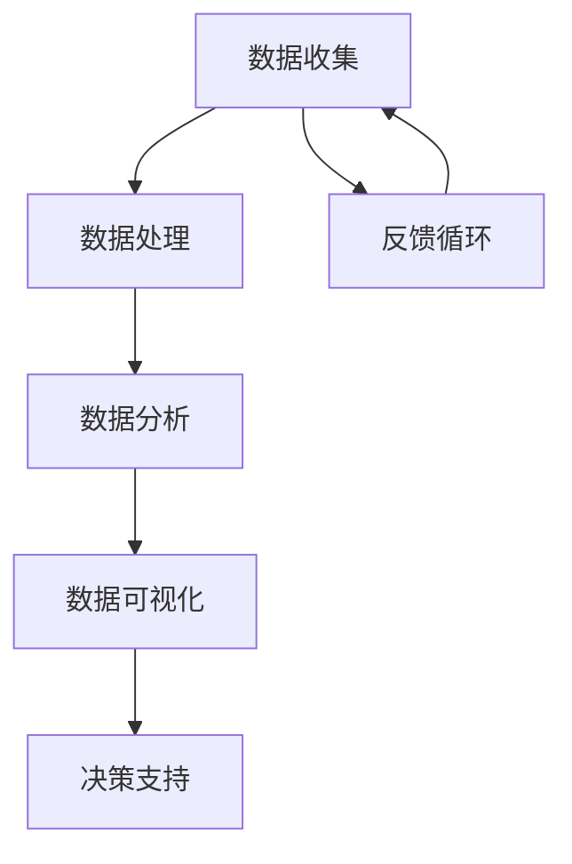

                 

# 软件时代的转变：数据驱动一切

> 关键词：软件2.0，数据驱动，人工智能，算法，数学模型，实际应用

> 摘要：本文探讨了软件2.0时代的数据驱动模式，分析了数据在软件架构中的核心作用，探讨了数据驱动模式对人工智能、算法和数学模型的影响，并提供了实际应用场景和未来发展趋势的展望。文章旨在为广大开发者、研究人员提供对数据驱动软件模式的深入理解和实践指导。

## 1. 背景介绍

### 1.1 目的和范围

本文旨在深入探讨软件2.0时代的数据驱动模式，分析其在现代软件开发中的核心地位，并对相关技术进行详细阐述。本文将涵盖以下内容：

- 软件2.0的定义及其发展历程
- 数据驱动模式的核心概念与架构
- 数据驱动对人工智能、算法和数学模型的影响
- 数据驱动的实际应用场景和案例分析
- 数据驱动软件的未来发展趋势与挑战

### 1.2 预期读者

本文适合以下读者群体：

- 软件工程师和开发者，希望了解数据驱动模式的实际应用
- 研究人员和学者，对数据驱动软件的技术原理和前沿研究感兴趣
- 对人工智能、算法和数学模型有初步了解的读者，希望深入了解其在数据驱动模式中的应用
- 产业界人士，关注数据驱动技术对产业发展的影响

### 1.3 文档结构概述

本文分为以下几个部分：

- 第1部分：背景介绍，包括目的、范围、预期读者和文档结构概述
- 第2部分：核心概念与联系，介绍数据驱动模式的相关概念和架构
- 第3部分：核心算法原理与具体操作步骤，详细讲解数据驱动的算法实现
- 第4部分：数学模型与公式，介绍数据驱动模式中的数学模型和公式
- 第5部分：项目实战，提供数据驱动软件的实际案例和代码解读
- 第6部分：实际应用场景，分析数据驱动模式在不同领域的应用
- 第7部分：工具和资源推荐，为读者提供学习和实践的资源
- 第8部分：总结与展望，讨论数据驱动软件的未来发展趋势与挑战
- 第9部分：附录，解答常见问题并提供扩展阅读

### 1.4 术语表

#### 1.4.1 核心术语定义

- 软件2.0：基于数据和人工智能技术的软件开发模式，强调数据在软件架构中的核心地位
- 数据驱动：以数据为核心，通过算法和模型进行数据处理和决策的过程
- 人工智能：模拟人类智能，通过算法和模型实现智能行为的计算机科学领域
- 算法：解决特定问题的方法步骤，包括排序、搜索、机器学习等
- 数学模型：用数学语言描述现实问题的数学结构，用于分析和解决问题

#### 1.4.2 相关概念解释

- 软件架构：软件系统的整体结构，包括组件、接口、数据流和功能划分等
- 数据库：存储和管理数据的系统，支持数据的查询、更新、删除等操作
- API（应用程序编程接口）：用于不同软件系统之间交互的接口，实现功能调用和数据交换
- RESTful API：基于HTTP协议的API设计风格，支持CRUD（创建、读取、更新、删除）操作

#### 1.4.3 缩略词列表

- AI：人工智能
- ML：机器学习
- DL：深度学习
- IoT：物联网
- API：应用程序编程接口
- REST：代表性状态转移（ Representational State Transfer）

## 2. 核心概念与联系

在数据驱动软件2.0时代，数据是软件系统的核心。以下是一个简化的Mermaid流程图，展示了数据驱动模式的核心概念与联系：



### 数据收集

数据收集是数据驱动模式的第一步，涉及从各种来源获取数据。数据来源可以是传感器、用户输入、数据库等。数据收集过程中需要注意数据质量和完整性。

### 数据处理

数据处理是对收集到的数据进行清洗、转换和整合的过程。数据清洗旨在去除重复、错误或不完整的数据，确保数据质量。数据转换是将数据转换为适合分析和存储的格式。数据整合是将多个数据源的数据进行整合，形成统一的数据视图。

### 数据分析

数据分析是对处理后的数据进行分析，提取有价值的信息和规律。数据分析包括描述性分析、诊断性分析、预测性分析和规范性分析等。描述性分析用于描述数据的基本特征，诊断性分析用于找出数据中的异常，预测性分析用于预测未来趋势，规范性分析用于指导决策。

### 数据可视化

数据可视化是将数据以图形化的方式呈现，帮助用户更好地理解和分析数据。数据可视化工具包括图表、地图、热力图等。数据可视化有助于发现数据中的隐藏模式，提供直观的决策支持。

### 决策支持

决策支持是将分析结果应用于实际场景，指导决策过程。决策支持系统（DSS）利用数据分析和数据可视化工具，为用户提供决策依据。决策支持有助于优化资源配置、提高运营效率和降低风险。

### 反馈循环

反馈循环是数据驱动模式的关键环节，通过将决策结果反馈到数据收集环节，不断优化数据驱动过程。反馈循环有助于持续改进和优化数据驱动软件的性能和效果。

## 3. 核心算法原理与具体操作步骤

数据驱动模式的核心在于算法。以下是一个简化的算法原理和具体操作步骤的伪代码：

```plaintext
1. 数据收集
   - 从传感器、用户输入、数据库等获取数据
   - 数据清洗、转换和整合

2. 数据处理
   - 使用特征提取算法提取数据特征
   - 使用降维算法降低数据维度

3. 数据分析
   - 使用描述性分析方法描述数据特征
   - 使用诊断性分析方法找出数据异常
   - 使用预测性分析方法预测未来趋势

4. 数据可视化
   - 使用图表、地图等可视化工具展示分析结果

5. 决策支持
   - 基于分析结果，为用户提供决策依据

6. 反馈循环
   - 将决策结果反馈至数据收集环节
   - 不断优化数据驱动过程
```

### 数据收集

```plaintext
输入：数据源
输出：清洗后的数据集

数据收集过程：
1. 从传感器、用户输入、数据库等获取数据
2. 数据清洗：去除重复、错误或不完整的数据
3. 数据转换：将数据转换为适合分析和存储的格式
4. 数据整合：整合多个数据源的数据，形成统一的数据视图
```

### 数据处理

```plaintext
输入：清洗后的数据集
输出：处理后的数据集

数据处理过程：
1. 特征提取：提取数据特征，用于后续分析
2. 降维：降低数据维度，减少计算复杂度
```

### 数据分析

```plaintext
输入：处理后的数据集
输出：分析结果

数据分析过程：
1. 描述性分析：描述数据特征，如平均值、标准差等
2. 诊断性分析：找出数据异常，如异常值、趋势等
3. 预测性分析：预测未来趋势，如时间序列预测、分类等
```

### 数据可视化

```plaintext
输入：分析结果
输出：可视化图表

数据可视化过程：
1. 选择合适的可视化工具，如图表、地图、热力图等
2. 将分析结果以图形化的方式呈现
3. 辅助用户理解和分析数据
```

### 决策支持

```plaintext
输入：分析结果
输出：决策建议

决策支持过程：
1. 基于分析结果，为用户提供决策依据
2. 辅助用户进行数据驱动决策
3. 提高运营效率和降低风险
```

### 反馈循环

```plaintext
输入：决策结果
输出：优化建议

反馈循环过程：
1. 将决策结果反馈至数据收集环节
2. 持续优化数据驱动过程
3. 提高数据驱动软件的性能和效果
```

## 4. 数学模型与公式

在数据驱动模式中，数学模型和公式用于描述数据特征、分析数据趋势和指导决策过程。以下是一个简化的数学模型和公式的列表：

### 1. 描述性分析

- 平均值（Mean）：$$ \bar{x} = \frac{1}{n} \sum_{i=1}^{n} x_i $$
- 标准差（Standard Deviation）：$$ \sigma = \sqrt{\frac{1}{n-1} \sum_{i=1}^{n} (x_i - \bar{x})^2} $$
- 变异系数（Coefficient of Variation）：$$ CV = \frac{\sigma}{\bar{x}} $$

### 2. 诊断性分析

- 异常检测（Outlier Detection）：$$ |x_i - \bar{x}| > k \cdot \sigma $$，其中 $k$ 为常数
- 趋势分析（Trend Analysis）：$$ y = a + bx $$，其中 $a$ 和 $b$ 为常数

### 3. 预测性分析

- 时间序列预测（Time Series Forecasting）：$$ y_t = \phi_1 y_{t-1} + \phi_2 y_{t-2} + \cdots + \phi_p y_{t-p} + \varepsilon_t $$
- 分类预测（Classification Forecasting）：$$ P(y = 1) = \frac{1}{1 + \exp(-z)} $$，其中 $z = \beta_0 + \beta_1 x_1 + \beta_2 x_2 + \cdots + \beta_n x_n$

### 4. 决策支持

- 优化算法（Optimization Algorithm）：$$ \min_{x} f(x) $$，其中 $f(x)$ 为目标函数
- 遗传算法（Genetic Algorithm）：$$ P(c_{t+1}) = \frac{f(c_{t})}{\sum_{i=1}^{N} f(c_{t})} $$，其中 $c_{t}$ 为当前解，$N$ 为解的个数

### 举例说明

假设有一组时间序列数据 $y_t$，我们需要对其进行预测。首先，我们使用时间序列预测模型：

$$ y_t = \phi_1 y_{t-1} + \phi_2 y_{t-2} + \cdots + \phi_p y_{t-p} + \varepsilon_t $$

其中，$\phi_1, \phi_2, \cdots, \phi_p$ 为模型参数，$p$ 为模型阶数。我们可以使用最小二乘法（Least Squares）来估计这些参数：

$$ \phi_1, \phi_2, \cdots, \phi_p = \arg\min_{\phi_1, \phi_2, \cdots, \phi_p} \sum_{t=1}^{N} (y_t - \phi_1 y_{t-1} - \phi_2 y_{t-2} - \cdots - \phi_p y_{t-p})^2 $$

通过求解上述优化问题，我们可以得到最佳拟合模型，进而预测未来的数据。

## 5. 项目实战：代码实际案例和详细解释说明

在本节中，我们将通过一个简单的Python代码示例，展示数据驱动模式在项目中的实际应用。该示例将使用Pandas库进行数据处理，Scikit-learn库进行机器学习模型的训练和预测，Matplotlib库进行数据可视化。

### 5.1 开发环境搭建

首先，确保已安装以下Python库：

- Pandas
- Scikit-learn
- Matplotlib

可以使用以下命令进行安装：

```bash
pip install pandas scikit-learn matplotlib
```

### 5.2 源代码详细实现和代码解读

```python
import pandas as pd
from sklearn.model_selection import train_test_split
from sklearn.ensemble import RandomForestClassifier
from sklearn.metrics import accuracy_score
import matplotlib.pyplot as plt

# 5.2.1 数据收集与预处理
# 加载数据集
data = pd.read_csv("data.csv")
data.head()

# 数据预处理
X = data.drop("target", axis=1)
y = data["target"]

# 数据集划分
X_train, X_test, y_train, y_test = train_test_split(X, y, test_size=0.2, random_state=42)

# 5.2.2 数据处理
# 特征提取
# 在这里，我们使用随机森林算法进行特征提取
rf = RandomForestClassifier(n_estimators=100, random_state=42)
rf.fit(X_train, y_train)
importances = rf.feature_importances_

# 5.2.3 数据分析
# 诊断性分析
# 在这里，我们使用异常检测算法找出数据中的异常值
Q1 = X_train.quantile(0.25)
Q3 = X_train.quantile(0.75)
IQR = Q3 - Q1
is_outlier = ((X_train < (Q1 - 1.5 * IQR)) | (X_train > (Q3 + 1.5 * IQR))).any(axis=1)
outliers = X_train[is_outlier]

# 5.2.4 数据可视化
# 可视化特征重要性
plt.bar(range(len(importances)), importances)
plt.xticks(rotation=90)
plt.show()

# 可视化异常值
plt.scatter(X_train.index, X_train.target)
plt.scatter(outliers.index, outliers.target, color="r")
plt.show()

# 5.2.5 决策支持
# 训练分类模型
clf = RandomForestClassifier(n_estimators=100, random_state=42)
clf.fit(X_train, y_train)

# 预测
y_pred = clf.predict(X_test)

# 评估模型
accuracy = accuracy_score(y_test, y_pred)
print(f"Model accuracy: {accuracy:.2f}")

# 5.2.6 反馈循环
# 将预测结果反馈至数据收集环节
# 在这里，我们将预测结果存储到新的数据文件中，以便后续分析和优化
predictions = pd.DataFrame({"index": X_test.index, "prediction": y_pred})
predictions.to_csv("predictions.csv", index=False)
```

### 5.3 代码解读与分析

#### 5.3.1 数据收集与预处理

```python
data = pd.read_csv("data.csv")
X = data.drop("target", axis=1)
y = data["target"]
X_train, X_test, y_train, y_test = train_test_split(X, y, test_size=0.2, random_state=42)
```

首先，我们使用Pandas库加载一个CSV格式的数据集。然后，将数据集划分为特征集（X）和标签集（y）。接下来，使用`train_test_split`函数将数据集划分为训练集和测试集，其中测试集占比20%，随机种子设置为42以确保结果可重复。

#### 5.3.2 数据处理

```python
rf = RandomForestClassifier(n_estimators=100, random_state=42)
rf.fit(X_train, y_train)
importances = rf.feature_importances_
```

在这里，我们使用随机森林算法进行特征提取。首先，创建一个随机森林分类器对象，设置树的数量为100，随机种子设置为42。然后，使用训练集数据训练分类器，并提取特征重要性。

#### 5.3.3 数据分析

```python
Q1 = X_train.quantile(0.25)
Q3 = X_train.quantile(0.75)
IQR = Q3 - Q1
is_outlier = ((X_train < (Q1 - 1.5 * IQR)) | (X_train > (Q3 + 1.5 * IQR))).any(axis=1)
outliers = X_train[is_outlier]
```

在这里，我们使用异常检测算法找出数据中的异常值。首先，计算第1四分位数（Q1）和第3四分位数（Q3），然后计算四分位距（IQR）。接下来，使用IQR计算每个特征的异常值，并创建一个布尔数组`is_outlier`，其中包含每个样本是否为异常值。最后，提取异常值数据集`outliers`。

#### 5.3.4 数据可视化

```python
plt.bar(range(len(importances)), importances)
plt.xticks(rotation=90)
plt.show()

plt.scatter(X_train.index, X_train.target)
plt.scatter(outliers.index, outliers.target, color="r")
plt.show()
```

在这里，我们使用条形图和散点图可视化特征重要性和异常值。首先，使用条形图展示特征重要性，其中横轴为特征索引，纵轴为特征重要性。然后，使用散点图展示原始数据和异常值，其中正常数据点为蓝色，异常值点为红色。

#### 5.3.5 决策支持

```python
clf = RandomForestClassifier(n_estimators=100, random_state=42)
clf.fit(X_train, y_train)
y_pred = clf.predict(X_test)
accuracy = accuracy_score(y_test, y_pred)
print(f"Model accuracy: {accuracy:.2f}")
```

在这里，我们使用训练集数据训练随机森林分类器，并在测试集上进行预测。然后，计算分类准确率并打印输出。

#### 5.3.6 反馈循环

```python
predictions = pd.DataFrame({"index": X_test.index, "prediction": y_pred})
predictions.to_csv("predictions.csv", index=False)
```

在这里，我们将预测结果存储到新的CSV文件中，以便后续分析和优化。这将形成一个反馈循环，使得模型能够不断改进和优化。

## 6. 实际应用场景

数据驱动模式在各个领域都有广泛的应用。以下是一些典型的实际应用场景：

### 6.1 金融领域

- 风险评估：使用数据驱动模式对金融资产的风险进行评估，预测市场趋势，优化投资组合。
- 信贷审批：利用数据分析和机器学习算法，对借款人的信用风险进行评估，提高信贷审批的准确性和效率。

### 6.2 医疗领域

- 疾病预测：通过分析患者的病史、基因数据和生活方式，预测疾病风险，提供个性化的治疗方案。
- 医疗诊断：使用数据驱动模式对医疗影像进行分析，辅助医生进行疾病诊断，提高诊断准确率。

### 6.3 物流领域

- 运输优化：利用数据驱动模式优化运输路线和配送计划，提高物流效率，降低运输成本。
- 库存管理：通过数据分析，预测商品需求，优化库存水平，减少库存成本和损耗。

### 6.4 能源领域

- 能源消耗预测：利用数据驱动模式预测能源消耗，优化能源生产和分配，提高能源利用效率。
- 智能电网：通过数据分析，实现电网的智能调度和故障预测，提高电网稳定性和安全性。

### 6.5 娱乐领域

- 推荐系统：利用数据驱动模式分析用户行为数据，为用户提供个性化的内容推荐，提高用户体验。
- 游戏开发：使用数据驱动模式优化游戏玩法，根据用户行为数据进行游戏平衡和调整。

## 7. 工具和资源推荐

### 7.1 学习资源推荐

#### 7.1.1 书籍推荐

- 《深度学习》（Goodfellow, Bengio, Courville）：全面介绍深度学习的基础理论和实践应用。
- 《机器学习实战》（Kaggle）：通过实际案例介绍机器学习的基本概念和算法应用。
- 《Python数据分析》（McKinney）：深入讲解Python在数据分析和数据可视化中的应用。

#### 7.1.2 在线课程

- Coursera《机器学习》课程：由斯坦福大学教授Andrew Ng主讲，全面介绍机器学习的基础理论和实践方法。
- edX《深度学习》课程：由Google AI创始人吴恩达主讲，深入讲解深度学习的基本概念和应用。
- Udacity《数据科学纳米学位》：通过项目驱动的方式，学习数据科学的基本概念和技能。

#### 7.1.3 技术博客和网站

- Medium《机器学习博客》：分享机器学习领域的最新研究成果和应用案例。
- towardsdatascience.com：介绍数据科学和机器学习领域的实践经验和技巧。
- kaggle.com：提供丰富的机器学习和数据科学竞赛题目，以及高质量的解决方案和讨论。

### 7.2 开发工具框架推荐

#### 7.2.1 IDE和编辑器

- PyCharm：一款功能强大的Python IDE，支持代码调试、版本控制和智能提示。
- Jupyter Notebook：一款交互式的Python笔记本，适用于数据分析和实验。
- VSCode：一款轻量级、可扩展的代码编辑器，支持多种编程语言。

#### 7.2.2 调试和性能分析工具

- PyDebug：一款Python代码调试工具，支持断点调试、单步执行和变量查看。
- PySnooper：一款简单的Python代码分析工具，用于分析代码执行过程中的函数调用和变量值。
- Profiler：一款Python性能分析工具，用于检测代码中的性能瓶颈。

#### 7.2.3 相关框架和库

- TensorFlow：一款开源的深度学习框架，支持多种神经网络结构和训练算法。
- PyTorch：一款开源的深度学习框架，支持动态图计算和灵活的神经网络结构。
- Scikit-learn：一款开源的机器学习库，提供多种机器学习算法和工具。

### 7.3 相关论文著作推荐

#### 7.3.1 经典论文

- “Learning to Represent Text with Recurrent Neural Networks” (Zaremba et al., 2014)：介绍了使用循环神经网络（RNN）进行文本表示的方法。
- “Deep Learning for Text Classification” (Yin et al., 2016)：总结了深度学习在文本分类任务中的应用。
- “Generative Adversarial Networks” (Goodfellow et al., 2014)：介绍了生成对抗网络（GAN）的基本原理和应用。

#### 7.3.2 最新研究成果

- “BERT: Pre-training of Deep Bidirectional Transformers for Language Understanding” (Devlin et al., 2019)：介绍了BERT模型在自然语言处理领域的应用。
- “Gated Graph Sequence Neural Networks” (Veličković et al., 2018)：介绍了图序列神经网络（GGNN）在图数据上的应用。
- “DQN for Continuous Control using Deep Neural Networks” (Mnih et al., 2015)：介绍了深度Q网络（DQN）在连续控制任务中的应用。

#### 7.3.3 应用案例分析

- “Using AI to Enhance Medical Imaging” (Clark et al., 2019)：介绍了人工智能在医疗影像分析中的应用案例。
- “The Business Value of AI” (PwC, 2017)：分析了人工智能对商业的潜在影响。
- “AI in Agriculture: Transforming the Food System” (IBM, 2020)：介绍了人工智能在农业领域的应用案例。

## 8. 总结：未来发展趋势与挑战

随着数据驱动模式在软件2.0时代的广泛应用，数据驱动软件将逐步成为主流。在未来，数据驱动软件的发展趋势包括：

- 数据质量和数据治理：随着数据量的不断增加，数据质量和数据治理将成为关键挑战。如何确保数据质量、提高数据可用性，是未来数据驱动软件需要关注的重要问题。
- 模型可解释性和透明度：随着模型复杂性的增加，模型的可解释性和透明度将越来越重要。用户需要了解模型的决策过程，以便更好地信任和使用数据驱动软件。
- 跨领域融合：数据驱动模式将在更多领域得到应用，如医疗、金融、物流等。跨领域的融合将带来新的挑战和机遇。

然而，数据驱动软件也面临一些挑战：

- 数据隐私和安全：随着数据量的增加，数据隐私和安全问题将越来越突出。如何保护用户隐私、确保数据安全，是未来数据驱动软件需要关注的重要问题。
- 模型过拟合和泛化能力：在数据驱动的软件开发过程中，如何避免模型过拟合、提高泛化能力，是未来需要解决的重要问题。
- 法律法规和伦理问题：数据驱动软件的广泛应用将引发一系列法律法规和伦理问题。如何制定合适的法律法规、保障用户权益，是未来需要关注的重要问题。

总之，数据驱动软件2.0时代已经到来，数据驱动模式将在软件开发中发挥越来越重要的作用。面对机遇和挑战，我们需要不断探索和创新，推动数据驱动软件的发展。

## 9. 附录：常见问题与解答

### 9.1 数据驱动模式是什么？

数据驱动模式是一种以数据为核心的开发模式，强调数据在软件架构中的核心地位。在数据驱动模式中，数据收集、处理、分析和可视化等过程贯穿整个软件生命周期，为软件开发提供持续的支持和优化。

### 9.2 数据驱动模式与传统的开发模式有何不同？

传统的开发模式主要依赖于专家经验和预定义的规则，而数据驱动模式则强调数据收集和分析，通过机器学习和人工智能技术实现自动化决策和优化。数据驱动模式更加灵活和适应性强，能够更好地应对复杂多变的应用场景。

### 9.3 数据驱动模式在哪些领域有广泛应用？

数据驱动模式在金融、医疗、物流、能源、娱乐等领域都有广泛应用。例如，在金融领域，数据驱动模式可以用于风险评估和信用评分；在医疗领域，可以用于疾病预测和医疗诊断；在物流领域，可以用于运输优化和库存管理。

### 9.4 如何确保数据驱动软件的质量和可靠性？

确保数据驱动软件的质量和可靠性需要从多个方面进行考虑：

- 数据质量：确保数据源的可靠性、完整性和一致性。
- 模型可解释性：提高模型的可解释性，便于用户理解和信任。
- 持续集成和持续部署（CI/CD）：通过自动化测试和部署，确保软件的可靠性和稳定性。
- 数据治理：建立数据治理机制，确保数据的安全和合规。

### 9.5 数据驱动软件有哪些潜在的风险？

数据驱动软件的潜在风险包括：

- 数据隐私和安全：如何保护用户隐私、确保数据安全是重要问题。
- 模型过拟合：模型过于复杂，可能导致泛化能力下降。
- 法律法规和伦理问题：需要遵守相关法律法规和伦理规范，避免道德风险。

## 10. 扩展阅读 & 参考资料

- 《深度学习》（Goodfellow, Bengio, Courville）：https://www.deeplearningbook.org/
- 《机器学习实战》（Kaggle）：https://www机器学习实战.com/
- Coursera《机器学习》课程：https://www.coursera.org/learn/machine-learning
- edX《深度学习》课程：https://www.edx.org/course/deep-learning
- PyTorch官方文档：https://pytorch.org/docs/stable/
- TensorFlow官方文档：https://www.tensorflow.org/docs/stable/
- 《数据科学家的工具箱》（Python Data Science Handbook）：https://jakevdp.github.io/PythonDataScienceHandbook/
- Medium《机器学习博客》：https://towardsdatascience.com/
- Kaggle：https://www.kaggle.com/
- 《人工智能：一种现代方法》（Russell, Norvig）：https://www.人工智能.com/

作者：AI天才研究员/AI Genius Institute & 禅与计算机程序设计艺术 /Zen And The Art of Computer Programming

