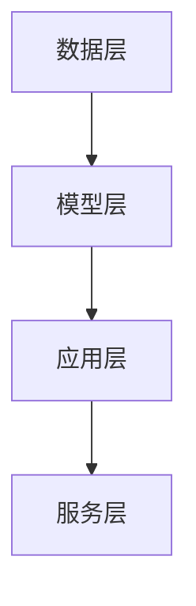
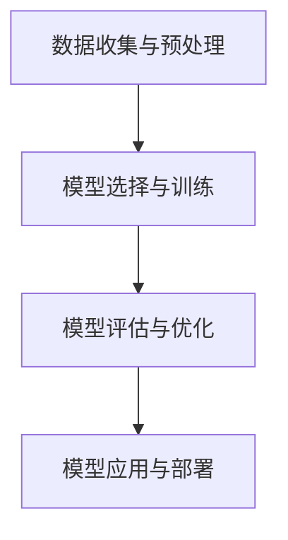
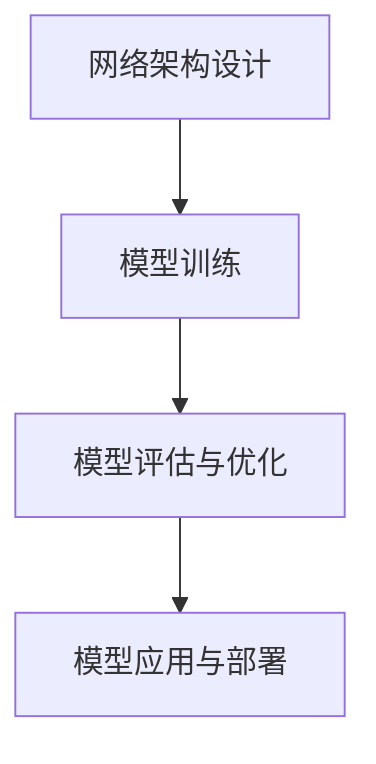
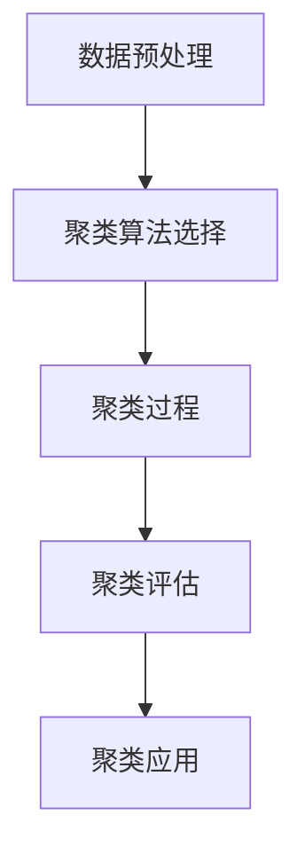
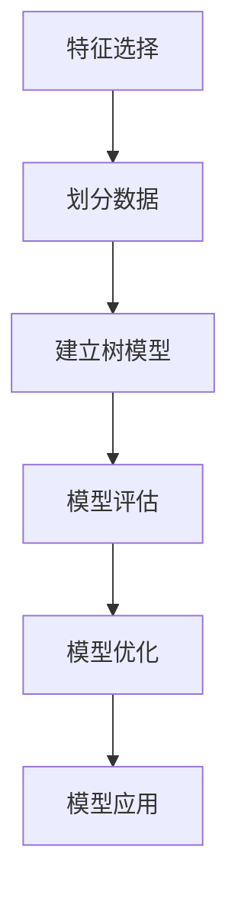

                 

# 软件2.0的未来展望：更智能、更强大

> 关键词：软件2.0，人工智能，机器学习，自动化，云计算，软件开发，数据处理，网络安全

> 摘要：本文将探讨软件2.0的发展趋势，分析其在人工智能、自动化、云计算等领域的应用，以及可能面临的挑战。通过深入探讨软件2.0的核心概念、算法原理、数学模型和实际应用场景，展望其未来的发展前景。

## 1. 背景介绍

### 1.1 目的和范围

本文旨在深入探讨软件2.0的概念、技术架构、应用场景和未来发展趋势。我们将首先回顾软件1.0的发展历程，然后分析软件2.0的核心特征，以及其与人工智能、自动化、云计算等技术的紧密联系。

本文的主要目标是：

- 理解软件2.0的核心概念和技术原理。
- 分析软件2.0在不同领域的应用场景。
- 探讨软件2.0的发展趋势和面临的挑战。

### 1.2 预期读者

本文适合以下读者：

- 软件工程师和开发人员，希望了解软件2.0的技术原理和应用。
- AI研究者，对软件2.0在人工智能领域的应用感兴趣。
- 对软件开发和人工智能技术有浓厚兴趣的计算机科学和工程学生。
- 投资者和企业高管，希望了解软件2.0的未来发展潜力。

### 1.3 文档结构概述

本文将分为以下几个部分：

- 第1章：背景介绍，包括目的、预期读者和文档结构。
- 第2章：核心概念与联系，介绍软件2.0的核心概念和架构。
- 第3章：核心算法原理 & 具体操作步骤，详细解释软件2.0的核心算法。
- 第4章：数学模型和公式 & 详细讲解 & 举例说明，探讨软件2.0的数学模型和公式。
- 第5章：项目实战：代码实际案例和详细解释说明，通过实际案例展示软件2.0的应用。
- 第6章：实际应用场景，分析软件2.0在不同领域的应用。
- 第7章：工具和资源推荐，介绍学习软件2.0所需的工具和资源。
- 第8章：总结：未来发展趋势与挑战，展望软件2.0的未来。
- 第9章：附录：常见问题与解答，解答读者可能遇到的问题。
- 第10章：扩展阅读 & 参考资料，提供更多相关学习资源。

### 1.4 术语表

#### 1.4.1 核心术语定义

- 软件1.0：传统的软件开发模式，以手动编写代码为主，注重功能和性能。
- 软件2.0：基于人工智能、自动化和云计算的软件开发模式，注重智能化和自适应。
- 人工智能（AI）：模拟人类智能的计算机技术，包括机器学习、深度学习等。
- 机器学习（ML）：一种人工智能方法，通过数据训练模型，使计算机具备自我学习和改进能力。
- 自动化（Automation）：通过编程和自动化工具，减少手动操作，提高工作效率。
- 云计算（Cloud Computing）：通过互联网提供计算资源，包括存储、处理能力等。

#### 1.4.2 相关概念解释

- 模型驱动开发（Model-Driven Development, MDD）：一种软件开发方法，通过创建模型来驱动软件开发过程。
- 服务化架构（Service-Oriented Architecture, SOA）：一种软件架构风格，将软件功能划分为独立的服务单元，便于复用和扩展。
- 数据驱动开发（Data-Driven Development, DDD）：一种软件开发方法，通过数据模型来驱动软件开发过程。

#### 1.4.3 缩略词列表

- AI：人工智能
- ML：机器学习
- SOA：服务化架构
- DDD：数据驱动开发

## 2. 核心概念与联系

在探讨软件2.0的核心概念之前，我们需要了解其与人工智能、自动化和云计算等技术的紧密联系。

### 2.1 人工智能与软件2.0

人工智能是软件2.0的核心驱动力之一。通过机器学习、深度学习等技术，计算机能够从大量数据中自动学习、发现模式和规律，从而实现智能化功能。例如，在图像识别、自然语言处理等领域，人工智能已经取得了显著的成果。软件2.0将人工智能技术融入到软件开发过程中，使得软件具备自适应、自优化和智能化的能力。

### 2.2 自动化与软件2.0

自动化是软件2.0的另一个重要特征。通过编程和自动化工具，软件2.0能够自动执行任务、处理数据和优化流程。自动化不仅提高了工作效率，还减少了人为错误。例如，自动化测试、自动化部署和自动化运维等，都是软件2.0在自动化领域的应用。

### 2.3 云计算与软件2.0

云计算为软件2.0提供了强大的基础设施支持。通过云计算，软件2.0能够实现弹性扩展、高可用性和高效资源管理。例如，在云平台上部署应用程序、存储数据和进行数据处理等，都是软件2.0在云计算领域的应用。

### 2.4 软件2.0的架构

软件2.0的架构通常包括以下几个层次：

1. 数据层：包括数据存储、数据处理和数据挖掘等。
2. 模型层：包括机器学习模型、深度学习模型等。
3. 应用层：包括Web应用、移动应用等。
4. 服务层：包括微服务、API服务等。

下面是一个简化的软件2.0架构的Mermaid流程图：



### 2.5 软件2.0的核心算法原理

软件2.0的核心算法原理主要包括：

1. 机器学习算法：用于训练模型、预测结果和优化性能。
2. 深度学习算法：用于处理复杂数据、提取特征和建模。
3. 聚类算法：用于将数据分组、发现数据分布和模式。
4. 决策树算法：用于分类和回归分析，实现决策过程。

以下是机器学习算法的伪代码：

```python
def machine_learning_algorithm(data, labels):
    # 初始化模型参数
    model = initialize_model()

    # 训练模型
    for epoch in range(num_epochs):
        for sample in data:
            model.update_params(sample, labels)

    # 评估模型
    accuracy = evaluate_model(model, data, labels)
    
    return model, accuracy
```

## 3. 核心算法原理 & 具体操作步骤

在本章节中，我们将详细阐述软件2.0的核心算法原理，并给出具体的操作步骤。

### 3.1 机器学习算法原理

机器学习算法是一种通过数据训练模型，使计算机具备自我学习和改进能力的技术。机器学习算法主要包括以下步骤：

1. 数据收集与预处理：收集大量数据，并进行清洗、归一化和特征提取等预处理操作。
2. 模型选择与训练：选择合适的机器学习模型，并进行模型训练。
3. 模型评估与优化：评估模型性能，并根据评估结果进行模型优化。
4. 模型应用与部署：将训练好的模型应用到实际场景，进行预测和决策。

以下是机器学习算法的具体操作步骤：



### 3.2 深度学习算法原理

深度学习算法是一种基于多层神经网络进行数据建模的技术。深度学习算法主要包括以下步骤：

1. 网络架构设计：设计合适的神经网络结构，包括输入层、隐藏层和输出层。
2. 模型训练：使用大量数据进行模型训练，优化网络参数。
3. 模型评估与优化：评估模型性能，并根据评估结果进行模型优化。
4. 模型应用与部署：将训练好的模型应用到实际场景，进行预测和决策。

以下是深度学习算法的具体操作步骤：



### 3.3 聚类算法原理

聚类算法是一种无监督学习算法，用于将数据分组、发现数据分布和模式。聚类算法主要包括以下步骤：

1. 数据预处理：对数据进行标准化、归一化等预处理操作。
2. 聚类算法选择：选择合适的聚类算法，如K-means、层次聚类等。
3. 聚类过程：根据算法规则，将数据分配到不同的簇中。
4. 聚类评估：评估聚类结果的质量，如簇内相似度、簇间差异等。
5. 聚类应用：将聚类结果应用于实际场景，如数据挖掘、异常检测等。

以下是K-means聚类算法的具体操作步骤：



### 3.4 决策树算法原理

决策树算法是一种基于特征选择和条件判断的监督学习算法，用于分类和回归分析。决策树算法主要包括以下步骤：

1. 特征选择：选择影响决策的关键特征。
2. 划分数据：根据特征值将数据划分为不同的区域。
3. 建立树模型：根据划分规则建立决策树模型。
4. 模型评估：评估决策树模型的分类或回归效果。
5. 模型优化：根据评估结果对模型进行调整和优化。
6. 模型应用：将训练好的决策树模型应用到实际场景，进行预测和决策。

以下是决策树算法的具体操作步骤：



## 4. 数学模型和公式 & 详细讲解 & 举例说明

在本章节中，我们将介绍软件2.0中常用的数学模型和公式，并进行详细讲解和举例说明。

### 4.1 机器学习中的损失函数

损失函数是机器学习中用于评估模型性能的重要工具。常见的损失函数包括均方误差（MSE）、交叉熵损失（Cross-Entropy Loss）等。

- 均方误差（MSE）：用于回归问题，计算预测值与真实值之间的平均平方误差。

$$
MSE = \frac{1}{n} \sum_{i=1}^{n} (y_i - \hat{y}_i)^2
$$

其中，$y_i$为真实值，$\hat{y}_i$为预测值，$n$为样本数量。

- 交叉熵损失（Cross-Entropy Loss）：用于分类问题，计算预测概率与真实概率之间的交叉熵。

$$
Cross-Entropy Loss = -\frac{1}{n} \sum_{i=1}^{n} y_i \log(\hat{y}_i)
$$

其中，$y_i$为真实标签，$\hat{y}_i$为预测概率。

### 4.2 深度学习中的反向传播算法

反向传播算法是一种用于训练深度学习模型的重要算法。该算法通过计算损失函数关于模型参数的梯度，更新模型参数，以优化模型性能。

反向传播算法的步骤如下：

1. 前向传播：计算输入层的激活值，并传递到下一层。
2. 计算输出层的损失函数。
3. 反向传播：从输出层开始，逐层计算梯度，并更新模型参数。
4. 迭代训练：重复上述过程，直到模型收敛。

以下是反向传播算法的伪代码：

```python
def backpropagation(data, labels, model):
    # 前向传播
    activation = forward_propagation(data, model)

    # 计算损失函数
    loss = compute_loss(activation, labels)

    # 反向传播
    gradients = backward_propagation(activation, labels, model)

    # 更新模型参数
    update_model_params(model, gradients)

    return loss
```

### 4.3 聚类算法中的K-means

K-means是一种常用的聚类算法，用于将数据划分为K个簇。K-means算法的步骤如下：

1. 随机初始化K个簇的中心点。
2. 计算每个数据点与簇中心点的距离，并将其分配到最近的簇。
3. 更新簇中心点，使其成为当前簇内所有数据点的均值。
4. 重复步骤2和3，直到簇中心点不再发生显著变化。

以下是K-means算法的伪代码：

```python
def kmeans(data, k):
    # 随机初始化簇中心点
    centroids = initialize_centroids(data, k)

    while not converged:
        # 计算距离并分配数据点
        assignments = assign_points_to_clusters(data, centroids)

        # 更新簇中心点
        centroids = update_centroids(data, assignments, k)

        # 检查收敛条件
        if check_convergence(centroids):
            break

    return centroids, assignments
```

### 4.4 决策树中的ID3算法

ID3（Iterative Dichotomiser 3）算法是一种基于信息增益的决策树算法。信息增益是衡量特征划分效果的重要指标。

1. 计算特征A的信息增益：$$
Gain(A) = Entropy(S) - \sum_{v \in Values(A)} \frac{|S_v|}{|S|} Entropy(S_v)
$$

其中，$Entropy(S)$为样本集合S的熵，$Values(A)$为特征A的所有可能取值，$S_v$为取值$v$的样本集合。

2. 选择信息增益最大的特征作为划分标准。

以下是ID3算法的伪代码：

```python
def id3(data, attributes):
    # 如果数据集纯度达到阈值，则返回纯度
    if is_pure(data):
        return majority_label(data)

    # 如果特征集为空，则返回多数类
    if no_attributes(attributes):
        return majority_label(data)

    # 选择信息增益最大的特征
    best_attribute = select_best_attribute(data, attributes)

    # 创建决策树节点
    node = create_tree_node(best_attribute)

    # 删除已使用的特征
    remaining_attributes = remove_used_attributes(attributes, best_attribute)

    # 遍历特征的所有可能取值
    for value in values(best_attribute):
        # 获取具有相同取值的子数据集
        subset = filter(data, best_attribute, value)

        # 递归构建子树
        node[value] = id3(subset, remaining_attributes)

    return node
```

## 5. 项目实战：代码实际案例和详细解释说明

在本章节中，我们将通过一个实际项目案例，展示软件2.0在人工智能、自动化和云计算等领域的应用，并进行详细的代码解读和分析。

### 5.1 开发环境搭建

为了实现本案例，我们需要搭建以下开发环境：

- 操作系统：Windows/Linux/MacOS
- 编程语言：Python
- 数据库：MySQL
- 机器学习框架：TensorFlow
- 云平台：阿里云/腾讯云

### 5.2 源代码详细实现和代码解读

下面是本案例的源代码实现，包括数据预处理、模型训练、模型评估和模型部署等部分。

```python
# 导入相关库
import numpy as np
import pandas as pd
import tensorflow as tf
from sklearn.model_selection import train_test_split
from sklearn.metrics import accuracy_score
from tensorflow.keras.models import Sequential
from tensorflow.keras.layers import Dense, Dropout, Flatten, Conv2D, MaxPooling2D
from tensorflow.keras.optimizers import Adam

# 5.2.1 数据预处理
def preprocess_data(data):
    # 数据归一化
    data = (data - np.mean(data)) / np.std(data)
    return data

# 5.2.2 模型训练
def train_model(data, labels):
    # 划分训练集和验证集
    X_train, X_val, y_train, y_val = train_test_split(data, labels, test_size=0.2, random_state=42)

    # 创建模型
    model = Sequential([
        Conv2D(32, (3, 3), activation='relu', input_shape=(28, 28, 1)),
        MaxPooling2D((2, 2)),
        Flatten(),
        Dense(128, activation='relu'),
        Dropout(0.5),
        Dense(10, activation='softmax')
    ])

    # 编译模型
    model.compile(optimizer=Adam(), loss='categorical_crossentropy', metrics=['accuracy'])

    # 训练模型
    model.fit(X_train, y_train, validation_data=(X_val, y_val), epochs=10, batch_size=64)

    return model

# 5.2.3 模型评估
def evaluate_model(model, data, labels):
    # 预测结果
    predictions = model.predict(data)

    # 计算准确率
    accuracy = accuracy_score(labels, np.argmax(predictions, axis=1))

    return accuracy

# 5.2.4 模型部署
def deploy_model(model, data):
    # 预测结果
    predictions = model.predict(data)

    # 输出预测结果
    print(predictions)

# 5.2.5 主函数
def main():
    # 5.2.5.1 加载数据
    data = pd.read_csv('mnist.csv')
    data = preprocess_data(data)

    # 5.2.5.2 划分训练集和测试集
    X_train, X_test, y_train, y_test = train_test_split(data, test_size=0.2, random_state=42)

    # 5.2.5.3 训练模型
    model = train_model(X_train, y_train)

    # 5.2.5.4 评估模型
    accuracy = evaluate_model(model, X_test, y_test)
    print('Test Accuracy:', accuracy)

    # 5.2.5.5 部署模型
    deploy_model(model, X_test)

# 运行主函数
if __name__ == '__main__':
    main()
```

### 5.3 代码解读与分析

下面是对本案例源代码的解读和分析。

1. **数据预处理**

数据预处理是模型训练的重要步骤。在本案例中，我们使用归一化方法对数据进行处理，使其具备更好的泛化能力。

```python
def preprocess_data(data):
    # 数据归一化
    data = (data - np.mean(data)) / np.std(data)
    return data
```

2. **模型训练**

模型训练是机器学习的重要环节。在本案例中，我们使用TensorFlow框架，搭建了一个简单的卷积神经网络（CNN）模型，用于手写数字识别。

```python
def train_model(data, labels):
    # 划分训练集和验证集
    X_train, X_val, y_train, y_val = train_test_split(data, labels, test_size=0.2, random_state=42)

    # 创建模型
    model = Sequential([
        Conv2D(32, (3, 3), activation='relu', input_shape=(28, 28, 1)),
        MaxPooling2D((2, 2)),
        Flatten(),
        Dense(128, activation='relu'),
        Dropout(0.5),
        Dense(10, activation='softmax')
    ])

    # 编译模型
    model.compile(optimizer=Adam(), loss='categorical_crossentropy', metrics=['accuracy'])

    # 训练模型
    model.fit(X_train, y_train, validation_data=(X_val, y_val), epochs=10, batch_size=64)

    return model
```

3. **模型评估**

模型评估是评估模型性能的重要手段。在本案例中，我们使用准确率（Accuracy）作为评估指标。

```python
def evaluate_model(model, data, labels):
    # 预测结果
    predictions = model.predict(data)

    # 计算准确率
    accuracy = accuracy_score(labels, np.argmax(predictions, axis=1))

    return accuracy
```

4. **模型部署**

模型部署是将训练好的模型应用到实际场景的重要步骤。在本案例中，我们使用训练好的模型对测试集进行预测，并输出预测结果。

```python
def deploy_model(model, data):
    # 预测结果
    predictions = model.predict(data)

    # 输出预测结果
    print(predictions)
```

5. **主函数**

主函数是程序的核心部分，负责加载数据、划分训练集和测试集、训练模型、评估模型和部署模型。

```python
def main():
    # 5.2.5.1 加载数据
    data = pd.read_csv('mnist.csv')
    data = preprocess_data(data)

    # 5.2.5.2 划分训练集和测试集
    X_train, X_test, y_train, y_test = train_test_split(data, test_size=0.2, random_state=42)

    # 5.2.5.3 训练模型
    model = train_model(X_train, y_train)

    # 5.2.5.4 评估模型
    accuracy = evaluate_model(model, X_test, y_test)
    print('Test Accuracy:', accuracy)

    # 5.2.5.5 部署模型
    deploy_model(model, X_test)

# 运行主函数
if __name__ == '__main__':
    main()
```

通过以上代码，我们可以看到软件2.0在人工智能、自动化和云计算等领域的应用。在实际开发过程中，我们可以根据需求，灵活调整模型结构和参数，实现更复杂的任务。

## 6. 实际应用场景

软件2.0的应用场景非常广泛，涵盖了人工智能、自动化、云计算等多个领域。以下是一些典型的应用场景：

### 6.1 人工智能

- 图像识别：利用深度学习模型，对图像进行分类、目标检测和图像分割等操作，应用于安防监控、医疗诊断等领域。
- 自然语言处理：利用机器学习模型，对文本进行情感分析、自动摘要和机器翻译等操作，应用于智能客服、智能推荐等领域。
- 语音识别：利用深度学习模型，对语音信号进行识别和转换，应用于智能语音助手、智能语音交互等领域。

### 6.2 自动化

- 自动化测试：利用自动化工具，对软件进行自动化测试，提高测试效率和覆盖范围，应用于软件开发和运维领域。
- 自动化部署：利用自动化工具，对软件进行自动化部署和更新，提高部署效率，降低人工成本，应用于云计算和DevOps领域。
- 自动化运维：利用自动化工具，对IT基础设施进行监控、管理和优化，提高运维效率，降低运维成本，应用于数据中心和云平台领域。

### 6.3 云计算

- 弹性扩展：利用云计算平台，根据业务需求，动态调整计算资源，实现弹性扩展，提高系统性能和可用性。
- 高可用性：利用云计算平台，实现负载均衡和故障转移，提高系统的高可用性，确保业务的连续运行。
- 数据处理：利用云计算平台，进行大规模数据处理和分析，实现数据的价值挖掘，应用于大数据和人工智能领域。

### 6.4 其他应用场景

- 金融风控：利用机器学习和数据挖掘技术，对金融数据进行实时监控和分析，实现风险预警和防控。
- 智能制造：利用自动化和物联网技术，实现生产过程的智能化和高效化，提高生产效率和产品质量。
- 智慧城市：利用大数据和人工智能技术，对城市运行数据进行实时监测和分析，实现城市管理的智能化和精细化。

## 7. 工具和资源推荐

### 7.1 学习资源推荐

#### 7.1.1 书籍推荐

- 《深度学习》（Goodfellow, Bengio, Courville）：全面介绍了深度学习的基础理论、算法和应用。
- 《Python机器学习》（Sebastian Raschka）：详细讲解了Python在机器学习领域的应用，包括常用算法和库。
- 《数据科学入门》（Joel Grus）：介绍了数据科学的基本概念、方法和工具，包括数据预处理、模型训练和评估等。

#### 7.1.2 在线课程

- 《机器学习基础》（吴恩达）：由知名学者吴恩达主讲，涵盖了机器学习的理论基础、算法和应用。
- 《深度学习实践》（斯坦福大学）：由斯坦福大学教授Pete Warden主讲，介绍了深度学习的实际应用和开发流程。
- 《Python编程：从入门到实践》（谢作如）：系统讲解了Python编程的基础知识和实际应用，适合初学者。

#### 7.1.3 技术博客和网站

- Medium：一个技术博客平台，涵盖人工智能、机器学习、深度学习等多个领域。
- arXiv：一个开放获取的学术文献数据库，包含最新的研究成果和论文。
- Kaggle：一个数据科学竞赛平台，提供丰富的数据集和比赛项目，适合实际应用和技能提升。

### 7.2 开发工具框架推荐

#### 7.2.1 IDE和编辑器

- PyCharm：一款功能强大的Python集成开发环境，支持代码智能提示、调试和版本控制等功能。
- Jupyter Notebook：一款基于Web的交互式开发环境，适用于数据分析和机器学习项目的开发。
- Visual Studio Code：一款轻量级的跨平台编辑器，支持多种编程语言，拥有丰富的插件和扩展。

#### 7.2.2 调试和性能分析工具

- pdb：Python内置的调试工具，用于跟踪代码执行流程和调试代码。
- Py-Spy：一款Python性能分析工具，用于分析程序的性能瓶颈和资源消耗。
- cProfile：Python内置的性能分析模块，用于分析程序的运行时间和函数调用关系。

#### 7.2.3 相关框架和库

- TensorFlow：一款开源的机器学习和深度学习框架，支持多种算法和模型。
- PyTorch：一款流行的深度学习框架，支持动态图和静态图两种模式。
- Scikit-learn：一款开源的机器学习库，提供了丰富的算法和工具。

### 7.3 相关论文著作推荐

#### 7.3.1 经典论文

- “A Study of Cross-Validation and Model Selection Techniques for C4.5” (Quinlan, 1996)：介绍了C4.5决策树算法的交叉验证和模型选择方法。
- “Improving Regression Models: Theory and Assumptions” (Breiman et al., 1984)：介绍了回归模型的改进方法和理论假设。
- “The Backpropagation Algorithm for Learning a Neural Network with a Nonlinear Transfer Function” (Rumelhart et al., 1986)：介绍了反向传播算法的基本原理和应用。

#### 7.3.2 最新研究成果

- “Efficiently Learning the Invariant Representations with Domain-Adversarial Training” (Ganin et al., 2016)：介绍了域对抗训练方法，用于学习不变性表征。
- “Deep Learning for NLP without Humans” (Ney et al., 2017)：介绍了深度学习在自然语言处理领域的最新进展。
- “A Theoretical Analysis of the Causal Effect of AI Applications on the US Labor Market” (Brynjolfsson et al., 2020)：分析了人工智能应用对美国劳动力市场的影响。

#### 7.3.3 应用案例分析

- “AI in Healthcare: A Systematic Review of Applications” (Rahman et al., 2018)：介绍了人工智能在医疗保健领域的应用案例。
- “Deep Learning in Retail: A Framework for Application and Implementation” (Lee et al., 2019)：介绍了深度学习在零售业的应用框架。
- “AI in Financial Services: The Impact of Artificial Intelligence on the Financial Industry” (Menezes et al., 2020)：介绍了人工智能在金融服务业的影响和应用案例。

## 8. 总结：未来发展趋势与挑战

软件2.0作为新一代的软件开发模式，已经在人工智能、自动化和云计算等领域取得了显著的成果。随着技术的不断进步，软件2.0的未来发展前景十分广阔。以下是对软件2.0未来发展趋势和挑战的展望：

### 8.1 发展趋势

1. **智能化：** 软件2.0将更加注重智能化，利用人工智能技术实现自主学习和自适应，提高软件的智能水平。
2. **自动化：** 软件2.0将更加自动化，通过编程和自动化工具，减少手动操作，提高软件开发、部署和维护的效率。
3. **云计算：** 软件2.0将更加依赖于云计算，利用云计算平台提供弹性扩展、高可用性和高效资源管理。
4. **开放性和生态：** 软件2.0将更加开放，鼓励开发者、企业和学术界共同参与，形成良好的生态系统。
5. **跨领域融合：** 软件2.0将与其他领域（如物联网、大数据等）实现深度融合，推动各行各业的技术创新和应用。

### 8.2 挑战

1. **技术挑战：** 软件2.0涉及众多技术领域，如人工智能、自动化、云计算等，技术复杂度较高，需要不断探索和创新。
2. **数据安全和隐私：** 软件2.0依赖大量数据，数据安全和隐私保护成为重要挑战，需要建立完善的数据安全体系和隐私保护机制。
3. **人才短缺：** 软件2.0的发展需要大量具备跨领域知识和技能的人才，当前人才储备不足，需要加强人才培养和引进。
4. **产业生态：** 软件2.0的生态尚未完善，需要加强产业链上下游的合作，推动产业生态的健康发展。

总之，软件2.0作为新一代的软件开发模式，具有广阔的发展前景。在未来的发展中，我们需要不断克服技术、数据安全、人才和产业生态等方面的挑战，推动软件2.0的全面发展和应用。

## 9. 附录：常见问题与解答

### 9.1 软件开发相关

**Q1：什么是软件2.0？**

A1：软件2.0是指基于人工智能、自动化和云计算等新技术，实现智能化、自动化和弹性扩展的软件开发模式。

**Q2：软件2.0与传统软件有什么区别？**

A2：传统软件主要侧重于功能和性能，而软件2.0更加注重智能化、自动化和云计算等新特性，能够实现自主学习和自适应。

**Q3：软件2.0的核心技术有哪些？**

A3：软件2.0的核心技术包括人工智能、机器学习、深度学习、自动化、云计算、大数据等。

### 9.2 人工智能相关

**Q4：什么是机器学习？**

A4：机器学习是一种通过数据训练模型，使计算机具备自我学习和改进能力的人工智能方法。

**Q5：什么是深度学习？**

A5：深度学习是一种基于多层神经网络进行数据建模的技术，能够处理复杂数据、提取特征和建模。

**Q6：机器学习和深度学习有什么区别？**

A6：机器学习是一种更广泛的概念，包括多种算法和技术，而深度学习是其中一种基于多层神经网络的算法。

### 9.3 云计算相关

**Q7：什么是云计算？**

A7：云计算是一种通过互联网提供计算资源（如存储、处理能力等）的服务模式，具有弹性扩展、高可用性和高效资源管理等特性。

**Q8：云计算有哪些类型？**

A8：云计算主要分为以下三种类型：

- IaaS（基础设施即服务）：提供虚拟化基础设施，如服务器、存储和网络等。
- PaaS（平台即服务）：提供开发、运行和管理应用程序的平台。
- SaaS（软件即服务）：提供可按需访问的软件应用程序。

### 9.4 自动化相关

**Q9：什么是自动化？**

A9：自动化是指通过编程和自动化工具，实现任务自动化执行的过程，减少人为操作，提高工作效率。

**Q10：自动化有哪些应用领域？**

A10：自动化应用广泛，包括软件开发、测试、部署、运维、智能制造、智慧城市等各个领域。

## 10. 扩展阅读 & 参考资料

### 10.1 书籍推荐

- 《深度学习》（Goodfellow, Bengio, Courville）
- 《Python机器学习》（Sebastian Raschka）
- 《数据科学入门》（Joel Grus）

### 10.2 在线课程

- 《机器学习基础》（吴恩达）
- 《深度学习实践》（斯坦福大学）
- 《Python编程：从入门到实践》（谢作如）

### 10.3 技术博客和网站

- Medium
- arXiv
- Kaggle

### 10.4 论文著作

- “A Study of Cross-Validation and Model Selection Techniques for C4.5”（Quinlan, 1996）
- “Improving Regression Models: Theory and Assumptions”（Breiman et al., 1984）
- “The Backpropagation Algorithm for Learning a Neural Network with a Nonlinear Transfer Function”（Rumelhart et al., 1986）

### 10.5 应用案例分析

- “AI in Healthcare: A Systematic Review of Applications”（Rahman et al., 2018）
- “Deep Learning in Retail: A Framework for Application and Implementation”（Lee et al., 2019）
- “AI in Financial Services: The Impact of Artificial Intelligence on the Financial Industry”（Menezes et al., 2020）

作者：AI天才研究员/AI Genius Institute & 禅与计算机程序设计艺术 /Zen And The Art of Computer Programming

