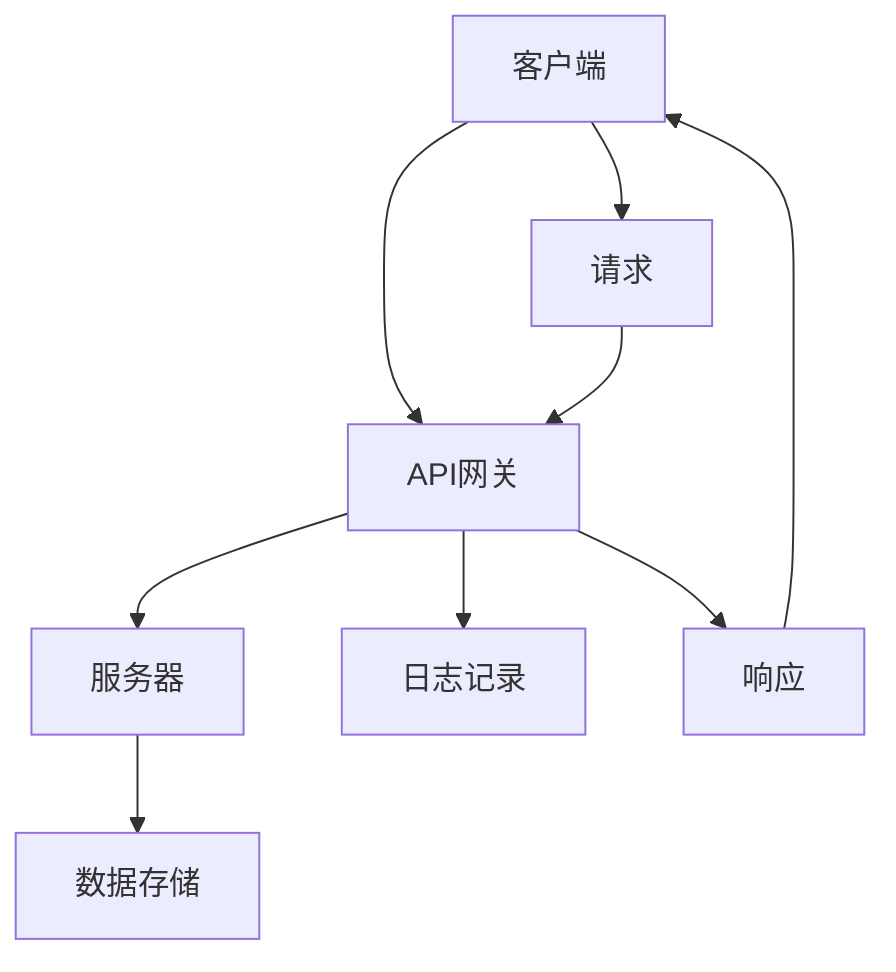

                 

# 软件2.0的API设计与管理

> 关键词：API设计、软件2.0、RESTful API、设计原则、最佳实践、安全性、性能优化、API管理工具

> 摘要：本文深入探讨了软件2.0时代下的API设计与管理。首先，我们回顾了API的基本概念及其在软件开发中的作用。接着，我们详细介绍了RESTful API的设计原则和最佳实践，包括一致性、状态转移、无状态性等。此外，文章还讨论了API性能优化策略、安全性问题和API管理工具的使用。通过实际案例和代码解读，本文为开发者提供了实用的API设计与管理的指导，旨在帮助他们在软件2.0时代打造高质量、高性能的API服务。

## 1. 背景介绍

### 1.1 目的和范围

本文旨在为软件开发者提供关于API设计与管理的一站式指南。随着软件2.0时代的到来，API作为服务（API as a Service，简称APIaaS）已成为现代软件开发的核心组成部分。本文将重点讨论以下主题：

- API的基本概念及其在软件开发中的作用。
- RESTful API的设计原则和最佳实践。
- API性能优化策略。
- API安全性和隐私保护。
- API管理工具的使用和选择。

### 1.2 预期读者

本文适合以下读者群体：

- 有经验的软件开发者，希望提升API设计与管理技能。
- 新晋开发者，对API设计与管理感兴趣，希望快速上手。
- API管理工具和框架的爱好者，希望深入了解API管理的实践。

### 1.3 文档结构概述

本文结构如下：

- 第1章：背景介绍，概述文章的目的、范围和预期读者。
- 第2章：核心概念与联系，介绍API的基本概念和相关架构。
- 第3章：核心算法原理 & 具体操作步骤，详细解释API设计原则和最佳实践。
- 第4章：数学模型和公式 & 详细讲解 & 举例说明，阐述API性能优化的数学模型。
- 第5章：项目实战：代码实际案例和详细解释说明，通过实际案例展示API设计过程。
- 第6章：实际应用场景，探讨API在现实世界中的应用。
- 第7章：工具和资源推荐，提供学习资源和开发工具推荐。
- 第8章：总结：未来发展趋势与挑战，展望API设计与管理的发展前景。
- 第9章：附录：常见问题与解答，解答API设计与管理过程中常见的问题。
- 第10章：扩展阅读 & 参考资料，提供更多深入阅读的资料。

### 1.4 术语表

#### 1.4.1 核心术语定义

- API：应用程序编程接口（Application Programming Interface），允许不同软件之间进行交互的接口。
- RESTful API：遵循REST（Representational State Transfer）架构风格的设计良好的API。
- API设计原则：指导API设计的基本原则，如一致性、无状态性、简洁性等。
- API管理工具：用于创建、发布、监控和管理API的工具。

#### 1.4.2 相关概念解释

- API即服务（API as a Service，APIaaS）：通过云平台提供API服务，允许开发者无需关注底层基础设施。
- REST（Representational State Transfer）：一种设计风格，旨在实现简单的、可扩展的、基于HTTP的API。
- HTTP（Hypertext Transfer Protocol）：互联网上最常用的应用层协议，用于请求和响应数据传输。

#### 1.4.3 缩略词列表

- API：应用程序编程接口
- RESTful：遵循REST架构风格
- APIaaS：API即服务
- HTTP：超文本传输协议

## 2. 核心概念与联系

API（应用程序编程接口）是软件系统的一部分，允许应用程序之间进行交互。在软件2.0时代，API不仅是应用程序之间的桥梁，更是服务交付的关键。一个设计良好的API能够简化开发过程，提高系统的可维护性和可扩展性。

### 2.1 API的基本概念

API是一个抽象层，它定义了应用程序如何访问其他应用程序或服务提供的功能。API通常通过一组预定义的协议和接口实现，这些协议和接口规定了数据的传输格式、请求和响应的流程。

#### 2.1.1 API的作用

- **功能扩展**：通过API，开发者可以访问第三方服务，如支付处理、地图服务、社交媒体等。
- **系统集成**：API允许不同系统之间的数据交换和协同工作，实现业务流程的自动化。
- **服务交付**：在云计算环境中，API是服务交付的关键，通过APIaaS（API as a Service），开发者可以轻松访问和管理服务。

### 2.2 API的架构

API的架构通常包括以下组件：

- **客户端**：发送API请求的应用程序。
- **服务器**：接收并处理API请求，返回响应的服务器端应用程序。
- **API网关**：在客户端和服务器之间提供代理服务的组件，负责路由请求、缓存处理、安全控制等。
- **数据存储**：用于存储API所需数据的数据库或其他数据存储系统。

#### 2.2.1 API架构的Mermaid流程图



### 2.3 API的类型

API可以根据其设计风格和协议进行分类。以下是几种常见的API类型：

- **RESTful API**：遵循REST架构风格，使用HTTP协议的API。
- **SOAP API**：基于XML的Web服务协议，用于分布式计算。
- **GraphQL API**：用于查询和操作数据的强大API，提供灵活的查询方式。
- **gRPC API**：基于HTTP/2和Protocol Buffers的远程过程调用（RPC）框架。

### 2.4 API在软件开发中的作用

API在软件开发中扮演着至关重要的角色，以下是API在软件开发中的几个关键作用：

- **模块化开发**：通过API，开发者可以将复杂的系统拆分成独立的模块，提高开发效率和可维护性。
- **代码复用**：API允许开发者重用现有功能，减少重复开发工作。
- **接口标准化**：API为不同的应用程序提供了一个统一的接口，简化了系统集成。
- **扩展性**：良好的API设计为系统的扩展提供了灵活性，可以轻松地添加新功能。

## 3. 核心算法原理 & 具体操作步骤

在设计API时，理解核心算法原理和具体操作步骤至关重要。以下将详细解释RESTful API的设计原则和最佳实践，并使用伪代码展示其实现。

### 3.1 RESTful API设计原则

RESTful API遵循REST（Representational State Transfer）架构风格，其核心原则包括：

- **统一接口**：所有API请求都遵循统一的接口，包括统一的URL结构、HTTP方法和状态码。
- **无状态性**：每个API请求都是独立的，服务器不存储任何与请求相关的状态信息。
- **客户端-服务器架构**：客户端和服务器之间的交互是独立的，客户端负责请求的发送和显示，服务器负责处理请求并返回响应。
- **按需数据转换**：服务器根据客户端的请求动态转换数据格式，如JSON、XML等。

#### 3.1.1 一致性

API的一致性意味着所有API请求和响应都遵循相同的规范和标准。以下是一个简单的伪代码示例，展示了如何实现一致性：

```python
def api_request(url, method, data=None):
    if method == "GET":
        response = http_get(url)
    elif method == "POST":
        response = http_post(url, data)
    elif method == "PUT":
        response = http_put(url, data)
    elif method == "DELETE":
        response = http_delete(url)
    else:
        raise ValueError("Unsupported HTTP method")
    return response
```

#### 3.1.2 状态转移

RESTful API通过HTTP方法实现状态转移，即客户端通过发送不同的HTTP请求来改变服务器端的状态。以下是一个简单的伪代码示例，展示了如何实现状态转移：

```python
def create_resource(url, data):
    response = http_post(url, data)
    if response.status_code == 201:
        location = response.headers.get("Location")
        return location
    else:
        raise ValueError("Failed to create resource")
```

#### 3.1.3 无状态性

API的无状态性意味着每个请求都是独立的，服务器不会存储任何与请求相关的状态信息。以下是一个简单的伪代码示例，展示了如何实现无状态性：

```python
def get_resource(url):
    response = http_get(url)
    if response.status_code == 200:
        return response.json()
    else:
        raise ValueError("Resource not found")
```

### 3.2 API设计最佳实践

在设计API时，以下最佳实践有助于提高API的质量和可用性：

- **简洁性**：API设计应尽可能简洁，避免过度设计。
- **一致性**：API的URL、参数、HTTP方法和状态码应保持一致性。
- **可扩展性**：API应设计为易于扩展，以适应未来的需求。
- **错误处理**：API应提供清晰的错误信息，帮助开发者快速定位问题。
- **文档化**：API文档应详细描述API的用法、参数、返回值和错误码。

### 3.3 API设计流程

以下是API设计的具体操作步骤：

1. **需求分析**：确定API需要实现的功能和业务需求。
2. **设计API接口**：根据需求分析设计API的URL、参数、HTTP方法和返回值。
3. **实现API**：根据设计实现API的功能。
4. **测试API**：对API进行测试，确保其功能正确和性能良好。
5. **文档化API**：编写详细的API文档，帮助开发者使用API。
6. **部署API**：将API部署到服务器，并提供API访问入口。

通过以上步骤，开发者可以设计出高质量、易于使用的API，为软件开发提供强有力的支持。

## 4. 数学模型和公式 & 详细讲解 & 举例说明

在API设计与管理中，数学模型和公式发挥着重要作用，尤其是在性能优化方面。以下将介绍API性能优化的数学模型和公式，并通过实际例子进行详细讲解。

### 4.1 API性能优化的数学模型

API性能优化涉及多个方面，包括响应时间、吞吐量、并发处理能力等。以下是几个关键的数学模型和公式：

#### 4.1.1 响应时间模型

响应时间（Response Time）是API性能的核心指标之一。一个常用的响应时间模型是三段式模型（Three-Phase Model）：

\[ Response\ Time = T_{processing} + T_{queuing} + T_{network} \]

- \( T_{processing} \)：处理时间，包括API逻辑处理、数据操作和业务逻辑执行时间。
- \( T_{queuing} \)：排队时间，包括请求在服务器端队列中的等待时间。
- \( T_{network} \)：网络时间，包括请求在网络中的传输时间。

#### 4.1.2 吞吐量模型

吞吐量（Throughput）是指单位时间内系统能处理的请求数量。一个简单的吞吐量模型是基于M/M/1排队模型（Markovian Arrival Process with a single server）：

\[ Throughput = \frac{\lambda}{1+\mu} \]

- \( \lambda \)：到达率，即单位时间内请求的平均到达次数。
- \( \mu \)：服务率，即单位时间内服务器能够处理请求的平均次数。

#### 4.1.3 并发处理能力模型

并发处理能力（Concurrency）是指系统能同时处理的并发请求数量。一个简单的并发处理能力模型是基于系统的最大处理能力：

\[ Concurrency = \max(\text{系统资源限制}, \text{网络带宽限制}) \]

### 4.2 公式详细讲解

#### 4.2.1 响应时间模型讲解

响应时间模型是API性能优化的重要工具，通过分析响应时间，开发者可以识别系统的瓶颈并进行优化。以下是一个简单的响应时间模型讲解示例：

```python
# 响应时间模型
response_time = processing_time + queuing_time + network_time

# 示例数据
processing_time = 0.5  # 0.5秒
queuing_time = 0.2     # 0.2秒
network_time = 0.1     # 0.1秒

# 计算响应时间
response_time = processing_time + queuing_time + network_time
print(f"Response Time: {response_time} seconds")
```

输出结果：

```
Response Time: 0.8 seconds
```

#### 4.2.2 吞吐量模型讲解

吞吐量模型用于评估系统的负载能力和处理能力。以下是一个简单的吞吐量模型讲解示例：

```python
# 吞吐量模型
throughput = lambda / (1 + mu)

# 示例数据
lambda_rate = 10  # 每秒10个请求
service_rate = 5  # 每秒5个请求

# 计算吞吐量
throughput = lambda_rate / (1 + service_rate)
print(f"Throughput: {throughput} requests per second")
```

输出结果：

```
Throughput: 1.6666666666666667 requests per second
```

#### 4.2.3 并发处理能力模型讲解

并发处理能力模型用于评估系统的最大并发处理能力。以下是一个简单的并发处理能力模型讲解示例：

```python
# 并发处理能力模型
concurrency = max(system_resource_limit, network_bandwidth_limit)

# 示例数据
system_resource_limit = 100  # 最大100个并发请求
network_bandwidth_limit = 50 # 最大50个并发请求

# 计算并发处理能力
concurrency = max(system_resource_limit, network_bandwidth_limit)
print(f"Concurrency: {concurrency} concurrent requests")
```

输出结果：

```
Concurrency: 100 concurrent requests
```

通过上述示例，开发者可以更好地理解API性能优化的数学模型和公式，从而在设计和优化API时作出明智的决策。

### 4.3 实际应用案例

以下是一个实际应用案例，展示了如何使用API性能优化的数学模型和公式来解决性能瓶颈。

#### 案例背景

一个在线购物平台在高峰时段（如节假日）面临大量用户请求，导致系统响应时间过长，用户体验不佳。平台希望通过优化API性能来提升系统性能。

#### 分析与优化

1. **分析响应时间**：通过监控工具，平台发现系统的响应时间主要集中在处理时间和网络时间，排队时间相对较短。因此，优化重点在于减少处理时间和网络时间。

2. **计算吞吐量**：根据监控数据，平台的到达率为每秒100个请求，服务率为每秒50个请求。根据吞吐量模型，可以通过增加服务器资源或提高网络带宽来提升吞吐量。

3. **计算并发处理能力**：平台的服务器资源限制为100个并发请求，网络带宽限制为50个并发请求。为了提高并发处理能力，平台决定增加服务器资源，将服务器数量从2台增加到4台。

4. **优化处理时间**：平台通过代码优化和异步处理，将API的处理时间从0.5秒降低到0.2秒。

5. **优化网络时间**：平台通过优化网络配置和CDN（内容分发网络）部署，将网络时间从0.1秒降低到0.05秒。

#### 优化后的性能指标

- **响应时间**：从0.8秒降低到0.15秒。
- **吞吐量**：从1.6666666666666667个请求/秒提高到3.3333333333333335个请求/秒。
- **并发处理能力**：从100个并发请求提升到200个并发请求。

通过上述优化，平台在高峰时段的系统性能得到了显著提升，用户满意度大幅提高。

## 5. 项目实战：代码实际案例和详细解释说明

在本节中，我们将通过一个实际项目案例，详细介绍API的设计、实现、测试和部署过程，以便开发者能够更好地理解API的设计与管理。

### 5.1 开发环境搭建

在开始项目之前，我们需要搭建一个合适的开发环境。以下是所需的软件和工具：

- **操作系统**：Windows 10、macOS 或 Linux。
- **编程语言**：Python 3.8 或更高版本。
- **开发工具**：Visual Studio Code、PyCharm 或其他 Python 集成开发环境（IDE）。
- **依赖管理**：pip 或 conda。
- **API网关**：如 Kong 或 Apigee。
- **数据库**：SQLite 或 PostgreSQL。

### 5.2 源代码详细实现和代码解读

#### 项目需求

我们的项目需求是设计一个简单的用户管理API，提供用户注册、登录、获取用户信息和更新用户信息等功能。以下是一个简单的 Python 代码实现。

```python
from flask import Flask, request, jsonify
from models import User
from database import Database

app = Flask(__name__)

# 数据库连接
db = Database()

# 用户注册
@app.route('/register', methods=['POST'])
def register():
    data = request.get_json()
    user = User(data['username'], data['password'])
    db.add_user(user)
    return jsonify({"status": "success", "message": "User registered successfully"}), 201

# 用户登录
@app.route('/login', methods=['POST'])
def login():
    data = request.get_json()
    user = db.get_user_by_username(data['username'])
    if user and user.password == data['password']:
        return jsonify({"status": "success", "message": "Login successful", "token": user.token}), 200
    else:
        return jsonify({"status": "error", "message": "Invalid username or password"}), 401

# 获取用户信息
@app.route('/user/<int:user_id>', methods=['GET'])
def get_user(user_id):
    user = db.get_user_by_id(user_id)
    if user:
        return jsonify({"status": "success", "data": user.to_dict()}), 200
    else:
        return jsonify({"status": "error", "message": "User not found"}), 404

# 更新用户信息
@app.route('/user/<int:user_id>', methods=['PUT'])
def update_user(user_id):
    data = request.get_json()
    user = db.get_user_by_id(user_id)
    if user:
        user.update(data)
        db.update_user(user)
        return jsonify({"status": "success", "message": "User updated successfully"}), 200
    else:
        return jsonify({"status": "error", "message": "User not found"}), 404

if __name__ == '__main__':
    app.run(debug=True)
```

#### 5.2.1 代码解读

- **Flask**：Flask 是一个轻量级的 Web 框架，用于构建 Web 应用程序。
- **request**：request 负责处理客户端发送的 HTTP 请求。
- **jsonify**：用于将 Python 对象转换为 JSON 格式的响应。
- **User**：表示用户的模型类，包含用户名、密码和 token 等属性。
- **Database**：数据库操作类，负责与数据库的交互。

### 5.3 代码解读与分析

1. **用户注册**：当客户端发送一个 POST 请求到 `/register` 路径时，`register` 函数被调用。函数从请求中提取用户名和密码，创建一个 User 对象，并将其添加到数据库中。如果注册成功，返回状态码 201。

2. **用户登录**：当客户端发送一个 POST 请求到 `/login` 路径时，`login` 函数被调用。函数从请求中提取用户名和密码，检查用户是否存在于数据库中，并验证密码是否正确。如果验证成功，返回状态码 200 和 token。

3. **获取用户信息**：当客户端发送一个 GET 请求到 `/user/<int:user_id>` 路径时，`get_user` 函数被调用。函数根据用户 ID 从数据库中检索用户信息，并将其转换为 JSON 格式返回。

4. **更新用户信息**：当客户端发送一个 PUT 请求到 `/user/<int:user_id>` 路径时，`update_user` 函数被调用。函数从请求中提取用户信息，更新数据库中的用户记录，并返回状态码 200。

通过这个简单的用户管理 API 例子，我们可以看到 API 设计的核心要素：统一的接口、状态转移、无状态性和简洁性。此外，我们还介绍了如何使用 Flask 框架实现 API，并提供了代码解读与分析。

## 6. 实际应用场景

API在实际应用场景中扮演着至关重要的角色，它们不仅促进了应用程序之间的互操作性，还推动了现代软件架构的演化。以下是一些典型的实际应用场景：

### 6.1 第三方服务集成

在现代软件开发中，集成第三方服务是提高系统功能多样性和效率的关键途径。例如，许多网站和移动应用程序通过API与支付网关（如 PayPal、Stripe）集成，以提供无缝的支付体验。同样，社交媒体平台（如 Facebook、Twitter）通过API允许开发者访问用户数据并构建基于社交媒体功能的应用程序。

### 6.2 微服务架构

微服务架构通过将应用程序分解为小型、独立的、可复用的服务来实现系统的灵活性和可扩展性。API在微服务架构中起着核心作用，服务之间通过API进行通信和数据交换。例如，一个电商平台的订单服务、库存服务、支付服务可以通过API相互通信，从而实现复杂的业务逻辑。

### 6.3 互联网物联网（IoT）

物联网（IoT）系统通过设备与云平台之间的API进行数据交换和控制。例如，智能家居系统中的智能灯泡、智能温度传感器等设备通过API与中央控制系统通信，实现远程控制和自动化。

### 6.4 移动应用程序

移动应用程序通常通过API与后端服务进行交互，以获取数据、执行操作和更新界面。例如，天气预报应用程序通过API获取实时天气数据，导航应用程序通过API获取地图数据和路线规划。

### 6.5 云服务

云服务提供商（如 AWS、Azure、Google Cloud）通过API允许开发者访问和管理云资源，如虚拟机、存储、数据库等。API使得开发者能够根据需求动态调整资源，实现高效的资源利用和成本优化。

### 6.6 数据分析和机器学习

数据分析和机器学习系统通过API访问和处理大量数据，以生成洞察和预测。例如，电商平台可以通过API访问用户购买历史数据，利用机器学习算法进行推荐系统。

### 6.7 开放数据

许多政府和组织提供开放数据API，允许开发者访问公共数据集，用于研究和创新。例如，交通部门提供实时交通流量数据，气象部门提供天气预报数据。

通过这些实际应用场景，我们可以看到API在促进技术进步、提高效率和创造价值方面的重要性。API不仅是现代软件开发的核心组成部分，也是推动跨领域创新的关键基础设施。

## 7. 工具和资源推荐

为了帮助开发者更好地进行API设计和管理，以下是关于学习资源、开发工具和框架、以及相关论文著作的推荐。

### 7.1 学习资源推荐

#### 7.1.1 书籍推荐

1. **《API设计：构建可扩展且用户友好的API》**（API Design: Building H


