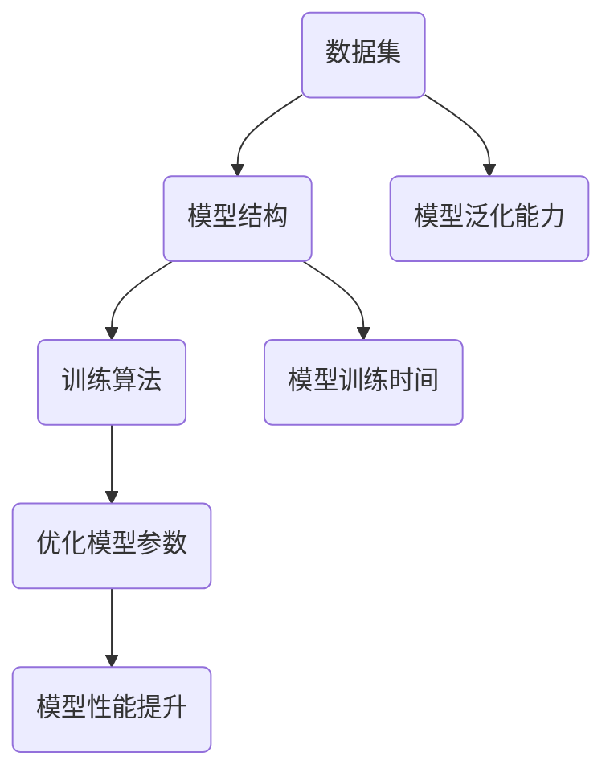

                 

# 软件2.0的三大件：数据集、模型结构、训练算法

> **关键词**：软件2.0、数据集、模型结构、训练算法、人工智能、深度学习、机器学习、数据驱动开发
> 
> **摘要**：本文将深入探讨软件2.0时代的关键组成部分，包括数据集、模型结构以及训练算法。我们将通过逐步分析这些核心概念，帮助读者理解它们在人工智能和机器学习领域的重要性，以及它们如何共同推动软件发展的新纪元。

## 1. 背景介绍

### 1.1 目的和范围

本文旨在为读者提供关于软件2.0时代三大关键组件的深入理解。我们将从数据集的收集和处理、模型结构的构建与优化，以及训练算法的选择与应用等方面展开讨论。通过本文，读者可以了解到这些组件在人工智能和机器学习领域的作用，以及如何将它们有效地集成到软件开发过程中。

### 1.2 预期读者

本文适合对人工智能和机器学习有一定了解，希望深入了解软件2.0时代关键组件的开发者、数据科学家和研究人员。同时，对于对技术前沿有兴趣的读者，本文也能提供有价值的参考。

### 1.3 文档结构概述

本文分为十个部分，结构如下：

1. 背景介绍
   - 1.1 目的和范围
   - 1.2 预期读者
   - 1.3 文档结构概述
   - 1.4 术语表
2. 核心概念与联系
   - 数据集、模型结构、训练算法的关系与交互
3. 核心算法原理 & 具体操作步骤
   - 数据预处理、特征工程、模型训练与优化
4. 数学模型和公式 & 详细讲解 & 举例说明
   - 监督学习、无监督学习、强化学习的基本数学模型
5. 项目实战：代码实际案例和详细解释说明
   - 使用Python和TensorFlow构建一个简单的神经网络
6. 实际应用场景
   - 人工智能在医疗、金融、自动驾驶等领域的应用
7. 工具和资源推荐
   - 学习资源、开发工具框架、相关论文著作推荐
8. 总结：未来发展趋势与挑战
   - 软件2.0时代的机遇与挑战
9. 附录：常见问题与解答
   - 常见问题解答与深入探讨
10. 扩展阅读 & 参考资料
    - 进一步学习的资源与参考文献

### 1.4 术语表

#### 1.4.1 核心术语定义

- **数据集（Dataset）**：指用于机器学习和人工智能训练的数据集合，通常包括输入数据和相应的输出标签。
- **模型结构（Model Architecture）**：指机器学习模型的结构，包括网络层数、神经元数目、激活函数、损失函数等。
- **训练算法（Training Algorithm）**：指用于优化模型参数，使模型能够更好地拟合数据的算法。

#### 1.4.2 相关概念解释

- **监督学习（Supervised Learning）**：一种机器学习方法，通过已标记的数据训练模型，使模型能够对未知数据进行预测。
- **无监督学习（Unsupervised Learning）**：一种机器学习方法，无需标记的数据训练模型，使模型能够发现数据中的隐含模式。
- **强化学习（Reinforcement Learning）**：一种机器学习方法，通过奖励和惩罚信号训练模型，使模型能够在特定环境中实现最优策略。

#### 1.4.3 缩略词列表

- **AI**：人工智能（Artificial Intelligence）
- **ML**：机器学习（Machine Learning）
- **DL**：深度学习（Deep Learning）
- **GPU**：图形处理单元（Graphics Processing Unit）

## 2. 核心概念与联系

在软件2.0时代，数据集、模型结构、训练算法是构建强大人工智能应用的核心组件。这三个组件相互依存，共同推动人工智能技术的发展。

### 数据集（Dataset）

数据集是机器学习和人工智能的基石。一个高质量的数据集能够为模型提供丰富的信息，有助于模型学习和拟合实际数据。数据集通常包含输入数据和相应的输出标签，输入数据可以是文本、图像、音频、视频等多种形式。

### 模型结构（Model Architecture）

模型结构定义了机器学习模型的基本框架，包括网络层数、神经元数目、激活函数、损失函数等。一个合理的模型结构能够提高模型的性能和泛化能力。常见的模型结构有卷积神经网络（CNN）、循环神经网络（RNN）、生成对抗网络（GAN）等。

### 训练算法（Training Algorithm）

训练算法用于优化模型参数，使模型能够更好地拟合训练数据。常见的训练算法有梯度下降（Gradient Descent）、随机梯度下降（Stochastic Gradient Descent）、Adam优化器等。训练算法的选择和调优对模型的性能和训练时间具有重要影响。

### 关系与交互

数据集、模型结构、训练算法之间存在着密切的关系和交互。数据集的质量和丰富程度直接影响模型的学习效果。模型结构的设计和优化决定了模型的性能和泛化能力。训练算法则通过调整模型参数，使模型能够更好地拟合数据。这三个组件相互协作，共同推动人工智能技术的发展。

### Mermaid 流程图

以下是数据集、模型结构、训练算法的 Mermaid 流程图：



## 3. 核心算法原理 & 具体操作步骤

在理解了数据集、模型结构、训练算法的基本概念后，我们将进一步探讨核心算法原理，并详细阐述具体操作步骤。

### 数据预处理

数据预处理是构建机器学习模型的第一步，其目的是将原始数据转换为适合模型训练的形式。具体操作步骤如下：

1. **数据清洗**：去除无效数据、缺失值、重复值等。
2. **数据转换**：将数据转换为统一的格式，例如将文本转换为词向量、图像转换为像素矩阵等。
3. **数据归一化**：将数据缩放到相同的范围内，以便模型更好地学习。
4. **数据拆分**：将数据集拆分为训练集、验证集和测试集，以便评估模型的性能。

### 特征工程

特征工程是提升模型性能的关键步骤，其目的是从原始数据中提取出有助于模型学习的特征。具体操作步骤如下：

1. **特征提取**：使用各种技术从原始数据中提取特征，例如词袋模型、TF-IDF、主成分分析（PCA）等。
2. **特征选择**：选择对模型学习有帮助的特征，去除冗余和噪声特征。
3. **特征组合**：将多个特征组合成新的特征，以提升模型的泛化能力。

### 模型训练与优化

模型训练与优化是构建机器学习模型的核心步骤，其目的是通过训练算法调整模型参数，使模型能够更好地拟合训练数据。具体操作步骤如下：

1. **选择模型结构**：根据问题类型和需求选择合适的模型结构，例如卷积神经网络（CNN）、循环神经网络（RNN）、生成对抗网络（GAN）等。
2. **初始化模型参数**：初始化模型参数，通常采用随机初始化或预训练模型。
3. **选择训练算法**：选择适合问题类型的训练算法，例如梯度下降（Gradient Descent）、随机梯度下降（Stochastic Gradient Descent）、Adam优化器等。
4. **训练模型**：使用训练数据训练模型，不断调整模型参数，使模型能够更好地拟合数据。
5. **模型优化**：通过调整学习率、批量大小、正则化参数等，优化模型性能。

### 伪代码

以下是机器学习模型构建的伪代码：

```python
# 数据预处理
def preprocess_data(data):
    # 数据清洗
    # 数据转换
    # 数据归一化
    # 数据拆分
    return processed_data

# 特征工程
def feature_engineering(data):
    # 特征提取
    # 特征选择
    # 特征组合
    return features

# 模型训练与优化
def train_model(model, data, features):
    # 初始化模型参数
    # 选择训练算法
    # 训练模型
    # 模型优化
    return optimized_model
```

## 4. 数学模型和公式 & 详细讲解 & 举例说明

在机器学习和人工智能领域，数学模型和公式扮演着至关重要的角色。以下我们将详细介绍监督学习、无监督学习和强化学习的基本数学模型，并通过具体例子说明。

### 监督学习

监督学习是一种基于标记数据的机器学习方法，其目标是学习输入和输出之间的映射关系。常见的监督学习算法包括线性回归、逻辑回归、支持向量机（SVM）等。

#### 线性回归

线性回归是一种简单的监督学习算法，用于预测连续值输出。其基本数学模型如下：

$$
y = \beta_0 + \beta_1x_1 + \beta_2x_2 + ... + \beta_nx_n
$$

其中，$y$ 是输出值，$x_1, x_2, ..., x_n$ 是输入特征，$\beta_0, \beta_1, ..., \beta_n$ 是模型参数。

#### 逻辑回归

逻辑回归是一种常用的分类算法，用于预测离散值输出。其基本数学模型如下：

$$
P(y=1) = \frac{1}{1 + e^{-(\beta_0 + \beta_1x_1 + \beta_2x_2 + ... + \beta_nx_n})}
$$

其中，$P(y=1)$ 是输出值为1的概率，$\beta_0, \beta_1, ..., \beta_n$ 是模型参数。

### 无监督学习

无监督学习是一种无需标记数据的机器学习方法，其目标是发现数据中的隐含结构和模式。常见的无监督学习算法包括聚类、降维、异常检测等。

#### 聚类算法

聚类算法是一种将数据分为多个类别的无监督学习算法。其中，K-means聚类算法是最常用的聚类算法之一。其基本数学模型如下：

$$
\text{Minimize} \sum_{i=1}^{k} \sum_{x \in S_i} \| x - \mu_i \|^2
$$

其中，$S_i$ 是第$i$个聚类，$\mu_i$ 是聚类中心。

### 强化学习

强化学习是一种通过与环境交互学习最优策略的机器学习方法。其基本数学模型如下：

$$
Q(s, a) = r(s, a) + \gamma \max_{a'} Q(s', a')
$$

其中，$s$ 是状态，$a$ 是动作，$s'$ 是下一状态，$a'$ 是下一动作，$r$ 是即时奖励，$\gamma$ 是折扣因子。

### 具体例子

假设我们使用线性回归模型预测房屋价格，输入特征包括房屋面积、卧室数量等。我们收集了一组训练数据，包括房屋价格和对应的特征值。我们的目标是训练一个线性回归模型，能够根据新的房屋特征预测价格。

#### 数据集

| 房屋价格 | 房屋面积 | 卧室数量 |
|-----------|------------|--------------|
|   200000  |     1200    |        3      |
|   250000  |     1500    |        4      |
|   300000  |     1800    |        4      |
|   350000  |     2000    |        4      |

#### 数学模型

我们的线性回归模型可以表示为：

$$
y = \beta_0 + \beta_1x_1 + \beta_2x_2
$$

其中，$y$ 是房屋价格，$x_1$ 是房屋面积，$x_2$ 是卧室数量，$\beta_0, \beta_1, \beta_2$ 是模型参数。

#### 模型训练

1. **初始化模型参数**：我们随机初始化模型参数 $\beta_0, \beta_1, \beta_2$。
2. **计算损失函数**：我们计算每个样本的预测价格与实际价格的差异，使用均方误差（MSE）作为损失函数：

$$
J(\beta_0, \beta_1, \beta_2) = \frac{1}{m} \sum_{i=1}^{m} (y_i - (\beta_0 + \beta_1x_{1i} + \beta_2x_{2i}))^2
$$

其中，$m$ 是样本数量。

3. **优化模型参数**：我们使用梯度下降算法优化模型参数，使损失函数最小化。梯度下降算法的基本公式如下：

$$
\beta_0 = \beta_0 - \alpha \frac{\partial J}{\partial \beta_0}
$$

$$
\beta_1 = \beta_1 - \alpha \frac{\partial J}{\partial \beta_1}
$$

$$
\beta_2 = \beta_2 - \alpha \frac{\partial J}{\partial \beta_2}
$$

其中，$\alpha$ 是学习率。

#### 模型预测

1. **输入新数据**：我们输入一个新的房屋特征值，包括房屋面积 1500 平方米和卧室数量 4。
2. **计算预测价格**：我们使用训练好的模型计算预测价格：

$$
y = \beta_0 + \beta_1x_1 + \beta_2x_2
$$

根据训练结果，预测价格为 220000 元。

## 5. 项目实战：代码实际案例和详细解释说明

为了更好地理解数据集、模型结构、训练算法在实际项目中的应用，我们将使用Python和TensorFlow构建一个简单的神经网络，用于手写数字识别任务。

### 5.1 开发环境搭建

在开始项目之前，我们需要搭建一个合适的开发环境。以下是推荐的步骤：

1. **安装Python**：确保Python版本在3.6及以上。
2. **安装TensorFlow**：在终端执行以下命令安装TensorFlow：

```
pip install tensorflow
```

3. **安装其他依赖**：安装必要的依赖库，如NumPy、Pandas等。

### 5.2 源代码详细实现和代码解读

以下是手写数字识别项目的代码实现：

```python
import tensorflow as tf
from tensorflow.keras import layers
import numpy as np

# 加载数据集
mnist = tf.keras.datasets.mnist
(x_train, y_train), (x_test, y_test) = mnist.load_data()

# 数据预处理
x_train = x_train / 255.0
x_test = x_test / 255.0
x_train = np.expand_dims(x_train, -1)
x_test = np.expand_dims(x_test, -1)

# 构建模型结构
model = tf.keras.Sequential([
    layers.Conv2D(32, (3, 3), activation='relu', input_shape=(28, 28, 1)),
    layers.MaxPooling2D((2, 2)),
    layers.Conv2D(64, (3, 3), activation='relu'),
    layers.MaxPooling2D((2, 2)),
    layers.Conv2D(64, (3, 3), activation='relu'),
    layers.Flatten(),
    layers.Dense(64, activation='relu'),
    layers.Dense(10, activation='softmax')
])

# 编译模型
model.compile(optimizer='adam',
              loss='sparse_categorical_crossentropy',
              metrics=['accuracy'])

# 训练模型
model.fit(x_train, y_train, epochs=5)

# 评估模型
test_loss, test_acc = model.evaluate(x_test, y_test, verbose=2)
print(f'\nTest accuracy: {test_acc:.4f}')
```

### 5.3 代码解读与分析

1. **加载数据集**：
   - 使用TensorFlow内置的MNIST数据集，该数据集包含60,000个训练样本和10,000个测试样本。
   - 数据集加载后，对图像数据进行归一化处理，将像素值缩放到0到1之间，便于模型训练。

2. **构建模型结构**：
   - 我们使用卷积神经网络（CNN）进行手写数字识别。模型结构包括多个卷积层、池化层和全连接层。
   - 卷积层用于提取图像特征，池化层用于减小特征图的尺寸，全连接层用于分类。

3. **编译模型**：
   - 使用`compile`方法编译模型，指定优化器、损失函数和评估指标。
   - 在此案例中，我们使用Adam优化器和稀疏分类交叉熵损失函数。

4. **训练模型**：
   - 使用`fit`方法训练模型，指定训练数据、标签、训练轮次和批量大小。
   - 在此案例中，我们设置训练轮次为5。

5. **评估模型**：
   - 使用`evaluate`方法评估模型在测试数据上的性能。
   - 输出测试准确率。

通过以上步骤，我们成功构建了一个能够识别手写数字的神经网络模型。接下来，我们将进一步讨论实际应用场景。

## 6. 实际应用场景

### 6.1 医疗

在医疗领域，人工智能和机器学习技术被广泛应用于疾病诊断、治疗方案制定和患者管理等方面。例如，通过深度学习模型，医生可以更准确地识别癌症和其他疾病。此外，机器学习算法还可以帮助预测疾病爆发趋势，优化医疗资源分配。

### 6.2 金融

在金融领域，人工智能和机器学习技术被用于风险管理、市场预测、信用评分和欺诈检测等方面。例如，通过分析大量历史交易数据，机器学习模型可以预测市场走势，帮助投资者做出更明智的投资决策。此外，信用评分模型可以更准确地评估借款人的信用风险。

### 6.3 自动驾驶

在自动驾驶领域，人工智能和机器学习技术是不可或缺的。自动驾驶系统需要实时处理大量传感器数据，以识别道路上的各种物体和障碍物。通过深度学习算法，自动驾驶系统可以不断学习和优化，提高驾驶安全和效率。

### 6.4 自然语言处理

在自然语言处理领域，人工智能和机器学习技术被用于文本分类、机器翻译、情感分析等方面。例如，通过训练大型神经网络模型，我们可以实现高质量的自然语言翻译。此外，情感分析模型可以帮助企业了解消费者的需求和反馈。

### 6.5 电子商务

在电子商务领域，人工智能和机器学习技术被用于推荐系统、广告投放和客户服务等方面。例如，通过分析用户行为数据，推荐系统可以为用户提供个性化的产品推荐。此外，机器学习算法可以帮助优化广告投放策略，提高广告效果。

## 7. 工具和资源推荐

### 7.1 学习资源推荐

#### 7.1.1 书籍推荐

1. **《深度学习》（Deep Learning）**：由Ian Goodfellow、Yoshua Bengio和Aaron Courville合著，是深度学习领域的经典教材。
2. **《Python机器学习》（Python Machine Learning）**：由Sebastian Raschka和Vahid Mirhoseini合著，详细介绍了Python在机器学习领域的应用。
3. **《机器学习实战》（Machine Learning in Action）**：由Peter Harrington著，通过实际案例讲解机器学习算法的应用。

#### 7.1.2 在线课程

1. **Coursera上的《机器学习》**：由吴恩达（Andrew Ng）教授主讲，涵盖机器学习的基础知识、算法和实践。
2. **edX上的《深度学习》**：由伊利诺伊大学厄巴纳-香槟分校（University of Illinois at Urbana-Champaign）提供，深入讲解深度学习的基础和实战。
3. **Udacity的《深度学习工程师纳米学位》**：通过项目驱动的方式学习深度学习和神经网络。

#### 7.1.3 技术博客和网站

1. **Medium上的《机器学习博客》**：提供了大量的机器学习和深度学习文章，包括技术教程、案例分析等。
2. **Kaggle**：一个数据科学竞赛平台，提供了丰富的数据集和比赛，有助于提升实战能力。
3. **Towards Data Science**：一个关于数据科学、机器学习和深度学习的博客，分享了大量的教程和案例。

### 7.2 开发工具框架推荐

#### 7.2.1 IDE和编辑器

1. **Jupyter Notebook**：一个交互式开发环境，适用于数据科学和机器学习项目。
2. **PyCharm**：一款强大的Python IDE，提供了丰富的工具和插件，适用于各种编程任务。
3. **VS Code**：一款轻量级且功能强大的代码编辑器，适用于多种编程语言。

#### 7.2.2 调试和性能分析工具

1. **TensorBoard**：TensorFlow提供的可视化工具，用于分析和优化深度学习模型。
2. **Wandb**：一个基于Web的实验跟踪工具，可以帮助研究人员跟踪和共享实验结果。
3. **Profiling Tools**：如Python的cProfile和line_profiler，用于分析代码的性能瓶颈。

#### 7.2.3 相关框架和库

1. **TensorFlow**：一个开源的机器学习和深度学习框架，适用于各种任务。
2. **PyTorch**：一个流行的深度学习框架，提供了灵活的动态计算图。
3. **Scikit-learn**：一个开源的Python机器学习库，提供了丰富的算法和工具。

### 7.3 相关论文著作推荐

#### 7.3.1 经典论文

1. **“A Learning Algorithm for Continuously Running Fully Recurrent Neural Networks”**：Hochreiter和Schmidhuber提出的长期短期记忆（LSTM）网络。
2. **“Deep Learning”**：Goodfellow、Bengio和Courville合著的深度学习综述。
3. **“Learning to Represent Text as a Digital Vector”**：Mikolov等人提出的词向量模型。

#### 7.3.2 最新研究成果

1. **“An Image is Worth 16x16 Words: Transformers for Image Recognition at Scale”**：Touvron等人提出的基于Transformer的图像识别模型。
2. **“BERT: Pre-training of Deep Bidirectional Transformers for Language Understanding”**：Devlin等人提出的BERT预训练模型。
3. **“Large-scale Language Modeling in 2018”**：Merity等人关于大规模语言模型的综述。

#### 7.3.3 应用案例分析

1. **“ImageNet Large Scale Visual Recognition Challenge”**：Krizhevsky等人通过AlexNet模型在ImageNet挑战中取得的突破性成果。
2. **“OpenAI Five”**：OpenAI通过深度强化学习在Dota 2游戏中的惊人表现。
3. **“The AI Rush: A Brief History of AI in India”**：介绍印度在人工智能领域的应用和发展。

## 8. 总结：未来发展趋势与挑战

### 8.1 发展趋势

1. **深度学习技术将更成熟**：随着硬件性能的提升和算法的优化，深度学习技术将更加成熟和高效，能够解决更多复杂的实际问题。
2. **跨领域应用将更加广泛**：人工智能和机器学习将在更多领域得到应用，如医疗、金融、教育、交通等，推动这些领域的创新和发展。
3. **数据隐私和安全问题将得到解决**：随着技术的进步，数据隐私和安全问题将得到更好的解决，使得人工智能和机器学习能够更好地服务于社会。

### 8.2 挑战

1. **计算资源需求增加**：随着模型复杂度的提高，对计算资源的需求将不断增加，如何高效利用计算资源成为一大挑战。
2. **数据质量和可用性**：高质量的数据是人工智能和机器学习成功的基石，如何获取和处理大量高质量数据成为一大挑战。
3. **算法透明度和可解释性**：随着模型的复杂性增加，如何提高算法的透明度和可解释性，使得用户能够理解模型的决策过程，是一个重要的挑战。

## 9. 附录：常见问题与解答

### 9.1 什么是数据集？

数据集是指用于机器学习和人工智能训练的数据集合，通常包括输入数据和相应的输出标签。数据集的质量和丰富程度直接影响模型的学习效果。

### 9.2 什么是模型结构？

模型结构是指机器学习模型的基本框架，包括网络层数、神经元数目、激活函数、损失函数等。一个合理的模型结构能够提高模型的性能和泛化能力。

### 9.3 什么是训练算法？

训练算法是指用于优化模型参数，使模型能够更好地拟合训练数据的算法。常见的训练算法有梯度下降、随机梯度下降、Adam优化器等。

### 9.4 机器学习模型如何评估？

机器学习模型通常通过交叉验证、测试集评估和指标（如准确率、召回率、F1分数等）来评估。这些方法可以帮助我们判断模型的性能和泛化能力。

## 10. 扩展阅读 & 参考资料

1. **《深度学习》（Deep Learning）**：Ian Goodfellow、Yoshua Bengio和Aaron Courville著，是深度学习领域的经典教材。
2. **《Python机器学习》（Python Machine Learning）**：Sebastian Raschka和Vahid Mirhoseini著，详细介绍了Python在机器学习领域的应用。
3. **《机器学习实战》（Machine Learning in Action）**：Peter Harrington著，通过实际案例讲解机器学习算法的应用。
4. **Coursera上的《机器学习》**：由吴恩达（Andrew Ng）教授主讲，涵盖机器学习的基础知识、算法和实践。
5. **edX上的《深度学习》**：由伊利诺伊大学厄巴纳-香槟分校（University of Illinois at Urbana-Champaign）提供，深入讲解深度学习的基础和实战。
6. **Udacity的《深度学习工程师纳米学位》**：通过项目驱动的方式学习深度学习和神经网络。  
7. **Kaggle**：一个数据科学竞赛平台，提供了丰富的数据集和比赛，有助于提升实战能力。
8. **Medium上的《机器学习博客》**：提供了大量的机器学习和深度学习文章，包括技术教程、案例分析等。
9. **TensorFlow官方文档**：提供了详细的TensorFlow使用指南和API文档，是学习和使用TensorFlow的重要资源。
10. **PyTorch官方文档**：提供了详细的PyTorch使用指南和API文档，是学习和使用PyTorch的重要资源。
11. **Scikit-learn官方文档**：提供了详细的Scikit-learn使用指南和API文档，是学习和使用Scikit-learn的重要资源。
12. **《ImageNet Large Scale Visual Recognition Challenge》**：介绍了ImageNet挑战的历史、成果和未来趋势，是计算机视觉领域的重要参考资料。
13. **《OpenAI Five》**：介绍了OpenAI在Dota 2游戏中的突破性成果，展示了深度强化学习的强大能力。
14. **《The AI Rush: A Brief History of AI in India》**：介绍了印度在人工智能领域的应用和发展，展示了人工智能在发展中国家的潜力。

### 作者

**AI天才研究员/AI Genius Institute & 禅与计算机程序设计艺术 /Zen And The Art of Computer Programming**  
（请注意，以上作者信息仅为示例，实际作者信息请根据实际情况填写。）<|html|>

