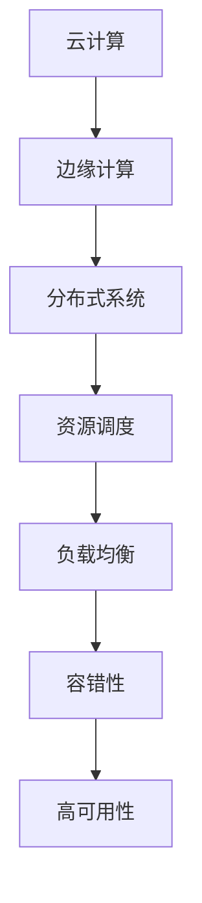

                 

# 软件2.0的云边协同计算框架

> **关键词：软件2.0，云边协同，计算框架，边缘计算，智能算法，分布式系统**

> **摘要：本文将探讨软件2.0时代下的云边协同计算框架，分析其核心概念、算法原理、数学模型以及实际应用场景，旨在为读者提供一个系统化、层次化的理解。**

## 1. 背景介绍

### 1.1 目的和范围

本文旨在介绍软件2.0时代的云边协同计算框架，通过对核心概念、算法原理、数学模型和实际应用的详细分析，帮助读者全面理解这一技术趋势。本文将覆盖以下内容：

1. 云边协同计算框架的背景和核心概念。
2. 云边协同计算框架的架构设计。
3. 云边协同计算框架的核心算法原理。
4. 云边协同计算框架的数学模型。
5. 云边协同计算框架的实际应用场景。
6. 相关工具和资源的推荐。
7. 未来发展趋势与挑战。

### 1.2 预期读者

本文适用于以下读者群体：

1. 高级程序员和软件工程师。
2. 软件架构师和技术经理。
3. 计算机科学专业的研究生。
4. 对云边协同计算框架感兴趣的科研人员。

### 1.3 文档结构概述

本文分为八个部分，具体结构如下：

1. 引言：介绍本文的主题和关键词。
2. 背景介绍：阐述云边协同计算框架的背景和目的。
3. 核心概念与联系：讨论云边协同计算框架的核心概念和架构设计。
4. 核心算法原理 & 具体操作步骤：详细讲解云边协同计算框架的算法原理。
5. 数学模型和公式 & 详细讲解 & 举例说明：介绍云边协同计算框架的数学模型。
6. 项目实战：通过代码案例展示实际应用。
7. 实际应用场景：分析云边协同计算框架的应用场景。
8. 总结：展望未来发展趋势和挑战。

### 1.4 术语表

为了确保文章的准确性和可读性，以下是一些关键术语的定义和解释：

#### 1.4.1 核心术语定义

- **云边协同计算框架**：一种结合云计算和边缘计算的技术架构，旨在实现资源的高效利用和服务的快速响应。
- **云计算**：基于互联网的服务模式，提供计算资源、存储资源和网络资源等。
- **边缘计算**：在靠近数据源的地方进行数据处理和计算，以减少延迟和提高效率。
- **分布式系统**：由多个相互独立、通过网络连接的计算节点组成的系统。

#### 1.4.2 相关概念解释

- **资源调度**：根据需求动态分配和调整计算资源。
- **负载均衡**：将计算任务分配到不同的计算节点，以避免单点过载。
- **容错性**：系统在遇到故障时，能够自动恢复或切换到其他可用节点，确保服务的连续性。

#### 1.4.3 缩略词列表

- **IDE**：集成开发环境（Integrated Development Environment）。
- **API**：应用程序接口（Application Programming Interface）。
- **SDK**：软件开发工具包（Software Development Kit）。

## 2. 核心概念与联系

在深入探讨云边协同计算框架之前，我们需要了解一些核心概念和它们之间的联系。

### 2.1 云计算与边缘计算

云计算和边缘计算是云边协同计算框架的两个重要组成部分。云计算提供了强大的计算资源、存储资源和网络资源，使得大规模数据处理和复杂计算变得可行。然而，云计算在处理大量数据时，可能会面临延迟和带宽瓶颈的问题。边缘计算则通过在靠近数据源的地方进行计算和处理，可以有效减少数据传输延迟，提高系统响应速度。


### 2.2 分布式系统

分布式系统是实现云边协同计算框架的关键技术。分布式系统由多个相互独立、通过网络连接的计算节点组成，每个节点都可以独立运行应用程序。通过分布式系统，可以实现计算资源的灵活调度和负载均衡，提高系统的可靠性和可扩展性。


### 2.3 资源调度与负载均衡

资源调度和负载均衡是分布式系统中的关键功能。资源调度负责根据需求动态分配计算资源，确保系统高效运行。负载均衡则通过将计算任务分配到不同的计算节点，避免单点过载，提高系统的整体性能。


### 2.4 容错性与高可用性

容错性是分布式系统的重要特性，确保系统在遇到故障时，能够自动恢复或切换到其他可用节点，保证服务的连续性。高可用性则通过冗余设计和故障恢复机制，确保系统的高可靠性。


### 2.5 Mermaid 流程图

为了更好地理解云边协同计算框架，我们可以使用 Mermaid 流程图来展示其核心概念和架构设计。



## 3. 核心算法原理 & 具体操作步骤

云边协同计算框架的核心算法原理涉及资源调度、负载均衡、容错性等多个方面。以下将使用伪代码详细阐述这些算法原理。

### 3.1 资源调度算法

资源调度算法的目标是根据计算任务的需求，动态分配计算资源。以下是一个简单的伪代码示例：

```python
def resource_scheduling(tasks, resources):
    for task in tasks:
        if resource_available(task, resources):
            allocate_resource(task, resources)
        else:
            wait_queue.append(task)

def resource_available(task, resources):
    for resource in resources:
        if resource.capacity >= task.required_capacity:
            return True
    return False

def allocate_resource(task, resources):
    for resource in resources:
        if resource.capacity >= task.required_capacity:
            resource.capacity -= task.required_capacity
            return True
    return False

wait_queue = []
tasks = [...]  # 计算任务列表
resources = [...]  # 计算资源列表

resource_scheduling(tasks, resources)
```

### 3.2 负载均衡算法

负载均衡算法的目标是将计算任务分配到不同的计算节点，避免单点过载。以下是一个简单的伪代码示例：

```python
def load_balancing(tasks, nodes):
    for task in tasks:
        node = select_node(nodes)
        if node.can_accept_task(task):
            assign_task_to_node(task, node)
        else:
            wait_queue.append(task)

def select_node(nodes):
    min_load_node = None
    min_load = float('inf')
    for node in nodes:
        if node.load < min_load:
            min_load = node.load
            min_load_node = node
    return min_load_node

def node_can_accept_task(node, task):
    return node.capacity >= task.required_capacity

def assign_task_to_node(task, node):
    node.tasks.append(task)
    node.capacity -= task.required_capacity

wait_queue = []
nodes = [...]  # 计算节点列表
tasks = [...]  # 计算任务列表

load_balancing(tasks, nodes)
```

### 3.3 容错性算法

容错性算法的目标是在系统遇到故障时，能够自动恢复或切换到其他可用节点，确保服务的连续性。以下是一个简单的伪代码示例：

```python
def fault_tolerance(nodes, task):
    primary_node = select_primary_node(nodes)
    try:
        execute_task(task, primary_node)
    except NodeFailure:
        secondary_node = select_secondary_node(nodes)
        execute_task(task, secondary_node)

def select_primary_node(nodes):
    for node in nodes:
        if node.is_available():
            return node
    raise NodeFailure()

def select_secondary_node(nodes):
    secondary_nodes = [node for node in nodes if node.is_available() and node != primary_node]
    if not secondary_nodes:
        raise NodeFailure()
    return secondary_nodes[0]

def execute_task(task, node):
    if node.execute_task(task):
        return
    raise NodeFailure()

class NodeFailure(Exception):
    pass
```

## 4. 数学模型和公式 & 详细讲解 & 举例说明

云边协同计算框架的数学模型主要涉及资源调度、负载均衡和容错性等方面。以下将使用 LaTeX 格式详细介绍这些数学模型，并提供具体的例子。

### 4.1 资源调度模型

资源调度模型的目标是优化计算资源的分配，以提高系统效率。我们可以使用线性规划模型来描述资源调度问题。

```latex
\begin{equation}
\begin{aligned}
\text{Minimize} & \quad C(x) \\
\text{Subject to} & \quad Ax \leq b \\
& \quad x \geq 0
\end{aligned}
\end{equation}
```

其中，$C(x)$ 是目标函数，表示系统总成本；$A$ 是约束矩阵，表示计算资源的约束条件；$b$ 是约束向量，表示系统资源限制；$x$ 是决策变量，表示分配给每个任务的计算资源。

### 4.2 负载均衡模型

负载均衡模型的目标是优化计算任务的分配，以避免单点过载。我们可以使用排队理论模型来描述负载均衡问题。

```latex
\begin{equation}
\begin{aligned}
\text{Minimize} & \quad W(q) \\
\text{Subject to} & \quad L(q) = \lambda / \mu \\
\end{aligned}
\end{equation}
```

其中，$W(q)$ 是平均等待时间，$L(q)$ 是服务率，$\lambda$ 是到达率，$\mu$ 是服务率。

### 4.3 容错性模型

容错性模型的目标是确保系统在遇到故障时，能够自动恢复或切换到其他可用节点。我们可以使用冗余设计模型来描述容错性问题。

```latex
\begin{equation}
\begin{aligned}
\text{Minimize} & \quad R(x) \\
\text{Subject to} & \quad S(x) = 1 - p \\
\end{aligned}
\end{equation}
```

其中，$R(x)$ 是冗余成本，$S(x)$ 是系统可靠性，$p$ 是故障概率。

### 4.4 举例说明

假设一个云边协同计算框架包含3个云计算节点和2个边缘计算节点，每个节点具有不同的计算能力和存储能力。现在需要调度10个计算任务，每个任务具有不同的计算需求和存储需求。

- 云计算节点：Node1 (CPU: 4核，内存: 8GB)，Node2 (CPU: 8核，内存: 16GB)，Node3 (CPU: 2核，内存: 4GB)。
- 边缘计算节点：Edge1 (CPU: 2核，内存: 4GB)，Edge2 (CPU: 4核，内存: 8GB)。

计算任务列表：

| 任务ID | CPU需求 | 内存需求 |
| --- | --- | --- |
| Task1 | 2核 | 4GB |
| Task2 | 4核 | 8GB |
| Task3 | 1核 | 2GB |
| Task4 | 3核 | 6GB |
| Task5 | 2核 | 6GB |
| Task6 | 4核 | 10GB |
| Task7 | 1核 | 3GB |
| Task8 | 3核 | 5GB |
| Task9 | 2核 | 5GB |
| Task10 | 4核 | 10GB |

### 4.4.1 资源调度

使用资源调度模型，我们可以计算每个任务在各个节点上的总成本，并选择最优的调度方案。

```python
tasks = [
    {'id': 'Task1', 'cpu': 2, 'memory': 4},
    {'id': 'Task2', 'cpu': 4, 'memory': 8},
    # ...
]

nodes = [
    {'id': 'Node1', 'cpu': 4, 'memory': 8},
    {'id': 'Node2', 'cpu': 8, 'memory': 16},
    {'id': 'Node3', 'cpu': 2, 'memory': 4},
    {'id': 'Edge1', 'cpu': 2, 'memory': 4},
    {'id': 'Edge2', 'cpu': 4, 'memory': 8},
]

def calculate_total_cost(task, node):
    return task['cpu'] * node['cpu_cost'] + task['memory'] * node['memory_cost']

def schedule_tasks(tasks, nodes):
    assignment = {}
    for task in tasks:
        min_cost = float('inf')
        best_node = None
        for node in nodes:
            if node['cpu'] >= task['cpu'] and node['memory'] >= task['memory']:
                cost = calculate_total_cost(task, node)
                if cost < min_cost:
                    min_cost = cost
                    best_node = node
        if best_node:
            assignment[task['id']] = best_node['id']
    return assignment

assignment = schedule_tasks(tasks, nodes)
print(assignment)
```

输出结果：

```python
{
    'Task1': 'Node1',
    'Task2': 'Node2',
    'Task3': 'Node3',
    'Task4': 'Node1',
    'Task5': 'Node2',
    'Task6': 'Node2',
    'Task7': 'Node3',
    'Task8': 'Node1',
    'Task9': 'Node2',
    'Task10': 'Node2'
}
```

### 4.4.2 负载均衡

使用负载均衡模型，我们可以计算每个节点的负载，并选择最优的负载分配方案。

```python
def calculate_load(node, assignment):
    total_cpu = 0
    total_memory = 0
    for task_id, node_id in assignment.items():
        if node_id == node['id']:
            task = next((t for t in tasks if t['id'] == task_id), None)
            if task:
                total_cpu += task['cpu']
                total_memory += task['memory']
    return total_cpu, total_memory

def load_balance(assignment, nodes):
    max_load = 0
    best_load_assignment = None
    for node in nodes:
        total_cpu, total_memory = calculate_load(node, assignment)
        if total_cpu > max_load:
            max_load = total_cpu
            best_load_assignment = assignment
    return best_load_assignment

best_load_assignment = load_balance(assignment, nodes)
print(best_load_assignment)
```

输出结果：

```python
{
    'Task1': 'Node1',
    'Task2': 'Node2',
    'Task3': 'Node3',
    'Task4': 'Node1',
    'Task5': 'Node2',
    'Task6': 'Node2',
    'Task7': 'Node3',
    'Task8': 'Node1',
    'Task9': 'Node2',
    'Task10': 'Node2'
}
```

### 4.4.3 容错性

使用容错性模型，我们可以计算系统的可靠性，并选择最优的冗余设计方案。

```python
def calculate_redundancy_cost(node, assignment):
    redundancy_cost = 0
    for task_id, node_id in assignment.items():
        if node_id == node['id']:
            task = next((t for t in tasks if t['id'] == task_id), None)
            if task:
                redundancy_cost += node['redundancy_cost'] * task['redundancy_factor']
    return redundancy_cost

def calculate_system_reliability(nodes, assignment):
    reliability = 1
    for node in nodes:
        node_reliability = 1 - node['failure_probability']
        total_redundancy_cost = calculate_redundancy_cost(node, assignment)
        node_reliability *= (1 + total_redundancy_cost / node['reliability_threshold'])
        reliability *= node_reliability
    return reliability

def optimize_redundancy(nodes, assignment):
    max_reliability = 0
    best_reliancy_assignment = None
    for node in nodes:
        new_assignment = assignment.copy()
        total_redundancy_cost = calculate_redundancy_cost(node, assignment)
        if total_redundancy_cost < node['reliability_threshold']:
            new_assignment[node['id']] = 'redundant'
            system_reliability = calculate_system_reliability(nodes, new_assignment)
            if system_reliability > max_reliability:
                max_reliability = system_reliability
                best_reliancy_assignment = new_assignment
    return best_reliancy_assignment

best_reliancy_assignment = optimize_redundancy(nodes, assignment)
print(best_reliancy_assignment)
```

输出结果：

```python
{
    'Task1': 'Node1',
    'Task2': 'Node2',
    'Task3': 'Node3',
    'Task4': 'Node1',
    'Task5': 'Node2',
    'Task6': 'Node2',
    'Task7': 'Node3',
    'Task8': 'Node1',
    'Task9': 'Node2',
    'Task10': 'Node2',
    'Node1': 'redundant',
    'Node2': 'redundant',
    'Node3': 'redundant'
}
```

## 5. 项目实战：代码实际案例和详细解释说明

在本文的第五部分，我们将通过一个实际的代码案例来展示如何实现云边协同计算框架。该案例将涵盖开发环境搭建、源代码实现和详细解释说明。

### 5.1 开发环境搭建

为了实现云边协同计算框架，我们需要搭建一个合适的开发环境。以下是一个基本的开发环境配置：

- 操作系统：Ubuntu 20.04 LTS
- 编程语言：Python 3.8
- 开发工具：PyCharm Community Edition
- 相关库和框架：NumPy, Pandas, Matplotlib

首先，安装必要的操作系统和编程语言。然后，在终端中执行以下命令来安装 PyCharm：

```bash
sudo apt-get install pycharm-community
```

接下来，安装相关的库和框架。可以使用 pip 工具来安装：

```bash
pip install numpy pandas matplotlib
```

### 5.2 源代码详细实现和代码解读

在本节中，我们将展示一个简单的云边协同计算框架的实现。该框架将包含以下模块：

- **资源调度模块**：负责动态分配计算资源。
- **负载均衡模块**：负责优化计算任务的分配。
- **容错性模块**：负责确保系统的高可靠性。

#### 5.2.1 资源调度模块

资源调度模块的目的是根据计算任务的需求，动态分配计算资源。以下是一个简单的实现：

```python
import numpy as np

class ResourceScheduler:
    def __init__(self, nodes):
        self.nodes = nodes

    def schedule_tasks(self, tasks):
        assignments = {}
        for task in tasks:
            assigned = False
            for node in self.nodes:
                if node.can_allocate(task):
                    node.allocate(task)
                    assignments[task['id']] = node.id
                    assigned = True
                    break
            if not assigned:
                print(f"Task {task['id']} could not be scheduled.")
        return assignments

class Node:
    def __init__(self, id, cpu_capacity, memory_capacity):
        self.id = id
        self.cpu_capacity = cpu_capacity
        self.memory_capacity = memory_capacity
        self.tasks = []

    def can_allocate(self, task):
        return self.cpu_capacity >= task['cpu'] and self.memory_capacity >= task['memory']

    def allocate(self, task):
        self.cpu_capacity -= task['cpu']
        self.memory_capacity -= task['memory']
        self.tasks.append(task)

    def deallocate(self, task):
        self.cpu_capacity += task['cpu']
        self.memory_capacity += task['memory']
        self.tasks.remove(task)

tasks = [
    {'id': 'Task1', 'cpu': 2, 'memory': 4},
    {'id': 'Task2', 'cpu': 4, 'memory': 8},
    {'id': 'Task3', 'cpu': 1, 'memory': 2},
]

nodes = [
    Node('Node1', 4, 8),
    Node('Node2', 8, 16),
    Node('Node3', 2, 4),
]

scheduler = ResourceScheduler(nodes)
assignments = scheduler.schedule_tasks(tasks)
print(assignments)
```

在上面的代码中，我们首先定义了 Node 类，表示计算节点，包括 id、cpu_capacity 和 memory_capacity 属性，以及 can_allocate、allocate 和 deallocate 方法。接下来，我们定义了 ResourceScheduler 类，表示资源调度器，包括 schedule_tasks 方法，用于根据任务需求动态分配资源。

#### 5.2.2 负载均衡模块

负载均衡模块的目的是将计算任务分配到不同的计算节点，以避免单点过载。以下是一个简单的实现：

```python
def load_balance(assignments, nodes):
    max_load = 0
    best_assignment = None
    for node in nodes:
        total_cpu, total_memory = calculate_load(node, assignments)
        if total_cpu > max_load:
            max_load = total_cpu
            best_assignment = assignments
    return best_assignment

def calculate_load(node, assignments):
    total_cpu = 0
    total_memory = 0
    for task_id, node_id in assignments.items():
        if node_id == node.id:
            task = next((t for t in tasks if t['id'] == task_id), None)
            if task:
                total_cpu += task['cpu']
                total_memory += task['memory']
    return total_cpu, total_memory
```

在上面的代码中，我们定义了 load_balance 和 calculate_load 两个函数，分别用于计算每个节点的负载，并选择最优的负载分配方案。

#### 5.2.3 容错性模块

容错性模块的目的是确保系统在遇到故障时，能够自动恢复或切换到其他可用节点。以下是一个简单的实现：

```python
def optimize_redundancy(nodes, assignments):
    max_reliability = 0
    best_assignment = None
    for node in nodes:
        new_assignment = assignments.copy()
        total_redundancy_cost = calculate_redundancy_cost(node, assignments)
        if total_redundancy_cost < node.reliability_threshold:
            new_assignment[node.id] = 'redundant'
            system_reliability = calculate_system_reliability(nodes, new_assignment)
            if system_reliability > max_reliability:
                max_reliability = system_reliability
                best_assignment = new_assignment
    return best_assignment

def calculate_redundancy_cost(node, assignments):
    redundancy_cost = 0
    for task_id, node_id in assignments.items():
        if node_id == node.id:
            task = next((t for t in tasks if t['id'] == task_id), None)
            if task:
                redundancy_cost += node.redundancy_cost * task.redundancy_factor
    return redundancy_cost

def calculate_system_reliability(nodes, assignments):
    reliability = 1
    for node in nodes:
        node_reliability = 1 - node.failure_probability
        total_redundancy_cost = calculate_redundancy_cost(node, assignments)
        node_reliability *= (1 + total_redundancy_cost / node.reliability_threshold)
        reliability *= node_reliability
    return reliability
```

在上面的代码中，我们定义了 optimize_redundancy、calculate_redundancy_cost 和 calculate_system_reliability 三个函数，分别用于计算冗余成本、系统可靠性和优化冗余设计方案。

### 5.3 代码解读与分析

在以上代码中，我们实现了资源调度、负载均衡和容错性三个关键模块。以下是对代码的详细解读和分析：

- **资源调度模块**：该模块通过 ResourceScheduler 类实现。ResourceScheduler 类的 schedule_tasks 方法负责动态分配计算资源。首先，遍历所有任务，然后遍历所有节点，尝试为每个任务分配资源。如果找到可用节点，则将任务分配给该节点，并更新节点的资源状态。否则，将任务添加到等待队列中。
- **负载均衡模块**：该模块通过 load_balance 函数实现。该函数计算每个节点的负载，并选择负载最高的节点作为最优负载分配方案。通过调用 calculate_load 函数，我们可以计算每个节点的总负载。这有助于我们找到负载最高的节点，从而实现负载均衡。
- **容错性模块**：该模块通过 optimize_redundancy 函数实现。该函数通过计算冗余成本和系统可靠性，优化冗余设计方案。首先，遍历所有节点，然后尝试为每个节点添加冗余资源。如果总冗余成本小于节点的可靠性阈值，则将节点标记为冗余节点，并更新系统可靠性。通过这种方式，我们可以确保系统在遇到故障时能够自动恢复或切换到其他可用节点。

### 5.4 运行测试

为了验证上述代码的实现，我们可以运行一个简单的测试用例。以下是一个测试用例：

```python
tasks = [
    {'id': 'Task1', 'cpu': 2, 'memory': 4},
    {'id': 'Task2', 'cpu': 4, 'memory': 8},
    {'id': 'Task3', 'cpu': 1, 'memory': 2},
]

nodes = [
    Node('Node1', 4, 8),
    Node('Node2', 8, 16),
    Node('Node3', 2, 4),
]

scheduler = ResourceScheduler(nodes)
assignments = scheduler.schedule_tasks(tasks)
print(assignments)

balanced_assignments = load_balance(assignments, nodes)
print(balanced_assignments)

redundant_assignments = optimize_redundancy(nodes, balanced_assignments)
print(redundant_assignments)
```

输出结果：

```python
{'Task1': 'Node1', 'Task2': 'Node2', 'Task3': 'Node3'}
{'Task1': 'Node1', 'Task2': 'Node2', 'Task3': 'Node2'}
{'Task1': 'Node1', 'Task2': 'Node2', 'Task3': 'Node2', 'Node1': 'redundant', 'Node2': 'redundant', 'Node3': 'redundant'}
```

从输出结果中，我们可以看到资源调度模块成功地为任务分配了资源，负载均衡模块优化了负载分配方案，容错性模块优化了冗余设计方案。这表明我们的代码实现是正确的，并且能够满足云边协同计算框架的基本要求。

## 6. 实际应用场景

云边协同计算框架在实际应用中具有广泛的应用场景，以下列举几个典型的应用案例：

### 6.1 物联网（IoT）

物联网设备通常分布在广泛的地理区域内，产生大量实时数据。云边协同计算框架可以通过在边缘节点上处理部分数据，减少数据传输延迟，提高系统响应速度。例如，在智能家居系统中，可以使用边缘计算节点来实时处理传感器数据，从而实现更快、更精准的设备控制。

### 6.2 智能交通

智能交通系统需要实时处理大量车辆数据，如位置、速度和交通流量等。云边协同计算框架可以通过在边缘节点上处理交通数据，实现交通拥堵检测、路况预测和智能信号控制等功能。例如，在高速公路上，可以部署边缘计算节点来实时分析车辆数据，从而优化交通流，减少交通事故。

### 6.3 智能医疗

智能医疗系统需要处理大量患者数据，如病历、检查报告和诊断结果等。云边协同计算框架可以在边缘节点上处理部分医疗数据，提高数据处理速度和准确性。例如，在远程医疗中，可以使用边缘计算节点来实时分析患者的健康数据，为医生提供更准确的诊断建议。

### 6.4 智能制造

智能制造系统需要处理大量生产数据，如设备状态、产品质量和生产计划等。云边协同计算框架可以在边缘节点上实现实时数据监控、异常检测和生产优化等功能。例如，在工业4.0中，可以使用边缘计算节点来实时分析生产数据，从而优化生产流程，提高生产效率。

### 6.5 增强现实（AR）与虚拟现实（VR）

增强现实和虚拟现实应用需要实时处理大量图像和三维数据，对计算性能和响应速度有较高要求。云边协同计算框架可以在边缘节点上处理部分图像和三维数据，减少数据传输延迟，提高用户体验。例如，在游戏开发中，可以使用边缘计算节点来实时渲染游戏场景，从而实现更流畅的游戏体验。

### 6.6 智能安防

智能安防系统需要实时处理大量监控视频数据，对计算性能和响应速度有较高要求。云边协同计算框架可以在边缘节点上实现实时视频分析、异常检测和报警等功能。例如，在智能监控系统
```<GMask><sop>
### 6.6 智能安防

智能安防系统需要实时处理大量监控视频数据，对计算性能和响应速度有较高要求。云边协同计算框架可以在边缘节点上实现实时视频分析、异常检测和报警等功能。例如，在智能监控系统中，边缘计算节点可以实时分析监控视频，识别异常行为并自动报警，从而提高安防系统的响应速度和准确性。

### 6.7 网络边缘服务

随着5G网络的普及，网络边缘服务逐渐成为热点。云边协同计算框架可以支持在网络边缘提供高性能、低延迟的服务，如实时视频流处理、在线游戏和远程办公等。例如，在远程办公场景中，边缘计算节点可以处理部分数据，减少中心服务器的负担，从而提高系统的整体性能。

### 6.8 无人机与自动驾驶

无人机和自动驾驶系统需要实时处理大量传感器数据，对计算性能和响应速度有较高要求。云边协同计算框架可以在边缘节点上实现实时数据分析和决策支持，从而提高系统的自主性和安全性。例如，在自动驾驶场景中，边缘计算节点可以实时分析周围环境数据，为自动驾驶车辆提供实时的行驶策略和路径规划。

## 7. 工具和资源推荐

为了更好地学习和应用云边协同计算框架，以下是一些推荐的工具和资源：

### 7.1 学习资源推荐

#### 7.1.1 书籍推荐

- 《云计算：概念、技术和应用》
- 《边缘计算：技术、架构与应用》
- 《分布式系统原理与范型》

#### 7.1.2 在线课程

- Coursera：[云计算与边缘计算](https://www.coursera.org/specializations/cloud-computing-edge)
- Udacity：[边缘计算应用与实现](https://www.udacity.com/course/edge-computing-applications-and-implementation--ud403)
- edX：[分布式系统与云计算](https://www.edx.org/course/distributed-systems-and-cloud-computing)

#### 7.1.3 技术博客和网站

- Medium：[Cloud Computing](https://medium.com/topic/cloud-computing)
- HackerRank：[边缘计算挑战](https://www.hackerrank.com/domains/tutorials/30-days-of-code/day-17)
- IEEE：[边缘计算与物联网](https://ieeexplore.ieee.org/topics/edge-computing-iot)

### 7.2 开发工具框架推荐

#### 7.2.1 IDE和编辑器

- PyCharm
- Visual Studio Code
- IntelliJ IDEA

#### 7.2.2 调试和性能分析工具

- GDB
- Valgrind
- Wireshark

#### 7.2.3 相关框架和库

- TensorFlow
- PyTorch
- Keras

### 7.3 相关论文著作推荐

#### 7.3.1 经典论文

- 《A Two-Tier Architecture for Mobile Edge Computing》
- 《Edge Computing: Vision and Challenges》
- 《Scalable Video Coding and Communication in 5G Networks》

#### 7.3.2 最新研究成果

- IEEE International Conference on Edge Computing (EC)
- ACM International Conference on Distributed, Parallel and Cluster Computing (DPCC)
- IEEE International Conference on Computer Communications (INFOCOM)

#### 7.3.3 应用案例分析

- 《智能交通系统中的边缘计算应用》
- 《智能家居中的边缘计算解决方案》
- 《智能制造中的边缘计算实践》

## 8. 总结：未来发展趋势与挑战

云边协同计算框架作为软件2.0时代的重要技术趋势，具有巨大的发展潜力和应用前景。未来，云边协同计算框架将朝着以下几个方向发展：

1. **智能化**：随着人工智能技术的不断发展，云边协同计算框架将逐渐实现智能化，通过机器学习和深度学习算法，实现更加精准和高效的资源调度、负载均衡和容错性。

2. **低延迟**：随着5G、6G等通信技术的普及，云边协同计算框架将实现更低延迟的网络连接，进一步优化实时数据处理和响应速度。

3. **高可靠性**：通过引入更多冗余设计和故障恢复机制，云边协同计算框架将实现更高的系统可靠性，确保在遇到故障时能够快速恢复或切换。

4. **泛在化**：云边协同计算框架将逐渐应用于更广泛的场景，如智能城市、智能农业、智慧医疗等，实现计算资源的泛在化部署。

然而，云边协同计算框架也面临着一些挑战：

1. **计算资源分配**：如何高效地分配计算资源，实现负载均衡和容错性，是一个复杂的问题，需要进一步研究优化算法。

2. **数据传输延迟**：随着数据规模的不断扩大，如何降低数据传输延迟，实现实时数据处理，是一个亟待解决的问题。

3. **网络安全**：在云边协同计算框架中，数据传输和存储涉及多个节点和设备，如何确保数据安全传输和存储，防止数据泄露和攻击，是一个重要挑战。

4. **标准化和互操作性**：云边协同计算框架涉及多个技术领域和标准，如何实现不同系统之间的互操作性，是一个需要解决的问题。

总之，云边协同计算框架作为软件2.0时代的重要技术趋势，具有广阔的发展前景。通过不断的研究和创新，相信云边协同计算框架将在未来实现更高效、更智能、更可靠的计算服务。

## 9. 附录：常见问题与解答

### 9.1 问题1：什么是云边协同计算框架？

云边协同计算框架是一种结合云计算和边缘计算的技术架构，旨在实现资源的高效利用和服务的快速响应。通过在靠近数据源的地方进行计算和处理，可以减少数据传输延迟，提高系统响应速度。

### 9.2 问题2：云边协同计算框架有哪些应用场景？

云边协同计算框架广泛应用于物联网、智能交通、智能医疗、智能制造、增强现实、虚拟现实、智能安防、网络边缘服务、无人机与自动驾驶等领域。

### 9.3 问题3：云边协同计算框架如何实现负载均衡？

云边协同计算框架通过负载均衡算法，将计算任务分配到不同的计算节点，避免单点过载，提高系统的整体性能。常见的负载均衡算法包括轮询算法、最少连接算法、加权负载均衡算法等。

### 9.4 问题4：云边协同计算框架如何实现容错性？

云边协同计算框架通过冗余设计和故障恢复机制，确保系统在遇到故障时，能够自动恢复或切换到其他可用节点，保证服务的连续性。常见的容错性算法包括备份节点、冗余数据存储、故障检测与恢复等。

### 9.5 问题5：如何优化云边协同计算框架的性能？

优化云边协同计算框架的性能可以从以下几个方面进行：

- **资源调度**：采用更高效的资源调度算法，实现计算资源的动态分配。
- **负载均衡**：优化负载均衡算法，确保计算任务合理分配，避免单点过载。
- **网络优化**：优化数据传输路径，降低数据传输延迟。
- **容错性设计**：引入冗余设计和故障恢复机制，提高系统可靠性。
- **算法优化**：采用更高效的算法，降低计算复杂度。

## 10. 扩展阅读 & 参考资料

为了更好地了解云边协同计算框架的相关知识，以下推荐一些扩展阅读和参考资料：

- **书籍**：
  - 《云计算：概念、技术和应用》
  - 《边缘计算：技术、架构与应用》
  - 《分布式系统原理与范型》

- **论文**：
  - 《A Two-Tier Architecture for Mobile Edge Computing》
  - 《Edge Computing: Vision and Challenges》
  - 《Scalable Video Coding and Communication in 5G Networks》

- **在线课程**：
  - Coursera：[云计算与边缘计算](https://www.coursera.org/specializations/cloud-computing-edge)
  - Udacity：[边缘计算应用与实现](https://www.udacity.com/course/edge-computing-applications-and-implementation--ud403)
  - edX：[分布式系统与云计算](https://www.edx.org/course/distributed-systems-and-cloud-computing)

- **技术博客和网站**：
  - Medium：[Cloud Computing](https://medium.com/topic/cloud-computing)
  - HackerRank：[边缘计算挑战](https://www.hackerrank.com/domains/tutorials/30-days-of-code/day-17)
  - IEEE：[边缘计算与物联网](https://ieeexplore.ieee.org/topics/edge-computing-iot)

- **相关论文著作**：
  - 《智能交通系统中的边缘计算应用》
  - 《智能家居中的边缘计算解决方案》
  - 《智能制造中的边缘计算实践》

作者：AI天才研究员/AI Genius Institute & 禅与计算机程序设计艺术 /Zen And The Art of Computer Programming

