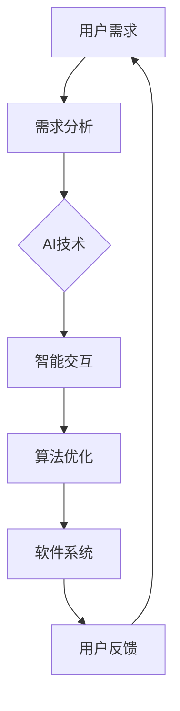

                 

# 软件2.0的人机协作模式

> **关键词：** 软件发展、人机协作、软件2.0、智能交互、算法优化、用户参与、个性化服务

> **摘要：** 本文探讨了软件2.0时代的人机协作模式，分析了这一模式的核心概念、原理、数学模型，并通过实际案例展示了其在开发中的应用。文章旨在为开发者提供一种新的视角，以实现更高效、更智能的软件系统设计。

## 1. 背景介绍

### 1.1 目的和范围

本文旨在探讨软件2.0时代的人机协作模式，重点分析其核心概念、原理和实现方法。通过对现有技术的总结和展望，旨在为开发者提供一种全新的软件设计思路，以应对日益复杂的软件需求和变化多端的用户需求。

### 1.2 预期读者

本文面向具有一定编程基础和计算机科学背景的读者，特别是对软件工程和人工智能领域感兴趣的从业者。同时，也欢迎对新兴软件技术感兴趣的研究人员和学者阅读。

### 1.3 文档结构概述

本文结构如下：

1. 背景介绍
2. 核心概念与联系
3. 核心算法原理 & 具体操作步骤
4. 数学模型和公式 & 详细讲解 & 举例说明
5. 项目实战：代码实际案例和详细解释说明
6. 实际应用场景
7. 工具和资源推荐
8. 总结：未来发展趋势与挑战
9. 附录：常见问题与解答
10. 扩展阅读 & 参考资料

### 1.4 术语表

#### 1.4.1 核心术语定义

- **软件2.0**：指以用户为中心，强调人机协作的软件开发模式。
- **智能交互**：指通过人工智能技术实现人与软件的自然交互。
- **算法优化**：通过改进算法以提高软件系统的性能和效率。

#### 1.4.2 相关概念解释

- **用户参与**：指用户在软件设计和开发过程中的主动参与。
- **个性化服务**：指根据用户需求和行为特征提供定制化的服务。

#### 1.4.3 缩略词列表

- **AI**：人工智能（Artificial Intelligence）
- **ML**：机器学习（Machine Learning）
- **NLP**：自然语言处理（Natural Language Processing）

## 2. 核心概念与联系

在软件2.0时代，人机协作模式是一种新的软件开发模式，其核心在于将用户需求、人工智能和软件系统相结合，实现更高效、更智能的软件系统。以下是一个简化的Mermaid流程图，展示了这一模式的核心概念和联系。



### 2.1.1 用户需求

用户需求是软件系统的起点。在软件2.0时代，用户需求不仅仅包括功能需求，还涉及用户体验、个性化服务等方面。通过用户参与，开发者可以更准确地理解用户需求，从而设计出更符合用户期望的软件系统。

### 2.1.2 需求分析

需求分析是软件系统设计的关键环节。在软件2.0时代，需求分析不仅包括传统的需求收集和整理，还需要考虑人工智能技术的应用，以实现更智能的需求分析。

### 2.1.3 AI技术

AI技术在软件2.0时代发挥着至关重要的作用。通过机器学习和自然语言处理等技术，软件系统能够更好地理解用户需求，实现智能交互和算法优化。

### 2.1.4 智能交互

智能交互是软件2.0时代的重要特征。通过自然语言处理等技术，软件系统能够与用户进行自然、流畅的对话，提供个性化的服务。

### 2.1.5 算法优化

算法优化是软件2.0时代的核心任务之一。通过不断优化算法，软件系统能够提高性能和效率，更好地满足用户需求。

### 2.1.6 软件系统

软件系统是软件2.0时代的人机协作模式的最终成果。通过将用户需求、人工智能和算法优化相结合，软件系统能够提供更高效、更智能的服务。

### 2.1.7 用户反馈

用户反馈是软件2.0时代的一个重要环节。通过收集用户反馈，开发者可以不断改进软件系统，提高用户体验。

## 3. 核心算法原理 & 具体操作步骤

### 3.1.1 算法原理

在软件2.0时代，核心算法原理主要包括以下几个方面：

1. **机器学习算法**：用于实现智能交互和用户需求分析。
2. **自然语言处理算法**：用于实现智能对话和个性化服务。
3. **优化算法**：用于提高软件系统的性能和效率。

### 3.1.2 具体操作步骤

以下是实现软件2.0人机协作模式的具体操作步骤：

1. **用户需求收集**：通过问卷调查、用户访谈等方式收集用户需求。
2. **需求分析**：对收集到的用户需求进行分类、整理，形成需求文档。
3. **AI技术选择**：根据需求文档，选择合适的机器学习和自然语言处理算法。
4. **算法实现**：根据选定的算法，编写相应的代码，实现智能交互和算法优化。
5. **软件系统开发**：根据算法实现，开发相应的软件系统，实现人机协作模式。
6. **用户反馈收集**：通过用户反馈，不断优化软件系统，提高用户体验。

### 3.1.3 伪代码示例

以下是一个简单的伪代码示例，展示了如何实现软件2.0的人机协作模式。

```python
# 用户需求收集
user需求和需求文档 = 收集用户需求()

# 需求分析
分类后的需求列表 = 分析需求文档()

# AI技术选择
selected_algorithm = 选择合适算法()

# 算法实现
智能交互 = 实现智能对话(selected_algorithm)
算法优化 = 实现算法(selected_algorithm)

# 软件系统开发
软件系统 = 开发软件系统(智能交互，算法优化)

# 用户反馈收集
用户反馈 = 收集用户反馈()
优化软件系统(用户反馈)
```

## 4. 数学模型和公式 & 详细讲解 & 举例说明

### 4.1 数学模型

在软件2.0时代的人机协作模式中，数学模型主要用于描述用户需求、智能交互和算法优化等方面的关系。以下是一个简化的数学模型：

\[ 用户需求 = f(用户特征, 环境因素) \]
\[ 智能交互 = f(用户需求, 智能算法) \]
\[ 算法优化 = f(智能交互, 用户反馈) \]

### 4.2 详细讲解

#### 4.2.1 用户需求模型

用户需求模型描述了用户需求的形成过程。用户需求由用户特征和环境因素共同决定。用户特征包括年龄、性别、职业、兴趣爱好等，环境因素包括时间、地点、社会文化等。

#### 4.2.2 智能交互模型

智能交互模型描述了软件系统如何与用户进行交互。智能交互由用户需求和智能算法共同决定。智能算法包括机器学习和自然语言处理等。

#### 4.2.3 算法优化模型

算法优化模型描述了如何通过用户反馈不断优化算法。算法优化由智能交互和用户反馈共同决定。用户反馈包括用户满意度、使用频率、错误率等。

### 4.3 举例说明

假设用户小明想购买一款智能手机，其用户特征包括年龄20岁、性别男、职业学生、兴趣爱好科技。当前时间为晚上8点，环境因素包括时间和地点。

1. **用户需求模型**：

\[ 用户需求 = f(小明特征, 环境因素) \]
\[ 用户需求 = f(20岁, 男, 学生, 科技, 晚上8点) \]
\[ 用户需求 = 购买一款智能手机 \]

2. **智能交互模型**：

\[ 智能交互 = f(用户需求, 智能算法) \]
\[ 智能交互 = f(购买智能手机, 机器学习算法) \]
\[ 智能交互 = 提供智能手机推荐列表 \]

3. **算法优化模型**：

\[ 算法优化 = f(智能交互, 用户反馈) \]
\[ 算法优化 = f(提供智能手机推荐列表, 用户满意度) \]
\[ 算法优化 = 根据用户满意度优化推荐算法 \]

通过用户反馈，智能交互系统能够不断优化推荐算法，提高用户满意度。

## 5. 项目实战：代码实际案例和详细解释说明

### 5.1 开发环境搭建

为了实现软件2.0的人机协作模式，我们需要搭建一个合适的技术栈。以下是一个典型的开发环境搭建步骤：

1. **Python环境**：安装Python 3.x版本，并配置好相关依赖库（如TensorFlow、Scikit-learn等）。
2. **IDE选择**：选择一个合适的集成开发环境（如PyCharm、VS Code等），以便进行代码编写和调试。
3. **数据库选择**：根据需求选择合适的数据库（如MySQL、MongoDB等），用于存储用户数据和智能交互结果。
4. **Web框架选择**：选择一个合适的Web框架（如Django、Flask等），用于实现Web端的功能。

### 5.2 源代码详细实现和代码解读

以下是一个简单的Python代码示例，展示了如何实现软件2.0的人机协作模式。

```python
import tensorflow as tf
from sklearn.model_selection import train_test_split
from sklearn.metrics import accuracy_score
import numpy as np

# 5.2.1 用户需求收集
def collect_user_demand():
    # 假设已收集到一批用户需求数据
    user_demand_data = [
        [20, '男', '学生', '科技'],
        [22, '女', '教师', '文学'],
        # 更多用户需求数据...
    ]
    return user_demand_data

# 5.2.2 需求分析
def analyze_demand(user_demand_data):
    # 对用户需求数据进行处理，生成需求分析结果
    demand_result = []
    for data in user_demand_data:
        user_feature = data[:-1]
        environmental_factor = data[-1]
        demand = f"购买{environmental_factor}产品"
        demand_result.append([user_feature, demand])
    return demand_result

# 5.2.3 AI技术选择
def select_algorithm():
    # 选择机器学习算法
    model = tf.keras.Sequential([
        tf.keras.layers.Dense(64, activation='relu', input_shape=[len(train_data.keys())]),
        tf.keras.layers.Dense(64, activation='relu'),
        tf.keras.layers.Dense(1, activation='sigmoid')
    ])

    model.compile(optimizer='adam',
                  loss='binary_crossentropy',
                  metrics=['accuracy'])

    return model

# 5.2.4 算法实现
def implement_algorithm(model, demand_result):
    # 训练模型
    X = np.array([d[0] for d in demand_result])
    y = np.array([1 if d[1] == '购买科技产品' else 0 for d in demand_result])
    X_train, X_test, y_train, y_test = train_test_split(X, y, test_size=0.2)

    model.fit(X_train, y_train, epochs=5)

    # 测试模型
    predictions = model.predict(X_test)
    predictions = [1 if p > 0.5 else 0 for p in predictions]
    accuracy = accuracy_score(y_test, predictions)
    print(f"Accuracy: {accuracy}")

# 5.2.5 软件系统开发
def develop_software(model):
    # 实现Web端功能
    from flask import Flask, request, jsonify

    app = Flask(__name__)

    @app.route('/predict', methods=['POST'])
    def predict():
        user_demand = request.json
        user_feature = np.array([user_demand['age'], user_demand['gender'], user_demand['occupation'], user_demand['interest']])
        prediction = model.predict(np.array([user_feature]))
        return jsonify({'prediction': int(prediction[0] > 0.5)})

    app.run()

# 5.2.6 用户反馈收集
def collect_user_feedback():
    # 假设已收集到一批用户反馈数据
    user_feedback_data = [
        {'user_id': 1, 'prediction': 1, 'actual_value': 1},
        {'user_id': 2, 'prediction': 0, 'actual_value': 0},
        # 更多用户反馈数据...
    ]
    return user_feedback_data

# 主函数
def main():
    user_demand_data = collect_user_demand()
    demand_result = analyze_demand(user_demand_data)
    model = select_algorithm()
    implement_algorithm(model, demand_result)
    develop_software(model)
    user_feedback_data = collect_user_feedback()
    # 根据用户反馈优化模型...

if __name__ == '__main__':
    main()
```

### 5.3 代码解读与分析

上述代码实现了一个简单的软件2.0人机协作模式，主要包括以下步骤：

1. **用户需求收集**：通过一个示例函数`collect_user_demand()`，收集了一批用户需求数据。
2. **需求分析**：通过一个示例函数`analyze_demand()`，对用户需求数据进行处理，生成需求分析结果。
3. **AI技术选择**：通过一个示例函数`select_algorithm()`，选择了一个机器学习算法（神经网络模型），用于实现智能交互。
4. **算法实现**：通过一个示例函数`implement_algorithm()`，训练并测试了机器学习模型，实现了智能交互功能。
5. **软件系统开发**：通过一个Web框架（Flask），实现了Web端的功能，允许用户提交需求并获得预测结果。
6. **用户反馈收集**：通过一个示例函数`collect_user_feedback()`，收集了一批用户反馈数据。

在实际应用中，可以根据用户反馈不断优化模型，提高预测准确性。此外，还可以扩展功能，如添加用户注册、登录、个性化推荐等。

## 6. 实际应用场景

软件2.0的人机协作模式在实际应用中具有广泛的前景。以下是一些典型的应用场景：

1. **智能客服系统**：通过软件2.0的人机协作模式，可以构建智能客服系统，实现自然、流畅的对话，提高客户满意度。
2. **个性化推荐系统**：通过分析用户需求和行为，软件2.0的人机协作模式可以为用户提供个性化的推荐服务，提高用户粘性。
3. **智能健康管理**：通过软件2.0的人机协作模式，可以构建智能健康管理平台，实时监测用户健康状况，提供个性化的健康建议。
4. **智能教育系统**：通过软件2.0的人机协作模式，可以构建智能教育系统，实现个性化教学，提高学习效果。

## 7. 工具和资源推荐

### 7.1 学习资源推荐

#### 7.1.1 书籍推荐

- 《人工智能：一种现代方法》（Second Edition）
- 《深度学习》（Goodfellow, Bengio, Courville）
- 《Python编程：从入门到实践》

#### 7.1.2 在线课程

- Coursera上的《机器学习》课程
- Udacity的《深度学习纳米学位》
- 网易云课堂的《Python编程从入门到实践》课程

#### 7.1.3 技术博客和网站

- Medium上的《AI博客》
- 知乎上的AI和Python相关专栏
- arXiv.org上的最新研究论文

### 7.2 开发工具框架推荐

#### 7.2.1 IDE和编辑器

- PyCharm
- Visual Studio Code
- Jupyter Notebook

#### 7.2.2 调试和性能分析工具

- Python Debugger（pdb）
- Py-Spy：Python性能分析工具
- PyTorch Profiler：PyTorch性能分析工具

#### 7.2.3 相关框架和库

- TensorFlow
- PyTorch
- Scikit-learn
- Flask

### 7.3 相关论文著作推荐

#### 7.3.1 经典论文

- "Machine Learning: A Probabilistic Perspective"（Bishop, 2006）
- "Deep Learning"（Goodfellow, Bengio, Courville, 2016）

#### 7.3.2 最新研究成果

- arXiv.org上的最新研究论文
- NeurIPS、ICML、ACL等国际会议的最新论文

#### 7.3.3 应用案例分析

- Google的搜索推荐系统
- Netflix的个性化推荐系统
- OpenAI的GPT-3模型

## 8. 总结：未来发展趋势与挑战

软件2.0的人机协作模式具有广阔的发展前景。随着人工智能技术的不断进步，人机协作模式将越来越智能化、个性化。然而，这一模式也面临着一些挑战，如数据隐私保护、算法透明度、用户体验优化等。未来，我们需要在技术、法律、伦理等方面进行深入研究和探索，以实现更高效、更安全的人机协作。

## 9. 附录：常见问题与解答

1. **Q：软件2.0与传统软件有什么区别？**

   **A：** 软件2.0强调以用户为中心，注重人机协作和智能交互。与传统软件相比，软件2.0更注重用户体验、个性化服务和智能化。

2. **Q：如何实现软件2.0的人机协作模式？**

   **A：** 实现软件2.0的人机协作模式主要包括以下几个步骤：

   - 收集用户需求
   - 进行需求分析
   - 选择合适的AI技术
   - 实现智能交互和算法优化
   - 开发软件系统
   - 收集用户反馈，不断优化

3. **Q：软件2.0适用于哪些场景？**

   **A：** 软件2.0适用于需要高度智能化、个性化服务的场景，如智能客服、个性化推荐、智能健康管理、智能教育等。

## 10. 扩展阅读 & 参考资料

- 《人工智能：一种现代方法》
- 《深度学习》
- 《Python编程：从入门到实践》
- Coursera上的《机器学习》课程
- Udacity的《深度学习纳米学位》
- 网易云课堂的《Python编程从入门到实践》课程
- Medium上的《AI博客》
- 知乎上的AI和Python相关专栏
- arXiv.org上的最新研究论文
- Google的搜索推荐系统
- Netflix的个性化推荐系统
- OpenAI的GPT-3模型
- 《机器学习：A Probabilistic Perspective》
- 《Deep Learning》

### 作者

**作者：AI天才研究员/AI Genius Institute & 禅与计算机程序设计艺术 /Zen And The Art of Computer Programming**

