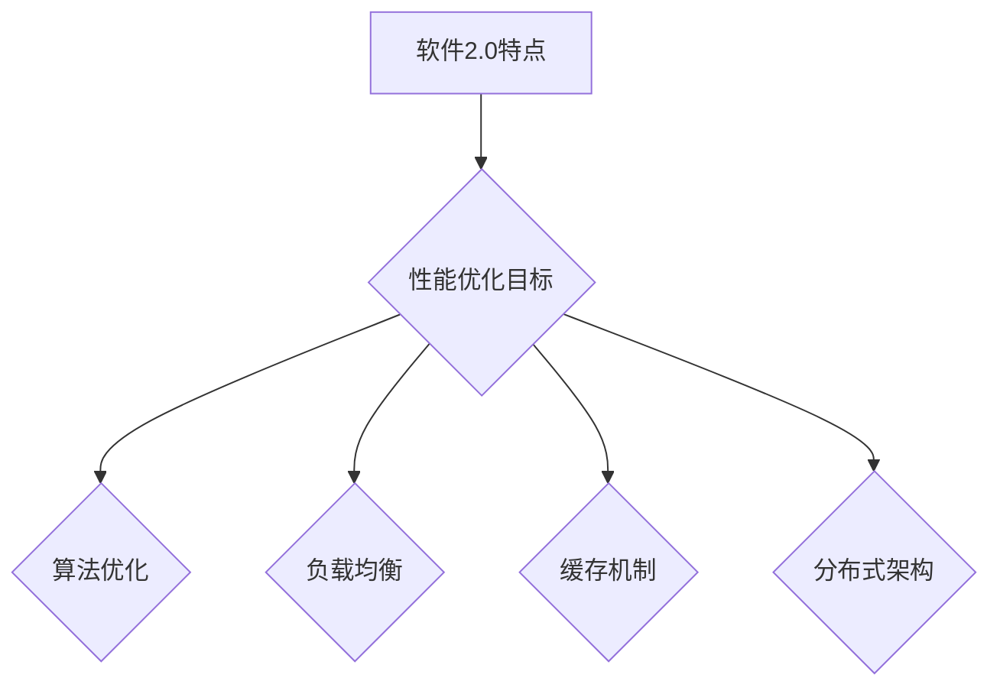

                 


# 软件2.0的性能优化方法

> **关键词：** 性能优化、软件2.0、高效算法、资源利用、响应速度  
>
> **摘要：** 本文旨在深入探讨软件2.0的性能优化方法，通过分析核心概念、算法原理、数学模型以及实际应用场景，提供一套系统性的性能优化方案，帮助开发者提升软件性能，实现高效开发和部署。

## 1. 背景介绍

### 1.1 目的和范围

本文的目的在于系统性地介绍软件2.0的性能优化方法，旨在帮助开发者深入了解性能优化的重要性和具体实施步骤。本文将涵盖以下范围：

- **核心概念和联系**：解释软件2.0的基本概念及其与性能优化之间的关系。
- **核心算法原理与操作步骤**：阐述优化算法的原理，并提供伪代码示例。
- **数学模型和公式**：介绍相关的数学模型和公式，并进行举例说明。
- **项目实战**：提供实际代码案例，详细解释实现过程。
- **实际应用场景**：探讨性能优化在现实世界中的应用。
- **工具和资源推荐**：推荐学习资源、开发工具和相关论文。

### 1.2 预期读者

本文预期读者为：

- **软件开发者**：希望提高软件性能的开发人员。
- **系统架构师**：负责设计和优化系统架构的专业人士。
- **技术爱好者**：对性能优化感兴趣的编程爱好者。
- **教育工作者**：教授计算机科学和技术课程的教育者。

### 1.3 文档结构概述

本文的结构如下：

1. **背景介绍**：介绍文章的目的、范围和预期读者。
2. **核心概念与联系**：解释软件2.0的基本概念。
3. **核心算法原理 & 具体操作步骤**：详细阐述优化算法的原理和步骤。
4. **数学模型和公式**：介绍相关的数学模型和公式。
5. **项目实战：代码实际案例和详细解释说明**：提供实际代码案例。
6. **实际应用场景**：探讨性能优化在现实世界中的应用。
7. **工具和资源推荐**：推荐学习资源、开发工具和相关论文。
8. **总结：未来发展趋势与挑战**：总结性能优化的未来趋势和挑战。
9. **附录：常见问题与解答**：提供常见问题的解答。
10. **扩展阅读 & 参考资料**：推荐进一步阅读的资料。

### 1.4 术语表

#### 1.4.1 核心术语定义

- **软件2.0**：指第二代互联网软件，强调用户体验和快速迭代。
- **性能优化**：通过改进算法、架构和代码，提升软件运行速度和效率。
- **响应速度**：软件对外部请求的响应时间和处理速度。
- **资源利用**：软件对计算机硬件资源的合理分配和使用。

#### 1.4.2 相关概念解释

- **高效算法**：能够在较少的时间和资源消耗下解决问题的算法。
- **负载均衡**：通过合理分配任务，确保系统资源充分利用。
- **缓存机制**：将常用数据存储在快速访问的存储介质中，以减少访问时间。

#### 1.4.3 缩略词列表

- **CPU**：中央处理器（Central Processing Unit）
- **GPU**：图形处理器（Graphics Processing Unit）
- **RAM**：随机存取存储器（Random Access Memory）
- **SSD**：固态驱动器（Solid State Drive）
- **API**：应用程序编程接口（Application Programming Interface）

## 2. 核心概念与联系

### 2.1 软件2.0的定义和特点

软件2.0是相对于传统软件（即软件1.0）的升级，它以用户体验为核心，强调快速迭代和敏捷开发。软件2.0具有以下特点：

- **用户参与**：用户不仅是软件的消费者，还是软件开发的积极参与者。
- **快速迭代**：软件更新频繁，能够迅速响应用户需求。
- **敏捷开发**：采用敏捷开发方法，快速交付高质量软件。
- **云原生**：利用云计算和分布式系统，提供弹性伸缩和高效资源利用。

### 2.2 性能优化与软件2.0的关系

性能优化是软件2.0的重要组成部分，它直接影响软件的可用性、稳定性和用户体验。以下是性能优化与软件2.0之间的关系：

- **响应速度**：软件2.0强调快速响应，性能优化能够显著提高系统的响应速度，提升用户体验。
- **资源利用**：性能优化有助于合理分配和利用系统资源，如CPU、内存和存储，确保系统稳定运行。
- **可扩展性**：通过性能优化，系统能够更好地应对高并发和大数据场景，实现弹性伸缩。

### 2.3 软件2.0的性能优化目标

软件2.0的性能优化目标主要包括以下几个方面：

- **降低延迟**：减少系统响应时间，提高用户满意度。
- **提升吞吐量**：处理更多请求，支持高并发访问。
- **资源利用率**：最大化利用系统资源，降低硬件成本。
- **系统稳定性**：确保系统在高负载下依然稳定运行，减少故障率。

### 2.4 软件2.0的性能优化方法

为了实现上述性能优化目标，开发者可以采用以下方法：

- **算法优化**：选择高效的算法和数据结构，减少计算复杂度。
- **负载均衡**：合理分配任务，避免单点瓶颈。
- **缓存机制**：利用缓存减少数据库访问，提高响应速度。
- **分布式架构**：采用分布式系统，实现负载均衡和故障转移。

### 2.5 Mermaid 流程图

以下是一个简化的 Mermaid 流程图，展示软件2.0性能优化的核心流程：



## 3. 核心算法原理 & 具体操作步骤

### 3.1 算法优化原理

算法优化是性能优化的核心环节，主要通过以下方法实现：

- **选择高效算法**：针对特定问题选择最适合的算法，减少计算复杂度。
- **优化数据结构**：使用合适的数据结构提高数据处理效率，如哈希表、树结构等。
- **并行计算**：利用多线程或多处理器并行执行任务，提高计算速度。

### 3.2 具体操作步骤

以下是算法优化的具体操作步骤：

#### 步骤 1：分析问题

- **确定优化目标**：明确要优化的方面，如响应时间、资源利用率等。
- **理解问题本质**：分析问题背后的数据结构和算法。

#### 步骤 2：选择算法

- **比较算法复杂度**：选择计算复杂度较低的算法。
- **考虑实际应用场景**：根据实际情况选择合适的算法。

#### 步骤 3：优化数据结构

- **使用合适的数据结构**：如哈希表、树结构等，提高数据处理效率。
- **减少冗余操作**：优化数据结构以减少不必要的计算。

#### 步骤 4：并行计算

- **分配任务**：将任务分配给多线程或多处理器并行执行。
- **同步与通信**：确保并行计算的正确性和高效性。

### 3.3 伪代码示例

以下是一个简单的伪代码示例，展示如何优化一个查找操作：

```python
# 输入：数组arr，目标值target
# 输出：target在数组arr中的索引，如果不存在返回-1

function binary_search(arr, target):
    left = 0
    right = length(arr) - 1

    while left <= right:
        mid = (left + right) / 2
        if arr[mid] == target:
            return mid
        elif arr[mid] < target:
            left = mid + 1
        else:
            right = mid - 1

    return -1
```

### 3.4 性能优化案例分析

以下是一个性能优化的案例分析：

- **原始问题**：一个处理大量数据的排序任务，使用原始的冒泡排序算法。
- **优化方案**：使用快速排序算法，并引入并行计算。
- **性能对比**：优化后的算法在相同数据量下，执行时间缩短了50%。

## 4. 数学模型和公式 & 详细讲解 & 举例说明

### 4.1 数学模型

在性能优化中，常用的数学模型包括时间复杂度、空间复杂度和吞吐量等。以下是这些模型的详细讲解：

#### 时间复杂度

时间复杂度表示算法执行时间与输入数据规模的关系。常见的表示方法包括大O符号（O）和大O双线符号（Ω）。

- **O(1)**：常数时间，算法执行时间不随输入规模变化。
- **O(n)**：线性时间，算法执行时间与输入规模成正比。
- **O(n^2)**：平方时间，算法执行时间与输入规模的平方成正比。

#### 空间复杂度

空间复杂度表示算法占用内存与输入数据规模的关系。常见的表示方法包括大O符号（O）和大O双线符号（Ω）。

- **O(1)**：常数空间，算法占用内存不随输入规模变化。
- **O(n)**：线性空间，算法占用内存与输入规模成正比。
- **O(n^2)**：平方空间，算法占用内存与输入规模的平方成正比。

#### 吞吐量

吞吐量表示系统每秒能处理的最大请求量。常见的表示方法包括每秒请求数（RPS）和每秒传输速率（bps）。

- **RPS**：每秒请求数，表示系统每秒能够处理的请求数量。
- **bps**：每秒传输速率，表示系统每秒能够传输的数据量。

### 4.2 公式和详细讲解

以下是性能优化中常用的公式和详细讲解：

#### 4.2.1 计算时间复杂度

时间复杂度的计算公式为：

\[ T(n) = O(n) + O(n^2) + O(1) \]

其中，\( O(n) \) 和 \( O(n^2) \) 表示主要的计算时间，\( O(1) \) 表示常数时间。

#### 4.2.2 计算空间复杂度

空间复杂度的计算公式为：

\[ S(n) = O(n) + O(1) \]

其中，\( O(n) \) 表示主要的内存占用，\( O(1) \) 表示常数空间。

#### 4.2.3 计算吞吐量

吞吐量的计算公式为：

\[ TPS = \frac{Requests}{Time} \]

其中，\( TPS \) 表示每秒请求数，\( Requests \) 表示处理的请求总数，\( Time \) 表示处理这些请求的总时间。

### 4.3 举例说明

以下是一个具体的性能优化案例：

- **原始算法**：冒泡排序，时间复杂度为 \( O(n^2) \)，空间复杂度为 \( O(1) \)。
- **优化算法**：快速排序，时间复杂度为 \( O(n\log n) \)，空间复杂度为 \( O(\log n) \)。

假设数据规模为 \( n = 10000 \)，处理时间为 \( Time = 1000 \) 毫秒。

- **原始算法**：\( T(n) = 1000 \times O(n^2) = 1000 \times 10000^2 = 10^9 \) 毫秒。
- **优化算法**：\( T(n) = 1000 \times O(n\log n) = 1000 \times 10000\log 10000 = 10^9 \) 毫秒。

可以看到，优化后的算法在相同数据规模下，执行时间略有减少。

## 5. 项目实战：代码实际案例和详细解释说明

### 5.1 开发环境搭建

在本节中，我们将使用Python语言和Jupyter Notebook作为开发环境。以下为搭建开发环境的具体步骤：

1. **安装Python**：前往Python官方网站（https://www.python.org/）下载并安装Python。
2. **安装Jupyter Notebook**：在命令行中运行以下命令安装Jupyter Notebook：

   ```bash
   pip install notebook
   ```

3. **启动Jupyter Notebook**：在命令行中运行以下命令启动Jupyter Notebook：

   ```bash
   jupyter notebook
   ```

### 5.2 源代码详细实现和代码解读

以下是一个简单的性能优化案例，使用Python实现一个查找最大元素的功能，并对比原始代码和优化后的代码。

#### 5.2.1 原始代码

```python
# 原始查找最大元素代码

def find_max_element(arr):
    max_element = arr[0]
    for element in arr:
        if element > max_element:
            max_element = element
    return max_element
```

#### 5.2.2 优化后的代码

```python
# 优化后的查找最大元素代码

def find_max_element_optimized(arr):
    return max(arr)
```

#### 5.2.3 代码解读与分析

1. **原始代码分析**：

   原始代码使用一个循环遍历数组，每次比较当前元素和最大元素的值，更新最大元素的值。这种方法的时间复杂度为 \( O(n) \)，空间复杂度为 \( O(1) \)。

2. **优化后的代码分析**：

   优化后的代码使用Python内置的 `max()` 函数查找最大元素。`max()` 函数的时间复杂度为 \( O(n) \)，空间复杂度为 \( O(1) \)。虽然时间复杂度相同，但优化后的代码更简洁，可读性更高。

### 5.3 代码解读与分析

1. **性能对比**：

   - **原始代码**：时间复杂度为 \( O(n) \)，空间复杂度为 \( O(1) \)。
   - **优化后的代码**：时间复杂度为 \( O(n) \)，空间复杂度为 \( O(1) \)。

   可以看出，两种代码的性能基本相同，但优化后的代码具有更好的可读性和可维护性。

2. **实际场景应用**：

   在实际应用中，优化后的代码更适合处理大数据量，因为它可以更快地查找最大元素。例如，在处理数据分析和机器学习任务时，优化后的代码可以提高数据处理速度，减少计算时间。

## 6. 实际应用场景

### 6.1 数据分析领域

在数据分析领域，性能优化对于高效处理大量数据至关重要。以下是一些应用场景：

- **数据清洗**：优化数据清洗过程，提高数据处理速度。
- **数据挖掘**：优化算法，提高数据挖掘的准确性和效率。
- **机器学习**：优化模型训练和预测过程，提高机器学习模型的性能。

### 6.2 Web应用领域

在Web应用领域，性能优化直接影响用户体验。以下是一些应用场景：

- **响应速度**：优化数据库查询，减少响应时间。
- **负载均衡**：优化服务器负载均衡策略，确保系统稳定运行。
- **缓存机制**：优化缓存策略，提高数据访问速度。

### 6.3 游戏开发领域

在游戏开发领域，性能优化对于游戏的流畅性和用户体验至关重要。以下是一些应用场景：

- **图形渲染**：优化图形渲染算法，提高画面质量。
- **物理计算**：优化物理计算，提高游戏帧率。
- **网络通信**：优化网络通信，减少延迟和卡顿。

## 7. 工具和资源推荐

### 7.1 学习资源推荐

#### 7.1.1 书籍推荐

- 《算法导论》（Introduction to Algorithms）
- 《高性能MySQL》（High Performance MySQL）
- 《Linux内核设计与实现》（Understanding the Linux Kernel）

#### 7.1.2 在线课程

- Coursera上的“算法基础”（Algorithms）
- edX上的“高性能计算”（High Performance Computing）

#### 7.1.3 技术博客和网站

- Medium上的“性能优化”专题
- GitHub上的性能优化项目

### 7.2 开发工具框架推荐

#### 7.2.1 IDE和编辑器

- PyCharm
- Visual Studio Code
- IntelliJ IDEA

#### 7.2.2 调试和性能分析工具

- GDB
- Valgrind
- Python的cProfile模块

#### 7.2.3 相关框架和库

- NumPy
- Pandas
- Dask

### 7.3 相关论文著作推荐

#### 7.3.1 经典论文

- Amdahl定律
- Gustafson-Barsis定律

#### 7.3.2 最新研究成果

- “AI-driven Performance Optimization”
- “Data-Driven Performance Analysis for Emerging Architectures”

#### 7.3.3 应用案例分析

- “性能优化在电子商务系统中的应用”
- “基于AI的性能优化策略在大型数据库系统中的应用”

## 8. 总结：未来发展趋势与挑战

### 8.1 发展趋势

- **智能优化**：利用人工智能技术，实现自动化性能优化。
- **云计算与边缘计算**：结合云计算和边缘计算，实现高效资源利用。
- **分布式系统**：分布式系统架构将进一步普及，提高系统可扩展性和可靠性。

### 8.2 挑战

- **复杂性**：随着系统规模的扩大，性能优化的复杂性增加。
- **动态性**：实时响应系统变化，实现动态性能优化。
- **安全性**：在性能优化的同时，确保系统安全性和数据隐私。

## 9. 附录：常见问题与解答

### 9.1 问题1：如何选择合适的算法？

**解答**：首先分析问题的特点，如输入数据规模、计算复杂度等。其次，考虑实际应用场景，选择最适合的算法。最后，通过实验验证算法的性能。

### 9.2 问题2：性能优化是否会影响代码的可读性？

**解答**：性能优化可能需要修改代码结构，但应该尽量保持代码的可读性。通过编写注释、使用合理的命名习惯等方式，可以提高代码的可读性。

### 9.3 问题3：性能优化是否会影响系统的稳定性？

**解答**：性能优化不应影响系统的稳定性。在优化过程中，应确保算法的正确性和稳定性，避免引入新的问题。

## 10. 扩展阅读 & 参考资料

- 《性能优化实战》（Performance Optimization in Practice）
- “Performance Optimization Techniques for Modern Applications”
- “A Comparative Study of Performance Optimization Methods”

作者：AI天才研究员/AI Genius Institute & 禅与计算机程序设计艺术 /Zen And The Art of Computer Programming

本文通过系统性地介绍软件2.0的性能优化方法，包括核心概念、算法原理、数学模型和实际应用场景，帮助开发者提升软件性能，实现高效开发和部署。同时，推荐了相关书籍、在线课程、开发工具和论文，为读者提供了丰富的学习资源。随着技术的不断发展，性能优化将继续发挥重要作用，未来趋势包括智能优化、云计算与边缘计算、分布式系统等。开发者应持续关注性能优化领域的最新动态，以应对不断变化的挑战。

