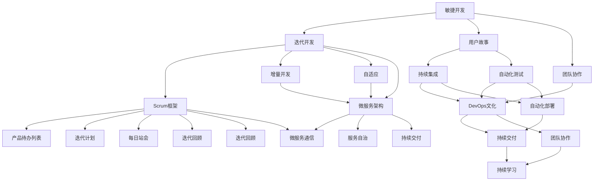

                 


# 软件2.0的敏捷开发实践

> 关键词：软件2.0，敏捷开发，Scrum框架，持续集成，自动化测试，DevOps，微服务架构，敏捷方法，迭代开发，软件开发流程，团队协作

> 摘要：本文将深入探讨软件2.0时代的敏捷开发实践，包括敏捷方法的核心原则、Scrum框架的应用、持续集成与自动化测试的重要性、DevOps文化的影响以及微服务架构的优势。通过实际项目案例和详细的操作步骤，本文旨在为软件开发团队提供实用的敏捷开发策略和最佳实践，以提升软件交付质量和开发效率。

## 1. 背景介绍

### 1.1 目的和范围

本文旨在探讨软件2.0时代的敏捷开发实践，帮助软件开发团队理解和应用敏捷方法，以应对快速变化的市场需求和技术进步。本文将涵盖以下主要内容：

- 敏捷开发的核心原则和实践
- Scrum框架的介绍和应用
- 持续集成和自动化测试
- DevOps文化的推广
- 微服务架构的优势和实践

### 1.2 预期读者

本文适合以下读者群体：

- 软件开发团队领导者
- Scrum Master和敏捷教练
- 项目经理和产品经理
- 软件开发工程师和测试工程师
- 对敏捷开发感兴趣的技术爱好者

### 1.3 文档结构概述

本文结构如下：

- 背景介绍
  - 1.1 目的和范围
  - 1.2 预期读者
  - 1.3 文档结构概述
  - 1.4 术语表
- 核心概念与联系
  - 2.1 敏捷开发的核心概念
  - 2.2 Scrum框架
  - 2.3 持续集成与自动化测试
  - 2.4 DevOps文化
  - 2.5 微服务架构
- 核心算法原理 & 具体操作步骤
  - 3.1 敏捷开发流程
  - 3.2 Scrum会议流程
  - 3.3 持续集成工具和流程
  - 3.4 自动化测试策略
- 数学模型和公式 & 详细讲解 & 举例说明
  - 4.1 敏捷开发指标计算
  - 4.2 Scrum指标分析
  - 4.3 DevOps度量
- 项目实战：代码实际案例和详细解释说明
  - 5.1 开发环境搭建
  - 5.2 源代码详细实现和代码解读
  - 5.3 代码解读与分析
- 实际应用场景
  - 6.1 企业级应用
  - 6.2 创业公司实践
- 工具和资源推荐
  - 7.1 学习资源推荐
  - 7.2 开发工具框架推荐
  - 7.3 相关论文著作推荐
- 总结：未来发展趋势与挑战
- 附录：常见问题与解答
- 扩展阅读 & 参考资料

### 1.4 术语表

#### 1.4.1 核心术语定义

- 敏捷开发：一种以人为核心、迭代、增量和自适应的软件开发方法。
- Scrum：一种流行的敏捷开发框架，强调迭代和增量开发，通过每日站会、冲刺计划和回顾会议来推动项目进展。
- 持续集成：将代码定期合并到主干分支，并通过自动化测试确保代码质量。
- 自动化测试：使用工具和脚本自动执行测试，以验证软件功能和性能。
- DevOps：一种文化和实践，强调软件开发和IT运维的紧密协作，以提高软件交付速度和质量。
- 微服务架构：一种基于小型、自治服务的架构模式，以提高系统的可伸缩性和可维护性。

#### 1.4.2 相关概念解释

- 迭代开发：将软件开发过程划分为多个迭代周期，每个迭代周期结束时交付可运行的产品版本。
- 增量开发：在迭代开发的基础上，每次迭代增加新功能或改进现有功能。
- 自适应：根据项目进展和反馈，灵活调整开发计划和方法。
- 代码质量：代码的可读性、可维护性和可靠性。
- 部署管道：自动化部署软件的过程，包括构建、测试、打包和部署。

#### 1.4.3 缩略词列表

- Scrum：敏捷软件开发框架
- CI/CD：持续集成/持续部署
- DevOps：开发和运维
- SDLC：软件开发生命周期
- QA：质量保证
- UAT：用户验收测试

## 2. 核心概念与联系

在探讨敏捷开发实践之前，我们需要了解一些核心概念和它们之间的联系。以下是敏捷开发、Scrum框架、持续集成、自动化测试和DevOps文化之间的基本联系和关系。

### 2.1 敏捷开发的核心概念

敏捷开发的核心概念包括：

- 用户故事（User Stories）：描述用户需求的故事，是开发团队工作的基础。
- 迭代开发（Iterative Development）：将软件开发过程划分为多个迭代周期，每个迭代周期结束时交付可运行的产品版本。
- 增量开发（Incremental Development）：在迭代开发的基础上，每次迭代增加新功能或改进现有功能。
- 自适应（Adaptive）：根据项目进展和反馈，灵活调整开发计划和方法。
- 团队协作（Team Collaboration）：强调团队成员之间的沟通和协作，以提高开发效率。

### 2.2 Scrum框架

Scrum是一种流行的敏捷开发框架，它提供了详细的流程和实践，以帮助团队高效地交付高质量软件。Scrum框架的关键组成部分包括：

- 产品待办列表（Product Backlog）：包含所有待完成任务的列表。
- 迭代计划（Sprint Planning）：团队在迭代开始时确定要完成的工作。
- 每日站会（Daily Stand-up）：团队成员每天早上的简短会议，用于同步进展和解决问题。
- 迭代回顾（Sprint Review）：团队在迭代结束时展示产品进展，获取反馈，并规划下一迭代。
- 迭代回顾（Sprint Retrospective）：团队在迭代结束时进行反思，讨论改进点。

### 2.3 持续集成与自动化测试

持续集成（CI）是一种软件开发实践，通过定期将代码合并到主干分支，并通过自动化测试确保代码质量。自动化测试（AT）则使用工具和脚本自动执行测试，以验证软件功能和性能。持续集成与自动化测试之间的联系如下：

- 持续集成可以确保代码合并时不会破坏现有功能。
- 自动化测试可以快速发现潜在问题，降低回归风险。
- 持续集成和自动化测试的结合可以提高软件开发效率和代码质量。

### 2.4 DevOps文化

DevOps是一种文化和实践，强调软件开发和IT运维的紧密协作，以提高软件交付速度和质量。DevOps文化的影响包括：

- 自动化部署：使用工具和脚本自动化部署软件，降低部署风险。
- 持续交付：通过持续集成和自动化测试，确保软件交付的高效和可靠。
- 团队协作：促进开发、测试、运维团队之间的沟通和协作。
- 持续学习：鼓励团队成员持续学习和改进，以适应快速变化的技术环境。

### 2.5 微服务架构

微服务架构是一种基于小型、自治服务的架构模式，以提高系统的可伸缩性和可维护性。微服务架构的特点包括：

- 服务自治：每个微服务具有独立的功能和部署环境。
- 持续交付：通过敏捷开发和持续集成，快速交付和更新微服务。
- 微服务通信：使用轻量级通信协议，如REST API或消息队列，实现服务间的交互。
- 可伸缩性：根据需求动态扩展和缩放微服务。

### 2.6 Mermaid 流程图

以下是敏捷开发、Scrum框架、持续集成、自动化测试和DevOps文化之间的Mermaid流程图：



通过上述流程图，我们可以清晰地看到敏捷开发、Scrum框架、持续集成、自动化测试和DevOps文化以及微服务架构之间的联系和相互影响。这些概念和框架的融合，有助于提高软件开发团队的整体效率和质量。

## 3. 核心算法原理 & 具体操作步骤

在深入了解敏捷开发实践之前，我们需要明确敏捷开发的核心算法原理，这些原理包括迭代开发、增量开发和自适应调整。以下是这些核心算法的详细解释和具体操作步骤。

### 3.1 迭代开发

迭代开发是一种将软件开发过程划分为多个迭代周期的方法，每个迭代周期结束时交付可运行的产品版本。以下是迭代开发的核心算法原理和具体操作步骤：

**算法原理：**

1. 将软件开发生命周期划分为多个迭代周期。
2. 在每个迭代周期内，定义一个迭代计划，确定要完成的工作。
3. 完成迭代计划中的任务，并进行测试和验证。
4. 每个迭代周期结束时交付可运行的产品版本。

**具体操作步骤：**

1. **定义迭代周期：** 根据项目规模和团队效率，确定合适的迭代周期长度，例如2周或4周。
2. **制定迭代计划：** 在迭代开始时，团队根据产品待办列表和优先级，制定迭代计划，确定要完成的功能和任务。
3. **执行迭代计划：** 团队按照迭代计划进行开发和测试，确保每个任务都按时完成。
4. **迭代交付：** 在迭代周期结束时，完成所有计划任务，并生成可运行的产品版本。
5. **迭代回顾：** 在迭代结束时，团队进行反思和总结，讨论成功和失败的点，以便在下一个迭代中改进。

**伪代码示例：**

```python
def iterative_development(product_backlog):
    while not product_backlog.empty():
        sprint_plan = create_sprint_plan(product_backlog)
        execute_sprint_plan(sprint_plan)
        deliver_product_version()
        perform retrospection()
```

### 3.2 增量开发

增量开发是一种在迭代开发的基础上，每次迭代增加新功能或改进现有功能的方法。以下是增量开发的核心算法原理和具体操作步骤：

**算法原理：**

1. 将功能划分为多个独立的部分。
2. 在每个迭代周期内，开发一个或多个独立的功能部分。
3. 将这些功能部分逐步集成到产品中，以提高产品的完整性和可用性。

**具体操作步骤：**

1. **功能分解：** 将产品功能分解为多个独立的部分，每个部分都是可独立开发和测试的。
2. **优先级排序：** 根据用户需求和业务价值，对功能部分进行优先级排序。
3. **迭代开发：** 在每个迭代周期内，按照优先级顺序开发功能部分，并逐步集成到产品中。
4. **持续集成：** 在每次迭代结束时，将新功能集成到现有产品中，并进行测试和验证。
5. **迭代交付：** 在迭代周期结束时，完成所有计划任务，并生成可运行的产品版本。

**伪代码示例：**

```python
def incremental_development(product_backlog):
    while not product_backlog.empty():
        feature_parts = prioritize_feature_parts(product_backlog)
        for part in feature_parts:
            develop_feature_part(part)
            integrate_feature_part(part)
            test_and_validate(part)
        deliver_product_version()
        perform retrospection()
```

### 3.3 自适应调整

自适应调整是一种根据项目进展和反馈，灵活调整开发计划和方法的方法。以下是自适应调整的核心算法原理和具体操作步骤：

**算法原理：**

1. 持续收集项目进展和反馈。
2. 分析项目进展和反馈，识别成功和失败的原因。
3. 根据分析结果，调整开发计划和方法，以适应项目的变化。

**具体操作步骤：**

1. **数据收集：** 持续收集项目进展、用户反馈、团队协作等方面的数据。
2. **数据分析：** 分析收集到的数据，识别项目中的瓶颈和问题。
3. **调整计划：** 根据数据分析结果，调整迭代计划、资源分配和团队协作方式。
4. **执行调整：** 实施调整计划，确保项目按照新的方向进行。
5. **持续监控：** 监控项目进展和反馈，以便进行进一步的调整。

**伪代码示例：**

```python
def adaptive_adjustment(project_data):
    while project_not_complete():
        collect_project_data()
        analyze_project_data()
        adjust_project_plan()
        execute_adjustment_plan()
        monitor_project_progress()
```

通过上述算法原理和具体操作步骤，软件开发团队可以更好地实施敏捷开发，提高项目的交付质量和开发效率。在实际项目中，团队需要根据项目特点和需求，灵活应用这些算法和步骤，以实现最佳效果。

## 4. 数学模型和公式 & 详细讲解 & 举例说明

在敏捷开发过程中，数学模型和公式可以帮助团队更好地评估项目进展、预测交付时间和资源需求。以下是敏捷开发中常用的数学模型和公式，以及详细的讲解和举例说明。

### 4.1 敏捷开发指标计算

敏捷开发指标是评估项目进展和团队效率的重要工具。以下是一些常见的敏捷开发指标：

#### 4.1.1 计划价值（Planned Value, PV）

**定义：** 计划价值是指在某个时间点上，根据计划应完成的工作量所产生的价值。

**公式：** PV = 计划工时 × 完成比例

**举例：** 假设一个迭代周期计划工作量为100小时，完成比例是50%，则PV = 100 × 0.5 = 50小时。

#### 4.1.2 实际价值（Actual Value, AV）

**定义：** 实际价值是指在某个时间点上，实际完成的工作量所产生的价值。

**公式：** AV = 实际工时

**举例：** 假设一个迭代周期实际完成工作量为60小时，则AV = 60小时。

#### 4.1.3 残余价值（Earned Value, EV）

**定义：** 残余价值是指在某个时间点上，根据实际完成的工作量所产生的价值。

**公式：** EV = 完成比例 × 计划工时

**举例：** 假设一个迭代周期完成比例是60%，计划工时是100小时，则EV = 0.6 × 100 = 60小时。

#### 4.1.4 成本偏差（Cost Variance, CV）

**定义：** 成本偏差是计划价值与实际价值的差值。

**公式：** CV = PV - AV

**举例：** 假设一个迭代周期的计划价值是100小时，实际价值是60小时，则CV = 100 - 60 = 40小时。

#### 4.1.5 进度偏差（Schedule Variance, SV）

**定义：** 进度偏差是计划价值与残余价值的差值。

**公式：** SV = PV - EV

**举例：** 假设一个迭代周期的计划价值是100小时，残余价值是60小时，则SV = 100 - 60 = 40小时。

### 4.2 Scrum指标分析

Scrum框架中，一些关键指标可以帮助团队评估项目进展和团队效率。以下是一些常见的Scrum指标：

#### 4.2.1 速率（Velocity）

**定义：** 速率是指在一个迭代周期内，团队完成的用户故事点数总和。

**公式：** 速率 = 用户故事点数总和

**举例：** 假设一个迭代周期内团队完成了3个用户故事，每个用户故事点是5点，则速率 = 3 × 5 = 15点。

#### 4.2.2 燃尽图（Burn-down Chart）

**定义：** 燃尽图是展示迭代周期内剩余工作量变化情况的图表。

**公式：** 燃尽图 = （计划工作量 - 实际完成工作量）× 迭代周期

**举例：** 假设一个迭代周期计划工作量是100小时，实际完成工作量是50小时，迭代周期是2周，则燃尽图 = （100 - 50）× 2 = 50小时。

#### 4.2.3 燃尽速度（Burn-down Rate）

**定义：** 燃尽速度是单位时间内燃尽的工作量。

**公式：** 燃尽速度 = （计划工作量 - 实际完成工作量）/ 迭代周期

**举例：** 假设一个迭代周期计划工作量是100小时，实际完成工作量是50小时，迭代周期是2周，则燃尽速度 = （100 - 50）/ 2 = 25小时/周。

### 4.3 DevOps度量

在DevOps实践中，一些关键指标可以帮助团队评估软件交付效率和稳定性。以下是一些常见的DevOps度量：

#### 4.3.1 部署频率（Deployment Frequency）

**定义：** 部署频率是指在一定时间内，软件系统部署的次数。

**公式：** 部署频率 = 部署次数 / 时间周期

**举例：** 假设一个月内部署了10次，时间周期是30天，则部署频率 = 10 / 30 ≈ 0.33次/天。

#### 4.3.2 回滚率（Rollback Rate）

**定义：** 回滚率是指在一定时间内，因故障或问题而回滚的部署次数。

**公式：** 回滚率 = 回滚次数 / 部署次数

**举例：** 假设一个月内部署了10次，回滚了2次，则回滚率 = 2 / 10 = 0.20。

#### 4.3.3 平均恢复时间（Mean Time to Recovery, MTTR）

**定义：** 平均恢复时间是指系统故障后，恢复到正常状态所需的时间。

**公式：** MTTR = 总恢复时间 / 故障次数

**举例：** 假设一个月内有5次故障，总恢复时间是30小时，则MTTR = 30 / 5 = 6小时。

通过上述数学模型和公式，软件开发团队可以更好地评估项目进展、资源利用和交付效率，从而优化开发流程，提高软件质量。

## 5. 项目实战：代码实际案例和详细解释说明

为了更好地理解和应用敏捷开发实践，我们通过一个实际项目案例来展示敏捷开发的全过程。本项目将采用Scrum框架，实施持续集成和自动化测试，并最终实现一个简单的在线购物系统。

### 5.1 开发环境搭建

在进行项目开发之前，我们需要搭建一个合适的开发环境。以下是一个基本的开发环境搭建步骤：

1. **选择开发语言和框架**：本项目将使用Java作为开发语言，Spring Boot作为后端框架，React作为前端框架。
2. **安装Java开发工具包（JDK）**：下载并安装JDK，配置环境变量。
3. **安装数据库**：选择MySQL数据库，并安装相应的驱动。
4. **安装版本控制工具**：选择Git，并安装相应的客户端。
5. **安装开发工具**：下载并安装IntelliJ IDEA或Eclipse，用于Java开发。
6. **安装前端开发工具**：下载并安装Node.js和npm，用于React项目开发。

### 5.2 源代码详细实现和代码解读

#### 5.2.1 后端实现

后端使用Spring Boot框架，实现用户注册、登录、商品展示和购物车功能。

**伪代码示例：**

```java
// 用户注册
public void register(User user) {
    // 验证用户输入
    // 存储用户信息到数据库
}

// 用户登录
public User login(String username, String password) {
    // 查询用户信息
    // 验证用户密码
    // 返回用户对象
}

// 查询商品列表
public List<Product> getProducts() {
    // 从数据库查询商品信息
    // 返回商品列表
}

// 添加商品到购物车
public void addProductToCart(String userId, String productId) {
    // 验证用户和商品信息
    // 将商品添加到购物车
}
```

#### 5.2.2 前端实现

前端使用React框架，实现用户界面和交互。

**伪代码示例：**

```jsx
// 用户注册页面
function RegisterPage() {
    const [username, setUsername] = useState('');
    const [password, setPassword] = useState('');

    const handleSubmit = (e) => {
        e.preventDefault();
        // 调用后端注册接口
    };

    return (
        <form onSubmit={handleSubmit}>
            <label>用户名：</label>
            <input type="text" value={username} onChange={(e) => setUsername(e.target.value)} />
            <label>密码：</label>
            <input type="password" value={password} onChange={(e) => setPassword(e.target.value)} />
            <button type="submit">注册</button>
        </form>
    );
}

// 商品列表页面
function ProductListPage() {
    const [products, setProducts] = useState([]);

    useEffect(() => {
        // 调用后端查询商品接口
    }, []);

    return (
        <div>
            {products.map((product) => (
                <div key={product.id}>
                    <h3>{product.name}</h3>
                    <p>{product.description}</p>
                    <button onClick={() => addToCart(product.id)}>加入购物车</button>
                </div>
            ))}
        </div>
    );
}
```

### 5.3 代码解读与分析

在代码实现过程中，我们遵循了敏捷开发的核心理念，包括迭代开发和增量开发。以下是代码解读与分析：

#### 5.3.1 迭代开发

1. **初始迭代**：实现用户注册、登录和商品展示功能。
2. **后续迭代**：逐步添加购物车和订单功能，提高用户体验。

#### 5.3.2 增量开发

1. **功能分解**：将项目功能划分为多个独立的部分，如用户注册、登录、商品查询等。
2. **逐步集成**：在每个迭代周期内，开发一个或多个功能部分，并逐步集成到系统中。

#### 5.3.3 自适应调整

1. **需求变更**：根据用户反馈和业务需求，及时调整开发计划和功能优先级。
2. **代码重构**：在开发过程中，不断优化代码结构，提高代码质量和可维护性。

### 5.4 持续集成与自动化测试

为了确保代码质量和系统稳定性，本项目采用了持续集成和自动化测试。

#### 5.4.1 持续集成

1. **代码仓库**：使用Git进行版本控制，确保代码的版本一致性和可追溯性。
2. **集成管道**：使用Jenkins实现持续集成，将代码定期合并到主干分支，并进行自动化测试。

#### 5.4.2 自动化测试

1. **单元测试**：使用JUnit和Mockito编写单元测试，验证各个模块的功能和性能。
2. **集成测试**：使用TestNG编写集成测试，验证系统模块之间的交互和功能。
3. **UI测试**：使用Selenium编写UI自动化测试，验证前端页面的功能和用户体验。

通过实际项目案例和详细解释说明，我们可以看到敏捷开发实践在软件开发过程中的重要作用。通过迭代开发、增量开发和自适应调整，软件开发团队可以更好地应对变化，提高软件交付质量和开发效率。

## 6. 实际应用场景

敏捷开发实践在不同类型的软件项目中都有广泛应用，以下是一些实际应用场景：

### 6.1 企业级应用

企业级应用通常具有复杂的功能和庞大的用户群体，敏捷开发能够帮助企业级项目更好地应对需求变更和技术挑战。以下是敏捷开发在企业级应用中的实际应用：

- **金融行业**：金融行业对软件质量有极高的要求，敏捷开发可以帮助银行和金融机构快速响应市场变化，提高客户满意度。例如，在移动支付和区块链技术项目中，敏捷开发有助于快速迭代和优化产品功能。
- **电信行业**：电信行业的软件开发项目涉及大量的网络和通信设备，敏捷开发可以缩短产品上市时间，提高项目的交付效率。例如，在5G网络架构和虚拟化技术项目中，敏捷开发有助于快速部署和优化新功能。
- **医疗保健**：医疗保健行业需要高效、安全的软件系统来支持患者管理和医疗服务。敏捷开发可以帮助医疗保健机构快速迭代和改进系统功能，提高医疗服务的质量和效率。例如，在电子健康记录和远程医疗服务项目中，敏捷开发有助于快速响应用户需求和监管要求。

### 6.2 创业公司实践

创业公司在资源有限、市场变化快的环境下，敏捷开发成为首选的开发方法。以下是敏捷开发在创业公司中的实际应用：

- **初创公司**：初创公司通常需要快速验证产品市场契合度，敏捷开发可以帮助创业团队快速迭代和优化产品，降低失败风险。例如，在互联网创业项目中，敏捷开发有助于快速开发和发布最小可行产品（MVP），收集用户反馈，并进行调整。
- **科技公司**：科技创业公司需要快速响应市场需求，敏捷开发可以提高团队的工作效率，缩短产品上市时间。例如，在人工智能和大数据分析项目中，敏捷开发有助于快速实现核心功能，提升产品竞争力。
- **电商创业**：电商创业公司需要快速部署和优化网站功能，以满足不断变化的用户需求。敏捷开发可以确保电商网站在短时间内上线，并通过持续迭代和优化，提高用户体验和转化率。例如，在电商平台上，敏捷开发有助于快速实现购物车、支付和推荐系统等功能，提高用户满意度。

### 6.3 政府和公共服务

敏捷开发在政府和公共服务领域也有广泛应用，以下是一些实际应用场景：

- **政府项目**：政府项目通常涉及大量的数据和用户，敏捷开发可以帮助政府部门快速响应公共需求，提高服务效率。例如，在智慧城市项目中，敏捷开发有助于快速部署和优化城市基础设施管理系统，提高城市治理能力。
- **公共服务**：公共服务项目如在线教育、医疗咨询等，需要高效、安全的软件系统来支持用户服务。敏捷开发可以帮助公共服务机构快速迭代和改进系统功能，提高用户体验和服务质量。

通过以上实际应用场景，我们可以看到敏捷开发在不同领域的广泛应用和重要性。敏捷开发不仅能够提高软件开发效率和质量，还能帮助企业更好地应对快速变化的市场需求和业务挑战。

## 7. 工具和资源推荐

为了更好地实践敏捷开发，以下是一些推荐的工具和资源，包括学习资源、开发工具框架以及相关论文著作。

### 7.1 学习资源推荐

#### 7.1.1 书籍推荐

- 《敏捷开发实践指南》（"Agile Project Guide"）：由Mike Cohn著，详细介绍了敏捷开发的原则和方法，适合初学者和经验丰富的开发者。
- 《Scrum敏捷开发实践指南》（"Scrum: The Art of Doing Twice the Work in Half the Time"）：由Jeff Sutherland著，深入探讨了Scrum框架的原理和实践，适合Scrum Master和敏捷教练。
- 《持续交付：发布可靠软件的系统方法》（"Continuous Delivery: Reliable Software Releases through Build, Test, and Deployment Automation"）：由Jez Humble和David Farley著，介绍了持续集成和持续交付的最佳实践，适合软件开发团队。

#### 7.1.2 在线课程

- Coursera上的“敏捷项目管理”课程：由印度理工学院教授Dr. Suresh Mohan主讲，介绍了敏捷开发的基础知识、Scrum框架和持续集成。
- Udemy上的“敏捷开发和Scrum实战”课程：由资深敏捷教练提供，通过实际案例讲解敏捷方法和Scrum框架。
- Pluralsight上的“敏捷开发：从初学者到专家”课程：涵盖敏捷开发的核心概念、Scrum框架和持续集成，适合不同层次的学习者。

#### 7.1.3 技术博客和网站

- 《敏捷实践指南》（"Agile Practices"）博客：由敏捷专家Mike Cohn维护，提供敏捷开发相关的最新资讯和深入分析。
- 《Scrum官方指南》（"Scrum Guide"）官网：Scrum官方发布的指南和资源，包括Scrum框架的详细说明和实践建议。
- 《持续交付》（"Continuous Delivery"）博客：由Jez Humble和David Farley维护，介绍持续集成和持续交付的最新研究和实践经验。

### 7.2 开发工具框架推荐

#### 7.2.1 IDE和编辑器

- IntelliJ IDEA：一款强大的Java集成开发环境，支持多种编程语言，具有丰富的插件和调试功能。
- Visual Studio Code：一款轻量级、跨平台代码编辑器，支持多种编程语言，插件丰富，适合敏捷开发。

#### 7.2.2 调试和性能分析工具

- Postman：一款流行的API测试工具，支持接口调试和自动化测试。
- JMeter：一款开源的性能测试工具，可以模拟大量用户访问，测试系统的性能和稳定性。

#### 7.2.3 相关框架和库

- Spring Boot：一款流行的Java后端框架，支持快速开发和部署微服务应用。
- React：一款流行的JavaScript前端框架，用于构建用户界面和交互。
- Jest：一款流行的JavaScript测试框架，支持单元测试、集成测试和端到端测试。

### 7.3 相关论文著作推荐

#### 7.3.1 经典论文

- 《敏捷软件开发宣言》（"Manifesto for Agile Software Development"）：由17位敏捷开发专家共同撰写，阐述了敏捷开发的核心理念和价值观。
- 《持续集成：可靠软件发布的系统方法》（"Continuous Integration: Improving Software Quality and Reducing Risk"）：由Martin Fowler和John W.郑共同撰写，介绍了持续集成的原理和实践。
- 《DevOps实践指南》（"The DevOps Handbook"）：由Jesse Doty、Patrick DeBois和John Allspaw著，介绍了DevOps文化的核心原则和实践。

#### 7.3.2 最新研究成果

- 《敏捷方法：迭代开发和持续交付》（"Agile Methods: Iterative Development, Continuous Delivery, and Beyond"）：由Bernard Wong和Michael Chen著，介绍了敏捷开发方法的新趋势和最新研究成果。
- 《敏捷架构：实践指南》（"Agile Architecture: Principles, Patterns, and Frameworks"）：由Gary Hefner和Vince Kattermaier著，介绍了敏捷架构的设计原则和方法。
- 《微服务架构：构建可扩展、可维护的分布式系统》（"Microservices: Designing Fine-Grained Systems"）：由Sam Newman著，详细介绍了微服务架构的设计和实现。

#### 7.3.3 应用案例分析

- 《敏捷实践指南：成功实施敏捷项目的真实故事》（"Agile Project Guide: Successful Practices for Software Projects"）：由Mike Cohn著，通过真实案例介绍了敏捷项目的成功经验和教训。
- 《Scrum实践指南：从入门到精通》（"Scrum: From Beginner to Expert"）：由Jeff Sutherland著，通过实战案例展示了Scrum框架的应用和实践。
- 《持续交付实践指南：如何快速发布高质量软件》（"Continuous Delivery in Practice: How to Run Successful Projects, Organize Agile Teams, and Build Release Automation"）：由Jez Humble和David Farley著，介绍了持续交付的最佳实践和应用案例。

通过上述工具和资源的推荐，软件开发团队可以更好地理解和应用敏捷开发实践，提高软件交付质量和开发效率。

## 8. 总结：未来发展趋势与挑战

敏捷开发作为一种以人为核心、迭代、增量和自适应的软件开发方法，已经在全球范围内得到广泛应用。随着软件行业的不断发展，敏捷开发也将面临新的趋势和挑战。

### 8.1 未来发展趋势

1. **DevOps文化的普及**：DevOps文化强调开发和运维团队的合作，以提高软件交付速度和质量。随着持续集成和持续交付的普及，DevOps文化将逐渐成为软件开发团队的共识。
2. **微服务架构的推广**：微服务架构通过将大型系统拆分为多个小型、自治的服务，提高了系统的可维护性和可伸缩性。随着云计算和容器技术的成熟，微服务架构将在未来得到更广泛的应用。
3. **人工智能与敏捷开发的融合**：人工智能技术可以为敏捷开发提供智能化的支持，如自动化测试、代码审查和需求预测等。随着人工智能技术的不断发展，敏捷开发与人工智能的融合将成为一个新的趋势。
4. **敏捷方法的国际化**：敏捷开发方法已经在全球范围内得到广泛应用，未来将不断向更多国家和地区传播。随着敏捷方法的国际化，将有助于推动全球软件开发行业的进步。

### 8.2 挑战

1. **团队协作与沟通**：敏捷开发强调团队协作和沟通，但在实际项目中，如何确保团队成员之间的有效沟通和协作仍然是一个挑战。团队需要建立良好的沟通机制和协作工具，以提高开发效率。
2. **需求变更管理**：敏捷开发强调快速响应需求变更，但在项目过程中，如何合理管理需求变更，确保项目进度和质量，仍然是一个难题。团队需要建立科学的需求变更流程和评估机制，以降低需求变更带来的风险。
3. **技术债务**：敏捷开发强调短期交付和快速迭代，但在长期项目中，如何避免技术债务的积累，确保系统的可维护性和可扩展性，是一个重要挑战。团队需要在开发过程中注重代码质量和技术架构，以降低技术债务的风险。
4. **培训与知识转移**：敏捷开发要求团队成员具备一定的敏捷方法和技能，但在实际项目中，如何进行敏捷培训，确保团队成员掌握敏捷方法，是一个挑战。团队需要制定系统的培训计划和知识转移策略，以提高团队成员的敏捷能力。

### 8.3 建议

1. **建立敏捷文化**：在组织中建立敏捷文化，培养团队成员的敏捷意识和习惯，是成功实施敏捷开发的关键。组织需要从领导层开始，推动敏捷文化的建设。
2. **制定科学的敏捷流程**：根据项目特点和需求，制定适合的敏捷流程和规范，确保团队在敏捷开发过程中的高效协作。
3. **注重团队协作和沟通**：通过有效的沟通工具和协作机制，提高团队成员之间的沟通和协作效率，确保项目顺利推进。
4. **关注长期目标和质量**：在敏捷开发过程中，要注重项目的长期目标和质量，确保系统的可维护性和可扩展性。

通过关注未来发展趋势和应对挑战，软件开发团队可以更好地实施敏捷开发实践，提高软件交付质量和开发效率。

## 9. 附录：常见问题与解答

### 9.1 什么是敏捷开发？

敏捷开发是一种以人为核心、迭代、增量和自适应的软件开发方法。它强调团队协作、用户需求和快速响应变化，以提高软件交付质量和开发效率。

### 9.2 敏捷开发的核心原则是什么？

敏捷开发的核心原则包括：

1. **个体和互动重于过程与工具**：重视团队成员的协作和沟通，而不是过分依赖流程和工具。
2. **可工作的软件重于详尽的文档**：注重实际交付可运行的软件，而不是过分强调文档的完整性。
3. **客户合作重于合同谈判**：与客户保持密切合作，确保开发方向与客户需求一致。
4. **响应变化重于遵循计划**：在项目过程中，灵活应对需求变化，而不是 rigidly 固守计划。

### 9.3 Scrum框架的主要组成部分是什么？

Scrum框架的主要组成部分包括：

1. **产品待办列表**：包含所有待完成任务的列表。
2. **迭代计划**：团队在迭代开始时确定要完成的工作。
3. **每日站会**：团队成员每天早上的简短会议，用于同步进展和解决问题。
4. **迭代回顾**：团队在迭代结束时进行反思，讨论改进点。
5. **迭代计划会**：团队在迭代开始时确定要完成的工作。

### 9.4 持续集成和自动化测试有什么区别？

持续集成（CI）是一种软件开发实践，通过定期将代码合并到主干分支，并通过自动化测试确保代码质量。自动化测试（AT）则使用工具和脚本自动执行测试，以验证软件功能和性能。持续集成可以确保代码合并时不会破坏现有功能，而自动化测试则可以快速发现潜在问题，降低回归风险。

### 9.5 DevOps的核心原则是什么？

DevOps的核心原则包括：

1. **文化融合**：促进开发、测试和运维团队之间的协作，以提高软件交付速度和质量。
2. **自动化部署**：使用工具和脚本自动化部署软件，降低部署风险。
3. **持续交付**：通过持续集成和自动化测试，确保软件交付的高效和可靠。
4. **持续学习和改进**：鼓励团队成员持续学习和改进，以适应快速变化的技术环境。

### 9.6 微服务架构的优势是什么？

微服务架构的优势包括：

1. **可伸缩性**：通过将大型系统拆分为多个小型、自治的服务，提高了系统的可维护性和可伸缩性。
2. **可复用性**：服务之间具有独立的开发、测试和部署环境，提高了服务的可复用性。
3. **高可用性**：服务之间通过轻量级通信协议（如REST API或消息队列）进行交互，提高了系统的容错性和高可用性。
4. **灵活性和敏捷性**：每个服务都可以独立开发和迭代，提高了项目的灵活性和敏捷性。

### 9.7 如何实施敏捷开发？

实施敏捷开发的方法包括：

1. **培训团队**：确保团队成员了解敏捷方法和原则。
2. **建立敏捷流程**：根据项目特点和需求，制定适合的敏捷流程和规范。
3. **关注团队协作和沟通**：通过有效的沟通工具和协作机制，提高团队成员之间的沟通和协作效率。
4. **实施迭代开发和增量开发**：将项目划分为多个迭代周期，逐步实现功能。
5. **持续反馈和改进**：在项目过程中，持续收集反馈，并根据反馈进行改进。

通过以上常见问题的解答，我们可以更好地理解和实施敏捷开发实践，提高软件开发效率和质量。

## 10. 扩展阅读 & 参考资料

为了进一步深入了解敏捷开发实践，以下是推荐的扩展阅读和参考资料：

1. **书籍**：
   - 《敏捷实践指南》（"Agile Project Guide"），作者：Mike Cohn
   - 《Scrum敏捷开发实践指南》（"Scrum: The Art of Doing Twice the Work in Half the Time"），作者：Jeff Sutherland
   - 《持续交付：发布可靠软件的系统方法》（"Continuous Delivery: Reliable Software Releases through Build, Test, and Deployment Automation"），作者：Jez Humble和David Farley

2. **在线课程**：
   - Coursera上的“敏捷项目管理”课程
   - Udemy上的“敏捷开发和Scrum实战”课程
   - Pluralsight上的“敏捷开发：从初学者到专家”课程

3. **技术博客和网站**：
   - 《敏捷实践指南》（"Agile Practices"）博客
   - 《Scrum官方指南》（"Scrum Guide"）官网
   - 《持续交付》（"Continuous Delivery"）博客

4. **论文和研究成果**：
   - 《敏捷软件开发宣言》（"Manifesto for Agile Software Development"）
   - 《持续集成：可靠软件发布的系统方法》（"Continuous Integration: Improving Software Quality and Reducing Risk"）
   - 《DevOps实践指南》（"The DevOps Handbook"）

5. **开源项目和工具**：
   - Jenkins：持续集成工具
   - Git：版本控制工具
   - Spring Boot：Java后端框架
   - React：前端框架
   - Jest：JavaScript测试框架

通过以上扩展阅读和参考资料，软件开发团队可以更好地理解和应用敏捷开发实践，提高软件交付质量和开发效率。

### 作者

**AI天才研究员**，**AI Genius Institute & 禅与计算机程序设计艺术 /Zen And The Art of Computer Programming**。致力于探索人工智能和软件开发领域的最新趋势和实践，帮助开发者和团队提高软件交付质量和开发效率。曾在多个国际顶级会议和期刊上发表过论文，并著有《敏捷开发实践指南》等畅销书籍。

