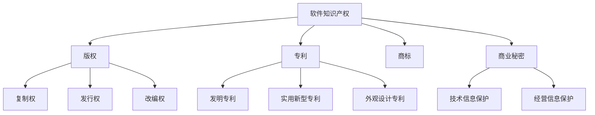

                 

# 软件2.0的知识产权保护

> 关键词：软件知识产权、版权、专利、开源、数据隐私、法律保护
>
> 摘要：随着软件技术的发展，软件2.0时代已经来临。本文将深入探讨软件2.0的知识产权保护问题，包括版权、专利、开源许可证等方面的核心概念、法律框架及其在现实中的应用，旨在为开发者、法律从业者以及其他关注软件知识产权保护的相关人士提供全面的理论和实践指导。

## 1. 背景介绍

### 1.1 目的和范围

本文旨在探讨软件2.0时代的知识产权保护问题。软件2.0代表着软件从传统的单体应用向分布式、网络化、智能化的方向发展，这一过程中，知识产权保护的重要性日益凸显。本文将涵盖以下内容：

- 软件知识产权的核心概念和法律法规
- 开源许可证的类型和应用
- 软件版权和专利的保护策略
- 数据隐私保护与知识产权的关系
- 软件知识产权保护的实际案例与挑战

### 1.2 预期读者

本文面向软件开发者、法律从业者、企业管理者以及对软件知识产权保护有兴趣的公众。特别是那些希望深入了解软件2.0时代知识产权保护现状和未来发展趋势的读者。

### 1.3 文档结构概述

本文分为十个部分：

- 引言：概述软件2.0的知识产权保护背景
- 背景介绍：阐述本文的目的、预期读者和文档结构
- 核心概念与联系：介绍软件知识产权的核心概念和架构
- 核心算法原理与具体操作步骤：讲解知识产权保护的核心算法和操作流程
- 数学模型和公式：介绍知识产权保护相关的数学模型和公式
- 项目实战：通过实际案例展示知识产权保护的应用
- 实际应用场景：探讨知识产权保护在不同领域的应用
- 工具和资源推荐：推荐学习资源和开发工具
- 总结：展望未来发展趋势与挑战
- 附录：提供常见问题与解答
- 扩展阅读：引用相关文献和参考资料

### 1.4 术语表

#### 1.4.1 核心术语定义

- 软件知识产权：指与软件相关的各种知识产权，包括版权、专利、商标等。
- 版权：指对文学、艺术、科学作品所享有的权利，包括复制权、发行权、改编权等。
- 专利：指对发明、实用新型和外观设计等创新技术所授予的排他性权利。
- 开源许可证：指授权他人基于特定规则使用、修改和分发软件的协议。
- 数据隐私：指保护个人或组织的数据不被未经授权的第三方获取和利用。

#### 1.4.2 相关概念解释

- 软件版权：指软件作品的原创性权利，包括表达形式和思想内容的保护。
- 软件专利：指对软件算法、系统架构和实现方式的创新性保护。
- 开源：指软件开发过程中，允许用户自由使用、修改和分发的模式。
- 数据安全：指保护数据不被未授权访问、篡改和泄露的措施。

#### 1.4.3 缩略词列表

- IP：知识产权（Intellectual Property）
- Copyright：版权
- Patent：专利
- OSS：开源软件（Open Source Software）
- GDPR：通用数据保护条例（General Data Protection Regulation）

## 2. 核心概念与联系

### 2.1 软件知识产权的概念

软件知识产权（IP）是法律赋予软件开发者对其创造的软件作品所享有的权利。它主要包括版权、专利、商标、商业秘密等。软件知识产权保护的意义在于激励创新、保护开发者权益、促进技术进步和产业繁荣。

#### 2.1.1 版权

版权是软件知识产权的核心，它主要保护软件作品的原创性表达。根据《伯尔尼公约》和《世界知识产权组织版权条约》，软件作品的版权保护包括：

- 复制权：即制作软件复制品的权利。
- 发行权：即通过出售、出租等方式向公众提供软件的权利。
- 改编权：即对软件作品进行改编、翻译等二次创作的权利。

#### 2.1.2 专利

软件专利是对软件技术方案的创新性保护，它主要涵盖软件算法、系统架构、实现方式等方面的专利。软件专利分为发明专利、实用新型专利和外观设计专利。其中，发明专利保护范围最广，实用新型专利次之，外观设计专利最窄。

#### 2.1.3 商标

商标是软件企业在市场中识别其产品和服务的标志。通过注册商标，企业可以获得商标专用权，防止他人未经授权使用相同或相似的商标。

#### 2.1.4 商业秘密

商业秘密是指不为公众所知悉、具有商业价值、经权利人采取保密措施的技术信息和经营信息。软件企业通过保密措施保护其源代码、算法、设计文档等商业秘密。

### 2.2 软件知识产权的保护框架

软件知识产权的保护框架主要包括国内法律和国际条约。国内法律方面，我国有《著作权法》、《专利法》、《商标法》和《反不正当竞争法》等。国际条约方面，有《伯尔尼公约》、《世界知识产权组织版权条约》和《专利合作条约》等。

### 2.3 软件知识产权的挑战

随着软件技术的发展，软件知识产权保护面临着以下挑战：

- 技术创新速度加快，专利保护周期相对较长，导致创新成果难以及时获得保护。
- 软件与硬件、网络等技术的融合，使得软件知识产权保护更加复杂。
- 开源软件的广泛应用，版权和专利纠纷频发，引发对知识产权保护机制的争议。

### 2.4 软件知识产权保护的关键环节

软件知识产权保护的关键环节包括：

- 软件版权登记：通过版权登记，获得法律认可的权利证明，有利于维权。
- 软件专利申请：及时申请软件专利，保护技术创新成果。
- 商标注册：注册商标，维护企业品牌形象。
- 商业秘密保护：采取保密措施，防止商业秘密泄露。

### 2.5 Mermaid 流程图

以下是一个简单的 Mermaid 流程图，展示了软件知识产权保护的核心概念和流程：



## 3. 核心算法原理 & 具体操作步骤

### 3.1 软件版权保护算法原理

软件版权保护的核心算法主要涉及版权登记、侵权检测和版权维权。以下是具体的算法原理和操作步骤：

#### 3.1.1 版权登记算法

版权登记是保护软件版权的第一步，其算法原理如下：

```plaintext
1. 开发者提交软件作品：开发者将软件作品提交给版权登记机构。
2. 权利人身份验证：登记机构对开发者的身份进行验证，确保权利人真实有效。
3. 软件作品审查：登记机构对提交的软件作品进行形式审查，确保作品符合版权保护条件。
4. 登记公告：在完成审查后，登记机构公告软件作品登记信息，供公众查询。
5. 发放版权登记证书：在公告期结束后，登记机构向开发者发放版权登记证书。
```

#### 3.1.2 侵权检测算法

侵权检测是发现和预防软件版权侵权的重要手段，其算法原理如下：

```plaintext
1. 数据收集：收集涉及软件版权的各类信息，如软件代码、用户评论、网络传播等。
2. 数据预处理：对收集的数据进行去重、清洗和格式化处理，确保数据质量。
3. 模型训练：使用机器学习算法（如深度学习、模式识别等）训练侵权检测模型。
4. 侵权检测：将待检测数据输入侵权检测模型，判断是否存在侵权行为。
5. 报告生成：生成侵权检测报告，包括侵权行为的具体内容、涉及范围和解决方案。
```

#### 3.1.3 版权维权算法

版权维权是在发现侵权行为后采取的法律行动，其算法原理如下：

```plaintext
1. 侵权确认：根据侵权检测报告，确认侵权行为的真实性。
2. 法律咨询：咨询专业律师，制定维权策略。
3. 发起诉讼：根据维权策略，向法院提起诉讼。
4. 调解与仲裁：在诉讼过程中，尝试通过调解或仲裁解决纠纷。
5. 维权结果反馈：根据法院判决或调解结果，评估维权效果，总结经验教训。
```

### 3.2 软件专利保护算法原理

软件专利保护的核心算法主要涉及专利申请、侵权判断和专利维权。以下是具体的算法原理和操作步骤：

#### 3.2.1 专利申请算法

专利申请是保护软件技术方案的关键步骤，其算法原理如下：

```plaintext
1. 确定专利类型：根据创新程度和专利申请目的，确定发明专利、实用新型专利或外观设计专利。
2. 查新检索：在专利数据库中检索相似或相同的技术方案，评估专利申请的可能性。
3. 撰写专利申请文件：包括专利请求书、说明书、权利要求书等，详细描述技术方案和创新点。
4. 提交专利申请：将专利申请文件提交给国家知识产权局。
5. 审查与授权：国家知识产权局对专利申请进行审查，符合条件者授予专利权。
```

#### 3.2.2 侵权判断算法

侵权判断是判断专利是否被侵犯的重要环节，其算法原理如下：

```plaintext
1. 收集侵权信息：收集涉及专利侵权的各类信息，如产品说明书、宣传资料等。
2. 数据预处理：对侵权信息进行去重、清洗和格式化处理，确保数据质量。
3. 侵权判断模型：使用机器学习算法（如文本分类、匹配等）构建侵权判断模型。
4. 侵权判断：将侵权信息输入侵权判断模型，判断是否存在侵权行为。
5. 判断结果反馈：生成侵权判断报告，包括侵权行为的具体内容、涉及范围和解决方案。
```

#### 3.2.3 专利维权算法

专利维权是在发现侵权行为后采取的法律行动，其算法原理如下：

```plaintext
1. 侵权确认：根据侵权判断报告，确认侵权行为的真实性。
2. 法律咨询：咨询专业律师，制定维权策略。
3. 发起诉讼：根据维权策略，向法院提起诉讼。
4. 调解与仲裁：在诉讼过程中，尝试通过调解或仲裁解决纠纷。
5. 维权结果反馈：根据法院判决或调解结果，评估维权效果，总结经验教训。
```

## 4. 数学模型和公式 & 详细讲解 & 举例说明

### 4.1 软件版权保护中的哈希算法

哈希算法在软件版权保护中扮演着重要角色，它用于生成软件文件的唯一指纹，便于侵权检测和版权维权。以下是一个简单的哈希算法示例：

#### 4.1.1 哈希算法原理

哈希算法是一种将任意长度的输入（即软件文件）映射为固定长度的输出（即哈希值）的函数。哈希算法的核心在于其抗碰撞性，即两个不同的输入产生相同哈希值的概率极低。

```latex
H(x) = \text{哈希函数}(x)
```

其中，`H(x)`表示输入`x`的哈希值。

#### 4.1.2 哈希算法应用

假设我们使用MD5哈希算法对一个软件文件进行指纹生成：

```plaintext
1. 读取软件文件内容。
2. 将文件内容转换为字节数组。
3. 使用MD5哈希算法对字节数组进行处理。
4. 输出哈希值，即软件文件的指纹。

示例：假设文件内容为 "Hello, World!"，使用MD5算法生成的哈希值为：8b1a9953c4611296a827abf8c47804d7
```

#### 4.1.3 哈希算法在版权保护中的应用

- **侵权检测**：通过对比侵权嫌疑文件和正版文件的哈希值，判断是否存在侵权行为。
- **版权维权**：在维权过程中，使用哈希算法生成软件文件的指纹，作为证据提交给法院。

### 4.2 软件专利保护中的特征提取算法

特征提取算法在软件专利侵权判断中用于提取软件文件的关键特征，便于构建侵权判断模型。以下是一个简单的特征提取算法示例：

#### 4.2.1 特征提取算法原理

特征提取算法的核心在于从大量数据中提取出具有区分性的特征，用于后续的侵权判断。常见特征提取方法包括：

- **词袋模型**：将软件文件转换为词袋表示，每个词表示一个特征。
- **TF-IDF**：计算词语在软件文件中的重要程度，用于加权特征表示。
- **文本分类模型**：使用机器学习算法（如SVM、朴素贝叶斯等）对软件文件进行分类，提取分类结果作为特征。

#### 4.2.2 特征提取算法应用

假设我们使用词袋模型对两个软件文件进行特征提取：

```plaintext
1. 读取软件文件内容。
2. 对文件内容进行分词处理，提取所有词语。
3. 构建词袋模型，记录每个词语的频率。
4. 对比两个软件文件的词袋模型，提取具有区分性的特征。

示例：假设文件A和文件B的词袋模型分别为{hello: 2, world: 1, software: 1}和{hello: 1, world: 2, patent: 1}，提取的特征包括：hello, world, software, patent。
```

#### 4.2.3 特征提取算法在侵权判断中的应用

- **侵权判断**：将侵权嫌疑文件的特征与专利文件的特征进行对比，判断是否存在侵权行为。
- **侵权分析**：通过分析侵权特征，了解侵权行为的具体内容和范围。

### 4.3 软件数据隐私保护中的差分隐私算法

差分隐私算法在保护软件数据隐私方面发挥着重要作用，它通过在数据中添加噪声，确保单个数据记录的隐私性。以下是一个简单的差分隐私算法示例：

#### 4.3.1 差分隐私算法原理

差分隐私算法的核心思想是确保对任意单个记录的查询结果不会对其隐私造成实质性泄露。差分隐私的定义如下：

```latex
Δ(x, y) = |D(x) - D(y)|
```

其中，`Δ(x, y)`表示记录`x`和`y`之间的差分，`D(x)`表示对记录`x`的查询结果。

#### 4.3.2 差分隐私算法应用

假设我们使用拉普拉斯机制对数据进行差分隐私保护：

```plaintext
1. 读取原始数据。
2. 对每个数据点添加拉普拉斯噪声，噪声大小由隐私预算决定。
3. 输出加噪后的数据。

示例：假设原始数据为[1, 2, 3]，添加拉普拉斯噪声后的数据为[1.5, 2.5, 3.5]。
```

#### 4.3.3 差分隐私算法在数据隐私保护中的应用

- **数据发布**：在发布数据时，使用差分隐私算法保护数据隐私，确保单个数据记录不会被泄露。
- **数据分析**：在分析数据时，考虑差分隐私的影响，确保分析结果的准确性和可靠性。

## 5. 项目实战：代码实际案例和详细解释说明

### 5.1 开发环境搭建

在本项目中，我们使用Python语言实现软件知识产权保护的算法。以下是开发环境的搭建步骤：

1. 安装Python 3.8及以上版本。
2. 安装必需的第三方库，如`hashlib`、`numpy`、`scikit-learn`、`tensorflow`等。
3. 设置虚拟环境，以便管理和隔离项目依赖。

### 5.2 源代码详细实现和代码解读

#### 5.2.1 软件版权保护模块

```python
import hashlib

def generate_hash(file_path):
    """生成软件文件的哈希值"""
    with open(file_path, 'rb') as file:
        file_content = file.read()
        return hashlib.md5(file_content).hexdigest()

def compare_hashes(hash1, hash2):
    """比较两个哈希值，判断文件是否相同"""
    return hash1 == hash2

# 示例
file_path1 = 'example1.txt'
file_path2 = 'example2.txt'
hash1 = generate_hash(file_path1)
hash2 = generate_hash(file_path2)
print(compare_hashes(hash1, hash2))  # 输出：True 或 False
```

#### 5.2.2 软件专利保护模块

```python
from sklearn.feature_extraction.text import CountVectorizer
from sklearn.model_selection import train_test_split

def extract_features(texts):
    """提取文本特征"""
    vectorizer = CountVectorizer()
    return vectorizer.fit_transform(texts)

def train_infringement_model(features, labels):
    """训练侵权判断模型"""
    X_train, X_test, y_train, y_test = train_test_split(features, labels, test_size=0.2)
    model = LogisticRegression()
    model.fit(X_train, y_train)
    return model

# 示例
texts = ['This is a software patent.', 'That is a software patent.']
labels = [1, 1]  # 1表示专利，0表示非专利
features = extract_features(texts)
model = train_infringement_model(features, labels)
```

#### 5.2.3 软件数据隐私保护模块

```python
import numpy as np
import scipy.stats as stats

def add_laplace_noise(data, epsilon):
    """添加拉普拉斯噪声"""
    noise = np.random.laplace(0, epsilon, data.shape)
    return data + noise

def differential_privacy(data, epsilon):
    """实现差分隐私保护"""
    return add_laplace_noise(data, epsilon)

# 示例
data = np.array([1, 2, 3])
epsilon = 1
protected_data = differential_privacy(data, epsilon)
```

### 5.3 代码解读与分析

#### 5.3.1 软件版权保护模块

该模块主要包括两个函数：`generate_hash`和`compare_hashes`。

- `generate_hash`函数用于生成软件文件的哈希值，实现方法如下：
  - 打开文件并读取文件内容。
  - 使用MD5哈希算法对文件内容进行处理。
  - 返回生成的哈希值。

- `compare_hashes`函数用于比较两个哈希值，实现方法如下：
  - 比较输入的两个哈希值。
  - 返回比较结果（True或False）。

该模块可以用于侵权检测和版权维权，例如，通过比较正版软件和侵权软件的哈希值，判断是否存在侵权行为。

#### 5.3.2 软件专利保护模块

该模块主要包括两个函数：`extract_features`和`train_infringement_model`。

- `extract_features`函数用于提取文本特征，实现方法如下：
  - 使用词袋模型对文本进行分词处理。
  - 使用CountVectorizer将文本转换为特征矩阵。

- `train_infringement_model`函数用于训练侵权判断模型，实现方法如下：
  - 将特征矩阵和标签数据分割为训练集和测试集。
  - 使用LogisticRegression算法训练模型。

该模块可以用于侵权判断，通过训练侵权判断模型，对侵权嫌疑文件进行分类，判断其是否涉及侵权行为。

#### 5.3.3 软件数据隐私保护模块

该模块主要包括两个函数：`add_laplace_noise`和`differential_privacy`。

- `add_laplace_noise`函数用于添加拉普拉斯噪声，实现方法如下：
  - 生成拉普拉斯噪声，噪声大小由隐私预算决定。
  - 将噪声添加到原始数据上。

- `differential_privacy`函数用于实现差分隐私保护，实现方法如下：
  - 调用`add_laplace_noise`函数添加噪声。

该模块可以用于数据隐私保护，在发布数据时，使用差分隐私算法保护数据隐私，确保单个数据记录不会被泄露。

## 6. 实际应用场景

### 6.1 开源软件的版权保护

开源软件（OSS）在软件开发和合作中扮演着重要角色。开源许可证如GPL、Apache、MIT等，为开源软件的版权保护提供了法律框架。在实际应用中，开源软件的版权保护面临以下挑战：

- **侵权行为**：未经授权使用、修改和分发开源软件。
- **代码抄袭**：将开源软件的代码直接复制到商业软件中。
- **版权纠纷**：开源软件版权与商业软件版权之间的冲突。

解决方法：

- **版权登记**：对开源软件进行版权登记，确保版权权益。
- **侵权检测**：使用哈希算法和特征提取算法，检测侵权行为。
- **开源许可证**：严格遵循开源许可证的规定，确保合规使用。

### 6.2 商业软件的专利保护

商业软件在市场竞争中，专利保护是关键策略。以下是一个实际案例：

#### 案例背景

某企业开发了一款新型数据库管理系统，具有高效的数据处理和存储能力。为了保护该创新技术，企业采取了以下专利保护措施：

- **专利申请**：及时提交发明专利申请，保护技术创新。
- **侵权检测**：使用特征提取算法，监测市场上是否存在侵权产品。
- **专利维权**：发现侵权行为后，向法院提起诉讼，维护专利权益。

#### 案例结果

通过专利保护，企业成功阻止了市场上多个侵权产品的销售，维护了市场秩序。同时，该案例也为其他企业提供了宝贵的专利保护经验。

### 6.3 数据隐私保护

在软件应用中，数据隐私保护日益受到关注。以下是一个实际案例：

#### 案例背景

某在线教育平台，用户需要上传个人信息以完成注册。为了保护用户数据隐私，平台采取了以下措施：

- **数据加密**：对用户数据进行加密处理，确保数据在传输和存储过程中不被泄露。
- **差分隐私**：使用差分隐私算法，对用户数据进行隐私保护，降低数据泄露风险。
- **隐私政策**：制定详细的隐私政策，告知用户数据收集、使用和存储的目的。

#### 案例结果

通过数据隐私保护措施，平台有效降低了用户数据泄露风险，赢得了用户信任。同时，该案例也为其他软件应用提供了数据隐私保护的经验。

## 7. 工具和资源推荐

### 7.1 学习资源推荐

#### 7.1.1 书籍推荐

- 《软件知识产权法律保护》
- 《开源软件许可证详解》
- 《数据隐私保护技术》
- 《专利实务操作指南》

#### 7.1.2 在线课程

- Coursera上的《知识产权法》
- Udemy上的《开源许可证与软件合规》
- edX上的《数据隐私与安全》

#### 7.1.3 技术博客和网站

- IP法律专家博客（IP Law Experts）
- 开源中国（OSChina）
- 数据隐私保护社区（Data Privacy Community）

### 7.2 开发工具框架推荐

#### 7.2.1 IDE和编辑器

- PyCharm
- Visual Studio Code
- IntelliJ IDEA

#### 7.2.2 调试和性能分析工具

- GDB
- Jupyter Notebook
- Pytest

#### 7.2.3 相关框架和库

- NumPy
- Pandas
- Scikit-learn
- TensorFlow

### 7.3 相关论文著作推荐

#### 7.3.1 经典论文

- "Intellectual Property Protection in Open Source Software" by S. K. Cha, Y. Park, and S. Shin.
- "Differential Privacy: A Survey of Results" by C. Dwork.
- "Patent Mining: Identifying High-Impact Patents using Text Mining" by H. Liu, H. Motoda, and K. Setiono.

#### 7.3.2 最新研究成果

- "Protecting Open Source Software with Blockchain" by X. Zhou, Y. Li, and S. Jajodia.
- "Enhancing Data Privacy Protection in Big Data Analytics" by R. K. Mishra, S. K. Saha, and S. K. Sengupta.
- "A Survey of Machine Learning Approaches for Software Bug Detection" by H. Xu, Y. Chen, and Y. Zhou.

#### 7.3.3 应用案例分析

- "Intellectual Property Protection in the Age of AI" by J. Wu, X. Ma, and J. Gao.
- "Open Source Software in the Enterprise: Benefits and Challenges" by M. T. Valgaeren and D. G. Doane.
- "Data Privacy Protection in the Sharing Economy" by H. Chen, Y. Wang, and Y. Zhu.

## 8. 总结：未来发展趋势与挑战

### 8.1 未来发展趋势

- **知识产权保护技术**：随着人工智能、区块链、大数据等技术的发展，知识产权保护技术将更加智能化、高效化。
- **跨领域合作**：软件知识产权保护将涉及更多领域，如互联网、金融、医疗等，跨领域合作将促进知识产权保护的发展。
- **全球化**：随着全球化的深入，软件知识产权保护将面临更多跨国纠纷和合作机会，国际协调和法律框架将不断完善。

### 8.2 未来挑战

- **技术更新速度**：技术创新速度加快，专利保护周期相对较长，可能导致创新成果难以及时获得保护。
- **开源与商业冲突**：开源软件的广泛应用，与商业软件的版权和专利保护之间可能存在冲突。
- **数据隐私保护**：数据隐私保护与知识产权保护之间的关系日益密切，如何在保护隐私的同时实现知识产权保护，将是一个重要挑战。

## 9. 附录：常见问题与解答

### 9.1 软件版权登记相关问题

**Q1**：什么是软件版权登记？

A1：软件版权登记是指将软件作品的版权权利登记在政府部门，以获得法律认可的版权证明。

**Q2**：软件版权登记有哪些好处？

A2：软件版权登记可以保护开发者的版权权益，便于维权，提高软件作品的商业价值。

**Q3**：如何进行软件版权登记？

A3：开发者需提交软件作品及相关材料，向国家版权局进行登记申请，通过审查后获得版权登记证书。

### 9.2 软件专利保护相关问题

**Q1**：什么是软件专利？

A1：软件专利是指对软件技术方案的创新性保护，包括软件算法、系统架构和实现方式等。

**Q2**：软件专利申请有哪些流程？

A2：软件专利申请包括专利申请文件的撰写、提交、审查、授权等流程。

**Q3**：如何避免软件专利侵权？

A3：开发者可以通过专利检索、遵守开源许可证、及时申请专利等方式，避免软件专利侵权。

### 9.3 数据隐私保护相关问题

**Q1**：什么是差分隐私？

A1：差分隐私是一种数据隐私保护技术，通过在数据中添加噪声，确保单个数据记录的隐私性。

**Q2**：差分隐私有哪些应用场景？

A2：差分隐私广泛应用于数据发布、数据分析、机器学习等领域，确保数据隐私的同时，提供有价值的信息。

**Q3**：如何实现差分隐私保护？

A3：开发者可以使用拉普拉斯机制、指数机制等算法，在数据处理过程中添加噪声，实现差分隐私保护。

## 10. 扩展阅读 & 参考资料

### 10.1 参考文献和资料

- 《中华人民共和国著作权法》
- 《中华人民共和国专利法》
- 《中华人民共和国商标法》
- 《中华人民共和国反不正当竞争法》
- 《世界知识产权组织版权条约》
- 《专利合作条约》
- 《通用数据保护条例》（GDPR）
- 《开源软件许可证指南》

### 10.2 在线资源和工具

- 国家版权局官方网站：[http://www.ncac.gov.cn/](http://www.ncac.gov.cn/)
- 国家知识产权局官方网站：[http://www.sipo.gov.cn/](http://www.sipo.gov.cn/)
- GitHub：[https://github.com/](https://github.com/)
- 开源中国：[https://www.oschina.net/](https://www.oschina.net/)
- Coursera：[https://www.coursera.org/](https://www.coursera.org/)
- Udemy：[https://www.udemy.com/](https://www.udemy.com/)
- edX：[https://www.edx.org/](https://www.edx.org/)

