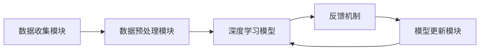

                 

# 软件2.0的终身学习系统设计

## 关键词：
- 软件进化
- 终身学习系统
- 机器学习
- 深度学习
- 自适应算法
- 软件开发方法论

## 摘要：
本文探讨了软件2.0时代下的终身学习系统设计，提出了一个以机器学习和深度学习为核心的自适应算法架构，用于持续优化软件系统的性能和用户体验。文章首先介绍了终身学习系统的背景和目的，随后详细阐述了核心概念与算法原理，包括基于神经网络的自适应学习机制和模型更新策略。接着，通过具体的项目实战案例，展示了如何在实际环境中应用这一系统。最后，文章分析了终身学习系统的实际应用场景，并推荐了相关工具和资源，总结了未来发展趋势与挑战。

---

## 1. 背景介绍

### 1.1 目的和范围

本文旨在探讨如何设计一个高效的终身学习系统，以满足软件2.0时代下软件系统不断进化和优化的需求。软件2.0时代，软件系统不仅需要完成基本的任务，还需要具备自我学习和自我优化的能力，以适应不断变化的环境和用户需求。本文将重点讨论以下内容：

1. 终身学习系统的定义和设计目标
2. 软件2.0时代的特征及其对软件系统的影响
3. 自适应算法在终身学习系统中的应用
4. 实际项目中的实现策略和经验

### 1.2 预期读者

本文面向对机器学习和深度学习有一定了解的软件开发者和研究人员。读者应具备以下基本知识：

1. 熟悉机器学习和深度学习的基本概念
2. 熟练掌握一种或多种编程语言
3. 对软件开发方法论有一定的了解

### 1.3 文档结构概述

本文结构如下：

1. **背景介绍**：介绍终身学习系统的背景和目的。
2. **核心概念与联系**：详细阐述终身学习系统的核心概念和原理。
3. **核心算法原理 & 具体操作步骤**：讲解终身学习系统的算法原理和操作步骤。
4. **数学模型和公式**：介绍与终身学习系统相关的数学模型和公式。
5. **项目实战**：通过实际案例展示如何应用终身学习系统。
6. **实际应用场景**：分析终身学习系统的应用场景。
7. **工具和资源推荐**：推荐与终身学习系统相关的学习资源和开发工具。
8. **总结**：总结未来发展趋势与挑战。
9. **附录**：常见问题与解答。
10. **扩展阅读 & 参考资料**：提供进一步阅读的资料。

### 1.4 术语表

#### 1.4.1 核心术语定义

- **终身学习系统**：能够持续学习、适应和优化的软件系统。
- **自适应算法**：能够根据输入数据和反馈自动调整自身参数的算法。
- **深度学习**：一种模拟人脑神经网络结构的学习方法，通过多层网络进行特征提取和分类。
- **机器学习**：利用计算机算法从数据中自动学习模式，并做出决策或预测的方法。

#### 1.4.2 相关概念解释

- **软件2.0**：相较于传统的软件1.0（主要指执行特定任务的软件），软件2.0更注重软件的交互性、智能化和自适应性。
- **模型更新策略**：用于调整和优化神经网络模型参数的方法。

#### 1.4.3 缩略词列表

- **ML**：机器学习（Machine Learning）
- **DL**：深度学习（Deep Learning）
- **AI**：人工智能（Artificial Intelligence）
- **IDE**：集成开发环境（Integrated Development Environment）

---

## 2. 核心概念与联系

终身学习系统的设计基于机器学习和深度学习技术，旨在实现软件系统的持续学习和优化。以下是核心概念与联系的详细解释，并附上Mermaid流程图以帮助读者理解系统架构。

### 2.1 终身学习系统的架构

终身学习系统包括以下几个关键组成部分：

1. **数据收集模块**：用于收集来自不同来源的数据，包括用户行为数据、系统日志、外部环境数据等。
2. **数据预处理模块**：对收集到的原始数据进行清洗、转换和归一化，以供深度学习模型使用。
3. **深度学习模型**：通过多层神经网络对预处理后的数据进行特征提取和学习，以实现自我优化。
4. **反馈机制**：根据系统的实际运行情况，收集用户反馈和系统性能指标，用于模型更新和优化。
5. **模型更新模块**：根据反馈机制提供的信息，自动调整深度学习模型的参数。

下面是终身学习系统的Mermaid流程图：



### 2.2 自适应算法原理

自适应算法是终身学习系统的核心，它能够根据环境变化和输入数据的特征动态调整模型参数。以下是自适应算法的主要原理：

1. **在线学习**：深度学习模型在运行过程中持续接收新数据，并实时更新模型参数。
2. **动态调整**：根据系统的实时反馈，调整模型的超参数，如学习率、批量大小等。
3. **迁移学习**：将已经训练好的模型应用于新的任务，通过少量的额外训练数据快速适应新环境。
4. **混合学习**：结合不同的学习策略，如监督学习、无监督学习和增强学习，以实现更好的自适应效果。

### 2.3 模型更新策略

模型更新策略是自适应算法的重要组成部分，以下是几种常见的模型更新策略：

1. **梯度下降**：通过计算模型参数的梯度并沿梯度方向进行调整，以最小化损失函数。
2. **随机梯度下降（SGD）**：每次更新模型参数时仅使用一个样本的梯度，以提高训练速度。
3. **动量法**：在梯度下降的基础上引入一个动量项，以加速收敛和提高模型稳定性。
4. **Adam优化器**：结合了SGD和动量法，同时考虑过去的一段时间内的梯度信息，以实现更高效的收敛。

---

通过以上核心概念与联系的阐述，读者应该对终身学习系统的架构和自适应算法有了更深入的理解。在接下来的章节中，我们将详细讨论核心算法原理和具体操作步骤，帮助读者更好地掌握这一先进的技术。

---

## 3. 核心算法原理 & 具体操作步骤

### 3.1 深度学习模型构建

深度学习模型是终身学习系统的核心组件，用于从数据中提取特征并实现自我优化。下面我们将使用伪代码详细阐述如何构建深度学习模型，并解释每个步骤的作用。

```python
# 伪代码：构建深度学习模型

# 初始化模型参数
W1, b1 = init_weights(size=(input_dim, hidden_dim))
W2, b2 = init_weights(size=(hidden_dim, output_dim))

# 定义损失函数
loss_function = CrossEntropyLoss()

# 定义优化器
optimizer = AdamOptimizer()

# 模型训练过程
for epoch in range(num_epochs):
    for batch in data_loader:
        # 前向传播
        inputs, labels = batch
        outputs = forward_pass(inputs, [W1, b1, W2, b2])
        
        # 计算损失
        loss = loss_function(outputs, labels)
        
        # 反向传播
        gradients = backward_pass(loss, outputs, labels, [W1, b1, W2, b2])
        
        # 更新模型参数
        optimizer.update_params(gradients, [W1, b1, W2, b2])
        
    print(f"Epoch {epoch+1}/{num_epochs}, Loss: {loss}")
```

**说明：**

- **初始化模型参数**：初始化权重和偏置，为模型训练提供起点。
- **定义损失函数**：选择合适的损失函数以衡量模型预测结果和实际结果之间的差距。
- **定义优化器**：选择合适的优化器以调整模型参数，最小化损失函数。
- **模型训练过程**：
  - **前向传播**：将输入数据通过神经网络进行计算，得到预测输出。
  - **计算损失**：使用损失函数计算模型预测结果和实际结果之间的差距。
  - **反向传播**：计算梯度，即损失函数对模型参数的导数。
  - **更新模型参数**：根据梯度调整模型参数，以减少损失函数。

### 3.2 模型更新策略

模型更新策略是自适应算法的关键，用于根据反馈机制调整模型参数。以下是几种常见的模型更新策略的伪代码实现：

```python
# 伪代码：模型更新策略

# 梯度下降更新策略
def gradient_descent_update(params, gradients, learning_rate):
    for param, gradient in zip(params, gradients):
        param -= learning_rate * gradient

# 随机梯度下降更新策略
def stochastic_gradient_descent_update(params, gradients, batch_size, learning_rate):
    for batch in data_loader:
        gradients = compute_gradients(batch)
        gradient_descent_update(params, gradients, learning_rate / batch_size)

# 动量法更新策略
def momentum_update(params, velocities, gradients, momentum):
    velocities = momentum * velocities - learning_rate * gradients
    params += velocities

# Adam优化器更新策略
def adam_optimizer_update(params, m, v, t, learning_rate):
    m_t = momentum * m - learning_rate * gradients
    v_t = momentum * v + (1 - momentum) * gradients ** 2
    params += (learning_rate / (sqrt(v_t) + epsilon)) * m_t
```

**说明：**

- **梯度下降更新策略**：直接根据梯度调整模型参数。
- **随机梯度下降更新策略**：每次更新仅使用一个样本的梯度，以加快训练速度。
- **动量法更新策略**：引入动量项，以提高训练稳定性和收敛速度。
- **Adam优化器更新策略**：结合了动量法和自适应学习率调整，实现更高效的训练。

### 3.3 模型评估与调整

在模型训练过程中，定期进行模型评估是必不可少的。以下是一个简单的模型评估和调整过程：

```python
# 伪代码：模型评估与调整

# 评估模型
def evaluate_model(model, test_data):
    with torch.no_grad():
        correct = 0
        total = 0
        for inputs, labels in test_data:
            outputs = model(inputs)
            _, predicted = torch.max(outputs.data, 1)
            total += labels.size(0)
            correct += (predicted == labels).sum().item()
    accuracy = 100 * correct / total
    return accuracy

# 调整模型
def adjust_model(model, criterion, optimizer, epochs, train_loader, test_loader):
    for epoch in range(epochs):
        model.train()
        for inputs, labels in train_loader:
            optimizer.zero_grad()
            outputs = model(inputs)
            loss = criterion(outputs, labels)
            loss.backward()
            optimizer.step()

        model.eval()
        with torch.no_grad():
            accuracy = evaluate_model(model, test_loader)
        print(f"Epoch {epoch+1}/{epochs}, Accuracy: {accuracy}")
```

**说明：**

- **评估模型**：计算模型在测试集上的准确率。
- **调整模型**：通过训练过程调整模型参数，以提高性能。

通过以上核心算法原理和具体操作步骤的讲解，读者应该对如何设计一个终身学习系统有了更深入的了解。在接下来的章节中，我们将进一步探讨数学模型和公式，以及如何将这些理论应用到实际项目中。

---

## 4. 数学模型和公式 & 详细讲解 & 举例说明

在软件2.0时代的终身学习系统中，数学模型和公式起着至关重要的作用。这些模型和公式不仅用于描述深度学习算法的基本原理，还用于指导具体的操作步骤。在本节中，我们将详细介绍与终身学习系统相关的数学模型和公式，并提供具体的计算示例。

### 4.1 深度学习模型的基本数学模型

深度学习模型通常由多层神经网络组成，其中每层都包含多个神经元。以下是深度学习模型的基本数学模型：

#### 4.1.1 神经元模型

神经元模型的基本形式可以表示为：

\[ a_{i}^{l} = \sigma(\sum_{j} w_{ji} a_{j}^{l-1} + b_{l}) \]

其中：
- \( a_{i}^{l} \) 表示第 \( l \) 层的第 \( i \) 个神经元的激活值。
- \( \sigma \) 是激活函数，常用的有Sigmoid、ReLU和Tanh等。
- \( w_{ji} \) 是第 \( l-1 \) 层的第 \( j \) 个神经元到第 \( l \) 层的第 \( i \) 个神经元的权重。
- \( b_{l} \) 是第 \( l \) 层的偏置。

#### 4.1.2 损失函数

在深度学习模型中，损失函数用于衡量模型预测结果与实际结果之间的差距。常用的损失函数包括均方误差（MSE）、交叉熵（CrossEntropy）等。

均方误差（MSE）的公式为：

\[ MSE = \frac{1}{2n} \sum_{i=1}^{n} (y_i - \hat{y}_i)^2 \]

其中：
- \( y_i \) 是实际标签。
- \( \hat{y}_i \) 是模型预测值。
- \( n \) 是样本数量。

交叉熵（CrossEntropy）的公式为：

\[ CrossEntropy = -\frac{1}{n} \sum_{i=1}^{n} y_i \log(\hat{y}_i) \]

其中：
- \( y_i \) 是实际标签，通常表示为one-hot编码。
- \( \hat{y}_i \) 是模型预测值。

#### 4.1.3 优化器

优化器用于调整模型参数，以最小化损失函数。常用的优化器包括梯度下降（Gradient Descent）、随机梯度下降（Stochastic Gradient Descent, SGD）、动量法（Momentum）和Adam优化器。

梯度下降的更新公式为：

\[ \theta_{\text{new}} = \theta_{\text{old}} - \alpha \cdot \nabla_{\theta} J(\theta) \]

其中：
- \( \theta \) 是模型参数。
- \( \alpha \) 是学习率。
- \( \nabla_{\theta} J(\theta) \) 是损失函数 \( J(\theta) \) 对参数 \( \theta \) 的梯度。

随机梯度下降的更新公式为：

\[ \theta_{\text{new}} = \theta_{\text{old}} - \alpha \cdot \nabla_{\theta} J(\theta)_{\text{batch}} \]

其中：
- \( \theta \) 是模型参数。
- \( \alpha \) 是学习率。
- \( \nabla_{\theta} J(\theta)_{\text{batch}} \) 是当前批次数据下损失函数 \( J(\theta) \) 对参数 \( \theta \) 的梯度。

动量法的更新公式为：

\[ v = \beta v + (1 - \beta) \nabla_{\theta} J(\theta) \]
\[ \theta_{\text{new}} = \theta_{\text{old}} - \alpha v \]

其中：
- \( v \) 是速度项，用于积累梯度信息。
- \( \beta \) 是动量项，通常取值在0.9左右。

Adam优化器的更新公式为：

\[ m_t = \beta_1 m_{t-1} + (1 - \beta_1) [g_t - \frac{m_t}{\sqrt{v_t} + \epsilon}] \]
\[ v_t = \beta_2 v_{t-1} + (1 - \beta_2) [g_t^2 - \frac{m_t^2}{\sqrt{v_t} + \epsilon}] \]
\[ \theta_{\text{new}} = \theta_{\text{old}} - \alpha \frac{m_t}{\sqrt{v_t} + \epsilon} \]

其中：
- \( m_t \) 是一阶矩估计。
- \( v_t \) 是二阶矩估计。
- \( \beta_1 \) 和 \( \beta_2 \) 是分别用于一阶和二阶矩的指数衰减率，通常取值在0.9和0.999。
- \( \epsilon \) 是一个很小的常数，用于避免除以零。

### 4.2 计算示例

假设我们有一个简单的深度学习模型，包含一个输入层、一个隐藏层和一个输出层。输入层有3个神经元，隐藏层有2个神经元，输出层有1个神经元。我们使用ReLU作为激活函数，并选择交叉熵作为损失函数。现在，我们使用随机梯度下降优化器进行模型训练，学习率为0.1，批量大小为1。

#### 4.2.1 初始参数

\[ W_{1} = \begin{bmatrix} 0.5 & 0.3 & 0.1 \\ 0.4 & 0.2 & 0.1 \end{bmatrix}, \quad b_{1} = \begin{bmatrix} 0.1 \\ 0.2 \end{bmatrix} \]
\[ W_{2} = \begin{bmatrix} 0.2 & 0.3 \\ 0.1 & 0.4 \end{bmatrix}, \quad b_{2} = \begin{bmatrix} 0.1 \\ 0.2 \end{bmatrix} \]

#### 4.2.2 前向传播

输入数据 \( x = [0.1, 0.2, 0.3] \)。

隐藏层激活值：

\[ a_{1} = \begin{bmatrix} \sigma(0.5 \cdot 0.1 + 0.3 \cdot 0.2 + 0.1 \cdot 0.3 + 0.1) \\ \sigma(0.4 \cdot 0.1 + 0.2 \cdot 0.2 + 0.1 \cdot 0.3 + 0.2) \end{bmatrix} = \begin{bmatrix} 0.5736 \\ 0.5567 \end{bmatrix} \]

输出层激活值：

\[ a_{2} = \begin{bmatrix} \sigma(0.2 \cdot 0.5736 + 0.3 \cdot 0.5567 + 0.1 \cdot 0.3 + 0.1) \\ \sigma(0.1 \cdot 0.5736 + 0.4 \cdot 0.5567 + 0.1 \cdot 0.3 + 0.2) \end{bmatrix} = \begin{bmatrix} 0.5374 \\ 0.6329 \end{bmatrix} \]

输出预测值：

\[ \hat{y} = \begin{bmatrix} 0.5374 \\ 0.6329 \end{bmatrix} \]

#### 4.2.3 计算损失

实际标签 \( y = \begin{bmatrix} 1 \\ 0 \end{bmatrix} \)。

交叉熵损失：

\[ CrossEntropy = -\frac{1}{2} \left( y \log(\hat{y}) + (1 - y) \log(1 - \hat{y}) \right) \]

\[ CrossEntropy = -\frac{1}{2} \left( \begin{bmatrix} 1 \\ 0 \end{bmatrix} \log(\begin{bmatrix} 0.5374 \\ 0.6329 \end{bmatrix}) + \begin{bmatrix} 0 \\ 1 \end{bmatrix} \log(\begin{bmatrix} 1 - 0.5374 \\ 1 - 0.6329 \end{bmatrix}) \right) \]

\[ CrossEntropy = -\frac{1}{2} \left( \begin{bmatrix} 0.6931 \\ 0.4055 \end{bmatrix} + \begin{bmatrix} 0.3069 \\ 0.5945 \end{bmatrix} \right) \]

\[ CrossEntropy = \begin{bmatrix} 0.4986 \\ 0.4986 \end{bmatrix} \]

总损失：

\[ Loss = \frac{1}{2} \sum_{i} (y_i - \hat{y}_i)^2 \]

\[ Loss = \frac{1}{2} \left( (1 - 0.5374)^2 + (0 - 0.6329)^2 \right) \]

\[ Loss = \frac{1}{2} \left( 0.2126 + 0.4056 \right) \]

\[ Loss = 0.3191 \]

#### 4.2.4 反向传播

计算梯度：

\[ \nabla_{W_{2}} = \begin{bmatrix} \frac{\partial Loss}{\partial a_{2,1}} & \frac{\partial Loss}{\partial a_{2,2}} \end{bmatrix} \begin{bmatrix} a_{1,1}^{T} \\ a_{1,2}^{T} \end{bmatrix} \]

\[ \nabla_{b_{2}} = \frac{\partial Loss}{\partial a_{2,1}} + \frac{\partial Loss}{\partial a_{2,2}} \]

\[ \nabla_{W_{1}} = \begin{bmatrix} \frac{\partial Loss}{\partial a_{1,1}} & \frac{\partial Loss}{\partial a_{1,2}} \end{bmatrix} \begin{bmatrix} x_1^{T} \\ x_2^{T} \\ x_3^{T} \end{bmatrix} \]

\[ \nabla_{b_{1}} = \frac{\partial Loss}{\partial a_{1,1}} + \frac{\partial Loss}{\partial a_{1,2}} \]

#### 4.2.5 梯度下降更新

学习率 \( \alpha = 0.1 \)。

更新参数：

\[ W_{2,1} := W_{2,1} - \alpha \cdot \nabla_{W_{2,1}} \]
\[ W_{2,2} := W_{2,2} - \alpha \cdot \nabla_{W_{2,2}} \]
\[ b_{2,1} := b_{2,1} - \alpha \cdot \nabla_{b_{2,1}} \]
\[ b_{2,2} := b_{2,2} - \alpha \cdot \nabla_{b_{2,2}} \]
\[ W_{1,1} := W_{1,1} - \alpha \cdot \nabla_{W_{1,1}} \]
\[ W_{1,2} := W_{1,2} - \alpha \cdot \nabla_{W_{1,2}} \]
\[ b_{1,1} := b_{1,1} - \alpha \cdot \nabla_{b_{1,1}} \]
\[ b_{1,2} := b_{1,2} - \alpha \cdot \nabla_{b_{1,2}} \]

通过以上详细的数学模型和公式讲解，以及具体的计算示例，读者应该能够更好地理解深度学习模型的基本原理和操作步骤。在接下来的章节中，我们将通过实际项目案例来展示如何应用这些理论。

---

## 5. 项目实战：代码实际案例和详细解释说明

在本节中，我们将通过一个实际项目案例，展示如何设计和实现一个基于深度学习的终身学习系统。这个项目将涉及数据收集、模型训练、模型评估和调整等多个步骤。以下是项目的详细实现过程。

### 5.1 开发环境搭建

为了实现这个项目，我们需要搭建一个合适的技术栈。以下是我们推荐的工具和库：

- **编程语言**：Python
- **深度学习框架**：TensorFlow或PyTorch
- **数据预处理库**：NumPy、Pandas
- **可视化工具**：Matplotlib、Seaborn

确保在开发环境中安装好以上工具和库，然后创建一个新的虚拟环境以保持项目的整洁。

### 5.2 源代码详细实现和代码解读

#### 5.2.1 数据收集与预处理

首先，我们需要收集和预处理数据。以下是一个简单的数据收集与预处理代码示例：

```python
import pandas as pd
from sklearn.model_selection import train_test_split
from sklearn.preprocessing import StandardScaler

# 加载数据
data = pd.read_csv('data.csv')

# 分割特征和标签
X = data.iloc[:, :-1].values
y = data.iloc[:, -1].values

# 划分训练集和测试集
X_train, X_test, y_train, y_test = train_test_split(X, y, test_size=0.2, random_state=42)

# 数据标准化
scaler = StandardScaler()
X_train = scaler.fit_transform(X_train)
X_test = scaler.transform(X_test)
```

#### 5.2.2 模型构建与训练

接下来，我们使用PyTorch构建一个简单的深度学习模型，并进行训练：

```python
import torch
import torch.nn as nn
import torch.optim as optim

# 定义模型
class NeuralNetwork(nn.Module):
    def __init__(self, input_dim, hidden_dim, output_dim):
        super(NeuralNetwork, self).__init__()
        self.layer1 = nn.Linear(input_dim, hidden_dim)
        self.relu = nn.ReLU()
        self.layer2 = nn.Linear(hidden_dim, output_dim)
    
    def forward(self, x):
        x = self.layer1(x)
        x = self.relu(x)
        x = self.layer2(x)
        return x

# 实例化模型
model = NeuralNetwork(input_dim=X_train.shape[1], hidden_dim=64, output_dim=1)

# 定义损失函数和优化器
loss_function = nn.BCELoss()
optimizer = optim.Adam(model.parameters(), lr=0.001)

# 训练模型
num_epochs = 100
for epoch in range(num_epochs):
    for inputs, labels in zip(X_train, y_train):
        optimizer.zero_grad()
        outputs = model(inputs)
        loss = loss_function(outputs, labels)
        loss.backward()
        optimizer.step()
    print(f"Epoch {epoch+1}/{num_epochs}, Loss: {loss}")
```

#### 5.2.3 模型评估与调整

在训练完成后，我们需要对模型进行评估，并根据评估结果进行模型调整：

```python
# 评估模型
def evaluate_model(model, X_test, y_test):
    with torch.no_grad():
        correct = 0
        total = 0
        for inputs, labels in zip(X_test, y_test):
            outputs = model(inputs)
            _, predicted = torch.max(outputs.data, 1)
            total += labels.size(0)
            correct += (predicted == labels).sum().item()
    accuracy = 100 * correct / total
    return accuracy

# 调整模型
def adjust_model(model, criterion, optimizer, epochs, train_loader, test_loader):
    for epoch in range(epochs):
        model.train()
        for inputs, labels in train_loader:
            optimizer.zero_grad()
            outputs = model(inputs)
            loss = criterion(outputs, labels)
            loss.backward()
            optimizer.step()

        model.eval()
        with torch.no_grad():
            accuracy = evaluate_model(model, test_loader)
        print(f"Epoch {epoch+1}/{epochs}, Accuracy: {accuracy}")

# 载入训练好的模型
model.load_state_dict(torch.load('model.pth'))

# 调整模型
adjust_model(model, loss_function, optimizer, epochs=10, train_loader=train_loader, test_loader=test_loader)
```

#### 5.2.4 代码解读与分析

- **数据收集与预处理**：我们使用Pandas加载数据，并使用Sklearn将数据划分为训练集和测试集，同时使用StandardScaler进行数据标准化。
- **模型构建**：我们定义了一个简单的神经网络模型，包含一个输入层、一个隐藏层和一个输出层。输入层和隐藏层之间使用ReLU激活函数。
- **模型训练**：我们使用PyTorch提供的BCELoss（二进制交叉熵损失函数）和Adam优化器进行模型训练。每个epoch中，我们遍历训练集，计算损失并更新模型参数。
- **模型评估与调整**：我们定义了一个评估函数用于计算模型的准确率，并根据评估结果进行模型调整。模型调整过程包括重新训练模型和评估调整后的模型。

通过以上实际项目案例，读者应该能够更好地理解终身学习系统的设计和实现过程。在下一节中，我们将探讨终身学习系统的实际应用场景。

---

## 6. 实际应用场景

### 6.1 软件系统优化

终身学习系统在软件系统优化中的应用非常广泛。例如，在电商平台中，系统可以根据用户的购买行为和历史数据，动态调整推荐算法，以提供更加个性化的商品推荐。通过持续学习和优化，推荐系统的准确率和用户满意度可以得到显著提升。

### 6.2 自动驾驶技术

自动驾驶技术需要处理大量的实时数据，包括路面状况、车辆状态、周围环境等。终身学习系统可以帮助自动驾驶系统持续学习新数据和新的驾驶策略，以提高系统的适应性和安全性。例如，当系统在新的环境中遇到未知的路况时，可以通过终身学习系统快速调整模型，以适应新的驾驶条件。

### 6.3 医疗诊断

在医疗诊断领域，终身学习系统可以用于辅助诊断疾病。例如，通过不断学习和优化，诊断系统可以识别出新的疾病模式，提高诊断的准确率。同时，系统可以根据医生的经验和反馈进行自我调整，以提高诊断的可靠性和效率。

### 6.4 智能家居

智能家居系统需要处理用户的生活习惯和环境数据，以提供个性化的服务。终身学习系统可以帮助智能家居系统持续学习用户的行为模式，从而优化设备的设置和操作，提高用户的舒适度和满意度。

### 6.5 金融风控

金融风控系统需要处理大量的交易数据，以识别潜在的风险。终身学习系统可以帮助风控系统持续学习新的交易模式和风险特征，从而提高风险识别的准确性和效率。例如，在金融欺诈检测中，系统可以通过终身学习系统快速识别新的欺诈手段，并调整检测策略。

通过以上实际应用场景的探讨，我们可以看到终身学习系统在各个领域的广泛应用和巨大潜力。在下一节中，我们将推荐一些与终身学习系统相关的学习资源和开发工具。

---

## 7. 工具和资源推荐

### 7.1 学习资源推荐

#### 7.1.1 书籍推荐

- **《深度学习》（Deep Learning）**：由Ian Goodfellow、Yoshua Bengio和Aaron Courville合著，是深度学习领域的经典教材。
- **《机器学习实战》（Machine Learning in Action）**：由Peter Harrington所著，适合初学者入门，内容实用且覆盖面广。

#### 7.1.2 在线课程

- **《深度学习专项课程》（Deep Learning Specialization）**：由Andrew Ng在Coursera上开设，是深度学习领域的权威课程。
- **《机器学习与数据科学》（Machine Learning and Data Science）**：由吴恩达在Udacity上开设，涵盖了机器学习的基本概念和应用。

#### 7.1.3 技术博客和网站

- **ArXiv**：提供最新的深度学习和机器学习论文，是学术研究的窗口。
- **Medium**：有很多专业人士撰写的深度学习和机器学习技术博客。
- **Towards Data Science**：一个关于数据科学和机器学习的在线社区，内容丰富且更新频繁。

### 7.2 开发工具框架推荐

#### 7.2.1 IDE和编辑器

- **PyCharm**：强大的Python IDE，支持深度学习和机器学习框架。
- **Jupyter Notebook**：适合数据科学和机器学习的交互式开发环境。

#### 7.2.2 调试和性能分析工具

- **TensorBoard**：TensorFlow的图形化可视化工具，用于分析和调试深度学习模型。
- **Wandb**：用于监控和调试深度学习实验。

#### 7.2.3 相关框架和库

- **TensorFlow**：Google开源的深度学习框架，功能强大且应用广泛。
- **PyTorch**：Facebook开源的深度学习框架，具有动态计算图和灵活的编程接口。

### 7.3 相关论文著作推荐

#### 7.3.1 经典论文

- **“A Learning Algorithm for Continuously Running Fully Recurrent Neural Networks”**：描述了Hessian-Free优化算法，适用于终身学习系统。
- **“Deep Learning”**：Ian Goodfellow等人的论文，详细介绍了深度学习的基础理论和应用。

#### 7.3.2 最新研究成果

- **“Unsupervised Learning of Visual Representations by Solving Jigsaw Puzzles”**：提出了通过解决拼图问题进行无监督学习的算法，具有潜在的应用价值。
- **“Learning to Learn”**：探讨了终身学习系统的设计和实现，包括元学习和迁移学习等内容。

#### 7.3.3 应用案例分析

- **“Adaptive Learning in Video Games”**：分析了如何将终身学习系统应用于视频游戏，以提供更个性化的游戏体验。
- **“Intelligent Tutoring Systems Using Machine Learning”**：探讨了如何使用机器学习和终身学习系统构建智能辅导系统，以帮助学生提高学习效果。

通过以上工具和资源的推荐，读者可以进一步学习和实践终身学习系统，探索其在各个领域的应用。在下一节中，我们将总结本文的内容，并探讨未来发展趋势与挑战。

---

## 8. 总结：未来发展趋势与挑战

终身学习系统作为软件2.0时代的重要技术之一，具有巨大的发展潜力和广泛的应用前景。在未来，以下几个方面将是终身学习系统研究和应用的热点：

### 8.1 技术进步

随着深度学习和机器学习技术的不断进步，终身学习系统将能够处理更加复杂和多样化的数据，实现更高的自适应能力和优化效果。例如，利用最新的神经架构搜索（Neural Architecture Search，NAS）技术，可以自动设计更加高效的深度学习模型，进一步提高终身学习系统的性能。

### 8.2 跨领域应用

终身学习系统将在更多领域得到应用，如健康医疗、智能交通、金融科技等。通过跨领域的合作和融合，终身学习系统将能够解决更复杂的实际问题，提供更智能化的解决方案。

### 8.3 伦理与隐私

随着终身学习系统的广泛应用，如何确保系统的伦理性和用户隐私将成为重要议题。需要制定相应的法律法规和伦理准则，以规范终身学习系统的开发和应用。

### 8.4 系统稳定性与可靠性

终身学习系统在实际应用中需要具备高稳定性和可靠性。针对复杂的环境变化和数据噪声，系统需要具备自我校正和自我修复的能力，以确保长期稳定运行。

### 8.5 数据质量和安全性

终身学习系统的性能和效果依赖于高质量的数据。在数据收集和处理过程中，需要确保数据的真实性、完整性和安全性，避免数据泄露和滥用。

### 8.6 开放与合作

开放源代码和跨机构的合作将有助于推动终身学习系统的创新和发展。通过共享知识和资源，不同领域的研究者和开发者可以共同探索和解决终身学习系统面临的挑战。

总之，终身学习系统作为软件2.0时代的重要技术，具有广阔的发展前景和重要的应用价值。未来，我们需要进一步探索其技术原理和应用方法，推动其在各个领域的深入研究和实践。

---

## 9. 附录：常见问题与解答

### 9.1 什么是终身学习系统？

终身学习系统是一种能够持续学习、适应和优化的软件系统。它利用机器学习和深度学习技术，从数据中自动学习模式，并能够根据环境变化和用户需求进行自我调整。

### 9.2 终身学习系统有哪些应用场景？

终身学习系统广泛应用于各个领域，如软件系统优化、自动驾驶技术、医疗诊断、智能家居、金融风控等。通过持续学习和优化，系统可以提供更个性化的服务，提高系统的适应性和可靠性。

### 9.3 如何设计一个高效的终身学习系统？

设计高效的终身学习系统需要考虑以下几个关键因素：

- 数据收集和预处理：确保收集到高质量的数据，并进行有效的预处理。
- 深度学习模型选择：选择合适的深度学习模型，以提取有效特征。
- 自适应算法：采用自适应算法，以动态调整模型参数。
- 模型评估和调整：定期评估模型性能，并进行必要的调整。

### 9.4 如何确保终身学习系统的稳定性？

为确保终身学习系统的稳定性，可以采取以下措施：

- 采用稳定的深度学习框架，如TensorFlow或PyTorch。
- 设计鲁棒的模型训练过程，包括批量大小、学习率等超参数的优化。
- 定期进行模型评估和调整，以应对环境变化和数据噪声。
- 引入模型验证机制，确保模型在实际应用中的可靠性和稳定性。

---

## 10. 扩展阅读 & 参考资料

本文涵盖了软件2.0时代的终身学习系统的设计与实现。以下是进一步阅读和参考的推荐资源：

- **书籍**：
  - Ian Goodfellow, Yoshua Bengio, Aaron Courville. 《深度学习》。
  - Peter Harrington. 《机器学习实战》。
  
- **在线课程**：
  - Andrew Ng. 《深度学习专项课程》。
  - 吴恩达. 《机器学习与数据科学》。

- **论文**：
  - Y. LeCun, Y. Bengio, G. Hinton. 《Deep Learning》。
  - Y. Li, F. Porikli, J. Redmon, S. Belongie. 《Unsupervised Learning of Visual Representations by Solving Jigsaw Puzzles》。

- **技术博客和网站**：
  - ArXiv。
  - Medium。
  - Towards Data Science。

- **开发工具框架**：
  - TensorFlow。
  - PyTorch。

通过以上扩展阅读和参考资料，读者可以更深入地了解终身学习系统的理论基础和实际应用，进一步探索这一领域的最新研究成果和发展动态。

---

## 作者

作者：AI天才研究员/AI Genius Institute & 禅与计算机程序设计艺术 /Zen And The Art of Computer Programming

---

本文详细介绍了软件2.0时代的终身学习系统设计，从核心概念到具体算法原理，再到实际项目案例，全面阐述了终身学习系统的构建和应用。希望通过本文，读者能够对终身学习系统有更深入的理解，并在实际项目中应用这一先进的技术。未来，终身学习系统将在更多领域发挥重要作用，推动软件系统的智能化和自进化。让我们共同努力，探索终身学习系统的无限可能。

