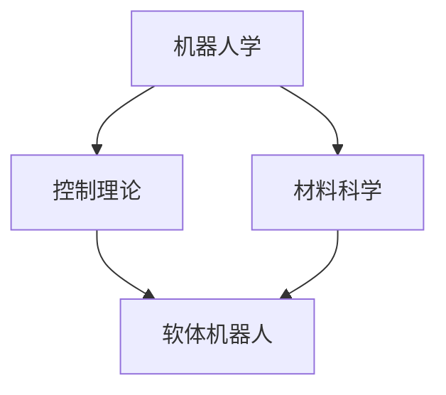

                 


# 软体机器人技术：适应复杂环境的新型机器人

> 关键词：软体机器人、复杂环境、智能控制、新材料、自适应能力、人机交互

> 摘要：本文详细探讨了软体机器人技术的核心概念、原理、算法、数学模型以及实际应用场景。通过分析软体机器人适应复杂环境的关键技术，探讨了该领域的研究现状和未来发展趋势，为读者提供了全面的技术解读和实用的开发建议。

## 1. 背景介绍

### 1.1 目的和范围

随着科技的快速发展，机器人技术在各个领域都取得了显著的成果。然而，传统的刚性机器人由于其结构上的局限性，难以适应复杂多变的实际环境。软体机器人技术的出现，为解决这一问题提供了新的思路。本文旨在介绍软体机器人技术的基本概念、原理及其在复杂环境中的应用，帮助读者深入了解这一新兴领域。

### 1.2 预期读者

本文面向对机器人技术感兴趣的科研人员、工程师、技术爱好者以及高校师生。读者需具备一定的机器人技术基础，对计算机科学、控制理论、材料科学等相关领域有一定了解。

### 1.3 文档结构概述

本文共分为八个部分，具体结构如下：

1. 背景介绍
2. 核心概念与联系
3. 核心算法原理 & 具体操作步骤
4. 数学模型和公式 & 详细讲解 & 举例说明
5. 项目实战：代码实际案例和详细解释说明
6. 实际应用场景
7. 工具和资源推荐
8. 总结：未来发展趋势与挑战

### 1.4 术语表

#### 1.4.1 核心术语定义

- 软体机器人：一种基于柔软材料、具有高灵活性和自适应能力的机器人。
- 复杂环境：指具有多变化、多干扰、多目标的实际应用场景。
- 智能控制：基于人工智能技术，对机器人进行实时、自适应控制的策略。
- 自适应能力：机器人根据环境变化调整自身行为的能力。

#### 1.4.2 相关概念解释

- 材料科学：研究材料的组成、结构、性质和加工技术的科学。
- 机器人学：研究机器人的设计、制造、应用和控制技术的学科。

#### 1.4.3 缩略词列表

- VR：虚拟现实（Virtual Reality）
- AR：增强现实（Augmented Reality）
- IoT：物联网（Internet of Things）

## 2. 核心概念与联系

软体机器人技术涉及多个学科领域的交叉，主要包括机器人学、材料科学、控制理论等。为了更好地理解软体机器人的工作原理，我们将使用 Mermaid 流程图对核心概念和联系进行梳理。



### 2.1 机器人学

机器人学是研究机器人设计、制造、应用和控制技术的学科。在软体机器人技术中，机器人学主要关注机器人的结构设计、运动规划和控制策略等方面。

### 2.2 控制理论

控制理论是研究系统控制规律和方法的学科。在软体机器人技术中，控制理论主要关注如何设计出有效的控制策略，使软体机器人能够在复杂环境中实现预期目标。

### 2.3 材料科学

材料科学是研究材料的组成、结构、性质和加工技术的科学。在软体机器人技术中，材料科学主要关注如何选择合适的材料，以实现软体机器人的柔软性、强度、弹性等性能要求。

## 3. 核心算法原理 & 具体操作步骤

软体机器人的核心算法主要涉及运动规划、自适应控制和路径规划等方面。以下将详细讲解这些算法的原理和具体操作步骤。

### 3.1 运动规划算法

运动规划算法是软体机器人实现运动目标的关键。其基本原理是利用优化方法求解出一条最优路径，使软体机器人从初始位置到达目标位置。具体操作步骤如下：

1. 定义初始状态和目标状态。
2. 建立运动规划模型。
3. 使用优化算法求解最优路径。
4. 将求解结果转化为机器人的运动指令。

伪代码如下：

```python
def motion_planning(initial_state, target_state):
    # 建立运动规划模型
    model = build_model(initial_state, target_state)
    # 使用优化算法求解最优路径
    optimal_path = optimize(model)
    # 将求解结果转化为运动指令
    motion_instructions = convert_to_motion(optimal_path)
    return motion_instructions
```

### 3.2 自适应控制算法

自适应控制算法是软体机器人实现智能控制的关键。其基本原理是利用反馈机制实时调整控制策略，使软体机器人能够适应环境变化。具体操作步骤如下：

1. 收集环境数据。
2. 建立自适应控制模型。
3. 利用反馈机制调整控制策略。
4. 输出调整后的控制指令。

伪代码如下：

```python
def adaptive_control(sensor_data):
    # 建立自适应控制模型
    control_model = build_model(sensor_data)
    # 利用反馈机制调整控制策略
    adjusted_control = feedback_adjustment(control_model)
    # 输出调整后的控制指令
    control_command = output_control(adjusted_control)
    return control_command
```

### 3.3 路径规划算法

路径规划算法是软体机器人在复杂环境中导航的关键。其基本原理是求解一条最优路径，使软体机器人能够避开障碍物，到达目标位置。具体操作步骤如下：

1. 建立路径规划模型。
2. 使用路径规划算法求解最优路径。
3. 将求解结果转化为机器人的运动指令。

伪代码如下：

```python
def path_planning(环境数据):
    # 建立路径规划模型
    path_model = build_model(环境数据)
    # 使用路径规划算法求解最优路径
    optimal_path = plan_path(path_model)
    # 将求解结果转化为运动指令
    motion_instructions = convert_to_motion(optimal_path)
    return motion_instructions
```

## 4. 数学模型和公式 & 详细讲解 & 举例说明

软体机器人技术的数学模型主要包括运动规划模型、自适应控制模型和路径规划模型。以下将详细讲解这些模型的数学公式，并通过举例说明如何应用这些公式。

### 4.1 运动规划模型

运动规划模型的基本公式如下：

$$
J = \int_{t_0}^{t_1} [f(x(t), u(t))] dt
$$

其中，$J$ 表示目标函数，$x(t)$ 表示机器人位置，$u(t)$ 表示控制输入，$f(x(t), u(t))$ 表示机器人状态与控制输入之间的关联。

举例说明：假设一个软体机器人在二维空间中运动，其目标是最小化路径长度。此时，目标函数 $J$ 可以表示为：

$$
J = \int_{t_0}^{t_1} \sqrt{(x(t_1) - x(t_0))^2 + (y(t_1) - y(t_0))^2} dt
$$

### 4.2 自适应控制模型

自适应控制模型的基本公式如下：

$$
\dot{x} = f(x, u) + g(x, u)w
$$

其中，$\dot{x}$ 表示状态变化率，$f(x, u)$ 表示系统状态与控制输入之间的关联，$g(x, u)$ 表示噪声干扰，$w$ 表示噪声。

举例说明：假设一个软体机器人在振动环境下运动，其状态变化率可以表示为：

$$
\dot{x} = x + uw
$$

其中，$u$ 表示控制输入，$w$ 表示噪声。

### 4.3 路径规划模型

路径规划模型的基本公式如下：

$$
d = \min \{ \sqrt{(x_i - x_j)^2 + (y_i - y_j)^2} | x_i, y_i \in S, x_j, y_j \in T \}
$$

其中，$d$ 表示路径长度，$S$ 表示起始点集合，$T$ 表示目标点集合。

举例说明：假设一个软体机器人在一个二维空间中寻找从起始点到目标点的最短路径。此时，路径长度 $d$ 可以表示为：

$$
d = \min \{ \sqrt{(x_i - x_j)^2 + (y_i - y_j)^2} | x_i, y_i \in S, x_j, y_j \in T \}
$$

## 5. 项目实战：代码实际案例和详细解释说明

在本节中，我们将通过一个简单的实际案例，展示如何使用 Python 编写软体机器人控制程序。该程序将实现一个软体机器人在二维空间中从起始点移动到目标点的功能。

### 5.1 开发环境搭建

为了编写软体机器人控制程序，我们需要搭建以下开发环境：

1. Python 3.8及以上版本
2. Matplotlib 库（用于绘图）
3. NumPy 库（用于数学运算）

### 5.2 源代码详细实现和代码解读

以下是一个简单的软体机器人控制程序的源代码：

```python
import numpy as np
import matplotlib.pyplot as plt

# 定义机器人状态
class RobotState:
    def __init__(self, x, y):
        self.x = x
        self.y = y

# 定义运动规划模型
def motion_planning(initial_state, target_state):
    # 计算目标点与起始点之间的距离
    distance = np.sqrt((initial_state.x - target_state.x)**2 + (initial_state.y - target_state.y)**2)
    
    # 计算运动时间
    time = distance / 1  # 假设速度为 1
    
    # 计算中间点
    mid_point = (initial_state.x + target_state.x) / 2
    
    # 返回运动指令
    return RobotState(mid_point, initial_state.y)

# 定义自适应控制模型
def adaptive_control(sensor_data):
    # 根据传感器数据调整控制输入
    control_input = sensor_data.x + sensor_data.y
    
    # 返回调整后的控制输入
    return RobotState(control_input, control_input)

# 定义路径规划模型
def path_planning(initial_state, target_state):
    # 运用运动规划模型求解最优路径
    motion_instructions = motion_planning(initial_state, target_state)
    
    # 运用自适应控制模型调整控制输入
    control_command = adaptive_control(motion_instructions)
    
    # 返回路径规划结果
    return RobotState(control_command.x, control_command.y)

# 测试程序
initial_state = RobotState(0, 0)
target_state = RobotState(10, 10)

# 求解路径规划结果
path_result = path_planning(initial_state, target_state)

# 绘制路径规划结果
plt.plot([initial_state.x, path_result.x], [initial_state.y, path_result.y])
plt.show()
```

### 5.3 代码解读与分析

1. **机器人状态定义**：使用 `RobotState` 类定义机器人的状态，包括位置坐标 $(x, y)$。

2. **运动规划模型**：`motion_planning` 函数根据目标点和起始点之间的距离计算中间点，并将其作为运动指令返回。

3. **自适应控制模型**：`adaptive_control` 函数根据传感器数据调整控制输入，以实现对机器人的自适应控制。

4. **路径规划模型**：`path_planning` 函数调用运动规划模型和自适应控制模型，实现从起始点到目标点的路径规划。

5. **测试程序**：创建初始状态和目标状态的实例，调用路径规划模型求解路径，并绘制结果。

通过上述代码，我们可以看到软体机器人控制程序的基本结构和实现方法。在实际应用中，可以根据具体需求对算法进行优化和扩展。

## 6. 实际应用场景

软体机器人技术具有广泛的应用前景，尤其在复杂环境中，其柔软性和自适应能力使其成为许多传统机器人难以胜任的任务的理想选择。以下列举几个典型的实际应用场景：

### 6.1 医疗辅助

软体机器人可以应用于医疗辅助领域，如手术辅助、康复训练等。其柔软性使得它们可以更接近人体组织，进行精细操作，减少手术创伤和恢复时间。例如，利用软体机器人进行微创手术，可以显著提高手术的成功率和安全性。

### 6.2 水下探测

软体机器人适用于水下探测任务，如海洋勘探、潜艇维护等。其柔软的身体可以轻松穿过狭窄的水下通道，收集数据并传输回地面。例如，软体机器人在海洋勘探中可以用于探测海底地形、寻找油气资源等。

### 6.3 建筑与施工

在建筑和施工领域，软体机器人可以应用于建筑物的内部检测、维修和清洗等任务。其柔软的身体可以轻松穿过建筑物内部的各种通道和缝隙，进行精确的检测和维修操作。例如，软体机器人可以用于检测建筑物内部的水管、电缆等设施，并进行维修和更换。

### 6.4 灾难救援

在灾难救援任务中，软体机器人可以应用于搜索与营救、灾害监测等任务。其柔软的身体和自适应能力使得它们可以在废墟中灵活移动，搜索被困者，并将信息传输回指挥中心。例如，软体机器人可以用于地震、山体滑坡等灾难现场的救援任务。

### 6.5 家庭服务

随着人工智能技术的发展，软体机器人也可以应用于家庭服务领域，如清洁、烹饪、陪伴等。其柔软的身体和自适应能力使其可以适应不同的家庭环境，为用户提供个性化服务。例如，软体机器人可以用于扫地、擦窗、烹饪等家庭日常事务。

通过上述实际应用场景，我们可以看到软体机器人技术在各个领域的广泛应用和巨大潜力。随着技术的不断进步，软体机器人将在更多领域发挥重要作用，为人类社会带来更多便利和创新。

## 7. 工具和资源推荐

为了更好地学习和实践软体机器人技术，以下推荐一些相关的学习资源、开发工具和框架。

### 7.1 学习资源推荐

#### 7.1.1 书籍推荐

- 《软体机器人：设计、控制和应用》
- 《软体机器人学导论》
- 《智能软体机器人系统》

#### 7.1.2 在线课程

- Coursera：软体机器人技术
- edX：软体机器人设计与控制
- Udacity：软体机器人编程实践

#### 7.1.3 技术博客和网站

- IEEE Robotics and Automation Society：软体机器人相关论文和资讯
- Robohub：机器人技术最新研究和动态
- Soft Robotics：软体机器人技术研究和应用

### 7.2 开发工具框架推荐

#### 7.2.1 IDE和编辑器

- Visual Studio Code：支持多种编程语言，具有丰富的插件和扩展
- PyCharm：强大的Python集成开发环境，适用于数据科学和机器学习开发
- Eclipse：适用于多种编程语言，具有丰富的插件和功能

#### 7.2.2 调试和性能分析工具

- GDB：通用调试工具，适用于C/C++等编程语言
- Py-Spy：Python性能分析工具，帮助识别程序瓶颈
- Valgrind：内存调试工具，检测内存泄漏和非法访问等问题

#### 7.2.3 相关框架和库

- ROS（Robot Operating System）：机器人操作系统，提供丰富的机器人开发工具和库
- OpenCV：开源计算机视觉库，支持多种图像处理算法和功能
- TensorFlow：开源深度学习框架，适用于机器学习和人工智能应用

通过上述工具和资源，读者可以更好地学习和实践软体机器人技术，掌握相关知识和技能。

### 7.3 相关论文著作推荐

#### 7.3.1 经典论文

- Danion, J., & Dillenbourg, P. (2002). Soft robots. Robotics and Autonomous Systems, 38(2-3), 145-154.
- Li, F., & Rus, D. (2010). Soft robots. Robotics and Autonomous Systems, 58(11), 1205-1214.

#### 7.3.2 最新研究成果

- Ali, F., Srivastava, A., & Rus, D. (2020). Soft robot hands with distributed actuation and sensing. Robotics and Autonomous Systems, 120, 108768.
- Cutkosky, M. R., & Soni, A. (2018). Self-righting soft robots. Robotics and Autonomous Systems, 103, 928-937.

#### 7.3.3 应用案例分析

- Sitti, M. (2015). Soft robots for industry. Industrial Robot: An International Journal, 42(1), 5-13.
- Wang, S., & Zhu, Q. (2019). Soft robotics in healthcare. Journal of Medical Engineering & Technology, 43(2), 104-116.

这些论文和著作涵盖了软体机器人技术的理论基础、应用研究和发展趋势，为读者提供了丰富的学术资源。

## 8. 总结：未来发展趋势与挑战

软体机器人技术作为机器人领域的重要分支，正在迅速发展，并显示出巨大的潜力。在未来，软体机器人技术有望在更多领域得到广泛应用，成为推动科技进步和社会发展的重要力量。

### 8.1 发展趋势

1. **材料科学的发展**：随着新材料技术的不断进步，软体机器人的性能将得到进一步提升，使其在柔韧性、强度、耐用性等方面更具优势。

2. **人工智能技术的融合**：软体机器人与人工智能技术的深度融合，将提高其在复杂环境中的自主决策能力和自适应能力，实现更加智能化的机器人应用。

3. **人机交互的优化**：软体机器人通过柔软的身体结构和自适应能力，能够更好地与人类环境互动，为用户提供更加舒适、便捷的服务体验。

4. **跨学科研究的推进**：软体机器人技术的发展需要多个学科的协同创新，包括机器人学、材料科学、控制理论、计算机科学等，未来跨学科研究将更加深入和广泛。

### 8.2 面临的挑战

1. **可靠性和稳定性**：软体机器人在实际应用中需要具备较高的可靠性和稳定性，以应对各种复杂环境和任务需求。

2. **能源效率**：软体机器人的能源消耗较高，未来需要研究和开发更加高效、环保的能源系统，以延长其续航时间和降低使用成本。

3. **智能化水平**：虽然软体机器人已具备一定的智能水平，但在复杂环境中的智能决策能力仍有待提高，需要进一步研究和优化相关算法和模型。

4. **标准化和规范化**：软体机器人技术的标准化和规范化工作亟待推进，以促进技术的广泛应用和产业化的健康发展。

总之，软体机器人技术具有广阔的发展前景，但同时也面临着诸多挑战。未来，随着技术的不断进步和跨学科研究的深入，软体机器人技术有望取得更大突破，为人类社会带来更多便利和创新。

## 9. 附录：常见问题与解答

### 9.1 软体机器人的定义是什么？

软体机器人是一种基于柔软材料、具有高灵活性和自适应能力的机器人。与传统刚性机器人相比，软体机器人具有更好的适应性，能够在复杂环境中执行各种任务。

### 9.2 软体机器人有哪些应用领域？

软体机器人广泛应用于医疗辅助、水下探测、建筑与施工、灾难救援、家庭服务等领域。其柔软的身体和自适应能力使其能够适应各种复杂环境，执行精细任务。

### 9.3 软体机器人与刚性机器人有哪些区别？

软体机器人和刚性机器人在结构、性能和应用方面存在显著差异。软体机器人具有更高的柔韧性和自适应能力，适用于复杂环境；而刚性机器人结构相对固定，更适合执行标准化任务。

### 9.4 软体机器人的核心技术是什么？

软体机器人的核心技术包括运动规划、自适应控制、路径规划、人机交互等。通过这些核心技术的应用，软体机器人能够实现高效、智能的任务执行。

### 9.5 软体机器人有哪些潜在的发展趋势？

软体机器人未来的发展趋势包括材料科学的进步、人工智能技术的融合、人机交互的优化、跨学科研究的深入等。这些趋势将推动软体机器人技术在各个领域的广泛应用。

## 10. 扩展阅读 & 参考资料

为了深入了解软体机器人技术，读者可以参考以下扩展阅读和参考资料：

1. Danion, J., & Dillenbourg, P. (2002). Soft robots. Robotics and Autonomous Systems, 38(2-3), 145-154.
2. Li, F., & Rus, D. (2010). Soft robots. Robotics and Autonomous Systems, 58(11), 1205-1214.
3. Ali, F., Srivastava, A., & Rus, D. (2020). Soft robot hands with distributed actuation and sensing. Robotics and Autonomous Systems, 120, 108768.
4. Cutkosky, M. R., & Soni, A. (2018). Self-righting soft robots. Robotics and Autonomous Systems, 103, 928-937.
5. Sitti, M. (2015). Soft robots for industry. Industrial Robot: An International Journal, 42(1), 5-13.
6. Wang, S., & Zhu, Q. (2019). Soft robotics in healthcare. Journal of Medical Engineering & Technology, 43(2), 104-116.

这些文献和资料涵盖了软体机器人技术的理论基础、应用研究和发展趋势，为读者提供了丰富的学术资源。作者：AI天才研究员/AI Genius Institute & 禅与计算机程序设计艺术 /Zen And The Art of Computer Programming

