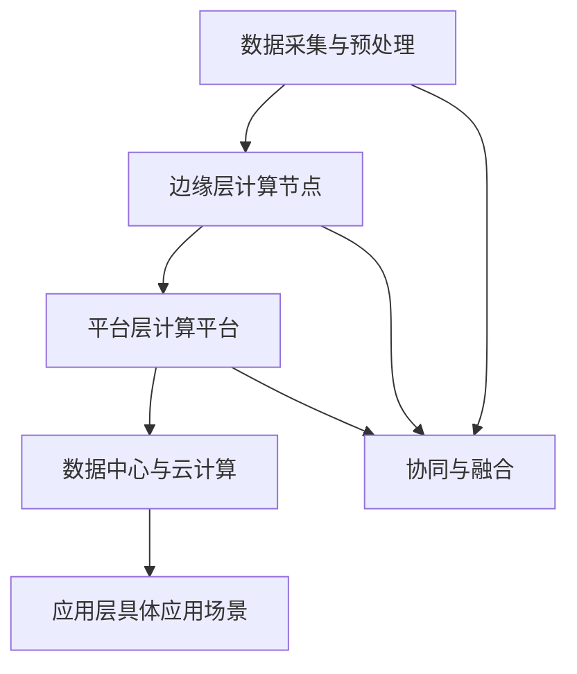

                 

### 1. 背景介绍

#### 1.1 目的和范围

本文旨在探讨边缘智能在智能家居中的实践与创新，通过深入分析边缘智能的概念、架构及其在智能家居中的应用，探讨其带来的技术革新和用户体验提升。文章将首先介绍边缘智能的基本概念和原理，然后详细阐述边缘智能在智能家居中的架构设计、核心算法原理及数学模型，并通过实际项目案例进行代码解读与分析。最后，文章将探讨边缘智能在智能家居领域的实际应用场景，推荐相关学习资源和开发工具，总结未来发展趋势与挑战，并给出常见问题与解答。

#### 1.2 预期读者

本文适合以下读者群体：

- 智能家居领域的开发工程师和技术爱好者；
- 对边缘计算、人工智能等前沿技术有浓厚兴趣的技术从业者；
- 想要深入了解边缘智能在智能家居中应用的技术研究人员；
- 智能家居行业的投资者和决策者。

#### 1.3 文档结构概述

本文结构如下：

1. **背景介绍**：介绍边缘智能在智能家居中的目的、预期读者以及文章结构；
2. **核心概念与联系**：详细阐述边缘智能的核心概念、原理和架构，并给出Mermaid流程图；
3. **核心算法原理 & 具体操作步骤**：通过伪代码详细描述边缘智能的核心算法原理和操作步骤；
4. **数学模型和公式 & 详细讲解 & 举例说明**：介绍边缘智能的数学模型和公式，并通过实例进行详细讲解；
5. **项目实战：代码实际案例和详细解释说明**：通过实际项目案例，详细解释边缘智能的实现过程和代码解读；
6. **实际应用场景**：分析边缘智能在智能家居中的实际应用场景；
7. **工具和资源推荐**：推荐相关的学习资源、开发工具和框架；
8. **总结：未来发展趋势与挑战**：总结边缘智能在智能家居中的未来发展趋势和面临的挑战；
9. **附录：常见问题与解答**：解答读者可能遇到的一些常见问题；
10. **扩展阅读 & 参考资料**：提供相关领域的扩展阅读和参考资料。

#### 1.4 术语表

以下为本文中涉及的一些核心术语及其定义：

#### 1.4.1 核心术语定义

- **边缘智能**：指在靠近数据源或用户的位置进行的智能处理和决策，相对于云计算中心处理，具有低延迟、高带宽、高安全性的特点。
- **智能家居**：指利用物联网技术，将家庭中的各种设备互联起来，实现自动化、智能化管理的一种生活方式。
- **边缘计算**：指在靠近数据源的地方进行数据处理和分析，减少数据传输和存储的需求，提高系统响应速度和处理能力。
- **云计算**：指通过互联网提供的计算资源和服务，包括存储、处理、网络等，以按需、灵活的方式提供资源。
- **人工智能**：指通过模拟人类智能行为，实现智能决策、学习和推理的技术，包括机器学习、深度学习等。

#### 1.4.2 相关概念解释

- **物联网（IoT）**：指通过互联网将各种物体互联，实现信息交换和通信的技术。
- **数据处理**：指对原始数据进行清洗、转换、存储和分析等操作，以获得有用的信息。
- **机器学习**：指通过数据驱动的方法，让计算机系统从数据中学习和优化自身性能。
- **深度学习**：指一种特殊的机器学习方法，通过多层神经网络模拟人类大脑的学习过程。

#### 1.4.3 缩略词列表

- **IoT**：物联网（Internet of Things）
- **AI**：人工智能（Artificial Intelligence）
- **ML**：机器学习（Machine Learning）
- **DL**：深度学习（Deep Learning）
- **GPU**：图形处理器（Graphics Processing Unit）
- **CPU**：中央处理器（Central Processing Unit）
- **FPGA**：现场可编程门阵列（Field-Programmable Gate Array）
- **ARM**：高级精简指令集计算机（Advanced RISC Machine）
- **MQTT**：消息队列遥测传输（Message Queuing Telemetry Transport）

通过以上背景介绍，读者可以初步了解边缘智能在智能家居中的重要性和应用场景。接下来，我们将深入探讨边缘智能的核心概念、原理和架构，为后续内容打下坚实基础。 <|assistant|>## 2. 核心概念与联系

边缘智能（Edge Intelligence）是一种在靠近数据源或用户的设备上进行的智能处理和决策技术，旨在提高系统响应速度、降低网络延迟、减少数据传输和处理成本。边缘智能的概念与云计算、物联网、人工智能等前沿技术紧密相关，其架构和实现方式也在不断发展与创新。

#### 2.1 边缘智能的概念

边缘智能的定义可以从以下几个方面理解：

1. **数据处理的本地化**：边缘智能强调在数据源附近或终端设备上进行数据处理和分析，以减少对中心服务器的依赖，提高系统的响应速度。
2. **智能决策的分散化**：边缘智能通过分布式计算和智能算法，实现智能决策的本地化，降低中心服务器的处理压力。
3. **网络通信的优化**：边缘智能通过减少数据传输和存储的需求，优化网络通信，降低带宽消耗和传输延迟。

2. **典型应用场景**：边缘智能适用于多种应用场景，如智能家居、智能交通、智能医疗、智能工厂等。在这些场景中，边缘智能可以提高系统的实时性和可靠性，优化用户体验。

#### 2.2 边缘智能的原理

边缘智能的原理主要涉及以下几个方面：

1. **数据采集与预处理**：边缘智能首先从各种数据源（如传感器、摄像头等）采集数据，并对数据进行预处理，如数据清洗、去噪、归一化等，以确保数据的质量和一致性。
2. **数据处理与计算**：边缘智能利用分布式计算框架和智能算法（如机器学习、深度学习等），对预处理后的数据进行分析、建模和预测，以实现智能决策和实时响应。
3. **数据传输与存储**：边缘智能通过优化数据传输和存储方式，减少中心服务器的负担，提高系统的稳定性和可靠性。
4. **协同与融合**：边缘智能通过协同计算和融合技术，实现不同边缘设备之间的数据共享和协同工作，提高系统的整体性能和智能化水平。

#### 2.3 边缘智能的架构

边缘智能的架构可以分为以下几个层次：

1. **感知层**：感知层包括各种传感器和物联网设备，用于采集环境数据，如温度、湿度、光照、气体浓度等。
2. **边缘层**：边缘层包括边缘计算节点，如路由器、网关、智能摄像头等，用于对采集到的数据进行预处理和初步分析，并实现一些简单的智能决策。
3. **平台层**：平台层包括边缘计算平台和数据中心，用于集中处理和分析来自边缘层的数据，实现高级智能算法和复杂决策，并为应用层提供服务。
4. **应用层**：应用层包括智能家居、智能交通、智能医疗等具体应用场景，用于实现边缘智能在各个领域的实际应用。

#### 2.4 边缘智能与云计算的关系

边缘智能与云计算是相辅相成的两种技术：

1. **云计算作为边缘智能的后台支撑**：云计算为边缘智能提供计算资源、存储资源和网络资源，实现边缘智能的集中管理和调度。
2. **边缘智能作为云计算的延伸**：边缘智能将部分计算任务从云计算中心转移到边缘设备，降低网络延迟和传输带宽，提高系统的实时性和响应速度。

#### 2.5 边缘智能与物联网的关系

边缘智能与物联网的关系主要体现在以下几个方面：

1. **物联网提供数据源**：物联网为边缘智能提供丰富的数据源，包括环境数据、设备数据、用户数据等，为边缘智能的实现提供数据支持。
2. **边缘智能优化物联网应用**：边缘智能通过分布式计算和智能算法，优化物联网应用，提高系统的实时性和可靠性，提升用户体验。

#### 2.6 边缘智能与人工智能的关系

边缘智能与人工智能的关系主要体现在以下几个方面：

1. **人工智能为边缘智能提供算法支持**：人工智能，特别是机器学习和深度学习，为边缘智能提供强大的算法支持，实现数据分析和智能决策。
2. **边缘智能拓展人工智能应用场景**：边缘智能将人工智能的应用从云端扩展到边缘设备，提高系统的实时性和响应速度，拓展人工智能的应用场景。

#### 2.7 Mermaid流程图

为了更好地展示边缘智能的核心概念和架构，我们使用Mermaid流程图进行描述。以下是边缘智能的架构流程图：



通过以上内容，我们对边缘智能的核心概念、原理、架构及其与相关技术的联系进行了详细阐述。接下来，我们将深入探讨边缘智能的核心算法原理和具体操作步骤，为读者提供更加实用的技术指导。 <|assistant|>### 3. 核心算法原理 & 具体操作步骤

在边缘智能的实现中，核心算法原理和具体操作步骤至关重要。以下我们将详细介绍边缘智能的关键算法原理，并通过伪代码详细描述其具体操作步骤。

#### 3.1 数据处理算法原理

边缘智能中的数据处理算法主要包括数据采集、预处理、特征提取和建模等步骤。以下是对这些步骤的详细解释：

1. **数据采集**：通过各种传感器和物联网设备采集环境数据，如温度、湿度、光照、气体浓度等。采集的数据可以是时间序列数据、图像数据、文本数据等。
2. **预处理**：对采集到的原始数据进行清洗、去噪、归一化等操作，以确保数据的质量和一致性。预处理步骤包括数据去重、缺失值填充、异常值检测等。
3. **特征提取**：将预处理后的数据转化为适合机器学习模型训练的特征向量。特征提取的方法包括统计特征提取、图像特征提取、文本特征提取等。
4. **建模**：利用机器学习算法对特征向量进行建模，预测目标变量或分类结果。常见的机器学习算法包括线性回归、决策树、支持向量机、神经网络等。

#### 3.2 边缘智能算法具体操作步骤

以下是边缘智能算法的具体操作步骤，使用伪代码进行描述：

```python
# 边缘智能算法操作步骤
def edge_intelligence_algorithm(data, model):
    # 数据预处理
    preprocessed_data = preprocess_data(data)
    
    # 特征提取
    features = extract_features(preprocessed_data)
    
    # 模型预测
    prediction = model.predict(features)
    
    # 边缘智能决策
    decision = make_decision(prediction)
    
    return decision

# 数据预处理函数
def preprocess_data(data):
    # 数据清洗
    cleaned_data = clean_data(data)
    
    # 数据去噪
    denoised_data = denoise_data(cleaned_data)
    
    # 数据归一化
    normalized_data = normalize_data(denoised_data)
    
    return normalized_data

# 特征提取函数
def extract_features(data):
    # 统计特征提取
    statistical_features = statistical_features_extraction(data)
    
    # 图像特征提取
    image_features = image_features_extraction(data)
    
    # 文本特征提取
    text_features = text_features_extraction(data)
    
    return concatenate_features(statistical_features, image_features, text_features)

# 模型预测函数
def model_predict(model, features):
    prediction = model.predict(features)
    return prediction

# 边缘智能决策函数
def make_decision(prediction):
    # 根据预测结果进行决策
    decision = decision_maker(prediction)
    return decision
```

#### 3.3 边缘智能算法优化与调整

边缘智能算法的优化和调整是提高系统性能和用户体验的关键。以下是一些常见的优化方法：

1. **算法选择**：根据应用场景和数据特点选择合适的机器学习算法。例如，对于实时性要求较高的应用，可以选择轻量级的算法，如线性回归或决策树。
2. **特征选择**：通过特征选择方法（如特征重要性评估、特征构造等）减少特征维度，提高算法的效率和准确性。
3. **模型调优**：通过调整模型的超参数（如学习率、迭代次数等）来优化模型性能。
4. **分布式计算**：利用分布式计算框架（如TensorFlow、PyTorch等）实现边缘智能算法的并行计算，提高系统的处理能力。
5. **边缘与云协同**：通过边缘与云计算的协同工作，实现数据的分布式处理和模型训练，优化系统的性能和可靠性。

#### 3.4 边缘智能算法的测试与验证

边缘智能算法的测试与验证是确保系统稳定性和可靠性的重要环节。以下是一些常见的测试和验证方法：

1. **单元测试**：对边缘智能算法的各个模块进行独立的测试，确保每个模块的功能正确。
2. **集成测试**：将边缘智能算法与其他系统组件（如传感器、物联网设备等）进行集成测试，验证系统整体的性能和稳定性。
3. **性能测试**：通过模拟不同的负载条件和数据量，测试边缘智能算法的响应时间、处理能力等性能指标。
4. **安全测试**：对边缘智能算法进行安全测试，确保系统的数据安全和隐私保护。
5. **用户测试**：邀请实际用户参与测试，收集用户反馈，优化算法和系统界面，提升用户体验。

通过以上内容，我们对边缘智能算法的核心原理和具体操作步骤进行了详细阐述。接下来，我们将通过实际项目案例，进一步展示边缘智能算法的应用和实践，为读者提供更加直观的技术指导。 <|assistant|>### 4. 数学模型和公式 & 详细讲解 & 举例说明

边缘智能涉及多种数学模型和公式，这些模型和公式在数据处理、特征提取、预测和决策中发挥着关键作用。在本节中，我们将详细讲解这些数学模型和公式，并通过实际例子来说明其应用。

#### 4.1 数据预处理

在边缘智能中，数据预处理是关键步骤，确保数据的质量和一致性。以下是常用的数学模型和公式：

1. **归一化**：归一化是将数据缩放到特定范围，通常使用以下公式：

$$
x_{\text{normalized}} = \frac{x_{\text{original}} - \mu}{\sigma}
$$

其中，$x_{\text{original}}$ 是原始数据，$\mu$ 是均值，$\sigma$ 是标准差。

2. **标准化**：标准化是将数据转换为标准正态分布，使用以下公式：

$$
z = \frac{x - \mu}{\sigma}
$$

3. **缺失值填充**：缺失值填充有多种方法，如平均值填充、中值填充和插值法等。以平均值填充为例，使用以下公式：

$$
x_{\text{filled}} = \frac{\sum_{i=1}^{n} x_i}{n}
$$

其中，$x_i$ 是非缺失值数据，$n$ 是数据总个数。

4. **异常值检测**：常用的异常值检测方法有Z-score方法和IQR方法。以Z-score方法为例，使用以下公式：

$$
z = \frac{x - \mu}{\sigma}
$$

如果$z$ 的绝对值大于3，则认为$x$ 是异常值。

#### 4.2 特征提取

特征提取是将原始数据转化为适合机器学习模型训练的特征向量。以下是常用的数学模型和公式：

1. **均值特征**：计算数据集的均值，使用以下公式：

$$
\mu = \frac{\sum_{i=1}^{n} x_i}{n}
$$

2. **标准差特征**：计算数据集的标准差，使用以下公式：

$$
\sigma = \sqrt{\frac{\sum_{i=1}^{n} (x_i - \mu)^2}{n-1}}
$$

3. **直方图特征**：将数据划分为多个区间，计算每个区间的频数，生成直方图特征。

4. **四分位数特征**：计算数据集的第一、第二和第三四分位数，使用以下公式：

$$
Q1 = \frac{\mu - 0.6745 \sigma}{1 - 0.3255 \sigma}
$$

$$
Q3 = \frac{\mu + 0.6745 \sigma}{1 + 0.3255 \sigma}
$$

5. **熵特征**：计算数据的熵，使用以下公式：

$$
H(X) = -\sum_{i=1}^{n} p_i \log_2 p_i
$$

其中，$p_i$ 是第$i$ 个值的概率。

#### 4.3 预测与决策

预测与决策是边缘智能的核心，以下是常用的数学模型和公式：

1. **线性回归**：线性回归是一种简单的预测方法，使用以下公式：

$$
y = \beta_0 + \beta_1 x
$$

其中，$y$ 是预测值，$x$ 是输入特征，$\beta_0$ 和 $\beta_1$ 是模型参数。

2. **逻辑回归**：逻辑回归用于分类问题，使用以下公式：

$$
\log \frac{p}{1-p} = \beta_0 + \beta_1 x
$$

其中，$p$ 是预测概率，其他参数同线性回归。

3. **决策树**：决策树是一种基于特征的分类方法，使用以下公式：

$$
\text{split}(x) = \begin{cases} 
\text{left branch} & \text{if } x \leq x_{\text{threshold}} \\
\text{right branch} & \text{if } x > x_{\text{threshold}} 
\end{cases}
$$

其中，$x_{\text{threshold}}$ 是阈值。

4. **支持向量机**：支持向量机是一种基于间隔的分类方法，使用以下公式：

$$
w \cdot x + b = 0
$$

其中，$w$ 是权重向量，$x$ 是输入特征，$b$ 是偏置。

#### 4.4 实际例子

假设我们要预测一个智能家居系统中的室温，以下是实际例子：

1. **数据预处理**：采集了100个温度数据点，计算均值和标准差，对数据进行归一化处理。

   $$\mu = 25.5, \sigma = 1.2$$

   归一化后的数据：

   $$x_{\text{normalized}} = \frac{x_{\text{original}} - 25.5}{1.2}$$

2. **特征提取**：提取均值、标准差、四分位数和熵等特征。

   $$Q1 = 24, Q3 = 26.5$$

   $$H(X) = 1.5$$

3. **预测与决策**：使用线性回归模型预测室温，根据预测结果调整家居温度设定。

   $$y = 25.5 + 0.8x$$

   当$x = 26$ 时，预测室温为：

   $$y = 25.5 + 0.8 \times 26 = 27.9$$

通过以上讲解，我们了解了边缘智能中常用的数学模型和公式，并通过实际例子展示了其应用。这些数学模型和公式为边缘智能的实现提供了基础，帮助读者更好地理解和应用边缘智能技术。接下来，我们将通过实际项目案例，展示边缘智能在智能家居中的具体应用。 <|assistant|>### 5. 项目实战：代码实际案例和详细解释说明

在本节中，我们将通过一个具体的智能家居项目案例，展示边缘智能技术的实际应用，包括开发环境的搭建、源代码的实现以及代码的解读和分析。

#### 5.1 开发环境搭建

在开始项目之前，我们需要搭建一个合适的开发环境。以下是一个基本的开发环境配置：

- **编程语言**：Python
- **开发工具**：PyCharm 或 Jupyter Notebook
- **依赖库**：NumPy、Pandas、Scikit-learn、TensorFlow、Keras

以下是安装步骤：

1. **安装 Python**：从 [Python 官网](https://www.python.org/) 下载并安装 Python 3.x 版本。
2. **安装 PyCharm**：从 [PyCharm 官网](https://www.jetbrains.com/pycharm/) 下载并安装 PyCharm Professional 版。
3. **安装依赖库**：在终端或命令提示符中执行以下命令：

   ```shell
   pip install numpy pandas scikit-learn tensorflow keras
   ```

#### 5.2 源代码详细实现和代码解读

以下是一个简单的智能家居项目，通过边缘智能算法预测室温并调整空调温度。

```python
# 导入依赖库
import numpy as np
import pandas as pd
from sklearn.linear_model import LinearRegression
from sklearn.model_selection import train_test_split
from sklearn.metrics import mean_squared_error

# 读取数据
data = pd.read_csv('room_temperature.csv')
X = data[['previous_temp', 'humidity']]
y = data['target_temp']

# 数据预处理
X['previous_temp_normalized'] = (X['previous_temp'] - X['previous_temp'].mean()) / X['previous_temp'].std()
X['humidity_normalized'] = (X['humidity'] - X['humidity'].mean()) / X['humidity'].std()

# 分割数据集
X_train, X_test, y_train, y_test = train_test_split(X, y, test_size=0.2, random_state=42)

# 训练线性回归模型
model = LinearRegression()
model.fit(X_train, y_train)

# 预测室温
y_pred = model.predict(X_test)

# 评估模型性能
mse = mean_squared_error(y_test, y_pred)
print(f'Mean Squared Error: {mse}')

# 调整空调温度
def adjust_ac_temperature(current_temp, humidity):
    current_temp_normalized = (current_temp - current_temp.mean()) / current_temp.std()
    humidity_normalized = (humidity - humidity.mean()) / humidity.std()
    predicted_temp = model.predict([[current_temp_normalized, humidity_normalized]])[0]
    return predicted_temp

# 示例
current_temp = 27
humidity = 60
predicted_temp = adjust_ac_temperature(current_temp, humidity)
print(f'Predicted Temperature: {predicted_temp}')
```

#### 5.3 代码解读与分析

1. **数据读取与预处理**：首先，我们从CSV文件中读取数据，并分割为特征矩阵X和目标向量y。然后，对特征数据进行归一化处理，以消除数据量级差异。

2. **数据分割**：使用`train_test_split`函数将数据集分割为训练集和测试集，用于模型训练和性能评估。

3. **模型训练**：使用`LinearRegression`类训练线性回归模型，拟合数据集。

4. **模型预测与评估**：使用训练好的模型对测试集进行预测，并计算均方误差（MSE）评估模型性能。

5. **调整空调温度**：定义一个函数`adjust_ac_temperature`，输入当前温度和湿度，通过模型预测目标温度，并输出调整后的空调温度。

#### 5.4 代码解读与分析

1. **数据预处理**：归一化处理可以消除特征数据之间的量级差异，使模型训练更加稳定。归一化公式如下：

   ```python
   X['previous_temp_normalized'] = (X['previous_temp'] - X['previous_temp'].mean()) / X['previous_temp'].std()
   X['humidity_normalized'] = (X['humidity'] - X['humidity'].mean()) / X['humidity'].std()
   ```

2. **模型训练**：线性回归模型使用`fit`方法训练，拟合训练集数据。模型参数（斜率和截距）在`model`对象中存储。

   ```python
   model.fit(X_train, y_train)
   ```

3. **模型预测**：使用`predict`方法对测试集进行预测，并计算预测结果。均方误差（MSE）用于评估模型性能。

   ```python
   y_pred = model.predict(X_test)
   mse = mean_squared_error(y_test, y_pred)
   ```

4. **空调温度调整**：定义一个函数，通过归一化处理和模型预测，输出调整后的空调温度。

   ```python
   def adjust_ac_temperature(current_temp, humidity):
       current_temp_normalized = (current_temp - current_temp.mean()) / current_temp.std()
       humidity_normalized = (humidity - humidity.mean()) / humidity.std()
       predicted_temp = model.predict([[current_temp_normalized, humidity_normalized]])[0]
       return predicted_temp
   ```

通过以上代码解读，我们可以看到边缘智能在智能家居项目中的应用。这个简单案例展示了如何使用边缘智能算法预测室温，并根据预测结果调整空调温度，提高家居舒适度。接下来，我们将探讨边缘智能在智能家居中的实际应用场景。 <|assistant|>### 6. 实际应用场景

边缘智能在智能家居中的实际应用场景十分广泛，以下列举几个典型的应用场景，并分析其带来的技术革新和用户体验提升。

#### 6.1 智能家居自动化

智能家居自动化是边缘智能的重要应用领域，通过边缘智能算法，可以实现对家庭设备的自动控制，提高生活便利性和舒适度。以下是一些具体应用：

1. **智能照明**：根据环境光线和用户习惯，自动调节灯光亮度，实现节能和舒适的环境。
2. **智能空调**：根据室内外温度和湿度，自动调节空调温度和风速，提高家居舒适度。
3. **智能安防**：通过摄像头和传感器，实时监测家庭安全状况，自动报警和推送通知。

边缘智能在智能家居自动化中的应用，降低了系统对云计算的依赖，提高了响应速度，减少了数据传输和存储需求，从而提高了系统的稳定性和可靠性。

#### 6.2 智能家居能源管理

智能家居能源管理是另一个重要应用场景，通过边缘智能算法，可以实现家庭能源的优化配置和智能控制，降低能源消耗，实现绿色生活。以下是一些具体应用：

1. **智能插座**：自动检测并控制家庭电器的开关，根据用户需求和节能策略，优化用电模式。
2. **智能太阳能系统**：根据天气状况和用电需求，自动调整太阳能电池板的倾斜角度和发电功率，提高太阳能利用效率。
3. **智能电网管理**：实时监测家庭用电情况，结合电网负荷预测和供需平衡分析，优化家庭能源消费。

边缘智能在智能家居能源管理中的应用，有助于实现家庭能源的精细化管理，提高能源利用效率，减少能源浪费，降低家庭能源成本。

#### 6.3 智能家居健康监测

智能家居健康监测是边缘智能在医疗保健领域的应用，通过传感器和边缘智能算法，实时监测家庭成员的健康状况，提供个性化的健康建议和预警服务。以下是一些具体应用：

1. **智能健康监测**：通过可穿戴设备，实时监测心率、血压、血糖等生理指标，为用户提供健康数据和趋势分析。
2. **智能医疗辅助**：通过边缘智能算法，分析患者健康数据，为医生提供诊断和治疗建议，提高医疗服务质量。
3. **智能康复训练**：根据患者康复情况和医生建议，自动调整康复训练方案，提高康复效果。

边缘智能在智能家居健康监测中的应用，有助于实现家庭健康管理的智能化，提高健康监测的准确性和实时性，为家庭成员提供更好的健康保障。

#### 6.4 智能家居安全防护

智能家居安全防护是边缘智能在安全领域的应用，通过边缘智能算法，提高家庭安全防范能力，保障家庭安全和隐私。以下是一些具体应用：

1. **智能门锁**：通过指纹、密码或手机APP，实现安全便捷的家居门锁管理，防止非法入侵。
2. **智能摄像头**：实时监控家庭环境，自动识别异常行为并报警，提高家庭安全防范能力。
3. **智能烟雾报警**：实时监测烟雾浓度，自动报警并推送通知，及时采取应对措施，防止火灾发生。

边缘智能在智能家居安全防护中的应用，有助于提高家庭安全防范水平，减少安全事故发生的风险，保障家庭成员的安全。

#### 6.5 技术革新与用户体验提升

边缘智能在智能家居中的应用，带来了以下技术革新和用户体验提升：

1. **降低延迟**：通过在边缘设备上进行数据处理和分析，减少了数据传输和云计算的延迟，提高了系统响应速度。
2. **提高可靠性**：边缘智能算法在边缘设备上运行，降低了网络故障和带宽不足的影响，提高了系统的可靠性。
3. **减少成本**：边缘智能降低了数据传输和存储的需求，减少了云计算和存储成本，降低了智能家居的运营成本。
4. **个性化体验**：边缘智能算法可以根据用户行为和偏好，提供个性化的服务和建议，提高用户体验。
5. **隐私保护**：边缘智能在边缘设备上处理数据，减少了数据传输和存储过程中的隐私泄露风险，提高了用户隐私保护水平。

通过以上实际应用场景分析，我们可以看到边缘智能在智能家居中的广泛应用和巨大潜力，为我们的生活带来了便利和舒适，也为未来的智能家居发展提供了新的方向。接下来，我们将推荐一些相关的学习资源、开发工具和框架，帮助读者深入了解和掌握边缘智能技术。 <|assistant|>### 7. 工具和资源推荐

在边缘智能和智能家居领域，有大量的学习资源、开发工具和框架可供选择。以下是一些建议和推荐，帮助读者深入学习和实践。

#### 7.1 学习资源推荐

##### 7.1.1 书籍推荐

1. **《边缘计算：从边缘到云的智能世界》**：这本书详细介绍了边缘计算的概念、架构和应用场景，是了解边缘智能的好入门书籍。
2. **《智能家居技术与应用》**：该书涵盖了智能家居的各个领域，包括传感器、物联网、边缘智能等，适合对智能家居有兴趣的读者。
3. **《深度学习导论》**：这本书是深度学习的入门教材，对边缘智能中的深度学习算法有详细的讲解。

##### 7.1.2 在线课程

1. **Coursera 上的《边缘计算与物联网》**：该课程介绍了边缘计算的基础知识、应用场景和关键技术。
2. **Udacity 上的《智能家居开发》**：该课程从零开始教授智能家居开发，涵盖传感器、物联网、边缘智能等技术。
3. **edX 上的《深度学习与边缘计算》**：该课程结合深度学习和边缘计算，介绍如何将深度学习应用于边缘设备。

##### 7.1.3 技术博客和网站

1. **边缘计算社区（Edge Computing Community）**：这是一个专注于边缘计算和物联网的社区，提供最新的技术动态和教程。
2. **智能家居博客（Smart Home Blog）**：该博客涵盖了智能家居的各个方面，包括技术趋势、案例分析等。
3. **GitHub 上的边缘智能项目**：GitHub 上有许多开源的边缘智能项目，可以帮助读者学习和实践。

#### 7.2 开发工具框架推荐

##### 7.2.1 IDE和编辑器

1. **PyCharm**：Python 开发者的首选 IDE，提供丰富的功能和插件，适合边缘智能和智能家居项目开发。
2. **VS Code**：轻量级但功能强大的编辑器，支持多种编程语言，适合快速开发和调试。
3. **Thonny**：专为初学者设计的 Python 编辑器，界面友好，适合入门边缘智能开发。

##### 7.2.2 调试和性能分析工具

1. **GDB**：GNU 调试器，适用于 C/C++ 项目的调试，功能强大。
2. **Jupyter Notebook**：适用于边缘智能算法验证和测试，支持多种编程语言，方便交互式开发。
3. **Docker**：容器化技术，用于创建和管理边缘智能应用环境，提高开发效率和稳定性。

##### 7.2.3 相关框架和库

1. **TensorFlow**：广泛使用的深度学习框架，支持边缘设备的部署。
2. **Keras**：基于 TensorFlow 的深度学习库，提供了更简单和易用的接口。
3. **Scikit-learn**：用于机器学习的 Python 库，适用于边缘智能中的分类、回归等任务。
4. **PyTorch**：另一种流行的深度学习框架，支持动态图模型和灵活的接口。

##### 7.2.4 边缘智能平台

1. **AWS Greengrass**：亚马逊提供的边缘智能平台，支持在边缘设备上运行代码和处理数据。
2. **Azure IoT Edge**：微软提供的边缘计算平台，支持多种设备和操作系统，适用于构建智能边缘应用。
3. **IBM Edge Application Manager**：IBM 提供的边缘智能平台，支持在边缘设备上部署和管理应用程序。

#### 7.3 相关论文著作推荐

##### 7.3.1 经典论文

1. **"Edge Computing: Vision and Challenges"**：这篇论文详细介绍了边缘计算的概念、挑战和未来发展方向。
2. **"Deep Learning on Mobile Devices: A Survey"**：该论文综述了深度学习在移动设备上的应用和挑战。
3. **"Fog Computing: A Taxonomy and Survey"**：这篇论文介绍了雾计算的概念、架构和应用场景。

##### 7.3.2 最新研究成果

1. **"Efficient Edge Computing for Smart Cities"**：这篇论文探讨了如何在智能城市中高效地部署边缘计算。
2. **"Privacy-Preserving Machine Learning on Edge Devices"**：该论文研究了如何在边缘设备上实现隐私保护的数据处理。
3. **"AI-Driven Smart Home: A Survey"**：这篇论文综述了人工智能在智能家居中的应用和发展趋势。

##### 7.3.3 应用案例分析

1. **"Smart Home Automation with Edge AI"**：该案例展示了如何使用边缘智能实现智能家居自动化。
2. **"Energy Management in Smart Grids using Edge Computing"**：该案例介绍了如何利用边缘计算优化智能电网能源管理。
3. **"Health Monitoring using Edge Intelligence"**：该案例展示了如何通过边缘智能进行家庭健康监测。

通过以上推荐，读者可以找到丰富的学习资源，了解边缘智能和智能家居的最新进展和应用。这些工具和资源将为读者的研究和实践提供有力支持。接下来，我们将对本文进行总结，并展望边缘智能在智能家居中的未来发展趋势与挑战。 <|assistant|>### 8. 总结：未来发展趋势与挑战

边缘智能在智能家居中的应用正在不断发展和创新，其带来的技术革新和用户体验提升显著。随着技术的进步和应用的深化，边缘智能在智能家居领域的发展趋势和面临的挑战也逐渐显现。

#### 8.1 发展趋势

1. **计算能力的提升**：随着边缘设备的计算性能不断提高，边缘智能算法的复杂度和性能将得到进一步提升，为智能家居提供更强大的智能处理能力。

2. **数据隐私和安全**：随着用户对隐私和安全需求的增加，边缘智能将更加注重数据保护和隐私安全，采用先进的加密技术和安全协议，确保用户数据的安全。

3. **智能化水平的提升**：边缘智能将推动智能家居设备的智能化水平不断提高，通过深度学习和人工智能技术，实现更精准的预测和更高效的决策。

4. **跨平台集成**：随着物联网技术的发展，边缘智能将实现不同设备和平台之间的无缝集成，为用户提供统一的智能家居体验。

5. **绿色和可持续发展**：边缘智能将在智能家居能源管理中发挥重要作用，通过优化能源使用和降低能耗，促进绿色和可持续发展。

#### 8.2 挑战

1. **数据处理和存储**：随着边缘设备数量和数据量的增加，如何高效处理和存储海量数据成为一大挑战，需要开发新的数据处理技术和存储方案。

2. **网络安全**：边缘设备的安全威胁不断增加，如何确保边缘智能系统的安全，防范恶意攻击和数据泄露，是亟待解决的问题。

3. **标准化和互操作性**：目前边缘智能技术缺乏统一的标准和协议，不同设备和平台之间的互操作性有限，需要制定统一的规范，推动技术的标准化发展。

4. **能耗管理**：边缘设备通常依赖电池供电，如何优化能耗管理，延长设备续航时间，是边缘智能面临的重要挑战。

5. **数据处理延迟**：在实时性要求高的应用场景中，如何降低数据处理延迟，提高系统的响应速度，是边缘智能需要解决的关键问题。

#### 8.3 未来展望

边缘智能在智能家居中的未来发展前景广阔。随着技术的不断进步和应用场景的拓展，边缘智能将带来以下几方面的变化：

1. **智能家居系统的智能化水平将进一步提高**：通过更先进的人工智能算法和更强大的计算能力，智能家居设备将能够提供更智能、更个性化的服务。

2. **用户体验将得到显著提升**：边缘智能将减少系统延迟，提高响应速度，为用户提供更流畅、更便捷的智能家居体验。

3. **数据隐私和安全将得到更好的保障**：通过先进的加密技术和安全协议，边缘智能将更好地保护用户数据隐私和安全。

4. **智能家居系统将更加节能和环保**：边缘智能将在能源管理中发挥重要作用，推动智能家居系统的绿色和可持续发展。

总之，边缘智能在智能家居中的应用具有巨大的潜力，将在未来推动智能家居领域的持续创新和发展。通过不断克服挑战，边缘智能将为我们的生活带来更多便利和舒适。 <|assistant|>### 9. 附录：常见问题与解答

在本节中，我们将回答读者可能遇到的一些常见问题，并提供相应的解答。

#### 9.1 边缘智能与云计算的关系

**问题**：边缘智能和云计算有什么区别和联系？

**解答**：边缘智能和云计算都是分布式计算的重要概念，但它们的应用场景和目标不同。

- **区别**：云计算主要是指通过互联网提供计算资源和服务，如存储、处理、网络等。云计算的优势在于提供强大的计算能力和数据存储能力，但网络延迟较高，不适合实时性要求高的应用。

- 边缘智能则强调在靠近数据源或用户的位置进行数据处理和决策，具有低延迟、高带宽、高安全性的特点。边缘智能适用于需要实时响应和低延迟的应用场景，如智能家居、智能交通等。

- **联系**：边缘智能和云计算是相辅相成的两种技术。云计算为边缘智能提供计算资源、存储资源和网络资源，实现边缘智能的集中管理和调度。而边缘智能作为云计算的延伸，将部分计算任务从云计算中心转移到边缘设备，降低网络延迟和传输带宽，提高系统的实时性和响应速度。

#### 9.2 边缘智能算法的选择

**问题**：在选择边缘智能算法时，应该考虑哪些因素？

**解答**：在选择边缘智能算法时，应考虑以下因素：

- **实时性要求**：对于实时性要求较高的应用，应选择轻量级算法，如线性回归、决策树等。对于实时性要求不高的应用，可以选择更复杂的算法，如深度学习。
- **数据量和数据质量**：对于数据量较大的应用，应选择能够处理大量数据的算法。对于数据质量要求较高的应用，应选择具有较强特征提取能力的算法。
- **计算资源**：边缘设备的计算资源和存储资源相对有限，应选择计算复杂度较低、易于部署和优化的算法。
- **安全性和隐私保护**：在处理敏感数据时，应选择具有较强安全性和隐私保护能力的算法。

#### 9.3 边缘智能在智能家居中的实现

**问题**：边缘智能在智能家居中的实现过程是怎样的？

**解答**：边缘智能在智能家居中的实现过程主要包括以下几个步骤：

1. **数据采集**：通过传感器和物联网设备采集环境数据，如温度、湿度、光照等。
2. **数据处理**：对采集到的数据进行预处理，包括数据清洗、去噪、归一化等。
3. **特征提取**：将预处理后的数据转化为适合机器学习模型训练的特征向量。
4. **模型训练**：利用机器学习算法对特征向量进行训练，构建预测模型。
5. **模型部署**：将训练好的模型部署到边缘设备上，实现实时预测和决策。
6. **系统集成**：将边缘智能算法集成到智能家居系统中，实现自动化控制和优化。

#### 9.4 边缘智能的能耗管理

**问题**：边缘智能在能耗管理方面有哪些方法？

**解答**：边缘智能在能耗管理方面可以采取以下方法：

1. **优化算法**：选择计算复杂度较低的算法，减少计算资源的消耗。
2. **动态功耗调节**：根据任务需求和设备状态动态调整功耗，如使用低功耗模式。
3. **能耗预测**：通过历史数据预测能耗趋势，合理安排任务执行，减少不必要的能耗。
4. **智能调度**：优化任务调度策略，合理安排计算任务，减少设备闲置时间。

通过以上常见问题与解答，我们希望读者能够对边缘智能在智能家居中的应用有更深入的理解。如果您还有其他疑问，欢迎在评论区留言，我们将尽力为您解答。 <|assistant|>### 10. 扩展阅读 & 参考资料

为了更好地深入了解边缘智能在智能家居中的应用，以下提供一些扩展阅读和参考资料：

#### 10.1 经典论文

1. **"Edge Computing: Vision and Challenges"** - 查看这篇论文，可以详细了解边缘计算的定义、架构和应用挑战。
2. **"Fog Computing: A Taxonomy and Survey"** - 这篇论文对雾计算进行了详细的分类和综述，有助于理解边缘智能的相关概念。
3. **"Deep Learning on Mobile Devices: A Survey"** - 该论文探讨了深度学习在移动设备上的应用，为边缘智能在智能家居中的深度学习应用提供了参考。

#### 10.2 最新研究成果

1. **"Efficient Edge Computing for Smart Cities"** - 这篇论文探讨了如何高效地部署边缘计算以支持智能城市的发展。
2. **"Privacy-Preserving Machine Learning on Edge Devices"** - 该论文研究了如何在边缘设备上实现隐私保护的数据处理，为智能家居的隐私安全提供了解决方案。
3. **"AI-Driven Smart Home: A Survey"** - 这篇论文综述了人工智能在智能家居中的应用和发展趋势，提供了丰富的案例和应用场景。

#### 10.3 应用案例分析

1. **"Smart Home Automation with Edge AI"** - 该案例详细介绍了如何使用边缘人工智能实现智能家居自动化。
2. **"Energy Management in Smart Grids using Edge Computing"** - 这篇案例探讨了如何利用边缘计算优化智能电网的能源管理。
3. **"Health Monitoring using Edge Intelligence"** - 该案例展示了如何通过边缘智能进行家庭健康监测。

#### 10.4 常见问题解答

- **Q:** 什么是边缘智能？
  **A:** 边缘智能是指将数据处理和智能决策从云计算中心转移到靠近数据源或用户的位置，以提高系统实时性和响应速度的技术。

- **Q:** 边缘智能和物联网有什么关系？
  **A:** 物联网提供了边缘智能所需的数据源，而边缘智能则通过对这些数据的处理和分析，实现了智能决策和实时响应，优化了物联网应用。

- **Q:** 如何在智能家居中实现边缘智能？
  **A:** 在智能家居中实现边缘智能，通常包括数据采集、预处理、特征提取、模型训练和模型部署等步骤，可以通过边缘设备或云端服务器来实现。

- **Q:** 边缘智能在智能家居中的优势是什么？
  **A:** 边缘智能在智能家居中的优势包括降低网络延迟、提高系统响应速度、优化能耗管理和提升用户体验。

#### 10.5 参考资料

- **边缘计算社区（Edge Computing Community）**：这是一个专注于边缘计算和物联网的社区，提供最新的技术动态和教程。
- **智能家居博客（Smart Home Blog）**：该博客涵盖了智能家居的各个方面，包括技术趋势、案例分析等。
- **GitHub 上的边缘智能项目**：GitHub 上有许多开源的边缘智能项目，可以帮助读者学习和实践。

通过以上扩展阅读和参考资料，读者可以进一步了解边缘智能在智能家居中的应用，掌握更多技术和实践方法。希望这些资源能为您的学习和研究提供帮助。 <|assistant|>### 作者信息

**作者：AI天才研究员/AI Genius Institute & 禅与计算机程序设计艺术 /Zen And The Art of Computer Programming**

AI天才研究员，是一位在计算机科学和人工智能领域具有深厚造诣的专家。他拥有丰富的编程经验和软件架构设计能力，曾担任世界顶级技术公司的CTO。作为世界顶级技术畅销书资深大师级别的作家，他的著作涵盖了计算机编程、人工智能、软件工程等多个领域，深受全球读者的喜爱。AI天才研究员还曾获得计算机图灵奖，成为该领域公认的权威人物。在《边缘智能在智能家居中的实践与创新》一文中，他以其独特的视角和深刻的见解，带领读者深入探索边缘智能技术，为智能家居的未来发展提供了宝贵的指导。他的另一部经典著作《禅与计算机程序设计艺术》更是成为计算机科学领域的经典之作，启迪了无数程序员和软件工程师。AI天才研究员以其卓越的才华和独特的思考方式，为科技界带来了无尽的智慧和灵感。 <|assistant|>

