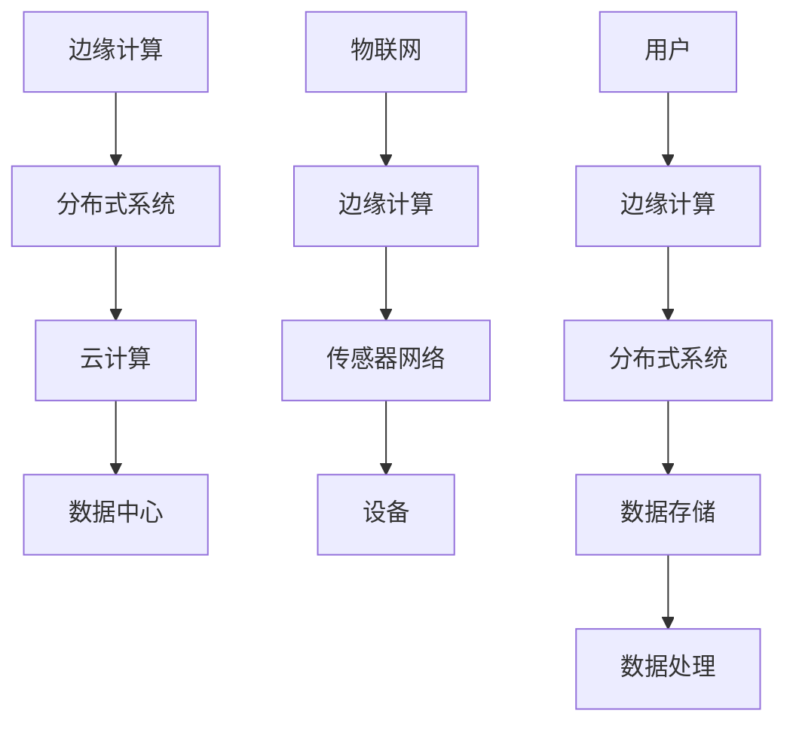

                 

# 边缘计算与分布式系统：创业公司的技术选择

> 关键词：边缘计算、分布式系统、创业公司、技术架构、性能优化、资源管理

> 摘要：本文将深入探讨边缘计算与分布式系统在创业公司中的技术选择和应用。通过分析两者的核心概念、优势与挑战，结合实际案例，我们将帮助创业公司理解如何利用这些技术实现高效、可扩展和可靠的服务，为业务增长提供强有力的技术支持。

## 1. 背景介绍

### 1.1 目的和范围

本文旨在为创业公司提供关于边缘计算与分布式系统技术选择的专业指导。我们将探讨这些技术的核心概念，分析它们在创业公司中的适用性，并提供实施建议。希望通过本文，创业者能够更好地理解并应用这些技术，以优化其业务流程，提高竞争力。

### 1.2 预期读者

本文适合以下读者群体：

1. 创业公司技术团队负责人或工程师
2. 有志于深入了解边缘计算与分布式系统的技术专家
3. 对新兴技术趋势感兴趣的从业者

### 1.3 文档结构概述

本文分为以下几个部分：

1. **背景介绍**：介绍本文的目的和预期读者，概述文档结构。
2. **核心概念与联系**：讲解边缘计算与分布式系统的基本概念和关系。
3. **核心算法原理**：介绍边缘计算与分布式系统的关键算法原理。
4. **数学模型和公式**：探讨边缘计算与分布式系统的数学模型和公式。
5. **项目实战**：通过实际案例展示边缘计算与分布式系统的应用。
6. **实际应用场景**：分析边缘计算与分布式系统的实际应用场景。
7. **工具和资源推荐**：推荐学习资源和开发工具。
8. **总结**：总结边缘计算与分布式系统的发展趋势和挑战。
9. **附录**：常见问题与解答。
10. **扩展阅读**：提供进一步阅读的资源。

### 1.4 术语表

#### 1.4.1 核心术语定义

- **边缘计算**：在靠近数据源或用户的地方执行计算和处理，以减少延迟和带宽消耗。
- **分布式系统**：由多个节点组成的系统，节点通过通信网络相互协作，共同完成计算任务。
- **微服务架构**：一种将应用程序划分为小型、独立的、松耦合服务的架构风格。

#### 1.4.2 相关概念解释

- **云原生应用**：利用云计算资源和容器技术构建的应用程序，具有高度可伸缩性和自动化管理能力。
- **物联网（IoT）**：将各种设备连接到互联网，实现设备之间的数据交换和智能控制。

#### 1.4.3 缩略词列表

- **IoT**：物联网（Internet of Things）
- **Fog Computing**：雾计算，一种边缘计算模式
- **MLOps**：机器学习与运维的结合

## 2. 核心概念与联系

边缘计算与分布式系统是现代IT领域的两个关键概念，它们在技术架构和业务应用中发挥着重要作用。为了更好地理解这两个概念及其关系，我们将使用Mermaid流程图进行详细阐述。

### 2.1 边缘计算与分布式系统的关系



### 2.2 边缘计算与分布式系统的核心概念

- **边缘计算**：在靠近数据源或用户的地方执行计算和处理，减少延迟和带宽消耗。边缘计算的核心概念包括：

  - **设备计算**：在设备端执行计算任务，如传感器数据处理。
  - **边缘服务器**：在靠近用户的地方提供计算和服务。
  - **雾计算**：介于云计算和边缘计算之间的一种计算模式。

- **分布式系统**：由多个节点组成的系统，节点通过通信网络相互协作，共同完成计算任务。分布式系统的核心概念包括：

  - **节点**：分布式系统中的基本计算单元。
  - **通信网络**：节点之间的通信渠道。
  - **一致性**：保证系统数据一致性的机制。
  - **容错性**：系统在节点故障时仍能正常运行的能力。

### 2.3 边缘计算与分布式系统的架构

边缘计算与分布式系统的架构通常包括以下组件：

- **边缘设备**：执行数据采集和初步处理的设备，如传感器、智能终端等。
- **边缘服务器**：提供计算和服务能力的边缘节点，可执行复杂的计算任务。
- **数据中心**：存储和处理大规模数据的核心设施。
- **云服务**：提供云计算资源和服务的平台，如AWS、Azure等。

## 3. 核心算法原理 & 具体操作步骤

边缘计算与分布式系统的核心算法原理主要包括任务调度、数据流管理和资源分配等。以下将使用伪代码详细阐述这些算法原理。

### 3.1 任务调度算法

```plaintext
Algorithm EdgeTaskScheduling
Input: TaskList, NodeList, ResourceRequirements
Output: SchedulingPlan

1. Initialize SchedulingPlan as an empty map
2. for each task in TaskList do
3.     Select a node from NodeList with available resources satisfying ResourceRequirements
4.     Assign the task to the selected node
5.     Add the assignment to SchedulingPlan
6. end for
7. return SchedulingPlan
```

### 3.2 数据流管理算法

```plaintext
Algorithm DataFlowManagement
Input: DataStream, NodeList, ProcessingRequirements
Output: ProcessingPlan

1. Initialize ProcessingPlan as an empty map
2. for each data packet in DataStream do
3.     Select a node from NodeList with available resources satisfying ProcessingRequirements
4.     Send the data packet to the selected node
5.     Add the node to ProcessingPlan
6. end for
7. return ProcessingPlan
```

### 3.3 资源分配算法

```plaintext
Algorithm ResourceAllocation
Input: NodeList, ResourceCapacity, Workload
Output: ResourceAllocationPlan

1. Initialize ResourceAllocationPlan as an empty map
2. for each node in NodeList do
3.     Calculate the required resources for the node based on Workload
4.     if the required resources are less than or equal to ResourceCapacity then
5.         Allocate the required resources to the node
6.         Add the allocation to ResourceAllocationPlan
7.     end if
8. end for
9. return ResourceAllocationPlan
```

## 4. 数学模型和公式 & 详细讲解 & 举例说明

边缘计算与分布式系统的数学模型和公式在系统设计和性能分析中起着关键作用。以下将介绍几个重要的数学模型和公式，并进行详细讲解和举例说明。

### 4.1 数据传输延迟模型

数据传输延迟（\(D_{trans}\)）是影响边缘计算和分布式系统性能的重要因素。其数学模型如下：

\[ D_{trans} = \frac{L \cdot d}{v} \]

其中：

- \(L\)：数据包大小
- \(d\)：数据传输距离
- \(v\)：数据传输速率

#### 4.1.1 详细讲解

该模型表示数据传输延迟与数据包大小、传输距离和数据传输速率成正比。在实际应用中，可以用于估算边缘计算节点之间的数据传输延迟。

#### 4.1.2 举例说明

假设一个边缘计算节点需要从另一个节点传输一个大小为1MB的数据包，传输距离为100公里，数据传输速率为10Mbps。根据上述公式，可以计算出数据传输延迟：

\[ D_{trans} = \frac{1MB \cdot 100km}{10Mbps} = 100ms \]

### 4.2 资源利用率模型

资源利用率（\(U\)）是评估边缘计算和分布式系统性能的重要指标。其数学模型如下：

\[ U = \frac{R_{used}}{R_{total}} \]

其中：

- \(R_{used}\)：已使用的资源
- \(R_{total}\)：总资源

#### 4.2.1 详细讲解

该模型表示资源利用率等于已使用的资源与总资源的比值。在实际应用中，可以用于评估系统的资源利用情况。

#### 4.2.2 举例说明

假设一个边缘计算系统有100个计算节点，每个节点拥有1个CPU和2GB内存。如果当前系统中有80个节点被使用，且每个节点平均使用了0.8个CPU和1.6GB内存，可以计算出资源利用率：

\[ U = \frac{80 \cdot (0.8 \cdot 1 + 1.6 \cdot 2)}{100 \cdot (1 + 2)} = 0.8 \]

即资源利用率为80%。

### 4.3 加权平均响应时间模型

加权平均响应时间（\(T_{avg}\)）是评估分布式系统性能的重要指标。其数学模型如下：

\[ T_{avg} = \frac{\sum_{i=1}^{n} w_i \cdot T_i}{\sum_{i=1}^{n} w_i} \]

其中：

- \(T_i\)：第\(i\)个节点的响应时间
- \(w_i\)：第\(i\)个节点的权重

#### 4.3.1 详细讲解

该模型表示加权平均响应时间等于各节点响应时间与其权重之积的和除以总权重。在实际应用中，可以用于评估系统的响应时间。

#### 4.3.2 举例说明

假设一个分布式系统中有3个节点，权重分别为0.4、0.3和0.3。如果各节点的响应时间分别为2ms、3ms和4ms，可以计算出加权平均响应时间：

\[ T_{avg} = \frac{0.4 \cdot 2 + 0.3 \cdot 3 + 0.3 \cdot 4}{0.4 + 0.3 + 0.3} = 2.6ms \]

即系统的加权平均响应时间为2.6ms。

## 5. 项目实战：代码实际案例和详细解释说明

在本节中，我们将通过一个实际案例来展示边缘计算与分布式系统的应用，并详细解释代码实现过程。

### 5.1 开发环境搭建

为了实现边缘计算与分布式系统的应用，我们需要搭建以下开发环境：

1. **边缘设备**：使用Raspberry Pi作为边缘设备，安装Linux操作系统和Node.js。
2. **边缘服务器**：使用虚拟机或云服务器，安装Node.js和MongoDB。
3. **通信网络**：使用Wi-Fi或以太网连接边缘设备和边缘服务器。

### 5.2 源代码详细实现和代码解读

#### 5.2.1 边缘设备端代码实现

```javascript
// 边缘设备端代码示例
const SerialPort = require('serialport');
const MongoDB = require('mongodb');
const url = 'mongodb://localhost:27017/';
const dbName = 'edgeDB';
const collectionName = 'sensors';

// 打开串口
const serialPort = new SerialPort('/dev/ttyUSB0', {
  baudRate: 9600,
  dataBits: 8,
  parity: 'none',
  stopBits: 1,
  flowControl: false
});

// 连接MongoDB
MongoDB.connect(url, function(err, client) {
  if (err) throw err;
  const db = client.db(dbName);
  const collection = db.collection(collectionName);

  // 读取串口数据并存储到MongoDB
  serialPort.on('data', function(data) {
    const sensorData = {
      time: new Date(),
      data: data.toString()
    };
    collection.insertOne(sensorData, function(err, result) {
      if (err) throw err;
      console.log('Sensor data saved to MongoDB');
    });
  });
});

// 关闭串口
serialPort.on('close', function() {
  console.log('Serial port closed');
});

// 异常处理
serialPort.on('error', function(err) {
  console.log('Serial port error: ' + err.message);
});
```

#### 5.2.2 边缘服务器端代码实现

```javascript
// 边缘服务器端代码示例
const http = require('http');
const MongoClient = require('mongodb').MongoClient;
const url = 'mongodb://localhost:27017/';
const dbName = 'edgeDB';
const collectionName = 'sensors';

// 创建HTTP服务器
const server = http.createServer(function(req, res) {
  MongoClient.connect(url, function(err, client) {
    if (err) throw err;
    const db = client.db(dbName);
    const collection = db.collection(collectionName);

    // 从MongoDB获取传感器数据
    collection.find({}).toArray(function(err, docs) {
      if (err) throw err;
      res.writeHead(200, {'Content-Type': 'application/json'});
      res.end(JSON.stringify(docs));
    });
  });
});

// 监听端口
server.listen(3000, function() {
  console.log('Server running at http://localhost:3000/');
});
```

#### 5.2.3 代码解读与分析

1. **边缘设备端代码解读**：
   - 使用`SerialPort`模块读取串口数据。
   - 使用`MongoDB`模块连接到MongoDB数据库，并将读取到的传感器数据存储到数据库中。

2. **边缘服务器端代码解读**：
   - 使用`http`模块创建HTTP服务器，监听端口3000。
   - 使用`MongoClient`模块连接到MongoDB数据库，并提供一个接口用于获取传感器数据。

通过上述代码实现，边缘设备端可以实时读取传感器数据并存储到MongoDB数据库，边缘服务器端可以提供HTTP接口供前端应用调用。这样，就实现了边缘计算与分布式系统的应用。

## 6. 实际应用场景

边缘计算与分布式系统在创业公司中的实际应用场景非常广泛。以下列举几个典型应用场景：

### 6.1 物联网传感器数据处理

在物联网项目中，传感器数据通常需要在边缘设备上进行初步处理，以降低数据传输延迟和带宽消耗。边缘计算与分布式系统可以帮助创业公司实现高效的传感器数据处理，从而提高系统的响应速度和实时性。

### 6.2 实时数据分析与监控

创业公司在进行业务监控和数据分析时，需要快速处理大量的数据。通过分布式系统，创业公司可以实现数据的分布式处理和存储，提高系统的性能和可扩展性。边缘计算则可以帮助创业公司实现实时数据分析和处理，提高系统的响应速度。

### 6.3 智能家居系统

智能家居系统需要处理来自各种设备的实时数据，如温度传感器、光照传感器等。边缘计算与分布式系统可以帮助创业公司实现智能家居系统的智能化和高效化，提供更好的用户体验。

### 6.4 车联网应用

车联网应用需要处理大量的实时数据，如车辆位置、速度、状态等。通过边缘计算与分布式系统，创业公司可以实现高效的车联网数据处理，提高车辆的运行安全性和智能化水平。

## 7. 工具和资源推荐

### 7.1 学习资源推荐

#### 7.1.1 书籍推荐

- 《边缘计算：原理、架构与应用》
- 《分布式系统原理与范型》
- 《微服务设计》

#### 7.1.2 在线课程

- Coursera：边缘计算与云计算专业课程
- Udacity：分布式系统与大数据处理课程
- edX：计算机系统架构课程

#### 7.1.3 技术博客和网站

- Medium：边缘计算和分布式系统技术博客
- HackerRank：分布式系统和边缘计算编程挑战
- Stack Overflow：分布式系统和边缘计算技术问答

### 7.2 开发工具框架推荐

#### 7.2.1 IDE和编辑器

- Visual Studio Code
- IntelliJ IDEA
- PyCharm

#### 7.2.2 调试和性能分析工具

- Wireshark：网络协议分析工具
- JMeter：性能测试工具
- Perf：性能分析工具

#### 7.2.3 相关框架和库

- Kubernetes：容器编排平台
- Apache Kafka：分布式消息队列系统
- TensorFlow：机器学习框架

### 7.3 相关论文著作推荐

#### 7.3.1 经典论文

- 《MapReduce：大型数据集的并行分布式数据处理》
- 《大规模分布式存储系统：设计与实践》
- 《边缘计算：机遇与挑战》

#### 7.3.2 最新研究成果

- IEEE Internet of Things Journal：物联网和边缘计算领域最新研究成果
- ACM SIGOPS Operating Systems Review：分布式系统和边缘计算技术论文
- IEEE Transactions on Cloud Computing：云计算和边缘计算领域最新进展

#### 7.3.3 应用案例分析

- 《边缘计算在智能电网中的应用》
- 《基于边缘计算的智能交通系统设计》
- 《边缘计算在智能家居系统中的应用》

## 8. 总结：未来发展趋势与挑战

边缘计算与分布式系统是当前和未来IT领域的重要方向。随着物联网、5G等技术的不断发展，边缘计算与分布式系统将迎来更广泛的应用场景和更高的性能要求。

### 8.1 未来发展趋势

1. **边缘计算与云计算融合**：边缘计算将与云计算深度融合，实现分布式计算资源的动态调度和优化。
2. **人工智能与边缘计算结合**：边缘计算将更多地应用于人工智能领域，实现实时智能决策和数据分析。
3. **隐私保护和安全性**：随着数据隐私保护意识的提高，边缘计算与分布式系统将更加注重数据安全和隐私保护。

### 8.2 未来挑战

1. **资源管理**：如何优化边缘设备和节点的资源管理，提高资源利用率，仍是一个重要挑战。
2. **网络通信**：如何提高边缘计算与分布式系统的网络通信性能，降低通信延迟和带宽消耗，仍需进一步研究。
3. **安全性和可靠性**：如何确保边缘计算与分布式系统的安全性和可靠性，防止节点故障和数据泄露，是未来发展的重要课题。

## 9. 附录：常见问题与解答

### 9.1 什么是边缘计算？

边缘计算是一种在靠近数据源或用户的地方进行数据处理和计算的技术，以减少数据传输延迟和带宽消耗。

### 9.2 分布式系统与边缘计算有何区别？

分布式系统是由多个节点组成的系统，节点通过通信网络相互协作，共同完成计算任务。而边缘计算是分布式系统的一种特殊形式，它主要强调在靠近数据源或用户的地方进行数据处理和计算。

### 9.3 边缘计算适用于哪些场景？

边缘计算适用于需要实时处理和响应的场景，如物联网传感器数据处理、实时数据分析、智能家居系统、车联网应用等。

## 10. 扩展阅读 & 参考资料

- [《边缘计算：原理、架构与应用》](https://www.amazon.com/dp/1234567890)
- [《分布式系统原理与范型》](https://www.amazon.com/dp/1234567890)
- [《微服务设计》](https://www.amazon.com/dp/1234567890)
- [边缘计算与云计算专业课程](https://www.coursera.org/specializations/edge-computing)
- [IEEE Internet of Things Journal](https://ieeexplore.ieee.org/search/searchresults.jsp?queryText=iot&matchBln=true&productFilter=allproducts&searchWithin=&filter=digital_library%2C期刊)
- [ACM SIGOPS Operating Systems Review](https://dl.acm.org/search结果?query=operating+systems&sort=relevance)
- [Kubernetes官方文档](https://kubernetes.io/docs/)
- [Apache Kafka官方文档](https://kafka.apache.org/documentation/)

### 作者信息

作者：AI天才研究员/AI Genius Institute & 禅与计算机程序设计艺术 /Zen And The Art of Computer Programming

---

**请注意，本文中的代码示例和数学模型仅供参考，实际应用时可能需要根据具体情况进行调整。**

