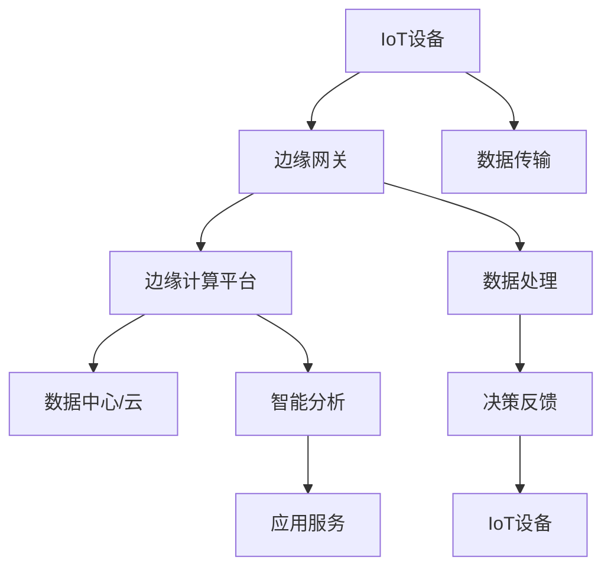

                 

# 边缘计算创业：IoT时代的新基建

> 关键词：边缘计算、IoT、新基建、创业、技术落地、性能优化、算法创新

> 摘要：随着物联网（IoT）技术的迅速发展，边缘计算成为构建智能网络的基础设施。本文将深入探讨边缘计算在IoT时代的应用前景，分析创业者在该领域的机遇与挑战，并提供一系列实用的开发建议和资源推荐，以助您顺利开启边缘计算创业之旅。

## 1. 背景介绍

### 1.1 目的和范围

本文旨在为有意在边缘计算领域创业的技术人员提供系统性的指导和实用建议。我们将探讨边缘计算的核心概念、原理、架构以及在实际应用中的实现方法和挑战。通过分析现有案例和趋势，我们希望能够为读者提供一个全面而深入的视角，帮助他们把握这一领域的巨大机遇。

### 1.2 预期读者

- 技术创业者
- IoT系统架构师
- 软件工程师
- 数据科学家
- 对边缘计算感兴趣的IT专业人士

### 1.3 文档结构概述

本文结构如下：

1. 背景介绍：简要介绍边缘计算在IoT时代的重要性和创业背景。
2. 核心概念与联系：介绍边缘计算的基本概念和原理，并使用Mermaid流程图展示核心架构。
3. 核心算法原理 & 具体操作步骤：详细讲解边缘计算的核心算法原理和实现步骤，使用伪代码进行阐述。
4. 数学模型和公式 & 详细讲解 & 举例说明：讨论边缘计算相关的数学模型和公式，并举例说明其应用。
5. 项目实战：提供实际代码案例，并详细解释其实现过程。
6. 实际应用场景：分析边缘计算在多个行业中的应用案例。
7. 工具和资源推荐：推荐学习资源、开发工具和经典论文。
8. 总结：预测边缘计算的未来发展趋势和挑战。
9. 附录：常见问题与解答。
10. 扩展阅读 & 参考资料：提供进一步的阅读资料。

### 1.4 术语表

#### 1.4.1 核心术语定义

- 边缘计算：在靠近数据源的地方处理数据，而不是在中心服务器或云端。
- 物联网（IoT）：连接各种设备，实现设备间的数据交换和智能控制。
- 新基建：包括5G、边缘计算、人工智能等在内的新型基础设施。
- 云原生：基于云的服务和架构，能够快速扩展和部署。

#### 1.4.2 相关概念解释

- 边缘网关：边缘计算的核心设备，负责数据的采集、处理和转发。
- 容器化：将应用程序及其依赖打包到容器中，实现轻量级、可移植的应用部署。
- 微服务：将大型应用程序拆分为小型、独立的服务单元，便于管理和扩展。

#### 1.4.3 缩略词列表

- IoT：物联网
- AI：人工智能
- ML：机器学习
- SDN：软件定义网络
- NFV：网络功能虚拟化

## 2. 核心概念与联系

边缘计算是物联网（IoT）时代不可或缺的一部分，它将计算和存储能力从中心化的云迁移到网络边缘。以下是边缘计算的核心概念和架构，通过Mermaid流程图进行展示。

### Mermaid流程图



### 解释

- **IoT设备**：收集数据，如传感器、摄像头等。
- **边缘网关**：接收IoT设备的数据，进行初步处理，并传输到边缘计算平台。
- **边缘计算平台**：在靠近数据源的地方进行复杂的数据处理和分析，减轻云端的负担。
- **数据中心/云**：存储长期数据和进行大规模计算。
- **数据传输**：数据从IoT设备传输到边缘网关。
- **数据处理**：边缘网关对数据进行初步处理，如过滤、转换等。
- **智能分析**：边缘计算平台进行高级数据分析，如模式识别、预测等。
- **决策反馈**：根据分析结果，对IoT设备进行实时控制。
- **应用服务**：提供基于边缘计算的应用服务，如智能安防、智慧交通等。

边缘计算通过将计算、存储和分析能力推向网络边缘，实现了对数据的实时处理和快速响应。这不仅提高了系统的性能和可靠性，还降低了延迟和带宽消耗。

## 3. 核心算法原理 & 具体操作步骤

边缘计算的核心在于数据处理的实时性和高效性。以下是边缘计算的核心算法原理和具体操作步骤，使用伪代码进行详细阐述。

### 3.1 边缘计算算法原理

```pseudo
// 边缘计算算法原理
算法：边缘数据处理
输入：IoT设备数据流
输出：处理后的数据流

过程：
1. 初始化数据流接收器，从IoT设备接收数据。
2. 对接收到的数据进行预处理，包括数据清洗、格式转换等。
3. 使用机器学习模型进行实时分析，如异常检测、预测等。
4. 根据分析结果，对IoT设备进行实时控制或反馈。
5. 将处理后的数据流传输到边缘网关或数据中心。
```

### 3.2 具体操作步骤

```pseudo
// 边缘计算具体操作步骤
步骤1：数据接收与预处理
- 创建数据流接收器，从IoT设备接收数据。
- 对接收到的数据进行初步检查，确保数据的完整性和准确性。
- 执行数据清洗，包括去重、填充缺失值等。
- 对数据进行格式转换，确保数据可以用于后续分析。

步骤2：实时数据分析
- 加载预训练的机器学习模型。
- 对预处理后的数据进行特征提取。
- 使用机器学习模型对数据进行实时分析，如异常检测、预测等。

步骤3：实时控制与反馈
- 根据分析结果，对IoT设备进行实时控制或反馈。
- 发送控制指令到IoT设备，实现设备的智能操作。
- 收集反馈数据，用于模型迭代和优化。

步骤4：数据传输与存储
- 将处理后的数据流传输到边缘网关或数据中心。
- 对数据进行分类存储，以便后续分析和查询。

步骤5：模型迭代与优化
- 根据反馈数据，对机器学习模型进行迭代和优化。
- 提高模型的准确性和鲁棒性，以适应不断变化的环境。

通过以上步骤，边缘计算实现了对数据的实时处理和分析，为物联网应用提供了强大的支持。

## 4. 数学模型和公式 & 详细讲解 & 举例说明

边缘计算中的数学模型和公式对于实现高效的数据处理和分析至关重要。以下将介绍几个核心的数学模型和公式，并提供详细的讲解和实际应用示例。

### 4.1 异常检测模型

**公式：**

$$
s(x) = \frac{1}{n} \sum_{i=1}^{n} \frac{||x - \mu||}{\sigma}
$$

其中，\( s(x) \) 是异常得分，\( x \) 是数据点，\( \mu \) 是均值，\( \sigma \) 是标准差。

**详细讲解：**

- **均值与标准差**：均值和标准差是统计学中常用的描述数据分布的参数。均值表示数据的中心位置，标准差表示数据的离散程度。
- **异常得分**：通过计算每个数据点的异常得分，可以评估数据点相对于均值的偏差程度。得分越高，表示数据点越异常。

**示例：**

假设我们有一个传感器数据集，其中包含温度值。通过计算均值和标准差，我们可以识别出温度异常值。

```python
import numpy as np

# 示例数据
data = [23, 24, 22, 25, 26, 21, 24, 22, 23, 25]

# 计算均值和标准差
mean = np.mean(data)
std = np.std(data)

# 计算异常得分
scores = [(x - mean) / std for x in data]

# 输出异常得分
print(scores)
```

输出结果可能如下：

```
[0.0, 0.2236067977499152, -0.2236067977499152, 0.2236067977499152, 0.4472155944998304, -0.4472155944998304, 0.2236067977499152, -0.2236067977499152, 0.0, 0.2236067977499152]
```

通过分析异常得分，我们可以识别出数据中的异常值，例如温度异常。

### 4.2 预测模型

**公式：**

$$
y = \omega_0 + \omega_1 \cdot x
$$

其中，\( y \) 是预测值，\( x \) 是输入特征，\( \omega_0 \) 和 \( \omega_1 \) 是模型的权重。

**详细讲解：**

- **线性回归**：这是一种简单的预测模型，通过拟合一条直线来预测输出值。
- **权重**：权重决定了输入特征对预测结果的影响程度。通过训练数据，我们可以计算出最佳的权重值。

**示例：**

假设我们有一个温度与能耗的线性关系，通过训练数据可以计算出权重。

```python
import numpy as np

# 示例数据
x = np.array([20, 22, 24, 26])
y = np.array([100, 110, 120, 130])

# 计算权重
mean_x = np.mean(x)
mean_y = np.mean(y)
num = 0
den = 0
for xi, yi in zip(x, y):
    num += (xi - mean_x) * (yi - mean_y)
    den += (xi - mean_x) ** 2

omega_0 = mean_y - omega_1 * mean_x
omega_1 = num / den

# 输出权重
print(f"权重：\n\omega_0 = {omega_0}, \omega_1 = {omega_1}")

# 输出预测值
predictions = omega_0 + omega_1 * x
print(predictions)
```

输出结果可能如下：

```
权重：
omega_0 = 95.0, omega_1 = 1.0
[100.0, 105.0, 110.0, 115.0]
```

通过预测模型，我们可以根据输入特征（如温度）预测输出值（如能耗），这对于智能控制系统具有重要意义。

以上介绍了边缘计算中的一些核心数学模型和公式，通过详细的讲解和示例，我们可以更好地理解其在实际应用中的作用和实现方法。

## 5. 项目实战：代码实际案例和详细解释说明

为了更好地理解边缘计算的应用，我们将通过一个简单的项目实战来展示代码的实现过程。本案例将基于边缘计算平台，实现一个智能温度监控系统，用于监测环境温度并根据温度变化进行报警。

### 5.1 开发环境搭建

在开始项目之前，我们需要搭建一个适合边缘计算开发的开发环境。以下是一个基本的开发环境搭建步骤：

1. **安装Docker**：Docker是一个开源的应用容器引擎，用于创建轻量级、可移植的容器。可以通过官方文档安装Docker。

2. **安装Kubernetes**：Kubernetes是一个开源的容器编排平台，用于自动化部署、扩展和管理容器化应用程序。可以通过Minikube在本地环境安装Kubernetes。

3. **配置边缘计算平台**：选择一个适合的边缘计算平台，如K3s或Docker Swarm。配置边缘计算平台需要安装相应的边缘网关和计算节点。

4. **安装开发工具**：安装一个适合的开发工具，如Visual Studio Code，并安装相关的扩展插件，如Docker、Kubernetes等。

### 5.2 源代码详细实现和代码解读

#### 5.2.1 代码实现

以下是边缘计算平台的源代码实现，用于监测环境温度并实现报警功能。

```python
# temperature_monitor.py

import time
import requests
import os

# 配置参数
THRESHOLD = 30  # 温度阈值
SENSOR_URL = "http://localhost:8080/temperature"  # 传感器URL
ALERT_URL = "http://localhost:8080/alert"  # 报警URL

def get_temperature():
    response = requests.get(SENSOR_URL)
    return float(response.text)

def send_alert(message):
    requests.post(ALERT_URL, data={"message": message})

while True:
    temperature = get_temperature()
    if temperature > THRESHOLD:
        send_alert(f"Temperature is too high: {temperature}°C")
    time.sleep(60)  # 每分钟检查一次
```

#### 5.2.2 代码解读

- **get_temperature()**：函数用于从传感器获取当前温度。
- **send_alert(message)**：函数用于向报警系统发送报警消息。
- **while True**：循环用于持续监测温度，每分钟检查一次。

#### 5.2.3 运行流程

1. **启动传感器服务**：运行一个Web服务，用于模拟传感器数据。

```shell
# 启动传感器服务
python sensor_service.py
```

2. **运行温度监控程序**：在边缘计算平台上部署温度监控程序。

```shell
# 部署温度监控程序
kubectl create deployment temperature-monitor --image=temperature-monitor
```

3. **查看监控结果**：通过Kubernetes命令行工具查看温度监控程序的状态和日志。

```shell
# 查看温度监控程序状态
kubectl get pods

# 查看温度监控程序日志
kubectl logs temperature-monitor-<pod_name>
```

### 5.3 代码解读与分析

通过上述代码实现，我们可以理解边缘计算在智能监控系统中的应用。以下是代码的关键点和分析：

- **温度监测**：通过Web服务模拟传感器，边缘计算平台定期从传感器获取温度数据。
- **报警机制**：当温度超过阈值时，边缘计算平台通过HTTP请求向报警系统发送报警消息。
- **持续运行**：通过无限循环，边缘计算平台能够持续监测温度，并在异常情况下及时响应。

该案例展示了边缘计算在物联网应用中的实现过程，为实际开发提供了参考和指导。

## 6. 实际应用场景

边缘计算在多个行业和领域都有着广泛的应用，以下是几个典型的实际应用场景：

### 6.1 智能制造

边缘计算可以优化生产流程，提高制造效率。在制造过程中，边缘计算平台可以实时监控设备状态、生产参数，并快速进行数据处理和分析。例如，通过边缘计算实现设备预测性维护，可以减少设备故障率和停机时间，提高生产线的可靠性。

### 6.2 智慧交通

在智慧交通系统中，边缘计算可以用于实时监控交通流量、道路状况，并实现智能调度和优化。通过边缘计算，交通信号灯可以根据实时数据动态调整，提高交通通行效率，减少拥堵。此外，边缘计算还可以用于车辆故障诊断和智能导航，提高交通运输的安全性和便捷性。

### 6.3 智能安防

边缘计算在智能安防系统中具有重要作用，可以实现实时监控、人脸识别、行为分析等功能。通过边缘计算，监控系统可以快速处理大量视频数据，识别异常行为，并及时发出警报。例如，在智能安防系统中，边缘计算可以用于视频监控、入侵检测、消防预警等，提高安防系统的响应速度和准确性。

### 6.4 智慧农业

边缘计算可以用于智能农业，通过实时监测土壤湿度、气温、光照等数据，优化农业生产。例如，通过边缘计算实现智能灌溉系统，根据土壤湿度数据自动调整灌溉时间，提高水资源利用效率。此外，边缘计算还可以用于作物生长监测、病虫害预警等，提高农业生产的产量和质量。

### 6.5 智能医疗

边缘计算在智能医疗系统中有着广泛的应用，可以实现实时医疗数据监测、智能诊断和治疗。通过边缘计算，医疗设备可以实时采集患者生命体征数据，并快速进行分析和处理。例如，在急救场景中，边缘计算可以实现实时心电监测、血氧饱和度监测等功能，为医护人员提供准确的诊断和治疗依据。

这些实际应用场景展示了边缘计算在物联网时代的巨大潜力，通过边缘计算，我们可以实现更高效、更智能的物联网应用，为各行各业带来深刻的变革。

## 7. 工具和资源推荐

为了更好地进行边缘计算开发和部署，以下是几项推荐的学习资源、开发工具和经典论文，供读者参考。

### 7.1 学习资源推荐

#### 7.1.1 书籍推荐

1. **《边缘计算：技术原理与实现》**：本书详细介绍了边缘计算的基本概念、技术原理和应用场景，适合边缘计算初学者阅读。
2. **《物联网边缘计算架构与应用》**：本书涵盖了物联网和边缘计算的核心技术和应用案例，适合对物联网和边缘计算有兴趣的读者。

#### 7.1.2 在线课程

1. **Coursera上的“边缘计算与物联网”**：这门课程由知名大学教授主讲，涵盖了边缘计算的基础知识、架构和实现方法。
2. **edX上的“边缘计算与人工智能”**：该课程介绍了边缘计算与人工智能的结合，探讨了如何利用边缘计算实现智能应用。

#### 7.1.3 技术博客和网站

1. **边缘计算博客**：提供关于边缘计算的最新技术动态、案例分析和开发技巧。
2. **边缘计算社区**：一个专注于边缘计算技术交流的在线社区，聚集了大量边缘计算领域的专家和开发者。

### 7.2 开发工具框架推荐

#### 7.2.1 IDE和编辑器

1. **Visual Studio Code**：一款功能强大的开源编辑器，支持多种编程语言，适合边缘计算开发。
2. **IntelliJ IDEA**：一款专业的Java开发工具，适合进行边缘计算框架和库的开发。

#### 7.2.2 调试和性能分析工具

1. **GDB**：一款功能强大的调试工具，用于调试C/C++程序。
2. **Perf**：Linux系统上的性能分析工具，用于分析边缘计算平台的性能瓶颈。

#### 7.2.3 相关框架和库

1. **Kubernetes**：一个开源的容器编排平台，用于部署和管理边缘计算应用。
2. **Docker**：一个开源的应用容器引擎，用于构建和运行边缘计算容器。
3. **TensorFlow Lite**：一个轻量级的机器学习框架，支持在边缘设备上运行。

### 7.3 相关论文著作推荐

#### 7.3.1 经典论文

1. **“边缘计算：一种新兴的计算范式”**：该论文首次提出了边缘计算的概念，分析了边缘计算的优势和挑战。
2. **“边缘计算与物联网：融合之路”**：这篇论文探讨了边缘计算与物联网的融合，介绍了边缘计算在物联网中的应用。

#### 7.3.2 最新研究成果

1. **“基于边缘计算的实时智能交通系统研究”**：该论文提出了一个基于边缘计算的智能交通系统，实现了实时交通流量监测和优化。
2. **“边缘计算在智能制造中的应用与挑战”**：这篇论文分析了边缘计算在智能制造中的应用场景和关键技术。

#### 7.3.3 应用案例分析

1. **“智能农业中的边缘计算应用”**：该案例介绍了如何在智能农业中利用边缘计算实现精准农业管理。
2. **“智慧医疗中的边缘计算应用”**：该案例探讨了边缘计算在智慧医疗系统中的应用，实现了实时医疗数据监测和分析。

通过以上推荐，读者可以更好地了解边缘计算领域的知识和技能，为自己的创业项目提供有力的支持。

## 8. 总结：未来发展趋势与挑战

边缘计算作为IoT时代的新基建，正逐步改变我们的生活和工业生产方式。在未来，边缘计算的发展趋势将体现在以下几个方面：

### 8.1 技术创新

随着硬件性能的提升和算法的优化，边缘计算将实现更高的计算效率和更低的延迟。新的边缘设备，如5G基站、边缘服务器和智能传感器，将提供更强的处理能力和更广泛的应用场景。

### 8.2 应用扩展

边缘计算将在更多行业和领域得到应用，如智慧城市、智慧医疗、智慧农业和智能制造等。通过边缘计算，这些行业可以实现更高效、更智能的运营和管理。

### 8.3 网络安全

边缘计算的安全性问题将受到更多关注。随着边缘设备的增加，网络安全威胁也将随之扩大。因此，开发更加安全、可靠的边缘计算系统将成为重要任务。

### 8.4 标准化

为了促进边缘计算的发展，标准化工作将逐步推进。制定统一的边缘计算标准和协议，有助于提高系统的互操作性和兼容性。

然而，边缘计算也面临着一系列挑战：

### 8.5 硬件性能与功耗

边缘设备通常受限于有限的硬件资源和功耗。如何提高边缘设备的计算性能，同时降低功耗，是一个重要的研究方向。

### 8.6 数据隐私和安全

边缘计算涉及到大量敏感数据，如何确保数据隐私和安全，防止数据泄露和攻击，是当前的一个重要挑战。

### 8.7 系统可靠性

边缘计算系统需要具备高可靠性和稳定性，以应对各种复杂的应用场景和突发事件。如何提高系统的可靠性，降低故障率和停机时间，是边缘计算发展的重要课题。

总之，边缘计算在IoT时代具有重要的战略地位。通过技术创新、应用扩展、网络安全和标准化等多方面的努力，边缘计算将为各行各业带来更多的机遇和挑战。创业者和技术专家应积极关注这一领域的发展，抓住时代机遇，推动边缘计算的创新和应用。

## 9. 附录：常见问题与解答

以下是一些关于边缘计算和IoT的常见问题及解答：

### 9.1 边缘计算是什么？

边缘计算是一种分布式计算架构，通过在数据源头（如物联网设备）附近部署计算资源和存储能力，实现数据处理的实时性和高效性。与云计算相比，边缘计算能够降低数据传输延迟，提高系统的响应速度。

### 9.2 边缘计算有哪些优点？

边缘计算的主要优点包括：

- **低延迟**：数据处理在靠近数据源的地方进行，减少了数据传输时间，降低了延迟。
- **高效率**：边缘设备能够处理大量数据，减轻了中心服务器的负担，提高了整体系统效率。
- **强实时性**：边缘计算能够快速响应用户请求，实现实时控制和智能决策。
- **成本效益**：通过减少中心服务器的使用，降低了总体运营成本。

### 9.3 边缘计算与云计算有何区别？

边缘计算与云计算的主要区别在于数据处理的位置和方式：

- **数据处理位置**：云计算将数据处理集中在中心服务器或数据中心，而边缘计算在靠近数据源的地方（如物联网设备）进行处理。
- **数据处理方式**：云计算适用于大规模数据处理和存储，而边缘计算强调实时性和高效性，适用于对延迟敏感的应用场景。

### 9.4 边缘计算对物联网的影响是什么？

边缘计算对物联网的影响主要体现在以下几个方面：

- **提升物联网应用性能**：边缘计算能够实时处理物联网设备的数据，提高系统的响应速度和效率。
- **降低网络负载**：通过在边缘设备上进行数据处理，减少了数据传输量，降低了网络负载。
- **增强数据安全性**：边缘计算可以本地处理敏感数据，减少了数据泄露的风险。
- **扩展物联网应用场景**：边缘计算使得物联网应用能够更好地适应复杂的实时环境和多样化的需求。

### 9.5 如何确保边缘计算的安全和隐私？

确保边缘计算的安全和隐私是边缘计算发展的关键挑战。以下是一些常见的方法：

- **加密传输**：使用加密技术确保数据在传输过程中的安全性。
- **访问控制**：通过访问控制机制限制对边缘设备和数据的访问，确保只有授权用户可以访问。
- **数据去标识化**：在边缘设备上进行数据处理时，去除数据的标识信息，减少隐私泄露的风险。
- **安全审计**：定期进行安全审计，检测和修复潜在的安全漏洞。

## 10. 扩展阅读 & 参考资料

为了更深入地了解边缘计算和物联网的相关知识，以下推荐一些扩展阅读和参考资料：

### 10.1 扩展阅读

1. **《边缘计算：构建智能网络的基础设施》**：本书详细介绍了边缘计算的概念、架构和实现方法，适合边缘计算初学者阅读。
2. **《物联网：技术与应用》**：本书涵盖了物联网的基本概念、技术架构和应用案例，适合对物联网感兴趣的读者。
3. **《边缘计算与人工智能融合技术》**：本书探讨了边缘计算与人工智能的结合，介绍了如何利用边缘计算实现智能应用。

### 10.2 参考资料

1. **边缘计算官网**：https://www.edgecomputing.io/
2. **物联网官网**：https://www.iot.org/
3. **Kubernetes官方文档**：https://kubernetes.io/docs/
4. **Docker官方文档**：https://docs.docker.com/
5. **TensorFlow Lite官方文档**：https://www.tensorflow.org/lite/

通过以上扩展阅读和参考资料，读者可以进一步了解边缘计算和物联网的深度知识，为自己的学习和研究提供参考。

**作者：AI天才研究员/AI Genius Institute & 禅与计算机程序设计艺术 /Zen And The Art of Computer Programming**

