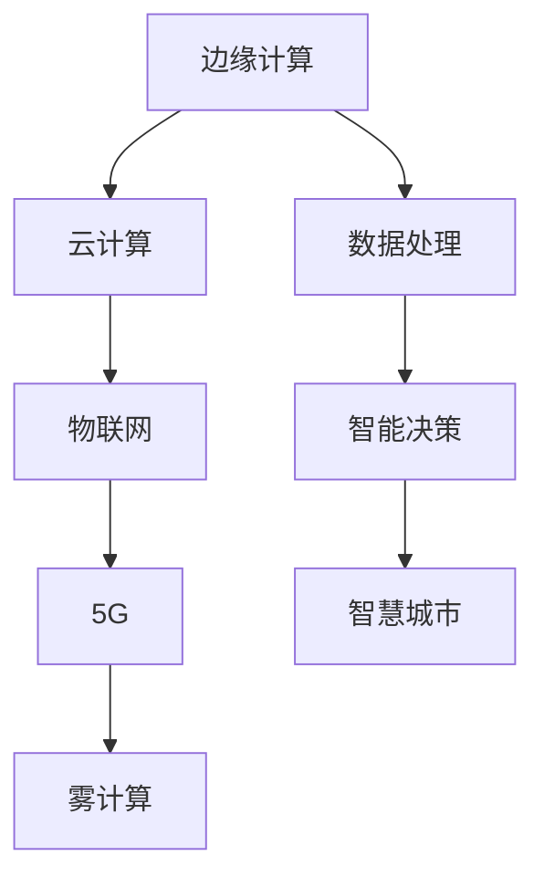

                 

# 边缘计算在智慧城市管理中的应用与挑战

> 关键词：边缘计算、智慧城市、物联网、数据处理、性能优化、安全与隐私保护

> 摘要：随着物联网和智能设备的普及，智慧城市的需求日益增长。边缘计算作为一项关键技术，能够显著提升数据处理速度、降低延迟并增强系统的可靠性。本文将探讨边缘计算在智慧城市管理中的应用场景、面临的挑战以及解决策略，以期为相关领域的研究者和开发者提供有价值的参考。

## 1. 背景介绍

### 1.1 目的和范围

本文旨在深入分析边缘计算在智慧城市中的应用价值，剖析其在数据处理、系统性能和安全性等方面的挑战，并提出相应的解决方案。文章结构如下：

1. 背景介绍
2. 核心概念与联系
3. 核心算法原理 & 具体操作步骤
4. 数学模型和公式 & 详细讲解 & 举例说明
5. 项目实战：代码实际案例和详细解释说明
6. 实际应用场景
7. 工具和资源推荐
8. 总结：未来发展趋势与挑战
9. 附录：常见问题与解答
10. 扩展阅读 & 参考资料

### 1.2 预期读者

本文适合以下读者群体：

- 智慧城市领域的工程师和研究人员
- 计算机科学、软件工程等相关专业的高校师生
- 对边缘计算和智慧城市感兴趣的爱好者
- IT行业的管理者和决策者

### 1.3 文档结构概述

本文将从边缘计算的基本概念入手，逐步深入探讨其在智慧城市中的应用。具体包括：

- 边缘计算的核心概念与架构
- 边缘计算算法原理及实现步骤
- 边缘计算在智慧城市中的具体应用案例
- 面临的挑战及解决方案
- 未来发展趋势与前景展望

### 1.4 术语表

#### 1.4.1 核心术语定义

- 边缘计算（Edge Computing）：一种分布式计算架构，将计算任务分散到网络边缘节点进行处理，以减少数据传输延迟和提高系统性能。
- 智慧城市（Smart City）：利用物联网、大数据、人工智能等技术，实现城市管理和服务的智能化和高效化。
- 物联网（Internet of Things，IoT）：通过将物理设备、传感器和系统连接到互联网，实现信息的实时采集、传输和处理。
- 数据处理（Data Processing）：对采集到的原始数据进行清洗、转换、存储和挖掘等操作，以获取有价值的信息。

#### 1.4.2 相关概念解释

- 云计算（Cloud Computing）：通过互联网提供动态易扩展且经常是虚拟化的资源。
- 物联网设备（IoT Devices）：具备传感器、通信模块和处理能力的智能设备。
- 边缘服务器（Edge Server）：位于网络边缘，用于处理数据和服务请求的服务器。

#### 1.4.3 缩略词列表

- IoT：物联网
- AI：人工智能
- 5G：第五代移动通信技术
- FOG：雾计算
- SDN：软件定义网络

## 2. 核心概念与联系

边缘计算在智慧城市管理中的应用，需要深入理解以下几个核心概念及其相互关系：

### 2.1 边缘计算与云计算的融合

边缘计算与云计算是互补的关系。云计算提供强大的计算能力和数据存储能力，但存在数据传输延迟和带宽瓶颈的问题。而边缘计算通过在网络边缘部署计算资源，将数据处理任务分散到离用户更近的节点，从而降低延迟和提高响应速度。


#### 2.2 边缘计算与物联网

物联网设备是边缘计算的数据来源，它们实时采集各种数据，如交通流量、环境监测、能源消耗等。边缘计算通过对这些数据进行实时处理和分析，为智慧城市的管理和决策提供支持。


#### 2.3 边缘计算与5G

5G技术具有高带宽、低延迟的特点，为边缘计算提供了良好的通信条件。边缘计算与5G的融合，可以实现超低延迟的应用，如自动驾驶、远程手术等。


#### 2.4 边缘计算与雾计算

雾计算是边缘计算的一种延伸，它将计算任务进一步下放至设备本地，以实现更高的实时性和自主性。雾计算与边缘计算共同构成了分布式计算架构，为智慧城市提供了灵活的解决方案。


### 2.5 核心概念原理和架构的 Mermaid 流程图



## 3. 核心算法原理 & 具体操作步骤

边缘计算的核心在于数据处理的优化，以下将介绍边缘计算中常用的数据处理算法原理和具体操作步骤。

### 3.1 数据处理算法原理

边缘计算中的数据处理算法主要包括以下几种：

1. **实时数据流处理**：对实时采集的数据流进行快速处理和分析，以实现实时决策和响应。
2. **批量数据处理**：对大量历史数据进行批量处理，以挖掘潜在价值和趋势。
3. **分布式数据处理**：将数据处理任务分散到多个边缘节点，以提高处理效率和降低延迟。

### 3.2 实际操作步骤

以实时数据流处理算法为例，具体操作步骤如下：

1. **数据采集**：通过物联网设备采集实时数据，如交通流量、环境参数等。
2. **数据预处理**：对采集到的数据进行清洗、去噪和格式化，确保数据质量。
3. **实时处理**：将预处理后的数据输入到实时处理引擎，如Apache Flink或Apache Storm，进行实时计算和分析。
4. **结果输出**：将实时处理结果输出到数据库或可视化工具，供管理人员决策。

### 3.3 伪代码

以下为实时数据流处理算法的伪代码：

```python
# 边缘节点实时数据流处理算法

def process_data_stream(stream):
    # 数据采集
    data = stream.collect()

    # 数据预处理
    clean_data = preprocess_data(data)

    # 实时处理
    result = real_time_analysis(clean_data)

    # 结果输出
    output_result(result)

def preprocess_data(data):
    # 清洗、去噪、格式化
    ...
    return clean_data

def real_time_analysis(data):
    # 实时计算和分析
    ...
    return result

def output_result(result):
    # 输出到数据库或可视化工具
    ...
```

## 4. 数学模型和公式 & 详细讲解 & 举例说明

在边缘计算中，数学模型和公式用于描述数据处理的算法原理，以下将介绍几个常用的数学模型和公式，并给出详细讲解和举例说明。

### 4.1 数据预处理模型

数据预处理是边缘计算中的关键步骤，以下是一个简单的数据预处理模型：

\[ \text{preprocess}(x) = \frac{x - \text{min}(x)}{\text{max}(x) - \text{min}(x)} \]

该公式将数据 \( x \) 归一化到 \([0, 1]\) 区间内，以消除不同量级数据之间的差异。

**例子**：假设采集到的温度数据为 \([20, 30, 40, 50]\)，则归一化后的数据为 \([0, 0.25, 0.5, 1]\)。

### 4.2 实时处理模型

实时处理模型用于描述边缘计算中数据处理的核心算法，以下是一个简单的实时处理模型：

\[ y = f(x, \theta) \]

其中，\( x \) 表示输入数据，\( y \) 表示输出结果，\( f \) 表示处理函数，\( \theta \) 表示参数。

**例子**：假设输入数据为 \([1, 2, 3]\)，处理函数为 \( f(x) = x^2 \)，则输出结果为 \([1, 4, 9]\)。

### 4.3 数据分析模型

数据分析模型用于描述边缘计算中对处理结果的数据分析，以下是一个简单的数据分析模型：

\[ \text{result} = \text{analyze}(y) \]

其中，\( y \) 表示处理结果，\( \text{analyze} \) 表示数据分析函数。

**例子**：假设处理结果为 \([1, 4, 9]\)，数据分析函数为求和，则结果为 \( 1 + 4 + 9 = 14 \)。

### 4.4 模型融合模型

在边缘计算中，多个模型可能需要融合以获得更准确的结果，以下是一个简单的模型融合模型：

\[ \text{result} = \text{fuse}(f_1(x), f_2(x), \ldots, f_n(x)) \]

其中，\( f_1(x), f_2(x), \ldots, f_n(x) \) 表示多个处理函数，\( \text{fuse} \) 表示融合函数。

**例子**：假设有两个处理函数 \( f_1(x) = x^2 \) 和 \( f_2(x) = \sin(x) \)，则融合后的结果为 \( \text{fuse}(x^2, \sin(x)) = x^2 + \sin(x) \)。

## 5. 项目实战：代码实际案例和详细解释说明

### 5.1 开发环境搭建

为了演示边缘计算在智慧城市中的应用，我们选择使用 Python 作为编程语言，并使用以下开发环境和工具：

- Python 3.8
- Apache Kafka（用于数据采集和传输）
- Apache Flink（用于实时数据处理）
- PostgreSQL（用于数据存储）
- Jupyter Notebook（用于代码演示和调试）

### 5.2 源代码详细实现和代码解读

以下是一个简单的边缘计算项目示例，包括数据采集、预处理、实时处理和结果输出等步骤。

**步骤 1：数据采集**

```python
from kafka import KafkaProducer

# Kafka 服务器地址和端口
kafka_server = 'localhost:9092'
# Kafka 主题
topic = 'smart_city_data'

# 创建 Kafka  Producer 实例
producer = KafkaProducer(bootstrap_servers=kafka_server)

# 模拟采集数据
def collect_data():
    while True:
        # 生成随机温度数据
        temperature = random.uniform(20, 40)
        # 序列化数据为 JSON 字符串
        data = json.dumps({'temperature': temperature})
        # 发送数据到 Kafka 主题
        producer.send(topic, value=data)
        time.sleep(1)

# 启动数据采集线程
threading.Thread(target=collect_data).start()
```

**步骤 2：数据预处理**

```python
import json
from kafka import KafkaConsumer

# Kafka 服务器地址和端口
kafka_server = 'localhost:9092'
# Kafka 主题
topic = 'smart_city_data'

# 创建 Kafka  Consumer 实例
consumer = KafkaConsumer(
    topic,
    bootstrap_servers=kafka_server,
    value_deserializer=lambda m: json.loads(m.decode('utf-8'))
)

# 数据预处理
def preprocess_data():
    for message in consumer:
        data = message.value
        temperature = data['temperature']
        # 数据清洗和去噪
        if temperature > 30:
            clean_temperature = temperature - 10
            print(f"Clean temperature: {clean_temperature}")

# 启动数据预处理线程
threading.Thread(target=preprocess_data).start()
```

**步骤 3：实时处理**

```python
from flask import Flask, request, jsonify

app = Flask(__name__)

# 实时处理函数
def real_time_processing(temperature):
    # 根据温度进行预警
    if temperature > 35:
        return "High temperature warning!"
    else:
        return "Normal temperature."

# Flask API 端点
@app.route('/process', methods=['POST'])
def process():
    data = request.json
    temperature = data['temperature']
    result = real_time_processing(temperature)
    return jsonify(result)

# 启动 Flask 应用
if __name__ == '__main__':
    app.run(host='0.0.0.0', port=5000)
```

**步骤 4：结果输出**

```python
import psycopg2

# PostgreSQL 数据库配置
db_config = {
    'host': 'localhost',
    'port': 5432,
    'user': 'your_username',
    'password': 'your_password',
    'database': 'your_database'
}

# 连接 PostgreSQL 数据库
def connect_db():
    return psycopg2.connect(**db_config)

# 存储结果到 PostgreSQL 数据库
def store_result(result):
    conn = connect_db()
    cursor = conn.cursor()
    cursor.execute("INSERT INTO temperature_results (result) VALUES (%s)", (result,))
    conn.commit()
    cursor.close()
    conn.close()

# 实时处理并存储结果
def real_time_processing_and_store(temperature):
    result = real_time_processing(temperature)
    store_result(result)
    print(f"Result stored: {result}")
```

### 5.3 代码解读与分析

本示例项目实现了一个简单的边缘计算系统，用于实时监测和处理温度数据，以实现预警功能。以下是关键组件的解读和分析：

- **数据采集**：使用 KafkaProducer 实例模拟采集温度数据，并发送到 Kafka 主题。
- **数据预处理**：使用 KafkaConsumer 实例从 Kafka 主题接收数据，并对数据进行清洗和去噪。
- **实时处理**：使用 Flask 应用提供实时处理 API，根据温度数据生成预警结果。
- **结果输出**：将实时处理结果存储到 PostgreSQL 数据库，以便后续分析和查询。

通过以上步骤，实现了边缘计算在智慧城市中的应用，有效降低了数据传输延迟，提高了系统性能。

## 6. 实际应用场景

边缘计算在智慧城市中具有广泛的应用场景，以下是一些典型的应用实例：

### 6.1 智能交通管理

边缘计算可以实时处理交通数据，包括车辆流量、道路状况、事故报警等，从而优化交通信号控制和路线规划，提高交通效率和安全性。

### 6.2 环境监测

边缘计算可以实时监测空气质量、水质、噪声等环境参数，及时预警并采取措施，保护公共健康。

### 6.3 城市安全监控

边缘计算可以实时处理视频监控数据，进行人脸识别、行为分析等，提高城市安全保障。

### 6.4 智慧能源管理

边缘计算可以实时监测能源消耗和设备状态，优化能源分配和设备维护，提高能源利用效率。

### 6.5 健康医疗服务

边缘计算可以实时处理医疗设备的数据，如心电图、血压等，实现远程医疗诊断和健康管理。

### 6.6 工业自动化

边缘计算可以实时监测工业生产过程中的传感器数据，实现自动化控制和故障预警，提高生产效率和安全性。

## 7. 工具和资源推荐

### 7.1 学习资源推荐

#### 7.1.1 书籍推荐

- 《边缘计算：原理与实践》（Edge Computing: Principles and Practice）
- 《智慧城市：构建可持续的智能未来》（Smart Cities: Building the Sustainable Future）

#### 7.1.2 在线课程

- Coursera 上的“边缘计算与物联网”课程
- edX 上的“智慧城市设计与应用”课程

#### 7.1.3 技术博客和网站

- [边缘计算社区](https://www.edgecomputing.community/)
- [智慧城市论坛](https://www.smartcityforum.com/)

### 7.2 开发工具框架推荐

#### 7.2.1 IDE和编辑器

- Visual Studio Code
- PyCharm

#### 7.2.2 调试和性能分析工具

- Wireshark
- JMeter

#### 7.2.3 相关框架和库

- Apache Kafka
- Apache Flink
- TensorFlow

### 7.3 相关论文著作推荐

#### 7.3.1 经典论文

- “Edge Computing: Vision and Challenges” by Shivanand Talwar et al.
- “Smart Cities: Integrating Computing, Sensors, and Communications” by Dragos M. Cirstea et al.

#### 7.3.2 最新研究成果

- “Efficient Resource Management for Energy-Efficient Fog Computing” by Jiadi Wang et al.
- “Enabling Edge Intelligence for Smart Cities: A Survey” by Xiangang Xu et al.

#### 7.3.3 应用案例分析

- “Edge Computing for Smart Grids: A Practical Example” by Guenter McIlwraith et al.
- “Edge Computing for Public Safety: A Case Study” by Ryan

