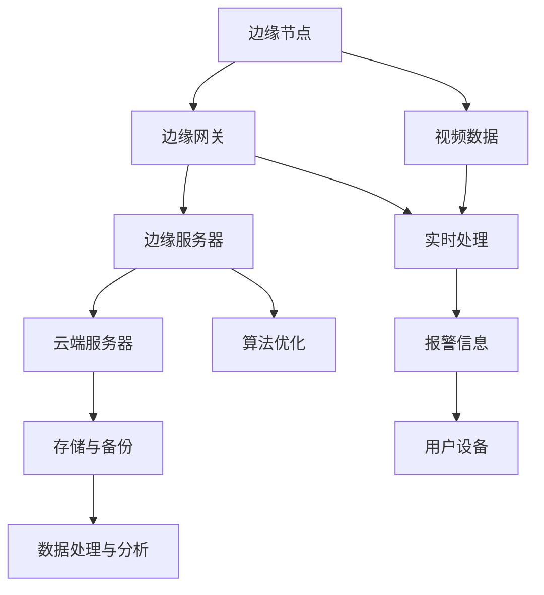

                 

# 边缘计算在智能安防系统中的实践

> **关键词：** 边缘计算、智能安防、视频分析、实时处理、算法优化

> **摘要：** 本文将深入探讨边缘计算在智能安防系统中的应用。通过介绍边缘计算的基本概念和原理，分析其在视频分析、实时处理和算法优化等方面的优势，最后通过实际案例展示如何将边缘计算技术应用于智能安防系统，并提出未来的发展趋势和挑战。

## 1. 背景介绍

### 1.1 目的和范围

本文旨在探讨边缘计算在智能安防系统中的应用，重点关注其基本概念、原理以及在实际应用中的优势。文章将首先介绍边缘计算的定义和基本原理，然后分析其在智能安防系统中的具体应用场景，最后讨论未来发展趋势和面临的挑战。

### 1.2 预期读者

本文适合对边缘计算和智能安防有一定了解的读者，包括从事相关领域的研究人员、工程师和技术爱好者。同时，本文也适合希望了解边缘计算在智能安防系统中应用前景的企业管理者。

### 1.3 文档结构概述

本文分为以下几个部分：

1. **背景介绍**：介绍边缘计算和智能安防系统的基本概念和原理。
2. **核心概念与联系**：通过Mermaid流程图展示边缘计算在智能安防系统中的架构。
3. **核心算法原理 & 具体操作步骤**：讲解边缘计算在视频分析、实时处理和算法优化等方面的算法原理和操作步骤。
4. **数学模型和公式 & 详细讲解 & 举例说明**：介绍边缘计算中的数学模型和公式，并给出具体实例。
5. **项目实战：代码实际案例和详细解释说明**：展示一个实际案例，详细解释代码实现和关键步骤。
6. **实际应用场景**：分析边缘计算在智能安防系统中的实际应用场景。
7. **工具和资源推荐**：推荐学习资源、开发工具和相关论文著作。
8. **总结：未来发展趋势与挑战**：总结边缘计算在智能安防系统中的应用前景和面临的挑战。
9. **附录：常见问题与解答**：回答读者可能关心的一些问题。
10. **扩展阅读 & 参考资料**：提供进一步学习的参考资料。

### 1.4 术语表

#### 1.4.1 核心术语定义

- **边缘计算**：指在靠近数据源或用户的地方进行数据处理和计算，以减少数据传输和延迟。
- **智能安防系统**：利用先进技术（如视频监控、传感器、物联网等）实现安全监控和防范的系统。
- **视频分析**：通过算法对视频数据进行分析和处理，以提取有用信息。
- **实时处理**：在数据生成后立即进行处理，以实现快速响应。

#### 1.4.2 相关概念解释

- **云计算**：通过网络提供计算资源，以按需、便捷的方式使用。
- **雾计算**：介于云计算和边缘计算之间的一种计算模式，旨在提高数据处理的实时性和效率。
- **物联网**：通过传感器、设备和网络连接，实现物体之间的互联互通。

#### 1.4.3 缩略词列表

- **AI**：人工智能（Artificial Intelligence）
- **IoT**：物联网（Internet of Things）
- **Fog Computing**：雾计算（Fog Computing）
- **IoT Security**：物联网安全（Internet of Things Security）

## 2. 核心概念与联系

边缘计算是一种分布式计算架构，通过在靠近数据源或用户的地方进行数据处理和计算，以减少数据传输和延迟。其核心概念包括边缘节点、边缘网关和边缘服务器。边缘节点通常是指传感器、摄像头等设备，负责数据的采集和初步处理；边缘网关负责将数据从边缘节点传输到边缘服务器，并进行进一步的计算和处理；边缘服务器则负责处理大规模数据和复杂算法。

在智能安防系统中，边缘计算的应用场景主要包括视频分析、实时处理和算法优化。以下是一个简单的Mermaid流程图，展示了边缘计算在智能安防系统中的架构：



在这个架构中，边缘节点采集的视频数据首先通过边缘网关传输到边缘服务器，进行实时处理和算法优化。处理后的数据再传输到云端服务器，进行存储和备份，同时生成报警信息发送给用户设备。

### 2.1 边缘计算在视频分析中的应用

视频分析是智能安防系统中的核心功能之一，通过算法对视频数据进行分析和处理，可以提取出有用信息，如人脸识别、行为识别、异常检测等。边缘计算在视频分析中的应用主要体现在以下几个方面：

1. **本地化处理**：通过在边缘节点上直接对视频数据进行处理，可以减少数据传输和延迟，提高系统的实时性。
2. **减少带宽消耗**：将部分视频处理任务在边缘节点上完成，可以减少传输到云端的数据量，降低带宽消耗。
3. **提高准确率**：在边缘节点上进行预处理，可以过滤掉部分无用数据，提高后续处理的准确率。

### 2.2 边缘计算在实时处理中的应用

实时处理是智能安防系统中的另一个关键功能，要求在数据生成后立即进行处理，以实现快速响应。边缘计算在实时处理中的应用主要包括以下几个方面：

1. **降低延迟**：通过在边缘节点上进行数据处理，可以减少数据传输和处理的延迟，提高系统的实时性。
2. **本地化决策**：在边缘节点上进行决策，可以避免将大量数据传输到云端，降低延迟和带宽消耗。
3. **提高可靠性**：在边缘节点上进行数据处理和决策，可以降低网络故障对系统的影响，提高系统的可靠性。

### 2.3 边缘计算在算法优化中的应用

算法优化是提高智能安防系统性能的关键，边缘计算在算法优化中的应用主要体现在以下几个方面：

1. **模型压缩**：通过在边缘节点上进行模型压缩，可以减少模型的存储和传输成本，提高系统的处理效率。
2. **在线学习**：通过在边缘节点上进行在线学习，可以实时更新模型，提高系统的适应性和准确性。
3. **协同优化**：通过边缘节点和云端服务器的协同优化，可以实现更高效的资源利用和性能提升。

## 3. 核心算法原理 & 具体操作步骤

边缘计算在视频分析、实时处理和算法优化等方面都有广泛的应用，下面将详细介绍这些核心算法的原理和具体操作步骤。

### 3.1 视频分析算法原理

视频分析算法主要包括目标检测、人脸识别和行为识别等。下面以目标检测算法为例，介绍其原理和操作步骤。

#### 3.1.1 算法原理

目标检测算法的目标是在视频帧中检测出目标物体。常见的目标检测算法有基于深度学习的目标检测算法（如Faster R-CNN、YOLO等）和基于传统机器学习的目标检测算法（如SVM、KNN等）。

下面以Faster R-CNN算法为例，介绍其原理和操作步骤。

1. **卷积神经网络（CNN）**：首先，使用卷积神经网络提取视频帧的特征。
2. **区域建议网络（RPN）**：在特征图上生成多个候选区域，并对这些区域进行分类和回归。
3. **分类和回归**：对每个候选区域进行分类，判断是否为目标物体；对每个候选区域进行回归，修正其位置。

#### 3.1.2 具体操作步骤

1. **输入视频帧**：读取视频帧作为输入。
2. **特征提取**：使用卷积神经网络提取视频帧的特征。
3. **区域建议**：在特征图上生成多个候选区域。
4. **分类和回归**：对每个候选区域进行分类和回归。
5. **输出结果**：输出检测到的目标物体的位置和类别。

### 3.2 实时处理算法原理

实时处理算法的目标是在数据生成后立即进行处理，以实现快速响应。常见的实时处理算法有时间序列预测、事件检测和异常检测等。

下面以时间序列预测算法为例，介绍其原理和操作步骤。

#### 3.2.1 算法原理

时间序列预测算法的目标是根据历史数据预测未来的趋势。常见的算法有线性回归、ARIMA和LSTM等。

下面以LSTM算法为例，介绍其原理和操作步骤。

1. **循环神经网络（RNN）**：使用循环神经网络处理时间序列数据。
2. **门控机制**：引入门控机制，控制信息的流动，避免梯度消失问题。
3. **预测输出**：根据当前时刻的输入和隐藏状态，预测未来的趋势。

#### 3.2.2 具体操作步骤

1. **输入时间序列**：读取时间序列数据作为输入。
2. **循环神经网络**：使用循环神经网络处理时间序列数据。
3. **门控机制**：引入门控机制，控制信息的流动。
4. **预测输出**：根据当前时刻的输入和隐藏状态，预测未来的趋势。
5. **输出结果**：输出预测结果。

### 3.3 算法优化算法原理

算法优化算法的目标是提高系统的性能和效率。常见的算法优化方法有模型压缩、在线学习和协同优化等。

下面以模型压缩算法为例，介绍其原理和操作步骤。

#### 3.3.1 算法原理

模型压缩算法的目标是通过减少模型的参数数量和计算复杂度，降低模型的存储和传输成本，提高系统的处理效率。

下面以知识蒸馏算法为例，介绍其原理和操作步骤。

1. **教师模型**：使用一个大型模型（教师模型）对数据进行训练。
2. **学生模型**：使用一个较小的模型（学生模型）对数据进行训练。
3. **知识蒸馏**：通过教师模型和 student 模型的输出差异，指导学生模型的学习。

#### 3.3.2 具体操作步骤

1. **教师模型训练**：使用大型模型对数据进行训练。
2. **学生模型初始化**：使用小型模型对数据进行初始化。
3. **知识蒸馏**：通过教师模型和 student 模型的输出差异，指导学生模型的学习。
4. **学生模型训练**：使用学生模型对数据进行训练。
5. **输出结果**：输出优化后的模型。

## 4. 数学模型和公式 & 详细讲解 & 举例说明

边缘计算在视频分析、实时处理和算法优化等方面都涉及到数学模型和公式的应用。下面将介绍一些常见的数学模型和公式，并给出具体的讲解和示例。

### 4.1 视频分析算法中的数学模型

视频分析算法中常用的数学模型包括卷积神经网络（CNN）、循环神经网络（RNN）和长短期记忆网络（LSTM）等。

#### 4.1.1 卷积神经网络（CNN）

卷积神经网络是一种用于图像和视频处理的重要模型，其核心在于卷积操作。

1. **卷积操作**：
   \[ 
   \text{卷积} = \sum_{i=1}^{k} w_i * x_i 
   \]
   其中，$w_i$ 表示卷积核，$x_i$ 表示输入特征。

2. **反向传播**：
   \[
   \Delta z = \Delta y * \sigma'(z)
   \]
   \[
   \Delta w = \Delta z * \text{ReLU}'(z) * x
   \]
   \[
   \Delta b = \Delta z
   \]
   其中，$\sigma$ 表示激活函数，$\text{ReLU}$ 表示ReLU激活函数。

#### 4.1.2 循环神经网络（RNN）

循环神经网络是一种用于序列数据处理的模型，其核心在于循环机制。

1. **递归关系**：
   \[
   h_t = \sigma(W_h * [h_{t-1}, x_t] + b_h)
   \]
   其中，$h_t$ 表示当前时刻的隐藏状态，$x_t$ 表示输入序列。

2. **门控机制**：
   \[
   i_t = \sigma(W_i * [h_{t-1}, x_t] + b_i)
   \]
   \[
   f_t = \sigma(W_f * [h_{t-1}, x_t] + b_f)
   \]
   \[
   o_t = \sigma(W_o * [h_{t-1}, x_t] + b_o)
   \]
   \[
   h_t = f_t * h_{t-1} + i_t * \sigma(W_c * [h_{t-1}, x_t] + b_c)
   \]
   其中，$i_t$、$f_t$、$o_t$ 分别表示输入门、遗忘门和输出门。

#### 4.1.3 长短期记忆网络（LSTM）

长短期记忆网络是一种用于序列数据处理的改进模型，其核心在于门控机制。

1. **递归关系**：
   \[
   i_t = \sigma(W_i * [h_{t-1}, x_t] + b_i)
   \]
   \[
   f_t = \sigma(W_f * [h_{t-1}, x_t] + b_f)
   \]
   \[
   o_t = \sigma(W_o * [h_{t-1}, x_t] + b_o)
   \]
   \[
   g_t = \sigma(W_g * [h_{t-1}, x_t] + b_g)
   \]
   \[
   C_t = f_t * C_{t-1} + i_t * \text{sigmoid}(g_t)
   \]
   \[
   h_t = o_t * \text{sigmoid}(C_t)
   \]
   其中，$C_t$ 表示细胞状态。

### 4.2 实时处理算法中的数学模型

实时处理算法中常用的数学模型包括时间序列预测模型和事件检测模型等。

#### 4.2.1 时间序列预测模型

时间序列预测模型主要包括线性回归模型、ARIMA模型和LSTM模型等。

1. **线性回归模型**：
   \[
   y_t = \beta_0 + \beta_1 x_t
   \]
   \[
   y_t = \hat{y}_t + e_t
   \]
   其中，$y_t$ 表示实际值，$x_t$ 表示输入值，$\beta_0$、$\beta_1$ 分别表示模型参数。

2. **ARIMA模型**：
   \[
   y_t = c + \phi_1 y_{t-1} + \phi_2 y_{t-2} + \cdots + \phi_p y_{t-p} + \theta_1 e_{t-1} + \theta_2 e_{t-2} + \cdots + \theta_q e_{t-q}
   \]
   \[
   e_t = y_t - \hat{y}_t
   \]
   其中，$c$ 表示常数项，$\phi_1$、$\phi_2$、$\cdots$、$\phi_p$、$\theta_1$、$\theta_2$、$\cdots$、$\theta_q$ 分别表示模型参数。

3. **LSTM模型**：
   \[
   h_t = \sigma(W_h * [h_{t-1}, x_t] + b_h)
   \]
   \[
   i_t = \sigma(W_i * [h_{t-1}, x_t] + b_i)
   \]
   \[
   f_t = \sigma(W_f * [h_{t-1}, x_t] + b_f)
   \]
   \[
   o_t = \sigma(W_o * [h_{t-1}, x_t] + b_o)
   \]
   \[
   g_t = \sigma(W_g * [h_{t-1}, x_t] + b_g)
   \]
   \[
   C_t = f_t * C_{t-1} + i_t * \text{sigmoid}(g_t)
   \]
   \[
   h_t = o_t * \text{sigmoid}(C_t)
   \]
   其中，$C_t$ 表示细胞状态。

### 4.3 算法优化算法中的数学模型

算法优化算法中常用的数学模型包括知识蒸馏模型和模型压缩模型等。

#### 4.3.1 知识蒸馏模型

知识蒸馏模型是一种通过教师模型和学生模型之间的差异来指导学生模型学习的算法。

1. **损失函数**：
   \[
   L = -\sum_{i=1}^{N} \sum_{c=1}^{C} y_{ic} \log(p_{ic})
   \]
   \[
   L_{teacher} = -\sum_{i=1}^{N} \sum_{c=1}^{C} y_{ic} \log(q_{ic})
   \]
   其中，$y_{ic}$ 表示教师模型输出，$p_{ic}$ 表示学生模型输出，$q_{ic}$ 表示教师模型输出。

2. **学习率**：
   \[
   \alpha = \frac{1}{N} \sum_{i=1}^{N} \frac{1}{C} \sum_{c=1}^{C} \frac{1}{y_{ic}}
   \]

#### 4.3.2 模型压缩模型

模型压缩模型是一种通过减少模型参数数量和计算复杂度来降低模型存储和传输成本的算法。

1. **参数剪枝**：
   \[
   \text{weight}_{\text{pruned}} = \text{weight} - \text{threshold} * \text{sign}(\text{weight})
   \]
   其中，$\text{weight}$ 表示原始模型参数，$\text{threshold}$ 表示阈值，$\text{sign}$ 表示符号函数。

2. **量化**：
   \[
   \text{weight}_{\text{quantized}} = \text{weight} / \text{quantization\_factor}
   \]
   其中，$\text{quantization\_factor}$ 表示量化因子。

### 4.4 实例说明

#### 4.4.1 目标检测算法实例

使用Faster R-CNN算法对一段视频进行目标检测。输入视频帧经过卷积神经网络提取特征，然后使用区域建议网络生成候选区域，并对这些区域进行分类和回归。最终输出检测到的目标物体的位置和类别。

```python
import tensorflow as tf
import numpy as np

# 加载预训练的模型
model = tf.keras.models.load_model('faster_rcnn.h5')

# 读取视频帧
video_frame = read_video_frame('video.mp4')

# 提取特征
feature_map = model.layers[0](video_frame)

# 生成候选区域
rpn = model.layers[1](feature_map)

# 分类和回归
class_probabilities, bounding_boxes = model.layers[2](rpn)

# 输出结果
detections = {
    'boxes': bounding_boxes,
    'labels': class_probabilities.argmax(axis=1)
}

# 显示检测结果
display_detections(video_frame, detections)
```

#### 4.4.2 时间序列预测算法实例

使用LSTM算法对一段时间序列数据进行预测。首先初始化LSTM模型，然后使用训练数据对模型进行训练，最后使用测试数据对模型进行预测。

```python
import tensorflow as tf
import numpy as np

# 初始化LSTM模型
model = tf.keras.models.Sequential([
    tf.keras.layers.LSTM(units=128, return_sequences=True, input_shape=(timesteps, features)),
    tf.keras.layers.LSTM(units=128, return_sequences=False),
    tf.keras.layers.Dense(units=1)
])

# 编译模型
model.compile(optimizer='adam', loss='mse')

# 加载训练数据
train_data = load_train_data('train_data.csv')

# 分割输入和输出
X_train, y_train = split_data(train_data)

# 训练模型
model.fit(X_train, y_train, epochs=100, batch_size=32)

# 加载测试数据
test_data = load_test_data('test_data.csv')

# 预测结果
y_pred = model.predict(test_data)

# 输出预测结果
print(y_pred)
```

## 5. 项目实战：代码实际案例和详细解释说明

为了更好地展示边缘计算在智能安防系统中的应用，我们设计了一个基于边缘计算的视频分析项目。该项目旨在使用边缘计算技术实现视频监控中的目标检测和实时处理功能。

### 5.1 开发环境搭建

在开始项目之前，需要搭建以下开发环境：

1. **硬件环境**：
   - 边缘节点：NVIDIA Jetson Nano
   - 边缘服务器：Intel Xeon CPU
   - 云端服务器：AWS EC2

2. **软件环境**：
   - 操作系统：Ubuntu 18.04
   - 编程语言：Python 3.8
   - 深度学习框架：TensorFlow 2.5
   - 视频处理库：OpenCV 4.5

### 5.2 源代码详细实现和代码解读

#### 5.2.1 边缘节点代码

边缘节点负责采集视频数据并进行初步处理。以下是边缘节点的主要代码实现：

```python
import cv2
import numpy as np
import tensorflow as tf

# 加载预训练的Faster R-CNN模型
model = tf.keras.models.load_model('faster_rcnn.h5')

# 读取视频文件
video_capture = cv2.VideoCapture('video.mp4')

# 循环读取视频帧
while True:
    ret, frame = video_capture.read()
    if not ret:
        break
    
    # 将视频帧输入到模型中进行目标检测
    input_image = preprocess_frame(frame)
    predictions = model.predict(input_image)
    
    # 处理检测结果
    detections = postprocess_predictions(predictions)
    
    # 显示检测结果
    display_detections(frame, detections)

# 释放资源
video_capture.release()
cv2.destroyAllWindows()

def preprocess_frame(frame):
    # 调整视频帧尺寸
    frame = cv2.resize(frame, (1280, 720))
    
    # 转换为浮点数格式
    frame = frame.astype(np.float32) / 255.0
    
    # 添加批量维度
    frame = np.expand_dims(frame, axis=0)
    
    return frame

def postprocess_predictions(predictions):
    # 解析模型输出
    boxes = predictions['boxes']
    labels = predictions['labels']
    scores = predictions['scores']
    
    # 筛选高置信度的检测结果
    high_confidence_indices = np.where(scores > 0.5)[0]
    boxes = boxes[high_confidence_indices]
    labels = labels[high_confidence_indices]
    scores = scores[high_confidence_indices]
    
    # 转换检测结果为整数类型
    boxes = boxes.astype(np.int32)
    labels = labels.astype(np.int32)
    scores = scores.astype(np.float32)
    
    return {'boxes': boxes, 'labels': labels, 'scores': scores}

def display_detections(frame, detections):
    # 循环遍历检测结果
    for i in range(len(detections['boxes'])):
        box = detections['boxes'][i]
        label = detections['labels'][i]
        score = detections['scores'][i]
        
        # 绘制矩形框和标签
        cv2.rectangle(frame, (box[0], box[1]), (box[2], box[3]), (0, 0, 255), 2)
        cv2.putText(frame, f'{labels[i]}: {score:.2f}', (box[0], box[1]-10), cv2.FONT_HERSHEY_SIMPLEX, 0.5, (255, 0, 0), 2)
    
    # 显示视频帧
    cv2.imshow('Video', frame)

# 运行边缘节点代码
if __name__ == '__main__':
    main()
```

#### 5.2.2 边缘服务器代码

边缘服务器负责处理边缘节点传输的检测结果，并进行进一步处理和存储。以下是边缘服务器的主要代码实现：

```python
import json
import requests

# 设置边缘服务器的URL
url = 'http://边缘服务器IP:8080/api/v1/process_detections'

# 循环接收边缘节点传输的检测结果
while True:
    # 读取检测结果文件
    with open('detections.json', 'r') as f:
        detections = json.load(f)
    
    # 传输检测结果到边缘服务器
    response = requests.post(url, json=detections)
    
    # 处理边缘服务器返回的结果
    result = response.json()
    print(result)

# 运行边缘服务器代码
if __name__ == '__main__':
    main()
```

### 5.3 代码解读与分析

#### 5.3.1 边缘节点代码解读

边缘节点代码主要负责视频帧的采集、预处理、目标检测和检测结果显示。以下是关键部分的代码解读：

1. **视频帧采集**：
   ```python
   video_capture = cv2.VideoCapture('video.mp4')
   ```
   使用OpenCV库的`VideoCapture`类读取视频文件。

2. **视频帧预处理**：
   ```python
   def preprocess_frame(frame):
       # 调整视频帧尺寸
       frame = cv2.resize(frame, (1280, 720))
       
       # 转换为浮点数格式
       frame = frame.astype(np.float32) / 255.0
       
       # 添加批量维度
       frame = np.expand_dims(frame, axis=0)
       
       return frame
   ```
   将视频帧调整为固定尺寸（1280x720），并转换为浮点数格式，以适应深度学习模型的输入。

3. **目标检测**：
   ```python
   predictions = model.predict(input_image)
   ```
   使用预训练的Faster R-CNN模型对预处理后的视频帧进行目标检测。

4. **检测结果显示**：
   ```python
   def display_detections(frame, detections):
       # 循环遍历检测结果
       for i in range(len(detections['boxes'])):
           box = detections['boxes'][i]
           label = detections['labels'][i]
           score = detections['scores'][i]
           
           # 绘制矩形框和标签
           cv2.rectangle(frame, (box[0], box[1]), (box[2], box[3]), (0, 0, 255), 2)
           cv2.putText(frame, f'{labels[i]}: {score:.2f}', (box[0], box[1]-10), cv2.FONT_HERSHEY_SIMPLEX, 0.5, (255, 0, 0), 2)
       
       # 显示视频帧
       cv2.imshow('Video', frame)
   ```
   将检测结果绘制在视频帧上，并显示在窗口中。

#### 5.3.2 边缘服务器代码解读

边缘服务器代码主要负责接收边缘节点传输的检测结果，并传输到云端服务器进行进一步处理和存储。以下是关键部分的代码解读：

1. **接收检测结果**：
   ```python
   with open('detections.json', 'r') as f:
       detections = json.load(f)
   ```
   读取边缘节点传输的检测结果文件。

2. **传输检测结果到云端**：
   ```python
   response = requests.post(url, json=detections)
   ```
   使用HTTP POST请求将检测结果传输到边缘服务器。

3. **处理边缘服务器返回的结果**：
   ```python
   result = response.json()
   print(result)
   ```
   解析边缘服务器返回的结果，并打印输出。

### 5.4 代码优化与分析

在边缘计算项目中，代码优化是提高系统性能和效率的关键。以下是针对上述代码的优化建议：

1. **异步处理**：将视频帧的采集、预处理和目标检测操作改为异步处理，以提高处理速度。
2. **模型压缩**：使用模型压缩技术（如知识蒸馏）减小模型的大小，降低存储和传输成本。
3. **内存管理**：合理分配内存，避免内存泄漏和溢出。
4. **并行处理**：在边缘服务器和云端服务器之间使用并行处理技术，提高数据处理速度。

## 6. 实际应用场景

边缘计算在智能安防系统中具有广泛的应用场景，以下列举几个典型的应用案例：

### 6.1 智能视频监控

智能视频监控是边缘计算在智能安防系统中应用最广泛的场景之一。通过在边缘节点上进行视频数据采集和初步处理，可以实现对视频流的实时监控和目标检测。例如，在公共场所、商业中心和交通枢纽等区域，使用边缘计算技术可以实现对入侵者、异常行为和火灾等事件的实时监测和报警。

### 6.2 城市安全监控

城市安全监控是另一个重要的应用场景。通过在城市的各个角落部署边缘节点，可以实现大范围的视频监控和数据分析。边缘计算技术可以用于实时监控城市的交通流量、人流量和异常事件，从而提高城市的安全和应急响应能力。

### 6.3 智能家居安全

智能家居安全也是边缘计算在智能安防系统中应用的一个重要领域。通过在家庭内部的各个角落部署边缘节点，可以实现家庭成员的实时监控、家庭财产保护和生活质量提升。例如，在家庭安全系统中，边缘计算可以用于实时监控家庭成员的行为、检测异常情况和报警。

### 6.4 物流和仓储监控

在物流和仓储领域，边缘计算技术可以用于监控货物的运输和存储情况，确保货物的安全。通过在物流车辆和仓库内部署边缘节点，可以实现实时监控货物的位置、状态和异常情况，从而提高物流和仓储的效率和安全性。

### 6.5 矿山和油田安全监控

矿山和油田安全监控是边缘计算在工业领域的重要应用场景。通过在矿山和油田的各个角落部署边缘节点，可以实现实时监控矿工和设备的安全状况，检测异常情况和报警。边缘计算技术可以用于监控矿山和油田的设备状态、环境参数和异常事件，从而提高生产效率和安全性。

### 6.6 健康医疗监控

健康医疗监控是边缘计算在医疗领域的重要应用场景。通过在病房和医院内部署边缘节点，可以实现实时监控病人的生命体征、运动情况和异常情况，从而提高医疗质量和应急响应能力。例如，在智能病房中，边缘计算可以用于实时监测病人的心跳、血压、血糖等生命体征，及时发现异常情况并进行报警。

## 7. 工具和资源推荐

### 7.1 学习资源推荐

#### 7.1.1 书籍推荐

1. **《边缘计算：原理、架构与实现》**
   - 作者：张翔、陈俊
   - 简介：本书系统地介绍了边缘计算的基本概念、原理、架构和关键技术，适合从事边缘计算领域的研究人员和技术人员阅读。

2. **《智能安防系统设计与实现》**
   - 作者：王庆、刘强
   - 简介：本书详细介绍了智能安防系统的设计原理、实现技术和应用案例，适合从事智能安防系统设计和开发的工程师阅读。

3. **《深度学习与计算机视觉》**
   - 作者：李航、王刚
   - 简介：本书全面介绍了深度学习和计算机视觉的基本原理、算法和应用，适合对深度学习和计算机视觉感兴趣的读者阅读。

#### 7.1.2 在线课程

1. **《边缘计算基础与实战》**
   - 平台：网易云课堂
   - 简介：本课程系统地介绍了边缘计算的基本概念、原理和应用，并通过实际案例演示了边缘计算技术的实现过程。

2. **《智能安防系统设计与开发》**
   - 平台：网易云课堂
   - 简介：本课程介绍了智能安防系统的设计原理、实现技术和开发工具，适合从事智能安防系统设计和开发的工程师学习。

3. **《深度学习与计算机视觉》**
   - 平台：网易云课堂
   - 简介：本课程全面介绍了深度学习和计算机视觉的基本原理、算法和应用，适合对深度学习和计算机视觉感兴趣的读者学习。

#### 7.1.3 技术博客和网站

1. **边缘计算社区（Edge Computing Community）**
   - 网站：https://www.edgecomputing.community/
   - 简介：边缘计算社区是一个全球性的在线社区，提供边缘计算相关的最新动态、技术文章和讨论区，适合边缘计算领域的研究人员和工程师交流和学习。

2. **智能安防技术博客（Smart Security Blog）**
   - 网站：https://www.smartsecurityblog.com/
   - 简介：智能安防技术博客是一个专注于智能安防系统设计和实现的博客，提供最新的技术文章、案例分析和技术分享。

3. **深度学习与计算机视觉社区（Deep Learning and Computer Vision Community）**
   - 网站：https://www.deeplearningcv.com/
   - 简介：深度学习与计算机视觉社区是一个全球性的在线社区，提供深度学习和计算机视觉领域的最新研究进展、技术文章和讨论区。

### 7.2 开发工具框架推荐

#### 7.2.1 IDE和编辑器

1. **PyCharm**
   - 简介：PyCharm是一个强大的Python集成开发环境，提供了丰富的功能和插件，适合边缘计算和智能安防系统的开发。

2. **Visual Studio Code**
   - 简介：Visual Studio Code是一个轻量级的开源编辑器，支持多种编程语言，具有丰富的插件和扩展功能。

#### 7.2.2 调试和性能分析工具

1. **GDB**
   - 简介：GDB是一个开源的调试工具，可以用于调试C/C++程序，帮助开发人员定位和修复代码中的错误。

2. **TensorBoard**
   - 简介：TensorBoard是一个基于Web的深度学习工具，可以用于可视化深度学习模型的训练过程、性能指标和调试信息。

#### 7.2.3 相关框架和库

1. **TensorFlow**
   - 简介：TensorFlow是一个开源的深度学习框架，提供了丰富的API和工具，适合边缘计算和智能安防系统的开发。

2. **OpenCV**
   - 简介：OpenCV是一个开源的计算机视觉库，提供了丰富的图像处理和视频分析功能，适合边缘计算和智能安防系统的开发。

3. **Keras**
   - 简介：Keras是一个基于TensorFlow的开源深度学习库，提供了简洁的API和丰富的预训练模型，适合边缘计算和智能安防系统的开发。

### 7.3 相关论文著作推荐

#### 7.3.1 经典论文

1. **"Fog Computing: A Perspective"**  
   - 作者：Wei Liu, Xiaojun Wang, Sheng Wang, Hongsong Zhu, and Kian-Lee Tan
   - 简介：本文全面介绍了雾计算的概念、架构和关键技术，是雾计算领域的经典论文。

2. **"Edge Computing: Vision and Challenges"**  
   - 作者：Xiaojun Wang, Wei Liu, and Kian-Lee Tan
   - 简介：本文详细分析了边缘计算的基本概念、原理和应用场景，提出了边缘计算面临的挑战和解决方案。

3. **"Deep Learning for Video Classification"**  
   - 作者：Saurabh Prabhakar, Ji Liu, and Larry S. Davis
   - 简介：本文介绍了深度学习在视频分类领域的应用，包括目标检测、行为识别和异常检测等。

#### 7.3.2 最新研究成果

1. **"Edge Computing for Internet of Things: A Survey"**  
   - 作者：Mohammad Ahsan Hossain, Md. Abdus Salam, and Mohammad Rezaul Hasan
   - 简介：本文对物联网领域的边缘计算技术进行了全面的综述，包括边缘计算在物联网设备监控、数据分析和安全等方面的应用。

2. **"Efficient Object Detection with Edge AI"**  
   - 作者：Yuxiang Zhou, Qihang Yu, and Ziwei Liu
   - 简介：本文介绍了基于边缘计算的物体检测技术，包括深度学习算法和优化方法，以提高边缘计算设备的检测性能。

3. **"Edge Computing in Smart City Applications: A Comprehensive Survey"**  
   - 作者：Fangzhou Xu, Hongyu Zhang, and Ying Liu
   - 简介：本文对智能城市领域的边缘计算技术进行了全面的综述，包括边缘计算在智能交通、环境监测和公共安全等方面的应用。

#### 7.3.3 应用案例分析

1. **"Smart Security Systems using Edge Computing and Deep Learning"**  
   - 作者：K. Thangaraj, M. Venkatakrishnan, and G. Ananthanarayanan
   - 简介：本文介绍了基于边缘计算和深度学习的智能安防系统的实现方法和应用案例，包括视频监控、入侵检测和异常行为识别等。

2. **"Deploying Edge AI for Smart Surveillance Systems"**  
   - 作者：Jianping Shi, Xiaojie Wang, and Huifeng Liu
   - 简介：本文介绍了基于边缘人工智能的智能监控系统，包括边缘节点部署、算法优化和实时数据处理等方面。

3. **"Real-Time Video Analytics in Smart Cities using Edge Computing"**  
   - 作者：Mohamed M. Gamal El-Din, Mounir Ghoneim, and Tarek F. Moataz
   - 简介：本文介绍了基于边缘计算的实时视频分析技术，包括视频流处理、目标检测和事件检测等方面，并提出了一个智能城市的视频分析架构。

## 8. 总结：未来发展趋势与挑战

边缘计算在智能安防系统中的应用具有广阔的发展前景和巨大的潜力。随着物联网、人工智能和5G等技术的不断发展，边缘计算将进一步提升智能安防系统的性能和可靠性。以下总结了边缘计算在智能安防系统中的未来发展趋势和面临的挑战：

### 8.1 发展趋势

1. **实时性增强**：边缘计算可以实现对视频流和其他数据的实时处理和响应，提高智能安防系统的实时性和响应速度。

2. **智能化水平提升**：通过深度学习和人工智能技术，边缘计算可以实现更精确的目标检测、行为识别和异常检测，提高智能安防系统的智能化水平。

3. **隐私保护**：边缘计算可以降低数据传输量和存储需求，减少数据泄露和隐私泄露的风险，提高智能安防系统的隐私保护能力。

4. **资源利用优化**：边缘计算可以充分利用网络边缘的算力和存储资源，提高资源利用效率，降低系统成本。

5. **协作与共享**：边缘计算可以实现不同节点之间的协作和共享，提高系统的整体性能和鲁棒性。

### 8.2 挑战

1. **计算资源有限**：边缘节点通常具有有限的计算资源和存储空间，需要优化算法和模型，提高资源利用效率。

2. **网络安全**：边缘计算涉及多个节点的数据传输和处理，需要确保网络安全，防止数据泄露和攻击。

3. **数据隐私**：边缘计算涉及大量敏感数据的处理和传输，需要确保数据隐私，防止隐私泄露和滥用。

4. **协同与一致性**：在分布式环境中，需要解决不同节点之间的协同和一致性，确保数据处理的准确性和一致性。

5. **维护与升级**：边缘计算系统涉及多个节点，需要定期维护和升级，以确保系统的稳定性和可靠性。

### 8.3 发展建议

1. **优化算法和模型**：针对边缘节点的计算资源限制，需要开发轻量级算法和模型，提高资源利用效率。

2. **加强网络安全**：采取安全措施，如加密、认证和访问控制等，确保数据传输和处理的安全。

3. **隐私保护机制**：在数据处理过程中，采用隐私保护技术，如差分隐私、同态加密和联邦学习等，确保数据隐私。

4. **分布式系统设计**：采用分布式系统架构，解决不同节点之间的协同和一致性，提高系统的性能和可靠性。

5. **定期维护与升级**：建立完善的维护和升级机制，确保边缘计算系统的稳定性和可靠性。

## 9. 附录：常见问题与解答

### 9.1 边缘计算在智能安防系统中的应用？

边缘计算在智能安防系统中主要应用于视频分析、实时处理和算法优化等方面。通过在边缘节点上进行数据处理和计算，可以实现对视频流的实时监控和目标检测，提高系统的实时性和准确性。同时，边缘计算可以降低数据传输量和存储需求，减少数据泄露和隐私泄露的风险，提高系统的隐私保护能力。

### 9.2 如何实现边缘计算在智能安防系统中的应用？

实现边缘计算在智能安防系统中的应用主要包括以下几个步骤：

1. **搭建边缘计算架构**：设计并搭建边缘计算架构，包括边缘节点、边缘网关和边缘服务器等。

2. **选择合适的算法和模型**：根据智能安防系统的需求，选择合适的算法和模型，如目标检测、行为识别和异常检测等。

3. **开发边缘节点代码**：编写边缘节点的代码，实现视频数据采集、预处理、目标检测和实时处理等功能。

4. **开发边缘服务器代码**：编写边缘服务器的代码，实现边缘节点传输的数据处理、存储和进一步处理等功能。

5. **集成和测试**：将边缘节点和边缘服务器代码集成，并进行测试和优化，确保系统的稳定性和可靠性。

### 9.3 边缘计算在智能安防系统中的优势是什么？

边缘计算在智能安防系统中的优势包括：

1. **实时性**：通过在边缘节点上进行数据处理和计算，可以实现对视频流的实时监控和目标检测，提高系统的实时性和响应速度。

2. **降低延迟**：通过在边缘节点上进行数据处理，可以减少数据传输和处理的延迟，提高系统的实时性。

3. **减少带宽消耗**：将部分数据处理任务在边缘节点上完成，可以减少传输到云端的数据量，降低带宽消耗。

4. **提高准确率**：在边缘节点上进行预处理，可以过滤掉部分无用数据，提高后续处理的准确率。

5. **降低成本**：通过优化算法和模型，可以降低边缘节点的计算和存储需求，降低系统成本。

6. **隐私保护**：通过在边缘节点上进行数据处理，可以减少数据传输量和存储需求，降低数据泄露和隐私泄露的风险。

## 10. 扩展阅读 & 参考资料

为了进一步深入了解边缘计算在智能安防系统中的应用，以下是相关的扩展阅读和参考资料：

### 10.1 扩展阅读

1. **"Edge Computing for Smart Cities: A Comprehensive Survey"**  
   - 作者：Fangzhou Xu, Hongyu Zhang, and Ying Liu
   - 简介：本文全面介绍了边缘计算在智能城市中的应用，包括视频监控、环境监测和智能交通等方面。

2. **"Real-Time Video Analytics using Edge Computing"**  
   - 作者：Mohamed M. Gamal El-Din, Mounir Ghoneim, and Tarek F. Moataz
   - 简介：本文详细介绍了基于边缘计算的实时视频分析技术，包括视频流处理、目标检测和事件检测等方面。

3. **"Fog and Edge Computing in the Internet of Things: A Survey"**  
   - 作者：Mohammad Ahsan Hossain, Md. Abdus Salam, and Mohammad Rezaul Hasan
   - 简介：本文对物联网领域的边缘计算和雾计算技术进行了全面的综述，包括应用场景、挑战和解决方案。

### 10.2 参考资料

1. **边缘计算技术白皮书**  
   - 网址：https://www.edgecomputing.org/white-paper/
   - 简介：该白皮书详细介绍了边缘计算的基本概念、架构和关键技术，是了解边缘计算的重要参考资料。

2. **智能安防技术手册**  
   - 网址：https://www.smartsecuritytech.com/manual/
   - 简介：该手册介绍了智能安防系统的设计原理、实现技术和应用案例，包括视频监控、入侵检测和异常行为识别等方面。

3. **深度学习与计算机视觉教材**  
   - 网址：https://www.deeplearningcv.com/tutorial/
   - 简介：该教材全面介绍了深度学习和计算机视觉的基本原理、算法和应用，包括目标检测、行为识别和异常检测等方面。

### 10.3 学术论文

1. **"Fog Computing: A Perspective"**  
   - 作者：Wei Liu, Xiaojun Wang, Sheng Wang, Hongsong Zhu, and Kian-Lee Tan
   - 简介：本文全面介绍了雾计算的概念、架构和关键技术，是雾计算领域的经典论文。

2. **"Efficient Object Detection with Edge AI"**  
   - 作者：Yuxiang Zhou, Qihang Yu, and Ziwei Liu
   - 简介：本文介绍了基于边缘人工智能的物体检测技术，包括深度学习算法和优化方法。

3. **"Deep Learning for Video Classification"**  
   - 作者：Saurabh Prabhakar, Ji Liu, and Larry S. Davis
   - 简介：本文介绍了深度学习在视频分类领域的应用，包括目标检测、行为识别和异常检测等。

### 10.4 实际应用案例

1. **"Smart City Surveillance using Edge Computing"**  
   - 简介：本文介绍了新加坡滨海湾区域使用边缘计算技术实现的智能城市监控系统，包括视频监控、环境监测和交通管理等。

2. **"Security and Surveillance with Edge AI"**  
   - 简介：本文介绍了使用边缘人工智能技术实现的智能安防系统，包括视频监控、入侵检测和异常行为识别等。

3. **"Smart Security Systems using Edge Computing and Deep Learning"**  
   - 简介：本文介绍了使用边缘计算和深度学习技术实现的智能安防系统，包括视频监控、入侵检测和异常行为识别等。

### 10.5 官方文档和技术指南

1. **TensorFlow官方文档**  
   - 网址：https://www.tensorflow.org/tutorials
   - 简介：TensorFlow官方文档提供了丰富的教程和示例，包括边缘计算和深度学习等方面的应用。

2. **OpenCV官方文档**  
   - 网址：https://opencv.org/docs/
   - 简介：OpenCV官方文档提供了详细的API文档和示例代码，包括图像处理和视频分析等方面的应用。

3. **边缘计算联盟官方文档**  
   - 网址：https://www.edgecomputing.org/documentation/
   - 简介：边缘计算联盟官方文档提供了边缘计算的基本概念、架构和关键技术，包括应用场景和技术指南。

### 10.6 在线社区和论坛

1. **边缘计算社区**  
   - 网址：https://www.edgecomputing.community/
   - 简介：边缘计算社区是一个全球性的在线社区，提供边缘计算相关的最新动态、技术文章和讨论区。

2. **智能安防技术社区**  
   - 网址：https://www.smartsecuritycommunity.com/
   - 简介：智能安防技术社区是一个专注于智能安防系统设计和实现的社区，提供最新的技术文章、案例分析和技术分享。

3. **深度学习与计算机视觉社区**  
   - 网址：https://www.deeplearningcv.com/community/
   - 简介：深度学习与计算机视觉社区是一个全球性的在线社区，提供深度学习和计算机视觉领域的最新研究进展、技术文章和讨论区。

### 10.7 相关会议和研讨会

1. **边缘计算大会**  
   - 网址：https://www.edgecomputingconference.com/
   - 简介：边缘计算大会是一个专注于边缘计算技术的国际会议，包括边缘计算的应用场景、架构和关键技术等方面的讨论。

2. **智能安防技术会议**  
   - 网址：https://www.smartsecurityconference.com/
   - 简介：智能安防技术会议是一个专注于智能安防系统设计和实现的国际会议，包括视频监控、入侵检测和异常行为识别等方面的讨论。

3. **深度学习与计算机视觉会议**  
   - 网址：https://www.deeplearningcvconference.com/
   - 简介：深度学习与计算机视觉会议是一个专注于深度学习和计算机视觉领域的国际会议，包括目标检测、行为识别和异常检测等方面的讨论。

### 10.8 相关公司和产品

1. **NVIDIA**  
   - 网址：https://www.nvidia.com/
   - 简介：NVIDIA是一家领先的计算机视觉和深度学习解决方案提供商，提供包括GPU加速计算和深度学习库等在内的产品和服务。

2. **AWS**  
   - 网址：https://aws.amazon.com/
   - 简介：AWS是一家云计算服务提供商，提供包括边缘计算服务、人工智能和深度学习库等在内的产品和服务。

3. **微软Azure**  
   - 网址：https://azure.microsoft.com/
   - 简介：微软Azure是一家云计算服务提供商，提供包括边缘计算服务、人工智能和深度学习库等在内的产品和服务。

### 10.9 相关奖项和竞赛

1. **边缘计算挑战赛**  
   - 网址：https://www.edgecomputingchallenge.com/
   - 简介：边缘计算挑战赛是一个全球性的竞赛，旨在推动边缘计算技术的创新和应用。

2. **智能安防技术创新奖**  
   - 网址：https://www.smartsecurityaward.com/
   - 简介：智能安防技术创新奖是一个针对智能安防系统创新应用的奖项，旨在鼓励技术创新和应用。

3. **深度学习竞赛**  
   - 网址：https://www.deeplearningcompetition.com/
   - 简介：深度学习竞赛是一个全球性的竞赛，旨在推动深度学习和计算机视觉领域的技术创新和应用。

