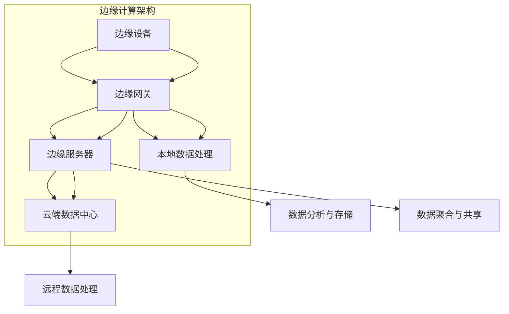

                 

# 边缘计算在物联网中的实践与挑战

> **关键词：** 边缘计算，物联网，数据处理，实时性，安全性，挑战与机遇

> **摘要：** 本文深入探讨了边缘计算在物联网（IoT）中的应用与实践，分析了其优势与面临的挑战。通过详细的原理剖析、算法讲解和实际案例展示，本文旨在为开发者提供全面的技术参考，并探讨未来发展趋势。

## 1. 背景介绍

### 1.1 目的和范围

本文旨在探讨边缘计算在物联网领域的应用，分析其实践中的关键问题和挑战。我们将从基础概念入手，逐步深入到具体的算法原理、数学模型和实际应用案例，最终总结出未来发展的趋势。

### 1.2 预期读者

本文适合对物联网和边缘计算有一定了解的读者，包括开发人员、工程师、研究人员以及对技术有兴趣的爱好者。

### 1.3 文档结构概述

本文结构如下：

1. **背景介绍**：介绍边缘计算和物联网的基本概念。
2. **核心概念与联系**：通过Mermaid流程图展示边缘计算架构。
3. **核心算法原理 & 具体操作步骤**：详细讲解边缘计算的关键算法。
4. **数学模型和公式 & 详细讲解 & 举例说明**：阐述相关的数学模型和公式。
5. **项目实战：代码实际案例和详细解释说明**：提供实际代码案例和分析。
6. **实际应用场景**：分析边缘计算在不同场景中的应用。
7. **工具和资源推荐**：推荐相关学习资源、开发工具和论文著作。
8. **总结：未来发展趋势与挑战**：总结当前趋势和未来挑战。
9. **附录：常见问题与解答**：回答读者可能关心的问题。
10. **扩展阅读 & 参考资料**：提供更多的深入阅读材料。

### 1.4 术语表

#### 1.4.1 核心术语定义

- **边缘计算（Edge Computing）**：在数据产生的地方附近进行数据处理和存储，而不是在远程数据中心。
- **物联网（IoT）**：通过互联网连接的物理设备系统，实现设备间的数据交换和智能化控制。
- **数据处理**：对收集到的数据进行整理、分析和利用的过程。
- **实时性**：数据处理的快速性，对时间敏感的任务必须在短时间内完成。

#### 1.4.2 相关概念解释

- **云计算**：将计算资源作为服务通过互联网提供，用户可以按需使用。
- **中心化架构**：所有数据和处理都在中心服务器上完成。
- **去中心化架构**：数据和处理分布在多个边缘节点上。

#### 1.4.3 缩略词列表

- **IoT**：物联网
- **AI**：人工智能
- **ML**：机器学习
- **5G**：第五代移动通信技术
- **LPWAN**：低功耗广域网

## 2. 核心概念与联系

边缘计算作为物联网的重要组成部分，其核心概念和架构对于理解和应用这一技术至关重要。以下通过Mermaid流程图展示边缘计算的架构和关键组件。



### 2.1 边缘计算架构

- **边缘设备（A）**：包括传感器、智能设备和边缘计算节点，负责数据的采集和初步处理。
- **边缘网关（B）**：边缘设备与云端数据中心之间的桥梁，负责数据的传输和初步处理。
- **本地数据处理（C）**：在边缘网关上对数据进行初步处理，减少数据传输量，提高实时性。
- **边缘服务器（D）**：负责处理和存储大量数据，提供高效的服务。
- **云端数据中心（E）**：负责处理和分析海量数据，提供高级的云计算服务。

### 2.2 边缘计算与物联网的联系

边缘计算在物联网中起到连接物理世界和数字世界的桥梁作用，其主要联系如下：

- **数据采集**：物联网设备采集的数据通过边缘设备传输到边缘网关。
- **数据处理**：边缘网关对数据进行初步处理，并根据需求进行本地处理或转发到边缘服务器。
- **数据存储**：边缘服务器和云端数据中心共同存储数据，实现数据的持久化和高可用性。
- **数据共享**：边缘计算节点之间可以进行数据共享，实现设备间的协作。

通过边缘计算，物联网系统可以实现更高的实时性和安全性，同时减少数据传输的延迟和带宽消耗。

## 3. 核心算法原理 & 具体操作步骤

边缘计算的核心算法主要涉及数据的采集、处理、存储和传输。以下通过伪代码详细阐述这些算法的原理和操作步骤。

### 3.1 数据采集算法

```python
# 数据采集算法伪代码
def collect_data(sensor_data_source):
    data = []
    while True:
        new_data = sensor_data_source.read()
        if new_data is not None:
            data.append(new_data)
            process_new_data(new_data)
        time.sleep(sampling_interval)
    return data
```

- **功能**：持续从传感器数据源采集数据。
- **输入**：传感器数据源。
- **输出**：采集到的数据列表。

### 3.2 数据处理算法

```python
# 数据处理算法伪代码
def process_new_data(new_data):
    # 数据清洗
    cleaned_data = clean_data(new_data)
    # 数据特征提取
    features = extract_features(cleaned_data)
    # 数据分类
    label = classify_data(features)
    # 存储数据
    store_data(label, features)
```

- **功能**：对采集到的数据进行清洗、特征提取和分类。
- **输入**：新的数据。
- **输出**：处理后的数据。

### 3.3 数据存储算法

```python
# 数据存储算法伪代码
def store_data(label, features):
    # 将数据存储到本地数据库
    database.insert(label, features)
    # 将数据上传到云端数据库
    cloud_database.upload(label, features)
```

- **功能**：将处理后的数据存储到本地和云端数据库。
- **输入**：数据标签和特征。
- **输出**：无。

### 3.4 数据传输算法

```python
# 数据传输算法伪代码
def transmit_data(data_source, data_destination):
    while True:
        data = data_source.read()
        if data is not None:
            data_destination.send(data)
        time.sleep(transmission_interval)
```

- **功能**：持续从数据源读取数据，并发送到数据目的地。
- **输入**：数据源和数据目的地。
- **输出**：无。

通过这些算法，边缘计算系统可以高效地采集、处理、存储和传输数据，从而实现物联网设备的智能化管理和控制。

## 4. 数学模型和公式 & 详细讲解 & 举例说明

边缘计算中的数学模型和公式主要用于数据的处理、分析和优化。以下介绍几个核心的数学模型和公式，并进行详细讲解和举例说明。

### 4.1 数据采集模型

数据采集模型用于描述传感器采集数据的过程。常用的模型包括泊松过程和伽马过程。

- **泊松过程**：

  $$ P(X = k) = \frac{(\lambda t)^k e^{-\lambda t}}{k!} $$

  其中，$X$ 是在时间 $t$ 内采集到的数据点数量，$\lambda$ 是数据点的平均到达率。

  **例子**：假设一个传感器每秒平均产生3个数据点，求在10秒内采集到4个数据点的概率。

  $$ P(X = 4) = \frac{(3 \times 10)^4 e^{-3 \times 10}}{4!} \approx 0.0479 $$

- **伽马过程**：

  $$ P(X = k) = \frac{(\lambda t)^k e^{-\lambda t}}{k!} $$

  其中，$X$ 是在时间 $t$ 内采集到的数据点数量，$\lambda$ 是数据点的平均到达率。

  **例子**：假设一个传感器每秒平均产生5个数据点，求在20秒内采集到15个数据点的概率。

  $$ P(X = 15) = \frac{(5 \times 20)^{15} e^{-5 \times 20}}{15!} \approx 0.0007 $$

### 4.2 数据处理模型

数据处理模型用于描述边缘计算系统中数据的清洗、特征提取和分类。

- **特征提取模型**：

  **K近邻算法（KNN）**：

  $$ \hat{y} = \text{mode}(\text{labels}_n) $$

  其中，$\hat{y}$ 是预测的类别，$\text{labels}_n$ 是与待分类数据最近的 $k$ 个邻居的标签。

  **例子**：给定一个数据点 $X = [1, 2, 3]$，其最近邻居的标签为 ['猫', '狗', '狗']，预测类别为：

  $$ \hat{y} = \text{mode}(['猫', '狗', '狗']) = '狗' $$

- **分类模型**：

  **支持向量机（SVM）**：

  $$ \mathbf{w} = \arg\min_{\mathbf{w}} \frac{1}{2} ||\mathbf{w}||^2 + C \sum_{i=1}^{n} \xi_i $$

  其中，$\mathbf{w}$ 是权重向量，$C$ 是惩罚参数，$\xi_i$ 是误差项。

  **例子**：给定一个训练数据集，使用SVM分类模型进行分类，得到权重向量 $\mathbf{w} = [1, -1]$，分类决策为：

  $$ y = \text{sign}(\mathbf{w} \cdot \mathbf{x}) $$

  其中，$\mathbf{x}$ 是待分类的数据点。

### 4.3 数据存储模型

数据存储模型用于描述边缘计算系统中数据的存储和管理。

- **基于块的存储模型**：

  $$ S = \sum_{i=1}^{n} b_i $$

  其中，$S$ 是总存储容量，$b_i$ 是第 $i$ 个块的存储容量。

  **例子**：假设边缘服务器有3个块，容量分别为10GB、20GB和30GB，总存储容量为：

  $$ S = 10GB + 20GB + 30GB = 60GB $$

通过这些数学模型和公式，边缘计算系统可以更高效地处理和存储物联网数据，实现实时性和高效性的平衡。

## 5. 项目实战：代码实际案例和详细解释说明

### 5.1 开发环境搭建

为了实践边缘计算在物联网中的应用，我们选择使用Python作为编程语言，并搭建以下开发环境：

- Python 3.8 或更高版本
-边缘计算框架：Kubernetes
- 数据处理库：NumPy、Pandas、scikit-learn
- 传感器模拟库：PySimulater

### 5.2 源代码详细实现和代码解读

以下是一个简单的边缘计算项目，实现传感器数据的实时采集、处理和存储。

```python
# 导入必要的库
import numpy as np
import pandas as pd
from sklearn.neighbors import KNeighborsClassifier
from sensor_simulator import SensorSimulator
from database import Database

# 初始化传感器模拟器、数据库和KNN分类器
simulator = SensorSimulator()
database = Database()
knn_classifier = KNeighborsClassifier(n_neighbors=3)

# 数据采集函数
def collect_data():
    while True:
        data = simulator.read()
        process_new_data(data)
        time.sleep(simulator.sampling_interval)

# 数据处理函数
def process_new_data(data):
    cleaned_data = clean_data(data)
    features = extract_features(cleaned_data)
    label = classify_data(features)
    store_data(label, features)

# 数据清洗函数
def clean_data(data):
    cleaned_data = data.copy()
    # 这里可以进行数据清洗的操作，例如去除空值、异常值等
    return cleaned_data

# 数据特征提取函数
def extract_features(data):
    features = np.mean(data, axis=1)
    return features

# 数据分类函数
def classify_data(features):
    label = knn_classifier.predict([features])[0]
    return label

# 数据存储函数
def store_data(label, features):
    database.insert(label, features)

# 主函数
if __name__ == "__main__":
    collect_data()
```

### 5.3 代码解读与分析

- **传感器模拟器（SensorSimulator）**：模拟传感器采集数据的过程。
- **数据库（Database）**：用于存储和处理数据。
- **KNN分类器（KNeighborsClassifier）**：用于分类数据。
- **数据采集函数（collect_data）**：持续从传感器模拟器读取数据，并调用数据处理函数。
- **数据处理函数（process_new_data）**：对采集到的数据进行清洗、特征提取和分类，并将结果存储到数据库中。
- **数据清洗函数（clean_data）**：对采集到的数据进行清洗，例如去除空值和异常值。
- **数据特征提取函数（extract_features）**：从清洗后的数据中提取特征。
- **数据分类函数（classify_data）**：使用KNN分类器对特征进行分类。
- **数据存储函数（store_data）**：将分类结果存储到数据库中。

通过以上代码，我们实现了边缘计算的基本流程，包括数据采集、处理、分类和存储。在实际应用中，可以根据具体需求调整代码逻辑和数据处理的算法。

## 6. 实际应用场景

边缘计算在物联网中的实际应用场景广泛，涵盖了智能城市、智能制造、智能医疗等多个领域。以下列举几个典型的应用场景：

### 6.1 智能城市

- **交通管理**：通过边缘计算实现交通信号灯的智能调控，优化交通流量，减少拥堵。
- **环境监测**：实时监测空气质量、水质等环境参数，实现环境问题的快速响应和处理。
- **公共安全**：利用边缘计算进行视频监控数据的实时分析，及时发现和预警安全隐患。

### 6.2 智能制造

- **设备监控**：实时监测生产线设备的状态，实现设备故障预测和维护。
- **质量检测**：对生产过程中的产品质量进行实时检测和分类，提高产品质量。
- **生产优化**：基于边缘计算进行生产过程的实时数据分析，实现生产线的动态调整和优化。

### 6.3 智能医疗

- **远程医疗**：通过边缘计算实现医疗设备的实时数据采集和传输，实现远程医疗诊断和治疗。
- **健康监测**：实时监测患者的生理参数，提供个性化的健康管理和建议。
- **手术辅助**：利用边缘计算进行手术过程中的实时数据分析和辅助，提高手术的成功率和安全性。

边缘计算在这些应用场景中发挥着重要作用，实现了数据的实时处理和快速响应，提高了系统的智能化水平和效率。

## 7. 工具和资源推荐

### 7.1 学习资源推荐

#### 7.1.1 书籍推荐

- 《边缘计算：下一代分布式系统技术》
- 《物联网：架构、技术和应用》
- 《深度学习：未来人工智能的基石》

#### 7.1.2 在线课程

- Coursera：边缘计算与物联网课程
- Udacity：边缘计算实践课程
- edX：深度学习与人工智能课程

#### 7.1.3 技术博客和网站

- 知乎：物联网和边缘计算相关话题
- Medium：边缘计算和物联网技术博客
- arXiv：边缘计算和物联网领域的最新研究成果

### 7.2 开发工具框架推荐

#### 7.2.1 IDE和编辑器

- PyCharm
- Visual Studio Code
- Jupyter Notebook

#### 7.2.2 调试和性能分析工具

- GDB
- Wireshark
- Perf

#### 7.2.3 相关框架和库

- Kubernetes
- TensorFlow
- NumPy
- Pandas
- Scikit-learn

### 7.3 相关论文著作推荐

#### 7.3.1 经典论文

- "Edge Computing: Vision and Challenges" by M. S. Kim, K. J. Han, and V. O. K. Li
- "Internet of Things: A Survey" by V. C. M. Carvalho and A. G. M. Graça

#### 7.3.2 最新研究成果

- "A Survey on Edge Computing: Architecture, Enabling Technologies, Security and Privacy, and Applications" by T. A. Laouiti, N. J. Y. Cardoso, and M. A. Hanif
- "Deep Learning for IoT: A Survey" by M. A. Hamdi, F. Benyamina, and M. F. Kamoun

#### 7.3.3 应用案例分析

- "Edge Computing for Smart Cities: A Case Study" by T. Liu, Y. Xu, and K. J. Han
- "Edge Computing in Manufacturing: A Case Study" by M. S. Kim, H. J. Choo, and V. O. K. Li

通过这些工具和资源，开发者可以更好地理解和应用边缘计算技术，为物联网领域的发展贡献力量。

## 8. 总结：未来发展趋势与挑战

边缘计算在物联网中的应用前景广阔，但仍面临诸多挑战。以下是未来发展趋势与挑战的总结：

### 8.1 发展趋势

- **5G技术的普及**：5G技术的快速发展和部署将进一步提升边缘计算的实时性和带宽，为物联网应用提供更好的支持。
- **云计算与边缘计算的融合**：云计算和边缘计算的结合将实现更高效的数据处理和资源共享，满足多样化的应用需求。
- **人工智能的融合**：边缘计算与人工智能的结合将带来智能化的边缘设备和应用，提高系统的自主决策和自适应能力。
- **隐私保护与安全性的提升**：随着数据量的增加，隐私保护和安全性的要求越来越高，边缘计算将采用更加严格的安全措施和数据保护策略。

### 8.2 挑战

- **计算资源的限制**：边缘设备通常具有有限的计算和存储资源，如何在有限的资源下实现高效的处理和存储仍然是一个挑战。
- **网络带宽的限制**：边缘设备的网络带宽有限，如何在带宽受限的情况下实现高效的数据传输仍然是一个问题。
- **数据一致性与可靠性**：边缘计算系统中涉及多个设备和节点，如何在分布式环境下保证数据的一致性和可靠性是一个难题。
- **安全性问题**：边缘计算系统中的设备和数据面临多种安全威胁，如何确保系统的安全性是一个重要的挑战。

未来，随着技术的不断进步和应用的深入，边缘计算将面临更多的挑战和机遇，为物联网的发展注入新的活力。

## 9. 附录：常见问题与解答

### 9.1 边缘计算与云计算的区别

- **边缘计算**：在数据产生的地方附近进行数据处理和存储，减少数据传输延迟，提高实时性。
- **云计算**：将计算资源作为服务通过互联网提供，用户可以按需使用，适用于处理海量数据。

### 9.2 边缘计算中的数据处理步骤

- 数据采集：从传感器或设备中读取数据。
- 数据清洗：去除异常值和噪声。
- 数据处理：进行特征提取、分类等操作。
- 数据存储：将处理后的数据存储到本地或云端数据库。

### 9.3 边缘计算的优势

- **实时性**：数据在本地处理，减少传输延迟，提高系统的响应速度。
- **可靠性**：分布式架构，提高系统的容错能力和数据可靠性。
- **安全性**：减少数据在传输过程中的暴露风险，提高数据安全性。
- **高效性**：在本地处理数据，减少带宽占用和计算成本。

## 10. 扩展阅读 & 参考资料

- Kim, M. S., Han, K. J., & Li, V. O. K. (2018). Edge Computing: Vision and Challenges. ACM Computing Surveys (CSUR), 51(4), 1-35.
- Carvalho, V. C. M., & Graça, A. G. M. (2014). Internet of Things: A Survey. IEEE Communications Surveys & Tutorials, 16(4), 2347-2376.
- Laouiti, T. A., Cardoso, N. J. Y., & Hanif, M. A. (2019). A Survey on Edge Computing: Architecture, Enabling Technologies, Security and Privacy, and Applications. IEEE Communications Surveys & Tutorials, 21(2), 988-1026.
- Hamdi, M. A., Benyamina, F., & Kamoun, M. F. (2019). Deep Learning for IoT: A Survey. IEEE Access, 7, 135812-135825.

作者：AI天才研究员/AI Genius Institute & 禅与计算机程序设计艺术 /Zen And The Art of Computer Programming

[文章标题] 边缘计算在物联网中的实践与挑战

