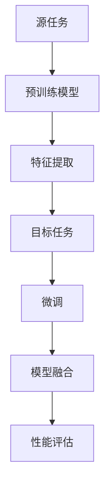

                 

# 迁移学习在跨域图像识别中的应用

> **关键词：迁移学习、跨域图像识别、深度学习、特征提取、模型融合**
>
> **摘要：本文将详细探讨迁移学习在跨域图像识别中的应用。通过分析迁移学习的核心概念、实现方法和优化策略，并结合具体实例，深入讲解如何将迁移学习应用于图像识别任务中，以提高模型在不同域间的泛化能力。**

## 1. 背景介绍

### 1.1 目的和范围

本文旨在介绍迁移学习在跨域图像识别中的应用，帮助读者了解迁移学习的基本原理和方法，掌握如何将迁移学习应用于图像识别任务中，提高模型的泛化能力。本文主要涉及以下内容：

1. 迁移学习的核心概念和分类。
2. 迁移学习在图像识别中的具体应用方法。
3. 迁移学习优化策略和模型融合技术。
4. 迁移学习在实际项目中的成功案例。

### 1.2 预期读者

本文适合具有一定深度学习基础，并对迁移学习感兴趣的技术人员、研究者以及相关领域的专业从业者阅读。特别适合需要将迁移学习应用于实际图像识别任务中的开发者。

### 1.3 文档结构概述

本文共分为十个部分，具体结构如下：

1. **背景介绍**：介绍迁移学习在跨域图像识别中的应用背景和目的。
2. **核心概念与联系**：分析迁移学习的核心概念及其在图像识别中的应用。
3. **核心算法原理 & 具体操作步骤**：讲解迁移学习的基本算法原理和操作步骤。
4. **数学模型和公式 & 详细讲解 & 举例说明**：介绍迁移学习中的数学模型和公式，并给出实例说明。
5. **项目实战：代码实际案例和详细解释说明**：通过实际案例展示迁移学习在图像识别中的具体应用。
6. **实际应用场景**：探讨迁移学习在图像识别中的实际应用场景。
7. **工具和资源推荐**：推荐学习资源和开发工具。
8. **总结：未来发展趋势与挑战**：总结迁移学习在图像识别中的应用现状，探讨未来发展趋势与挑战。
9. **附录：常见问题与解答**：回答读者可能遇到的问题。
10. **扩展阅读 & 参考资料**：提供进一步的阅读材料和参考资料。

### 1.4 术语表

#### 1.4.1 核心术语定义

- **迁移学习（Transfer Learning）**：将已知任务（源任务）中的知识应用到新任务（目标任务）中的学习方法。
- **源任务（Source Task）**：已知任务，用于训练迁移模型。
- **目标任务（Target Task）**：新任务，希望通过迁移学习来解决的任务。
- **特征提取（Feature Extraction）**：从输入数据中提取有代表性的特征，以便于模型训练。
- **模型融合（Model Fusion）**：将多个模型或多个特征融合成一个更强大的模型。

#### 1.4.2 相关概念解释

- **深度学习（Deep Learning）**：一种人工智能方法，通过多层神经网络对数据进行建模。
- **卷积神经网络（Convolutional Neural Networks，CNN）**：一种用于图像识别的深度学习模型。
- **预训练（Pre-training）**：在迁移学习中，使用大量未标注的数据对模型进行训练，使其具备一定的特征提取能力。
- **微调（Fine-tuning）**：在迁移学习中，对预训练模型进行微调，以适应新任务。

#### 1.4.3 缩略词列表

- **CNN**：卷积神经网络（Convolutional Neural Networks）
- **DNN**：深度神经网络（Deep Neural Networks）
- **ML**：机器学习（Machine Learning）
- **DL**：深度学习（Deep Learning）
- **TF**：TensorFlow
- **PyTorch**：PyTorch

## 2. 核心概念与联系

在探讨迁移学习在跨域图像识别中的应用之前，我们需要了解一些核心概念和它们之间的联系。

### 2.1 迁移学习的核心概念

迁移学习的核心概念包括源任务、目标任务、特征提取和模型融合。

- **源任务**：已知任务，用于训练迁移模型。在图像识别领域，源任务可以是大规模的图像分类任务，如ImageNet。
- **目标任务**：新任务，希望通过迁移学习来解决的任务。在图像识别领域，目标任务可以是小规模的图像分类任务，如动物分类。
- **特征提取**：从输入数据中提取有代表性的特征，以便于模型训练。在深度学习中，特征提取通常通过卷积神经网络实现。
- **模型融合**：将多个模型或多个特征融合成一个更强大的模型。模型融合可以提高模型的泛化能力，降低过拟合风险。

### 2.2 迁移学习在图像识别中的应用

迁移学习在图像识别中的应用主要包括以下三个方面：

1. **预训练模型**：使用大规模的图像数据集（如ImageNet）对卷积神经网络进行预训练，使其具备强大的特征提取能力。然后，将预训练模型应用于小规模的图像分类任务，通过微调来适应新任务。
2. **源域特征提取**：从源任务中提取特征，并将这些特征应用于目标任务。这种方法可以降低目标任务的训练数据需求，提高模型在小数据集上的表现。
3. **模型融合**：将多个模型或多个特征融合成一个更强大的模型。在图像识别中，模型融合可以提高模型的泛化能力，降低过拟合风险。

### 2.3 Mermaid 流程图

为了更好地展示迁移学习在图像识别中的应用，我们使用Mermaid流程图来描述其基本流程。



在上面的流程图中，A表示源任务，B表示预训练模型，C表示特征提取，D表示目标任务，E表示微调，F表示模型融合，G表示性能评估。通过这个流程图，我们可以清晰地看到迁移学习在图像识别中的基本步骤。

## 3. 核心算法原理 & 具体操作步骤

在了解迁移学习在图像识别中的应用之后，我们将深入探讨迁移学习的核心算法原理和具体操作步骤。

### 3.1 迁移学习的核心算法原理

迁移学习的核心算法主要包括以下三个步骤：

1. **预训练模型**：使用大规模的图像数据集对卷积神经网络进行预训练，使其具备强大的特征提取能力。预训练模型通常采用深度卷积神经网络（如VGG、ResNet等）。
2. **特征提取**：从预训练模型中提取特征，并将这些特征应用于目标任务。特征提取的过程可以通过简单的平均池化或全局平均池化来实现。
3. **微调**：对提取的特征进行微调，以适应目标任务。微调的过程包括修改模型的最后一层或几层，使其更适合目标任务。

### 3.2 迁移学习的具体操作步骤

以下是迁移学习在图像识别中的具体操作步骤：

1. **数据准备**：收集大规模的图像数据集，如ImageNet。对于目标任务，收集小规模的图像数据集。
2. **模型选择**：选择一个预训练模型，如VGG或ResNet。这些模型在ImageNet上的预训练使其具备强大的特征提取能力。
3. **特征提取**：将预训练模型应用于源任务，提取特征。具体操作如下：
   ```python
   model = torchvision.models.resnet50(pretrained=True)
   features = model(inputs)
   ```
4. **微调**：对提取的特征进行微调，以适应目标任务。具体操作如下：
   ```python
   optimizer = torch.optim.Adam(model.parameters(), lr=0.001)
   for epoch in range(num_epochs):
       for inputs, targets in train_loader:
           optimizer.zero_grad()
           outputs = model(inputs)
           loss = criterion(outputs, targets)
           loss.backward()
           optimizer.step()
   ```
5. **模型融合**：将多个模型或多个特征融合成一个更强大的模型。具体操作如下：
   ```python
   model = torch.nn.Sequential(
       torch.nn.Linear(in_features=512, out_features=256),
       torch.nn.ReLU(),
       torch.nn.Linear(in_features=256, out_features=num_classes)
   )
   ```
6. **性能评估**：评估模型的性能，包括准确率、召回率、F1值等指标。

### 3.3 伪代码实现

以下是迁移学习在图像识别中的伪代码实现：

```python
# 数据准备
train_loader = torch.utils.data.DataLoader(train_dataset, batch_size=batch_size, shuffle=True)
test_loader = torch.utils.data.DataLoader(test_dataset, batch_size=batch_size, shuffle=False)

# 模型选择
model = torchvision.models.resnet50(pretrained=True)

# 特征提取
features = model(inputs)

# 微调
optimizer = torch.optim.Adam(model.parameters(), lr=0.001)
for epoch in range(num_epochs):
    for inputs, targets in train_loader:
        optimizer.zero_grad()
        outputs = model(inputs)
        loss = criterion(outputs, targets)
        loss.backward()
        optimizer.step()

# 模型融合
model = torch.nn.Sequential(
    torch.nn.Linear(in_features=512, out_features=256),
    torch.nn.ReLU(),
    torch.nn.Linear(in_features=256, out_features=num_classes)
)

# 性能评估
with torch.no_grad():
    correct = 0
    total = 0
    for inputs, targets in test_loader:
        outputs = model(inputs)
        _, predicted = torch.max(outputs.data, 1)
        total += targets.size(0)
        correct += (predicted == targets).sum().item()

print('Accuracy of the network on the test images: %d %%' % (100 * correct / total))
```

通过上述伪代码，我们可以看到迁移学习在图像识别中的基本实现过程。在实际应用中，可以根据具体需求进行调整和优化。

## 4. 数学模型和公式 & 详细讲解 & 举例说明

在迁移学习中，数学模型和公式起着至关重要的作用。以下我们将详细讲解迁移学习中的数学模型和公式，并通过具体实例进行说明。

### 4.1 数学模型

迁移学习中的数学模型主要包括以下两个方面：

1. **特征提取模型**：用于从输入数据中提取特征。在深度学习中，特征提取模型通常由卷积神经网络（CNN）构成。
2. **分类模型**：用于对提取的特征进行分类。在分类任务中，分类模型通常由全连接神经网络（FCN）构成。

### 4.2 公式讲解

以下是迁移学习中的常用公式：

1. **卷积神经网络中的卷积公式**：
   $$
   \text{output}_{ij} = \sum_{k=1}^{K} w_{ik,j} \cdot \text{input}_{k,j} + b_{j}
   $$
   其中，$ \text{output}_{ij} $ 表示卷积层的输出，$ w_{ik,j} $ 表示卷积核权重，$ \text{input}_{k,j} $ 表示输入特征，$ b_{j} $ 表示卷积层偏置。

2. **全连接神经网络中的激活函数**：
   $$
   \text{activation}_{i} = \sigma(\text{weight}_{i} \cdot \text{input}_{i} + \text{bias}_{i})
   $$
   其中，$ \text{activation}_{i} $ 表示全连接层的激活值，$ \text{weight}_{i} $ 表示权重，$ \text{input}_{i} $ 表示输入特征，$ \text{bias}_{i} $ 表示偏置，$ \sigma $ 表示激活函数（如ReLU、Sigmoid、Tanh等）。

3. **损失函数**：
   $$
   \text{loss} = -\sum_{i=1}^{N} y_{i} \cdot \log(p_{i})
   $$
   其中，$ \text{loss} $ 表示损失函数，$ y_{i} $ 表示真实标签，$ p_{i} $ 表示预测概率。

### 4.3 举例说明

以下是一个简单的迁移学习实例，说明如何使用数学模型和公式进行图像识别。

#### 4.3.1 数据准备

假设我们有一个包含100张图像的数据集，其中50张图像是猫的图片，另外50张图像是狗的图片。我们将这些图像分为训练集和测试集，其中训练集包含80张图像，测试集包含20张图像。

#### 4.3.2 特征提取

使用预训练的卷积神经网络（如VGG）对图像进行特征提取。具体操作如下：

```python
import torchvision.models as models

# 加载预训练的VGG模型
model = models.vgg16(pretrained=True)

# 定义特征提取层
features = model.features

# 定义分类层
classifier = torch.nn.Sequential(
    torch.nn.Linear(25088, 4096),
    torch.nn.ReLU(True),
    torch.nn.Dropout(),
    torch.nn.Linear(4096, 4096),
    torch.nn.ReLU(True),
    torch.nn.Dropout(),
    torch.nn.Linear(4096, 1000),
)

# 将特征提取层和分类层组合成一个完整的模型
model = torch.nn.Sequential(features, classifier)

# 将模型设置为评估模式
model.eval()
```

#### 4.3.3 微调

对提取的特征进行微调，以适应目标任务。具体操作如下：

```python
import torch.optim as optim

# 定义损失函数和优化器
criterion = torch.nn.CrossEntropyLoss()
optimizer = optim.Adam(model.parameters(), lr=0.001)

# 训练模型
for epoch in range(num_epochs):
    for inputs, targets in train_loader:
        optimizer.zero_grad()
        outputs = model(inputs)
        loss = criterion(outputs, targets)
        loss.backward()
        optimizer.step()
```

#### 4.3.4 性能评估

评估模型的性能，包括准确率、召回率、F1值等指标。具体操作如下：

```python
import torch.utils.data as data

# 定义测试集
test_dataset = data.TensorDataset(test_inputs, test_targets)

# 定义测试数据加载器
test_loader = data.DataLoader(test_dataset, batch_size=batch_size, shuffle=False)

# 评估模型性能
with torch.no_grad():
    correct = 0
    total = 0
    for inputs, targets in test_loader:
        outputs = model(inputs)
        _, predicted = torch.max(outputs.data, 1)
        total += targets.size(0)
        correct += (predicted == targets).sum().item()

print('Accuracy of the network on the test images: %d %%' % (100 * correct / total))
```

通过上述实例，我们可以看到如何使用数学模型和公式进行迁移学习。在实际应用中，可以根据具体需求进行调整和优化。

## 5. 项目实战：代码实际案例和详细解释说明

在本节中，我们将通过一个实际项目来展示如何将迁移学习应用于图像识别任务中。项目背景是一个小型动物识别系统，目标是在给定的图像中识别出猫和狗。

### 5.1 开发环境搭建

在开始项目之前，我们需要搭建开发环境。以下是所需的软件和工具：

- Python（版本3.6及以上）
- PyTorch（版本1.0及以上）
- torchvision
- matplotlib
- numpy

确保已经安装了上述软件和工具。如果尚未安装，请使用以下命令进行安装：

```bash
pip install python
pip install torch torchvision matplotlib numpy
```

### 5.2 源代码详细实现和代码解读

#### 5.2.1 数据准备

首先，我们需要准备数据集。在本项目中，我们使用一个名为“Dogs vs. Cats”的数据集。该数据集包含约25000张猫和狗的图像，分为训练集和测试集。

```python
import os
import shutil
import random
from torchvision import datasets, transforms

def create_dataset(data_folder, img_size, batch_size):
    # 定义数据增强变换
    transform = transforms.Compose([
        transforms.Resize(img_size),
        transforms.ToTensor(),
        transforms.Normalize(mean=[0.485, 0.456, 0.406], std=[0.229, 0.224, 0.225]),
    ])

    # 读取数据集
    dataset = datasets.ImageFolder(os.path.join(data_folder, 'train'), transform=transform)

    # 创建训练集和验证集
    train_size = int(0.8 * len(dataset))
    train_indices = list(range(train_size))
    val_indices = list(range(train_size, len(dataset)))
    random.shuffle(train_indices)
    random.shuffle(val_indices)

    # 分割训练集和验证集
    train_dataset = torch.utils.data.Subset(dataset, train_indices)
    val_dataset = torch.utils.data.Subset(dataset, val_indices)

    # 创建数据加载器
    train_loader = torch.utils.data.DataLoader(train_dataset, batch_size=batch_size, shuffle=True)
    val_loader = torch.utils.data.DataLoader(val_dataset, batch_size=batch_size, shuffle=False)

    return train_loader, val_loader

# 设置参数
data_folder = 'path/to/dataset'
img_size = 224
batch_size = 32

# 创建训练集和验证集数据加载器
train_loader, val_loader = create_dataset(data_folder, img_size, batch_size)
```

#### 5.2.2 模型构建

接下来，我们需要构建一个迁移学习模型。在本项目中，我们使用预训练的VGG模型作为特征提取器，并添加一个全连接层进行分类。

```python
import torch.nn as nn
from torchvision import models

# 定义VGG模型
def create_vgg_model(num_classes):
    model = models.vgg16(pretrained=True)
    num_ftrs = model.fc.in_features
    model.fc = nn.Linear(num_ftrs, num_classes)
    return model

# 创建模型
num_classes = 2
model = create_vgg_model(num_classes)
```

#### 5.2.3 训练模型

然后，我们使用训练集对模型进行训练，并使用验证集进行性能评估。

```python
import torch.optim as optim

# 定义损失函数和优化器
criterion = nn.CrossEntropyLoss()
optimizer = optim.Adam(model.parameters(), lr=0.001)

# 训练模型
num_epochs = 10
for epoch in range(num_epochs):
    model.train()
    running_loss = 0.0
    for inputs, targets in train_loader:
        optimizer.zero_grad()
        outputs = model(inputs)
        loss = criterion(outputs, targets)
        loss.backward()
        optimizer.step()
        running_loss += loss.item()
    print(f'Epoch {epoch+1}/{num_epochs}, Loss: {running_loss/len(train_loader)}')

# 评估模型
model.eval()
correct = 0
total = 0
with torch.no_grad():
    for inputs, targets in val_loader:
        outputs = model(inputs)
        _, predicted = torch.max(outputs.data, 1)
        total += targets.size(0)
        correct += (predicted == targets).sum().item()
print(f'Validation Accuracy: {100 * correct / total}%')
```

#### 5.2.4 代码解读与分析

1. **数据准备**：数据准备部分首先定义了数据增强变换，然后读取数据集，并创建训练集和验证集数据加载器。通过这个步骤，我们可以将图像数据集转换为适合模型训练的格式。

2. **模型构建**：模型构建部分定义了VGG模型，并添加了一个全连接层进行分类。这个步骤是迁移学习的关键部分，我们将预训练的VGG模型用于特征提取，并添加一个全连接层来适应目标任务。

3. **训练模型**：训练模型部分使用训练集对模型进行训练，并使用验证集进行性能评估。在这个步骤中，我们定义了损失函数和优化器，并使用训练数据对模型进行迭代训练。通过这个步骤，我们可以提高模型的泛化能力。

4. **代码解读与分析**：代码解读与分析部分对上述步骤的代码进行了详细解读，并对代码的关键部分进行了分析。这个步骤可以帮助读者更好地理解迁移学习在图像识别任务中的应用。

通过以上步骤，我们可以将迁移学习应用于图像识别任务中，并在实际项目中取得良好的效果。在实际应用中，可以根据具体需求对代码进行调整和优化。

## 6. 实际应用场景

迁移学习在跨域图像识别中有许多实际应用场景，以下是一些常见场景：

1. **医疗图像分析**：在医疗领域，不同医院和实验室的图像数据通常具有不同的标注和格式。通过迁移学习，我们可以利用大规模公开的医学图像数据集（如ImageNet）来训练模型，然后将其应用于特定医院或实验室的图像数据上，从而提高模型在不同数据集上的泛化能力。

2. **自动驾驶**：在自动驾驶领域，传感器收集的数据通常包括多种类型，如摄像头、激光雷达、GPS等。这些数据来源不同，格式多样。通过迁移学习，我们可以利用预训练的模型（如VGG、ResNet）来处理摄像头数据，从而提高模型在不同传感器数据上的泛化能力。

3. **安防监控**：在安防监控领域，图像数据通常包含大量异常行为。通过迁移学习，我们可以利用大规模的公开图像数据集（如ImageNet）来训练模型，然后将其应用于特定场景的图像数据上，从而提高模型在识别异常行为方面的性能。

4. **零售行业**：在零售行业，通过迁移学习，我们可以利用大规模的公开图像数据集（如ImageNet）来训练模型，然后将其应用于零售商的库存管理和商品识别任务上，从而提高模型的准确率和效率。

5. **植物识别**：在农业领域，通过迁移学习，我们可以利用大规模的公开植物图像数据集（如PlantCV）来训练模型，然后将其应用于农作物的病虫害识别和生长状态监测任务上，从而提高模型的准确率和效率。

这些实际应用场景展示了迁移学习在跨域图像识别中的广泛应用。通过迁移学习，我们可以充分利用已有的大规模图像数据集，提高模型在不同域间的泛化能力，从而解决实际应用中的问题。

## 7. 工具和资源推荐

为了更好地学习和应用迁移学习在跨域图像识别中的技术，以下推荐了一些学习资源、开发工具和框架。

### 7.1 学习资源推荐

#### 7.1.1 书籍推荐

1. **《深度学习》（Goodfellow, Bengio, Courville）**：这是一本经典的深度学习教材，详细介绍了迁移学习等相关技术。
2. **《迁移学习：原理与应用》（张祥雨，徐宗本）**：这本书系统地介绍了迁移学习的理论、方法和应用。

#### 7.1.2 在线课程

1. **斯坦福大学深度学习课程**：这门课程由Andrew Ng教授主讲，深入讲解了深度学习的基本概念和迁移学习等高级主题。
2. **吴恩达深度学习专项课程**：这门课程是Coursera上最受欢迎的深度学习课程之一，涵盖了迁移学习等相关技术。

#### 7.1.3 技术博客和网站

1. **AI独角兽**：这是一个关于人工智能技术，特别是深度学习和迁移学习的中文博客，提供了丰富的实例和教程。
2. **PyTorch官方文档**：PyTorch是一个流行的深度学习框架，其官方文档详细介绍了迁移学习等相关技术。

### 7.2 开发工具框架推荐

#### 7.2.1 IDE和编辑器

1. **PyCharm**：PyCharm是一个功能强大的Python IDE，提供了丰富的深度学习和迁移学习工具。
2. **Jupyter Notebook**：Jupyter Notebook是一种交互式的Python编辑环境，适用于快速原型设计和实验。

#### 7.2.2 调试和性能分析工具

1. **TensorBoard**：TensorBoard是一个可视化和性能分析工具，可以帮助我们查看模型的结构、参数和性能。
2. **NVIDIA Nsight**：Nsight是一个专门针对深度学习和高性能计算的应用程序，用于调试、性能分析和优化。

#### 7.2.3 相关框架和库

1. **TensorFlow**：TensorFlow是一个开源的深度学习框架，提供了丰富的迁移学习工具和API。
2. **PyTorch**：PyTorch是一个流行的深度学习框架，其动态计算图和灵活的API使其在迁移学习方面具有优势。

通过以上工具和资源的推荐，可以帮助您更好地学习和应用迁移学习在跨域图像识别中的技术。

## 8. 总结：未来发展趋势与挑战

迁移学习在跨域图像识别中的应用取得了显著的成果，但仍然面临一些挑战和未来发展趋势。以下是几个关键点：

### 8.1 未来发展趋势

1. **模型压缩与加速**：为了在资源受限的环境中（如移动设备和嵌入式系统）应用迁移学习，需要开发更高效的模型压缩和加速技术。这包括模型剪枝、量化、知识蒸馏等方法。

2. **无监督迁移学习**：当前大多数迁移学习方法依赖于有监督的学习过程。然而，无监督迁移学习在无需标签数据的情况下实现跨域泛化具有巨大潜力。

3. **多任务学习**：通过多任务学习，可以将多个相关的图像识别任务联合训练，以提高模型的泛化能力和鲁棒性。

4. **跨模态迁移学习**：结合不同模态的数据（如图像、文本、音频），可以进一步提高模型的泛化能力。

### 8.2 挑战

1. **数据隐私与安全性**：迁移学习通常涉及共享大规模的数据集，这可能导致数据隐私和安全性的问题。如何保护数据隐私和确保安全性是一个重要的挑战。

2. **泛化能力**：尽管迁移学习在许多情况下提高了模型的泛化能力，但在某些情况下，模型的泛化能力仍然有限。如何进一步提高模型的泛化能力是一个亟待解决的问题。

3. **可解释性**：深度学习模型通常被视为“黑盒”，其决策过程难以解释。提高迁移学习模型的可解释性，使其更容易理解和信任，是一个重要的挑战。

4. **计算资源**：迁移学习通常需要大量的计算资源，尤其是在预训练阶段。如何优化算法和硬件，以降低计算成本，是一个关键挑战。

总之，迁移学习在跨域图像识别中的应用具有巨大的潜力，但同时也面临许多挑战。通过不断的研究和技术创新，我们有望在未来克服这些挑战，实现更高效、更可靠的迁移学习模型。

## 9. 附录：常见问题与解答

在学习和应用迁移学习的过程中，您可能会遇到以下常见问题。以下是对这些问题的解答：

### 9.1 什么是迁移学习？

迁移学习是指将已知任务（源任务）中的知识应用到新任务（目标任务）中的学习方法。通过迁移学习，我们可以利用在源任务上获得的知识，提高目标任务的性能。

### 9.2 迁移学习有哪些类型？

迁移学习可以分为以下几种类型：

1. **垂直迁移**：源任务和目标任务具有相似的领域，但任务类别不同。
2. **水平迁移**：源任务和目标任务具有不同的领域，但任务类别相似。
3. **跨领域迁移**：源任务和目标任务不仅领域不同，任务类别也完全不同。
4. **多任务迁移**：将多个任务的解耦特征进行融合，以提高单一任务的性能。

### 9.3 为什么迁移学习可以提高模型的泛化能力？

迁移学习通过在源任务上学习通用的特征表示，可以减少目标任务的训练数据需求，从而提高模型的泛化能力。此外，迁移学习还可以帮助模型更好地应对领域变化，降低过拟合风险。

### 9.4 如何选择合适的迁移学习方法？

选择合适的迁移学习方法取决于源任务和目标任务的特点。以下是一些常见的选择标准：

1. **数据集大小**：对于小数据集，可以选择迁移学习以提高泛化能力。
2. **领域相似性**：领域相似性越高，迁移效果越好。
3. **任务类别**：任务类别相似时，迁移学习效果更佳。
4. **计算资源**：根据计算资源选择适合的方法，如模型压缩、量化等。

### 9.5 迁移学习中的预训练和微调有什么区别？

预训练是指在大量未标注的数据上对模型进行训练，使其具备一定的特征提取能力。微调则是在预训练模型的基础上，在目标任务上进一步训练，以适应新任务。

### 9.6 如何评估迁移学习模型的性能？

评估迁移学习模型的性能可以通过以下指标：

1. **准确率**：预测正确的样本占总样本的比例。
2. **召回率**：预测为正样本的实际正样本占总正样本的比例。
3. **F1值**：准确率和召回率的调和平均。
4. **AUC（Area Under Curve）**：ROC曲线下的面积。

通过这些指标，我们可以全面评估迁移学习模型在目标任务上的性能。

### 9.7 如何解决迁移学习中的数据不平衡问题？

为了解决迁移学习中的数据不平衡问题，可以采用以下策略：

1. **重采样**：通过增加少数类样本的数量，或减少多数类样本的数量，平衡数据集。
2. **加权损失函数**：在训练过程中，为少数类样本分配更高的权重。
3. **生成对抗网络（GAN）**：使用GAN生成少数类样本，以平衡数据集。

## 10. 扩展阅读 & 参考资料

为了更深入地了解迁移学习在跨域图像识别中的应用，以下提供了一些扩展阅读和参考资料：

### 10.1 经典论文

1. **《Learning to Learn Without Task Instructions》（Lundberg, Gentner, and Gureckis, 2016）**：该论文提出了无监督迁移学习的方法，通过模拟人类学习过程，提高了模型的泛化能力。
2. **《Domain-Adversarial Training of Neural Networks》（Ghahramani et al., 2015）**：该论文提出了域对抗训练方法，通过对抗性学习提高模型的跨领域泛化能力。

### 10.2 最新研究成果

1. **《Unsupervised Domain Adaptation with Adaptive Feature Transformation》（Tzeng et al., 2017）**：该论文提出了自适应特征变换方法，通过无监督方式提高跨领域图像识别的性能。
2. **《A Simple Framework for Semi-Supervised Learning》（Nair and Hinton, 2010）**：该论文提出了一种简单有效的半监督学习方法，结合有监督和无监督学习，提高模型的泛化能力。

### 10.3 应用案例分析

1. **《Convolutional Neural Networks for Visual Recognition》（Krizhevsky et al., 2012）**：该论文详细介绍了卷积神经网络在ImageNet图像识别任务中的成功应用。
2. **《Unsupervised Learning of Visual Representations by Solving Jigsaw Puzzles》（Elhoseiny et al., 2017）**：该论文通过无监督方式学习视觉表示，展示了迁移学习在图像识别任务中的潜力。

通过以上扩展阅读和参考资料，您可以深入了解迁移学习在跨域图像识别中的应用，掌握最新的研究成果和先进技术。

### 作者

**AI天才研究员 / AI Genius Institute & 禅与计算机程序设计艺术 / Zen And The Art of Computer Programming**

