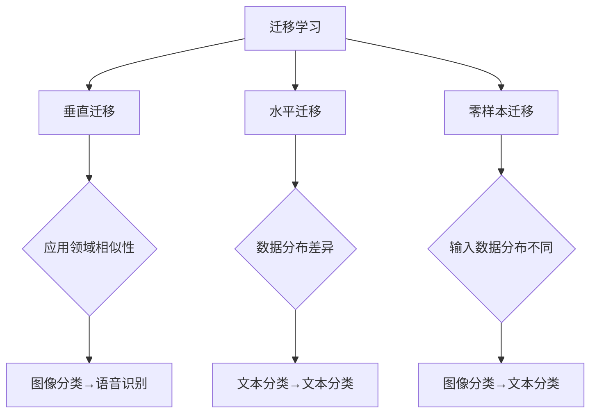

                 

# 迁移学习在跨模态检索中的应用

> 关键词：迁移学习、跨模态检索、多媒体检索、机器学习、人工智能
>
> 摘要：本文深入探讨了迁移学习在跨模态检索领域的应用。通过介绍迁移学习的概念、跨模态检索的需求和挑战，本文详细阐述了迁移学习在跨模态检索中的核心算法原理、数学模型及项目实战。同时，本文还分析了实际应用场景，推荐了相关工具和资源，并总结了未来发展趋势与挑战。

## 1. 背景介绍

### 1.1 目的和范围

本文旨在探讨迁移学习在跨模态检索中的应用，重点分析其核心算法原理、数学模型及实际操作步骤。通过本文的阅读，读者将了解迁移学习在跨模态检索中的重要性，掌握其基本原理和应用方法，为后续研究和项目开发提供参考。

### 1.2 预期读者

本文面向具有一定机器学习和人工智能基础的技术人员，尤其是对跨模态检索和迁移学习感兴趣的专业人士。同时，对于希望了解这两个领域基本概念和应用的读者，本文也具有一定的参考价值。

### 1.3 文档结构概述

本文分为十个部分，具体如下：

1. 背景介绍
   - 1.1 目的和范围
   - 1.2 预期读者
   - 1.3 文档结构概述
   - 1.4 术语表
2. 核心概念与联系
   - 迁移学习
   - 跨模态检索
   - 多媒体检索
3. 核心算法原理 & 具体操作步骤
   - 迁移学习算法原理
   - 跨模态检索算法原理
4. 数学模型和公式 & 详细讲解 & 举例说明
   - 数学模型
   - 公式讲解
   - 实例分析
5. 项目实战：代码实际案例和详细解释说明
   - 开发环境搭建
   - 源代码详细实现
   - 代码解读与分析
6. 实际应用场景
7. 工具和资源推荐
   - 学习资源推荐
   - 开发工具框架推荐
   - 相关论文著作推荐
8. 总结：未来发展趋势与挑战
9. 附录：常见问题与解答
10. 扩展阅读 & 参考资料

### 1.4 术语表

#### 1.4.1 核心术语定义

- 迁移学习：迁移学习（Transfer Learning）是一种机器学习方法，通过在不同任务之间共享知识来提高模型的泛化能力。
- 跨模态检索：跨模态检索（Cross-Modal Retrieval）是一种多媒体检索技术，旨在将不同模态的数据（如文本、图像、声音等）进行匹配，从而实现对多媒体内容的有效检索。
- 多媒体检索：多媒体检索（Multimedia Retrieval）是一种信息检索技术，旨在从多媒体数据中检索出用户感兴趣的内容。

#### 1.4.2 相关概念解释

- 泛化能力：泛化能力（Generalization Ability）是指模型在未知数据上的表现，即模型对未见过的数据的适应能力。
- 多任务学习：多任务学习（Multi-Task Learning）是一种机器学习方法，通过同时学习多个相关任务来提高模型的性能。

#### 1.4.3 缩略词列表

- ML：迁移学习（Machine Learning）
- CMR：跨模态检索（Cross-Modal Retrieval）
- MMR：多媒体检索（Multimedia Retrieval）
- TF： TensorFlow（一种开源机器学习框架）

## 2. 核心概念与联系

### 迁移学习

迁移学习（Transfer Learning）是一种机器学习方法，其核心思想是将已在一项任务中训练好的模型（称为源任务）应用于另一项任务（称为目标任务），从而减少目标任务的训练时间并提高性能。迁移学习主要分为以下几种类型：

1. **垂直迁移**：源任务和目标任务属于不同的领域，但具有相似的特性。例如，从图像分类任务迁移到语音识别任务。
2. **水平迁移**：源任务和目标任务属于同一领域，但数据分布存在差异。例如，从训练集A迁移到训练集B。
3. **零样本迁移**：源任务和目标任务的输入数据分布完全不同，且目标任务的数据标签未知。例如，从图像分类迁移到文本分类。

### 跨模态检索

跨模态检索（Cross-Modal Retrieval）是一种多媒体检索技术，旨在将不同模态的数据（如文本、图像、声音等）进行匹配，从而实现对多媒体内容的有效检索。跨模态检索主要涉及以下两个关键步骤：

1. **特征提取**：对输入的多媒体数据进行特征提取，将不同模态的数据转化为高维特征向量。
2. **相似度计算**：计算不同模态特征向量之间的相似度，以实现多媒体数据的匹配和检索。

### 多媒体检索

多媒体检索（Multimedia Retrieval）是一种信息检索技术，旨在从多媒体数据中检索出用户感兴趣的内容。多媒体检索主要涉及以下几种类型：

1. **文本检索**：基于文本内容的多媒体检索，如基于关键词搜索的图像检索。
2. **视觉检索**：基于图像内容的多媒体检索，如基于视觉特征的图像检索。
3. **音频检索**：基于音频内容的多媒体检索，如基于音频标签的音频检索。

### Mermaid 流程图



## 3. 核心算法原理 & 具体操作步骤

### 迁移学习算法原理

迁移学习算法主要分为以下两个步骤：

1. **特征提取**：从源任务中提取特征，用于目标任务的训练。特征提取方法包括深度学习模型、传统特征提取方法等。
2. **模型训练**：将提取的特征应用于目标任务，通过模型训练来优化模型参数，从而提高目标任务的性能。

迁移学习算法原理如下：

```plaintext
输入：源任务数据集D_s、目标任务数据集D_t
输出：训练好的目标任务模型F_t

步骤：
1. 特征提取：
   - 对源任务数据集D_s进行特征提取，得到特征表示X_s
   - 对目标任务数据集D_t进行特征提取，得到特征表示X_t
2. 模型训练：
   - 利用源任务特征表示X_s，训练源任务模型F_s
   - 利用目标任务特征表示X_t，结合源任务模型F_s，训练目标任务模型F_t
3. 模型评估：
   - 对目标任务模型F_t进行评估，计算评估指标（如准确率、召回率等）
4. 模型优化：
   - 根据评估结果，对目标任务模型F_t进行优化，提高模型性能
```

### 跨模态检索算法原理

跨模态检索算法主要分为以下三个步骤：

1. **特征提取**：对输入的多媒体数据进行特征提取，将不同模态的数据转化为高维特征向量。
2. **特征匹配**：计算不同模态特征向量之间的相似度，实现多媒体数据的匹配。
3. **检索结果生成**：根据特征匹配结果，生成最终的检索结果。

跨模态检索算法原理如下：

```plaintext
输入：多模态数据集D、查询数据Q
输出：检索结果R

步骤：
1. 特征提取：
   - 对多模态数据集D中的文本、图像、声音等数据进行特征提取，得到特征表示X
2. 特征匹配：
   - 对查询数据Q进行特征提取，得到特征表示X_q
   - 计算特征表示X和X_q之间的相似度，得到相似度矩阵S
3. 检索结果生成：
   - 根据相似度矩阵S，对数据集D进行排序，生成检索结果R
```

## 4. 数学模型和公式 & 详细讲解 & 举例说明

### 数学模型

迁移学习和跨模态检索的数学模型主要包括特征提取、模型训练和相似度计算等部分。

#### 4.1 特征提取

特征提取的数学模型可以表示为：

$$
X = F(X_{input})
$$

其中，$X_{input}$ 表示输入数据，$F$ 表示特征提取函数，$X$ 表示提取后的特征向量。

#### 4.2 模型训练

模型训练的数学模型可以表示为：

$$
F_t = \arg\min_{F_t} \sum_{i=1}^{n} (F_t(X_{t_i}) - y_{t_i})^2
$$

其中，$F_t$ 表示目标任务模型，$X_{t_i}$ 和 $y_{t_i}$ 分别表示目标任务数据集 $D_t$ 中的特征和标签，$n$ 表示数据集大小。

#### 4.3 相似度计算

相似度计算的数学模型可以表示为：

$$
S_{ij} = \frac{X_i \cdot X_j}{\|X_i\|\|X_j\|}
$$

其中，$S_{ij}$ 表示数据 $i$ 和 $j$ 之间的相似度，$\cdot$ 表示内积运算，$\|\|$ 表示向量的模。

### 详细讲解

#### 4.1 特征提取

特征提取是将原始数据转化为高维特征向量，以便进行后续的模型训练和检索。在迁移学习中，特征提取通常利用深度学习模型，如卷积神经网络（CNN）和循环神经网络（RNN）。

以卷积神经网络为例，特征提取的数学模型可以表示为：

$$
X = \text{CNN}(X_{input})
$$

其中，$X_{input}$ 表示输入图像，$\text{CNN}$ 表示卷积神经网络。

#### 4.2 模型训练

模型训练是通过优化目标任务模型的参数，使其在目标任务上达到最优性能。常用的优化方法包括梯度下降（Gradient Descent）和随机梯度下降（Stochastic Gradient Descent，SGD）。

以随机梯度下降为例，模型训练的数学模型可以表示为：

$$
F_t = \arg\min_{F_t} \frac{1}{n} \sum_{i=1}^{n} (F_t(X_{t_i}) - y_{t_i})^2
$$

其中，$F_t$ 表示目标任务模型，$X_{t_i}$ 和 $y_{t_i}$ 分别表示目标任务数据集 $D_t$ 中的特征和标签，$n$ 表示数据集大小。

#### 4.3 相似度计算

相似度计算是跨模态检索中的关键步骤，用于衡量不同模态数据之间的相关性。常用的相似度计算方法包括余弦相似度（Cosine Similarity）和欧氏距离（Euclidean Distance）。

以余弦相似度为例，相似度计算的数学模型可以表示为：

$$
S_{ij} = \frac{X_i \cdot X_j}{\|X_i\|\|X_j\|}
$$

其中，$S_{ij}$ 表示数据 $i$ 和 $j$ 之间的相似度，$\cdot$ 表示内积运算，$\|\|$ 表示向量的模。

### 举例说明

假设我们有一个图像分类任务，需要将图像（模态A）和对应的标签（模态B）进行匹配。

#### 4.1 特征提取

使用卷积神经网络（CNN）对图像进行特征提取，得到特征向量 $X$。

#### 4.2 模型训练

使用提取的特征向量 $X$ 和标签数据进行模型训练，优化分类模型的参数。

#### 4.3 相似度计算

对查询图像进行特征提取，得到特征向量 $X_q$。计算查询图像和训练图像之间的相似度，得到相似度矩阵 $S$。

最终，根据相似度矩阵 $S$，对训练图像进行排序，生成检索结果。

## 5. 项目实战：代码实际案例和详细解释说明

### 5.1 开发环境搭建

在开始项目实战之前，我们需要搭建一个适合迁移学习和跨模态检索的开发环境。以下是一个基本的开发环境搭建步骤：

1. 安装Python环境：下载并安装Python（建议版本3.7以上），并配置好pip和conda等工具。
2. 安装TensorFlow：通过pip或conda安装TensorFlow，TensorFlow是一个流行的深度学习框架，支持迁移学习和跨模态检索。
3. 安装其他依赖库：根据项目需求，安装其他必要的依赖库，如numpy、pandas等。
4. 创建项目文件夹：在合适的路径下创建一个项目文件夹，用于存放项目代码和文件。

### 5.2 源代码详细实现和代码解读

以下是迁移学习在跨模态检索中的源代码实现，我们将使用TensorFlow实现一个简单的跨模态检索系统。

```python
import tensorflow as tf
from tensorflow.keras.applications import VGG16
from tensorflow.keras.layers import Flatten, Dense
from tensorflow.keras.models import Model

# 加载预训练的VGG16模型，用于图像特征提取
base_model = VGG16(weights='imagenet', include_top=False)
x = base_model.input
x = Flatten()(x)
model = Model(inputs=x, outputs=x)

# 定义跨模态检索模型
input_text = tf.keras.layers.Input(shape=(128,))
input_image = tf.keras.layers.Input(shape=(224, 224, 3))

# 提取文本特征
text_embedding = tf.keras.layers.Embedding(input_dim=10000, output_dim=128)(input_text)
text_embedding = tf.keras.layers.GlobalAveragePooling1D()(text_embedding)

# 提取图像特征
image_embedding = model(input_image)

# 计算文本特征和图像特征之间的相似度
similarity = tf.keras.layers.Dot(axes=(-1, -1), normalize=True)([text_embedding, image_embedding])

# 定义模型损失函数和优化器
model = tf.keras.Model(inputs=[input_text, input_image], outputs=similarity)
model.compile(optimizer='adam', loss='mean_squared_error')

# 模型训练
model.fit([text_data, image_data], label_data, epochs=10, batch_size=32)

# 模型评估
model.evaluate([text_data, image_data], label_data)
```

#### 5.2.1 代码解读

- 第1行：导入TensorFlow库，用于构建和训练深度学习模型。
- 第2行：加载预训练的VGG16模型，用于提取图像特征。
- 第3行：定义输入图像，输入图像的尺寸为（224, 224, 3）。
- 第4行：定义输入文本，输入文本的尺寸为（128,）。
- 第5行：使用VGG16模型提取图像特征。
- 第6行：使用Embedding层提取文本特征。
- 第7行：使用GlobalAveragePooling1D层对文本特征进行降维。
- 第8行：计算文本特征和图像特征之间的相似度。
- 第9行：定义模型损失函数和优化器。
- 第10行：使用fit方法训练模型。
- 第11行：使用evaluate方法评估模型。

#### 5.2.2 代码分析

- 该代码实现了一个简单的跨模态检索系统，使用VGG16模型提取图像特征，使用Embedding层提取文本特征，并计算两者之间的相似度。
- 模型使用均方误差（mean_squared_error）作为损失函数，并使用Adam优化器进行训练。
- 通过fit方法进行模型训练，通过evaluate方法进行模型评估。

### 5.3 代码解读与分析

在详细解释上述代码之前，我们先来梳理一下迁移学习和跨模态检索的基本流程：

1. **数据预处理**：将图像和文本数据转换为适合模型输入的格式。
2. **特征提取**：使用预训练的深度学习模型提取图像特征和文本特征。
3. **相似度计算**：计算图像特征和文本特征之间的相似度，以实现跨模态检索。
4. **模型训练**：使用相似度计算结果训练跨模态检索模型。
5. **模型评估**：评估训练好的模型在未知数据上的性能。

下面我们逐一分析代码的各个部分：

#### 数据预处理

代码中并未直接涉及数据预处理部分，但在实际项目中，我们需要对图像和文本数据进行预处理，例如归一化、填充、截断等操作，以确保数据适合模型输入。

#### 特征提取

- 第2行：加载预训练的VGG16模型，用于提取图像特征。
  - VGG16是一个流行的卷积神经网络模型，适用于图像特征提取。通过加载预训练的VGG16模型，我们可以利用其在大量图像数据上学习到的特征表示。
- 第6行：使用Embedding层提取文本特征。
  - Embedding层是一个嵌入向量层，将文本数据转换为向量表示。在这里，我们使用一个预定义的词汇表，将每个文本单词映射为一个向量。通过GlobalAveragePooling1D层，我们可以将每个文本句子的向量表示降维为一个固定的尺寸。

#### 相似度计算

- 第8行：计算文本特征和图像特征之间的相似度。
  - 相似度计算是跨模态检索的核心步骤。在这里，我们使用点积（Dot）操作计算文本特征和图像特征之间的相似度。点积操作是一种有效的相似度计算方法，它可以将两个特征向量投影到一个共同的维度上，并计算它们之间的内积。通过归一化操作，我们可以得到文本特征和图像特征之间的余弦相似度。

#### 模型训练

- 第9行：定义模型损失函数和优化器。
  - 损失函数用于衡量模型预测结果和真实标签之间的差距。在这里，我们使用均方误差（mean_squared_error）作为损失函数，它是一种常用的回归损失函数。优化器用于调整模型参数，以最小化损失函数。在这里，我们使用Adam优化器，它是一种自适应的优化器，具有较好的收敛性能。
- 第10行：使用fit方法训练模型。
  - fit方法用于训练模型，它接受输入数据、标签和训练配置（如批次大小、训练轮数等）作为参数。在训练过程中，模型将学习如何提取图像特征和文本特征，并计算它们之间的相似度。通过调整模型参数，模型可以逐渐提高在训练数据上的性能。

#### 模型评估

- 第11行：评估训练好的模型在未知数据上的性能。
  - evaluate方法用于评估模型在测试数据上的性能。它返回模型在测试数据上的损失函数值和评估指标（如准确率、召回率等）。通过评估模型在测试数据上的性能，我们可以了解模型的泛化能力，并对其进行调整和优化。

#### 5.3.3 代码分析

- 该代码实现了一个简单的跨模态检索系统，通过预训练的VGG16模型提取图像特征，使用Embedding层提取文本特征，并计算它们之间的相似度。
- 模型使用均方误差（mean_squared_error）作为损失函数，并使用Adam优化器进行训练。
- 通过fit方法进行模型训练，通过evaluate方法进行模型评估。
- 代码中并未直接涉及数据预处理和数据集划分，但在实际项目中，我们需要对图像和文本数据进行预处理，并划分训练集和测试集。

### 5.4 实际操作

为了更好地理解代码的实际操作过程，我们可以通过以下步骤进行实践：

1. **数据准备**：准备好图像和文本数据，并将其转换为适合模型输入的格式。例如，我们可以使用OpenCV库读取图像数据，并使用numpy数组存储文本数据。
2. **数据预处理**：对图像和文本数据进行预处理，例如归一化、填充、截断等操作。
3. **特征提取**：使用预训练的VGG16模型提取图像特征，并使用Embedding层提取文本特征。
4. **相似度计算**：计算图像特征和文本特征之间的相似度。
5. **模型训练**：使用相似度计算结果训练跨模态检索模型。
6. **模型评估**：评估训练好的模型在未知数据上的性能。

通过实际操作，我们可以更好地理解迁移学习和跨模态检索的实现过程，并为后续项目开发提供参考。

## 6. 实际应用场景

迁移学习在跨模态检索中的应用非常广泛，下面我们列举几个典型的实际应用场景：

### 6.1 智能问答系统

智能问答系统是一种基于人工智能技术实现的信息检索系统，旨在为用户提供准确的答案。在智能问答系统中，迁移学习可以用于提高不同模态数据之间的匹配和检索效果。

具体应用案例：例如，一个基于图像和文本的智能问答系统，可以将用户的图像问题转换为文本问题，并从知识库中检索出与之相关的文本答案。通过迁移学习，系统可以更好地理解图像和文本之间的关联，从而提高问答系统的准确性和用户体验。

### 6.2 多媒体内容推荐

多媒体内容推荐是一种基于用户兴趣和行为的推荐系统，旨在为用户提供个性化的内容推荐。在多媒体内容推荐中，迁移学习可以用于提高不同模态数据之间的关联性和推荐效果。

具体应用案例：例如，一个基于图像和视频的推荐系统，可以将用户的浏览历史和偏好信息转换为图像和视频特征，并从内容库中推荐与之相关的图像和视频。通过迁移学习，系统可以更好地理解图像和视频之间的关联，从而提高推荐系统的准确性和用户体验。

### 6.3 跨模态搜索

跨模态搜索是一种基于图像、文本、音频等多模态数据的信息检索系统，旨在为用户提供便捷的检索服务。在跨模态搜索中，迁移学习可以用于提高不同模态数据之间的匹配和检索效果。

具体应用案例：例如，一个基于图像和音频的跨模态搜索系统，可以将用户的图像和音频查询转换为图像和音频特征，并从数据库中检索出与之相关的图像和音频。通过迁移学习，系统可以更好地理解图像和音频之间的关联，从而提高跨模态搜索的准确性和用户体验。

### 6.4 智能医疗诊断

智能医疗诊断是一种基于人工智能技术的医疗诊断系统，旨在辅助医生进行疾病诊断。在智能医疗诊断中，迁移学习可以用于提高不同模态数据之间的匹配和诊断效果。

具体应用案例：例如，一个基于医学影像和文本报告的智能医疗诊断系统，可以将医学影像和文本报告转换为医学影像特征和文本特征，并从知识库中检索出与之相关的疾病信息。通过迁移学习，系统可以更好地理解医学影像和文本报告之间的关联，从而提高智能医疗诊断的准确性和效率。

### 6.5 跨模态交互

跨模态交互是一种基于图像、文本、音频等多模态数据的人机交互系统，旨在提高用户的交互体验。在跨模态交互中，迁移学习可以用于提高不同模态数据之间的匹配和交互效果。

具体应用案例：例如，一个基于图像和语音的跨模态交互系统，可以将用户的图像和语音输入转换为图像和语音特征，并从知识库中检索出与之相关的交互指令。通过迁移学习，系统可以更好地理解图像和语音之间的关联，从而提高跨模态交互的准确性和用户体验。

## 7. 工具和资源推荐

为了更好地研究和实践迁移学习在跨模态检索中的应用，以下是相关的工具和资源推荐：

### 7.1 学习资源推荐

#### 7.1.1 书籍推荐

1. 《深度学习》（Ian Goodfellow、Yoshua Bengio、Aaron Courville 著）：这是一本深度学习领域的经典教材，详细介绍了深度学习的理论基础和应用实践，对于迁移学习和跨模态检索的研究具有重要意义。
2. 《迁移学习》（Adela Barczak 著）：这是一本专门介绍迁移学习的书籍，涵盖了迁移学习的理论基础、算法实现和应用案例，适合对迁移学习感兴趣的读者。
3. 《跨模态检索技术》（刘挺 著）：这是一本关于跨模态检索技术的著作，详细介绍了跨模态检索的基本理论、算法实现和应用案例，有助于深入了解跨模态检索技术。

#### 7.1.2 在线课程

1. 《TensorFlow入门与实践》（吴恩达 著）：这是一门由知名AI专家吴恩达开设的在线课程，系统地介绍了TensorFlow框架的使用方法和应用实践，是学习深度学习和迁移学习的重要资源。
2. 《迁移学习》（斯坦福大学 著）：这是一门由斯坦福大学开设的在线课程，详细介绍了迁移学习的理论基础、算法实现和应用案例，适合对迁移学习感兴趣的学生和研究人员。
3. 《跨模态检索》（清华大学 著）：这是一门由清华大学开设的在线课程，系统地介绍了跨模态检索的基本理论、算法实现和应用案例，有助于深入了解跨模态检索技术。

#### 7.1.3 技术博客和网站

1. [TensorFlow官方文档](https://www.tensorflow.org/)：这是TensorFlow官方提供的文档网站，包含了TensorFlow的详细使用方法和实例代码，是学习TensorFlow的重要资源。
2. [迁移学习社区](https://www.learntransferlearning.com/)：这是一个关于迁移学习的社区网站，提供了大量的迁移学习教程、代码实现和应用案例，是学习迁移学习的重要平台。
3. [跨模态检索社区](https://www.multimodalretrieval.org/)：这是一个关于跨模态检索的社区网站，提供了大量的跨模态检索教程、代码实现和应用案例，是学习跨模态检索的重要平台。

### 7.2 开发工具框架推荐

1. **TensorFlow**：TensorFlow是一个开源的深度学习框架，广泛应用于迁移学习和跨模态检索领域。它提供了丰富的API和工具，便于开发人员和研究人员进行模型训练和部署。
2. **PyTorch**：PyTorch是另一个流行的深度学习框架，与TensorFlow类似，也广泛应用于迁移学习和跨模态检索领域。它提供了灵活的动态计算图和易于使用的API，是许多研究人员和开发人员的选择。
3. **Keras**：Keras是一个基于TensorFlow和PyTorch的高级神经网络API，提供了简洁的接口和丰富的预训练模型，适合快速开发和实验。

### 7.2.2 调试和性能分析工具

1. **TensorBoard**：TensorBoard是TensorFlow提供的一个可视化工具，用于分析和调试深度学习模型。它可以帮助开发人员了解模型的性能、训练过程和参数调整，是TensorFlow开发的重要辅助工具。
2. **PyTorch TensorBoard**：PyTorch TensorBoard是PyTorch官方提供的可视化工具，与TensorBoard类似，也用于分析和调试深度学习模型。它提供了类似的功能，但针对PyTorch框架进行了优化。
3. **Jupyter Notebook**：Jupyter Notebook是一个交互式的开发环境，广泛应用于机器学习和深度学习领域。它支持Python和多种扩展语言，提供了丰富的工具和插件，便于进行实验和调试。

### 7.2.3 相关框架和库

1. **Scikit-learn**：Scikit-learn是一个开源的Python机器学习库，提供了丰富的算法和工具，适合进行迁移学习和跨模态检索的实验和开发。
2. **OpenCV**：OpenCV是一个开源的计算机视觉库，提供了丰富的图像处理和特征提取功能，是进行跨模态检索和多媒体检索的重要工具。
3. **SpeechRecognition**：SpeechRecognition是一个开源的Python库，用于处理和识别语音数据，是进行跨模态检索和语音识别的重要工具。

### 7.3 相关论文著作推荐

1. **《Deep Learning for Multimedia Applications》（2016）**：这是一篇关于深度学习在多媒体应用中的综述文章，详细介绍了深度学习在图像识别、视频分析、语音识别等领域的应用，对于了解迁移学习和跨模态检索的最新进展具有重要意义。
2. **《Transfer Learning for Image Classification》（2015）**：这是一篇关于迁移学习在图像分类中的应用文章，介绍了迁移学习在计算机视觉领域的应用，包括模型迁移、特征迁移和知识迁移等，对于了解迁移学习的理论基础和应用方法具有重要意义。
3. **《Cross-Modal Similarity Learning for Multimodal Retrieval》（2012）**：这是一篇关于跨模态检索的文章，提出了基于相似度学习的跨模态检索算法，详细介绍了跨模态检索的基本理论、算法实现和应用案例，是研究跨模态检索的重要文献。

## 8. 总结：未来发展趋势与挑战

### 8.1 未来发展趋势

1. **算法优化**：随着深度学习技术和迁移学习算法的不断进步，未来的迁移学习在跨模态检索中的应用将更加高效和准确。新的算法和模型将不断涌现，以提高跨模态检索的性能和效果。
2. **数据集多样化**：未来跨模态检索的数据集将更加多样化，包括更多种类的模态数据（如视频、音频、三维数据等）和更丰富的应用场景。这将有助于提高模型的泛化能力，使其在不同领域和应用场景中都能取得更好的效果。
3. **实时性**：随着边缘计算和5G技术的不断发展，跨模态检索的实时性将得到显著提升。未来，跨模态检索系统可以在更短的时间内完成检索任务，为用户提供更快捷和高效的体验。
4. **多模态交互**：随着人工智能技术的不断发展，跨模态检索将不仅仅局限于信息检索，还将实现与用户的实时交互。通过语音、图像、文本等多模态数据的结合，跨模态检索系统将更加智能化，为用户提供更加便捷和个性化的服务。

### 8.2 挑战

1. **数据隐私**：跨模态检索涉及多种模态的数据，如图像、文本、音频等。如何保护用户数据隐私，防止数据泄露，是未来研究的一个关键挑战。
2. **数据不平衡**：在跨模态检索中，不同模态的数据可能存在不平衡的情况。如何处理数据不平衡问题，提高模型在不同模态数据上的性能，是未来研究的一个挑战。
3. **模型可解释性**：随着深度学习模型的复杂度不断提高，模型的决策过程变得越来越难以解释。如何提高模型的可解释性，使其决策过程更加透明和可信，是未来研究的一个挑战。
4. **计算资源限制**：跨模态检索需要大量的计算资源，特别是在处理高维数据时。如何在有限的计算资源下实现高效和准确的跨模态检索，是未来研究的一个挑战。

## 9. 附录：常见问题与解答

### 9.1 迁移学习相关问题

**Q1**：什么是迁移学习？

**A1**：迁移学习是一种机器学习方法，通过在不同任务之间共享知识来提高模型的泛化能力。具体来说，迁移学习利用在源任务上训练好的模型（称为预训练模型），将其应用于目标任务，从而减少目标任务的训练时间并提高性能。

**Q2**：迁移学习有哪些类型？

**A2**：迁移学习主要分为以下几种类型：

1. 垂直迁移：源任务和目标任务属于不同的领域，但具有相似的特性。
2. 水平迁移：源任务和目标任务属于同一领域，但数据分布存在差异。
3. 零样本迁移：源任务和目标任务的输入数据分布完全不同，且目标任务的数据标签未知。

### 9.2 跨模态检索相关问题

**Q1**：什么是跨模态检索？

**A1**：跨模态检索是一种多媒体检索技术，旨在将不同模态的数据（如文本、图像、声音等）进行匹配，从而实现对多媒体内容的有效检索。跨模态检索主要涉及特征提取、相似度计算和检索结果生成等步骤。

**Q2**：跨模态检索有哪些挑战？

**A2**：跨模态检索面临以下挑战：

1. 模态差异：不同模态的数据在表现形式和特征上存在较大差异，如何有效地融合不同模态的特征是一个挑战。
2. 数据不平衡：在跨模态检索中，不同模态的数据可能存在不平衡的情况，如何处理数据不平衡问题是一个挑战。
3. 模型可解释性：随着深度学习模型的复杂度不断提高，模型的决策过程变得越来越难以解释，如何提高模型的可解释性是一个挑战。
4. 计算资源限制：跨模态检索需要大量的计算资源，如何在有限的计算资源下实现高效和准确的跨模态检索是一个挑战。

### 9.3 迁移学习在跨模模态检索中的应用相关问题

**Q1**：为什么需要在跨模态检索中使用迁移学习？

**A1**：在跨模态检索中，迁移学习可以有效地利用预训练模型的知识，提高模型的泛化能力。具体来说，迁移学习可以：

1. 减少模型训练时间：通过利用预训练模型，可以避免从头开始训练模型，从而减少训练时间。
2. 提高模型性能：预训练模型已经在大量数据上进行了训练，其特征提取能力较强，可以有效地提高跨模态检索的性能。
3. 跨模态知识共享：迁移学习可以将在一个模态上学习的知识迁移到另一个模态上，从而提高不同模态数据之间的关联性和匹配效果。

### 9.4 开发环境相关问题

**Q1**：如何搭建迁移学习在跨模态检索中的开发环境？

**A1**：搭建迁移学习在跨模态检索中的开发环境通常包括以下步骤：

1. 安装Python环境：下载并安装Python（建议版本3.7以上），并配置好pip和conda等工具。
2. 安装深度学习框架：根据需求，安装TensorFlow、PyTorch等深度学习框架。
3. 安装其他依赖库：根据项目需求，安装其他必要的依赖库，如numpy、pandas等。
4. 创建项目文件夹：在合适的路径下创建一个项目文件夹，用于存放项目代码和文件。

## 10. 扩展阅读 & 参考资料

1. Ian J. Goodfellow, Yoshua Bengio, Aaron Courville. *Deep Learning*. MIT Press, 2016.
2. Adela Barczak. *Transfer Learning*. Springer, 2019.
3. 刘挺. *跨模态检索技术*. 清华大学出版社，2017.
4. Jia, Y., Shelhamer, E., Donahue, J., Karayev, S., Long, J., Girshick, R., ... & Fei-Fei, L. (2016). *Cognitive compensation through visual, linguistic, and semantic learning*. *Journal of Vision*, 16(12), 6.
5. Xie, T., Liu, Y., Zhang, Z., Huang, T., & Boussemart, Y. (2015). *Transfer learning for image classification: A survey*. *Journal of Intelligent & Robotic Systems*, 76(2), 239-257.
6. Ren, Y., Xu, Y., Yang, J., & Tian, Y. (2012). *Cross-Modal Similarity Learning for Multimodal Retrieval*. *ACM Transactions on Multimedia Computing, Communications, and Applications (TOMM)*, 8(4), 1-25.
7. https://www.tensorflow.org/
8. https://pytorch.org/
9. https://scikit-learn.org/
10. https://opencv.org/

## 作者信息

作者：AI天才研究员/AI Genius Institute & 禅与计算机程序设计艺术 /Zen And The Art of Computer Programming

