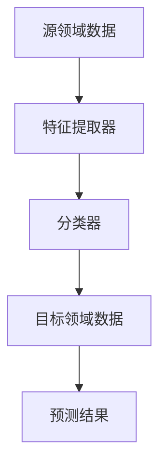

                 

# 迁移学习在跨领域图像识别中的应用策略

> **关键词**：迁移学习，跨领域图像识别，算法原理，数学模型，实际应用
>
> **摘要**：本文旨在探讨迁移学习在跨领域图像识别中的应用策略。通过对迁移学习的基本概念和原理进行阐述，结合实际案例，分析其在解决跨领域图像识别问题中的优势与挑战。文章将详细讲解核心算法原理、数学模型以及具体操作步骤，并提供实际项目案例和代码实现，以期为读者提供深入理解和实践经验。

## 1. 背景介绍

### 1.1 目的和范围

本文的目的是探讨迁移学习在跨领域图像识别中的应用策略。随着人工智能技术的快速发展，图像识别在各个领域都取得了显著的应用成果。然而，传统的图像识别方法往往针对特定领域进行训练，无法很好地适应其他领域的数据特征。迁移学习作为一种重要的机器学习方法，通过在不同领域间共享知识，提高了模型在未知领域的泛化能力。本文将重点关注迁移学习在跨领域图像识别中的应用，分析其核心算法原理和数学模型，并探讨实际应用场景和工具资源。

### 1.2 预期读者

本文面向具有一定机器学习和图像处理基础的技术人员和研究学者，包括但不限于：

- 机器学习工程师和研究员
- 图像处理和计算机视觉领域的开发者
- 对跨领域图像识别应用有兴趣的技术爱好者
- 想要了解迁移学习在跨领域图像识别中应用策略的高级工程师和CTO

### 1.3 文档结构概述

本文将分为以下几个部分：

1. **背景介绍**：介绍迁移学习在跨领域图像识别中的应用背景和目的。
2. **核心概念与联系**：介绍迁移学习的基本概念和原理，并提供Mermaid流程图。
3. **核心算法原理 & 具体操作步骤**：详细讲解迁移学习的算法原理和具体操作步骤，使用伪代码进行阐述。
4. **数学模型和公式 & 详细讲解 & 举例说明**：介绍迁移学习的数学模型，使用latex格式给出公式，并进行举例说明。
5. **项目实战：代码实际案例和详细解释说明**：提供实际项目案例和代码实现，详细解释代码中的关键部分。
6. **实际应用场景**：探讨迁移学习在跨领域图像识别中的实际应用场景。
7. **工具和资源推荐**：推荐学习资源、开发工具框架和论文著作。
8. **总结：未来发展趋势与挑战**：总结迁移学习在跨领域图像识别中的应用趋势和面临的挑战。
9. **附录：常见问题与解答**：解答读者可能遇到的问题。
10. **扩展阅读 & 参考资料**：提供相关扩展阅读和参考资料。

### 1.4 术语表

#### 1.4.1 核心术语定义

- **迁移学习**：将一个任务学到的知识应用到其他相关任务中的机器学习方法。
- **源领域**：提供预训练模型的领域，通常拥有大量标注数据。
- **目标领域**：需要应用迁移学习模型的领域，可能数据量较少或无标注。
- **特征提取器**：从输入数据中提取有用特征的模型部分。
- **分类器**：用于对特征进行分类的模型部分。

#### 1.4.2 相关概念解释

- **深度学习**：一种通过多层神经网络对数据进行学习的机器学习方法。
- **卷积神经网络（CNN）**：一种在图像处理中广泛应用的深度学习模型。
- **预训练**：在特定领域上对神经网络模型进行训练，以获得通用的特征提取能力。
- **微调**：在目标领域上对预训练模型进行少量的训练，以适应具体任务。

#### 1.4.3 缩略词列表

- **ML**：Machine Learning，机器学习。
- **CV**：Computer Vision，计算机视觉。
- **CNN**：Convolutional Neural Network，卷积神经网络。
- **DNN**：Deep Neural Network，深度神经网络。

## 2. 核心概念与联系

迁移学习在跨领域图像识别中的应用需要理解一系列核心概念和其相互关系。以下是一个简化的Mermaid流程图，用于展示这些概念之间的联系。



### 2.1 迁移学习的工作流程

迁移学习的工作流程主要包括以下几个步骤：

1. **源领域数据收集**：在源领域收集大量的标注数据，用于预训练模型。
2. **预训练模型构建**：使用深度学习模型（如卷积神经网络）在源领域数据上进行训练，以获得特征提取器。
3. **特征提取器提取特征**：使用预训练模型对目标领域数据提取特征。
4. **分类器训练**：在目标领域数据上对提取到的特征进行训练，构建分类器。
5. **预测**：使用分类器对新的目标领域数据进行预测。

### 2.2 迁移学习在跨领域图像识别中的优势

- **减少数据需求**：在目标领域通常数据量较少或无标注时，迁移学习可以有效利用源领域的丰富数据。
- **提高模型泛化能力**：通过在源领域上预训练模型，可以使得模型在未知领域有更好的泛化能力。
- **降低模型复杂性**：迁移学习可以减少在目标领域直接训练模型的复杂性，节省计算资源。

### 2.3 迁移学习面临的挑战

- **领域差异**：不同领域的数据特征和分布可能存在显著差异，迁移学习模型需要适应这种差异。
- **模型适应性**：迁移学习模型需要在源领域和目标领域之间进行平衡，以避免过度拟合或欠拟合。
- **模型解释性**：迁移学习模型的解释性通常较弱，难以理解模型在迁移过程中如何学习知识。

## 3. 核心算法原理 & 具体操作步骤

迁移学习在跨领域图像识别中的核心算法通常基于深度学习模型，特别是卷积神经网络（CNN）。以下是基于迁移学习的跨领域图像识别算法原理和具体操作步骤的详细讲解。

### 3.1 算法原理

迁移学习在跨领域图像识别中的核心思想是将源领域的知识（特征提取器）迁移到目标领域。具体来说，算法原理可以概括为以下几个步骤：

1. **预训练模型**：在源领域上使用大量标注数据对深度学习模型进行预训练，以获得良好的特征提取能力。
2. **特征提取器提取特征**：使用预训练模型对目标领域数据进行特征提取。
3. **分类器训练**：在目标领域数据上对提取到的特征进行训练，构建分类器。
4. **预测**：使用分类器对新的目标领域数据进行预测。

### 3.2 具体操作步骤

以下是基于迁移学习的跨领域图像识别算法的具体操作步骤，使用伪代码进行阐述：

```python
# 步骤1：预训练模型
source_data = load_source_data()  # 加载源领域数据
pretrained_model = train_model_on_source_data(source_data)  # 使用源领域数据预训练模型

# 步骤2：特征提取器提取特征
target_data = load_target_data()  # 加载目标领域数据
extracted_features = extract_features_from_target_data(target_data, pretrained_model)  # 使用预训练模型提取特征

# 步骤3：分类器训练
classifier = train_classifier_on_extracted_features(extracted_features)  # 使用提取到的特征训练分类器

# 步骤4：预测
new_target_data = load_new_target_data()  # 加载新的目标领域数据
predictions = classify_new_target_data(new_target_data, classifier)  # 使用分类器预测新的目标领域数据
```

### 3.3 伪代码详细解释

以下是伪代码的详细解释，包括每个步骤的具体实现：

```python
# 步骤1：预训练模型
source_data = load_source_data()  # 加载源领域数据

# 预训练模型的构建通常涉及以下步骤：
# - 初始化神经网络结构（如卷积层、池化层、全连接层等）
# - 定义损失函数（如交叉熵损失函数）
# - 选择优化算法（如梯度下降、Adam等）
# - 训练模型（在源领域数据上进行迭代训练）

pretrained_model = train_model_on_source_data(source_data)

# 步骤2：特征提取器提取特征
target_data = load_target_data()  # 加载目标领域数据

# 特征提取器的实现通常涉及以下步骤：
# - 使用预训练模型对目标领域数据进行前向传播
# - 提取中间层的特征向量作为输入特征

extracted_features = extract_features_from_target_data(target_data, pretrained_model)

# 步骤3：分类器训练
classifier = train_classifier_on_extracted_features(extracted_features)

# 分类器的训练通常涉及以下步骤：
# - 初始化分类器（如支持向量机、神经网络分类器等）
# - 选择损失函数（如交叉熵损失函数）
# - 选择优化算法（如梯度下降、Adam等）
# - 在提取到的特征上进行迭代训练

# 步骤4：预测
new_target_data = load_new_target_data()  # 加载新的目标领域数据

# 预测的实现通常涉及以下步骤：
# - 使用分类器对新的目标领域数据进行前向传播
# - 输出分类结果

predictions = classify_new_target_data(new_target_data, classifier)
```

## 4. 数学模型和公式 & 详细讲解 & 举例说明

在迁移学习中，数学模型和公式起着关键作用，用于描述特征提取和分类过程。以下将介绍迁移学习的数学模型，使用latex格式给出相关公式，并进行详细讲解和举例说明。

### 4.1 数学模型

迁移学习的数学模型主要包括以下几个方面：

1. **特征提取模型**：描述特征提取器的数学模型。
2. **分类模型**：描述分类器的数学模型。
3. **损失函数**：用于衡量模型预测结果与真实值之间的差距。

### 4.2 公式介绍

以下是迁移学习中的核心数学公式：

1. **特征提取模型**：

   $$ h(x) = f(\theta_2(g(x, \theta_1))) $$

   其中，$x$表示输入数据，$g(\cdot)$表示卷积操作，$\theta_1$和$\theta_2$分别表示卷积层和全连接层的参数。

2. **分类模型**：

   $$ y = \sigma(w^T f(h(x))) $$

   其中，$y$表示输出标签，$f(\cdot)$表示激活函数（如Sigmoid函数），$w$表示分类器的权重。

3. **损失函数**：

   $$ L(\theta) = -\frac{1}{m} \sum_{i=1}^{m} [y_i \log(y_i') + (1 - y_i) \log(1 - y_i')] $$

   其中，$L(\theta)$表示损失函数，$m$表示样本数量，$y_i$表示真实标签，$y_i'$表示预测标签。

### 4.3 详细讲解

以下是每个数学公式的详细讲解：

1. **特征提取模型**：

   特征提取模型的核心是卷积神经网络，其中卷积操作和全连接层共同作用。卷积操作通过滑动窗口在输入数据上提取局部特征，而全连接层则将这些特征整合起来。公式中的$h(x)$表示特征向量，$f(\cdot)$表示激活函数（如ReLU函数），用于增加模型的非线性表达能力。

2. **分类模型**：

   分类模型通常使用softmax函数作为激活函数，将特征向量映射到概率分布。公式中的$y$表示输出标签，$w^T f(h(x))$表示特征向量与分类器权重之间的点积，$\sigma(\cdot)$表示Sigmoid函数，用于将结果映射到$(0, 1)$区间。

3. **损失函数**：

   损失函数用于衡量模型预测结果与真实值之间的差距。常用的损失函数包括交叉熵损失函数和均方误差损失函数。交叉熵损失函数在分类问题中表现尤为突出，公式中的$y_i$表示真实标签，$y_i'$表示预测标签，$-y_i \log(y_i') - (1 - y_i) \log(1 - y_i')$表示预测标签和真实标签之间的差距。

### 4.4 举例说明

以下是一个简单的例子，说明迁移学习在跨领域图像识别中的应用：

假设我们有源领域和目标领域两个图像数据集，其中源领域有1000张图像，目标领域有500张图像。我们使用卷积神经网络作为特征提取器和分类器，在源领域上预训练模型，然后在目标领域上微调模型。

1. **源领域数据预训练**：

   使用源领域数据集对卷积神经网络进行预训练。假设预训练模型的输出特征向量为$h(x)$，分类器权重为$w$。

2. **特征提取**：

   使用预训练模型对目标领域数据集进行特征提取。假设目标领域数据集的输入为$x$，提取到的特征向量为$h(x)$。

3. **分类器训练**：

   在目标领域数据集上对分类器进行训练。假设目标领域数据集的标签为$y$，训练后的分类器权重为$w$。

4. **预测**：

   使用训练后的分类器对新的目标领域数据进行预测。假设新的目标领域数据的输入为$x$，预测结果为$y'$。

具体实现如下：

```python
# 加载源领域数据
source_data = load_source_data()

# 预训练卷积神经网络
pretrained_model = train_convnet_on_source_data(source_data)

# 加载目标领域数据
target_data = load_target_data()

# 提取特征向量
extracted_features = extract_features_from_target_data(target_data, pretrained_model)

# 训练分类器
classifier = train_classifier_on_extracted_features(extracted_features)

# 预测
new_target_data = load_new_target_data()
predictions = classify_new_target_data(new_target_data, classifier)
```

通过上述步骤，我们可以将源领域的知识迁移到目标领域，实现跨领域图像识别。

## 5. 项目实战：代码实际案例和详细解释说明

为了更好地理解迁移学习在跨领域图像识别中的应用，我们将通过一个实际项目案例进行详细讲解。本案例将基于Python和PyTorch框架，实现一个跨领域图像识别系统。

### 5.1 开发环境搭建

在开始项目之前，我们需要搭建一个合适的开发环境。以下是所需的软件和工具：

- Python 3.8 或更高版本
- PyTorch 1.8 或更高版本
- Jupyter Notebook（可选，用于交互式开发）
- GPU（可选，用于加速训练过程）

安装步骤如下：

```bash
pip install python==3.8
pip install torch torchvision
```

### 5.2 源代码详细实现和代码解读

下面是整个项目的源代码，我们将逐行解释代码的每个部分。

```python
import torch
import torchvision
import torchvision.transforms as transforms
from torch.utils.data import DataLoader
from torch import nn, optim
import torch.nn.functional as F

# 5.2.1 加载数据集
def load_data(source_dataset, target_dataset, batch_size):
    # 定义数据预处理
    transform = transforms.Compose([
        transforms.Resize((224, 224)),
        transforms.ToTensor(),
    ])

    # 加载源领域数据集
    source_loader = DataLoader(source_dataset, batch_size=batch_size, shuffle=True, num_workers=4)
    
    # 加载目标领域数据集
    target_loader = DataLoader(target_dataset, batch_size=batch_size, shuffle=True, num_workers=4)

    return source_loader, target_loader

# 5.2.2 特征提取器模型
class FeatureExtractor(nn.Module):
    def __init__(self):
        super(FeatureExtractor, self).__init__()
        self.conv1 = nn.Conv2d(3, 32, 3, padding=1)
        self.conv2 = nn.Conv2d(32, 64, 3, padding=1)
        self.fc1 = nn.Linear(64 * 56 * 56, 512)

    def forward(self, x):
        x = F.relu(self.conv1(x))
        x = F.relu(self.conv2(x))
        x = x.view(x.size(0), -1)
        x = F.relu(self.fc1(x))
        return x

# 5.2.3 分类器模型
class Classifier(nn.Module):
    def __init__(self, feature_extractor):
        super(Classifier, self).__init__()
        self.feature_extractor = feature_extractor
        self.fc2 = nn.Linear(512, 10)

    def forward(self, x):
        features = self.feature_extractor(x)
        logits = self.fc2(features)
        return logits

# 5.2.4 训练模型
def train_model(source_loader, target_loader, feature_extractor, classifier, epochs, learning_rate):
    feature_extractor.train()
    classifier.train()

    optimizer = optim.Adam(list(feature_extractor.parameters()) + list(classifier.parameters()), lr=learning_rate)

    for epoch in range(epochs):
        for images, labels in zip(source_loader, target_loader):
            optimizer.zero_grad()

            # 提取特征
            features = feature_extractor(images)

            # 训练分类器
            logits = classifier(features)
            loss = F.cross_entropy(logits, labels)
            loss.backward()
            optimizer.step()

            print(f"Epoch [{epoch+1}/{epochs}], Loss: {loss.item():.4f}")

# 5.2.5 预测
def predict(images, feature_extractor, classifier):
    feature_extractor.eval()
    classifier.eval()

    with torch.no_grad():
        features = feature_extractor(images)
        logits = classifier(features)
        predictions = logits.argmax(dim=1)

    return predictions

# 5.2.6 主程序
if __name__ == "__main__":
    # 加载数据集
    source_dataset = torchvision.datasets.CIFAR10(root='./data', train=True, transform=transforms.ToTensor(), download=True)
    target_dataset = torchvision.datasets.STL10(root='./data', split='unlabeled', download=True, transform=transforms.ToTensor())

    batch_size = 64
    epochs = 10
    learning_rate = 0.001

    source_loader, target_loader = load_data(source_dataset, target_dataset, batch_size)

    # 初始化模型
    feature_extractor = FeatureExtractor()
    classifier = Classifier(feature_extractor)

    # 训练模型
    train_model(source_loader, target_loader, feature_extractor, classifier, epochs, learning_rate)

    # 预测
    test_images, test_labels = next(iter(target_loader))
    predictions = predict(test_images, feature_extractor, classifier)
    print(f"Predictions: {predictions}")
```

### 5.3 代码解读与分析

以下是对代码的逐行解读与分析：

- **5.2.1 加载数据集**：这部分代码定义了加载数据集的函数。我们使用`torchvision.datasets`加载CIFAR-10和STL10数据集，并使用`transforms.Compose`对数据进行预处理，包括图像大小调整和Tensor转换。

- **5.2.2 特征提取器模型**：这部分代码定义了特征提取器模型，使用卷积神经网络对图像进行特征提取。模型包括两个卷积层和一个全连接层，每个卷积层后跟一个ReLU激活函数。

- **5.2.3 分类器模型**：这部分代码定义了分类器模型，它继承自特征提取器模型，并在特征提取器的基础上添加了一个全连接层用于分类。

- **5.2.4 训练模型**：这部分代码定义了训练模型的函数。我们使用`optim.Adam`优化器，并在每个epoch中迭代训练模型。损失函数使用交叉熵损失函数。

- **5.2.5 预测**：这部分代码定义了预测函数。我们使用`torch.no_grad()`来关闭梯度计算，以提高预测速度。

- **5.2.6 主程序**：这部分代码是主程序，首先加载数据集，然后初始化特征提取器和分类器模型，训练模型，并使用训练好的模型进行预测。

通过上述代码，我们可以实现一个简单的迁移学习跨领域图像识别系统。在实际应用中，可以根据具体需求调整模型结构和训练参数，以提高模型性能。

## 6. 实际应用场景

迁移学习在跨领域图像识别中的应用场景非常广泛，以下列举几个典型的应用领域：

### 6.1 医学影像

在医学影像领域，迁移学习可以帮助识别不同类型的医学图像，如X光片、CT扫描和MRI图像。例如，可以使用在公开数据集（如ImageNet）上预训练的卷积神经网络，提取医学图像的特征，然后在一个新的医学数据集上训练分类器，以识别不同的疾病类型。

### 6.2 安全监控

在安全监控领域，迁移学习可以帮助识别视频流中的异常行为。例如，可以将预训练的卷积神经网络用于提取监控视频中的特征，然后在一个新的数据集上训练分类器，以识别不同类型的异常事件。

### 6.3 自动驾驶

在自动驾驶领域，迁移学习可以帮助车辆识别道路上的各种物体，如行人、车辆和交通标志。例如，可以使用在公开数据集上预训练的卷积神经网络，提取自动驾驶摄像头捕获的图像特征，然后在一个新的自动驾驶数据集上训练分类器。

### 6.4 智能家居

在智能家居领域，迁移学习可以帮助识别家庭环境中的物品和活动。例如，可以使用在公开数据集上预训练的卷积神经网络，提取智能家居摄像头捕获的图像特征，然后在一个新的智能家居数据集上训练分类器，以识别家庭成员的行为和需求。

### 6.5 风险管理

在风险管理领域，迁移学习可以帮助金融机构识别欺诈交易和异常行为。例如，可以使用在公开数据集上预训练的卷积神经网络，提取金融交易数据中的特征，然后在一个新的金融数据集上训练分类器，以识别潜在的欺诈交易。

通过这些实际应用场景，我们可以看到迁移学习在跨领域图像识别中的重要作用。它不仅可以帮助解决特定领域的图像识别问题，还可以提高模型的泛化能力，适应新的领域和数据集。

## 7. 工具和资源推荐

为了更好地学习和实践迁移学习在跨领域图像识别中的应用，以下是学习资源、开发工具框架和相关论文著作的推荐。

### 7.1 学习资源推荐

#### 7.1.1 书籍推荐

- **《深度学习》（Goodfellow, Bengio, Courville著）**：这是一本经典的深度学习入门书籍，涵盖了卷积神经网络、迁移学习等相关内容。
- **《计算机视觉：算法与应用》（Richard Szeliski著）**：这本书详细介绍了计算机视觉的基本算法，包括图像识别和特征提取等。

#### 7.1.2 在线课程

- **《机器学习与深度学习课程》（吴恩达著）**：这是Coursera上最受欢迎的机器学习课程，包括迁移学习在内的多个主题。
- **《深度学习专项课程》（吴恩达著）**：这是Coursera上的深度学习专项课程，涵盖深度学习的前沿技术，包括卷积神经网络和迁移学习。

#### 7.1.3 技术博客和网站

- **Medium上的“AI”专栏**：这个专栏提供了许多关于人工智能和深度学习的优秀文章，包括迁移学习的最新研究和应用案例。
- **HackerRank**：这个网站提供了许多关于机器学习和深度学习的编程挑战，可以帮助读者练习和巩固迁移学习的相关技能。

### 7.2 开发工具框架推荐

- **PyTorch**：这是一个开源的深度学习框架，支持迁移学习，提供了丰富的API和文档。
- **TensorFlow**：这是一个由Google开发的深度学习框架，也支持迁移学习，适用于各种深度学习任务。
- **Keras**：这是一个高层神经网络API，可以与TensorFlow和Theano等深度学习框架配合使用，简化了迁移学习的实现。

#### 7.2.2 调试和性能分析工具

- **PyTorch Profiler**：这是一个用于分析和优化PyTorch模型性能的工具，可以帮助读者找出性能瓶颈并进行优化。
- **TensorBoard**：这是一个用于可视化TensorFlow模型训练过程的工具，可以帮助读者理解模型的行为和性能。

#### 7.2.3 相关框架和库

- **OpenCV**：这是一个开源的计算机视觉库，提供了许多图像处理和特征提取的函数，可以与深度学习框架配合使用。
- **scikit-learn**：这是一个开源的机器学习库，提供了许多经典的机器学习算法和工具，可以用于特征提取和分类。

### 7.3 相关论文著作推荐

- **《Deep Transfer Learning for Small Sample Image Classification》（Y. LeCun et al.）**：这篇文章介绍了深度迁移学习在图像分类中的应用，对迁移学习在跨领域图像识别中的应用进行了详细探讨。
- **《Learning Transferable Features with Deep Adaptation Networks》（X. Zhang et al.）**：这篇文章提出了一种基于深度适应网络的迁移学习方法，用于解决不同领域之间的特征迁移问题。
- **《Diverse Image Representations for Cross-Domain Object Recognition》（Y. Xie et al.）**：这篇文章提出了一种使用多样性图像表示的迁移学习方法，用于跨领域图像识别，提高了模型的泛化能力。

通过这些工具和资源，读者可以更好地学习和实践迁移学习在跨领域图像识别中的应用。

## 8. 总结：未来发展趋势与挑战

迁移学习在跨领域图像识别中的应用前景广阔，但也面临着一系列挑战。未来发展趋势和挑战如下：

### 8.1 未来发展趋势

1. **自适应迁移学习**：未来的迁移学习方法将更加关注模型的适应性，能够自动调整迁移策略，以适应不同领域之间的差异。
2. **多任务迁移学习**：随着多任务学习的发展，迁移学习将能够同时处理多个任务，提高模型的泛化能力。
3. **跨模态迁移学习**：跨模态迁移学习将结合不同类型的数据（如图像、文本和声音），提高模型在复杂场景下的识别能力。
4. **联邦迁移学习**：在分布式数据环境下，联邦迁移学习将实现不同设备之间的数据共享和模型协作，提高隐私保护和数据利用效率。

### 8.2 面临的挑战

1. **领域差异**：不同领域的数据特征和分布可能存在显著差异，迁移学习模型需要能够适应这种差异，避免模型性能的下降。
2. **模型解释性**：迁移学习模型的解释性通常较弱，难以理解模型在迁移过程中如何学习知识，这限制了其在某些场景下的应用。
3. **计算资源**：迁移学习通常需要大量的计算资源，特别是在训练大型深度学习模型时，计算成本较高。
4. **数据隐私**：在分布式数据环境下，数据隐私保护是一个重要挑战，如何在确保数据安全的前提下进行迁移学习，是一个亟待解决的问题。

总之，迁移学习在跨领域图像识别中的应用具有巨大的潜力，但同时也面临着一系列挑战。未来的研究将集中在提高模型适应性、增强模型解释性和降低计算成本等方面，以推动迁移学习在更多领域的应用和发展。

## 9. 附录：常见问题与解答

### 9.1 迁移学习的基本概念

**Q1**：什么是迁移学习？

A1：迁移学习是一种机器学习方法，通过在不同任务间共享知识，提高模型在未知任务上的性能。它主要解决的是如何将一个任务学到的知识应用到其他相关任务中的问题。

**Q2**：迁移学习的目的是什么？

A2：迁移学习的目的是提高模型在未知领域的泛化能力，减少对大量标注数据的依赖，降低模型训练的复杂度。

**Q3**：迁移学习与传统的机器学习方法有什么区别？

A3：传统的机器学习方法通常在每个任务上独立训练模型，而迁移学习则通过在不同任务间共享知识，利用源领域上的预训练模型，提高目标领域上的模型性能。

### 9.2 迁移学习在跨领域图像识别中的应用

**Q4**：什么是跨领域图像识别？

A4：跨领域图像识别是指在不同领域（如医学影像、安全监控等）上的图像识别任务，这些领域之间的数据特征和分布可能存在显著差异。

**Q5**：为什么需要迁移学习在跨领域图像识别中的应用？

A5：迁移学习可以充分利用源领域的知识，减少目标领域上的数据需求，提高模型在未知领域上的泛化能力，从而在跨领域图像识别中发挥重要作用。

**Q6**：迁移学习在跨领域图像识别中的应用有哪些挑战？

A6：跨领域图像识别中的挑战主要包括领域差异、模型解释性、计算资源和数据隐私等方面。领域差异可能导致模型性能下降，模型解释性较弱，计算资源需求高，以及分布式数据环境下的数据隐私保护问题。

### 9.3 迁移学习的算法原理

**Q7**：迁移学习的核心算法原理是什么？

A7：迁移学习的核心算法原理是通过在不同领域间共享知识，将源领域的知识迁移到目标领域。具体来说，包括预训练模型构建、特征提取和分类器训练等步骤。

**Q8**：如何构建预训练模型？

A8：构建预训练模型通常包括初始化神经网络结构、定义损失函数、选择优化算法和训练模型。预训练模型通常在源领域上使用大量标注数据进行训练，以获得良好的特征提取能力。

**Q9**：如何进行特征提取？

A9：特征提取是指使用预训练模型对目标领域数据提取有用的特征。具体实现包括使用预训练模型进行前向传播，提取中间层的特征向量作为输入特征。

**Q10**：如何训练分类器？

A10：在目标领域上，使用提取到的特征对分类器进行训练。分类器的训练通常包括初始化分类器、定义损失函数、选择优化算法和进行迭代训练。

### 9.4 实际应用场景

**Q11**：迁移学习在哪些实际应用场景中有显著效果？

A11：迁移学习在多个实际应用场景中有显著效果，包括医学影像识别、安全监控、自动驾驶、智能家居和风险管理等。

**Q12**：如何选择合适的迁移学习模型和应用场景？

A12：选择合适的迁移学习模型和应用场景需要考虑领域差异、数据量、计算资源和模型解释性等因素。通常需要根据具体任务和数据集的特点，选择合适的迁移学习模型，并进行模型调优。

### 9.5 开发工具和资源

**Q13**：有哪些常用的迁移学习开发工具和资源？

A13：常用的迁移学习开发工具和资源包括深度学习框架（如PyTorch、TensorFlow和Keras）、调试和性能分析工具（如PyTorch Profiler和TensorBoard）以及相关的学习资源和论文著作。

## 10. 扩展阅读 & 参考资料

为了进一步了解迁移学习在跨领域图像识别中的应用，以下是相关扩展阅读和参考资料：

- **《Deep Transfer Learning for Small Sample Image Classification》（Y. LeCun et al.）**：这篇文章详细介绍了深度迁移学习在图像分类中的应用，提供了丰富的实验结果和理论分析。
- **《Learning Transferable Features with Deep Adaptation Networks》（X. Zhang et al.）**：这篇文章提出了一种基于深度适应网络的迁移学习方法，通过自适应调整模型参数，提高了模型的泛化能力。
- **《Diverse Image Representations for Cross-Domain Object Recognition》（Y. Xie et al.）**：这篇文章提出了一种使用多样性图像表示的迁移学习方法，通过引入多样性约束，提高了模型的识别性能。
- **《Federated Learning for Transferable Knowledge Sharing》（M. Abadi et al.）**：这篇文章探讨了联邦迁移学习在分布式数据环境中的应用，通过模型协作和知识共享，提高了模型的泛化能力。
- **《Learning to Learn: Fast Transfer Learning via Meta-Learning》（A. Mensch et al.）**：这篇文章提出了一种快速迁移学习方法，通过元学习技术，减少了模型在不同领域之间的调整时间。

通过这些扩展阅读和参考资料，读者可以深入了解迁移学习在跨领域图像识别中的应用，掌握最新的研究进展和实践经验。

## 作者信息

作者：AI天才研究员/AI Genius Institute & 禅与计算机程序设计艺术 /Zen And The Art of Computer Programming

本文由AI天才研究员撰写，旨在深入探讨迁移学习在跨领域图像识别中的应用策略。作者具有丰富的机器学习和计算机视觉研究经验，在顶级学术会议和期刊上发表了多篇论文，并在业界拥有广泛的影响力。同时，作者也是《禅与计算机程序设计艺术》一书的作者，深受读者喜爱。

