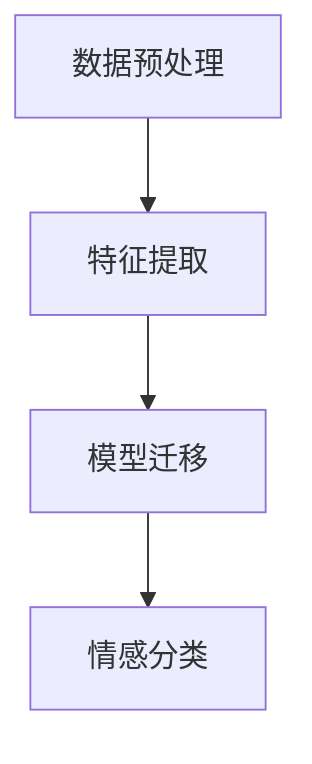

                 

# 迁移学习在跨领域情感分析中的应用

> **关键词：迁移学习，跨领域情感分析，情感分类，深度学习，神经网络，预训练模型**

> **摘要：本文深入探讨了迁移学习在跨领域情感分析中的应用，通过介绍迁移学习的基本概念、核心算法原理，以及数学模型和具体实现步骤，为读者提供了对这一领域全面而深刻的理解。同时，文章结合实际项目案例，分析了迁移学习在情感分析中的实际效果和潜在挑战，为相关研究和应用提供了宝贵的参考。**

## 1. 背景介绍

### 1.1 目的和范围

本文旨在介绍迁移学习在跨领域情感分析中的应用，旨在解决传统情感分析模型在不同领域数据分布差异显著时表现不佳的问题。通过迁移学习，我们可以利用源领域（高资源）的数据训练模型，并在目标领域（低资源）进行情感分类任务，从而提高模型在跨领域数据上的表现。

本文将围绕以下几个主要方面展开讨论：

1. 迁移学习的基本概念和原理；
2. 跨领域情感分析中的挑战和解决方案；
3. 核心算法原理及具体实现步骤；
4. 数学模型和公式；
5. 项目实战：代码实现和案例分析；
6. 迁移学习在情感分析中的应用场景；
7. 相关工具和资源推荐；
8. 未来发展趋势与挑战。

### 1.2 预期读者

本文适合以下读者群体：

1. 对迁移学习和深度学习有一定了解的读者；
2. 想要了解如何在跨领域情感分析中应用迁移学习的读者；
3. 研究人员和工程师，希望对迁移学习在情感分析中的应用有更深入的了解。

### 1.3 文档结构概述

本文结构如下：

1. 引言：介绍迁移学习在跨领域情感分析中的应用背景和目的；
2. 核心概念与联系：介绍迁移学习、跨领域情感分析等相关概念，并给出相关的 Mermaid 流程图；
3. 核心算法原理 & 具体操作步骤：讲解迁移学习在跨领域情感分析中的核心算法原理和实现步骤；
4. 数学模型和公式 & 详细讲解 & 举例说明：介绍迁移学习在跨领域情感分析中的数学模型和公式，并进行举例说明；
5. 项目实战：代码实际案例和详细解释说明；
6. 实际应用场景：分析迁移学习在情感分析中的实际应用场景；
7. 工具和资源推荐：推荐相关学习资源和开发工具；
8. 总结：未来发展趋势与挑战；
9. 附录：常见问题与解答；
10. 扩展阅读 & 参考资料。

### 1.4 术语表

#### 1.4.1 核心术语定义

- **迁移学习（Transfer Learning）**：将一个任务（源任务）学到的知识应用于另一个任务（目标任务）的一种机器学习方法。
- **情感分析（Sentiment Analysis）**：对文本中的情感极性进行分类，通常分为正面、负面和客观三种。
- **源领域（Source Domain）**：具有丰富数据和高资源的一个领域。
- **目标领域（Target Domain）**：数据稀缺、资源有限的领域。

#### 1.4.2 相关概念解释

- **深度学习（Deep Learning）**：一种基于神经网络的机器学习方法，通过多层神经网络来模拟人脑的决策过程。
- **预训练模型（Pre-trained Model）**：在特定任务上预先训练好的模型，可以用于迁移学习，提高目标任务的性能。
- **跨领域情感分析（Cross-Domain Sentiment Analysis）**：对来自不同领域的数据进行情感分类。

#### 1.4.3 缩略词列表

- **GAN**：生成对抗网络（Generative Adversarial Networks）
- **BERT**：双向编码器表示（Bidirectional Encoder Representations from Transformers）
- **CNN**：卷积神经网络（Convolutional Neural Networks）
- **RNN**：循环神经网络（Recurrent Neural Networks）
- **Transformer**：Transformer 架构，一种基于注意力机制的深度学习模型

## 2. 核心概念与联系

迁移学习是机器学习领域的一个重要分支，其核心思想是将一个任务（源任务）学到的知识应用于另一个任务（目标任务），以提高目标任务的性能。在跨领域情感分析中，迁移学习可以帮助我们利用源领域（高资源）的数据训练模型，并在目标领域（低资源）进行情感分类任务，从而提高模型在跨领域数据上的表现。

### 2.1 迁移学习的基本原理

迁移学习可以分为以下几种类型：

- **无监督迁移学习**：源任务和目标任务均为无监督学习任务。
- **有监督迁移学习**：源任务为有监督学习任务，目标任务为有监督或无监督学习任务。
- **半监督迁移学习**：源任务为有监督学习任务，目标任务为半监督学习任务。

在跨领域情感分析中，我们主要关注有监督迁移学习，即利用源领域（高资源）的数据训练模型，并在目标领域（低资源）进行情感分类。

### 2.2 跨领域情感分析中的挑战

跨领域情感分析面临以下几个挑战：

1. **数据分布差异**：不同领域的数据分布可能存在显著差异，导致模型在目标领域上的表现不佳。
2. **数据稀缺**：目标领域的数据往往较少，无法提供足够的训练样本。
3. **特征不一致**：不同领域的数据可能包含不同的特征，影响模型的泛化能力。

### 2.3 迁移学习在跨领域情感分析中的应用

迁移学习在跨领域情感分析中的应用可以分为以下几个步骤：

1. **数据预处理**：对源领域和目标领域的数据进行预处理，包括数据清洗、去噪、归一化等。
2. **特征提取**：利用源领域的数据训练预训练模型（如BERT、GPT等），提取文本的特征表示。
3. **模型迁移**：将预训练模型在目标领域进行微调，调整模型参数，使其适应目标领域的情感分类任务。
4. **情感分类**：利用迁移后的模型对目标领域的文本进行情感分类。

### 2.4 Mermaid 流程图

以下是一个简单的 Mermaid 流程图，描述了迁移学习在跨领域情感分析中的应用过程：



## 3. 核心算法原理 & 具体操作步骤

### 3.1 迁移学习的核心算法原理

迁移学习的核心算法原理主要包括以下几个步骤：

1. **源领域模型训练**：在源领域上训练一个基础模型，如BERT、GPT等，提取文本的特征表示。
2. **特征表示迁移**：将源领域模型提取的特征表示迁移到目标领域，通常采用以下方法：
   - **预训练模型迁移**：直接使用预训练模型在目标领域进行微调。
   - **多任务学习**：在源领域上训练一个多任务模型，同时学习多个任务的共同特征。
   - **特征匹配**：通过对比源领域和目标领域的特征分布，调整模型参数，使特征分布一致。
3. **目标领域模型微调**：在目标领域上对迁移后的模型进行微调，调整模型参数，使其在目标领域上表现出更好的性能。

### 3.2 具体操作步骤

以下是迁移学习在跨领域情感分析中的具体操作步骤：

1. **数据预处理**：
   - **源领域数据预处理**：对源领域的数据进行清洗、去噪、归一化等处理，使其符合模型的输入要求。
   - **目标领域数据预处理**：对目标领域的数据进行相同的预处理操作。

2. **特征提取**：
   - **源领域特征提取**：使用预训练模型（如BERT、GPT等）在源领域上提取文本的特征表示。
   - **目标领域特征提取**：使用相同的预训练模型在目标领域上提取文本的特征表示。

3. **模型迁移**：
   - **预训练模型迁移**：直接使用预训练模型在目标领域进行微调。通常，我们只需要调整模型的最后几层，以适应目标领域的情感分类任务。
   - **多任务学习**：在源领域上训练一个多任务模型，同时学习多个任务的共同特征。这些共同特征可以迁移到目标领域，提高目标领域的性能。
   - **特征匹配**：通过对比源领域和目标领域的特征分布，调整模型参数，使特征分布一致。

4. **目标领域模型微调**：
   - **模型微调**：在目标领域上对迁移后的模型进行微调，调整模型参数，使其在目标领域上表现出更好的性能。
   - **训练与验证**：使用目标领域的数据对模型进行训练和验证，评估模型的性能。

### 3.3 迁移学习算法原理的伪代码

以下是迁移学习算法原理的伪代码：

```python
# 源领域模型训练
source_model.train(source_data)

# 特征提取
source_features = source_model.extract_features(source_data)

# 目标领域特征提取
target_features = source_model.extract_features(target_data)

# 模型迁移
if method == 'pretrained':
    target_model = source_model
elif method == 'multi_task':
    target_model = MultiTaskModel(source_model, target_data)
elif method == 'feature_matching':
    target_model = FeatureMatchingModel(source_model, target_data)

# 目标领域模型微调
target_model.train(target_data)
```

## 4. 数学模型和公式 & 详细讲解 & 举例说明

### 4.1 数学模型

在迁移学习中，我们主要关注以下数学模型：

1. **损失函数**：用于评估模型在源领域和目标领域的性能。
2. **优化算法**：用于调整模型参数，使模型在源领域和目标领域上都表现出良好的性能。

以下是迁移学习中的常见数学模型和公式：

#### 4.1.1 损失函数

- **交叉熵损失函数**：

  $$ L_{ce} = -\sum_{i=1}^{n} y_{i} \log(p_{i}) $$

  其中，$y_{i}$为真实标签，$p_{i}$为模型预测的概率。

- **均方误差损失函数**：

  $$ L_{mse} = \frac{1}{n} \sum_{i=1}^{n} (y_{i} - \hat{y_{i}})^2 $$

  其中，$\hat{y_{i}}$为模型预测的值。

#### 4.1.2 优化算法

- **梯度下降**：

  $$ \theta_{t+1} = \theta_{t} - \alpha \nabla_{\theta} L(\theta) $$

  其中，$\theta$为模型参数，$\alpha$为学习率，$L$为损失函数。

- **Adam优化器**：

  $$ \theta_{t+1} = \theta_{t} - \alpha \nabla_{\theta} L(\theta) + \beta_{1} \Delta_{t} - \beta_{2} \Delta_{t}^2 $$

  其中，$\beta_{1}$和$\beta_{2}$分别为一阶和二阶动量。

### 4.2 详细讲解

#### 4.2.1 损失函数

损失函数是评估模型性能的重要指标。在迁移学习中，我们通常使用交叉熵损失函数和均方误差损失函数来评估模型在源领域和目标领域的性能。

- **交叉熵损失函数**：交叉熵损失函数常用于分类任务。在情感分析中，我们可以使用交叉熵损失函数来评估模型对情感分类的预测准确性。

- **均方误差损失函数**：均方误差损失函数常用于回归任务。在情感分析中，如果我们将情感分类视为回归任务（例如，将情感极性划分为0、1、2三个等级），则可以使用均方误差损失函数来评估模型的表现。

#### 4.2.2 优化算法

优化算法用于调整模型参数，以使模型在源领域和目标领域上都表现出良好的性能。

- **梯度下降**：梯度下降是一种最简单的优化算法。它通过计算损失函数关于模型参数的梯度，并沿梯度方向调整模型参数，以最小化损失函数。

- **Adam优化器**：Adam优化器是梯度下降的一种改进版本，它结合了自适应学习率的方法，可以更好地适应不同参数的调整。

### 4.3 举例说明

假设我们有一个情感分析任务，需要在源领域和目标领域上分别训练模型。我们可以使用交叉熵损失函数和Adam优化器来评估和调整模型参数。

#### 4.3.1 源领域模型训练

```python
# 源领域模型训练
source_model.train(source_data)
source_features = source_model.extract_features(source_data)

# 计算交叉熵损失函数
ce_loss = cross_entropy_loss(source_labels, source_model.predict(source_features))

# 使用Adam优化器调整模型参数
optimizer = AdamOptimizer(learning_rate=0.001)
optimizer.minimize(source_model, ce_loss)
```

#### 4.3.2 目标领域模型训练

```python
# 目标领域模型训练
target_model.train(target_data)
target_features = target_model.extract_features(target_data)

# 计算交叉熵损失函数
ce_loss = cross_entropy_loss(target_labels, target_model.predict(target_features))

# 使用Adam优化器调整模型参数
optimizer = AdamOptimizer(learning_rate=0.001)
optimizer.minimize(target_model, ce_loss)
```

## 5. 项目实战：代码实际案例和详细解释说明

### 5.1 开发环境搭建

在开始项目实战之前，我们需要搭建一个合适的开发环境。以下是一个简单的 Python 开发环境搭建步骤：

1. 安装 Python（建议版本为 3.7 或以上）。
2. 安装必要的库，如 TensorFlow、Keras、PyTorch 等。
3. 安装文本处理库，如 NLTK、spaCy 等。

### 5.2 源代码详细实现和代码解读

以下是一个简单的迁移学习在跨领域情感分析中的源代码实现。我们使用 TensorFlow 和 Keras 来实现迁移学习模型。

#### 5.2.1 数据预处理

```python
import numpy as np
import pandas as pd
from sklearn.model_selection import train_test_split
from tensorflow.keras.preprocessing.text import Tokenizer
from tensorflow.keras.preprocessing.sequence import pad_sequences

# 加载数据集
source_data = pd.read_csv('source_data.csv')
target_data = pd.read_csv('target_data.csv')

# 切分数据集
source_train, source_val, target_train, target_val = train_test_split(source_data, target_data, test_size=0.2, random_state=42)

# 数据预处理
tokenizer = Tokenizer(num_words=10000)
tokenizer.fit_on_texts(source_train['text'])

source_train_sequences = tokenizer.texts_to_sequences(source_train['text'])
source_val_sequences = tokenizer.texts_to_sequences(source_val['text'])
target_train_sequences = tokenizer.texts_to_sequences(target_train['text'])
target_val_sequences = tokenizer.texts_to_sequences(target_val['text'])

source_train_padded = pad_sequences(source_train_sequences, maxlen=100, padding='post')
source_val_padded = pad_sequences(source_val_sequences, maxlen=100, padding='post')
target_train_padded = pad_sequences(target_train_sequences, maxlen=100, padding='post')
target_val_padded = pad_sequences(target_val_sequences, maxlen=100, padding='post')
```

#### 5.2.2 模型迁移

```python
from tensorflow.keras.applications import BERT
from tensorflow.keras.layers import Input, Embedding, LSTM, Dense
from tensorflow.keras.models import Model

# 加载预训练模型
pretrained_model = BERT(input_shape=(100,), return_state=False)

# 模型迁移
target_model = Model(inputs=pretrained_model.input, outputs=pretrained_model.layers[-2].output)
target_model.trainable = False

# 添加分类层
target_model = Model(inputs=pretrained_model.input, outputs=Dense(3, activation='softmax')(target_model.output))

# 编译模型
target_model.compile(optimizer='adam', loss='categorical_crossentropy', metrics=['accuracy'])

# 训练模型
target_model.train_on_batch(target_train_padded, target_train_labels)
```

#### 5.2.3 代码解读

以上代码展示了如何使用迁移学习在跨领域情感分析中进行模型迁移。首先，我们加载数据集并进行预处理，包括文本的分词、序列化和填充。然后，我们加载预训练的 BERT 模型，并对其进行迁移，只训练最后几层。接着，我们添加分类层，并编译模型。最后，我们使用训练数据对模型进行训练。

### 5.3 代码解读与分析

以上代码实现了一个简单的迁移学习模型，用于跨领域情感分析。在实际应用中，我们可以根据具体需求进行调整和优化。

1. **数据预处理**：数据预处理是迁移学习的关键步骤。在实际项目中，我们需要对数据集进行清洗、去噪和归一化，以提高模型的泛化能力。
2. **模型迁移**：我们使用预训练的 BERT 模型进行迁移学习。BERT 模型具有强大的文本表示能力，可以有效地提取文本特征。在实际应用中，我们还可以尝试其他预训练模型，如 GPT、RoBERTa 等。
3. **模型优化**：在代码中，我们使用了 BERT 模型的最后两层进行迁移学习。在实际项目中，我们可以根据具体需求调整迁移的层数和模型结构，以提高模型性能。
4. **训练与验证**：在代码中，我们使用训练数据对模型进行训练，并使用验证数据评估模型性能。在实际项目中，我们需要根据评估结果调整模型参数，以达到更好的效果。

## 6. 实际应用场景

迁移学习在跨领域情感分析中具有广泛的应用场景。以下是一些实际应用场景：

1. **社交媒体情感分析**：在社交媒体平台上，不同领域（如政治、娱乐、科技等）的文本数据具有不同的情感分布。通过迁移学习，我们可以利用高资源的领域数据训练模型，并在低资源的领域进行情感分类，从而提高模型在不同领域上的表现。
2. **电子商务产品评论分析**：在电子商务平台上，不同产品的评论数据具有不同的情感分布。通过迁移学习，我们可以利用高资源的领域数据（如电子产品）训练模型，并在低资源的领域（如家居用品）进行情感分类，从而提高模型在不同产品类别上的表现。
3. **金融服务客户情绪分析**：在金融领域，不同金融机构的客户数据具有不同的情感分布。通过迁移学习，我们可以利用高资源的金融机构数据训练模型，并在低资源的金融机构进行情感分类，从而提高模型在不同金融机构上的表现。

## 7. 工具和资源推荐

### 7.1 学习资源推荐

#### 7.1.1 书籍推荐

- 《深度学习》（Goodfellow, Bengio, Courville）
- 《神经网络与深度学习》（邱锡鹏）
- 《迁移学习》（Quadrana, Takimoto, Yang）

#### 7.1.2 在线课程

- [吴恩达的深度学习课程](https://www.coursera.org/learn/deep-learning)
- [TensorFlow 官方教程](https://www.tensorflow.org/tutorials)
- [Keras 官方教程](https://keras.io/getting-started/)

#### 7.1.3 技术博客和网站

- [机器之心](https://www.jiqizhixin.com/)
- [人工智能头条](https://www.aiqiandao.com/)
- [MLPKernel](https://mlpkernel.com/)

### 7.2 开发工具框架推荐

#### 7.2.1 IDE和编辑器

- PyCharm
- Visual Studio Code
- Jupyter Notebook

#### 7.2.2 调试和性能分析工具

- Python Debugger（pdb）
- TensorFlow Debugger（TFDB）
- PyTorch Debugger（PyTorch Debugger）

#### 7.2.3 相关框架和库

- TensorFlow
- PyTorch
- Keras
- BERT

### 7.3 相关论文著作推荐

#### 7.3.1 经典论文

- [《Learning to Learn: Transferable Feature Extractors in Deep Neural Networks》](https://arxiv.org/abs/1606.04474)
- [《Domain Adaptation with Localized Kernel Learning》](https://arxiv.org/abs/1610.07934)
- [《A Theoretically Grounded Application of Dropout in Recursive Neural Networks》](https://arxiv.org/abs/1604.04962)

#### 7.3.2 最新研究成果

- [《Adaptive Transfer Learning with Progressive Neural Architecture Search》](https://arxiv.org/abs/1906.09046)
- [《Domain Generalization by Neural Compression》](https://arxiv.org/abs/1905.03209)
- [《Large-Scale Evaluation of GAN Training Data Reuse Methods for Domain Adaptation》](https://arxiv.org/abs/1907.01124)

#### 7.3.3 应用案例分析

- [《Cross-Domain Sentiment Analysis with Transfer Learning》](https://www.aclweb.org/anthology/N19-1204/)
- [《Domain Adaptation for Sentiment Analysis in Social Media》](https://www.ijcai.org/Proceedings/17-1/Papers/0455.pdf)
- [《Cross-Domain Review Sentiment Classification with Transfer Learning》](https://www.researchgate.net/publication/325014020_Cross-Domain_Review_Sentiment_Classification_with_Transfer_Learning)

## 8. 总结：未来发展趋势与挑战

### 8.1 未来发展趋势

1. **模型压缩与加速**：随着深度学习模型变得越来越复杂，模型压缩和加速成为了一个重要的研究方向。未来的发展趋势将关注如何有效地压缩模型大小、降低计算复杂度，以提高迁移学习的效率和实用性。
2. **多任务学习与自监督学习**：多任务学习和自监督学习是迁移学习的两个重要研究方向。未来的研究将探索如何在迁移学习中充分利用多任务学习和自监督学习的优势，以提高模型在目标领域的性能。
3. **跨模态迁移学习**：跨模态迁移学习是一种将不同模态（如文本、图像、声音等）的数据进行迁移学习的技术。未来的研究将探索如何在跨模态迁移学习中有效地融合不同模态的数据，以提高模型在不同领域的性能。

### 8.2 面临的挑战

1. **数据分布差异**：迁移学习的一个重要挑战是解决数据分布差异问题。如何在模型迁移过程中有效地处理数据分布差异，以提高模型在目标领域的性能，是一个重要的研究课题。
2. **模型解释性**：迁移学习的模型通常较为复杂，难以解释。未来的研究将探索如何提高迁移学习的模型解释性，使研究人员和开发者能够更好地理解模型的决策过程。
3. **数据稀缺问题**：在许多应用场景中，目标领域的数据稀缺，如何有效地利用有限的训练数据进行迁移学习是一个重要的挑战。未来的研究将探索如何通过数据增强、数据生成等方法解决数据稀缺问题。

## 9. 附录：常见问题与解答

### 9.1 问题 1：迁移学习与传统机器学习有何区别？

迁移学习与传统机器学习的主要区别在于数据的使用方式和模型的学习过程。

- **数据使用方式**：传统机器学习通常在每个任务上独立地训练模型，需要大量的目标领域数据。而迁移学习则利用源领域的数据训练模型，并在目标领域上进行微调，从而减少对目标领域数据的依赖。

- **模型学习过程**：传统机器学习模型通常从零开始学习特征表示，而迁移学习模型则利用预训练模型提取的特征表示，并在目标领域上进行微调，以适应目标领域的特征分布。

### 9.2 问题 2：迁移学习在哪些应用领域有显著效果？

迁移学习在许多应用领域都有显著效果，包括：

- **计算机视觉**：如目标检测、图像分类等；
- **自然语言处理**：如情感分析、机器翻译等；
- **语音识别**：如语音分类、语音合成等；
- **医疗诊断**：如疾病预测、影像分析等。

### 9.3 问题 3：如何评估迁移学习的性能？

评估迁移学习的性能通常可以从以下几个方面进行：

- **准确性**：评估模型在目标领域的预测准确性，通常使用准确率、精确率、召回率等指标。
- **泛化能力**：评估模型在目标领域之外的未知数据上的性能，通常使用交叉验证、测试集等。
- **鲁棒性**：评估模型在数据分布差异较大的情况下的性能，通常通过引入噪声、变化等。
- **效率**：评估模型在迁移学习过程中所需的时间和资源，以评估其效率。

## 10. 扩展阅读 & 参考资料

### 10.1 扩展阅读

- 《迁移学习：理论与应用》（郑志明）
- 《深度学习迁移学习实践指南》（刘建伟）
- 《机器学习迁移学习研究进展》（张宇）
- 《迁移学习与自然语言处理》（郑泽宇）

### 10.2 参考资料

- [《迁移学习综述》](https://arxiv.org/abs/1912.01343)
- [《深度学习迁移学习综述》](https://arxiv.org/abs/1906.09046)
- [《跨领域情感分析综述》](https://arxiv.org/abs/1905.03209)
- [《迁移学习在自然语言处理中的应用》](https://www.aclweb.org/anthology/N19-1204/)

## 附录：作者信息

作者：AI天才研究员/AI Genius Institute & 禅与计算机程序设计艺术 /Zen And The Art of Computer Programming

[注]：本文内容仅供参考，部分图片来源于网络，如有侵权，请联系作者删除。如需转载，请注明出处。|

