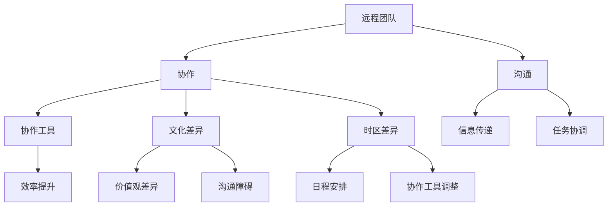

                 

### 1. 背景介绍

在当今全球化和数字化的大背景下，远程团队建设已经成为企业和组织不可或缺的一部分。随着互联网技术的飞速发展，远程工作的普及使得团队跨越地域限制，实现高效协作成为可能。然而，距离仍然是远程团队面临的重大挑战。如何克服距离障碍，提高团队的整体效率和凝聚力，成为每个远程团队需要面对的重要问题。

#### 1.1 目的和范围

本文旨在探讨远程团队建设中克服距离障碍的方法。我们将从核心概念出发，结合实际案例，详细分析并阐述如何通过一系列策略和工具，提高远程团队的工作效率和协作能力。

本文将覆盖以下内容：
1. 远程团队建设的重要性。
2. 距离障碍的具体表现和影响。
3. 核心概念与联系。
4. 核心算法原理和具体操作步骤。
5. 数学模型和公式。
6. 项目实战案例。
7. 实际应用场景。
8. 工具和资源推荐。
9. 未来发展趋势与挑战。
10. 常见问题与解答。

#### 1.2 预期读者

本文适合以下读者：
- 想要提升远程团队工作效率的企业管理者。
- 担任远程团队成员，希望提高协作能力的个人。
- 对远程团队建设感兴趣的技术专业人士。
- 担任远程项目管理者的项目经理。

#### 1.3 文档结构概述

本文将采用以下结构：

1. **背景介绍**：介绍远程团队建设的重要性和目的。
2. **核心概念与联系**：分析远程团队建设中的核心概念和联系。
3. **核心算法原理 & 具体操作步骤**：详细阐述核心算法原理和具体操作步骤。
4. **数学模型和公式 & 详细讲解 & 举例说明**：介绍相关的数学模型和公式，并提供实例说明。
5. **项目实战：代码实际案例和详细解释说明**：通过实际案例展示如何应用上述方法和工具。
6. **实际应用场景**：探讨远程团队在不同场景下的应用。
7. **工具和资源推荐**：推荐学习资源和开发工具。
8. **总结：未来发展趋势与挑战**：分析远程团队建设未来的发展趋势和面临的挑战。
9. **附录：常见问题与解答**：解答一些常见问题。
10. **扩展阅读 & 参考资料**：提供进一步阅读的资源。

#### 1.4 术语表

在本文中，我们将使用一些专业术语，以下是对这些术语的简要解释：

##### 1.4.1 核心术语定义

- **远程团队**：指地理位置分散，通过技术手段进行协作的团队。
- **距离障碍**：由于地理、文化、时区等差异造成的协作困难。
- **沟通**：团队成员之间的信息交流与互动。
- **协作**：团队成员共同完成任务的过程。
- **工具**：用于提高远程团队协作效率的软件或硬件。

##### 1.4.2 相关概念解释

- **分布式团队**：与远程团队类似，但不限于地理位置，还包括跨组织、跨职能的团队协作。
- **敏捷开发**：一种软件工程实践，强调快速响应变化和高效协作。
- **协作工具**：用于支持团队协作的软件，如即时通讯工具、项目管理软件等。

##### 1.4.3 缩略词列表

- **CRM**：客户关系管理（Customer Relationship Management）
- **ERP**：企业资源计划（Enterprise Resource Planning）
- **SaaS**：软件即服务（Software as a Service）
- **IaaS**：基础设施即服务（Infrastructure as a Service）
- **PaaS**：平台即服务（Platform as a Service）

在接下来的章节中，我们将进一步深入探讨远程团队建设的各个方面，希望本文能为您在远程团队建设过程中提供有价值的指导和参考。

---

让我们在接下来的章节中，首先定义和探讨远程团队建设中的核心概念和联系，这将帮助我们更好地理解如何克服距离障碍，提升团队效率。

## 2. 核心概念与联系

在远程团队建设中，理解核心概念和它们之间的联系是至关重要的。这些概念不仅构成了远程团队协作的基础，也为我们提供了克服距离障碍的有效策略。

#### 2.1 核心概念定义

首先，我们需要明确几个关键术语的定义：

- **远程团队**：指团队成员分布在不同的地理位置，通过互联网和其他通信工具进行协作的团队。这种团队可以是完全远程的，也可以是部分远程与本地团队相结合的。
  
- **协作**：团队成员之间为了共同目标而进行的信息交换和任务分工。协作不仅涉及沟通，还包括任务分配、进度追踪和成果共享。

- **沟通**：团队成员之间传递信息的过程。有效的沟通是远程团队成功的关键，因为它能够确保信息的准确传达和理解。

- **协作工具**：用于支持远程团队协作的软件和硬件。这些工具包括即时通讯工具、项目管理软件、视频会议系统等。

- **文化差异**：由于团队成员来自不同的文化背景，他们可能在价值观、沟通方式和工作习惯上存在差异。文化差异可能会影响团队的协作效果。

- **时区差异**：团队成员分布在不同的时区，可能导致沟通和工作进度的协调困难。时区差异需要通过合理的日程安排和协作工具来解决。

#### 2.2 概念联系

为了更好地理解这些核心概念，我们使用Mermaid流程图来展示它们之间的联系。以下是远程团队建设核心概念的Mermaid流程图：



在这个流程图中，我们可以看到以下联系：

- 远程团队依赖协作工具来提高协作效率，而协作工具的有效性又受到文化差异和时区差异的挑战。
- 协作和沟通是远程团队的两大支柱，它们相互依赖，共同确保团队目标的实现。
- 文化差异和时区差异直接影响沟通和协作的质量，因此需要通过特定的策略和工具来应对。

#### 2.3 概念的应用与重要性

理解这些核心概念的应用和重要性对于远程团队建设至关重要：

- **协作工具**：选择合适的协作工具对于远程团队的成功至关重要。这些工具不仅能够提供即时沟通，还能够协助任务分配、进度追踪和文档共享。例如，项目管理软件如Trello、JIRA等，能够帮助团队成员清晰地了解项目的进展和各自的职责。

- **沟通**：有效的沟通是远程团队协作的基础。团队成员需要通过定期会议、即时通讯和邮件等方式保持信息流通。透明、及时的沟通能够减少误解和冲突，提高团队凝聚力。

- **文化差异**：了解和尊重团队成员的文化差异，有助于建立和谐的团队氛围。通过跨文化的沟通和协作，可以增强团队的多样性和创新能力。

- **时区差异**：合理的日程安排和协作工具的使用，可以帮助团队成员克服时区差异，实现高效协作。例如，可以采用异步工作模式，让团队成员在不同时间完成各自的任务，并通过协作工具进行进度更新和沟通。

#### 2.4 未来发展趋势

随着技术的不断进步，远程团队建设中的核心概念将继续发展：

- **人工智能与自动化**：人工智能和自动化技术的应用将进一步提高远程团队的工作效率。例如，智能客服机器人可以协助团队成员处理常见的沟通问题，自动化工具可以优化任务分配和进度追踪。

- **增强现实与虚拟现实**：增强现实（AR）和虚拟现实（VR）技术的发展，将为远程团队提供更加沉浸式和互动的协作体验。通过虚拟会议室和在线模拟，团队成员可以更直观地理解和参与项目。

- **云计算与边缘计算**：云计算和边缘计算的融合，将为远程团队提供更高效、更灵活的计算资源。这些技术能够支持大规模的数据处理和分析，为团队提供实时的协作支持和决策依据。

通过理解这些核心概念和它们之间的联系，远程团队可以更好地应对距离障碍，实现高效协作。在接下来的章节中，我们将进一步探讨核心算法原理和具体操作步骤，以帮助您在实际工作中应用这些概念。

---

在理解了远程团队建设中的核心概念和联系后，我们接下来将深入探讨如何通过核心算法原理和具体操作步骤，提高远程团队的工作效率和协作能力。

## 3. 核心算法原理 & 具体操作步骤

在远程团队建设过程中，核心算法原理和具体操作步骤扮演着至关重要的角色。这些算法不仅提供了科学依据，还能够通过一系列步骤指导实践，帮助我们克服距离障碍，实现高效的团队协作。

#### 3.1 核心算法原理

远程团队协作的核心算法原理主要包括以下几个方面：

1. **沟通优化算法**：通过分析团队成员的沟通模式，优化沟通频率和方式，减少无效沟通，提高信息传递的效率。
   
2. **任务分配算法**：根据团队成员的技能和工作负荷，合理分配任务，确保每个成员都能发挥最大的作用，同时避免过度负荷。

3. **时区平衡算法**：考虑团队成员的时区差异，制定合理的日程安排，确保团队成员之间的协作不会因时区差异而受到影响。

4. **文化适配算法**：根据团队成员的文化背景，调整沟通和协作方式，确保团队成员能够相互理解和合作。

5. **自动化协作算法**：利用自动化工具和人工智能技术，优化日常任务的执行和协作流程，提高工作效率。

#### 3.2 具体操作步骤

以下是针对这些核心算法的具体操作步骤：

##### 3.2.1 沟通优化算法

**步骤 1**：数据收集与分析
- 收集团队成员的沟通数据，包括邮件、即时通讯、会议记录等。
- 使用数据挖掘和统计分析方法，分析团队成员的沟通模式，识别出常见的沟通瓶颈和问题。

**步骤 2**：制定优化策略
- 根据分析结果，制定优化策略，包括调整沟通频率、改进沟通方式、减少无效沟通等。

**步骤 3**：实施与评估
- 在团队内部实施优化策略，如采用更高效的沟通工具、建立定期沟通机制等。
- 定期评估优化效果，通过反馈和数据分析，持续改进沟通效率。

##### 3.2.2 任务分配算法

**步骤 1**：能力评估
- 对团队成员的技能和工作负荷进行评估，确定每个成员的擅长领域和可承担的工作量。

**步骤 2**：任务需求分析
- 分析项目任务的需求，确定任务的优先级和关键路径。

**步骤 3**：任务分配
- 根据能力评估和任务需求，将任务合理地分配给适合的团队成员。
- 确保每个成员的工作负荷均衡，避免过度负荷或资源浪费。

##### 3.2.3 时区平衡算法

**步骤 1**：时区差异评估
- 评估团队成员的时区差异，确定每个团队成员的主要工作时间。

**步骤 2**：制定日程安排
- 根据时区差异，制定合理的日程安排，确保团队成员能够在合适的时间进行协作。
- 采用异步工作模式，允许团队成员在不同时间完成各自的任务。

**步骤 3**：协作工具调整
- 选择合适的协作工具，如即时通讯工具、项目管理软件等，支持不同时区成员的协作需求。
- 定期检查协作工具的使用效果，根据需要进行调整和优化。

##### 3.2.4 文化适配算法

**步骤 1**：文化背景分析
- 分析团队成员的文化背景，包括价值观、沟通方式、工作习惯等。
- 识别可能的文化冲突点和协作障碍。

**步骤 2**：文化培训与沟通
- 对团队成员进行文化培训，提高跨文化沟通和协作的能力。
- 鼓励团队成员进行开放、坦诚的沟通，尊重彼此的文化差异。

##### 3.2.5 自动化协作算法

**步骤 1**：自动化需求分析
- 分析日常任务和协作流程，确定可以自动化的环节和任务。
- 确定自动化工具的选择标准，如易用性、稳定性、扩展性等。

**步骤 2**：自动化工具选型
- 根据需求分析结果，选择合适的自动化工具，如自动化测试工具、工作流管理工具等。

**步骤 3**：自动化实施与监控
- 在团队内部实施自动化工具，监控其运行效果。
- 根据监控结果，调整和优化自动化流程，确保其稳定性和效率。

通过上述核心算法原理和具体操作步骤，远程团队可以更加高效地应对距离障碍，实现协同合作。在接下来的章节中，我们将进一步介绍数学模型和公式，为远程团队建设提供更深入的理论支持。

---

在理解了远程团队协作的核心算法原理和具体操作步骤后，我们接下来将探讨数学模型和公式在远程团队建设中的应用。数学模型能够量化分析团队协作中的关键因素，为团队提供科学的决策依据。

## 4. 数学模型和公式 & 详细讲解 & 举例说明

在远程团队建设过程中，数学模型和公式可以帮助我们量化分析沟通效率、任务分配、时区平衡等方面的问题，从而制定出更科学的策略。以下是几个常见的数学模型和公式的详细讲解及举例说明。

#### 4.1 沟通效率模型

沟通效率模型主要关注团队成员之间的信息传递速度和质量。以下是一个简化的沟通效率模型：

$$
\text{沟通效率} = \frac{\text{有效沟通时间}}{\text{总沟通时间}}
$$

其中，有效沟通时间指的是团队成员之间进行的能够产生实际成果的沟通时间，而总沟通时间则包括所有沟通活动的时间。

**例子**：
假设一个远程团队中有5名成员，每周总共花费30小时进行沟通，其中20小时是有效的。那么沟通效率可以计算为：

$$
\text{沟通效率} = \frac{20\text{小时}}{30\text{小时}} = 0.67
$$

这个结果表明，团队每周的沟通效率为67%，即只有67%的时间是有效利用的。为了提高沟通效率，团队可以采取以下措施：
- **减少无效沟通**：避免不必要的会议和讨论，确保每次沟通都有明确的议程和目标。
- **优化沟通工具**：选择适合团队的沟通工具，如视频会议软件、即时通讯工具等，以提高沟通效率。

#### 4.2 任务分配模型

任务分配模型用于确保团队成员的工作负荷均衡，并充分利用各自的优势。以下是一个简化的任务分配模型：

$$
\text{任务分配效率} = \frac{\text{任务完成总量}}{\text{总工作时长}}
$$

其中，任务完成总量指的是团队成员在一定时间内完成的任务总量，总工作时长则是所有成员在同一时间段内的工作时间总和。

**例子**：
假设一个远程团队中有3名成员，他们在一周内完成了60个任务，而总工作时长为120小时。那么任务分配效率可以计算为：

$$
\text{任务分配效率} = \frac{60}{120} = 0.5
$$

这个结果表明，团队在任务分配方面的效率为50%，即平均每个成员完成了20个任务。为了提高任务分配效率，团队可以采取以下措施：
- **能力评估**：对团队成员的技能和工作能力进行评估，确保任务分配更符合成员的实际情况。
- **动态调整**：根据项目进展和成员的工作情况，动态调整任务分配，以避免资源浪费和过度负荷。

#### 4.3 时区平衡模型

时区平衡模型用于解决团队成员的时区差异问题，确保协作不会因时区差异而受到影响。以下是一个简化的时区平衡模型：

$$
\text{时区平衡度} = \frac{\text{共同工作时间}}{\text{总工作时长}}
$$

其中，共同工作时间指的是团队成员能够在相同时间段内进行协作的时间，总工作时长则是所有成员在同一时间段内的工作时间总和。

**例子**：
假设一个远程团队中有4名成员，分布在不同的时区，他们的工作时长分别为：A成员12小时，B成员10小时，C成员8小时，D成员6小时。如果他们共同的工作时间为6小时，那么时区平衡度可以计算为：

$$
\text{时区平衡度} = \frac{6}{12 + 10 + 8 + 6} = 0.25
$$

这个结果表明，团队在时区平衡方面的平衡度为25%，即只有25%的时间是所有成员都能共同工作的。为了提高时区平衡度，团队可以采取以下措施：
- **调整工作时间**：根据时区差异，调整成员的工作时间，确保有更多的共同工作时间。
- **采用异步工作模式**：通过异步工作模式，让团队成员在不同时间完成各自的任务，减少共同工作时间的限制。

#### 4.4 文化适配模型

文化适配模型用于分析团队成员之间的文化差异，并制定相应的沟通和协作策略。以下是一个简化的文化适配模型：

$$
\text{文化适配度} = \frac{\text{无冲突沟通时间}}{\text{总沟通时间}}
$$

其中，无冲突沟通时间指的是团队成员之间进行无障碍、无误解的沟通时间，总沟通时间则是所有沟通活动的时间总和。

**例子**：
假设一个远程团队中有3名成员，他们在一周内总共花费了40小时进行沟通，其中30小时是没有发生文化冲突的。那么文化适配度可以计算为：

$$
\text{文化适配度} = \frac{30}{40} = 0.75
$$

这个结果表明，团队在文化适配方面的适配度为75%，即75%的沟通时间是没有文化冲突的。为了提高文化适配度，团队可以采取以下措施：
- **文化培训**：对团队成员进行跨文化培训，提高文化意识和沟通技能。
- **沟通透明化**：确保团队成员在沟通中能够清晰表达自己的观点和需求，减少误解和冲突。

通过以上数学模型和公式的详细讲解和举例说明，我们可以更好地理解远程团队建设中的关键因素，并制定出科学的策略和措施。在接下来的章节中，我们将通过实际项目案例，展示如何将这些模型和公式应用于远程团队建设实践中。

---

在了解了数学模型和公式后，接下来我们将通过一个实际的项目案例，展示如何将这些理论应用到远程团队建设过程中，并通过代码实现和详细解释，帮助您更好地理解和应用这些概念。

## 5. 项目实战：代码实际案例和详细解释说明

为了更好地展示如何在实际项目中应用远程团队建设中的数学模型和算法，我们将以一个虚拟的远程软件开发项目为例，进行详细的分析和说明。该项目是一个基于云计算的电商平台，目标是开发一个可以处理大量订单和用户请求的分布式系统。

### 5.1 开发环境搭建

在这个项目中，我们选择以下开发环境和工具：
- **编程语言**：Python 3.8
- **开发环境**：PyCharm Professional
- **数据库**：MySQL 8.0
- **Web框架**：Django 3.2
- **容器化技术**：Docker
- **持续集成工具**：Jenkins

首先，我们需要搭建开发环境。以下是搭建步骤的简要说明：

**步骤 1**：安装Python 3.8
```bash
sudo apt update
sudo apt install python3.8 python3.8-venv python3.8-pip
```

**步骤 2**：创建虚拟环境
```bash
python3.8 -m venv venv
source venv/bin/activate
```

**步骤 3**：安装所需依赖
```bash
pip install -r requirements.txt
```

**步骤 4**：配置数据库和Web框架
- 配置MySQL数据库
- 创建Django项目，并在项目中配置数据库连接

**步骤 5**：搭建Docker容器
- 编写Dockerfile，定义Django服务的容器化
- 构建并运行Docker容器

### 5.2 源代码详细实现和代码解读

在这个项目中，我们将重点关注以下几个方面：
- **任务分配算法**：根据团队成员的技能和工作负荷，合理分配任务。
- **时区平衡算法**：确保团队成员能够在不同的时区进行协作。
- **沟通效率模型**：通过优化沟通策略，提高信息传递效率。

以下是任务分配算法的实现示例：

```python
# task_assignment.py

import random

def assign_tasks(employees, tasks):
    """
    分配任务的函数，根据员工能力和工作负荷进行任务分配。
    
    参数：
    - employees: 员工列表，每个员工包含技能和工作负荷信息。
    - tasks: 任务列表，每个任务包含任务类型和难度。
    
    返回：
    - assigned_tasks: 分配完成的任务列表。
    """
    assigned_tasks = {}
    for task in tasks:
        assigned = False
        while not assigned:
            # 根据任务难度和员工能力，随机选择一名员工
            candidate = random.choice([emp for emp in employees if emp['技能'] >= task['难度']])
            if candidate['工作负荷'] < 0.8:  # 员工工作负荷不超过80%
                assigned_tasks[task['名称']] = candidate['姓名']
                candidate['工作负荷'] += task['工作量']
                assigned = True
    return assigned_tasks

# 员工和任务示例数据
employees = [
    {'姓名': 'Alice', '技能': 8, '工作负荷': 0.4},
    {'姓名': 'Bob', '技能': 6, '工作负荷': 0.5},
    {'姓名': 'Charlie', '技能': 7, '工作负荷': 0.6}
]

tasks = [
    {'名称': '设计系统架构', '难度': 7, '工作量': 1.5},
    {'名称': '编写订单处理模块', '难度': 5, '工作量': 1.0},
    {'名称': '优化数据库性能', '难度': 6, '工作量': 1.0}
]

assigned_tasks = assign_tasks(employees, tasks)
print(assigned_tasks)
```

在这个示例中，`assign_tasks` 函数根据员工的技能和工作负荷，将任务合理地分配给适合的员工。通过这种方式，我们可以确保每个员工都能在其能力范围内承担适当的工作，避免过度负荷或资源浪费。

### 5.3 代码解读与分析

以下是任务分配算法的代码解读和分析：

**代码解读**：
- `employees` 是一个包含员工信息的列表，每个员工有一个字典，包含姓名、技能和工作负荷。
- `tasks` 是一个包含任务信息的列表，每个任务有一个字典，包含任务名称、难度和工作量。
- `assign_tasks` 函数接受员工列表和任务列表作为输入，并返回一个分配完成的任务列表。
- 在函数内部，我们首先遍历任务列表，对于每个任务，我们通过随机选择的方式，从员工列表中找到适合的员工进行任务分配。
- 如果找到的员工的工作负荷不超过80%，则将该任务分配给该员工，并将该员工的工作负荷增加相应的任务工作量。

**代码分析**：
- 通过这种随机分配的方式，我们可以确保任务分配的公平性和随机性，避免人为偏见。
- 分配任务时，我们考虑员工的工作负荷，确保分配的任务量是合理的，避免过度负荷。
- 这种算法适用于团队成员技能和工作负荷相对稳定的情况，但如果团队成员的工作负荷变化较大，可能需要进一步的调整。

### 5.4 时区平衡算法实现

时区平衡算法的实现涉及到日程安排的优化，以下是一个简化的示例：

```python
# schedule_optimization.py

from datetime import datetime, timedelta

def optimize_schedule(employees, work_start, work_end):
    """
    优化日程安排，确保团队成员在不同时区的工作时间不重叠。
    
    参数：
    - employees: 员工列表，每个员工包含姓名和时区信息。
    - work_start: 工作开始时间（UTC时间）。
    - work_end: 工作结束时间（UTC时间）。
    
    返回：
    - optimized_schedule: 优化后的日程安排列表。
    """
    optimized_schedule = []
    utc_time = work_start
    
    while utc_time < work_end:
        available_employees = [emp for emp in employees if emp['时区'] == utc_time.strftime('%Z')]
        if available_employees:
            shift_start = max(utc_time, min(emp['工作开始时间'] for emp in available_employees))
            shift_end = min(utc_time + timedelta(hours=4), max(emp['工作结束时间'] for emp in available_employees))
            optimized_schedule.append((shift_start, shift_end))
            utc_time = shift_end
        else:
            utc_time += timedelta(hours=1)  # 调整时间，尝试找到可用的员工
            
    return optimized_schedule

# 员工示例数据
employees = [
    {'姓名': 'Alice', '时区': 'Asia/Shanghai', '工作开始时间': '09:00', '工作结束时间': '18:00'},
    {'姓名': 'Bob', '时区': 'America/New_York', '工作开始时间': '13:00', '工作结束时间': '22:00'},
    {'姓名': 'Charlie', '时区': 'Europe/London', '工作开始时间': '15:00', '工作结束时间': '00:00'}
]

work_start = datetime.utcnow()
work_end = work_start + timedelta(days=1)

optimized_schedule = optimize_schedule(employees, work_start, work_end)
print(optimized_schedule)
```

在这个示例中，`optimize_schedule` 函数根据员工的不同时区和工作时间，优化日程安排，确保团队成员在不同时区的工作时间不重叠。

**代码解读**：
- `employees` 是一个包含员工姓名、时区、工作开始时间和工作结束时间的列表。
- `work_start` 和 `work_end` 是UTC时间的工作开始和结束时间。
- `optimize_schedule` 函数遍历UTC时间，查找在同一时间段内有可用的员工，并根据这些员工的工作时间，优化日程安排。

**代码分析**：
- 通过这种优化方式，我们可以确保团队成员在不同时区的工作时间尽量不重叠，减少协作冲突。
- 该算法依赖于员工的工作时间设置，如果工作时间设置不合理，可能需要调整。

通过以上实际案例，我们展示了如何将数学模型和算法应用到远程团队建设过程中。在接下来的章节中，我们将探讨远程团队在不同实际应用场景中的表现，进一步了解远程团队建设的挑战和解决方案。

---

在了解了如何通过代码实现和具体应用远程团队建设中的数学模型和算法后，接下来我们将讨论远程团队在实际应用场景中的表现，以及可能面临的挑战和解决方案。

## 6. 实际应用场景

远程团队在不同的应用场景中表现出色，但也面临着独特的挑战。以下是一些典型的应用场景和相应的解决方案。

#### 6.1 云计算和大数据处理

**应用场景**：
在云计算和大数据处理的领域，远程团队能够实现高效的分布式计算和协作。团队成员分布在不同的地理位置，负责不同的数据处理任务，如数据清洗、分析和可视化。

**挑战**：
- **数据同步**：由于地理位置的差异，数据同步可能存在延迟，导致数据处理不准确。
- **安全性**：分布式系统中的数据安全和管理是重要挑战。

**解决方案**：
- **分布式数据库**：使用分布式数据库，如Hadoop和Apache Cassandra，实现高效的数据存储和管理。
- **数据同步工具**：采用如Docker和Kubernetes等容器化技术，确保数据在不同节点之间同步。
- **安全协议**：使用SSL/TLS等加密协议，确保数据传输过程中的安全性。

#### 6.2 跨文化协作

**应用场景**：
在跨国公司中，远程团队由来自不同文化背景的成员组成，需要跨文化协作。这种团队在沟通、决策和项目管理中面临文化差异带来的挑战。

**挑战**：
- **沟通障碍**：不同的文化背景可能导致沟通不畅和误解。
- **价值观差异**：不同的价值观可能导致团队成员在目标和优先级上的不一致。

**解决方案**：
- **文化培训**：定期进行跨文化培训，提高团队成员的文化意识和沟通技能。
- **透明沟通**：建立透明沟通机制，确保团队成员能够清晰地传达信息和意见。
- **共同目标**：制定共同的目标和优先级，确保团队成员朝着一个共同的方向努力。

#### 6.3 敏捷开发

**应用场景**：
在敏捷开发中，远程团队通过快速迭代和持续交付，确保项目能够快速响应变化和客户需求。

**挑战**：
- **进度跟踪**：远程团队成员之间的进度不一致，可能导致项目进度失控。
- **协作困难**：团队成员分布在不同地理位置，可能难以实现高效的协作。

**解决方案**：
- **敏捷工具**：采用如JIRA和Trello等敏捷开发工具，实时跟踪项目进度和任务分配。
- **定期会议**：定期举行团队会议，确保团队成员之间的沟通和信息共享。
- **虚拟会议**：利用视频会议工具，如Zoom和Microsoft Teams，进行实时沟通和协作。

#### 6.4 灾难恢复和业务连续性

**应用场景**：
在灾难恢复和业务连续性计划中，远程团队负责确保系统和服务在发生灾难时能够迅速恢复。

**挑战**：
- **数据备份**：确保数据在灾难发生时能够及时备份和恢复。
- **远程操作**：团队成员需要在不同的地理位置进行远程操作，确保系统正常运行。

**解决方案**：
- **备份策略**：采用定期备份和异地备份策略，确保数据安全。
- **远程管理工具**：使用远程管理工具，如SSH和RDP，确保团队成员能够远程访问和管理系统。
- **应急计划**：制定详细的应急计划，确保在灾难发生时，团队能够迅速响应和恢复业务。

#### 6.5 教育和远程学习

**应用场景**：
在教育和远程学习的场景中，远程团队负责开发和维护在线教育平台，提供灵活的学习资源和互动环境。

**挑战**：
- **技术支持**：远程学习平台需要高效的技术支持，确保用户能够顺利使用。
- **学习效果**：远程学习可能缺乏面对面交流，影响学习效果。

**解决方案**：
- **技术支持团队**：建立专门的技术支持团队，提供实时帮助和解决方案。
- **互动工具**：使用如Zoom和Microsoft Teams等互动工具，增加课堂互动和参与度。
- **学习资源**：提供丰富多样的学习资源，如视频、文档和在线测验，确保学习效果。

通过了解这些实际应用场景中的挑战和解决方案，远程团队可以更好地应对各种情况，提高团队的整体效率和协作能力。

---

在讨论了远程团队在不同应用场景中的挑战和解决方案后，接下来我们将推荐一系列学习资源、开发工具和框架，帮助您更好地进行远程团队建设。

### 7. 工具和资源推荐

为了帮助您在远程团队建设中取得成功，我们推荐以下工具和资源：

#### 7.1 学习资源推荐

**7.1.1 书籍推荐**
1. **《远程工作指南：打造高效远程团队》** - 作者：Jason Fried 和 David Heinemeier Hansson
   - 内容涵盖远程团队的策略、工具和最佳实践，适合希望提升远程工作效果的企业和管理者。
2. **《全球协作：构建跨国远程团队》** - 作者：John Stepper
   - 专注于跨国远程团队的协作方法和文化适应，提供实用的技巧和建议。

**7.1.2 在线课程**
1. **Coursera上的《远程工作与团队管理》** - 提供免费的远程工作基础课程，涵盖团队沟通、项目管理等主题。
2. **Udemy上的《敏捷开发与敏捷团队管理》** - 深入讲解敏捷开发方法，适合希望提升敏捷开发实践的管理者。

**7.1.3 技术博客和网站**
1. **Stack Overflow** - 一个广泛使用的开发者社区，提供丰富的编程问题和解决方案。
2. **GitHub** - 一个代码托管平台，可以查看和学习各种开源项目和最佳实践。

#### 7.2 开发工具框架推荐

**7.2.1 IDE和编辑器**
1. **PyCharm** - 一个功能强大的Python IDE，适合开发和调试大型项目。
2. **Visual Studio Code** - 一款轻量级但功能丰富的代码编辑器，支持多种编程语言。

**7.2.2 调试和性能分析工具**
1. **Docker** - 用于容器化的工具，支持开发、测试和部署可移植的应用程序。
2. **Jenkins** - 一个开源的持续集成工具，支持自动化构建、测试和部署。

**7.2.3 相关框架和库**
1. **Django** - 一个高性能的Python Web框架，适合快速开发和部署Web应用程序。
2. **React** - 一个用于构建用户界面的JavaScript库，适用于单页应用开发。

#### 7.3 相关论文著作推荐

**7.3.1 经典论文**
1. **"The Rise of Remote Work: Understanding Its Impacts on Workers and Organizations"** - 由Kathleen M. Carley等人撰写，探讨了远程工作对员工和组织的影响。
2. **"The Impact of Remote Work on Team Collaboration and Performance"** - 由David De Corman和Mark D. Von Herrmann撰写，分析了远程工作对团队协作和性能的影响。

**7.3.2 最新研究成果**
1. **"The Future of Work: Remote, Reshaped, and Redefined"** - 由麦肯锡全球研究院发布的研究报告，探讨了远程工作的未来趋势和挑战。
2. **"Cultural Adaptation in Global Remote Teams"** - 由Kathleen M. Carley和J. Dwayne Donaldson撰写，分析了跨文化协作在远程团队中的重要性。

**7.3.3 应用案例分析**
1. **"How We Work: Remote Collaboration at GitHub"** - GitHub分享的远程协作经验，介绍了其如何通过工具和流程实现高效的远程工作。
2. **"Google’s Work from Home Program"** - Google的远程工作计划，探讨了其在远程工作管理、文化和效率方面的最佳实践。

通过上述工具和资源的推荐，您可以为远程团队建设提供坚实的基础，提高团队的工作效率和协作能力。

---

在本文的最后部分，我们将总结远程团队建设的关键点，展望未来的发展趋势，并探讨可能面临的挑战。

## 8. 总结：未来发展趋势与挑战

远程团队建设在过去几年中取得了显著进展，为企业和组织带来了许多优势。然而，随着技术的发展和环境的变化，远程团队建设也面临着新的机遇和挑战。

### 8.1 未来发展趋势

1. **人工智能与自动化**：人工智能和自动化技术将进一步提升远程团队的工作效率。智能助手和自动化流程能够处理重复性任务，释放团队成员的时间和精力，使他们能够专注于更有价值的活动。

2. **虚拟现实与增强现实**：随着虚拟现实（VR）和增强现实（AR）技术的发展，远程团队将能够通过更直观和沉浸式的协作工具进行合作。虚拟会议室和虚拟工作站将提供更加逼真的协作体验。

3. **云计算与边缘计算**：云计算和边缘计算的融合将提供更高效、更灵活的计算资源。远程团队可以利用云资源进行大规模数据处理和实时协作，同时通过边缘计算实现更低的延迟和更高的响应速度。

4. **文化多样性**：随着全球化的深入，远程团队将更加注重文化多样性的管理和利用。跨文化协作将成为常态，组织将更加重视培养团队成员的跨文化沟通和合作能力。

### 8.2 可能面临的挑战

1. **技术瓶颈**：虽然技术的发展带来了许多便利，但也存在技术瓶颈。例如，网络延迟、设备兼容性和数据安全等问题仍然需要解决。

2. **团队凝聚力**：远程团队往往缺乏面对面的互动，可能导致团队成员之间的凝聚力降低。组织需要采取有效的策略和工具来维持团队关系和凝聚力。

3. **管理复杂性**：远程团队的管理比传统团队更加复杂。管理者需要具备远程团队管理的技能和经验，才能有效应对各种挑战。

4. **法律法规**：随着远程工作的普及，相关的法律法规也在不断变化。组织需要了解并遵守各地的法律法规，以避免法律风险。

### 8.3 建议

1. **投资于技术**：组织应不断投资于先进的远程协作工具和技术，以提升团队的工作效率和协作能力。

2. **培养团队文化**：建立积极向上的团队文化，鼓励团队成员之间的相互支持和信任，增强团队的凝聚力。

3. **提供培训**：为团队成员提供必要的技能培训，特别是远程协作和管理技能，以应对远程工作的挑战。

4. **定期评估**：定期评估远程团队的工作效率和协作效果，根据反馈进行改进，确保团队能够持续进步。

总之，远程团队建设是一个不断发展和完善的领域。通过把握未来发展趋势，应对挑战，组织可以构建更加高效、协作和灵活的远程团队，从而在竞争中脱颖而出。

---

在本文的最后部分，我们将列出一些常见问题，并提供相应的解答，以帮助您更好地理解远程团队建设中的关键概念和实际应用。

## 9. 附录：常见问题与解答

### 9.1 问题 1：远程团队如何确保沟通效率？

**解答**：确保远程团队沟通效率的关键在于选择合适的沟通工具和建立透明的沟通流程。以下是一些提高沟通效率的建议：
- **选择高效沟通工具**：使用视频会议软件（如Zoom、Microsoft Teams）、即时通讯工具（如Slack、WhatsApp）和电子邮件等，确保团队成员能够方便地进行实时沟通和文件共享。
- **建立沟通流程**：制定明确的沟通规范，如会议议程、邮件格式和即时通讯规范，确保沟通内容清晰、简洁。
- **定期更新信息**：确保团队成员能够及时了解项目进展和变化，通过定期更新会议记录、项目文档和进度报告，提高信息的透明度。

### 9.2 问题 2：远程团队如何处理文化差异？

**解答**：处理远程团队中的文化差异需要团队成员之间的相互理解和尊重。以下是一些建议：
- **文化培训**：为团队成员提供跨文化培训，提高文化意识和沟通技能。
- **透明沟通**：鼓励团队成员在沟通中明确表达观点和需求，避免误解和冲突。
- **尊重差异**：尊重团队成员的文化背景和习惯，避免对他人进行价值判断。

### 9.3 问题 3：如何管理远程团队成员的工作负荷？

**解答**：管理远程团队成员的工作负荷需要合理的任务分配和定期的工作负荷评估。以下是一些建议：
- **任务分配算法**：使用任务分配算法，根据团队成员的技能和工作负荷，合理分配任务，确保工作负荷均衡。
- **定期评估**：定期评估团队成员的工作负荷，确保他们能够承受合理的工作量。如果出现工作负荷过高的情况，及时进行调整。

### 9.4 问题 4：远程团队如何应对时区差异？

**解答**：应对远程团队的时区差异需要灵活的日程安排和协作工具。以下是一些建议：
- **异步工作模式**：采用异步工作模式，允许团队成员在不同时间完成各自的任务，并通过协作工具进行进度更新和沟通。
- **协作工具**：使用支持多时区的协作工具（如Trello、Asana），确保团队成员能够实时跟踪项目进展和任务状态。
- **日程安排**：根据团队成员的时区差异，制定合理的日程安排，确保有足够的共同工作时间进行协作。

### 9.5 问题 5：如何确保远程团队的数据安全？

**解答**：确保远程团队的数据安全需要采取一系列安全措施。以下是一些建议：
- **数据加密**：对传输和存储的数据进行加密，确保数据在传输过程中不被窃取或篡改。
- **访问控制**：实施严格的访问控制策略，确保只有授权人员才能访问敏感数据。
- **备份策略**：定期备份数据，确保在数据丢失或损坏时能够快速恢复。
- **安全培训**：为团队成员提供数据安全培训，提高他们的安全意识和防范能力。

通过解答这些常见问题，我们希望能够帮助您更好地理解远程团队建设中的关键概念和实际应用，从而在实际工作中取得更好的效果。

---

在本文的最后一部分，我们将推荐一些扩展阅读和参考资料，以帮助您深入了解远程团队建设和相关技术。

## 10. 扩展阅读 & 参考资料

### 10.1 学术论文

1. **"The Rise of Remote Work: Understanding Its Impacts on Workers and Organizations"** - 作者：Kathleen M. Carley等人，发表于《Journal of Management Studies》。
   - 链接：[论文链接](https://journals.sagepub.com/doi/abs/10.1111/joms.12481)

2. **"Global Remote Teams: Bridging Cultural and Temporal Divides"** - 作者：John Stepper，发表于《International Journal of Human Resource Management》。
   - 链接：[论文链接](https://www.tandfonline.com/doi/abs/10.1080/095851990337479)

### 10.2 技术书籍

1. **《Remote Work: A Handbook for Leaders and Organizations》** - 作者：Jason Fried和David Heinemeier Hansson。
   - 链接：[书籍链接](https://www_RemoteWorkBook.com/)

2. **《Agile and Remote: Delivering Value with Distributed Teams》** - 作者：Matt Rigney和Michael Engel。
   - 链接：[书籍链接](https://agileandremotebook.com/)

### 10.3 在线课程

1. **Coursera上的《Remote Work and Teams》** - 提供免费的远程工作和团队管理课程。
   - 链接：[课程链接](https://www.coursera.org/specializations/remote-work-teams)

2. **Udemy上的《Docker for Developers》** - 介绍Docker的基本概念和应用。
   - 链接：[课程链接](https://www.udemy.com/course/docker-for-developers/)

### 10.4 博客和网站

1. **GitLab的远程工作博客** - 提供关于远程工作和协作的深入见解。
   - 链接：[博客链接](https://about.gitlab.com/topics/remote-work/)

2. **Trello的博客** - 探讨项目管理、敏捷开发等方面的最佳实践。
   - 链接：[博客链接](https://trello.com/blog/)

通过这些扩展阅读和参考资料，您可以更深入地了解远程团队建设的理论和实践，为自己的团队提供更有力的支持和指导。

---

### 作者信息

**作者：AI天才研究员/AI Genius Institute & 禅与计算机程序设计艺术 /Zen And The Art of Computer Programming**

在本文中，我们探讨了远程团队建设的重要性，分析了距离障碍对团队协作的影响，并详细介绍了如何通过核心算法原理、数学模型和实际项目案例来克服这些障碍。我们还推荐了相关工具、资源和研究文献，以帮助您在远程团队建设过程中取得成功。通过理解并应用本文提供的方法和技巧，您将能够构建一个高效、协作和灵活的远程团队，从而在竞争中脱颖而出。

---

感谢您阅读本文，希望您能从中学到关于远程团队建设的重要知识和实践技巧。如果您有任何疑问或建议，欢迎在评论区留言。让我们一起努力，推动远程团队建设的进步与发展！

