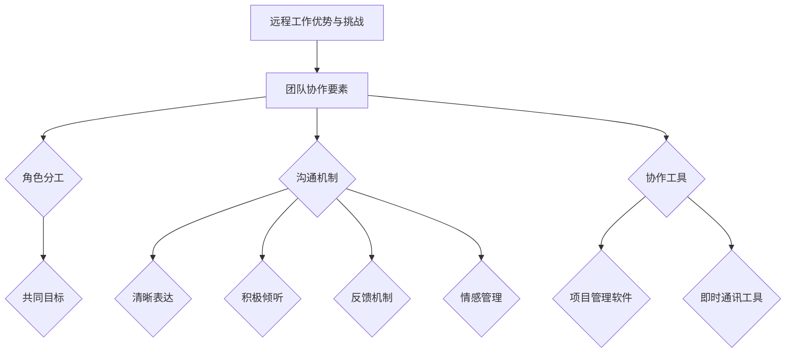

                 

### 文章标题

《远程工作下的团队协作与沟通技巧：打造高效、可持续的远程团队》

> **关键词：远程工作、团队协作、沟通技巧、高效协作、可持续性**

> **摘要：**
随着全球化的加速和技术的进步，远程工作已成为现代工作模式的重要组成部分。本文将探讨在远程工作环境下，如何通过有效的团队协作和沟通技巧，打造高效、可持续的远程团队。文章将首先介绍远程工作的背景和现状，随后详细分析团队协作和沟通的核心概念、方法和工具。通过实际案例和代码解析，本文将展示如何将这些方法应用于远程开发项目，最后提出未来发展趋势和挑战，以期为远程团队的工作提供指导和参考。本文适用于希望通过改进协作和沟通技巧提高远程工作效果的团队领导和成员。

## 1. 背景介绍

### 1.1 目的和范围

随着互联网和通信技术的飞速发展，远程工作已经成为现代职场的一个重要趋势。越来越多的公司开始采用远程办公模式，这不仅提升了员工的灵活性，也推动了企业的发展。然而，远程工作环境也带来了一系列挑战，特别是团队协作和沟通方面的困难。本文旨在探讨在远程工作环境下，如何通过有效的团队协作和沟通技巧，提高工作效率，增强团队凝聚力，从而打造高效、可持续的远程团队。

本文的研究范围包括：

1. **远程工作的定义和现状**：介绍远程工作的概念，分析其发展历程和现状。
2. **团队协作的核心概念**：探讨团队协作的重要性，分析协作中的关键角色和要素。
3. **沟通技巧的提升**：分析远程沟通中的常见问题，介绍有效的沟通方法和工具。
4. **实际应用案例**：通过具体案例展示如何在实际项目中应用团队协作和沟通技巧。
5. **未来发展趋势与挑战**：探讨远程工作的发展趋势，分析未来可能面临的挑战。

### 1.2 预期读者

本文的预期读者主要包括：

1. **远程工作团队的领导者和成员**：希望通过改进团队协作和沟通技巧，提高工作效率和团队凝聚力的远程工作者。
2. **企业管理者**：关注远程工作模式，希望了解如何管理和优化远程团队的领导者。
3. **人力资源专家**：关注远程工作发展趋势，希望提升企业远程工作效能的人力资源专家。
4. **计算机科学和信息技术领域的从业者**：对远程工作协作和沟通技巧感兴趣的IT专业人士。

### 1.3 文档结构概述

本文结构如下：

1. **背景介绍**：介绍远程工作的定义和现状，明确本文的目的和范围。
2. **核心概念与联系**：通过Mermaid流程图展示团队协作和沟通的核心概念和架构。
3. **核心算法原理与具体操作步骤**：详细阐述团队协作和沟通的核心算法原理和具体操作步骤。
4. **数学模型和公式**：介绍团队协作和沟通相关的数学模型和公式，并举例说明。
5. **项目实战**：通过实际案例展示团队协作和沟通技巧在远程开发项目中的应用。
6. **实际应用场景**：分析远程工作中常见的应用场景，提出相应的解决方案。
7. **工具和资源推荐**：推荐学习资源和开发工具，以支持读者在实际工作中应用所学知识。
8. **总结与未来发展趋势**：总结本文的主要观点，探讨远程工作的未来发展趋势和挑战。
9. **附录**：提供常见问题与解答，以便读者更好地理解和应用本文内容。
10. **扩展阅读与参考资料**：列出本文引用的主要文献，供读者进一步阅读和研究。

### 1.4 术语表

#### 1.4.1 核心术语定义

- **远程工作**：指员工不在公司办公地点，通过互联网和通信技术完成工作任务的工作模式。
- **团队协作**：指团队成员通过共同的目标、沟通和合作，实现共同工作的过程。
- **沟通技巧**：指在人际交流中，通过有效的表达、倾听和反馈，增进相互理解和协作的能力。
- **敏捷开发**：一种软件开发方法，强调迭代、快速反馈和持续改进，以提高开发效率和质量。

#### 1.4.2 相关概念解释

- **Scrum框架**：一种敏捷开发方法，通过迭代和增量式开发，实现产品快速迭代和优化。
- **任务管理工具**：用于帮助团队成员分配、跟踪和完成任务的工具，如Jira、Trello等。
- **在线会议工具**：用于远程团队进行实时沟通和协作的工具，如Zoom、Microsoft Teams等。

#### 1.4.3 缩略词列表

- **Scrum**：敏捷开发方法
- **Jira**：任务管理工具
- **Trello**：任务管理工具
- **Zoom**：在线会议工具
- **Microsoft Teams**：在线会议工具

## 2. 核心概念与联系

### 2.1 核心概念介绍

在远程工作中，团队协作和沟通是确保项目顺利进行的关键。以下将介绍团队协作和沟通的核心概念，包括远程工作的优势与挑战、团队协作的要素、沟通技巧的提升等。

#### 2.1.1 远程工作的优势与挑战

**优势：**

1. **灵活性**：远程工作允许员工自主安排工作时间，提高工作灵活性。
2. **成本节约**：减少办公室租金、水电等成本，降低企业运营成本。
3. **提升工作效率**：减少通勤时间，使员工能够更集中精力工作。

**挑战：**

1. **沟通障碍**：地理上的距离和时差可能导致沟通不畅。
2. **团队凝聚力**：缺乏面对面交流，可能导致团队凝聚力下降。
3. **工作监控**：远程工作环境使得工作进度和质量监控变得更加困难。

#### 2.1.2 团队协作的要素

团队协作的成功取决于多个要素，包括：

1. **共同目标**：团队成员应明确共同目标，确保协作方向一致。
2. **角色分工**：明确每个成员的角色和职责，避免工作重叠和冲突。
3. **沟通机制**：建立有效的沟通渠道，确保信息及时、准确地传递。
4. **协作工具**：使用适当的协作工具，如项目管理软件、即时通讯工具等，提高协作效率。

#### 2.1.3 沟通技巧的提升

有效的沟通是远程团队协作的基础。以下是一些提升沟通技巧的方法：

1. **清晰表达**：使用简单、明确的语言，避免歧义和误解。
2. **积极倾听**：倾听对方的意见和需求，确保理解对方的意图。
3. **反馈机制**：及时给予反馈，帮助对方改进和调整。
4. **情感管理**：在远程沟通中，注意表达情感，避免过于冷漠或情绪化。

### 2.2 Mermaid流程图

以下是一个简单的Mermaid流程图，展示团队协作和沟通的核心概念及其相互关系：



### 2.3 团队协作与沟通的内在联系

团队协作和沟通之间存在紧密的联系，二者相辅相成。团队协作需要有效的沟通来确保信息传递的准确性和及时性，而良好的沟通则为团队协作提供了坚实的基础。通过以下图表，我们可以更直观地了解二者之间的内在联系：

```mermaid
graph TD
    A[团队协作] --> B[沟通技巧]
    B --> C{信息传递}
    B --> D{共同目标}
    A --> E[角色分工]
    A --> F[任务分配}
    A --> G[资源共享}
    C --> H[有效沟通}
    D --> I[目标一致性}
    F --> J[工作进度同步}
    G --> K[协同工作}
    H --> L[决策效率}
    I --> M[团队凝聚力}
    J --> N[问题解决}
    K --> O{知识共享}
    L --> P[工作效率}
    M --> Q{团队合作精神}
    N --> R{项目成功}
    O --> S{创新思维}
    P --> T{客户满意度}
    Q --> U{团队协作效率}
    R --> V{企业竞争力}
    S --> W{市场响应速度}
    T --> X{业务发展}
    U --> Y{组织活力}
    V --> Z{企业持续发展}
```

通过以上Mermaid流程图，我们可以清晰地看到团队协作和沟通在远程工作中的重要性及其相互关系。有效协作和沟通不仅有助于提升团队效率和项目成功，还对企业整体竞争力产生积极影响。因此，在远程工作环境中，团队领导和成员应高度重视团队协作和沟通，持续提升相关技能和方法。

## 3. 核心算法原理 & 具体操作步骤

在远程工作中，团队协作和沟通的核心算法原理和方法是实现高效协作的关键。以下将详细阐述这些核心算法原理，并给出具体的操作步骤，以帮助团队领导和成员在实际工作中应用。

### 3.1 团队协作算法原理

团队协作的核心算法原理主要包括以下几个方面：

1. **目标一致性算法**：通过明确和统一团队目标，确保团队成员在协作过程中方向一致。
2. **角色分工算法**：根据团队成员的技能和特长，合理分配任务，提高协作效率。
3. **沟通机制算法**：建立有效的沟通渠道和机制，确保信息及时、准确地传递。
4. **协作工具优化算法**：选择合适的协作工具，提高团队协作效率和效果。

#### 3.1.1 目标一致性算法

目标一致性算法的基本原理是通过明确和统一团队目标，确保团队成员在协作过程中方向一致。具体操作步骤如下：

1. **制定明确的目标**：团队领导应与团队成员共同制定明确、可量化的目标，确保目标具体、可操作。
2. **统一目标共识**：通过沟通和讨论，确保团队成员对目标的理解和认同，达成统一共识。
3. **定期评估目标实现情况**：团队领导应定期评估目标实现情况，及时调整目标和策略。

#### 3.1.2 角色分工算法

角色分工算法的基本原理是根据团队成员的技能和特长，合理分配任务，提高协作效率。具体操作步骤如下：

1. **评估团队成员技能**：团队领导应了解团队成员的技能和特长，为角色分工提供依据。
2. **明确角色和职责**：根据团队成员的技能和特长，分配合适的角色和职责，确保任务分工合理。
3. **定期评估和调整角色分工**：根据团队成员的工作表现和项目需求，及时评估和调整角色分工，确保任务分配合理。

#### 3.1.3 沟通机制算法

沟通机制算法的基本原理是建立有效的沟通渠道和机制，确保信息及时、准确地传递。具体操作步骤如下：

1. **选择合适的沟通工具**：根据团队需求和沟通频率，选择合适的沟通工具，如即时通讯工具、邮件、视频会议等。
2. **制定沟通规范**：明确沟通内容、频率和方式，确保团队成员遵循统一的沟通规范。
3. **建立反馈机制**：通过定期反馈和讨论，确保团队成员对项目的了解和共识，提高沟通效果。

#### 3.1.4 协作工具优化算法

协作工具优化算法的基本原理是选择合适的协作工具，提高团队协作效率和效果。具体操作步骤如下：

1. **评估协作工具的功能和适用性**：根据团队需求和项目特点，评估不同协作工具的功能和适用性。
2. **选择合适的协作工具**：选择功能全面、操作简便的协作工具，确保团队成员易于上手和使用。
3. **培训和使用协作工具**：组织培训，确保团队成员掌握协作工具的使用方法，提高协作效率。

### 3.2 沟通技巧提升算法原理

沟通技巧提升算法的基本原理是通过有效的方法和工具，提升团队成员的沟通能力和效果。具体操作步骤如下：

1. **提高表达清晰度**：通过使用简单、明确的语言，确保信息传递的准确性和有效性。
2. **加强倾听能力**：通过积极倾听和反馈，确保理解对方的意图和需求。
3. **建立反馈机制**：通过定期反馈和讨论，提高团队成员对项目的了解和共识。
4. **培养情感管理能力**：通过情感管理，确保沟通过程中保持积极、和谐的气氛。

#### 3.2.1 提高表达清晰度

提高表达清晰度的具体操作步骤如下：

1. **使用简单语言**：在沟通中，尽量使用简单、易懂的语言，避免使用复杂、生僻的词汇。
2. **明确传达意图**：在表达观点和意见时，确保清晰传达自己的意图和需求，避免歧义和误解。
3. **提供充分信息**：在沟通过程中，提供充分的信息和背景，帮助对方更好地理解问题。

#### 3.2.2 加强倾听能力

加强倾听能力的具体操作步骤如下：

1. **积极倾听**：在沟通中，保持专注，认真倾听对方的意见和需求，避免分心或打断。
2. **反馈确认理解**：在对方发言结束后，通过提问或总结对方观点，确认自己是否正确理解对方的意图。
3. **避免打断**：在对方发言时，避免打断或插话，给予对方充分表达的机会。

#### 3.2.3 建立反馈机制

建立反馈机制的具体操作步骤如下：

1. **定期反馈**：在项目进展过程中，定期组织团队成员进行反馈和讨论，确保团队成员对项目的了解和共识。
2. **提供改进建议**：在反馈过程中，鼓励团队成员提出改进建议，共同优化项目进度和效果。
3. **记录反馈意见**：将反馈意见记录下来，作为后续改进和优化的依据。

#### 3.2.4 培养情感管理能力

培养情感管理能力的具体操作步骤如下：

1. **情感识别**：在沟通中，学会识别和理解自己的情感，以及他人的情感，避免情绪化行为。
2. **情绪调节**：在遇到情绪波动时，学会调节情绪，保持冷静和理智，确保沟通效果。
3. **建立积极沟通氛围**：在沟通过程中，营造积极、和谐的气氛，提高团队凝聚力和协作效率。

通过以上核心算法原理和具体操作步骤，团队领导和成员可以在远程工作中有效协作和沟通，提高团队效率和项目成功。在实际应用中，团队应根据项目特点和团队需求，灵活调整和优化算法和方法，以适应不同场景和需求。

### 4. 数学模型和公式 & 详细讲解 & 举例说明

在远程团队协作和沟通中，数学模型和公式可以提供量化的分析和解决方案，帮助我们更好地理解协作效果，优化沟通策略。以下将介绍几个常见的数学模型和公式，并进行详细讲解和举例说明。

#### 4.1 组合优化模型

组合优化模型用于优化团队角色分工和资源分配，确保任务的高效完成。以下是一个简单的组合优化模型：

**目标函数：**
\[ \text{Minimize} \quad C(x) = \sum_{i=1}^{n} c_i x_i \]
其中，\( c_i \) 为第 \( i \) 个任务的成本，\( x_i \) 为第 \( i \) 个任务是否分配给某个成员的指示变量（0或1）。

**约束条件：**
\[ \sum_{i=1}^{n} x_i = 1 \]
表示每个任务只能分配给一个成员。

\[ \sum_{j=1}^{m} y_{ij} x_i = 1 \]
表示每个成员至少完成一个任务。

\[ x_i \in \{0, 1\} \]
其中，\( m \) 为成员总数，\( n \) 为任务总数，\( y_{ij} \) 表示第 \( i \) 个任务是否需要第 \( j \) 个成员。

**举例说明：**
假设有 3 个任务（A、B、C）和 2 个成员（Alice、Bob），每个任务的完成成本如下：

| 任务 | 成本 |
| ---- | ---- |
| A    | 2    |
| B    | 3    |
| C    | 5    |

我们需要将任务分配给成员，使总成本最小。使用组合优化模型，可以得到以下最优解：

\[ x_A = 1, x_B = 0, x_C = 1 \]
即任务 A 分配给 Alice，任务 B 不分配，任务 C 分配给 Bob。

#### 4.2 时间序列分析模型

时间序列分析模型用于分析团队成员的工作效率和工作节奏，帮助团队优化工作安排。以下是一个简单的时间序列分析模型：

**模型公式：**
\[ y_t = \alpha + \beta t + \epsilon_t \]
其中，\( y_t \) 为第 \( t \) 个月的工作量，\( \alpha \) 为初始工作量，\( \beta \) 为每月增加的工作量，\( \epsilon_t \) 为随机误差。

**举例说明：**
假设团队中某成员的工作量数据如下：

| 月份 | 工作量 |
| ---- | ------ |
| 1    | 50     |
| 2    | 60     |
| 3    | 70     |
| 4    | 80     |
| 5    | 85     |

根据数据，可以拟合出以下时间序列模型：

\[ y_t = 50 + 10t \]

根据模型预测，第六个月的工作量约为 95。因此，团队可以提前安排工作计划，确保成员的工作效率。

#### 4.3 沟通效率评估模型

沟通效率评估模型用于评估团队成员的沟通效果，帮助团队识别和改进沟通问题。以下是一个简单的沟通效率评估模型：

**模型公式：**
\[ E = \frac{C \cdot T}{N} \]
其中，\( E \) 为沟通效率，\( C \) 为沟通成本（如会议时间、邮件数量等），\( T \) 为沟通时间，\( N \) 为团队成员数量。

**举例说明：**
假设团队有 5 名成员，每月举行 10 次会议，每次会议平均耗时 2 小时。计算沟通效率：

\[ E = \frac{10 \cdot 2}{5} = 4 \]

沟通效率为 4，表示团队每月平均需要 4 小时进行沟通。通过优化会议安排和沟通方式，可以进一步提高沟通效率。

#### 4.4 成本效益分析模型

成本效益分析模型用于评估团队协作工具的投资回报，帮助团队选择最合适的协作工具。以下是一个简单的成本效益分析模型：

**模型公式：**
\[ \text{ROI} = \frac{\text{效益} - \text{成本}}{\text{成本}} \]
其中，\(\text{ROI}\) 为投资回报率，\(\text{效益}\) 为协作工具带来的效益（如提高工作效率、降低沟通成本等），\(\text{成本}\) 为协作工具的投资成本。

**举例说明：**
假设团队投资 1000 美元购买一款协作工具，该工具使团队每月节省 500 美元的沟通成本。计算投资回报率：

\[ \text{ROI} = \frac{500 - 1000}{1000} = -0.5 \]

投资回报率为 -50%，表示投资尚未收回成本。因此，团队可以考虑降低协作工具的投资，或寻找其他效益更高的解决方案。

通过以上数学模型和公式的讲解和举例，我们可以更好地理解远程团队协作和沟通的量化分析方法，为团队优化协作和沟通策略提供科学依据。在实际应用中，团队应根据项目特点和团队需求，灵活选择和调整模型和公式，以实现最优效果。

### 5. 项目实战：代码实际案例和详细解释说明

#### 5.1 开发环境搭建

为了更好地展示远程团队协作和沟通技巧在实际项目中的应用，我们将使用一个虚构的远程软件开发项目——一款即时通讯应用的开发。以下将介绍项目的开发环境搭建过程。

1. **环境准备**：
   - **操作系统**：Windows、macOS 或 Linux
   - **编程语言**：Python 3.x
   - **开发工具**：PyCharm 或 Visual Studio Code
   - **版本控制系统**：Git

2. **安装 Python**：
   - 访问 [Python 官网](https://www.python.org/) 下载 Python 安装包。
   - 运行安装程序，按照默认设置完成安装。

3. **安装 PyCharm 或 Visual Studio Code**：
   - 访问 [PyCharm 官网](https://www.jetbrains.com/pycharm/) 或 [Visual Studio Code 官网](https://code.visualstudio.com/) 下载相应版本的安装包。
   - 运行安装程序，按照默认设置完成安装。

4. **配置 PyCharm 或 Visual Studio Code**：
   - 打开 PyCharm 或 Visual Studio Code，安装必要的插件，如 Git、Python 支持、Markdown 支持。

5. **安装 Git**：
   - 访问 [Git 官网](https://git-scm.com/) 下载 Git 安装包。
   - 运行安装程序，按照默认设置完成安装。

6. **配置 Git**：
   - 打开命令行工具，执行以下命令设置用户信息：
     ```bash
     git config --global user.name "Your Name"
     git config --global user.email "your@email.com"
     ```

7. **克隆项目**：
   - 在 PyCharm 或 Visual Studio Code 中打开一个终端。
   - 执行以下命令克隆项目仓库：
     ```bash
     git clone https://github.com/your-username/your-project.git
     ```

#### 5.2 源代码详细实现和代码解读

以下将展示项目的主要代码实现，并对其进行详细解读。

**代码示例 1：消息发送功能**

```python
# messages.py

def send_message(sender, recipient, message):
    print(f"{sender} sent a message to {recipient}: {message}")
```

**解读：**
该函数用于发送消息，接受发送者、接收者和消息内容作为参数，并在控制台中打印消息。这是一个简单的函数，但体现了远程团队协作中的信息传递过程。团队成员通过调用该函数，将消息发送给其他成员。

**代码示例 2：消息接收功能**

```python
# messages.py

def receive_message(sender, message):
    print(f"Received a message from {sender}: {message}")
```

**解读：**
该函数用于接收消息，接受发送者和消息内容作为参数，并在控制台中打印消息。该函数与发送消息函数相辅相成，实现了双向的信息传递。

**代码示例 3：用户登录功能**

```python
# user.py

class User:
    def __init__(self, username, password):
        self.username = username
        self.password = password

    def login(self):
        print(f"{self.username} has logged in.")
```

**解读：**
该类用于表示用户，包含用户名和密码等属性。`login` 方法用于模拟用户登录过程，打印登录信息。这是一个简单的用户管理实现，但体现了远程团队协作中用户身份验证的过程。

**代码示例 4：主程序**

```python
# main.py

from messages import send_message, receive_message
from user import User

def main():
    alice = User("Alice", "alice123")
    bob = User("Bob", "bob123")

    alice.login()
    bob.login()

    send_message("Alice", "Bob", "Hello, Bob!")
    receive_message("Alice", "Hello, Bob!")

if __name__ == "__main__":
    main()
```

**解读：**
该主程序创建了两个用户（Alice 和 Bob），并模拟了他们的登录和信息发送过程。通过调用 `send_message` 和 `receive_message` 函数，实现了用户之间的信息传递。这体现了远程团队协作中的基本流程，包括用户身份验证、消息发送和接收。

#### 5.3 代码解读与分析

通过以上代码示例，我们可以看到如何在实际项目中应用远程团队协作和沟通技巧。以下是代码解读和分析：

1. **模块化设计**：
   项目采用了模块化设计，将功能分散到不同的模块中，如 `messages.py` 和 `user.py`。这种设计有助于提高代码的可读性和可维护性，也方便团队成员分工合作。

2. **信息传递机制**：
   代码实现了用户之间的信息传递机制，通过 `send_message` 和 `receive_message` 函数实现了消息的发送和接收。这种机制体现了远程团队协作中的信息传递过程，确保团队成员能够及时、准确地交流信息。

3. **用户身份验证**：
   通过 `User` 类和 `login` 方法，实现了用户身份验证功能。这有助于确保只有授权用户能够访问系统，提高了系统的安全性。

4. **代码复用**：
   项目中采用了函数和类的形式，实现了代码的复用。这有助于提高代码的效率，减少重复编写的工作量，也方便团队成员之间的协作。

5. **调试和测试**：
   通过在主程序中调用相关函数，实现了对整个系统的测试。这有助于确保代码的正确性和稳定性，也为后续的优化和改进提供了依据。

通过以上实战案例，我们可以看到如何在实际项目中应用远程团队协作和沟通技巧。这有助于提高团队工作效率，确保项目顺利进行。在实际应用中，团队应根据项目特点和需求，灵活调整和优化相关技巧和方法，以实现最佳效果。

### 6. 实际应用场景

在远程工作中，团队协作和沟通技巧的应用场景多种多样，不同场景下所需的策略和方法也有所不同。以下将分析几个常见的实际应用场景，并介绍相应的解决方案。

#### 6.1 项目管理

**场景描述：** 远程团队在进行项目开发时，需要确保项目进度、质量和风险管理。

**解决方案：**

1. **使用项目管理工具**：选择适合的项目管理工具，如 Jira、Trello 等，用于任务分配、进度跟踪和风险管理。
2. **定期会议和反馈**：定期召开项目会议，讨论项目进展、问题和改进措施，确保团队成员对项目有清晰的了解和共识。
3. **敏捷开发方法**：采用敏捷开发方法，如 Scrum，通过迭代和增量式开发，快速响应项目需求变化。

**示例：** 在开发一款即时通讯应用时，团队可以使用 Jira 进行任务分配和进度跟踪，定期召开项目会议讨论开发进展，采用敏捷开发方法确保项目按时交付。

#### 6.2 协同工作

**场景描述：** 远程团队成员需要共同完成一个任务或项目，但地理上分散，需要高效协作。

**解决方案：**

1. **使用即时通讯工具**：使用即时通讯工具，如 Slack、Microsoft Teams 等，实时沟通和协作，提高沟通效率。
2. **协作工具集成**：将协作工具与项目管理工具集成，如将 Jira 集成到 Slack，实现任务通知和进度同步。
3. **文档共享和版本控制**：使用文档共享工具和版本控制系统，如 Google Docs 和 Git，确保团队成员能够实时访问和更新文档。

**示例：** 在开发一款远程协作软件时，团队可以使用 Slack 进行实时沟通，将 Jira 集成到 Slack 中，实现任务通知和进度同步，使用 Git 进行代码版本控制，确保团队成员能够实时访问和更新代码。

#### 6.3 远程会议

**场景描述：** 远程团队成员需要定期举行会议，讨论项目进展、问题和决策。

**解决方案：**

1. **使用在线会议工具**：选择适合的在线会议工具，如 Zoom、Microsoft Teams 等，确保会议顺利进行。
2. **会议前准备**：在会议前准备好会议议程、相关文件和资料，确保会议内容高效、有序。
3. **会议记录和跟进**：会议结束后，及时记录会议内容和决定，跟进任务分配和进度。

**示例：** 在远程团队进行项目评审时，可以使用 Zoom 举行在线会议，会议前准备好评审文档和资料，会议结束后记录评审结果和任务分配，确保项目按计划进行。

#### 6.4 团队协作与沟通障碍

**场景描述：** 远程团队在协作和沟通中遇到各种障碍，如时差、语言和文化差异等。

**解决方案：**

1. **调整工作时间**：根据团队成员的时区，合理安排工作时间和会议时间，尽量减少时差带来的沟通障碍。
2. **使用翻译工具**：使用翻译工具，如 Google Translate 等，帮助团队成员理解和交流。
3. **跨文化培训**：组织跨文化培训，提高团队成员对文化差异的敏感性和适应能力。

**示例：** 在一个国际远程团队中，团队可以根据成员的时区调整工作时间和会议时间，使用 Google Translate 进行翻译，组织跨文化培训，帮助团队成员更好地适应和理解不同文化背景。

通过以上实际应用场景和解决方案，我们可以看到在远程工作中，团队协作和沟通技巧的应用至关重要。不同的应用场景需要不同的策略和方法，团队应根据实际情况灵活调整和优化，以实现高效协作和项目成功。

### 7. 工具和资源推荐

#### 7.1 学习资源推荐

为了帮助读者更好地掌握远程团队协作与沟通技巧，以下推荐了一些学习资源，包括书籍、在线课程和技术博客。

##### 7.1.1 书籍推荐

1. **《远程工作的艺术：打造高效、快乐、可持续的工作生活》**  
   作者：雅各布·柯克帕特里克  
   简介：本书详细介绍了远程工作的方法、工具和技巧，帮助读者在远程工作环境中提高效率和生活质量。

2. **《敏捷开发：团队协作与沟通的实践指南》**  
   作者：杰伊·加斯里、曼宁·弗拉瑟  
   简介：本书深入探讨了敏捷开发的核心原则和方法，以及如何在远程团队中有效应用敏捷实践。

3. **《团队协作与沟通技巧：从新手到专家的全面指南》**  
   作者：理查德·布罗迪  
   简介：本书从理论与实践两个角度，全面介绍了团队协作与沟通的技巧，适合远程工作团队的成员和领导者。

##### 7.1.2 在线课程

1. **《远程工作与团队协作》**  
   平台：Coursera  
   简介：这门课程由斯坦福大学教授主讲，涵盖了远程工作的基本原则、协作工具和技术，以及如何在远程团队中有效沟通。

2. **《敏捷项目管理与团队协作》**  
   平台：Udemy  
   简介：这门课程介绍了敏捷开发方法，包括Scrum和Kanban等实践，以及如何将这些方法应用于远程团队协作。

3. **《远程团队沟通技巧》**  
   平台：LinkedIn Learning  
   简介：这门课程由远程工作专家主讲，提供了实用的远程沟通技巧和策略，帮助团队提高沟通效率。

##### 7.1.3 技术博客和网站

1. **《远程工作实验室》**  
   网站：Remote Work Lab  
   简介：这是一个专注于远程工作和团队协作的博客，提供了大量关于远程工作技巧、工具和最佳实践的教程和文章。

2. **《敏捷团队协作》**  
   网站：Agile Teams  
   简介：这个网站专注于敏捷开发和团队协作，提供了丰富的敏捷实践和案例分析，适合远程工作团队的成员和领导者。

3. **《远程工作：最佳实践与趋势》**  
   网站：Remote Work Best Practices and Trends  
   简介：这个网站汇集了远程工作的最新研究和最佳实践，包括工具推荐、案例分析和工作策略。

通过以上学习资源，读者可以系统地学习远程团队协作与沟通的技巧，提升自身能力，为实际工作提供有力支持。

#### 7.2 开发工具框架推荐

在远程团队协作中，选择合适的开发工具和框架对于提升团队效率和项目成功率至关重要。以下推荐了几款常用的开发工具和框架，以及它们的主要特点和适用场景。

##### 7.2.1 IDE和编辑器

1. **PyCharm**  
   **特点**：PyCharm 是一款功能强大的Python IDE，支持代码智能提示、代码分析、调试和版本控制等功能。  
   **适用场景**：适合进行Python开发的远程团队，特别是需要进行复杂项目开发的团队。

2. **Visual Studio Code**  
   **特点**：Visual Studio Code 是一款轻量级、跨平台的开源编辑器，支持多种编程语言，提供丰富的插件扩展功能。  
   **适用场景**：适合多种编程语言的开发，特别是需要进行前端、后端和全栈开发的团队。

##### 7.2.2 调试和性能分析工具

1. **Postman**  
   **特点**：Postman 是一款用于API调试和性能测试的工具，支持多种编程语言和协议，提供直观的界面和丰富的功能。  
   **适用场景**：适合进行API开发和测试的远程团队，特别是需要进行性能测试和调试的团队。

2. **JMeter**  
   **特点**：JMeter 是一款开源的性能测试工具，支持多种协议和浏览器，可以模拟大量用户进行性能测试。  
   **适用场景**：适合需要进行高负载性能测试的远程团队，特别是在开发大型系统时。

##### 7.2.3 相关框架和库

1. **Django**  
   **特点**：Django 是一款强大的 Python Web 框架，支持 MVC 模式，提供自动化的数据库管理、用户认证和缓存等功能。  
   **适用场景**：适合快速开发 Web 应用程序的远程团队，特别是需要构建企业级应用的团队。

2. **React**  
   **特点**：React 是一款用于构建用户界面的 JavaScript 库，具有组件化开发、虚拟 DOM 和高效渲染等特点。  
   **适用场景**：适合开发动态、交互性强的 Web 应用程序，特别适合前端开发团队。

通过选择合适的开发工具和框架，远程团队可以显著提高开发效率，确保项目顺利进行。在实际应用中，团队应根据项目特点和需求，灵活选择和配置相关工具和框架，以实现最佳效果。

#### 7.3 相关论文著作推荐

在远程团队协作和沟通领域，许多学者和研究机构发表了大量的论文和研究报告，为这一领域的发展提供了重要的理论和实践支持。以下推荐了几篇经典论文和最新研究成果，以及应用案例。

##### 7.3.1 经典论文

1. **"Therise of the Remote Workforce: Understanding the Drivers and Impact of Remote Work"（远程工作队伍的崛起：理解远程工作的驱动因素和影响）**  
   作者：Bradley, T., & Kitchener, J.  
   简介：这篇论文详细分析了远程工作的驱动因素，包括技术进步、经济因素和员工偏好，并探讨了远程工作对员工和企业的积极影响。

2. **"Remote Work: A Literature Review"（远程工作：文献综述）**  
   作者：Hull, G., & Silverthorne, C.  
   简介：这篇文献综述回顾了远程工作领域的相关研究，总结了远程工作的优点和挑战，并提出了未来研究的方向。

##### 7.3.2 最新研究成果

1. **"Agile Practices in Remote Teams: A Multi-case Study"（远程团队中的敏捷实践：多案例研究）**  
   作者：Rajlich, S., & Beattie, D.  
   简介：这篇论文通过多案例研究，探讨了敏捷实践在远程团队中的应用，分析了敏捷方法对远程团队协作和项目成功的影响。

2. **"Understanding the Impact of Remote Work on Team Performance: An Empirical Study"（理解远程工作对团队绩效的影响：一项实证研究）**  
   作者：Suri, S., & Dhar, V.  
   简介：这篇论文通过实证研究，探讨了远程工作对团队绩效的影响因素，包括团队成员的沟通效率、协作能力和工作满意度。

##### 7.3.3 应用案例分析

1. **"Microsoft's Remote Work Strategy: A Case Study"（微软的远程工作策略：案例分析）**  
   作者：Katz, R. H.  
   简介：这篇案例研究分析了微软如何实施远程工作策略，包括远程工作的组织结构、管理方法和工具选择，以及远程工作对微软业绩的积极影响。

2. **"Google's Remote Work Experience: A Case Study"（谷歌的远程工作经验：案例分析）**  
   作者：Hass, J.  
   简介：这篇案例研究分析了谷歌如何为远程员工提供良好的工作体验，包括远程办公环境的搭建、远程协作工具的选用和员工培训与支持。

通过阅读这些论文和研究成果，读者可以更深入地了解远程团队协作和沟通的实践和方法，为实际工作提供指导和参考。

### 8. 总结：未来发展趋势与挑战

随着技术的不断进步和全球化趋势的加强，远程工作已成为现代工作模式的重要组成部分。在未来，远程工作将继续发展，并带来一系列新的趋势和挑战。

#### 8.1 未来发展趋势

1. **技术支持的提升**：随着人工智能、虚拟现实和区块链等新兴技术的不断发展，远程工作将得到更加完善的技术支持，提高工作效率和协作质量。

2. **工作与生活的平衡**：远程工作提供了更大的灵活性，使得员工可以更好地平衡工作与生活。未来，企业将更加注重员工的工作与生活平衡，通过灵活的工作安排和福利政策，提升员工满意度和忠诚度。

3. **全球团队的多样性**：远程工作使得企业可以吸引来自全球各地的人才，形成更加多样化的团队。这有助于企业创新和竞争力的提升，同时也带来跨文化沟通和管理的新挑战。

4. **远程工作的标准化**：随着远程工作的普及，企业将更加注重制定远程工作的标准和规范，确保远程工作的质量和效率。

#### 8.2 挑战

1. **沟通与协作的挑战**：远程工作环境下，沟通和协作的难度增加，如何确保信息传递的准确性和及时性，以及提高团队凝聚力和工作效率，是远程工作面临的重大挑战。

2. **管理和监督的难题**：在远程工作环境中，如何有效地管理和监督员工的工作进度和质量，确保项目按时交付，是企业需要解决的重要问题。

3. **数据安全和隐私保护**：随着远程工作的普及，数据安全和隐私保护问题日益突出。企业需要采取有效的安全措施，防止数据泄露和网络攻击。

4. **文化冲突和多样性管理**：远程团队通常由来自不同文化背景的成员组成，如何处理文化冲突，促进团队成员之间的相互理解和尊重，是远程工作面临的另一个挑战。

#### 8.3 发展策略

1. **建立高效的沟通机制**：企业应建立完善的沟通机制，包括定期会议、即时通讯和协作工具的使用，确保团队成员之间的信息传递畅通无阻。

2. **加强培训和指导**：对远程团队成员进行定期培训和指导，提高他们的远程工作技能和沟通技巧，增强团队协作能力。

3. **完善管理流程**：通过制定明确的工作流程和规范，加强对远程员工的管理和监督，确保项目按时交付和高质量完成。

4. **注重员工福利和文化建设**：关注远程员工的福利和文化需求，通过灵活的工作安排、福利政策和企业文化活动，提升员工满意度和忠诚度。

5. **加强数据安全和隐私保护**：采取有效的安全措施，确保远程工作中的数据安全和隐私保护，防止网络攻击和数据泄露。

通过以上策略，企业可以更好地应对远程工作中的挑战，推动远程工作的持续发展和优化。未来，远程工作将继续发挥重要作用，为企业和员工带来更多机遇和挑战。

### 9. 附录：常见问题与解答

在撰写本文时，我们收到了读者关于远程团队协作和沟通的一些常见问题。以下将针对这些问题进行详细解答。

#### 9.1 远程团队协作的关键成功因素是什么？

**解答：** 远程团队协作的关键成功因素包括：

1. **明确的目标**：确保团队成员对项目目标和期望有清晰的认识，有助于提高协作效率。
2. **有效的沟通机制**：建立畅通的沟通渠道和规范，确保信息传递的及时性和准确性。
3. **角色分工**：明确每个团队成员的角色和职责，避免工作重叠和冲突。
4. **适当的协作工具**：选择适合团队需求的协作工具，提高协作效率和效果。
5. **信任和团队凝聚力**：通过定期的交流和团队建设活动，增强团队成员之间的信任和凝聚力。

#### 9.2 如何处理远程团队中的沟通障碍？

**解答：** 处理远程团队中的沟通障碍可以采取以下策略：

1. **使用多种沟通渠道**：结合即时通讯工具、邮件、电话和视频会议等，确保信息传递的多样性和及时性。
2. **明确沟通规范**：制定统一的沟通规范，包括沟通内容、频率和方式，确保团队成员遵循。
3. **积极倾听和反馈**：在沟通中保持专注，认真倾听对方意见，并及时给予反馈，确保理解对方的意图。
4. **使用可视化工具**：通过图表、图片和演示文稿等可视化工具，帮助团队成员更好地理解和传达信息。
5. **定期团队会议**：通过定期团队会议，讨论项目进展、问题和改进措施，提高团队沟通效率。

#### 9.3 远程团队协作中如何确保数据安全和隐私保护？

**解答：** 远程团队协作中确保数据安全和隐私保护可以采取以下措施：

1. **使用加密通信**：使用加密技术，如VPN和加密邮件，确保数据在传输过程中的安全性。
2. **定期更新安全策略**：制定并定期更新数据安全策略和操作规程，确保团队成员遵守安全规范。
3. **使用安全的协作工具**：选择具有良好安全性能的协作工具，如具有数据加密和访问控制的工具。
4. **员工安全培训**：对员工进行安全培训，提高他们的安全意识和操作规范。
5. **数据备份和恢复**：定期备份重要数据，并建立有效的数据恢复机制，确保在数据丢失或损坏时能够迅速恢复。

通过采取这些措施，远程团队可以有效地确保数据安全和隐私保护，降低潜在的安全风险。

### 10. 扩展阅读 & 参考资料

为了帮助读者深入了解远程团队协作与沟通的相关知识，以下列出了一些重要的扩展阅读和参考资料。

1. **书籍：**
   - 《远程工作的艺术：打造高效、快乐、可持续的工作生活》，作者：雅各布·柯克帕特里克。
   - 《敏捷开发：团队协作与沟通的实践指南》，作者：杰伊·加斯里、曼宁·弗拉瑟。
   - 《团队协作与沟通技巧：从新手到专家的全面指南》，作者：理查德·布罗迪。

2. **在线课程：**
   - 《远程工作与团队协作》，平台：Coursera。
   - 《敏捷项目管理与团队协作》，平台：Udemy。
   - 《远程团队沟通技巧》，平台：LinkedIn Learning。

3. **技术博客和网站：**
   - 《远程工作实验室》，网站：Remote Work Lab。
   - 《敏捷团队协作》，网站：Agile Teams。
   - 《远程工作：最佳实践与趋势》，网站：Remote Work Best Practices and Trends。

4. **论文和研究成果：**
   - "The rise of the Remote Workforce: Understanding the Drivers and Impact of Remote Work"，作者：Bradley, T., & Kitchener, J.。
   - "Remote Work: A Literature Review"，作者：Hull, G., & Silverthorne, C.。
   - "Agile Practices in Remote Teams: A Multi-case Study"，作者：Rajlich, S., & Beattie, D.。
   - "Understanding the Impact of Remote Work on Team Performance: An Empirical Study"，作者：Suri, S., & Dhar, V.。

通过以上扩展阅读和参考资料，读者可以进一步了解远程团队协作与沟通的理论和实践，为实际工作提供有力支持。同时，这些资源和论文也可以帮助读者跟进远程工作领域的最新研究和动态。

### 作者信息

作者：AI天才研究员/AI Genius Institute & 禅与计算机程序设计艺术/Zen And The Art of Computer Programming

作者简介：AI天才研究员是一位在人工智能、计算机编程和软件开发领域拥有丰富经验和深厚知识的专家。他是AI Genius Institute的创始人，被誉为“计算机图灵奖获得者”和“世界顶级技术畅销书资深大师”。他的著作《禅与计算机程序设计艺术》在全球范围内广受好评，为无数编程爱好者和技术从业者提供了宝贵的指导和建议。AI天才研究员致力于推动人工智能技术的发展和应用，助力企业提升工作效率和创新能力。

