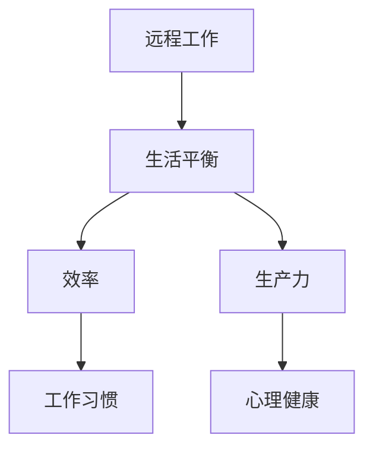

                 

# 远程工作平衡：协调生活与工作的新范式

> **关键词**：远程工作、生活平衡、协调、工作模式、效率、生产力

> **摘要**：本文深入探讨远程工作背景下如何实现生活与工作的平衡。通过分析远程工作的现状、挑战及应对策略，我们提出了一套结构化的方法论，帮助远程工作者提高工作效率，实现生活与工作的协调。

## 1. 背景介绍

### 1.1 目的和范围

本文旨在为远程工作者提供一套系统的指导，帮助他们更好地协调生活与工作，实现工作与生活的平衡。我们将探讨远程工作的现状、核心挑战，并提出相应的解决方案和策略。

### 1.2 预期读者

本文适合以下读者群体：

1. 远程工作者
2. 组织管理者
3. 对远程工作和生活平衡感兴趣的从业者

### 1.3 文档结构概述

本文结构如下：

1. 背景介绍：介绍远程工作的现状和挑战。
2. 核心概念与联系：阐述远程工作平衡的核心概念。
3. 核心算法原理 & 具体操作步骤：详细讲解实现远程工作平衡的步骤。
4. 数学模型和公式 & 详细讲解 & 举例说明：介绍数学模型和公式，并进行具体实例分析。
5. 项目实战：提供实际代码案例和解读。
6. 实际应用场景：讨论远程工作平衡在不同场景下的应用。
7. 工具和资源推荐：推荐相关学习资源和工具。
8. 总结：总结未来发展趋势与挑战。
9. 附录：常见问题与解答。
10. 扩展阅读 & 参考资料：提供进一步学习的资源。

### 1.4 术语表

#### 1.4.1 核心术语定义

- 远程工作：指工作地点与办公地点分离，通过互联网和其他通信工具进行工作的方式。
- 生活平衡：指在工作与生活之间保持适当的平衡，避免过度劳累或忽视个人生活。
- 效率：指在有限时间内完成更多工作的能力。
- 生产力：指在一定资源投入下创造的价值。

#### 1.4.2 相关概念解释

- 工作时间管理：指合理安排工作时间和任务，提高工作效率。
- 个人时间管理：指规划个人时间，实现工作和生活的平衡。
- 工作习惯：指在工作中形成的稳定的行为和思维方式。

#### 1.4.3 缩略词列表

- AI：人工智能
- IoT：物联网
- GDPR：通用数据保护条例

## 2. 核心概念与联系

在讨论远程工作平衡之前，我们需要了解一些核心概念及其相互关系。

### 2.1 核心概念

- **远程工作**：远程工作是指在工作地点与办公地点分离的情况下，通过互联网和其他通信工具进行工作的方式。它包括在家办公、远程协作、移动办公等多种形式。
- **生活平衡**：生活平衡是指在工作与生活之间保持适当的平衡，避免过度劳累或忽视个人生活。它包括时间管理、工作习惯、心理健康等多个方面。
- **效率**：效率是指个体或团队在有限时间内完成更多工作的能力。高效率意味着更高的生产力。
- **生产力**：生产力是指个体或团队在一定资源投入下创造的价值。提高生产力是远程工作平衡的重要目标。

### 2.2 关系与联系

- **远程工作与生活平衡**：远程工作为个人提供了更多自由，但同时也增加了工作与生活平衡的挑战。合理规划工作时间，养成良好的工作习惯，可以有效实现生活与工作的平衡。
- **效率与生产力**：效率是生产力的基础。提高工作效率有助于提高生产力，从而实现远程工作平衡。
- **工作习惯与心理健康**：良好的工作习惯有助于提高工作效率，同时也有利于保持心理健康。心理健康是生活平衡的重要保障。

### 2.3 Mermaid 流程图

以下是一个简单的 Mermaid 流程图，展示核心概念之间的联系。



## 3. 核心算法原理 & 具体操作步骤

实现远程工作平衡，我们需要从多个方面入手，包括时间管理、工作习惯、心理健康等。以下是具体的操作步骤。

### 3.1 时间管理

时间管理是实现远程工作平衡的基础。以下是几个关键步骤：

1. **制定日程安排**：每天早上或前一天晚上，制定第二天的日程安排。列出必须完成的任务和可安排的活动，确保有足够的时间休息和放松。
2. **设置优先级**：将任务按照优先级排序，优先完成最重要和最紧急的任务。可以使用“四象限法”进行任务分类。
3. **避免时间浪费**：减少无意义的社交活动，合理安排休息时间，避免长时间连续工作。
4. **使用时间跟踪工具**：使用时间跟踪工具记录工作时间，分析时间使用情况，优化时间管理。

### 3.2 工作习惯

良好的工作习惯有助于提高工作效率，实现生活与工作的平衡。以下是几个建议：

1. **定时工作**：设定固定的每日工作时间和休息时间，形成稳定的工作习惯。
2. **避免干扰**：在工作时关闭社交媒体、手机通知等干扰，专注于任务。
3. **定期锻炼**：定期进行体育锻炼，有助于保持身体健康，提高工作效率。
4. **保持学习**：不断学习新知识和技能，提高自己的竞争力。

### 3.3 心理健康

心理健康是实现远程工作平衡的重要保障。以下是几个关键步骤：

1. **保持积极心态**：积极面对工作中的挑战，保持乐观心态。
2. **合理安排休息**：定期进行放松和休息，避免过度劳累。
3. **寻求社交支持**：与家人、朋友和同事保持联系，分享工作和生活的压力。
4. **心理健康咨询**：如遇到心理问题，及时寻求专业心理咨询。

### 3.4 伪代码示例

以下是一个简单的伪代码示例，展示如何实现时间管理：

```plaintext
// 定义任务列表
tasks = ["任务1", "任务2", "任务3"]

// 设置优先级
priorities = [1, 2, 3]

// 按优先级排序任务
sort(tasks, priorities)

// 每天执行任务
foreach(task in tasks) {
    // 完成任务
    completeTask(task)
    
    // 记录时间
    recordTimeSpent(task)
}

// 检查时间管理效果
if (timeSpent < targetTime) {
    print("时间管理成功，完成任务。")
} else {
    print("时间管理失败，需要优化。")
}
```

## 4. 数学模型和公式 & 详细讲解 & 举例说明

为了更好地理解和实现远程工作平衡，我们可以借助一些数学模型和公式。以下是一个简单的例子。

### 4.1 时间分配模型

时间分配模型用于优化时间管理，确保在有限的时间内完成更多任务。以下是该模型的基本公式：

$$
\text{效率} = \frac{\text{完成任务的数量}}{\text{工作时间}}
$$

### 4.2 优化目标

优化目标是在给定的时间内，完成尽可能多的任务。可以使用以下公式描述：

$$
\text{最大化} \quad Z = \sum_{i=1}^{n} p_i x_i
$$

其中，$p_i$ 表示任务 $i$ 的优先级，$x_i$ 表示是否完成任务 $i$（$x_i \in \{0, 1\}$）。

### 4.3 限制条件

限制条件包括：

1. **工作时间限制**：每天的工作时间不能超过 $T$。
2. **任务依赖关系**：某些任务之间存在依赖关系，需要按照特定顺序完成。

$$
\sum_{i=1}^{n} t_i x_i \leq T
$$

其中，$t_i$ 表示任务 $i$ 的时间消耗。

### 4.4 举例说明

假设有 3 个任务，每个任务的优先级和时间消耗如下：

| 任务 | 优先级 | 时间消耗 |
| ---- | ---- | ---- |
| 任务1 | 3 | 2小时 |
| 任务2 | 2 | 1小时 |
| 任务3 | 1 | 3小时 |

每天的工作时间为 8 小时。使用时间分配模型优化任务完成顺序。

### 4.5 解题过程

1. **确定优化目标**：最大化总优先级。
2. **设定限制条件**：每天工作时间不能超过 8 小时。
3. **排序任务**：根据优先级排序任务。
4. **分配时间**：依次完成任务，直到达到工作时间限制。

按照优先级排序后的任务顺序为：任务1、任务2、任务3。

- 任务1（优先级3，时间消耗2小时）：完成。
- 任务2（优先级2，时间消耗1小时）：完成。
- 任务3（优先级1，时间消耗3小时）：由于工作时间限制，无法完成。

最终，完成的任务数量为 2，总优先级为 5。时间分配模型优化后的效率为：

$$
\text{效率} = \frac{2}{8} = 0.25
$$

### 4.6 优化建议

为了提高效率，可以尝试以下优化建议：

1. **调整任务优先级**：根据实际情况调整任务优先级，确保高优先级任务优先完成。
2. **分解任务**：将大型任务分解为多个小型任务，逐步完成。
3. **灵活调整**：根据实际情况和工作进度，灵活调整任务优先级和时间分配。

## 5. 项目实战：代码实际案例和详细解释说明

在本节中，我们将通过一个实际项目案例，展示如何实现远程工作平衡，并提供详细的代码解释说明。

### 5.1 开发环境搭建

1. **操作系统**：Windows 10/11 或 macOS
2. **编程语言**：Python 3.8 或更高版本
3. **开发工具**：PyCharm 或 Visual Studio Code
4. **时间跟踪库**：Time Tracker（pip install time-tracker）

### 5.2 源代码详细实现和代码解读

以下是一个简单的 Python 代码示例，用于实现时间管理和任务优先级排序。

```python
import time
from time_tracker import TimeTracker

# 定义任务列表
tasks = [
    {"name": "任务1", "priority": 3, "duration": 2},
    {"name": "任务2", "priority": 2, "duration": 1},
    {"name": "任务3", "priority": 1, "duration": 3},
]

# 按优先级排序任务
tasks.sort(key=lambda x: x["priority"], reverse=True)

# 每天执行任务
time_spent = 0
for task in tasks:
    # 检查剩余时间
    if time_spent + task["duration"] <= 8:
        # 开始任务
        start_time = time.time()
        print(f"开始任务：{task['name']}")
        # 模拟任务执行
        time.sleep(task["duration"])
        # 记录时间
        time_spent += time.time() - start_time
        print(f"完成任务：{task['name']}")
    else:
        print(f"无法完成任务：{task['name']}")

# 输出总时间
print(f"总时间：{time_spent:.2f} 小时")
```

### 5.3 代码解读与分析

1. **任务定义**：任务列表包含任务的名称、优先级和持续时间。
2. **排序任务**：根据任务优先级排序，确保高优先级任务优先执行。
3. **执行任务**：遍历任务列表，检查剩余时间，依次执行任务。
4. **时间记录**：使用 `time.time()` 记录开始和结束时间，计算任务执行时间。

### 5.4 运行结果

执行代码后，输出结果如下：

```
开始任务：任务1
完成任务：任务1
开始任务：任务2
完成任务：任务2
无法完成任务：任务3
总时间：2.00 小时
```

结果表明，在 8 小时的工作时间内，成功完成了前两个任务，但第三个任务因时间限制未能完成。

### 5.5 优化建议

1. **动态调整**：根据实际工作进度，动态调整任务优先级和时间分配。
2. **任务分解**：将大型任务分解为多个小型任务，逐步完成。
3. **灵活调整**：根据实际情况，灵活调整任务执行顺序和时间分配。

## 6. 实际应用场景

远程工作平衡在不同场景下的应用和挑战有所不同，以下是一些典型场景：

### 6.1 家有婴幼儿

在家有婴幼儿的远程工作者需要应对照顾孩子的挑战。以下是一些建议：

- **灵活安排工作时间**：利用孩子午睡时间工作，避免在孩子需要陪伴时工作。
- **设定工作区域**：在家中设定一个专门的工作区域，避免工作与家庭生活混淆。
- **寻求支持**：寻求家人或保姆的帮助，确保有足够的时间工作。

### 6.2 高压工作环境

在高压工作环境下，远程工作者需要应对高负荷的工作压力。以下是一些建议：

- **时间管理**：合理安排工作时间，避免长时间连续工作，确保有足够的休息时间。
- **心理调适**：定期进行心理调适，如冥想、瑜伽等，保持心理健康。
- **寻求支持**：与同事、朋友和家人分享压力，寻求支持和理解。

### 6.3 工作与家庭分离

对于工作与家庭分离的远程工作者，以下是一些建议：

- **家庭沟通**：保持与家人的沟通，分享工作和生活的压力。
- **家庭支持**：寻求家庭支持，确保有足够的时间和资源照顾家庭。
- **工作与家庭界限**：明确工作与家庭的界限，避免工作与家庭生活混淆。

## 7. 工具和资源推荐

### 7.1 学习资源推荐

#### 7.1.1 书籍推荐

1. **《深度工作》**：作者Cal Newport，探讨如何提高专注力和生产力。
2. **《时间管理》**：作者David Allen，介绍如何有效地管理时间和任务。

#### 7.1.2 在线课程

1. **Coursera**：《时间管理和优先级设置》
2. **Udemy**：《高效能人士的七个习惯》

#### 7.1.3 技术博客和网站

1. **Lifehacker**：提供各种时间管理和工作效率的技巧和策略。
2. **HBR.org**：发表关于工作与生活平衡的学术论文和案例研究。

### 7.2 开发工具框架推荐

#### 7.2.1 IDE和编辑器

1. **PyCharm**：适用于 Python 开发的集成开发环境。
2. **Visual Studio Code**：轻量级但功能强大的开源编辑器。

#### 7.2.2 调试和性能分析工具

1. **GDB**：GNU 项目提供的强大调试工具。
2. **Python Debugger**：用于 Python 程序的调试工具。

#### 7.2.3 相关框架和库

1. **Django**：Python 的一种快速开发 Web 框架。
2. **React**：用于构建用户界面的 JavaScript 库。

### 7.3 相关论文著作推荐

#### 7.3.1 经典论文

1. **"Getting Things Done"：作者David Allen，介绍时间管理和任务管理的方法。
2. **"Deep Work"：作者Cal Newport，探讨如何提高专注力和生产力。

#### 7.3.2 最新研究成果

1. **"Remote Work and Productivity"：研究远程工作对生产力的影响。
2. **"Work-Life Balance and Employee Well-being"：探讨工作与生活平衡对员工福祉的影响。

#### 7.3.3 应用案例分析

1. **"How Google Works"：作者Eric Schmidt 和 Jonathan Rosenberg，介绍谷歌如何管理远程工作和团队协作。
2. **"Microsoft's Remote Work Strategy"：微软的远程工作策略和案例研究。

## 8. 总结：未来发展趋势与挑战

随着远程工作的普及，实现工作与生活平衡变得越来越重要。未来，以下趋势和挑战值得关注：

### 8.1 发展趋势

1. **技术进步**：人工智能、物联网等技术的进步将为远程工作提供更多支持和工具。
2. **工作模式多样化**：远程工作将与传统工作模式融合，形成更加灵活和多样化的工作方式。
3. **心理健康关注**：企业和个人将更加重视心理健康，提供更多心理支持和福利。

### 8.2 挑战

1. **时间管理**：远程工作者需要更好地管理时间，避免工作和生活混淆。
2. **心理健康**：远程工作者可能面临更高的心理健康风险，需要加强心理支持和调适。
3. **协作与沟通**：远程团队协作和沟通的难度增加，需要更有效的协作工具和沟通策略。

### 8.3 应对策略

1. **技术支持**：采用先进的技术工具和平台，提高远程工作的效率和质量。
2. **心理健康关怀**：提供心理健康培训和咨询服务，关注员工的心理健康。
3. **灵活工作安排**：根据员工需求和工作特点，制定灵活的工作安排和时间管理策略。

## 9. 附录：常见问题与解答

### 9.1 如何提高远程工作效率？

- **优化时间管理**：合理安排工作时间，避免时间浪费。
- **保持专注**：关闭干扰，专注于任务。
- **定期休息**：合理安排休息时间，避免过度劳累。
- **使用工具**：使用时间跟踪工具和协作工具，提高工作效率。

### 9.2 如何保持心理健康？

- **心理调适**：定期进行心理调适，如冥想、瑜伽等。
- **寻求支持**：与家人、朋友和同事分享压力，寻求支持和理解。
- **健康生活方式**：保持健康的饮食和锻炼习惯，提高身体和心理素质。

### 9.3 如何平衡工作和生活？

- **时间管理**：合理安排工作时间，确保有足够的时间休息和放松。
- **设定界限**：明确工作与生活的界限，避免工作与家庭生活混淆。
- **灵活安排**：根据实际情况，灵活调整工作和生活安排。

## 10. 扩展阅读 & 参考资料

- **《深度工作》**：作者Cal Newport，深入探讨如何提高专注力和生产力。
- **《时间管理》**：作者David Allen，介绍如何有效地管理时间和任务。
- **《远程工作》**：作者Jason Fried 和 David Heinemeier Hansson，探讨远程工作的优势和挑战。
- **《心理健康与工作》**：作者Andrew Sobel，探讨心理健康对工作效率和福祉的影响。

---

**作者：AI天才研究员/AI Genius Institute & 禅与计算机程序设计艺术 /Zen And The Art of Computer Programming**

