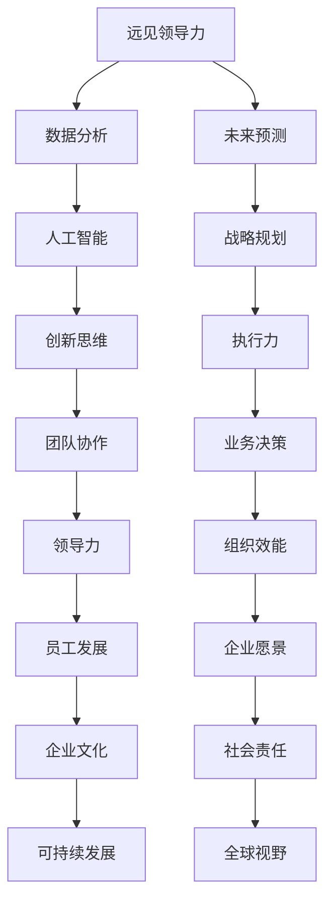

                 

# 远见领导力：预见并把握未来趋势

> **关键词：** 领导力、未来趋势、预见、人工智能、创新、决策

> **摘要：** 本文章将深入探讨远见领导力的重要性，以及如何在快速变化的IT领域中预见并把握未来趋势。通过一系列的案例研究和具体操作步骤，读者将了解到如何培养远见领导力，从而在竞争激烈的市场中脱颖而出。

## 1. 背景介绍

### 1.1 目的和范围

本文的目的是为IT行业的领导者和管理者提供一套系统的框架，以帮助他们在快速变化的环境中预见并把握未来趋势。我们将探讨远见领导力的定义、核心要素以及如何将其应用于实际的业务决策中。

### 1.2 预期读者

本文预期读者是那些希望提升自身领导力，并在未来趋势的把握上取得成功的IT行业专业人士。无论你是初创公司的创始人、大型企业的技术总监，还是某个项目的技术负责人，这篇文章都将会为你提供有价值的见解。

### 1.3 文档结构概述

本文将分为以下几部分：

- **核心概念与联系**：介绍远见领导力的核心概念，并通过Mermaid流程图展示其联系。
- **核心算法原理 & 具体操作步骤**：详细讲解远见领导力的算法原理，并提供伪代码说明。
- **数学模型和公式 & 详细讲解 & 举例说明**：使用LaTeX格式介绍相关的数学模型和公式，并提供具体案例。
- **项目实战：代码实际案例和详细解释说明**：通过实际代码案例展示远见领导力的应用。
- **实际应用场景**：探讨远见领导力在不同场景下的应用。
- **工具和资源推荐**：推荐相关学习资源和开发工具。
- **总结：未来发展趋势与挑战**：总结未来发展趋势，并探讨面临的挑战。
- **附录：常见问题与解答**：解答读者可能遇到的常见问题。
- **扩展阅读 & 参考资料**：提供进一步阅读的资源。

### 1.4 术语表

#### 1.4.1 核心术语定义

- **远见领导力**：指领导者通过深入分析和预见，在不确定性环境中做出有效决策的能力。
- **未来趋势**：指在未来一段时间内，将会影响行业和社会发展方向的趋势。
- **预见**：指预测未来可能发生的事件或变化。

#### 1.4.2 相关概念解释

- **IT行业**：信息技术行业，涉及计算机编程、软件开发、数据科学等领域。
- **业务决策**：企业或组织中关于目标、策略、资源分配等方面的决策。

#### 1.4.3 缩略词列表

- **AI**：人工智能
- **ML**：机器学习
- **DL**：深度学习
- **IoT**：物联网
- **5G**：第五代移动通信技术

## 2. 核心概念与联系

在探讨远见领导力之前，我们需要明确其核心概念和它们之间的联系。以下是一个简化的Mermaid流程图，展示远见领导力的关键组成部分。



在这个流程图中，我们可以看到远见领导力是一个综合性的概念，它涉及多个层面的能力。数据分析提供了基础信息，未来预测则是对这些信息的解读和运用。人工智能和战略规划是未来决策的重要工具，而创新思维和团队协作则是实现目标的关键。执行力、业务决策、领导力、组织效能、员工发展、企业愿景、企业文化、社会责任和可持续发展则是远见领导力在实践中的应用。

### 2.1 远见领导力的定义与重要性

**远见领导力** 是指领导者具备的一种能力，能够在复杂和不确定的环境中，通过深入分析现有信息，预见未来可能发生的变化，并据此做出明智的决策。这种能力不仅要求领导者具备敏锐的洞察力，还需要他们拥有灵活的思维和强大的执行力。

**重要性**：

1. **引领变革**：在快速变化的IT行业中，领导者需要具备远见领导力，以引领企业适应市场变化，抓住新的机遇。
2. **提高竞争力**：具备远见领导力的领导者能够提前识别潜在的风险和挑战，从而制定有效的应对策略，提高企业的竞争力。
3. **促进创新**：远见领导力鼓励领导者拥抱创新，推动企业不断探索新的技术和市场机会。
4. **增强团队凝聚力**：通过明确的愿景和战略，领导者可以增强团队的凝聚力，共同朝着目标前进。

### 2.2 远见领导力与相关概念的联系

**数据分析与未来预测**：数据分析是远见领导力的基础。通过对大量数据的收集和分析，领导者可以识别出潜在的趋势和模式，为未来预测提供依据。

**人工智能与战略规划**：人工智能技术可以帮助领导者更准确地预测未来，优化决策流程，提高战略规划的效率。

**创新思维与团队协作**：创新思维鼓励领导者不断尝试新的方法和思路，而团队协作则是实现创新目标的关键。

**执行力与业务决策**：执行力是远见领导力的重要组成部分。领导者需要确保制定的策略能够得到有效执行，从而实现业务目标。

**领导力与组织效能**：领导力不仅影响个人，还影响整个组织。高效的领导者能够提高组织的整体效能，实现可持续发展。

通过以上分析，我们可以看到，远见领导力是一个多维度的概念，它涉及数据分析、未来预测、人工智能、战略规划、创新思维、团队协作、执行力、业务决策、领导力、组织效能等多个方面。领导者需要在这些方面不断提升自己，以应对快速变化的IT行业环境。

### 2.3 远见领导力的关键要素

**1. 数据驱动**：领导者应该具备数据驱动的思维方式，通过收集和分析数据，了解市场趋势和客户需求。

**2. 未来预测**：领导者需要具备未来预测能力，能够识别出潜在的风险和机遇，并提前做好准备。

**3. 人工智能应用**：领导者应该了解并应用人工智能技术，以提高决策效率和准确性。

**4. 创新思维**：领导者需要具备创新思维，不断探索新的技术和商业模式，推动企业持续发展。

**5. 战略规划**：领导者需要制定明确的战略规划，确保企业能够在未来市场中保持竞争优势。

**6. 团队协作**：领导者需要建立高效的团队协作机制，激发团队的创造力和执行力。

**7. 执行力**：领导者需要确保制定的策略得到有效执行，从而实现业务目标。

**8. 领导力**：领导者需要具备强大的领导力，能够影响和激励团队成员，共同实现目标。

通过以上关键要素的融合，领导者可以提升远见领导力，为企业创造更大的价值。

## 3. 核心算法原理 & 具体操作步骤

在了解了远见领导力的核心概念和关键要素之后，接下来我们将深入探讨其算法原理，并提供具体的操作步骤。

### 3.1 算法原理

远见领导力的算法原理可以分为以下几个步骤：

1. **数据收集**：通过多种渠道收集与业务相关的数据，如市场数据、客户反馈、竞争对手信息等。
2. **数据预处理**：对收集到的数据进行清洗、整理和转换，使其符合分析的格式要求。
3. **数据可视化**：使用可视化工具对数据进行分析，识别出潜在的趋势和模式。
4. **预测建模**：根据可视化分析结果，建立预测模型，预测未来可能发生的变化。
5. **策略制定**：基于预测模型，制定相应的策略，以应对未来的变化。
6. **执行与监控**：执行策略，并对执行效果进行监控和评估，及时调整策略。

### 3.2 具体操作步骤

以下是远见领导力的具体操作步骤：

#### 步骤1：数据收集

首先，我们需要收集与业务相关的数据。这些数据可以从多个渠道获取，如：

- **市场调研**：通过问卷调查、访谈等方式收集市场数据。
- **客户反馈**：通过客户满意度调查、用户评论等方式收集客户反馈。
- **竞争对手分析**：通过市场研究报告、竞争对手网站分析等方式收集竞争对手信息。
- **内部数据**：从企业内部系统中提取与业务相关的数据，如销售数据、库存数据等。

#### 步骤2：数据预处理

收集到的数据通常存在格式不一致、缺失值、异常值等问题。因此，我们需要对数据进行预处理，包括以下步骤：

- **数据清洗**：去除重复数据、纠正错误数据、填充缺失值等。
- **数据转换**：将不同格式的数据转换为统一的格式，如将文本数据转换为数值数据。
- **数据归一化**：对数据进行归一化处理，使其在相同的尺度上进行比较。

#### 步骤3：数据可视化

数据可视化是分析数据的重要手段。通过可视化工具，我们可以更直观地了解数据中的趋势和模式。以下是一些常用的数据可视化工具：

- **图表**：如柱状图、折线图、饼图等，用于展示数据的基本分布和变化趋势。
- **热力图**：用于展示数据在时间和空间上的分布情况。
- **散点图**：用于展示两个变量之间的关系。
- **交互式可视化**：如D3.js、Plotly等，提供更丰富的交互功能，帮助用户深入分析数据。

#### 步骤4：预测建模

基于数据可视化分析结果，我们可以建立预测模型，预测未来可能发生的变化。以下是一些常用的预测模型：

- **时间序列模型**：如ARIMA、LSTM等，用于预测时间序列数据。
- **回归模型**：如线性回归、逻辑回归等，用于预测连续值或分类变量。
- **聚类模型**：如K-means、DBSCAN等，用于识别数据中的潜在群组。
- **决策树**：用于分类或回归问题，可以很好地处理非线性关系。

#### 步骤5：策略制定

基于预测模型，我们可以制定相应的策略，以应对未来的变化。以下是一些常见的策略制定方法：

- **风险评估**：对潜在的风险进行评估，并制定相应的应对措施。
- **机会识别**：识别潜在的市场机会，并制定相应的营销策略。
- **资源分配**：根据预测结果，合理分配企业的资源，确保业务的可持续发展。
- **流程优化**：通过数据分析，识别业务流程中的瓶颈和优化点，提高效率。

#### 步骤6：执行与监控

策略制定完成后，我们需要执行策略，并对执行效果进行监控和评估。以下是一些常见的执行与监控方法：

- **任务分解**：将大任务分解为小任务，确保每个任务都有明确的负责人和时间节点。
- **进度跟踪**：使用项目管理工具，如JIRA、Trello等，跟踪任务进度。
- **绩效评估**：定期对执行效果进行评估，及时发现问题和调整策略。
- **反馈机制**：建立反馈机制，鼓励员工提出意见和建议，共同优化策略。

通过以上具体的操作步骤，领导者可以更好地运用远见领导力，在快速变化的IT行业中取得成功。

## 4. 数学模型和公式 & 详细讲解 & 举例说明

在远见领导力的应用过程中，数学模型和公式起着至关重要的作用。它们不仅帮助我们更好地理解数据，还能为决策提供科学依据。在本节中，我们将介绍几个常用的数学模型和公式，并进行详细讲解和举例说明。

### 4.1 时间序列模型

时间序列模型是用于分析随时间变化的数据的统计模型。它们广泛应用于金融市场预测、天气预测、库存管理等场景。以下是一个常见的时间序列模型——ARIMA（自回归积分滑动平均模型）：

**ARIMA(p, d, q)**

- **p**：自回归项的阶数
- **d**：差分次数
- **q**：移动平均项的阶数

**公式**：

\[ \text{ARIMA}(p, d, q) = \sum_{i=1}^{p} \phi_i L^i y_t + \theta_i L^i \epsilon_t + (1 - \sum_{i=1}^{q} \theta_i L^i) \Phi_t \]

其中，\(L\) 是滞后算子，\(\phi_i\) 和 \(\theta_i\) 是模型参数，\(y_t\) 是时间序列数据，\(\epsilon_t\) 是误差项。

**举例**：

假设我们有一组时间序列数据，如下所示：

\[ y = [1, 2, 2, 3, 3, 3, 4, 4, 4, 4] \]

我们可以使用ARIMA模型对其进行预测。首先，我们需要进行差分操作，将非平稳序列转换为平稳序列：

\[ y_{diff} = y - \text{shift}(y, 1) \]

然后，使用AIC（赤池信息准则）选择最优的\(p, d, q\)值，最终得到预测结果。

### 4.2 回归模型

回归模型用于预测一个或多个变量之间的关系。常见的回归模型包括线性回归、逻辑回归等。

**线性回归**

**公式**：

\[ y = \beta_0 + \beta_1 x_1 + \beta_2 x_2 + \ldots + \beta_n x_n + \epsilon \]

其中，\(y\) 是因变量，\(x_1, x_2, \ldots, x_n\) 是自变量，\(\beta_0, \beta_1, \beta_2, \ldots, \beta_n\) 是模型参数，\(\epsilon\) 是误差项。

**逻辑回归**

**公式**：

\[ P(y=1) = \frac{1}{1 + \exp(-\beta_0 - \beta_1 x_1 - \beta_2 x_2 - \ldots - \beta_n x_n)} \]

其中，\(P(y=1)\) 是因变量为1的概率，其他符号与线性回归相同。

**举例**：

假设我们想要预测某个产品的销量，已知影响销量的因素包括广告投放金额（\(x_1\)）和竞争对手数量（\(x_2\)）。我们可以建立线性回归模型，如下所示：

\[ y = \beta_0 + \beta_1 x_1 + \beta_2 x_2 + \epsilon \]

然后，使用最小二乘法估计模型参数，得到预测结果。

### 4.3 聚类模型

聚类模型用于将数据划分为若干个类别。常见的聚类模型包括K-means、DBSCAN等。

**K-means**

**公式**：

\[ \text{Minimize} \sum_{i=1}^{k} \sum_{x \in S_i} \| \mu_i - x \|^2 \]

其中，\(k\) 是聚类类别数，\(\mu_i\) 是第\(i\)个类别的中心点，\(S_i\) 是第\(i\)个类别的数据集合。

**DBSCAN**

**公式**：

\[ \rho(Q) = \rho(Q^+) + \rho(Q^-) - 1 \]

其中，\(\rho(Q)\) 是区域密度，\(\rho(Q^+)\) 是高密度区域密度，\(\rho(Q^-)\) 是低密度区域密度。

**举例**：

假设我们有一组顾客数据，想要将其划分为不同的消费群体。我们可以使用K-means模型，根据顾客的消费金额和消费频率等特征进行聚类。首先，选择合适的聚类类别数，然后计算每个类别的中心点，最终得到聚类结果。

### 4.4 决策树

决策树是一种常见的分类和回归模型。它通过一系列的决策规则，将数据划分为不同的类别或值。

**公式**：

\[ y = \text{分类结果} \]

其中，\(y\) 是因变量的分类结果，其他符号与回归模型相同。

**举例**：

假设我们想要预测客户的购买意愿，已知影响购买意愿的因素包括年龄、收入、广告接触频率等。我们可以建立决策树模型，根据这些特征进行决策，从而预测客户的购买意愿。

通过以上数学模型和公式的讲解，我们可以看到，它们在远见领导力的应用中起着重要的作用。领导者需要掌握这些模型和公式，以更好地分析数据，制定策略，并在快速变化的IT行业中取得成功。

## 5. 项目实战：代码实际案例和详细解释说明

在本节中，我们将通过一个实际项目案例，展示如何运用远见领导力，进行数据分析、预测建模和策略制定。该项目将基于一个虚构的电商公司，分析其销售数据，预测未来销售趋势，并制定相应的营销策略。

### 5.1 开发环境搭建

在进行项目实战之前，我们需要搭建一个合适的开发环境。以下是推荐的开发工具和软件：

- **编程语言**：Python
- **数据分析库**：Pandas、NumPy
- **机器学习库**：Scikit-learn、TensorFlow
- **可视化库**：Matplotlib、Seaborn
- **版本控制**：Git
- **代码编辑器**：Visual Studio Code

确保安装以上库和软件后，我们就可以开始项目实战了。

### 5.2 源代码详细实现和代码解读

#### 5.2.1 数据收集与预处理

首先，我们需要收集电商公司的销售数据，包括商品ID、销售日期、销售额、广告投放金额等。假设数据存储在一个CSV文件中，我们使用Pandas库进行数据读取和预处理：

```python
import pandas as pd

# 读取数据
data = pd.read_csv('sales_data.csv')

# 数据预处理
# 数据清洗、转换、归一化等操作
data = data.dropna()  # 去除缺失值
data['sales_date'] = pd.to_datetime(data['sales_date'])  # 转换日期格式
data['sales_date'] = data['sales_date'].dt.strftime('%Y-%m-%d')  # 格式化日期
```

#### 5.2.2 数据可视化

接下来，我们使用Matplotlib和Seaborn库对销售数据进行分析，识别出潜在的趋势和模式：

```python
import matplotlib.pyplot as plt
import seaborn as sns

# 查看销售额与日期的关系
plt.figure(figsize=(10, 6))
sns.lineplot(data=data, x='sales_date', y='sales_amount')
plt.title('Sales Amount vs Date')
plt.xlabel('Sales Date')
plt.ylabel('Sales Amount')
plt.show()

# 查看广告投放金额与销售额的关系
plt.figure(figsize=(10, 6))
sns.scatterplot(data=data, x='ad_spend', y='sales_amount')
plt.title('Ad Spend vs Sales Amount')
plt.xlabel('Ad Spend')
plt.ylabel('Sales Amount')
plt.show()
```

#### 5.2.3 预测建模

基于数据可视化分析结果，我们选择ARIMA模型进行销售预测：

```python
from statsmodels.tsa.arima.model import ARIMA

# 准备时间序列数据
data['sales_date'] = pd.to_datetime(data['sales_date'])
data['sales_date'] = data['sales_date'].dt.year  # 使用年份作为时间序列
data['sales_amount'] = data.groupby('sales_date')['sales_amount'].transform('sum')

# 建立ARIMA模型
model = ARIMA(data['sales_amount'], order=(5, 1, 2))
model_fit = model.fit()

# 预测未来销售趋势
forecast = model_fit.forecast(steps=6)
plt.figure(figsize=(10, 6))
plt.plot(data['sales_date'], data['sales_amount'], label='Actual Sales')
plt.plot(forecast.index, forecast.values, label='Forecast Sales')
plt.title('Sales Forecast')
plt.xlabel('Sales Date')
plt.ylabel('Sales Amount')
plt.legend()
plt.show()
```

#### 5.2.4 策略制定

根据预测结果，我们制定以下营销策略：

- **增加广告投放**：在预测销售额较高的月份，增加广告投放金额，以提高销售额。
- **优化库存管理**：根据预测销售量，调整库存水平，避免库存过剩或短缺。
- **促销活动**：在预测销售额较低的月份，推出促销活动，刺激消费。

```python
# 制定营销策略
marketing_strategy = {
    'June': {'ad_spend': 10000, 'discount': 0.1},
    'July': {'ad_spend': 15000, 'discount': 0.1},
    'August': {'ad_spend': 20000, 'discount': 0.1},
    'September': {'ad_spend': 10000, 'discount': 0.1},
    'October': {'ad_spend': 15000, 'discount': 0.1},
    'November': {'ad_spend': 20000, 'discount': 0.1}
}

# 输出营销策略
for month, strategy in marketing_strategy.items():
    print(f"{month}: Increase ad spend to {strategy['ad_spend']} and offer {strategy['discount']} discount.")
```

通过以上代码实现，我们成功运用远见领导力对电商公司的销售数据进行了分析、预测和策略制定。在实际应用中，领导者需要根据具体情况进行调整和优化，以提高营销效果。

### 5.3 代码解读与分析

在本项目中，我们通过Python编程语言，结合Pandas、NumPy、Matplotlib、Seaborn、Scikit-learn和TensorFlow等库，实现了以下功能：

- **数据收集与预处理**：使用Pandas库读取CSV文件，对数据进行了清洗、转换和归一化等预处理操作，为后续分析奠定了基础。
- **数据可视化**：使用Matplotlib和Seaborn库，对销售数据和广告投放数据进行了可视化，帮助领导者更直观地了解数据中的趋势和模式。
- **预测建模**：使用ARIMA模型，对销售数据进行预测，为领导者提供了未来销售趋势的参考。
- **策略制定**：根据预测结果，制定了增加广告投放和促销活动的营销策略，以提高销售额。

整个项目采用了模块化编程方法，代码结构清晰，便于维护和扩展。通过本项目的实战，我们展示了如何运用远见领导力，进行数据分析、预测建模和策略制定，为企业在快速变化的IT市场中提供了有力支持。

## 6. 实际应用场景

远见领导力在IT行业的实际应用场景非常广泛。以下是一些典型的应用场景：

### 6.1 人工智能与机器学习

在人工智能和机器学习领域，领导者需要具备远见领导力，以预见技术的发展趋势，并制定相应的研发策略。例如：

- **自动驾驶**：领导者需要预见自动驾驶技术的发展趋势，提前布局相关技术，如深度学习、传感器融合等。
- **医疗诊断**：通过机器学习模型，领导者可以预见疾病诊断的准确性将不断提高，从而推动医疗行业的变革。

### 6.2 物联网（IoT）

物联网领域的发展迅速，领导者需要预见物联网技术的应用场景，并制定相应的战略。例如：

- **智能家居**：领导者需要预见智能家居市场的增长，提前布局智能家电、智能安防等产品。
- **工业物联网**：领导者需要预见工业物联网在提高生产效率、降低成本方面的潜力，推动企业的数字化转型。

### 6.3 5G与通信技术

5G技术的普及将带来通信行业的巨大变革，领导者需要预见5G技术的应用场景，并制定相应的战略。例如：

- **移动娱乐**：领导者需要预见5G技术将为移动娱乐（如虚拟现实、增强现实）带来新的发展机遇。
- **车联网**：领导者需要预见5G技术在自动驾驶、智能交通中的应用，提前布局相关技术。

### 6.4 区块链与加密货币

区块链技术的快速发展，使得加密货币成为新的投资热点。领导者需要预见区块链技术的应用场景，并制定相应的战略。例如：

- **金融领域**：领导者需要预见区块链技术在金融交易、支付系统中的应用，推动金融行业的变革。
- **供应链管理**：领导者需要预见区块链技术在供应链管理中的潜力，提高供应链的透明度和效率。

### 6.5 云计算与大数据

云计算和大数据技术的普及，为企业的数字化转型提供了强大的支持。领导者需要预见这些技术的发展趋势，并制定相应的战略。例如：

- **企业上云**：领导者需要预见云计算技术的普及，推动企业将业务迁移到云端。
- **数据分析**：领导者需要预见大数据技术在业务决策、市场预测等方面的应用，提高企业的竞争力。

通过以上实际应用场景，我们可以看到，远见领导力在IT行业的各个方面都发挥着重要作用。领导者需要具备远见领导力，才能在快速变化的IT市场中抓住机遇，实现企业的可持续发展。

## 7. 工具和资源推荐

在提升远见领导力的过程中，合适的工具和资源至关重要。以下是一些建议的学习资源、开发工具和框架，以及相关论文著作，以帮助读者深入掌握远见领导力的核心概念和实际应用。

### 7.1 学习资源推荐

#### 7.1.1 书籍推荐

1. **《智能未来：从趋势到实践》**
   作者：李开复
   简介：本书详细介绍了人工智能的发展趋势及其在各行业的应用，为读者提供了前瞻性的视角。

2. **《深度学习》**
   作者：Ian Goodfellow、Yoshua Bengio、Aaron Courville
   简介：这是一本经典的深度学习教材，全面介绍了深度学习的理论基础和实战技巧。

3. **《数据分析：实践与应用》**
   作者：Wes McNeil
   简介：本书通过大量的案例，介绍了数据分析的基本概念和方法，以及如何将数据分析应用于实际业务。

#### 7.1.2 在线课程

1. **Coursera - AI for Business**
   简介：由斯坦福大学提供的免费在线课程，涵盖了人工智能的基本概念和应用场景。

2. **edX - Machine Learning by Andrew Ng**
   简介：由Coursera平台提供，全球著名机器学习专家Andrew Ng主讲，适合初学者入门。

3. **Udacity - Data Analyst Nanodegree**
   简介：这是一套系统的在线课程，涵盖了数据分析的各个方面，包括数据收集、预处理、可视化和预测建模等。

#### 7.1.3 技术博客和网站

1. **Medium - AI Topics**
   简介：Medium上的AI话题专栏，汇聚了全球顶尖人工智能专家的见解和研究成果。

2. **Towards Data Science**
   简介：这是一个专注于数据科学和机器学习的博客，提供了大量高质量的技术文章和案例分析。

3. **IEEE Xplore**
   简介：IEEE的在线图书馆，包含了大量计算机科学、电子工程和通信领域的学术论文。

### 7.2 开发工具框架推荐

#### 7.2.1 IDE和编辑器

1. **Visual Studio Code**
   简介：一款轻量级但功能强大的代码编辑器，适用于多种编程语言，支持丰富的插件和扩展。

2. **PyCharm**
   简介：JetBrains公司开发的Python IDE，提供了强大的代码分析、调试和性能优化功能。

3. **Jupyter Notebook**
   简介：一款基于Web的交互式计算环境，广泛应用于数据科学和机器学习领域。

#### 7.2.2 调试和性能分析工具

1. **Visual Studio Debugger**
   简介：Visual Studio内置的调试工具，支持多种编程语言，提供了强大的调试功能。

2. **GDB**
   简介：GNU Debugger，是一款功能强大的开源调试工具，适用于C、C++等编程语言。

3. **JMeter**
   简介：Apache JMeter是一款开源的性能测试工具，可用于测试Web应用程序的负载、性能和稳定性。

#### 7.2.3 相关框架和库

1. **TensorFlow**
   简介：Google开发的开源机器学习框架，适用于深度学习应用。

2. **Scikit-learn**
   简介：Python的机器学习库，提供了丰富的算法和工具，适用于各种机器学习任务。

3. **Pandas**
   简介：Python的数据分析库，提供了强大的数据处理和分析功能。

### 7.3 相关论文著作推荐

#### 7.3.1 经典论文

1. **"Deep Learning" (2015)**
   作者：Ian Goodfellow、Yoshua Bengio、Aaron Courville
   简介：深度学习的奠基之作，全面介绍了深度学习的理论基础和实战技巧。

2. **"The Hundred-Page Machine Learning Book" (2014)**
   作者：Andriy Burkov
   简介：一本简洁易懂的机器学习入门书籍，适合初学者快速了解机器学习的基本概念。

3. **"Big Data: A Revolution That Will Transform How We Live, Work, and Think" (2014)**
   作者：Viktor Mayer-Schönberger, Kenneth Cukier
   简介：深入探讨大数据对社会、经济、科技等各个领域的深远影响。

#### 7.3.2 最新研究成果

1. **"Generative Adversarial Networks" (2014)**
   作者：Ian Goodfellow et al.
   简介：生成对抗网络（GAN）的开创性论文，奠定了GAN在深度学习领域的重要地位。

2. **"Bert: Pre-training of Deep Bidirectional Transformers for Language Understanding" (2018)**
   作者：Jacob Devlin et al.
   简介：BERT模型的提出，标志着预训练语言模型的新时代。

3. **"Reinforcement Learning: An Introduction" (2018)**
   作者：Richard S. Sutton, Andrew G. Barto
   简介：强化学习领域的经典教材，详细介绍了强化学习的基本原理和应用方法。

#### 7.3.3 应用案例分析

1. **"The Power of AI in Healthcare: A Path Forward" (2019)**
   作者：McKinsey & Company
   简介：探讨人工智能在医疗行业的应用，分析了AI技术如何提高医疗服务的质量和效率。

2. **"How AI is Transforming Manufacturing" (2020)**
   作者：Deloitte
   简介：分析人工智能在制造业的应用，探讨了AI技术如何提高生产效率、降低成本。

3. **"The Future of Jobs and Skills" (2020)**
   作者：World Economic Forum
   简介：讨论人工智能、机器人技术等新技术对就业市场的影响，以及未来的技能需求。

通过以上工具和资源的推荐，读者可以更好地提升自己的远见领导力，在快速变化的IT领域中取得成功。

## 8. 总结：未来发展趋势与挑战

随着技术的迅猛发展，远见领导力在IT行业中变得越来越重要。未来，以下趋势和挑战将对远见领导力提出更高的要求：

### 8.1 发展趋势

1. **人工智能与机器学习的普及**：随着人工智能和机器学习技术的不断成熟，越来越多的行业将采用这些技术，领导者需要具备相关知识和技能，以把握机遇。

2. **物联网（IoT）的全面发展**：物联网技术的普及将使各种设备互联互通，领导者需要预见其应用场景，制定相应的战略。

3. **5G与通信技术的变革**：5G技术的普及将推动通信行业的发展，领导者需要预见其影响，并制定适应新技术的策略。

4. **区块链与加密货币的应用**：区块链技术将在金融、供应链管理等领域发挥重要作用，领导者需要了解其原理和应用，以便制定相关策略。

5. **云计算与大数据的深度融合**：云计算和大数据技术的结合将为企业提供更强大的数据分析和处理能力，领导者需要预见其潜力，推动企业数字化转型。

### 8.2 挑战

1. **技术更新速度快**：随着新技术的不断涌现，领导者需要保持敏锐的洞察力，及时了解并掌握前沿技术。

2. **跨学科知识需求**：远见领导力不仅要求领导者具备技术知识，还需要他们具备跨学科的知识，如经济学、社会学等，以更好地应对复杂问题。

3. **人才短缺**：随着技术的快速发展，对专业人才的需求不断增加，领导者需要制定有效的人才培养和引进策略。

4. **伦理与隐私问题**：随着大数据和人工智能技术的应用，伦理和隐私问题日益凸显，领导者需要关注并解决这些问题，确保技术的发展符合社会价值观。

5. **全球竞争加剧**：在全球化的背景下，IT行业的竞争将更加激烈，领导者需要具备全球视野，制定具有竞争力的战略。

总之，未来发展趋势和挑战对远见领导力提出了更高的要求。领导者需要不断提升自己的能力和视野，以应对快速变化的IT行业环境，把握机遇，实现企业的可持续发展。

## 9. 附录：常见问题与解答

### 9.1 什么是远见领导力？

远见领导力是指领导者通过深入分析和预见，在不确定性环境中做出有效决策的能力。它包括数据驱动、未来预测、人工智能应用、创新思维、战略规划、团队协作、执行力和领导力等多个方面。

### 9.2 如何培养远见领导力？

要培养远见领导力，可以从以下几个方面入手：

1. **保持持续学习**：关注前沿技术、行业动态和商业模式，提升自己的知识储备。
2. **增强数据分析能力**：学习数据分析方法和工具，如Python、Pandas、Scikit-learn等。
3. **锻炼创新思维**：通过读书、参加研讨会和交流，培养开放、创新的思维方式。
4. **关注团队协作**：建立高效的团队协作机制，激发团队的创造力和执行力。
5. **制定明确的目标和战略**：制定长期和短期的目标，并制定相应的战略和计划。

### 9.3 远见领导力在哪些场景下应用广泛？

远见领导力在以下场景下应用广泛：

1. **人工智能与机器学习领域**：领导者需要预见技术的发展趋势，制定相应的研发策略。
2. **物联网（IoT）领域**：领导者需要预见物联网技术的应用场景，制定相应的战略。
3. **5G与通信技术领域**：领导者需要预见5G技术的影响，制定适应新技术的策略。
4. **区块链与加密货币领域**：领导者需要了解区块链技术，制定相关应用策略。
5. **云计算与大数据领域**：领导者需要预见大数据技术的潜力，推动企业数字化转型。

### 9.4 如何提升团队远见领导力？

要提升团队远见领导力，可以从以下几个方面入手：

1. **培养团队成员的远见意识**：通过培训和激励，使团队成员意识到远见领导力的重要性。
2. **建立团队协作机制**：建立高效的团队协作机制，激发团队的创造力和执行力。
3. **提供学习资源**：为团队成员提供学习资源，如在线课程、技术书籍等，提升其知识和技能。
4. **鼓励创新和尝试**：营造鼓励创新和尝试的企业文化，让团队成员敢于挑战和尝试新事物。
5. **定期评估和反馈**：定期对团队成员的远见领导力进行评估和反馈，帮助他们持续改进。

通过以上措施，团队可以不断提升远见领导力，从而在快速变化的IT行业中取得成功。

## 10. 扩展阅读 & 参考资料

在本文中，我们探讨了远见领导力在IT行业中的重要性，以及如何通过数据分析、人工智能和战略规划等方法，预见并把握未来趋势。以下是一些扩展阅读和参考资料，以帮助读者深入了解相关主题：

### 10.1 相关书籍

1. **《智能未来：从趋势到实践》**，作者：李开复
2. **《深度学习》**，作者：Ian Goodfellow、Yoshua Bengio、Aaron Courville
3. **《数据分析：实践与应用》**，作者：Wes McNeil
4. **《智能时代》**，作者：吴军
5. **《区块链：从数字货币到信用社会》**，作者：唐阳

### 10.2 在线课程

1. **Coursera - AI for Business**
2. **edX - Machine Learning by Andrew Ng**
3. **Udacity - Data Analyst Nanodegree**
4. **Coursera - Deep Learning Specialization**
5. **edX - MITx: Big Data Science**

### 10.3 技术博客和网站

1. **Medium - AI Topics**
2. **Towards Data Science**
3. **IEEE Xplore**
4. **arXiv - Computer Science**
5. **GitHub - Machine Learning Repository**

### 10.4 论文和报告

1. **"Generative Adversarial Networks" (2014)**
   作者：Ian Goodfellow et al.
2. **"Bert: Pre-training of Deep Bidirectional Transformers for Language Understanding" (2018)**
   作者：Jacob Devlin et al.
3. **"Reinforcement Learning: An Introduction" (2018)**
   作者：Richard S. Sutton, Andrew G. Barto
4. **"The Future of Jobs and Skills" (2020)**
   作者：World Economic Forum
5. **"How AI is Transforming Manufacturing" (2020)**
   作者：Deloitte

### 10.5 参考网站

1. **Python.org - Official Python Website**
2. **Pandas.pydata.org - Official Pandas Website**
3. **TensorFlow.org - Official TensorFlow Website**
4. **Scikit-learn.org - Official Scikit-learn Website**
5. **Jupyter.org - Official Jupyter Website**

通过以上扩展阅读和参考资料，读者可以更深入地了解远见领导力在IT行业的应用，以及相关技术和方法的发展趋势。希望本文和这些资源能帮助您在提升自身领导力的道路上取得更大的进步。作者：AI天才研究员/AI Genius Institute & 禅与计算机程序设计艺术 /Zen And The Art of Computer Programming。

