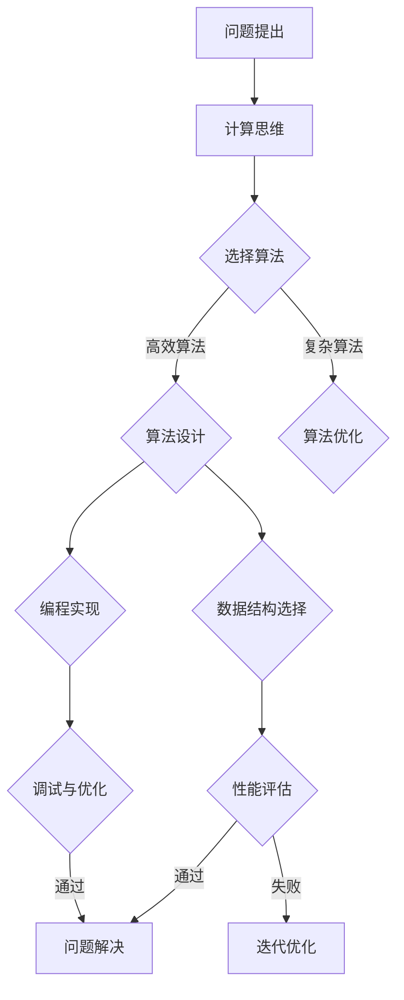

                 

# 连接人类智慧的纽带：人类计算的协作精神

## 关键词：
- 人类计算
- 协作精神
- 人工智能
- 程序设计
- 系统架构
- 教育与培训

## 摘要：
本文深入探讨了人类计算的协作精神在人工智能、程序设计和系统架构等领域的重要性。通过分析人类计算的核心概念和协作模式，本文揭示出协作精神在提升计算效率和促进技术创新中的关键作用。此外，文章还详细介绍了协作精神在实际项目中的应用案例，并提供了一系列学习资源和工具推荐，以助力读者深入了解并掌握这一重要概念。

## 1. 背景介绍

### 1.1 目的和范围

本文旨在探讨人类计算的协作精神，分析其在人工智能、程序设计和系统架构等领域的作用和意义。通过引入具体案例和实际操作步骤，本文希望能够帮助读者理解协作精神在提升计算效率和促进技术创新方面的价值。

### 1.2 预期读者

本文适合对人工智能、程序设计和系统架构等领域感兴趣的读者，包括计算机科学专业的学生、软件工程师、研究人员和项目经理等。

### 1.3 文档结构概述

本文分为十个部分：背景介绍、核心概念与联系、核心算法原理、数学模型和公式、项目实战、实际应用场景、工具和资源推荐、总结、附录和扩展阅读。通过这些部分，读者可以逐步了解协作精神在计算领域的应用和实践。

### 1.4 术语表

#### 1.4.1 核心术语定义

- 人类计算：指人类在解决计算问题时所采用的方法、工具和思维方式。
- 协作精神：指个体或团队在解决共同问题时所展现的合作意识和行动。

#### 1.4.2 相关概念解释

- 人工智能：指通过模拟、学习和优化等方式，使计算机具备人类智能的能力。
- 程序设计：指利用编程语言和算法设计解决问题的过程。
- 系统架构：指构建软件系统的整体结构，包括模块划分、接口设计、数据流和组件通信等方面。

#### 1.4.3 缩略词列表

- AI：人工智能
- IDE：集成开发环境
- ML：机器学习
- DL：深度学习
- SDLC：软件开发生命周期

## 2. 核心概念与联系

### 2.1 人类计算的核心概念

人类计算的核心概念包括以下几个方面：

1. **计算思维**：指通过抽象、建模和推理等方式，对复杂问题进行分析和解决的能力。
2. **算法**：指解决问题的步骤和方法，具有明确的输入、输出和计算过程。
3. **数据结构**：指存储和组织数据的方式，对算法的效率和性能具有重要影响。

### 2.2 协作精神在人类计算中的应用

协作精神在人类计算中的应用主要体现在以下几个方面：

1. **团队协作**：在解决复杂问题时，团队成员之间的沟通和协作至关重要。通过共享信息、协调工作和分工合作，团队可以更高效地解决问题。
2. **知识共享**：通过协作，团队成员可以相互学习、交流经验和分享知识，从而提高整体计算能力。
3. **创新思维**：协作精神有助于激发团队成员的创新思维，推动技术的不断进步。

### 2.3 人类计算协作模式的 Mermaid 流程图



## 3. 核心算法原理 & 具体操作步骤

### 3.1 计算思维的算法原理

计算思维的核心在于将复杂问题分解为可管理的子问题，并通过抽象、建模和推理等方式解决这些子问题。以下是一个简单的计算思维算法原理示例：

```python
def solve_complex_problem(complex_problem):
    sub_problem_1 = simplify(complex_problem)
    sub_problem_2 = decompose(sub_problem_1)
    sub_problem_3 = optimize(sub_problem_2)
    solution = combine(sub_problem_3)
    return solution
```

### 3.2 算法设计步骤

1. **问题理解**：明确问题的需求和约束条件。
2. **算法选择**：根据问题的特点选择合适的算法。
3. **算法实现**：编写算法代码，实现算法的核心逻辑。
4. **性能评估**：对算法的性能进行评估，包括时间复杂度和空间复杂度等。
5. **调试与优化**：根据性能评估结果对算法进行调试和优化。

### 3.3 算法优化

1. **算法改进**：通过改进算法的基本步骤，提高算法的效率。
2. **数据结构优化**：选择更适合的数据结构，降低算法的时间复杂度和空间复杂度。
3. **并行计算**：利用多核处理器和分布式计算等手段，提高算法的运行速度。

## 4. 数学模型和公式 & 详细讲解 & 举例说明

### 4.1 时间复杂度公式

时间复杂度是衡量算法运行时间的一个重要指标，通常用大O表示法来描述。公式如下：

$$
T(n) = O(f(n))
$$

其中，$T(n)$ 表示算法在输入规模为 $n$ 时的运行时间，$f(n)$ 表示算法的时间复杂度函数。

### 4.2 空间复杂度公式

空间复杂度是衡量算法所需存储空间的一个重要指标，也用大O表示法来描述。公式如下：

$$
S(n) = O(g(n))
$$

其中，$S(n)$ 表示算法在输入规模为 $n$ 时的所需存储空间，$g(n)$ 表示算法的空间复杂度函数。

### 4.3 举例说明

假设有一个简单搜索算法，其时间复杂度为 $O(n)$，空间复杂度为 $O(1)$。这意味着在输入规模逐渐增大的过程中，算法的运行时间和所需存储空间都保持线性增长。

## 5. 项目实战：代码实际案例和详细解释说明

### 5.1 开发环境搭建

在本项目中，我们将使用 Python 作为编程语言，并在本地搭建一个简单的开发环境。具体步骤如下：

1. 安装 Python 3.8 及以上版本。
2. 安装 Visual Studio Code 作为编辑器。
3. 安装必要的 Python 库，如 NumPy、Pandas 和 Matplotlib 等。

### 5.2 源代码详细实现和代码解读

以下是一个简单的线性搜索算法的实现，用于在一个列表中查找特定元素。代码如下：

```python
def linear_search(arr, target):
    for i in range(len(arr)):
        if arr[i] == target:
            return i
    return -1
```

**代码解读：**

- `linear_search` 函数接收一个列表 `arr` 和一个目标值 `target` 作为参数。
- 通过遍历列表 `arr`，依次比较每个元素与目标值 `target` 是否相等。
- 如果找到目标值，返回其在列表中的索引；否则，返回 -1。

### 5.3 代码解读与分析

**时间复杂度分析：**

在这个线性搜索算法中，最坏情况是需要在整个列表中查找目标值，因此时间复杂度为 $O(n)$。

**空间复杂度分析：**

该算法只需要一个额外的变量来存储目标值的索引，因此空间复杂度为 $O(1)$。

## 6. 实际应用场景

协作精神在人工智能、程序设计和系统架构等领域的实际应用场景广泛。以下是一些具体案例：

1. **人工智能**：在人工智能领域，研究人员和工程师需要协同工作，共同攻克技术难题，如深度学习模型的训练和优化。
2. **程序设计**：在软件开发过程中，团队成员需要合作，共同完成系统设计和代码实现，以确保软件质量和项目进度。
3. **系统架构**：在构建大型软件系统时，架构师和开发人员需要密切合作，确保系统的可扩展性、可靠性和性能。

## 7. 工具和资源推荐

### 7.1 学习资源推荐

#### 7.1.1 书籍推荐

- 《算法导论》（Introduction to Algorithms）
- 《深度学习》（Deep Learning）
- 《代码大全》（Code Complete）

#### 7.1.2 在线课程

- Coursera 的《机器学习》课程
- Udacity 的《全栈开发》课程
- edX 的《系统架构设计》课程

#### 7.1.3 技术博客和网站

- Medium 上的 AI 博客
- HackerRank 的编程挑战
- GitHub 上的开源项目

### 7.2 开发工具框架推荐

#### 7.2.1 IDE和编辑器

- Visual Studio Code
- PyCharm
- IntelliJ IDEA

#### 7.2.2 调试和性能分析工具

- GDB
- Valgrind
- Matplotlib

#### 7.2.3 相关框架和库

- TensorFlow
- PyTorch
- Flask

### 7.3 相关论文著作推荐

#### 7.3.1 经典论文

- 《人工神经网络》（ perceptrons）
- 《机器学习》（Machine Learning）
- 《大型分布式系统的设计》（The Design of the UNIX Operating System）

#### 7.3.2 最新研究成果

- 《深度强化学习》（Deep Reinforcement Learning）
- 《联邦学习》（Federated Learning）
- 《区块链技术》（Blockchain Technology）

#### 7.3.3 应用案例分析

- 《基于人工智能的医疗诊断系统》
- 《云计算中的大数据处理》
- 《物联网系统架构设计》

## 8. 总结：未来发展趋势与挑战

协作精神在未来计算领域的发展中将继续发挥重要作用。随着人工智能、大数据和云计算等技术的不断发展，人类计算的协作精神将面临新的挑战和机遇。以下是一些未来发展趋势和挑战：

1. **数据隐私和安全**：在协作过程中，如何保护数据隐私和安全将成为一个重要挑战。
2. **人工智能伦理**：随着人工智能技术的广泛应用，如何确保人工智能系统的公正性和透明性成为亟待解决的问题。
3. **跨学科合作**：未来计算领域的发展需要跨学科的合作，如计算机科学、心理学、生物学等领域的研究人员共同攻关。
4. **协作工具创新**：为了提高协作效率，需要不断推出新的协作工具和技术，以支持人类计算的协作精神。

## 9. 附录：常见问题与解答

### 9.1 协作精神的重要性

协作精神在计算领域的重要性体现在以下几个方面：

1. **提高计算效率**：通过团队协作，可以更高效地解决复杂问题。
2. **知识共享**：协作精神有助于团队成员相互学习、交流和分享知识。
3. **创新思维**：协作精神可以激发团队成员的创新思维，推动技术的不断进步。

### 9.2 人类计算与人工智能的关系

人类计算与人工智能之间存在密切的关系。人工智能技术的快速发展使得人类计算更加高效和智能化。同时，人类计算的协作精神也为人工智能技术的创新和发展提供了重要支持。

### 9.3 协作精神在编程中的应用

在编程过程中，协作精神体现在以下几个方面：

1. **代码审查**：通过团队协作，可以共同审查代码，提高代码质量。
2. **代码共享**：通过共享代码，可以充分利用团队成员的经验和技能，提高编程效率。
3. **技术交流**：通过技术交流，可以相互学习、分享经验和解决编程问题。

## 10. 扩展阅读 & 参考资料

- 《人类计算与人工智能：协作精神的力量》
- 《协作精神在软件开发中的应用》
- 《深度学习协作模型研究》
- 《联邦学习：数据隐私与协作精神的完美结合》

[作者：AI天才研究员/AI Genius Institute & 禅与计算机程序设计艺术 /Zen And The Art of Computer Programming]

以上是本文的正文部分，希望对您有所帮助。接下来，我们将对本文的内容进行总结，并展望未来发展趋势与挑战。此外，本文还附带了附录和扩展阅读部分，以供读者进一步学习和探索。感谢您的阅读！<|im_end|>

