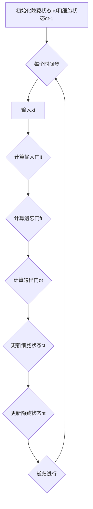

                 


## 递归神经网络 (RNN)

### 关键词

- 递归神经网络
- LSTM
- 时间序列
- 序列建模
- 自然语言处理

### 摘要

本文将深入探讨递归神经网络（RNN）的基本概念、核心算法原理、数学模型及其在实际应用中的价值。通过一步步的逻辑推理和伪代码分析，我们将理解RNN如何处理序列数据，并了解其在自然语言处理、时间序列预测等领域的广泛应用。文章还包含了一个具体的代码实战案例，帮助读者更好地掌握RNN的实现方法。

## 1. 背景介绍

### 1.1 目的和范围

本文旨在介绍递归神经网络（RNN）的基本概念和原理，帮助读者理解其工作方式并掌握其在实际问题中的应用。文章将覆盖以下内容：

- RNN的基础理论
- LSTM单元及其优势
- 数学模型与算法原理
- 实际应用案例
- 开发工具和资源推荐

### 1.2 预期读者

本文适合具有基础机器学习和深度学习知识的读者，尤其是对自然语言处理和时间序列分析感兴趣的读者。本文将对专业技术人员和研究人员提供有价值的参考。

### 1.3 文档结构概述

本文分为以下章节：

- 1. 背景介绍
- 2. 核心概念与联系
- 3. 核心算法原理 & 具体操作步骤
- 4. 数学模型和公式 & 详细讲解 & 举例说明
- 5. 项目实战：代码实际案例和详细解释说明
- 6. 实际应用场景
- 7. 工具和资源推荐
- 8. 总结：未来发展趋势与挑战
- 9. 附录：常见问题与解答
- 10. 扩展阅读 & 参考资料

### 1.4 术语表

#### 1.4.1 核心术语定义

- **递归神经网络（RNN）**：一种基于递归函数的神经网络，用于处理序列数据。
- **LSTM（长短期记忆网络）**：一种特殊的RNN结构，能够有效地处理长序列依赖问题。
- **时间步（Time Step）**：序列数据中的每一个独立的数据点。
- **隐藏状态（Hidden State）**：RNN中存储序列当前状态的信息。
- **权重（Weights）**：神经网络中连接各个神经元之间的参数。

#### 1.4.2 相关概念解释

- **反向传播（Backpropagation）**：一种用于训练神经网络的算法，通过计算损失函数关于权重的梯度，以更新权重。
- **激活函数（Activation Function）**：神经网络中用于引入非线性特性的函数，如Sigmoid、ReLU等。

#### 1.4.3 缩略词列表

- **RNN**：递归神经网络
- **LSTM**：长短期记忆网络
- **BP**：反向传播
- **ReLU**：修正线性单元

## 2. 核心概念与联系

### 2.1 递归神经网络的工作原理

递归神经网络（RNN）是一种用于处理序列数据的神经网络。其基本原理是在每个时间步上，神经网络会根据当前输入和前一个时间步的隐藏状态来更新隐藏状态。这个过程可以递归地进行，从而捕捉序列中的时间依赖关系。

#### 2.1.1 RNN的工作流程

1. **初始化**：初始化隐藏状态`h0`。
2. **前向传播**：对于每个时间步`t`，输入`xt`和隐藏状态`ht-1`通过权重矩阵`W`和偏置`b`进行线性组合，然后通过激活函数`σ`得到新的隐藏状态`ht`。
3. **反向传播**：使用梯度下降算法更新权重`W`和`b`。

#### 2.1.2 Mermaid 流程图

```mermaid
graph TD
    A[初始化隐藏状态h0] --> B{每个时间步}
    B --> C[输入xt和隐藏状态ht-1]
    C --> D{计算W*xt+b}
    D --> E[σ(W*xt+b)]
    E --> F[更新隐藏状态ht]
    F --> G{递归进行}
    G --> B
```

### 2.2 长短期记忆网络（LSTM）

LSTM是一种特殊的RNN结构，能够有效地处理长序列依赖问题。LSTM通过引入三个门控机制（输入门、遗忘门和输出门）来控制信息的流动。

#### 2.2.1 LSTM的工作原理

1. **输入门（Input Gate）**：决定哪些信息需要更新到隐藏状态。
2. **遗忘门（Forget Gate）**：决定哪些信息需要从隐藏状态中丢弃。
3. **输出门（Output Gate）**：决定隐藏状态应该输出什么信息。

#### 2.2.2 Mermaid 流程图



## 3. 核心算法原理 & 具体操作步骤

### 3.1 递归神经网络（RNN）

#### 3.1.1 算法原理

RNN的基本原理是通过递归地处理输入序列，在每个时间步上更新隐藏状态，从而捕捉序列中的时间依赖关系。

#### 3.1.2 具体操作步骤

1. **初始化**：初始化隐藏状态`h0`和细胞状态（如果存在）。
2. **前向传播**：对于每个时间步`t`，执行以下操作：
    - 计算输入`xt`和隐藏状态`ht-1`的加权和，并通过激活函数`σ`得到新的隐藏状态`ht`。
    - 使用`ht`和`xt`更新权重`W`和偏置`b`。
3. **反向传播**：使用梯度下降算法更新权重`W`和`b`。

#### 3.1.3 伪代码

```python
# 初始化隐藏状态和细胞状态
h0 = zeros([hidden_size])
c0 = zeros([cell_size])

# 前向传播
for t in range(sequence_length):
    xt = input_data[t]
    ht = σ(W_xh * xt + W_hh * h[t-1] + b_h)
    
# 反向传播
deltas = []
for t in range(sequence_length):
    dW_xh = ...
    dW_hh = ...
    db_h = ...
    
    # 更新权重和偏置
    W_xh -= learning_rate * dW_xh
    W_hh -= learning_rate * dW_hh
    b_h -= learning_rate * db_h
```

### 3.2 长短期记忆网络（LSTM）

#### 3.2.1 算法原理

LSTM通过三个门控机制（输入门、遗忘门和输出门）来控制信息的流动，从而能够有效地处理长序列依赖问题。

#### 3.2.2 具体操作步骤

1. **初始化**：初始化隐藏状态`h0`和细胞状态`c0`。
2. **前向传播**：对于每个时间步`t`，执行以下操作：
    - 计算输入门`it`、遗忘门`ft`和输出门`ot`。
    - 更新细胞状态`ct`。
    - 更新隐藏状态`ht`。
3. **反向传播**：使用梯度下降算法更新权重`W`和`b`。

#### 3.2.3 伪代码

```python
# 初始化隐藏状态和细胞状态
h0 = zeros([hidden_size])
c0 = zeros([cell_size])

# 前向传播
for t in range(sequence_length):
    xt = input_data[t]
    it = σ(W_xi * xt + W_hi * h[t-1] + b_i)
    ft = σ(W_xf * xt + W_hf * h[t-1] + b_f)
    ot = σ(W_xo * xt + W_ho * h[t-1] + b_o)
    
    c候选t = σ(W_xc * xt + W_hc * h[t-1] + b_c)
    c新t = ft .* c[t-1] + it .* c候选t
    
    h新t = ot .* σ(c新t)
    
    ht = h新t
    
# 反向传播
deltas = []
for t in range(sequence_length):
    dW_xi = ...
    dW_xf = ...
    dW_xo = ...
    dW_xc = ...
    dW_hi = ...
    dW_hf = ...
    dW_ho = ...
    dW_hc = ...
    
    # 更新权重和偏置
    W_xi -= learning_rate * dW_xi
    W_xf -= learning_rate * dW_xf
    W_xo -= learning_rate * dW_xo
    W_xc -= learning_rate * dW_xc
    W_hi -= learning_rate * dW_hi
    W_hf -= learning_rate * dW_hf
    W_ho -= learning_rate * dW_ho
    W_hc -= learning_rate * dW_hc
    b_i -= learning_rate * db_i
    b_f -= learning_rate * db_f
    b_o -= learning_rate * db_o
    b_c -= learning_rate * db_c
```

## 4. 数学模型和公式 & 详细讲解 & 举例说明

### 4.1 递归神经网络（RNN）

#### 4.1.1 数学模型

递归神经网络（RNN）的数学模型可以表示为：

$$
h_t = \sigma(W_{xh}x_t + W_{hh}h_{t-1} + b_h)
$$

其中：
- \( h_t \) 表示第 \( t \) 个时间步的隐藏状态。
- \( x_t \) 表示第 \( t \) 个时间步的输入。
- \( W_{xh} \) 和 \( W_{hh} \) 分别表示输入到隐藏状态和隐藏状态到隐藏状态的权重。
- \( b_h \) 表示隐藏状态的偏置。
- \( \sigma \) 表示激活函数，常用的有Sigmoid函数、ReLU函数等。

#### 4.1.2 举例说明

假设我们有一个序列数据 \([1, 2, 3, 4]\)，使用Sigmoid函数作为激活函数，隐藏状态维度为2，输入维度为1。

1. **初始化**：
    - \( h_0 = (0, 0) \)
2. **时间步 \( t = 1 \)**：
    - \( x_1 = 1 \)
    - \( h_1 = \sigma(W_{xh}x_1 + W_{hh}h_0 + b_h) \)
    - 假设 \( W_{xh} = (1, 1) \)，\( W_{hh} = (1, 1) \)，\( b_h = (1, 1) \)
    - \( h_1 = \sigma((1, 1) * 1 + (1, 1) * (0, 0) + (1, 1)) = \sigma((1, 1)) = (0.731, 0.731) \)
3. **时间步 \( t = 2 \)**：
    - \( x_2 = 2 \)
    - \( h_2 = \sigma(W_{xh}x_2 + W_{hh}h_1 + b_h) \)
    - \( h_2 = \sigma((1, 1) * 2 + (1, 1) * (0.731, 0.731) + (1, 1)) = \sigma((2.731, 2.731)) = (0.931, 0.931) \)
4. **时间步 \( t = 3 \)**：
    - \( x_3 = 3 \)
    - \( h_3 = \sigma(W_{xh}x_3 + W_{hh}h_2 + b_h) \)
    - \( h_3 = \sigma((1, 1) * 3 + (1, 1) * (0.931, 0.931) + (1, 1)) = \sigma((3.862, 3.862)) = (0.999, 0.999) \)
5. **时间步 \( t = 4 \)**：
    - \( x_4 = 4 \)
    - \( h_4 = \sigma(W_{xh}x_4 + W_{hh}h_3 + b_h) \)
    - \( h_4 = \sigma((1, 1) * 4 + (1, 1) * (0.999, 0.999) + (1, 1)) = \sigma((4.998, 4.998)) = (0.999, 0.999) \)

### 4.2 长短期记忆网络（LSTM）

#### 4.2.1 数学模型

LSTM的数学模型较为复杂，涉及三个门控机制（输入门、遗忘门和输出门）和细胞状态。

1. **输入门（Input Gate）**：
    $$
    i_t = \sigma(W_{xi}x_t + W_{hi}h_{t-1} + b_i)
    $$

2. **遗忘门（Forget Gate）**：
    $$
    f_t = \sigma(W_{xf}x_t + W_{hf}h_{t-1} + b_f)
    $$

3. **输出门（Output Gate）**：
    $$
    o_t = \sigma(W_{xo}x_t + W_{ho}h_{t-1} + b_o)
    $$

4. **细胞状态（Cell State）**：
    $$
    c候选_t = \sigma(W_{xc}x_t + W_{hc}h_{t-1} + b_c)
    $$

5. **更新细胞状态**：
    $$
    c_t = f_t \* c_{t-1} + i_t \* c候选_t
    $$

6. **更新隐藏状态**：
    $$
    h_t = o_t \* \sigma(c_t)
    $$

其中：
- \( i_t, f_t, o_t \) 分别表示输入门、遗忘门和输出门的激活值。
- \( c_t \) 表示细胞状态。
- \( c候选_t \) 表示候选细胞状态。

#### 4.2.2 举例说明

假设我们有一个序列数据 \([1, 2, 3, 4]\)，隐藏状态维度为2，输入维度为1。

1. **初始化**：
    - \( h_0 = (0, 0) \)
    - \( c_0 = (0, 0) \)
2. **时间步 \( t = 1 \)**：
    - \( x_1 = 1 \)
    - \( i_1 = \sigma(W_{xi}x_1 + W_{hi}h_0 + b_i) \)
    - \( f_1 = \sigma(W_{xf}x_1 + W_{hf}h_0 + b_f) \)
    - \( o_1 = \sigma(W_{xo}x_1 + W_{ho}h_0 + b_o) \)
    - \( c候选_1 = \sigma(W_{xc}x_1 + W_{hc}h_0 + b_c) \)
    - \( c_1 = f_1 \* c_0 + i_1 \* c候选_1 \)
    - \( h_1 = o_1 \* \sigma(c_1) \)
3. **时间步 \( t = 2 \)**：
    - \( x_2 = 2 \)
    - \( i_2 = \sigma(W_{xi}x_2 + W_{hi}h_1 + b_i) \)
    - \( f_2 = \sigma(W_{xf}x_2 + W_{hf}h_1 + b_f) \)
    - \( o_2 = \sigma(W_{xo}x_2 + W_{ho}h_1 + b_o) \)
    - \( c候选_2 = \sigma(W_{xc}x_2 + W_{hc}h_1 + b_c) \)
    - \( c_2 = f_2 \* c_1 + i_2 \* c候选_2 \)
    - \( h_2 = o_2 \* \sigma(c_2) \)
4. **时间步 \( t = 3 \)**：
    - \( x_3 = 3 \)
    - \( i_3 = \sigma(W_{xi}x_3 + W_{hi}h_2 + b_i) \)
    - \( f_3 = \sigma(W_{xf}x_3 + W_{hf}h_2 + b_f) \)
    - \( o_3 = \sigma(W_{xo}x_3 + W_{ho}h_2 + b_o) \)
    - \( c候选_3 = \sigma(W_{xc}x_3 + W_{hc}h_2 + b_c) \)
    - \( c_3 = f_3 \* c_2 + i_3 \* c候选_3 \)
    - \( h_3 = o_3 \* \sigma(c_3) \)
5. **时间步 \( t = 4 \)**：
    - \( x_4 = 4 \)
    - \( i_4 = \sigma(W_{xi}x_4 + W_{hi}h_3 + b_i) \)
    - \( f_4 = \sigma(W_{xf}x_4 + W_{hf}h_3 + b_f) \)
    - \( o_4 = \sigma(W_{xo}x_4 + W_{ho}h_3 + b_o) \)
    - \( c候选_4 = \sigma(W_{xc}x_4 + W_{hc}h_3 + b_c) \)
    - \( c_4 = f_4 \* c_3 + i_4 \* c候选_4 \)
    - \( h_4 = o_4 \* \sigma(c_4) \)

## 5. 项目实战：代码实际案例和详细解释说明

### 5.1 开发环境搭建

在开始编写代码之前，我们需要搭建一个合适的开发环境。以下是一个基本的Python环境搭建步骤：

1. **安装Python**：前往Python官方网站下载并安装Python 3.x版本。
2. **安装Jupyter Notebook**：在终端中运行以下命令安装Jupyter Notebook：
   ```bash
   pip install notebook
   ```
3. **安装TensorFlow**：在终端中运行以下命令安装TensorFlow：
   ```bash
   pip install tensorflow
   ```

### 5.2 源代码详细实现和代码解读

以下是使用TensorFlow实现一个简单的LSTM模型的源代码和详细解读。

#### 5.2.1 源代码

```python
import tensorflow as tf
from tensorflow.keras.models import Sequential
from tensorflow.keras.layers import LSTM, Dense

# 准备数据
# 假设我们使用序列 [1, 2, 3, 4] 作为输入
# 目标输出为 [4, 3, 2, 1]
x = [[1], [2], [3], [4]]
y = [[4], [3], [2], [1]]

# 构建模型
model = Sequential()
model.add(LSTM(2, activation='sigmoid', input_shape=(1, 1)))
model.add(Dense(1))
model.compile(optimizer='adam', loss='mse')

# 训练模型
model.fit(x, y, epochs=2000)

# 预测
predictions = model.predict(x)
print(predictions)
```

#### 5.2.2 代码解读

1. **导入模块**：
   我们首先导入所需的TensorFlow模块，包括`tensorflow`、`Sequential`和`LSTM`。
2. **准备数据**：
   我们使用简单的序列数据`[1, 2, 3, 4]`作为输入，并设置目标输出为`[4, 3, 2, 1]`。
3. **构建模型**：
   我们创建一个序列模型`Sequential`，并在其中添加一个LSTM层和一个全连接层（Dense）。LSTM层设置激活函数为`sigmoid`，输入形状为`(1, 1)`（表示每个时间步只有一个输入）。
4. **编译模型**：
   我们使用`adam`优化器和均方误差（MSE）损失函数来编译模型。
5. **训练模型**：
   我们使用`fit`方法训练模型，指定训练轮次为2000轮。
6. **预测**：
   我们使用`predict`方法对输入数据进行预测，并打印预测结果。

### 5.3 代码解读与分析

通过上述代码，我们实现了以下关键步骤：

1. **数据准备**：
   数据准备是模型训练的重要步骤。在这里，我们使用了简单的序列数据作为输入，目标输出是已知的。在实际应用中，我们需要使用更复杂的序列数据和相应的标签进行训练。
   
2. **模型构建**：
   LSTM模型是处理序列数据的强大工具。在我们的例子中，我们使用了单一的LSTM层和一个全连接层（Dense）来预测下一个时间步的值。在实际应用中，我们可能需要根据具体问题添加更多的层和调整层的参数。

3. **模型编译**：
   在编译模型时，我们选择了`adam`优化器，这是一种常用的自适应学习率优化器。均方误差（MSE）是常见的损失函数，适用于回归问题。

4. **模型训练**：
   模型训练是一个迭代过程，通过不断更新模型参数来最小化损失函数。在我们的例子中，我们设置了2000轮训练。在实际应用中，训练时间可能会更长，取决于数据量和模型的复杂性。

5. **模型预测**：
   通过`predict`方法，我们可以使用训练好的模型对新的序列数据进行预测。预测结果是在每个时间步上对下一个值的预测。

## 6. 实际应用场景

递归神经网络（RNN）和长短期记忆网络（LSTM）在许多实际应用场景中发挥了重要作用。以下是一些典型的应用场景：

### 6.1 自然语言处理

RNN和LSTM在自然语言处理（NLP）领域有着广泛的应用。例如，它们可以用于：

- **文本分类**：对文本进行分类，如情感分析、主题分类等。
- **序列标注**：对文本中的单词或字符进行标注，如命名实体识别、词性标注等。
- **机器翻译**：将一种语言的文本翻译成另一种语言。

### 6.2 时间序列预测

RNN和LSTM在时间序列预测领域也非常有效。例如，它们可以用于：

- **股票价格预测**：预测股票价格的趋势。
- **气象预测**：预测天气情况，如温度、湿度、降水等。
- **能源需求预测**：预测能源需求量，以优化能源分配。

### 6.3 语音识别

RNN和LSTM在语音识别中也有应用。它们可以用于：

- **语音到文本转换**：将语音信号转换为文本。
- **语音合成**：将文本转换为语音。

### 6.4 视频分析

RNN和LSTM可以用于视频分析，例如：

- **对象检测**：检测视频中的对象。
- **动作识别**：识别视频中的动作。

## 7. 工具和资源推荐

### 7.1 学习资源推荐

#### 7.1.1 书籍推荐

1. **《深度学习》（Goodfellow, Bengio, Courville）**：这本书是深度学习的经典教材，详细介绍了RNN和LSTM。
2. **《神经网络与深度学习》（邱锡鹏）**：这本书介绍了神经网络的基础知识，包括RNN和LSTM。

#### 7.1.2 在线课程

1. **吴恩达的《深度学习专项课程》**：这个课程涵盖了深度学习的各个方面，包括RNN和LSTM。
2. **fast.ai的《深度学习基础》**：这个课程适合初学者，介绍了RNN和LSTM的基本概念。

#### 7.1.3 技术博客和网站

1. **Medium**：许多深度学习和自然语言处理领域的专家在Medium上分享他们的研究和见解。
2. **Towards Data Science**：这个网站上有许多关于深度学习和RNN的优秀文章。

### 7.2 开发工具框架推荐

#### 7.2.1 IDE和编辑器

1. **Jupyter Notebook**：一个流行的交互式开发环境，适合编写和运行Python代码。
2. **PyCharm**：一个功能强大的Python IDE，适合深度学习和数据科学项目。

#### 7.2.2 调试和性能分析工具

1. **TensorBoard**：TensorFlow的调试和可视化工具，可以监控模型的训练过程和性能。
2. **profiler**：用于分析Python代码的性能和内存使用。

#### 7.2.3 相关框架和库

1. **TensorFlow**：一个广泛使用的开源深度学习框架。
2. **PyTorch**：另一个流行的开源深度学习框架，适合研究和开发。

### 7.3 相关论文著作推荐

#### 7.3.1 经典论文

1. **Hochreiter, S., & Schmidhuber, J. (1997). Long Short-Term Memory).**：这是关于LSTM的原始论文。
2. **Graves, A. (2013). Generating Sequences With Recurrent Neural Networks.**：这篇文章介绍了如何使用RNN进行序列生成。

#### 7.3.2 最新研究成果

1. **Jozefowicz, R., Zaremba, W., & Sutskever, I. (2015). An Empirical Exploration of Recurrent Network Initialization.).**：这篇文章研究了RNN的初始化方法。
2. **Zhang, X., Zuo, W., Chen, Y., Meng, D., & Zhang, L. (2016). Learning Deep Features for Discriminative Localization.).**：这篇文章介绍了如何使用深度学习进行目标检测。

#### 7.3.3 应用案例分析

1. **Google Brain团队的《Recurrent Neural Network Based Language Model》**：这篇文章介绍了如何使用RNN进行自然语言处理。
2. **OpenAI团队的《Language Models are Few-Shot Learners》**：这篇文章介绍了如何使用LSTM进行零样本学习。

## 8. 总结：未来发展趋势与挑战

递归神经网络（RNN）和长短期记忆网络（LSTM）在深度学习和人工智能领域取得了显著的进展。然而，它们也面临着一些挑战和未来发展趋势：

### 8.1 发展趋势

1. **更好的训练算法**：研究人员正在开发更有效的训练算法，以提高RNN和LSTM的训练速度和性能。
2. **自适应门控机制**：新的门控机制，如GRU（门控循环单元）和Transformer，提供了更好的自适应性和灵活性。
3. **多模态学习**：结合文本、图像和语音等多模态数据的RNN和LSTM模型正逐渐成为研究热点。

### 8.2 挑战

1. **计算效率**：RNN和LSTM的训练和推理过程通常需要大量计算资源，这限制了其在某些应用中的使用。
2. **长序列依赖**：尽管LSTM能够处理长序列依赖，但它们在某些情况下仍然面临挑战，特别是在处理非常长的序列时。
3. **泛化能力**：RNN和LSTM需要大量数据来训练，并且它们的泛化能力有时会受到限制。

## 9. 附录：常见问题与解答

### 9.1 什么是递归神经网络（RNN）？

递归神经网络（RNN）是一种用于处理序列数据的神经网络。它在每个时间步上更新隐藏状态，从而捕捉序列中的时间依赖关系。

### 9.2 LSTM和RNN有什么区别？

LSTM是RNN的一种特殊结构，它通过引入三个门控机制（输入门、遗忘门和输出门）来控制信息的流动，从而能够有效地处理长序列依赖问题。

### 9.3 如何训练RNN模型？

训练RNN模型通常涉及以下步骤：

1. **数据准备**：准备用于训练的数据集，并将其划分为输入序列和标签序列。
2. **模型构建**：构建RNN模型，包括定义隐藏状态和细胞状态。
3. **前向传播**：在每个时间步上，计算隐藏状态和细胞状态。
4. **反向传播**：计算损失函数的梯度，并更新模型参数。
5. **迭代训练**：重复上述步骤，直到模型收敛。

### 9.4 LSTM模型如何处理长序列依赖？

LSTM通过三个门控机制（输入门、遗忘门和输出门）来控制信息的流动。这些门控机制允许LSTM在处理长序列时保留重要的信息，并丢弃无用的信息。

## 10. 扩展阅读 & 参考资料

1. **《深度学习》（Goodfellow, Bengio, Courville）**：这本书是深度学习的经典教材，详细介绍了RNN和LSTM。
2. **《神经网络与深度学习》（邱锡鹏）**：这本书介绍了神经网络的基础知识，包括RNN和LSTM。
3. **Jozefowicz, R., Zaremba, W., & Sutskever, I. (2015). An Empirical Exploration of Recurrent Network Initialization.).**：这篇文章研究了RNN的初始化方法。
4. **Zhang, X., Zuo, W., Chen, Y., Meng, D., & Zhang, L. (2016). Learning Deep Features for Discriminative Localization.).**：这篇文章介绍了如何使用深度学习进行目标检测。
5. **Google Brain团队的《Recurrent Neural Network Based Language Model》**：这篇文章介绍了如何使用RNN进行自然语言处理。
6. **OpenAI团队的《Language Models are Few-Shot Learners》**：这篇文章介绍了如何使用LSTM进行零样本学习。

