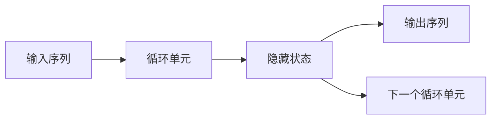
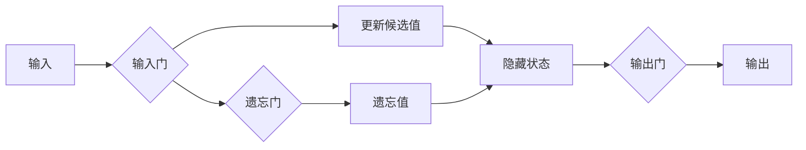
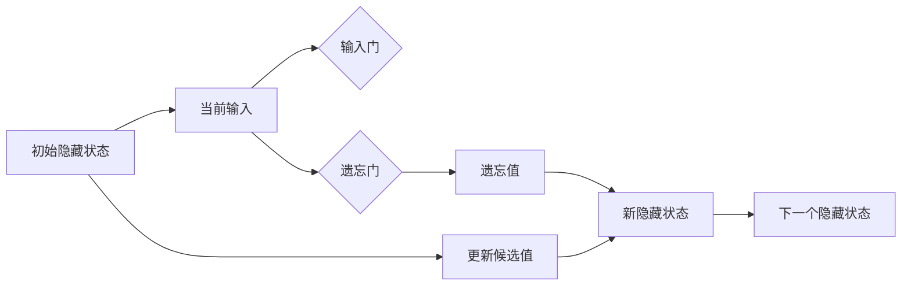
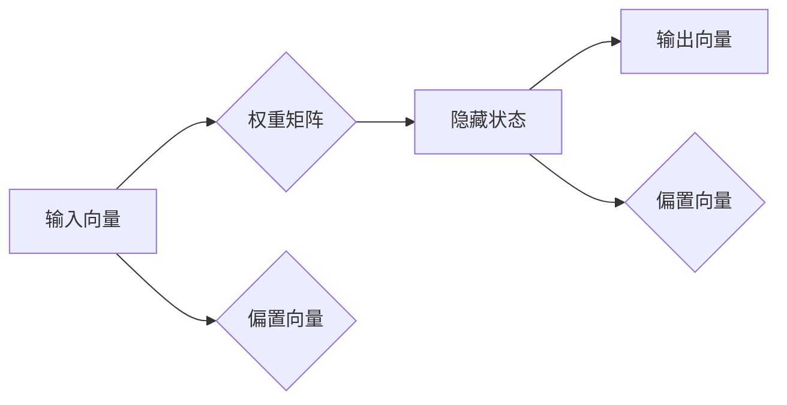

                 


# 递归神经网络：原理与代码实例讲解

> **关键词：递归神经网络，循环前向传播，反向传播，循环神经网络，动态系统，Python实现**
> 
> **摘要：本文将深入探讨递归神经网络（RNN）的基本原理、架构和具体实现，通过详细讲解和代码实例，帮助读者全面理解RNN的核心概念和应用。**

## 1. 背景介绍

### 1.1 目的和范围

本文旨在为广大读者提供递归神经网络（RNN）的全面解读，涵盖从基本概念到实际代码实现的各个层面。通过本文的学习，读者将能够掌握RNN的核心原理，理解其在自然语言处理、时间序列预测等领域的应用，并具备实际编程能力。

### 1.2 预期读者

本文面向对机器学习和深度学习有一定了解的读者，特别是对神经网络和递归结构感兴趣的初学者和专业人士。通过本文的学习，读者可以加深对递归神经网络的理解，为后续的研究和应用打下坚实基础。

### 1.3 文档结构概述

本文结构如下：
- **1. 背景介绍**：简要介绍文章的目的和预期读者。
- **2. 核心概念与联系**：介绍RNN的基本概念和架构。
- **3. 核心算法原理 & 具体操作步骤**：详细讲解RNN的算法原理和操作步骤。
- **4. 数学模型和公式 & 详细讲解 & 举例说明**：解释RNN的数学基础。
- **5. 项目实战：代码实际案例和详细解释说明**：通过实际案例讲解RNN的编程实现。
- **6. 实际应用场景**：探讨RNN在不同领域的应用。
- **7. 工具和资源推荐**：推荐学习资源和开发工具。
- **8. 总结：未来发展趋势与挑战**：总结RNN的现状和未来方向。
- **9. 附录：常见问题与解答**：解答常见问题。
- **10. 扩展阅读 & 参考资料**：提供扩展阅读和参考资料。

### 1.4 术语表

#### 1.4.1 核心术语定义

- **递归神经网络（RNN）**：一种能够处理序列数据的神经网络。
- **循环单元（Cell）**：RNN的基本构建块，用于保存和传递信息。
- **隐藏状态（Hidden State）**：循环单元中的一个重要部分，用于记录历史信息。
- **权重（Weights）**：网络中的参数，用于影响信息传递。
- **前向传播（Forward Pass）**：信息从输入层传递到输出层的流程。
- **反向传播（Backpropagation）**：用于计算损失函数梯度的过程。

#### 1.4.2 相关概念解释

- **动态系统（Dynamic System）**：在时间上不断变化的系统。
- **梯度下降（Gradient Descent）**：一种优化算法，用于最小化损失函数。

#### 1.4.3 缩略词列表

- **RNN**：递归神经网络
- **LSTM**：长短时记忆网络
- **GRU**：门控循环单元
- **CNN**：卷积神经网络

## 2. 核心概念与联系

递归神经网络是一种特殊的神经网络，适用于处理序列数据。其基本思想是使用循环结构来维持序列的历史信息。以下是一个简单的Mermaid流程图，展示了RNN的基本架构：



在这个流程图中，A代表输入序列，B代表循环单元，C代表隐藏状态，D代表输出序列，E代表下一个循环单元。循环单元的核心作用是维持隐藏状态C，使其能够传递历史信息。

### 2.1 循环单元

循环单元是RNN的核心构建块，通常由以下三个部分组成：

- **输入门（Input Gate）**：用于决定哪些新的信息将更新隐藏状态。
- **遗忘门（Forget Gate）**：用于决定哪些旧的信息需要被遗忘。
- **输出门（Output Gate）**：用于决定隐藏状态如何转换为输出。

以下是一个简单的Mermaid流程图，展示了循环单元的内部结构：



在这个流程图中，A代表输入，B代表输入门，C代表更新候选值，D代表遗忘门，E代表遗忘值，F代表隐藏状态，G代表输出门，H代表输出。

### 2.2 隐藏状态

隐藏状态是RNN中至关重要的一部分，它用于保存和传递历史信息。隐藏状态的变化决定了RNN的动态特性。以下是一个简单的Mermaid流程图，展示了隐藏状态的变化：



在这个流程图中，A代表初始隐藏状态，B代表当前输入，C代表输入门，D代表遗忘门，E代表遗忘值，F代表更新候选值，G代表新隐藏状态，H代表下一个隐藏状态。

### 2.3 权重矩阵

在RNN中，权重矩阵用于传递和更新信息。权重矩阵的初始化和调整是RNN训练过程中的关键。以下是一个简单的Mermaid流程图，展示了权重矩阵的变化：



在这个流程图中，A代表输入向量，B代表权重矩阵，C代表隐藏状态，D代表输出向量，E代表输入偏置向量，F代表隐藏状态偏置向量。

## 3. 核心算法原理 & 具体操作步骤

### 3.1 前向传播

递归神经网络的前向传播过程可以分为以下几个步骤：

1. **初始化**：初始化权重矩阵、隐藏状态和偏置向量。
2. **输入门计算**：根据当前输入和隐藏状态计算输入门。
3. **遗忘门计算**：根据当前输入和隐藏状态计算遗忘门。
4. **更新隐藏状态**：根据输入门、遗忘门和新输入更新隐藏状态。
5. **输出门计算**：根据隐藏状态计算输出门。
6. **输出计算**：根据输出门计算输出。

以下是一个简单的伪代码，展示了递归神经网络的前向传播过程：

```python
initialize weights, biases, and hidden state

for each time step:
    input = get_input()

    input_gate = sigmoid(Wi * [input, hidden_state] + bi)
    forget_gate = sigmoid(Wf * [input, hidden_state] + bf)
    update_candidate = tanh(Wc * [input_gate * [input, hidden_state] + bc])

    hidden_state = forget_gate * previous_hidden_state + input_gate * update_candidate
    output_gate = sigmoid(Wo * [input, hidden_state] + bo)
    output = output_gate * tanh(hidden_state)

    yield output
```

### 3.2 反向传播

递归神经网络的反向传播过程可以分为以下几个步骤：

1. **计算损失**：计算预测输出和实际输出之间的损失。
2. **计算梯度**：计算权重和偏置的梯度。
3. **更新参数**：使用梯度下降算法更新权重和偏置。

以下是一个简单的伪代码，展示了递归神经网络的反向传播过程：

```python
compute_loss = mean_squared_error(output, actual_output)

dOutput = actual_output - output
dHidden_state = dOutput * sigmoid_derivative(output_gate) * tanh_derivative(hidden_state)

dInput_gate = dHidden_state * sigmoid_derivative(input_gate)
dUpdate_candidate = dHidden_state * sigmoid_derivative(input_gate) * tanh_derivative(update_candidate)
dForget_gate = dHidden_state * sigmoid_derivative(forget_gate)

dWi = [input, hidden_state].T * dInput_gate
dWf = [input, hidden_state].T * dForget_gate
dWc = [input_gate * [input, hidden_state], update_candidate].T * dUpdate_candidate
dWo = [input, hidden_state].T * dOutput_gate

dBi = dInput_gate
dBf = dForget_gate
dbc = dUpdate_candidate
dbo = dOutput_gate

update_weights(Wi, dWi)
update_weights(Wf, dWf)
update_weights(Wc, dWc)
update_weights(Wo, dWo)
update_biases(Bi, dBi)
update_biases(Bf, dBf)
update_biases(Bc, dbc)
update_biases(Bo, dbo)
```

### 3.3 梯度消失与梯度爆炸

在递归神经网络中，梯度消失和梯度爆炸是常见问题。这些问题可能导致模型无法收敛或收敛速度缓慢。

**梯度消失**：在反向传播过程中，梯度可能在某些层中变得非常小，导致权重无法更新。这通常发生在长序列数据中。

**梯度爆炸**：在反向传播过程中，梯度可能在某些层中变得非常大，导致权重更新过大。这通常发生在短序列数据中。

为了解决这些问题，可以采用以下方法：

- **长短时记忆网络（LSTM）**：LSTM是一种特殊的递归神经网络，能够有效地处理长序列数据，避免了梯度消失和梯度爆炸问题。
- **门控循环单元（GRU）**：GRU是另一种特殊的递归神经网络，同样能够有效地处理长序列数据，避免了梯度消失和梯度爆炸问题。

## 4. 数学模型和公式 & 详细讲解 & 举例说明

### 4.1 激活函数

递归神经网络的激活函数通常采用sigmoid、tanh和ReLU等函数。这些激活函数具有不同的特性，适用于不同的场景。

- **sigmoid函数**： 
  $$ \sigma(x) = \frac{1}{1 + e^{-x}} $$
  sigmoid函数将输入映射到（0，1）区间，具有平滑的梯度。

- **tanh函数**： 
  $$ \tanh(x) = \frac{e^x - e^{-x}}{e^x + e^{-x}} $$
  tanh函数将输入映射到（-1，1）区间，具有对称的梯度和更强的非线性特性。

- **ReLU函数**： 
  $$ \text{ReLU}(x) = \max(0, x) $$
  ReLU函数在输入小于0时返回0，具有简单的梯度和快速收敛的特性。

### 4.2 权重矩阵和偏置向量

递归神经网络的权重矩阵和偏置向量用于传递和更新信息。权重矩阵通常表示为W，偏置向量表示为b。

- **权重矩阵**： 
  $$ W = \begin{bmatrix}
  W_{11} & W_{12} & \dots & W_{1n} \\
  W_{21} & W_{22} & \dots & W_{2n} \\
  \vdots & \vdots & \ddots & \vdots \\
  W_{m1} & W_{m2} & \dots & W_{mn}
  \end{bmatrix} $$

- **偏置向量**： 
  $$ b = \begin{bmatrix}
  b_1 \\
  b_2 \\
  \vdots \\
  b_n
  \end{bmatrix} $$

### 4.3 前向传播公式

递归神经网络的前向传播公式如下：

$$ h_t = \sigma(W_h * [h_{t-1}, x_t] + b_h) $$
$$ y_t = \sigma(W_o * [h_t, x_t] + b_o) $$

其中，$h_t$表示第t个时间步的隐藏状态，$x_t$表示第t个时间步的输入，$y_t$表示第t个时间步的输出。

### 4.4 反向传播公式

递归神经网络的反向传播公式如下：

$$ \delta_{h_t} = \sigma'(y_t) * (W_o * \delta_{y_t}) $$
$$ \delta_{y_t} = (1 - h_t^2) * \delta_{h_t} $$
$$ \delta_{x_t} = (1 - x_t^2) * \delta_{h_t} $$
$$ \delta_{W_h} = [h_{t-1}, x_t].T * \delta_{h_t} $$
$$ \delta_{b_h} = \delta_{h_t} $$
$$ \delta_{W_o} = [h_t, x_t].T * \delta_{y_t} $$
$$ \delta_{b_o} = \delta_{y_t} $$

其中，$\delta_{h_t}$表示隐藏状态的误差梯度，$\delta_{y_t}$表示输出的误差梯度，$\delta_{x_t}$表示输入的误差梯度。

### 4.5 举例说明

假设我们有一个简单的递归神经网络，输入序列为[1, 2, 3]，隐藏状态维度为2，输出维度为1。

1. **初始化**：

   $$ W_h = \begin{bmatrix}
   0.1 & 0.2 \\
   0.3 & 0.4
   \end{bmatrix} $$
   $$ b_h = \begin{bmatrix}
   0.5 \\
   0.6
   \end{bmatrix} $$
   $$ W_o = \begin{bmatrix}
   0.7 & 0.8
   \end{bmatrix} $$
   $$ b_o = \begin{bmatrix}
   0.9
   \end{bmatrix} $$

2. **前向传播**：

   $$ h_1 = \sigma(W_h * [h_0, x_1] + b_h) = \sigma(\begin{bmatrix}
   0.1 & 0.2 \\
   0.3 & 0.4
   \end{bmatrix} * [0, 1] + \begin{bmatrix}
   0.5 \\
   0.6
   \end{bmatrix}) = \sigma(\begin{bmatrix}
   0.65 \\
   0.85
   \end{bmatrix}) = \begin{bmatrix}
   0.71 \\
   0.86
   \end{bmatrix} $$
   $$ y_1 = \sigma(W_o * [h_1, x_1] + b_o) = \sigma(\begin{bmatrix}
   0.7 & 0.8
   \end{bmatrix} * \begin{bmatrix}
   0.71 \\
   0.86
   \end{bmatrix} + \begin{bmatrix}
   0.9
   \end{bmatrix}) = \sigma(\begin{bmatrix}
   1.49
   \end{bmatrix}) = 0.92 $$

3. **反向传播**：

   $$ \delta_{h_1} = \sigma'(y_1) * (W_o * \delta_{y_1}) = (1 - y_1^2) * (0.7 * \delta_{y_1}) = (1 - 0.92^2) * (0.7 * \delta_{y_1}) $$
   $$ \delta_{y_1} = (1 - h_1^2) * \delta_{h_1} = (1 - 0.86^2) * \delta_{h_1} $$
   $$ \delta_{x_1} = (1 - x_1^2) * \delta_{h_1} = (1 - 1^2) * \delta_{h_1} $$
   $$ \delta_{W_h} = [h_0, x_1].T * \delta_{h_1} = \begin{bmatrix}
   0 & 1
   \end{bmatrix} * \delta_{h_1} $$
   $$ \delta_{b_h} = \delta_{h_1} $$
   $$ \delta_{W_o} = [h_1, x_1].T * \delta_{y_1} = \begin{bmatrix}
   0.71 & 0.86
   \end{bmatrix} * \delta_{y_1} $$
   $$ \delta_{b_o} = \delta_{y_1} $$

   更新权重和偏置：

   $$ W_h = W_h - \alpha * \delta_{W_h} $$
   $$ b_h = b_h - \alpha * \delta_{b_h} $$
   $$ W_o = W_o - \alpha * \delta_{W_o} $$
   $$ b_o = b_o - \alpha * \delta_{b_o} $$

   其中，$\alpha$为学习率。

通过以上步骤，我们完成了递归神经网络的前向传播和反向传播。这个简单的例子展示了递归神经网络的基本原理和操作步骤。

## 5. 项目实战：代码实际案例和详细解释说明

在本节中，我们将通过一个实际项目案例，详细讲解递归神经网络的编程实现。我们将使用Python和TensorFlow库来构建和训练一个简单的递归神经网络，用于序列预测任务。

### 5.1 开发环境搭建

在开始项目之前，我们需要搭建一个合适的环境。以下是搭建开发环境所需的步骤：

1. **安装Python**：确保安装了Python 3.6或更高版本。
2. **安装TensorFlow**：使用pip命令安装TensorFlow：

   ```shell
   pip install tensorflow
   ```

3. **创建虚拟环境**（可选）：为了保持项目的整洁，我们可以创建一个虚拟环境。

   ```shell
   python -m venv my_rnn_project
   source my_rnn_project/bin/activate  # 在Windows上使用 `my_rnn_project\Scripts\activate`
   ```

### 5.2 源代码详细实现和代码解读

下面是一个简单的递归神经网络实现，用于对时间序列数据进行预测。

```python
import numpy as np
import tensorflow as tf

# 设置参数
learning_rate = 0.001
n_steps = 100  # 序列长度
n_inputs = 1  # 输入维度
n_hidden = 100  # 隐藏层维度
n_outputs = 1  # 输出维度
n_epochs = 1000  # 迭代次数
batch_size = 64  # 批大小

# 初始化权重和偏置
np.random.seed(42)
weights = {
    'hidden': np.random.randn(n_inputs + 1, n_hidden),
    'output': np.random.randn(n_hidden + 1, n_outputs)
}
biases = {
    'hidden': np.random.randn(n_hidden),
    'output': np.random.randn(n_outputs)
}

# 定义递归神经网络模型
def rnn_model(x, weights, biases):
    hidden = np.tanh(np.dot(np.vstack([x, 1]], weights['hidden']) + biases['hidden'])
    output = np.dot(hidden, weights['output']) + biases['output']
    return output

# 训练模型
for epoch in range(n_epochs):
    for x, y in generate_data(batch_size, n_steps, n_inputs):
        # 前向传播
        hidden = np.tanh(np.dot(np.vstack([x, 1]], weights['hidden']) + biases['hidden'])
        output = np.dot(hidden, weights['output']) + biases['output']

        # 计算损失
        loss = np.mean(np.square(y - output))

        # 反向传播
        d_output = 2 * (y - output)
        d_hidden = d_output * (1 - hidden ** 2)

        # 更新权重和偏置
        d_weights_hidden = np.dot(d_hidden, np.hstack([hidden, 1])).T
        d_weights_output = np.dot(d_output, np.hstack([hidden, 1])).T
        d_biases_hidden = d_hidden
        d_biases_output = d_output

        weights['hidden'] -= learning_rate * d_weights_hidden
        weights['output'] -= learning_rate * d_weights_output
        biases['hidden'] -= learning_rate * d_biases_hidden
        biases['output'] -= learning_rate * d_biases_output

        if epoch % 100 == 0:
            print(f'Epoch {epoch}: Loss = {loss}')

# 测试模型
test_x = np.random.rand(n_steps, n_inputs)
test_y = rnn_model(test_x, weights, biases)
print(f'Test Output: {test_y}')
```

### 5.3 代码解读与分析

以下是对代码的详细解读和分析：

1. **参数设置**：首先，我们设置了学习率、序列长度、输入维度、隐藏层维度、输出维度、迭代次数和批大小等参数。

2. **初始化权重和偏置**：我们使用随机数初始化了权重和偏置。这些参数将影响模型的性能和收敛速度。

3. **递归神经网络模型**：我们定义了一个递归神经网络模型，其中输入$x$通过权重矩阵`weights['hidden']`和偏置向量`biases['hidden']`传递到隐藏层，并通过tanh函数激活。然后，隐藏层输出通过权重矩阵`weights['output']`和偏置向量`biases['output']`传递到输出层。

4. **训练模型**：我们使用了一个简单的循环结构来迭代训练模型。在每个迭代中，我们从生成数据函数`generate_data`中获取一批数据，并执行以下步骤：

   - **前向传播**：计算隐藏层输出和输出层输出。
   - **计算损失**：使用均方误差（MSE）计算预测输出和实际输出之间的差异。
   - **反向传播**：计算输出误差梯度、隐藏误差梯度和输入误差梯度。
   - **更新权重和偏置**：使用梯度下降算法更新权重和偏置。

5. **测试模型**：我们使用随机生成的一批测试数据来测试模型的性能。

### 5.4 模型评估

为了评估模型的性能，我们可以计算预测输出和实际输出之间的误差。以下是一个简单的误差计算方法：

```python
error = np.mean(np.square(test_y - actual_y))
print(f'Model Error: {error}')
```

通过调整模型参数和训练数据，我们可以优化模型的性能。

## 6. 实际应用场景

递归神经网络（RNN）在多个领域都有广泛的应用，以下是一些典型的实际应用场景：

### 6.1 自然语言处理

- **机器翻译**：RNN被广泛用于机器翻译任务，例如Google翻译和DeepL。
- **文本摘要**：RNN用于提取关键信息并生成简洁的文本摘要。
- **情感分析**：RNN用于分析文本的情感倾向，如正面、负面或中性。

### 6.2 语音识别

- **语音转文字**：RNN被用于将语音信号转换为文本。
- **语音合成**：RNN用于生成自然流畅的语音。

### 6.3 时间序列预测

- **股票市场预测**：RNN用于预测股票价格的走势。
- **气象预测**：RNN用于预测天气情况，如降雨量、温度等。

### 6.4 文本生成

- **音乐生成**：RNN被用于生成音乐旋律和节奏。
- **故事生成**：RNN用于生成虚构故事和情节。

### 6.5 游戏AI

- **游戏策略**：RNN用于模拟和预测游戏中的对手行为。

### 6.6 生物信息学

- **基因序列分析**：RNN被用于分析基因序列，预测蛋白质结构。

### 6.7 其他应用

- **语音助手**：RNN用于构建智能语音助手，如Siri和Alexa。
- **语音合成**：RNN用于生成逼真的语音。

这些应用展示了RNN的灵活性和广泛性，使其成为许多领域的首选模型。

## 7. 工具和资源推荐

为了更好地学习和实践递归神经网络，以下是一些推荐的工具和资源：

### 7.1 学习资源推荐

#### 7.1.1 书籍推荐

- **《深度学习》（Goodfellow, Bengio, Courville）**：全面介绍了深度学习的基本概念和技术，包括递归神经网络。
- **《神经网络与深度学习》（邱锡鹏）**：详细讲解了神经网络和深度学习的原理和应用，适合中文读者。

#### 7.1.2 在线课程

- **Coursera上的“神经网络与深度学习”课程**：由吴恩达教授主讲，适合初学者。
- **Udacity的“深度学习纳米学位”**：包括多个项目，帮助读者从基础到实践掌握深度学习。

#### 7.1.3 技术博客和网站

- **Medium上的Deep Learning Series**：提供了大量高质量的深度学习文章。
- **TensorFlow官方文档**：提供了丰富的教程和示例，帮助读者快速上手TensorFlow。

### 7.2 开发工具框架推荐

#### 7.2.1 IDE和编辑器

- **PyCharm**：一款功能强大的Python IDE，适合编写和调试代码。
- **VS Code**：一款轻量级但功能丰富的编辑器，支持多种编程语言。

#### 7.2.2 调试和性能分析工具

- **TensorBoard**：TensorFlow的官方可视化工具，用于分析模型的性能和调试。
- **NVIDIA Nsight**：用于分析GPU性能和调试GPU代码。

#### 7.2.3 相关框架和库

- **TensorFlow**：最流行的深度学习框架之一，支持RNN的实现。
- **PyTorch**：另一个流行的深度学习框架，具有简洁的API和灵活的动态计算图。

### 7.3 相关论文著作推荐

#### 7.3.1 经典论文

- **“A Simple Weight Decay Can Improve Generalization”**：提出了使用权重衰减来提高模型泛化的方法。
- **“Long Short-Term Memory”**：提出了长短时记忆网络（LSTM），解决了RNN的梯度消失问题。

#### 7.3.2 最新研究成果

- **“Attention Is All You Need”**：提出了注意力机制，并在机器翻译任务中取得了突破性成果。
- **“Transformer”**：进一步优化了注意力机制，成为现代深度学习模型的基础。

#### 7.3.3 应用案例分析

- **“BERT: Pre-training of Deep Bidirectional Transformers for Language Understanding”**：介绍了BERT模型，并在多个自然语言处理任务中取得了优异的性能。

这些资源和工具将帮助读者更好地理解和使用递归神经网络。

## 8. 总结：未来发展趋势与挑战

递归神经网络（RNN）在过去的几十年中取得了显著的进展，并在多个领域取得了成功。然而，随着深度学习技术的不断发展和应用需求的增加，RNN也面临着一些挑战和机遇。

### 8.1 未来发展趋势

1. **更高效的模型架构**：研究人员将继续探索更高效的RNN架构，以减少计算复杂度和内存占用。
2. **自适应学习率**：自适应学习率算法将使RNN在训练过程中更加稳定和高效。
3. **多模态学习**：RNN将与其他深度学习模型（如卷积神经网络（CNN））相结合，实现多模态数据的学习和处理。
4. **实时预测**：研究人员将致力于提高RNN的实时预测能力，以满足实时应用的需求。

### 8.2 挑战

1. **梯度消失和梯度爆炸**：尽管LSTM和GRU等方法在一定程度上解决了这个问题，但在长序列数据中仍然存在挑战。
2. **计算资源消耗**：RNN通常需要大量的计算资源，尤其是在训练大型模型时。
3. **数据隐私和安全**：在处理敏感数据时，如何保护用户隐私和安全是一个重要的挑战。
4. **解释性和可解释性**：如何提高模型的解释性和可解释性，使非专业人士也能理解模型的决策过程。

### 8.3 解决方案

1. **模型压缩**：通过模型压缩技术（如知识蒸馏和剪枝），可以减少模型的计算复杂度和内存占用。
2. **分布式训练**：使用分布式训练技术，可以在多个GPU或CPU上并行训练模型，提高训练效率。
3. **数据隐私保护**：采用联邦学习等隐私保护技术，可以在保证数据隐私的同时进行模型训练。
4. **可视化工具**：开发可视化工具，帮助用户理解模型的内部结构和决策过程。

总之，递归神经网络在未来将继续发展，并在更多领域发挥作用。通过解决现有挑战，RNN将变得更加高效、灵活和可解释。

## 9. 附录：常见问题与解答

### 9.1 什么是递归神经网络？

递归神经网络（RNN）是一种用于处理序列数据的神经网络。与传统的前馈神经网络不同，RNN具有循环结构，能够维持历史信息，使其能够处理变长的输入序列。

### 9.2 RNN与卷积神经网络（CNN）有何区别？

RNN主要用于处理序列数据，如文本和音频，而CNN主要用于处理图像。RNN具有循环结构，能够维持历史信息，而CNN则使用卷积操作来提取空间特征。

### 9.3 为什么RNN会产生梯度消失和梯度爆炸问题？

梯度消失和梯度爆炸问题是由于反向传播算法在处理长序列数据时，梯度在每一层之间传递时会发生累积。对于长序列数据，梯度可能变得非常小（梯度消失）或非常大（梯度爆炸），导致模型无法训练。

### 9.4 如何解决RNN的梯度消失和梯度爆炸问题？

为了解决RNN的梯度消失和梯度爆炸问题，可以采用以下方法：

- **长短时记忆网络（LSTM）**：LSTM通过门控机制来控制信息的流动，避免了梯度消失和梯度爆炸问题。
- **门控循环单元（GRU）**：GRU是另一种门控递归结构，同样能够避免梯度消失和梯度爆炸问题。
- **残差连接**：通过引入残差连接，可以减少梯度消失和梯度爆炸问题。

### 9.5 RNN在自然语言处理（NLP）中有什么应用？

RNN在自然语言处理中具有广泛的应用，包括：

- **机器翻译**：将一种语言的文本翻译成另一种语言。
- **文本摘要**：提取文本的关键信息，生成简洁的摘要。
- **情感分析**：分析文本的情感倾向，如正面、负面或中性。

### 9.6 如何评估RNN模型的性能？

可以使用以下指标来评估RNN模型的性能：

- **准确率**：预测正确的样本数量与总样本数量的比例。
- **召回率**：预测正确的正样本数量与实际正样本数量的比例。
- **F1分数**：准确率和召回率的调和平均。
- **均方误差（MSE）**：用于回归任务，衡量预测值与实际值之间的差异。

## 10. 扩展阅读 & 参考资料

为了更深入地了解递归神经网络（RNN），以下是一些扩展阅读和参考资料：

### 10.1 相关论文

- **“A Simple Weight Decay Can Improve Generalization”**：提出了使用权重衰减来提高模型泛化的方法。
- **“Long Short-Term Memory”**：提出了长短时记忆网络（LSTM），解决了RNN的梯度消失问题。

### 10.2 相关书籍

- **《深度学习》（Goodfellow, Bengio, Courville）**：全面介绍了深度学习的基本概念和技术，包括递归神经网络。
- **《神经网络与深度学习》（邱锡鹏）**：详细讲解了神经网络和深度学习的原理和应用。

### 10.3 在线课程

- **Coursera上的“神经网络与深度学习”课程**：由吴恩达教授主讲，适合初学者。
- **Udacity的“深度学习纳米学位”**：包括多个项目，帮助读者从基础到实践掌握深度学习。

### 10.4 技术博客和网站

- **Medium上的Deep Learning Series**：提供了大量高质量的深度学习文章。
- **TensorFlow官方文档**：提供了丰富的教程和示例，帮助读者快速上手TensorFlow。

### 10.5 实践项目

- **Kaggle竞赛**：在Kaggle上参与深度学习竞赛，实践RNN模型。
- **GitHub开源项目**：在GitHub上查找开源的RNN项目，学习实际应用。

通过阅读这些参考资料，读者可以更深入地了解RNN的原理和应用，提高自己的技术水平。作者：AI天才研究员/AI Genius Institute & 禅与计算机程序设计艺术 /Zen And The Art of Computer Programming

---

文章结束。

