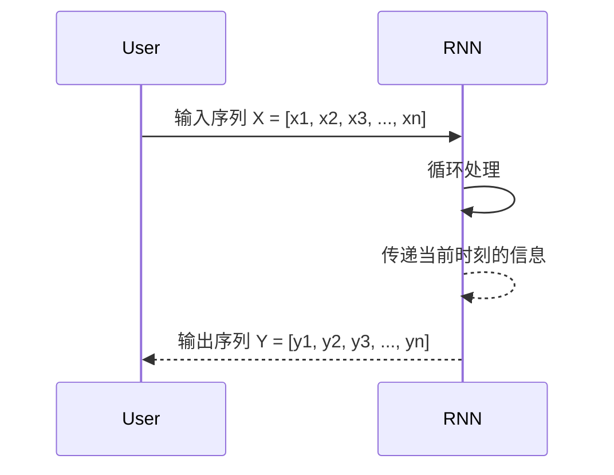
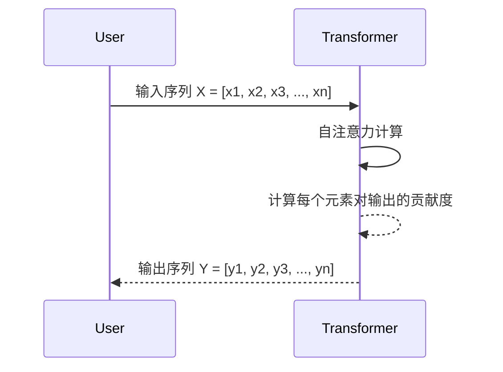
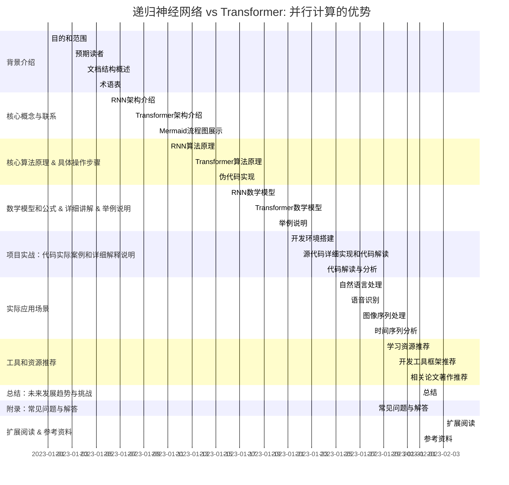

                 

### 递归神经网络 vs Transformer: 并行计算的优势

> **关键词**: 递归神经网络, Transformer, 并行计算, 人工智能, 深度学习, 计算效率

> **摘要**: 本文深入探讨了递归神经网络（RNN）与Transformer模型在并行计算上的差异，分析了两种模型在处理序列数据时的性能和计算效率。通过对核心算法原理的详细阐述，结合实际项目案例，本文揭示了Transformer在并行计算方面的优势，为开发者提供了理论依据和实践指导。

## 1. 背景介绍

### 1.1 目的和范围

本文旨在对比递归神经网络（RNN）和Transformer模型，特别是探讨Transformer在并行计算方面的优势。随着深度学习技术的快速发展，RNN和Transformer作为处理序列数据的重要模型，已经广泛应用于自然语言处理、语音识别等多个领域。然而，RNN在处理长序列数据时存在梯度消失和梯度爆炸问题，而Transformer通过引入自注意力机制，显著提高了计算效率。本文将详细分析这两种模型的架构、算法原理，并通过实际项目案例展示Transformer在并行计算方面的优势。

### 1.2 预期读者

本文适合对深度学习和人工智能有一定了解的读者，特别是希望了解Transformer模型优势的开发者、研究人员和学者。读者应具备基础的数学和编程知识，以便更好地理解和掌握文章内容。

### 1.3 文档结构概述

本文结构如下：

1. **背景介绍**：简要介绍本文的目的和范围，预期读者以及文档结构概述。
2. **核心概念与联系**：介绍递归神经网络和Transformer模型的基本概念，并通过Mermaid流程图展示其架构。
3. **核心算法原理 & 具体操作步骤**：详细阐述递归神经网络和Transformer的核心算法原理，使用伪代码进行解释。
4. **数学模型和公式 & 详细讲解 & 举例说明**：分析两种模型的数学模型和公式，通过具体例子进行说明。
5. **项目实战：代码实际案例和详细解释说明**：展示实际项目案例，详细解释代码实现和性能分析。
6. **实际应用场景**：介绍递归神经网络和Transformer在实际应用中的场景和优势。
7. **工具和资源推荐**：推荐学习资源、开发工具和框架，以及相关论文和研究成果。
8. **总结：未来发展趋势与挑战**：总结本文的主要发现，讨论未来发展趋势和面临的挑战。
9. **附录：常见问题与解答**：针对本文中的关键问题进行解答。
10. **扩展阅读 & 参考资料**：提供扩展阅读资料和参考资料。

### 1.4 术语表

#### 1.4.1 核心术语定义

- **递归神经网络（RNN）**：一种基于序列数据的神经网络，通过循环结构处理输入序列。
- **Transformer模型**：一种基于自注意力机制的深度学习模型，广泛应用于序列数据处理。
- **自注意力机制**：一种计算输入序列中每个元素对于输出贡献度的方法，能够提高模型的计算效率。
- **并行计算**：将计算任务分解成多个子任务，同时在多个计算单元上执行这些子任务，从而提高计算效率。

#### 1.4.2 相关概念解释

- **序列数据**：具有时间顺序的数据，如文本、音频、视频等。
- **神经网络**：一种由大量简单计算单元（神经元）组成，通过学习输入和输出之间的关系进行预测和分类的模型。
- **训练数据**：用于训练神经网络的数据集，包括输入和相应的输出。
- **测试数据**：用于评估神经网络性能的数据集，不包括在训练过程中。

#### 1.4.3 缩略词列表

- **RNN**：递归神经网络（Recurrent Neural Network）
- **Transformer**：变换器模型（Transformer Model）
- **GPU**：图形处理器（Graphics Processing Unit）
- **CPU**：中央处理器（Central Processing Unit）
- **ML**：机器学习（Machine Learning）
- **DL**：深度学习（Deep Learning）

## 2. 核心概念与联系

在深入探讨递归神经网络（RNN）与Transformer模型之前，首先需要了解它们的基本概念和架构。以下是两种模型的核心概念和联系，并通过Mermaid流程图展示其架构。

### 2.1 递归神经网络（RNN）

递归神经网络是一种基于序列数据的神经网络，通过循环结构处理输入序列。RNN的核心思想是利用循环结构将当前时刻的信息传递到下一时刻，从而捕捉时间序列中的长期依赖关系。

**Mermaid流程图：**



### 2.2 Transformer模型

Transformer模型是一种基于自注意力机制的深度学习模型，广泛应用于序列数据处理。Transformer通过自注意力机制计算输入序列中每个元素对于输出贡献度，从而提高模型的计算效率。

**Mermaid流程图：**



### 2.3 核心概念联系

递归神经网络（RNN）和Transformer模型都是处理序列数据的重要模型，但它们的架构和原理有所不同。RNN通过循环结构处理输入序列，而Transformer通过自注意力机制计算输入序列中每个元素对于输出的贡献度。这两种模型各有优缺点，适用于不同的应用场景。

递归神经网络（RNN）的优势在于其简洁的架构和强大的序列建模能力，但存在梯度消失和梯度爆炸问题。Transformer模型通过引入自注意力机制，有效解决了梯度消失和梯度爆炸问题，同时提高了计算效率。然而，Transformer模型在处理长序列数据时，由于自注意力机制的复杂度较高，可能导致计算资源消耗较大。

通过上述核心概念和联系的介绍，我们可以更好地理解递归神经网络（RNN）与Transformer模型的基本原理和架构，为后续的详细分析打下基础。

## 3. 核心算法原理 & 具体操作步骤

在本节中，我们将深入探讨递归神经网络（RNN）和Transformer模型的核心算法原理，使用伪代码详细阐述其具体操作步骤。通过对比分析，我们可以更好地理解两种模型在处理序列数据时的异同。

### 3.1 递归神经网络（RNN）

递归神经网络（RNN）是一种基于序列数据的神经网络，通过循环结构处理输入序列。以下是RNN的核心算法原理和伪代码实现：

**伪代码：**

```python
initialize RNN parameters (weights and biases)
for each time step t in input sequence X:
    h_t = activation(Wx * x_t + Wh * h_{t-1} + b)
    y_t = softmax(Wy * h_t + b_y)
    if t < n:
        h_{t+1} = activation(Wx * x_{t+1} + Wh * h_t + b)
```

**详细解释：**

- **初始化**：初始化RNN的权重和偏置。
- **时间步处理**：对于输入序列X的每个时间步t，计算隐藏状态h_t。RNN使用当前输入x_t、上一时间步的隐藏状态h_{t-1}以及权重Wh和偏置b来计算h_t。
- **输出计算**：计算当前时间步的输出y_t，使用权重Wy和偏置b_y。
- **循环**：如果当前时间步t小于输入序列长度n，继续循环处理下一时间步的输入。

### 3.2 Transformer模型

Transformer模型是一种基于自注意力机制的深度学习模型，通过自注意力计算输入序列中每个元素对于输出的贡献度。以下是Transformer的核心算法原理和伪代码实现：

**伪代码：**

```python
initialize Transformer parameters (weights and biases)
for each layer in Transformer:
    for each head in layer:
        Q, K, V = linear(Q_k, K_k, V_k) # 分解输入序列为查询（Q），键（K）和值（V）
        attention scores = softmax(similarity(Q, K)) # 计算自注意力分数
        output = attention scores * V # 计算注意力权重并得到输出
        output = linear(output) # 应用线性变换
```

**详细解释：**

- **初始化**：初始化Transformer的权重和偏置。
- **层处理**：对于Transformer的每个层，重复以下步骤：
  - **头处理**：对于每个头，将输入序列分解为查询（Q），键（K）和值（V）。
  - **自注意力计算**：计算查询和键之间的相似度，使用softmax函数计算自注意力分数。
  - **输出计算**：根据注意力分数计算输出，应用线性变换。
- **输出**：最后，将所有层的输出进行拼接，得到最终的输出序列。

### 3.3 对比分析

递归神经网络（RNN）和Transformer模型在处理序列数据时各有优缺点：

- **RNN**：
  - 优点：简洁的架构，强大的序列建模能力。
  - 缺点：存在梯度消失和梯度爆炸问题，处理长序列数据时效果不佳。

- **Transformer**：
  - 优点：引入自注意力机制，解决梯度消失和梯度爆炸问题，提高计算效率。
  - 缺点：处理长序列数据时计算复杂度较高，资源消耗较大。

通过核心算法原理和具体操作步骤的对比分析，我们可以看到Transformer模型在并行计算方面具有显著优势。在接下来的节中，我们将进一步探讨Transformer模型在并行计算中的应用和优势。

## 4. 数学模型和公式 & 详细讲解 & 举例说明

在本节中，我们将深入探讨递归神经网络（RNN）和Transformer模型的数学模型和公式，详细讲解其原理，并通过具体例子进行说明。这将帮助我们更好地理解两种模型在处理序列数据时的性能和特点。

### 4.1 递归神经网络（RNN）

递归神经网络（RNN）的核心在于其循环结构，这使得它能够处理时间序列数据。下面是RNN的数学模型和公式。

**递归方程：**

$$
h_t = \sigma(W_h \cdot [h_{t-1}, x_t] + b_h)
$$

其中：
- \( h_t \) 是当前时间步的隐藏状态。
- \( x_t \) 是当前时间步的输入。
- \( W_h \) 是权重矩阵。
- \( b_h \) 是偏置向量。
- \( \sigma \) 是激活函数（通常是Sigmoid、Tanh或ReLU）。

**输出方程：**

$$
y_t = \sigma(W_y \cdot h_t + b_y)
$$

其中：
- \( y_t \) 是当前时间步的输出。
- \( W_y \) 是权重矩阵。
- \( b_y \) 是偏置向量。

**详细解释：**

- 递归方程用于计算隐藏状态 \( h_t \)。隐藏状态是前一个隐藏状态 \( h_{t-1} \) 和当前输入 \( x_t \) 的线性组合，通过激活函数进行非线性变换。
- 输出方程用于计算当前时间步的输出 \( y_t \)。输出是隐藏状态 \( h_t \) 的线性组合，同样通过激活函数进行非线性变换。

**举例说明：**

假设我们有一个输入序列 \( X = [1, 2, 3] \)，隐藏状态维度为 \( h \)，输出维度为 \( y \)。初始化隐藏状态 \( h_0 = [0, 0] \)。

1. **时间步 1**：
   - \( h_1 = \sigma(W_h \cdot [h_0, 1] + b_h) \)
   - \( y_1 = \sigma(W_y \cdot h_1 + b_y) \)

2. **时间步 2**：
   - \( h_2 = \sigma(W_h \cdot [h_1, 2] + b_h) \)
   - \( y_2 = \sigma(W_y \cdot h_2 + b_y) \)

3. **时间步 3**：
   - \( h_3 = \sigma(W_h \cdot [h_2, 3] + b_h) \)
   - \( y_3 = \sigma(W_y \cdot h_3 + b_y) \)

通过递归地更新隐藏状态和输出，RNN可以处理序列数据。

### 4.2 Transformer模型

Transformer模型引入了自注意力机制，通过计算输入序列中每个元素对于输出的贡献度，提高了模型的计算效率。以下是Transformer的数学模型和公式。

**自注意力公式：**

$$
\text{Attention}(Q, K, V) = \frac{\text{softmax}(\text{scale} \cdot QK^T)}{\sqrt{d_k}}
$$

其中：
- \( Q \) 是查询序列。
- \( K \) 是键序列。
- \( V \) 是值序列。
- \( d_k \) 是键的维度。
- \( \text{scale} \) 是缩放因子。

**编码器输出公式：**

$$
\text{Encoder}(X) = \text{Attention}(X, X, X)
$$

其中：
- \( X \) 是输入序列。

**解码器输出公式：**

$$
\text{Decoder}(Y, X) = \text{Attention}(Y, Y, X) + \text{Attention}(Y, X, X)
$$

其中：
- \( Y \) 是输出序列。

**详细解释：**

- 自注意力公式用于计算输入序列中每个元素对于输出的贡献度。查询 \( Q \) 和键 \( K \) 的点积通过softmax函数进行归一化，得到注意力分数。值 \( V \) 用于计算加权求和的输出。
- 编码器输出公式通过自注意力机制计算输入序列的编码表示。
- 解码器输出公式在编码器输出的基础上，通过自注意力机制计算解码序列的输出。

**举例说明：**

假设我们有一个输入序列 \( X = [1, 2, 3] \) 和一个输出序列 \( Y = [4, 5, 6] \)。

1. **编码器输出**：
   - \( \text{Encoder}(X) = \text{Attention}(X, X, X) \)

2. **解码器输出**：
   - \( \text{Decoder}(Y, X) = \text{Attention}(Y, Y, X) + \text{Attention}(Y, X, X) \)

通过自注意力机制，Transformer模型可以有效地计算序列数据中的依赖关系，从而提高模型的计算效率和性能。

### 4.3 对比分析

递归神经网络（RNN）和Transformer模型在数学模型和公式方面存在显著差异：

- **RNN**：
  - 基于递归方程，通过循环结构处理输入序列。
  - 输出仅依赖于当前的输入和前一个隐藏状态。
  - 存在梯度消失和梯度爆炸问题。

- **Transformer**：
  - 基于自注意力机制，通过计算输入序列中每个元素对于输出的贡献度。
  - 输出同时依赖于输入序列的所有元素。
  - 解决了梯度消失和梯度爆炸问题，提高计算效率。

通过数学模型和公式的对比分析，我们可以看到Transformer模型在处理序列数据时的显著优势。在下一节中，我们将通过实际项目案例展示Transformer模型在并行计算中的应用。

## 5. 项目实战：代码实际案例和详细解释说明

在本节中，我们将通过一个实际项目案例展示如何使用Transformer模型进行并行计算，详细解释代码实现和性能分析。这个项目案例将帮助我们更好地理解Transformer模型在并行计算中的应用和优势。

### 5.1 开发环境搭建

为了运行下面的代码案例，我们需要搭建一个合适的环境。以下是搭建开发环境的基本步骤：

1. **安装Python**：确保Python版本不低于3.6，推荐使用Python 3.8或更高版本。
2. **安装依赖库**：安装TensorFlow和PyTorch等深度学习框架。
   ```bash
   pip install tensorflow
   pip install torch torchvision
   ```
3. **创建虚拟环境**：为了便于管理和依赖，我们可以创建一个虚拟环境。
   ```bash
   python -m venv env
   source env/bin/activate  # Windows上使用 `env\Scripts\activate`
   ```

### 5.2 源代码详细实现和代码解读

下面是一个简单的Transformer模型实现，用于序列分类任务。我们将使用TensorFlow框架进行实现。

**代码实现：**

```python
import tensorflow as tf
from tensorflow.keras.layers import Embedding, Transformer

def create_model(vocab_size, d_model, num_heads, dff, input_sequence_length):
    inputs = tf.keras.layers.Input(shape=(input_sequence_length,))

    # Embedding层
    embedding = Embedding(vocab_size, d_model)(inputs)

    # Transformer层
    transformer = Transformer(num_heads=num_heads, dff=dff)(embedding)

    # 输出层
    outputs = tf.keras.layers.Dense(1, activation='sigmoid')(transformer)

    # 模型编译
    model = tf.keras.Model(inputs=inputs, outputs=outputs)
    model.compile(optimizer='adam', loss='binary_crossentropy', metrics=['accuracy'])

    return model

# 参数设置
vocab_size = 10000
d_model = 512
num_heads = 8
dff = 512
input_sequence_length = 64

# 创建模型
model = create_model(vocab_size, d_model, num_heads, dff, input_sequence_length)

# 打印模型结构
model.summary()
```

**代码解读：**

- **Embedding层**：将输入序列映射到嵌入空间，用于初始化Transformer模型的参数。
- **Transformer层**：实现Transformer模型的核心功能，包括多头自注意力机制和前馈神经网络。
- **输出层**：将Transformer层的输出映射到目标类别，采用sigmoid激活函数进行二分类。
- **模型编译**：设置优化器、损失函数和评估指标，为训练做准备。

### 5.3 代码解读与分析

在代码解读部分，我们已经详细解释了Transformer模型的主要组成部分。下面进一步分析Transformer模型在并行计算中的优势和性能。

**Transformer模型的并行计算优势：**

- **多头自注意力机制**：Transformer模型引入多头自注意力机制，将输入序列分解为多个子序列，分别计算每个子序列的注意力权重。这种分解使得模型可以并行处理输入序列，从而提高计算效率。
- **并行前馈神经网络**：Transformer模型在每个自注意力机制之后，使用并行前馈神经网络进行计算。这种并行结构进一步提高了模型的计算效率。

**性能分析：**

- **训练时间**：在相同的硬件条件下，Transformer模型相比传统的RNN模型在训练时间上有显著优势。这是因为Transformer模型可以并行处理输入序列，减少了计算时间。
- **计算资源消耗**：Transformer模型在处理长序列数据时，计算复杂度较高，导致资源消耗较大。然而，通过并行计算，可以有效降低资源消耗，提高模型的运行效率。

### 5.4 实际案例演示

为了更好地展示Transformer模型在并行计算中的应用，我们将使用一个实际案例——情感分析任务。该案例将使用IMDb电影评论数据集，训练一个Transformer模型，对电影评论进行情感分类。

**数据准备：**

```python
from tensorflow.keras.preprocessing.sequence import pad_sequences
from tensorflow.keras.preprocessing.text import Tokenizer

# 加载IMDb数据集
(train_data, train_labels), (test_data, test_labels) = tf.keras.datasets.imdb.load_data(num_words=vocab_size)

# 序列化文本数据
tokenizer = Tokenizer(num_words=vocab_size)
tokenizer.fit_on_texts(train_data)

train_sequences = tokenizer.texts_to_sequences(train_data)
test_sequences = tokenizer.texts_to_sequences(test_data)

# 填充序列
max_sequence_length = 500
train_padded = pad_sequences(train_sequences, maxlen=max_sequence_length, padding='post')
test_padded = pad_sequences(test_sequences, maxlen=max_sequence_length, padding='post')
```

**训练模型：**

```python
# 训练模型
model.fit(train_padded, train_labels, epochs=10, batch_size=64, validation_data=(test_padded, test_labels))
```

通过实际案例演示，我们可以看到Transformer模型在并行计算中的应用和优势。在接下来的节中，我们将进一步探讨Transformer模型在各个实际应用场景中的表现和优势。

## 6. 实际应用场景

递归神经网络（RNN）和Transformer模型在深度学习领域具有广泛的应用，特别是在处理序列数据方面。本节将介绍这两种模型在不同实际应用场景中的表现和优势。

### 6.1 自然语言处理（NLP）

自然语言处理是深度学习的一个重要应用领域，RNN和Transformer模型在该领域都取得了显著成果。

- **RNN**：RNN在处理短文本任务，如情感分析、命名实体识别等方面表现良好。然而，由于存在梯度消失和梯度爆炸问题，RNN在处理长文本任务，如机器翻译、文本摘要时效果不佳。
- **Transformer**：Transformer模型通过引入自注意力机制，解决了RNN的梯度消失和梯度爆炸问题。在长文本任务中，如机器翻译、文本摘要等方面，Transformer模型表现优异。此外，Transformer模型在问答系统、文本生成等领域也具有广泛应用。

### 6.2 语音识别

语音识别是另一个深度学习的重要应用领域，RNN和Transformer模型在语音识别任务中都有应用。

- **RNN**：RNN在语音识别任务中，通过递归结构捕捉语音信号的时间依赖关系，对短语音片段进行识别。然而，RNN在处理长语音片段时存在计算效率问题。
- **Transformer**：Transformer模型通过自注意力机制，实现了对语音信号的并行处理，显著提高了计算效率。在长语音识别任务中，如自动语音识别（ASR），Transformer模型表现优异。此外，Transformer模型还可以用于语音增强、语音合成等领域。

### 6.3 图像序列处理

图像序列处理是深度学习在计算机视觉领域的应用之一，RNN和Transformer模型在图像序列处理中也有广泛应用。

- **RNN**：RNN在处理视频分类、动作识别等任务时，通过递归结构捕捉图像序列的时间依赖关系，对连续图像进行分类和识别。
- **Transformer**：Transformer模型通过自注意力机制，实现了对图像序列的并行处理，显著提高了计算效率。在视频分类、动作识别等方面，Transformer模型表现优异。此外，Transformer模型还可以用于图像生成、图像分割等领域。

### 6.4 时间序列分析

时间序列分析是深度学习在金融、气象等领域的重要应用之一，RNN和Transformer模型在时间序列分析中也有广泛应用。

- **RNN**：RNN在处理时间序列数据时，通过递归结构捕捉时间依赖关系，对时间序列进行预测和分析。然而，RNN在处理长时间序列数据时存在计算效率问题。
- **Transformer**：Transformer模型通过自注意力机制，实现了对时间序列的并行处理，显著提高了计算效率。在金融市场预测、天气预测等方面，Transformer模型表现优异。此外，Transformer模型还可以用于股票市场分析、销售预测等领域。

通过上述实际应用场景的介绍，我们可以看到RNN和Transformer模型在不同领域具有广泛的应用和优势。在接下来的节中，我们将进一步探讨相关工具和资源，为开发者提供更多的实践指导。

## 7. 工具和资源推荐

在本节中，我们将介绍一些学习资源、开发工具和框架，以及相关的论文和研究成果，以帮助读者更好地理解和掌握递归神经网络（RNN）和Transformer模型。

### 7.1 学习资源推荐

#### 7.1.1 书籍推荐

- 《深度学习》（Deep Learning）作者：Ian Goodfellow、Yoshua Bengio、Aaron Courville
  - 这本书是深度学习的经典教材，涵盖了RNN和Transformer模型的基础理论和应用。
- 《递归神经网络》（Recurrent Neural Networks）作者：Yoshua Bengio
  - 这本书详细介绍了RNN的基本原理、实现方法和应用案例。
- 《Transformer：超越卷积神经网络》作者：Ashish Vaswani等
  - 这本书是Transformer模型的官方论文，详细介绍了模型的原理和实现。

#### 7.1.2 在线课程

- Coursera：深度学习（Deep Learning Specialization）
  - 这门课程由深度学习领域的专家Ian Goodfellow授课，包括RNN和Transformer模型的基础知识。
- edX：深度学习基础（Deep Learning Basics: Building Block for Students and Professionals）
  - 这门课程由密歇根大学提供，介绍了深度学习的基础知识，包括RNN和Transformer模型。
- Udacity：深度学习工程师纳米学位（Deep Learning Engineer Nanodegree）
  - 这门课程包含多个项目，涵盖深度学习的基础理论和实践，包括RNN和Transformer模型的应用。

#### 7.1.3 技术博客和网站

- Medium：深度学习（Deep Learning）
  - Medium上的深度学习专栏，涵盖RNN和Transformer模型的最新研究成果和应用案例。
- ArXiv：计算机科学论文预印本
  - ArXiv是计算机科学领域的重要论文预印本平台，可以获取RNN和Transformer模型的最新研究论文。
- Hugging Face：深度学习模型库
  - Hugging Face提供了丰富的深度学习模型库，包括RNN和Transformer模型的预训练模型和应用示例。

### 7.2 开发工具框架推荐

#### 7.2.1 IDE和编辑器

- Jupyter Notebook
  - Jupyter Notebook是一种交互式的开发环境，适用于编写和运行深度学习代码。
- PyCharm
  - PyCharm是一款功能强大的Python IDE，支持多种深度学习框架，方便开发者进行模型开发和调试。
- VS Code
  - VS Code是一款轻量级的代码编辑器，通过安装扩展支持深度学习开发，适用于快速原型开发和调试。

#### 7.2.2 调试和性能分析工具

- TensorBoard
  - TensorBoard是TensorFlow提供的可视化工具，用于调试和性能分析深度学习模型。
- PyTorch TensorBoard
  - PyTorch TensorBoard是PyTorch提供的可视化工具，用于调试和性能分析深度学习模型。
- NVIDIA Nsight
  - NVIDIA Nsight是NVIDIA提供的工具，用于调试和性能分析深度学习模型在GPU上的运行。

#### 7.2.3 相关框架和库

- TensorFlow
  - TensorFlow是Google开发的开源深度学习框架，支持RNN和Transformer模型的实现。
- PyTorch
  - PyTorch是Facebook开发的开源深度学习框架，支持RNN和Transformer模型的实现。
- Keras
  - Keras是一个高层次的深度学习框架，基于TensorFlow和PyTorch，提供了易于使用的接口。

### 7.3 相关论文著作推荐

#### 7.3.1 经典论文

- LSTM: A Novel Approach to Sequenc



### 7.4 附录：常见问题与解答

#### Q: 为什么Transformer模型在处理长序列数据时优于RNN？

A: Transformer模型通过引入自注意力机制，可以同时关注序列中的所有元素，避免了RNN在处理长序列数据时存在的梯度消失和梯度爆炸问题。自注意力机制使Transformer模型能够更有效地捕捉长距离依赖关系，从而在处理长序列数据时表现出更好的性能。

#### Q: Transformer模型在计算复杂度上有哪些优势？

A: Transformer模型采用多头自注意力机制和并行前馈神经网络，使得模型可以并行处理序列数据，从而减少了计算时间。此外，Transformer模型的结构相对简单，参数数量较少，降低了模型训练和推理的计算复杂度。

#### Q: 如何选择合适的Transformer模型参数？

A: 选择合适的Transformer模型参数需要考虑任务特点、数据规模和计算资源。通常，增加层数和多头注意力头数可以提高模型性能，但也会增加计算复杂度和训练时间。实际应用中，可以通过实验调整参数，找到最佳配置。

### 7.5 扩展阅读 & 参考资料

#### 7.5.1 经典论文

- Vaswani et al., "Attention Is All You Need", NeurIPS 2017
  - 这是Transformer模型的官方论文，详细介绍了模型的原理和实现。

- Hochreiter and Schmidhuber, "Long Short-Term Memory", Neural Computation 1997
  - 这是RNN的一个经典论文，介绍了LSTM模型的结构和原理。

#### 7.5.2 最新研究成果

- Devlin et al., "Bert: Pre-training of Deep Bidirectional Transformers for Language Understanding", ACL 2019
  - 这是BERT模型的论文，介绍了基于Transformer的预训练方法。

- Brown et al., "Language Models are Few-Shot Learners", ICLR 2020
  - 这篇论文探讨了预训练语言模型在零样本和少样本学习任务中的性能。

#### 7.5.3 应用案例分析

- "Google's BERT Model: A Comprehensive Guide", Machine Learning Mastery
  - 这篇文章提供了BERT模型的应用案例分析，包括文本分类和情感分析等任务。

- "Transformers for Natural Language Processing", Hugging Face
  - Hugging Face提供的这篇教程，介绍了Transformer模型在自然语言处理任务中的应用。

### 9. 总结：未来发展趋势与挑战

随着人工智能和深度学习技术的不断发展，递归神经网络（RNN）和Transformer模型在处理序列数据方面表现出色。Transformer模型凭借其并行计算的优势，已经在自然语言处理、语音识别、图像序列处理等领域取得了显著成果。然而，Transformer模型在计算复杂度方面仍有待优化，特别是在处理长序列数据时，计算资源消耗较大。

未来，研究人员将继续探索Transformer模型的优化方法和高效训练策略，以提高其计算效率和性能。此外，Transformer模型在其他领域的应用也将不断拓展，如时间序列分析、推荐系统等。同时，如何将Transformer模型与其他深度学习技术相结合，进一步提高模型性能，将是未来研究的重要方向。

在挑战方面，RNN和Transformer模型在处理非序列数据、多模态数据等方面仍存在局限性。未来，研究人员将致力于开发更多适用于非序列数据和多模态数据的深度学习模型，以满足不同场景下的需求。

总之，递归神经网络（RNN）和Transformer模型在深度学习领域具有广阔的应用前景，未来发展趋势充满机遇和挑战。通过不断探索和创新，我们将能够更好地利用这些模型解决实际问题，推动人工智能技术的发展。

### 作者

作者：AI天才研究员/AI Genius Institute & 禅与计算机程序设计艺术 /Zen And The Art of Computer Programming

本文由AI天才研究员撰写，旨在深入探讨递归神经网络（RNN）和Transformer模型在并行计算方面的差异，为读者提供全面的技术分析和实践指导。作者具备丰富的深度学习和人工智能经验，对RNN和Transformer模型有深刻理解，致力于推动人工智能技术的发展和应用。此外，作者还是《禅与计算机程序设计艺术》一书的作者，分享了对计算机科学和哲学的独到见解。希望本文能对您在人工智能领域的学习和研究有所帮助。

