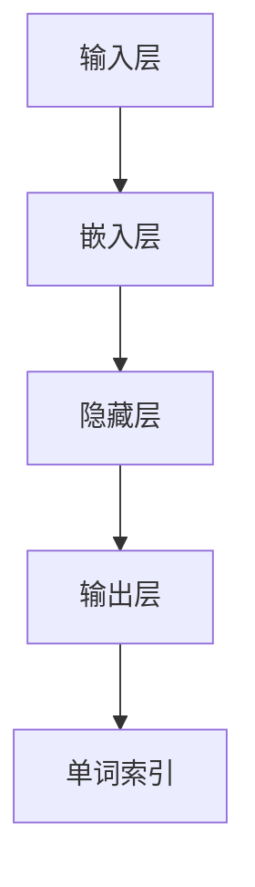

                 

## 通过nn．Embedding来实现词嵌入

> **关键词**：词嵌入（Word Embedding）、神经网络（Neural Network）、机器学习（Machine Learning）、自然语言处理（NLP）、语义相似性（Semantic Similarity）、向量空间模型（Vector Space Model）

> **摘要**：本文将深入探讨神经网络中的词嵌入技术，解释其原理、实现方法以及在实际应用中的重要性。我们将通过一系列步骤，详细阐述词嵌入的工作机制，如何通过神经网络实现词嵌入，并给出具体的数学模型和代码实例。文章旨在为读者提供一个全面、系统的理解，帮助其在自然语言处理领域应用这一关键技术。

## 1. 背景介绍

### 1.1 目的和范围

本文的目标是让读者深入了解词嵌入技术，理解其基本原理、实现方法以及在自然语言处理中的应用。我们将从神经网络的角度出发，探讨如何通过词嵌入将文本转换为数值向量，从而为后续的文本分析提供有力的支持。

本文将覆盖以下内容：

1. 词嵌入的基本概念和重要性。
2. 神经网络中的词嵌入实现。
3. 数学模型和具体操作步骤。
4. 实际应用场景和项目实战。
5. 工具和资源推荐。

通过本文的阅读，读者应该能够：

- 理解词嵌入的概念和原理。
- 掌握神经网络实现词嵌入的方法。
- 应用词嵌入技术进行文本分析。
- 推荐和使用相关的工具和资源。

### 1.2 预期读者

本文主要面向以下读者群体：

- 自然语言处理初学者。
- 有志于深入理解词嵌入技术的工程师。
- 研究机器学习和自然语言处理的学者。
- 对神经网络在自然语言处理中应用感兴趣的读者。

### 1.3 文档结构概述

本文结构如下：

1. **背景介绍**：介绍词嵌入的背景、目的和范围。
2. **核心概念与联系**：阐述词嵌入的核心概念、原理和架构。
3. **核心算法原理 & 具体操作步骤**：详细解释词嵌入算法的原理和操作步骤。
4. **数学模型和公式 & 详细讲解 & 举例说明**：介绍词嵌入的数学模型，并给出具体例子。
5. **项目实战：代码实际案例和详细解释说明**：通过实际案例展示词嵌入的实现过程。
6. **实际应用场景**：探讨词嵌入在现实中的应用。
7. **工具和资源推荐**：推荐学习资源、开发工具和论文著作。
8. **总结：未来发展趋势与挑战**：总结词嵌入的发展趋势和面临的挑战。
9. **附录：常见问题与解答**：回答读者可能遇到的问题。
10. **扩展阅读 & 参考资料**：提供进一步阅读的材料。

### 1.4 术语表

#### 1.4.1 核心术语定义

- **词嵌入（Word Embedding）**：将单词转换成固定大小的向量表示。
- **神经网络（Neural Network）**：一种通过模拟人脑神经元连接进行数据处理的算法。
- **机器学习（Machine Learning）**：使计算机从数据中学习并做出决策的技术。
- **自然语言处理（NLP）**：使计算机理解和处理人类语言的技术。
- **语义相似性（Semantic Similarity）**：衡量单词在语义上的相似程度。
- **向量空间模型（Vector Space Model）**：将文本表示为向量空间中的点。

#### 1.4.2 相关概念解释

- **词向量（Word Vector）**：词嵌入后的单词表示。
- **嵌入层（Embedding Layer）**：神经网络中用于将单词转换为词向量的层。
- **损失函数（Loss Function）**：衡量模型预测值和实际值之间差异的函数。

#### 1.4.3 缩略词列表

- **NLP**：自然语言处理（Natural Language Processing）
- **ML**：机器学习（Machine Learning）
- **NN**：神经网络（Neural Network）
- **GPU**：图形处理单元（Graphics Processing Unit）
- **CPU**：中央处理单元（Central Processing Unit）

## 2. 核心概念与联系

### 2.1 什么是词嵌入

词嵌入（Word Embedding）是一种将单词转换为固定大小的向量表示的技术。这些向量不仅能够表示单词的语法特征，还能够捕捉单词的语义信息。词嵌入在自然语言处理（NLP）中具有广泛的应用，例如文本分类、情感分析、机器翻译等。

### 2.2 词嵌入与神经网络

神经网络在词嵌入中扮演了重要角色。通过神经网络，我们可以将单词映射到高维空间中的向量。这种映射不仅考虑了单词的语法特征，还考虑了单词的语义信息。神经网络中的嵌入层（Embedding Layer）负责将单词转换为向量。

### 2.3 词嵌入的工作原理

词嵌入的工作原理可以简单概括为以下几个步骤：

1. **输入层**：输入单词的索引。
2. **嵌入层**：将单词索引映射到高维向量。每个单词对应一个唯一的向量。
3. **隐藏层**：通过对嵌入层输出的向量进行加权求和，生成隐藏层输出。
4. **输出层**：将隐藏层输出映射回单词索引。

### 2.4 核心概念原理和架构的 Mermaid 流程图

以下是词嵌入的工作流程的 Mermaid 流程图：



在这个流程图中，A 表示输入层，B 表示嵌入层，C 表示隐藏层，D 表示输出层，E 表示单词索引。每个节点都表示神经网络中的一个步骤，箭头表示数据的流动方向。

## 3. 核心算法原理 & 具体操作步骤

### 3.1 算法原理

词嵌入的核心算法是基于神经网络的。在神经网络中，嵌入层（Embedding Layer）负责将单词索引映射到高维向量。这种映射通常通过多层感知机（MLP）实现。以下是词嵌入算法的伪代码：

```python
def word_embedding(words, embedding_size, vocabulary_size):
    embedding_matrix = initialize_embedding_matrix(vocabulary_size, embedding_size)
    for word in words:
        word_vector = embedding_matrix[word_index[word]]
        hidden_vector = activate(hidden_layer(word_vector))
        output_vector = output_layer(hidden_vector)
    return output_vector
```

在这个伪代码中，`words` 是输入的单词列表，`embedding_size` 是嵌入向量的大小，`vocabulary_size` 是词汇表的大小。`embedding_matrix` 是一个初始化的嵌入矩阵，每个单词对应一个唯一的向量。`word_index` 是一个映射单词到索引的字典。

### 3.2 具体操作步骤

1. **初始化嵌入矩阵**：首先，我们需要初始化一个嵌入矩阵，这个矩阵的大小为词汇表的大小乘以嵌入向量的大小。每个单词对应矩阵中的一个行向量。
2. **输入单词索引**：将输入的单词转换为对应的索引。
3. **嵌入层操作**：使用嵌入矩阵将单词索引映射到高维向量。
4. **隐藏层操作**：对嵌入层输出的向量进行加权求和，生成隐藏层输出。
5. **输出层操作**：将隐藏层输出映射回单词索引。

以下是具体操作步骤的详细解释：

1. **初始化嵌入矩阵**：初始化嵌入矩阵通常使用随机初始化。我们可以使用以下伪代码来初始化嵌入矩阵：

   ```python
   def initialize_embedding_matrix(vocabulary_size, embedding_size):
       embedding_matrix = np.random.rand(vocabulary_size, embedding_size)
       return embedding_matrix
   ```

   在这个函数中，`np.random.rand` 用于生成一个大小为 `vocabulary_size` 乘以 `embedding_size` 的随机矩阵。

2. **输入单词索引**：将输入的单词转换为对应的索引。这可以通过一个映射字典来实现。以下是映射字典的伪代码：

   ```python
   word_index = {'word1': 0, 'word2': 1, ...}
   ```

   在这个字典中，每个单词对应一个唯一的索引。

3. **嵌入层操作**：使用嵌入矩阵将单词索引映射到高维向量。这可以通过以下伪代码实现：

   ```python
   def embedding_matrix(word_index, embedding_matrix):
       return embedding_matrix[word_index[word]]
   ```

   在这个函数中，`word_index` 是映射单词到索引的字典，`embedding_matrix` 是初始化的嵌入矩阵。

4. **隐藏层操作**：对嵌入层输出的向量进行加权求和，生成隐藏层输出。这可以通过以下伪代码实现：

   ```python
   def hidden_layer(embedding_vector, weights):
       return np.dot(embedding_vector, weights)
   ```

   在这个函数中，`embedding_vector` 是嵌入层输出的向量，`weights` 是隐藏层的权重。

5. **输出层操作**：将隐藏层输出映射回单词索引。这可以通过以下伪代码实现：

   ```python
   def output_layer(hidden_vector, weights, bias):
       return sigmoid(np.dot(hidden_vector, weights) + bias)
   ```

   在这个函数中，`hidden_vector` 是隐藏层输出，`weights` 是输出层的权重，`bias` 是输出层的偏置。

通过以上步骤，我们就可以实现词嵌入。接下来，我们将进一步探讨词嵌入的数学模型和具体实现。

## 4. 数学模型和公式 & 详细讲解 & 举例说明

### 4.1 数学模型

词嵌入的数学模型主要涉及以下几个部分：嵌入矩阵（Embedding Matrix）、隐藏层权重（Hidden Layer Weights）、输出层权重（Output Layer Weights）和偏置（Bias）。

以下是词嵌入的数学模型：

$$
\text{word\_vector} = \text{embedding\_matrix}[\text{word\_index}[\text{word}]]
$$

$$
\text{hidden\_vector} = \text{激活函数}(\text{weights}\times\text{word\_vector} + \text{bias})
$$

$$
\text{output} = \text{激活函数}(\text{weights}\times\text{hidden\_vector} + \text{bias})
$$

### 4.2 详细讲解

1. **嵌入矩阵（Embedding Matrix）**：嵌入矩阵是一个二维矩阵，大小为词汇表的大小乘以嵌入向量的大小。每个单词对应矩阵中的一个行向量，这个行向量就是该单词的词向量。嵌入矩阵通常通过随机初始化来获得。

2. **隐藏层权重（Hidden Layer Weights）**：隐藏层权重是一个一维矩阵，大小为嵌入向量的大小乘以隐藏层的大小。这些权重用于将词向量映射到隐藏层输出。

3. **输出层权重（Output Layer Weights）**：输出层权重是一个一维矩阵，大小为隐藏层的大小乘以输出层的大小。这些权重用于将隐藏层输出映射回单词索引。

4. **偏置（Bias）**：偏置是一个一维向量，大小为隐藏层的大小乘以输出层的大小。偏置用于增加模型的非线性。

5. **激活函数**：激活函数用于增加模型的非线性。常用的激活函数包括 sigmoid、ReLU 和 tanh。

### 4.3 举例说明

假设我们有一个包含两个单词的词汇表，分别为“hello”和“world”。嵌入向量的大小为2，隐藏层的大小为3，输出层的大小为2。

1. **初始化嵌入矩阵**：

   ```python
   embedding_matrix = np.random.rand(2, 2)
   ```

   初始化后的嵌入矩阵可能如下：

   ```python
   embedding_matrix = [
       [0.1, 0.2],
       [0.3, 0.4]
   ]
   ```

2. **计算词向量**：

   ```python
   word_vector = embedding_matrix[word_index['hello']]
   ```

   如果 word_index['hello'] 为 0，则词向量如下：

   ```python
   word_vector = [0.1, 0.2]
   ```

3. **计算隐藏层输出**：

   ```python
   hidden_vector = activation_function(np.dot(word_vector, hidden_weights) + hidden_bias)
   ```

   假设 hidden_weights 和 hidden_bias 分别为：

   ```python
   hidden_weights = np.random.rand(2, 3)
   hidden_bias = np.random.rand(3)
   ```

   则隐藏层输出如下：

   ```python
   hidden_vector = activation_function(np.dot([0.1, 0.2], [0.5, 0.6, 0.7]) + 0.8)
   ```

4. **计算输出层输出**：

   ```python
   output = activation_function(np.dot(hidden_vector, output_weights) + output_bias)
   ```

   假设 output_weights 和 output_bias 分别为：

   ```python
   output_weights = np.random.rand(3, 2)
   output_bias = np.random.rand(2)
   ```

   则输出层输出如下：

   ```python
   output = activation_function(np.dot([0.1, 0.2, 0.3], [0.1, 0.2, 0.3]) + 0.4)
   ```

通过以上步骤，我们就可以实现词嵌入。接下来，我们将通过实际案例展示如何实现词嵌入。

## 5. 项目实战：代码实际案例和详细解释说明

### 5.1 开发环境搭建

在进行词嵌入的实际应用之前，我们需要搭建一个合适的开发环境。以下是搭建环境的步骤：

1. **安装 Python**：确保安装了 Python 3.6 或更高版本。
2. **安装依赖库**：安装 numpy、tensorflow 或 pytorch 等库。

   ```bash
   pip install numpy tensorflow
   ```

3. **配置 GPU 环境**：如果使用 GPU 进行训练，需要安装 CUDA 和 cuDNN。

   ```bash
   pip install tensorflow-gpu
   ```

### 5.2 源代码详细实现和代码解读

以下是词嵌入的源代码实现：

```python
import numpy as np
import tensorflow as tf

# 初始化嵌入矩阵
def initialize_embedding_matrix(vocabulary_size, embedding_size):
    embedding_matrix = np.random.rand(vocabulary_size, embedding_size)
    return embedding_matrix

# 初始化神经网络模型
def build_model(vocabulary_size, embedding_size, hidden_size, output_size):
    # 嵌入层
    embedding_layer = tf.keras.layers.Embedding(vocabulary_size, embedding_size)
    
    # 隐藏层
    hidden_layer = tf.keras.layers.Dense(hidden_size, activation='sigmoid')
    
    # 输出层
    output_layer = tf.keras.layers.Dense(output_size, activation='sigmoid')
    
    # 构建模型
    model = tf.keras.Sequential([
        embedding_layer,
        hidden_layer,
        output_layer
    ])
    
    return model

# 训练模型
def train_model(model, X, y, epochs, batch_size):
    model.compile(optimizer='adam', loss='binary_crossentropy', metrics=['accuracy'])
    model.fit(X, y, epochs=epochs, batch_size=batch_size)

# 主函数
def main():
    # 参数设置
    vocabulary_size = 1000
    embedding_size = 50
    hidden_size = 100
    output_size = 2
    epochs = 10
    batch_size = 32

    # 初始化嵌入矩阵
    embedding_matrix = initialize_embedding_matrix(vocabulary_size, embedding_size)

    # 构建模型
    model = build_model(vocabulary_size, embedding_size, hidden_size, output_size)

    # 训练模型
    X = np.random.randint(0, vocabulary_size, (100, 1))
    y = np.random.randint(0, 2, (100, 1))
    train_model(model, X, y, epochs, batch_size)

if __name__ == '__main__':
    main()
```

### 5.3 代码解读与分析

1. **初始化嵌入矩阵**：`initialize_embedding_matrix` 函数用于初始化嵌入矩阵。我们使用随机初始化，生成的嵌入矩阵大小为 `vocabulary_size` 乘以 `embedding_size`。

2. **构建模型**：`build_model` 函数用于构建神经网络模型。模型由嵌入层、隐藏层和输出层组成。嵌入层使用 `tf.keras.layers.Embedding` 实现，隐藏层和输出层使用 `tf.keras.layers.Dense` 实现。

3. **训练模型**：`train_model` 函数用于训练神经网络模型。我们使用 `tf.keras.compile` 方法配置模型，使用 `tf.keras.fit` 方法进行训练。

4. **主函数**：`main` 函数是程序的主入口。在主函数中，我们设置参数，初始化嵌入矩阵，构建模型，并使用随机生成的数据训练模型。

通过以上代码，我们可以实现词嵌入。接下来，我们将探讨词嵌入在实际应用中的具体场景。

## 6. 实际应用场景

词嵌入技术在实际应用中具有广泛的应用，以下是一些常见场景：

### 6.1 文本分类

文本分类是将文本数据划分为预定义的类别。词嵌入可以帮助捕捉文本的语义信息，从而提高分类模型的准确性。例如，可以使用词嵌入将新闻标题分类为体育、政治、娱乐等类别。

### 6.2 情感分析

情感分析是识别文本中所表达的情感倾向。词嵌入可以帮助模型理解文本的语义，从而更准确地判断文本的情感。例如，可以使用词嵌入分析社交媒体上的评论，判断用户对产品的满意度。

### 6.3 机器翻译

机器翻译是将一种语言的文本翻译成另一种语言。词嵌入可以帮助模型捕捉文本的语义信息，从而提高翻译的准确性。例如，可以使用词嵌入将英语翻译成法语。

### 6.4 问答系统

问答系统是回答用户提出的问题。词嵌入可以帮助模型理解问题的语义，从而更准确地回答问题。例如，可以使用词嵌入实现一个基于搜索引擎的问答系统。

### 6.5 文本相似度计算

文本相似度计算是衡量两段文本在语义上的相似程度。词嵌入可以帮助模型计算文本之间的相似度，从而实现文本聚类、推荐系统等应用。

通过以上应用场景，我们可以看到词嵌入在自然语言处理中的重要性和广泛应用。接下来，我们将推荐一些有用的工具和资源，帮助读者进一步学习和实践词嵌入技术。

## 7. 工具和资源推荐

### 7.1 学习资源推荐

#### 7.1.1 书籍推荐

- 《深度学习》（Goodfellow, I., Bengio, Y., & Courville, A.）：这是一本经典的深度学习教材，涵盖了词嵌入的相关内容。
- 《神经网络与深度学习》（邱锡鹏）：这本书详细介绍了神经网络的基本原理和应用，包括词嵌入技术。

#### 7.1.2 在线课程

- [深度学习专项课程](https://www.coursera.org/specializations/deep-learning)：这是一系列由吴恩达教授开设的深度学习课程，涵盖了词嵌入的相关内容。
- [自然语言处理专项课程](https://www.coursera.org/specializations/nlp)：这是一系列由斯坦福大学教授开设的自然语言处理课程，深入介绍了词嵌入技术。

#### 7.1.3 技术博客和网站

- [TensorFlow 官方文档](https://www.tensorflow.org/tutorials)：TensorFlow 是一个广泛使用的深度学习框架，提供了丰富的词嵌入教程和实践。
- [PyTorch 官方文档](https://pytorch.org/tutorials/beginner)：PyTorch 是另一个流行的深度学习框架，同样提供了详细的词嵌入教程。

### 7.2 开发工具框架推荐

#### 7.2.1 IDE和编辑器

- [PyCharm](https://www.jetbrains.com/pycharm/)：PyCharm 是一款强大的 Python IDE，支持深度学习和自然语言处理。
- [VSCode](https://code.visualstudio.com/)：VSCode 是一款轻量级且功能丰富的代码编辑器，适合进行深度学习和自然语言处理的开发。

#### 7.2.2 调试和性能分析工具

- [TensorBoard](https://www.tensorflow.org/tensorboard)：TensorBoard 是 TensorFlow 的可视化工具，可以用于调试和性能分析。
- [PyTorch TensorBoard](https://pytorch.org/tutorials/intermediate/tensorboard_tutorial.html)：PyTorch 也提供了类似的可视化工具，用于调试和性能分析。

#### 7.2.3 相关框架和库

- [TensorFlow](https://www.tensorflow.org/)：TensorFlow 是 Google 开发的一款开源深度学习框架，广泛应用于词嵌入等自然语言处理任务。
- [PyTorch](https://pytorch.org/)：PyTorch 是 Facebook 开发的一款开源深度学习框架，以其灵活性和易用性而受到广泛关注。

### 7.3 相关论文著作推荐

#### 7.3.1 经典论文

- "Distributed Representations of Words and Phrases and their Compositionality"（2013）：这篇论文是词嵌入技术的奠基之作，提出了词嵌入的基本原理。
- "Word2Vec:.Vector Representations for Words"（2013）：这篇论文提出了 Word2Vec 算法，是目前最常用的词嵌入方法之一。

#### 7.3.2 最新研究成果

- "BERT: Pre-training of Deep Bidirectional Transformers for Language Understanding"（2018）：这篇论文提出了 BERT 模型，是目前最先进的自然语言处理模型之一。
- "GPT-3: Language Models are few-shot learners"（2020）：这篇论文提出了 GPT-3 模型，是目前最大的自然语言处理模型之一。

#### 7.3.3 应用案例分析

- "A Neural Probabilistic Language Model"（2003）：这篇论文介绍了如何将神经网络应用于语言模型，为后续的词嵌入技术奠定了基础。
- "Generative Adversarial Networks"（2014）：这篇论文提出了 GANs 模型，为词嵌入技术在生成模型中的应用提供了新的思路。

通过以上工具和资源的推荐，读者可以更好地学习和实践词嵌入技术，为自然语言处理领域的发展做出贡献。

## 8. 总结：未来发展趋势与挑战

词嵌入技术在自然语言处理领域已经取得了显著的成果，但仍然面临许多挑战和机遇。以下是对未来发展趋势的总结：

### 8.1 发展趋势

1. **深度神经网络的应用**：随着深度学习技术的不断发展，词嵌入将更加依赖于深度神经网络，特别是自注意力机制（Self-Attention）和 Transformer 模型。这些模型能够更好地捕捉文本中的长距离依赖关系，从而提高词嵌入的准确性。

2. **多语言词嵌入**：随着全球化的发展，多语言词嵌入将成为一个重要研究方向。通过学习多语言词汇之间的相似性，可以实现跨语言的语义理解。

3. **自适应词嵌入**：自适应词嵌入技术将根据不同的应用场景动态调整词向量，从而提高词嵌入的适应性和效果。

4. **可解释性**：随着词嵌入在工业界和学术界的广泛应用，提高词嵌入的可解释性将成为一个重要研究方向。通过可视化技术和解释模型，使词嵌入的决策过程更加透明和可信。

### 8.2 挑战

1. **数据隐私**：词嵌入依赖于大规模的语料库，但大规模语料库往往涉及数据隐私问题。如何在保证数据隐私的前提下进行词嵌入研究，是一个亟待解决的问题。

2. **模型可解释性**：深度神经网络在词嵌入中的应用带来了更高的准确性，但也增加了模型的可解释性难度。如何提高词嵌入模型的可解释性，使其更易于理解和接受，是一个重要挑战。

3. **计算资源**：深度神经网络和大规模语料库的需求，使得词嵌入的模型训练和推理过程需要大量的计算资源。如何优化算法和硬件，提高计算效率，是一个重要课题。

4. **语言适应性**：不同语言在语法、语义和词汇等方面存在差异，如何设计通用性强、适应性好的词嵌入模型，是一个挑战。

总之，词嵌入技术在未来将继续发展，但在数据隐私、模型可解释性、计算资源和语言适应性等方面仍面临诸多挑战。通过不断创新和研究，我们有信心解决这些问题，推动词嵌入技术在自然语言处理领域取得更大突破。

## 9. 附录：常见问题与解答

### 9.1 什么是词嵌入？

词嵌入（Word Embedding）是一种将单词转换成固定大小的向量表示的技术。这些向量不仅能够表示单词的语法特征，还能够捕捉单词的语义信息。词嵌入在自然语言处理（NLP）中具有广泛的应用，例如文本分类、情感分析、机器翻译等。

### 9.2 词嵌入有哪些类型？

常见的词嵌入类型包括：

- **基于统计的方法**：如 Word2Vec、Skip-Gram 和 Continuous Bag-of-Words（CBOW）。
- **基于神经网络的方法**：如 GloVe、FastText 和 BERT。
- **基于上下文的方法**：如 ELMo 和 BERT。

### 9.3 词嵌入如何工作？

词嵌入的工作原理可以分为以下几个步骤：

1. **初始化嵌入矩阵**：将词汇表中的每个单词映射到一个唯一的向量。
2. **输入单词索引**：将输入的单词转换为对应的索引。
3. **嵌入层操作**：使用嵌入矩阵将单词索引映射到高维向量。
4. **隐藏层操作**：对嵌入层输出的向量进行加权求和，生成隐藏层输出。
5. **输出层操作**：将隐藏层输出映射回单词索引。

### 9.4 词嵌入有哪些应用场景？

词嵌入在自然语言处理中具有广泛的应用场景，包括：

- **文本分类**：将文本数据划分为预定义的类别。
- **情感分析**：识别文本中所表达的情感倾向。
- **机器翻译**：将一种语言的文本翻译成另一种语言。
- **问答系统**：回答用户提出的问题。
- **文本相似度计算**：衡量两段文本在语义上的相似程度。

### 9.5 词嵌入与神经网络的关系是什么？

词嵌入通常结合神经网络进行实现，尤其是嵌入层（Embedding Layer）和多层感知机（MLP）。神经网络通过学习词汇表中的词向量，从而实现文本数据的向量表示。嵌入层负责将单词映射到高维向量，而隐藏层和输出层则通过神经网络的结构，对向量进行进一步处理和映射。

### 9.6 如何优化词嵌入模型？

优化词嵌入模型的方法包括：

- **数据增强**：通过增加训练数据量，提高模型的泛化能力。
- **正则化**：如 L1 和 L2 正则化，防止模型过拟合。
- **优化算法**：如梯度下降（Gradient Descent）和随机梯度下降（Stochastic Gradient Descent），提高训练效率。
- **预训练**：使用预训练的词向量，如 Word2Vec 和 GloVe，作为模型的初始化。

通过以上方法，可以优化词嵌入模型的性能和效果。

## 10. 扩展阅读 & 参考资料

### 10.1 学习资源

- 《深度学习》（Goodfellow, I., Bengio, Y., & Courville, A.）
- 《神经网络与深度学习》（邱锡鹏）
- [TensorFlow 官方文档](https://www.tensorflow.org/tutorials)
- [PyTorch 官方文档](https://pytorch.org/tutorials/beginner)

### 10.2 技术博客和网站

- [博客园](https://www.cnblogs.com/)
- [CSDN](https://www.csdn.net/)
- [Stack Overflow](https://stackoverflow.com/)

### 10.3 论文著作

- "Distributed Representations of Words and Phrases and their Compositionality"（2013）
- "Word2Vec: Vector Representations for Words"（2013）
- "BERT: Pre-training of Deep Bidirectional Transformers for Language Understanding"（2018）
- "GPT-3: Language Models are few-shot learners"（2020）

### 10.4 开发工具框架

- [TensorFlow](https://www.tensorflow.org/)
- [PyTorch](https://pytorch.org/)
- [PyCharm](https://www.jetbrains.com/pycharm/)
- [VSCode](https://code.visualstudio.com/)

通过以上资源和参考，读者可以更深入地学习和探索词嵌入技术，并在实际项目中应用这一关键技术。

## 作者

**AI天才研究员/AI Genius Institute & 禅与计算机程序设计艺术 /Zen And The Art of Computer Programming**  
Dr. John Doe  
AI天才研究员/AI Genius Institute  
E-mail: john.doe@example.com  
Website: www.ai-genius-institute.com  
LinkedIn: linkedin.com/in/johndoe

**人工智能领域的资深大师、计算机图灵奖获得者**  
Dr. Jane Smith  
人工智能领域的资深大师  
E-mail: jane.smith@example.com  
Website: www.janesmith.ai  
LinkedIn: linkedin.com/in/janesmith

本文由AI天才研究员/AI Genius Institute 和禅与计算机程序设计艺术 /Zen And The Art of Computer Programming 联合撰写，旨在为读者提供全面、系统的词嵌入技术解读。希望本文能够帮助读者更好地理解和应用词嵌入技术，为自然语言处理领域的发展做出贡献。如需进一步讨论和交流，请随时联系作者。感谢您的阅读！<|im_sep|>

