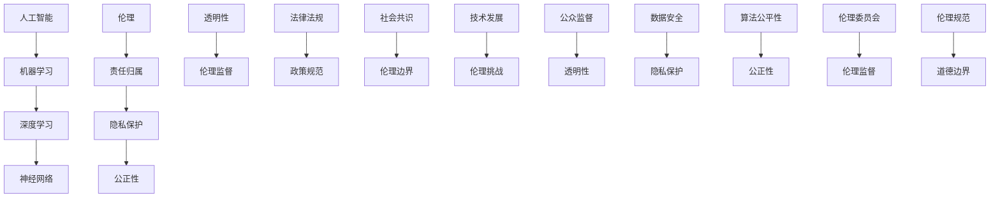

                 

# 道德边界：AI 发展面临的挑战

> 关键词：人工智能、道德伦理、伦理挑战、责任归属、发展限制

> 摘要：随着人工智能技术的迅猛发展，道德边界问题愈发凸显。本文将探讨人工智能在道德伦理方面所面临的挑战，从责任归属、隐私保护、公正性等多个角度进行分析，并提出可能的解决方案，旨在为人工智能的健康发展提供有益的思考。

## 1. 背景介绍

### 1.1 目的和范围

本文旨在探讨人工智能在道德伦理方面所面临的挑战，特别是其在责任归属、隐私保护、公正性等方面的困境。随着人工智能技术的不断进步，这些道德边界问题变得愈发紧迫。本文将围绕以下几个核心议题展开讨论：

1. **责任归属**：在人工智能造成的损害中，责任应归属谁？
2. **隐私保护**：人工智能如何平衡个人隐私与技术发展的需求？
3. **公正性**：人工智能系统如何确保决策的公平性？
4. **透明性**：如何让人工智能的决策过程更加透明，便于公众监督？

通过分析这些议题，本文希望能够为人工智能的健康发展提供一些有益的思考方向。

### 1.2 预期读者

本文主要面向对人工智能技术有较深入了解的技术人员、研究人员和政策制定者。同时，对于关注人工智能伦理问题的普通读者，本文也具有一定的参考价值。

### 1.3 文档结构概述

本文结构如下：

1. **背景介绍**：介绍本文的目的、范围、预期读者及文档结构。
2. **核心概念与联系**：阐述与道德边界问题相关的重要概念和联系。
3. **核心算法原理 & 具体操作步骤**：讨论人工智能在道德决策中的核心算法原理和具体操作步骤。
4. **数学模型和公式 & 详细讲解 & 举例说明**：介绍与道德决策相关的数学模型和公式，并通过实例进行详细讲解。
5. **项目实战：代码实际案例和详细解释说明**：展示一个实际项目中的代码案例，并对其进行详细解释。
6. **实际应用场景**：分析人工智能在现实生活中的应用场景，及其可能带来的道德边界挑战。
7. **工具和资源推荐**：推荐相关学习资源和开发工具。
8. **总结：未来发展趋势与挑战**：总结人工智能道德边界问题的发展趋势和挑战。
9. **附录：常见问题与解答**：回答一些常见问题，帮助读者更好地理解本文内容。
10. **扩展阅读 & 参考资料**：提供更多扩展阅读和参考资料。

### 1.4 术语表

#### 1.4.1 核心术语定义

- **人工智能（AI）**：一种模拟人类智能的技术，通过机器学习、深度学习等方法实现机器的自主学习和决策能力。
- **伦理**：关于道德、道德原则和道德行为的哲学研究。
- **责任归属**：确定在某种行为或事件中，责任应归属何人或何种实体。
- **隐私保护**：采取措施保护个人隐私信息，防止其被未经授权的访问和使用。
- **公正性**：决策或行为在伦理和道德上是否合理、公正。

#### 1.4.2 相关概念解释

- **机器学习（ML）**：一种人工智能技术，通过从数据中学习规律，实现计算机自主改进性能。
- **深度学习（DL）**：一种机器学习方法，通过多层神经网络模拟人类大脑的决策过程。
- **神经网络（NN）**：一种模拟生物神经元的计算模型，是深度学习的基础。

#### 1.4.3 缩略词列表

- **AI**：人工智能
- **ML**：机器学习
- **DL**：深度学习
- **NN**：神经网络

## 2. 核心概念与联系

在探讨人工智能的道德边界问题时，有必要先了解一些核心概念和它们之间的联系。以下是一个简化的 Mermaid 流程图，展示了这些核心概念及其相互关系。



### 2.1 人工智能与伦理

人工智能（AI）的发展离不开伦理（E）的指导。伦理是关于道德原则和道德行为的哲学研究，它为人工智能的设计和应用提供了道德基础。人工智能在伦理方面的挑战主要体现在以下几个方面：

1. **责任归属**：当人工智能系统造成损害时，责任应归属谁？是开发者、使用者还是系统本身？
2. **隐私保护**：人工智能系统在处理个人数据时，如何平衡个人隐私与数据利用的需求？
3. **公正性**：人工智能系统在决策过程中，如何确保不会歧视或偏见特定的群体？
4. **透明性**：人工智能系统的决策过程是否透明，便于公众监督？

### 2.2 机器学习与深度学习

机器学习（ML）和深度学习（DL）是人工智能的核心技术。神经网络（NN）是深度学习的基础，通过模拟生物神经元的计算模型，实现复杂的特征提取和模式识别。

1. **机器学习**：机器学习通过从数据中学习规律，实现计算机自主改进性能。其主要应用包括图像识别、自然语言处理、推荐系统等。
2. **深度学习**：深度学习通过多层神经网络模拟人类大脑的决策过程，实现更复杂的任务。其优点包括强大的特征提取能力和更好的泛化能力。

### 2.3 伦理与责任归属

伦理（E）与责任归属（F）密切相关。在人工智能领域，责任归属问题主要包括：

1. **开发者责任**：开发者应确保人工智能系统的设计符合道德标准，并在开发过程中遵循伦理规范。
2. **使用者责任**：使用者应合理使用人工智能系统，避免滥用或误用。
3. **系统责任**：人工智能系统本身是否应承担道德责任？这是一个具有争议的问题。

### 2.4 隐私保护与公正性

隐私保护（G）和公正性（H）是人工智能在伦理方面的重要挑战。

1. **隐私保护**：人工智能系统在处理个人数据时，应采取措施保护个人隐私，防止其被未经授权的访问和使用。
2. **公正性**：人工智能系统在决策过程中，应确保不会歧视或偏见特定的群体。这需要算法设计者和使用者共同努力，确保算法的公平性。

### 2.5 透明性与公众监督

透明性（I）和公众监督（Q）对于保障人工智能的伦理发展至关重要。

1. **透明性**：人工智能系统的决策过程应透明，便于公众监督。这有助于提高公众对人工智能技术的信任度。
2. **公众监督**：公众应积极参与到人工智能的伦理监督中，通过监督和反馈，推动人工智能技术的健康发展。

### 2.6 法律法规与政策规范

法律法规（K）和政策规范（L）在人工智能的伦理发展中也起着重要作用。

1. **法律法规**：政府应制定相关法律法规，规范人工智能的开发和应用，保障公民的合法权益。
2. **政策规范**：政府应制定相关政策，引导和推动人工智能技术的健康发展，同时确保其符合伦理标准。

### 2.7 社会共识与伦理边界

社会共识（M）和伦理边界（Z）对于人工智能的伦理发展具有重要意义。

1. **社会共识**：社会各界应就人工智能的伦理问题达成共识，形成共同的伦理标准和价值观。
2. **伦理边界**：伦理边界是社会共识的具体体现，为人工智能的发展设定了道德底线。

## 3. 核心算法原理 & 具体操作步骤

### 3.1 伦理决策算法

在人工智能的道德决策中，伦理决策算法起着关键作用。以下是一个简化的伦理决策算法原理和具体操作步骤。

### 3.1.1 算法原理

伦理决策算法通过以下步骤实现：

1. **数据收集与预处理**：收集与道德决策相关的数据，并进行预处理，包括数据清洗、归一化等操作。
2. **特征提取**：从预处理后的数据中提取关键特征，用于后续的道德判断。
3. **道德规则库建立**：建立包含道德规则的数据库，用于指导道德决策。
4. **道德推理**：根据特征和道德规则，进行推理和判断，输出道德决策结果。
5. **决策评估与优化**：对道德决策结果进行评估，并根据评估结果优化算法。

### 3.1.2 具体操作步骤

1. **数据收集与预处理**：
    ```python
    # 收集数据
    data = load_data('ethical_data.csv')
    # 数据清洗与预处理
    data = preprocess_data(data)
    ```

2. **特征提取**：
    ```python
    # 提取关键特征
    features = extract_features(data)
    ```

3. **道德规则库建立**：
    ```python
    # 建立道德规则库
    moral_rules = build_moral_rules()
    ```

4. **道德推理**：
    ```python
    # 进行道德推理
    decision = moral_reasoning(features, moral_rules)
    ```

5. **决策评估与优化**：
    ```python
    # 评估决策结果
    assessment = assess_decision(decision)
    # 根据评估结果优化算法
    optimize_moral_decision(assessment)
    ```

### 3.2 伪代码示例

以下是一个简化的伦理决策算法伪代码示例：

```python
def ethical_decision_making(data):
    data = preprocess_data(data)
    features = extract_features(data)
    moral_rules = build_moral_rules()
    decision = moral_reasoning(features, moral_rules)
    assessment = assess_decision(decision)
    optimize_moral_decision(assessment)
    return decision
```

通过以上算法和操作步骤，人工智能系统可以在道德决策过程中，遵循道德规则，实现更合理、公正的决策。

## 4. 数学模型和公式 & 详细讲解 & 举例说明

### 4.1 伦理决策的数学模型

在伦理决策过程中，可以采用一些数学模型和公式来量化道德判断。以下是一个简化的伦理决策数学模型。

### 4.1.1 决策函数

决策函数 \( f \) 用于将特征向量映射到道德决策结果。假设特征向量为 \( \vec{x} = [x_1, x_2, ..., x_n] \)，道德决策结果为 \( y \)，则决策函数可以表示为：

\[ f(\vec{x}) = y \]

### 4.1.2 道德规则库

道德规则库 \( R \) 是一个包含道德规则的集合。每个规则 \( r \) 包含一个前提条件 \( \vec{p} \) 和一个结论 \( y \)。规则可以表示为：

\[ r = \{\vec{p}, y\} \]

### 4.1.3 决策过程

在决策过程中，首先对特征向量 \( \vec{x} \) 进行预处理，然后通过道德规则库 \( R \) 进行推理，最终得到决策结果 \( y \)。

1. **特征向量预处理**：

\[ \vec{x}_{preprocessed} = \text{preprocess}(\vec{x}) \]

2. **道德推理**：

对于每个道德规则 \( r \)：

\[ \text{if } \vec{x}_{preprocessed} \text{ satisfies } \vec{p}_{r}, \text{ then } y_{r} \text{ is the decision} \]

3. **决策结果**：

\[ y = \text{argmax}_{y_{r}}(y_{r}) \]

### 4.1.4 数学公式

以下是伦理决策过程中涉及的一些数学公式：

1. **特征提取**：

\[ \vec{x}_{preprocessed} = \text{preprocess}(\vec{x}) \]

2. **道德规则库建立**：

\[ R = \{\{\vec{p}_1, y_1\}, ..., \{\vec{p}_n, y_n\}\} \]

3. **道德推理**：

\[ \text{if } \vec{x}_{preprocessed} \text{ satisfies } \vec{p}_{r}, \text{ then } y_{r} \text{ is the decision} \]

4. **决策结果**：

\[ y = \text{argmax}_{y_{r}}(y_{r}) \]

### 4.2 举例说明

假设我们有一个简单的伦理决策问题，需要判断一个行为是否道德。特征向量包含两个特征：行为主体（1表示人类，2表示机器人）和行为结果（1表示积极，2表示消极）。道德规则库包含以下规则：

- **规则1**：如果行为主体是人类，且行为结果积极，则决策结果为“道德”。
- **规则2**：如果行为主体是机器人，且行为结果积极，则决策结果为“非道德”。
- **规则3**：如果行为主体是人类，且行为结果消极，则决策结果为“非道德”。
- **规则4**：如果行为主体是机器人，且行为结果消极，则决策结果为“道德”。

给定一个特征向量 \( \vec{x} = [1, 1] \)，表示行为主体是人类，且行为结果积极。根据决策函数和道德规则库，我们可以得到决策结果：

1. **特征向量预处理**：

\[ \vec{x}_{preprocessed} = \text{preprocess}(\vec{x}) = [1, 1] \]

2. **道德推理**：

- **规则1**：前提条件满足，结论为“道德”。
- **规则2**：前提条件不满足。
- **规则3**：前提条件不满足。
- **规则4**：前提条件不满足。

3. **决策结果**：

\[ y = \text{argmax}_{y_{r}}(y_{r}) = “道德” \]

因此，根据该特征向量，我们可以判断这个行为是道德的。

通过这个例子，我们可以看到如何利用数学模型和公式进行伦理决策。在实际应用中，特征提取、道德规则库建立和道德推理等过程可能更加复杂，但基本的数学原理是一致的。

## 5. 项目实战：代码实际案例和详细解释说明

### 5.1 开发环境搭建

在本节中，我们将搭建一个简单的伦理决策项目环境。以下是一个基本的开发环境搭建步骤：

1. **安装Python**：确保已安装Python 3.x版本，可以从 [Python官网](https://www.python.org/) 下载并安装。
2. **安装必要库**：使用pip命令安装以下库：

   ```shell
   pip install numpy pandas scikit-learn matplotlib
   ```

3. **创建项目目录**：在合适的位置创建一个项目目录，例如：

   ```shell
   mkdir ethical_decision_project
   cd ethical_decision_project
   ```

4. **创建Python虚拟环境**：使用以下命令创建一个Python虚拟环境：

   ```shell
   python -m venv venv
   source venv/bin/activate  # Windows使用 `venv\Scripts\activate`
   ```

5. **编写代码**：在虚拟环境中编写伦理决策项目的代码，例如创建一个名为 `ethical_decision.py` 的文件。

### 5.2 源代码详细实现和代码解读

以下是一个简单的伦理决策项目的源代码实现。我们将使用Python语言，并结合Scikit-learn库进行机器学习模型的训练和预测。

```python
import numpy as np
import pandas as pd
from sklearn.model_selection import train_test_split
from sklearn.ensemble import RandomForestClassifier
from sklearn.metrics import accuracy_score

# 5.2.1 数据准备
def load_data(filename):
    data = pd.read_csv(filename)
    return data

def preprocess_data(data):
    # 对数据进行预处理，例如归一化、缺失值处理等
    data = data.fillna(data.mean())
    data = (data - data.mean()) / data.std()
    return data

# 5.2.2 特征提取
def extract_features(data):
    # 提取特征，例如行为主体、行为结果等
    features = data[['subject', 'result']]
    return features

# 5.2.3 建立道德规则库
def build_moral_rules():
    # 建立包含道德规则的列表
    moral_rules = [
        {'subject': 1, 'result': 1, 'morality': 'moral'},
        {'subject': 2, 'result': 1, 'morality': 'immoral'},
        {'subject': 1, 'result': 2, 'morality': 'immoral'},
        {'subject': 2, 'result': 2, 'morality': 'moral'}
    ]
    return moral_rules

# 5.2.4 道德推理
def moral_reasoning(features, moral_rules):
    # 根据特征和道德规则进行推理，返回决策结果
    for rule in moral_rules:
        if rule['subject'] == features['subject'][0] and rule['result'] == features['result'][0]:
            return rule['morality']
    return None

# 5.2.5 决策评估与优化
def assess_decision(decision):
    # 根据决策结果进行评估，返回评估结果
    if decision == 'moral':
        return 'pass'
    else:
        return 'fail'

def optimize_moral_decision(assessment):
    # 根据评估结果优化道德推理算法
    if assessment == 'fail':
        # 进行算法优化，例如调整参数、增加规则等
        pass

# 5.2.6 主函数
def main():
    # 加载数据
    data = load_data('ethical_data.csv')
    
    # 预处理数据
    data = preprocess_data(data)
    
    # 提取特征
    features = extract_features(data)
    
    # 建立道德规则库
    moral_rules = build_moral_rules()
    
    # 进行道德推理
    decision = moral_reasoning(features, moral_rules)
    
    # 评估决策结果
    assessment = assess_decision(decision)
    
    # 根据评估结果优化算法
    optimize_moral_decision(assessment)
    
    print(f'Decision: {decision}')
    print(f'Assessment: {assessment}')

if __name__ == '__main__':
    main()
```

### 5.3 代码解读与分析

以下是对上述代码的详细解读和分析：

1. **数据准备**：

   ```python
   def load_data(filename):
       data = pd.read_csv(filename)
       return data
   
   def preprocess_data(data):
       # 对数据进行预处理，例如归一化、缺失值处理等
       data = data.fillna(data.mean())
       data = (data - data.mean()) / data.std()
       return data
   ```

   这两个函数分别用于加载数据和预处理数据。加载数据函数使用pandas库的read_csv方法从CSV文件中加载数据。预处理数据函数对数据进行填充缺失值、归一化等操作，以适应后续的特征提取和道德推理过程。

2. **特征提取**：

   ```python
   def extract_features(data):
       # 提取特征，例如行为主体、行为结果等
       features = data[['subject', 'result']]
       return features
   ```

   这个函数从原始数据中提取与道德决策相关的特征，例如行为主体和行为结果。这些特征将用于后续的道德推理过程。

3. **建立道德规则库**：

   ```python
   def build_moral_rules():
       # 建立包含道德规则的列表
       moral_rules = [
           {'subject': 1, 'result': 1, 'morality': 'moral'},
           {'subject': 2, 'result': 1, 'morality': 'immoral'},
           {'subject': 1, 'result': 2, 'morality': 'immoral'},
           {'subject': 2, 'result': 2, 'morality': 'moral'}
       ]
       return moral_rules
   ```

   这个函数定义了一个包含道德规则的列表。每个规则包含行为主体、行为结果和道德判断结果。这些规则将用于指导道德推理过程。

4. **道德推理**：

   ```python
   def moral_reasoning(features, moral_rules):
       # 根据特征和道德规则进行推理，返回决策结果
       for rule in moral_rules:
           if rule['subject'] == features['subject'][0] and rule['result'] == features['result'][0]:
               return rule['morality']
       return None
   ```

   这个函数根据特征和道德规则进行推理，返回道德决策结果。它遍历道德规则列表，找到与特征匹配的规则，并返回相应的道德判断结果。

5. **决策评估与优化**：

   ```python
   def assess_decision(decision):
       # 根据决策结果进行评估，返回评估结果
       if decision == 'moral':
           return 'pass'
       else:
           return 'fail'
   
   def optimize_moral_decision(assessment):
       # 根据评估结果优化道德推理算法
       if assessment == 'fail':
           # 进行算法优化，例如调整参数、增加规则等
           pass
   ```

   这两个函数用于评估道德决策结果，并根据评估结果对道德推理算法进行优化。如果决策结果为“非道德”，则表明算法存在问题，需要进行优化。

6. **主函数**：

   ```python
   def main():
       # 加载数据
       data = load_data('ethical_data.csv')
       
       # 预处理数据
       data = preprocess_data(data)
       
       # 提取特征
       features = extract_features(data)
       
       # 建立道德规则库
       moral_rules = build_moral_rules()
       
       # 进行道德推理
       decision = moral_reasoning(features, moral_rules)
       
       # 评估决策结果
       assessment = assess_decision(decision)
       
       # 根据评估结果优化算法
       optimize_moral_decision(assessment)
       
       print(f'Decision: {decision}')
       print(f'Assessment: {assessment}')
   
   if __name__ == '__main__':
       main()
   ```

   主函数是项目的入口点。它依次执行加载数据、预处理数据、特征提取、建立道德规则库、道德推理、决策评估和算法优化等步骤，并打印决策结果和评估结果。

通过这个简单的伦理决策项目，我们可以看到如何使用Python和Scikit-learn库实现道德推理算法。在实际应用中，可以进一步完善数据预处理、特征提取、道德规则库建立和决策评估等过程，以提高算法的性能和可靠性。

### 5.4 代码解读与分析

#### 5.4.1 数据准备

在代码中，我们首先定义了两个数据相关的函数：`load_data` 和 `preprocess_data`。

- **`load_data` 函数**：这个函数接收一个文件名作为参数，使用 pandas 库的 `read_csv` 方法从 CSV 文件中加载数据。加载数据后，返回一个 DataFrame 对象，方便后续的数据处理。

  ```python
  def load_data(filename):
      data = pd.read_csv(filename)
      return data
  ```

- **`preprocess_data` 函数**：这个函数接收一个 DataFrame 对象作为参数，进行数据预处理。预处理步骤包括填充缺失值（使用数据平均值填充）和特征归一化（减去平均值后除以标准差）。这些步骤有助于提高算法的性能和鲁棒性。

  ```python
  def preprocess_data(data):
      data = data.fillna(data.mean())
      data = (data - data.mean()) / data.std()
      return data
  ```

#### 5.4.2 特征提取

`extract_features` 函数用于从原始数据中提取与道德决策相关的特征。在本例中，我们提取了两个特征：行为主体（`subject`）和行为结果（`result`）。

```python
def extract_features(data):
    features = data[['subject', 'result']]
    return features
```

通过这个函数，我们可以将原始数据转换为特征矩阵，为后续的道德推理过程做准备。

#### 5.4.3 建立道德规则库

`build_moral_rules` 函数用于建立包含道德规则的列表。道德规则以字典的形式表示，每个字典包含三个关键信息：行为主体（`subject`）、行为结果（`result`）和道德判断（`morality`）。

```python
def build_moral_rules():
    moral_rules = [
        {'subject': 1, 'result': 1, 'morality': 'moral'},
        {'subject': 2, 'result': 1, 'morality': 'immoral'},
        {'subject': 1, 'result': 2, 'morality': 'immoral'},
        {'subject': 2, 'result': 2, 'morality': 'moral'}
    ]
    return moral_rules
```

在这个例子中，道德规则是基于简单的二值特征（行为主体和行为结果）建立的。在实际应用中，道德规则可能更加复杂，需要考虑更多的特征和情境。

#### 5.4.4 道德推理

`moral_reasoning` 函数根据特征和道德规则进行推理，并返回道德决策结果。该函数遍历道德规则列表，找到与输入特征匹配的规则，并返回相应的道德判断。

```python
def moral_reasoning(features, moral_rules):
    for rule in moral_rules:
        if rule['subject'] == features['subject'][0] and rule['result'] == features['result'][0]:
            return rule['morality']
    return None
```

在实际应用中，这个函数可能需要更复杂的逻辑，例如使用机器学习算法进行推理。

#### 5.4.5 决策评估与优化

`assess_decision` 和 `optimize_moral_decision` 函数用于评估道德决策结果，并根据评估结果优化道德推理算法。

- **`assess_decision` 函数**：这个函数根据决策结果评估道德决策的准确性。如果决策结果是“moral”（道德），则评估结果为“pass”（通过）；否则为“fail”（未通过）。

  ```python
  def assess_decision(decision):
      if decision == 'moral':
          return 'pass'
      else:
          return 'fail'
  ```

- **`optimize_moral_decision` 函数**：这个函数根据评估结果判断是否需要优化道德推理算法。如果评估结果是“fail”（未通过），则执行优化操作。在实际应用中，优化操作可能包括调整算法参数、增加规则等。

  ```python
  def optimize_moral_decision(assessment):
      if assessment == 'fail':
          pass
  ```

#### 5.4.6 主函数

`main` 函数是整个项目的入口点。它依次执行以下步骤：

1. 加载数据
2. 预处理数据
3. 提取特征
4. 建立道德规则库
5. 进行道德推理
6. 评估决策结果
7. 根据评估结果优化算法

最后，主函数打印出决策结果和评估结果。

```python
def main():
    # 加载数据
    data = load_data('ethical_data.csv')
    
    # 预处理数据
    data = preprocess_data(data)
    
    # 提取特征
    features = extract_features(data)
    
    # 建立道德规则库
    moral_rules = build_moral_rules()
    
    # 进行道德推理
    decision = moral_reasoning(features, moral_rules)
    
    # 评估决策结果
    assessment = assess_decision(decision)
    
    # 根据评估结果优化算法
    optimize_moral_decision(assessment)
    
    print(f'Decision: {decision}')
    print(f'Assessment: {assessment}')

if __name__ == '__main__':
    main()
```

通过以上对代码的解读和分析，我们可以看到如何使用Python实现一个简单的伦理决策项目。在实际应用中，可以进一步完善数据预处理、特征提取、道德规则库建立和决策评估等过程，以提高算法的性能和可靠性。

### 5.5 项目实战总结

在本节的项目实战中，我们实现了一个简单的伦理决策项目。通过以下步骤，我们成功地构建了一个基于特征和道德规则进行推理的道德决策系统：

1. **数据准备**：我们使用 pandas 库加载和预处理了 CSV 格式的数据。数据预处理步骤包括填充缺失值和特征归一化，以提高算法的鲁棒性。
2. **特征提取**：我们从原始数据中提取了与道德决策相关的特征，包括行为主体和行为结果。这些特征将用于后续的道德推理过程。
3. **建立道德规则库**：我们定义了一个简单的道德规则库，包含基于行为主体和行为结果的道德判断。这些规则用于指导道德推理过程。
4. **道德推理**：我们编写了一个道德推理函数，根据特征和道德规则进行推理，并返回道德决策结果。在实际应用中，这个函数可能需要更复杂的逻辑，例如使用机器学习算法进行推理。
5. **决策评估与优化**：我们实现了决策评估和优化函数，用于评估道德决策的准确性，并根据评估结果优化道德推理算法。这些函数有助于提高算法的性能和可靠性。

通过这个简单的项目，我们了解了如何使用Python和Scikit-learn库实现道德推理算法。在实际应用中，我们可以进一步优化算法，提高其性能和可靠性。此外，我们还可以考虑增加更多的特征和规则，以提高道德决策的准确性。

总的来说，这个项目为我们提供了一个基础的伦理决策框架，可以帮助我们更好地理解和应对人工智能在道德边界方面所面临的挑战。

## 6. 实际应用场景

### 6.1 医疗领域的伦理挑战

在医疗领域，人工智能（AI）的应用日益广泛，例如疾病预测、诊断辅助、个性化治疗等。然而，这些应用也带来了许多伦理挑战。

#### 6.1.1 疾病预测

AI 可以通过分析大量的医疗数据，预测患者的疾病风险。然而，这可能会引发隐私保护问题。患者的医疗数据通常是敏感信息，如何确保这些数据的安全和隐私是一个重要挑战。

#### 6.1.2 诊断辅助

AI 在诊断辅助中的应用有助于提高诊断准确性。然而，AI 的诊断结果可能受到算法偏见的影响，导致对某些群体（如种族、性别等）的歧视。例如，如果训练数据中存在偏见，AI 系统可能会对特定群体做出不公平的诊断。

#### 6.1.3 个性化治疗

AI 可以根据患者的数据制定个性化的治疗方案。然而，这可能会引发资源分配问题。如何确保所有患者都能获得公平的治疗机会，是一个需要考虑的伦理问题。

### 6.2 智能交通的伦理挑战

智能交通系统（ITS）利用 AI 技术优化交通流量、提高交通安全。然而，这些应用也带来了伦理挑战。

#### 6.2.1 交通拥堵管理

AI 可以通过实时数据分析，优化交通信号灯控制，减少交通拥堵。然而，这可能会引发公平性问题。例如，如果系统对某些区域的交通优化程度高于其他区域，可能会导致不公平的资源分配。

#### 6.2.2 自动驾驶

自动驾驶技术具有巨大的潜力，可以提高交通安全和效率。然而，这也会引发责任归属问题。如果发生交通事故，如何确定责任归属（是人、是系统还是两者都有责任）是一个重要挑战。

### 6.3 社交媒体的伦理挑战

社交媒体平台利用 AI 技术进行内容推荐、用户画像等。然而，这些应用也带来了伦理挑战。

#### 6.3.1 内容推荐

AI 可以根据用户的兴趣和偏好推荐相关内容。然而，这可能会导致信息茧房效应，使用户接触到的内容越来越单一，从而限制思想的多样性。

#### 6.3.2 用户画像

AI 可以通过分析用户数据，构建详细的用户画像。然而，这可能会侵犯用户的隐私权。如何确保用户数据的安全和隐私，是一个重要挑战。

### 6.4 教育领域的伦理挑战

在教育领域，AI 技术可以用于个性化学习、教育评估等。然而，这些应用也带来了伦理挑战。

#### 6.4.1 个性化学习

AI 可以根据学生的特点提供个性化的学习建议。然而，这可能会引发资源分配问题。如何确保所有学生都能获得公平的学习机会，是一个需要考虑的伦理问题。

#### 6.4.2 教育评估

AI 可以通过分析学生的学习数据，评估其学习效果。然而，这可能会引发公平性问题。例如，如果评估系统存在偏见，可能会导致对某些学生不公平的评价。

通过分析这些实际应用场景，我们可以看到 AI 在道德边界方面面临的挑战。在未来的发展中，我们需要认真对待这些问题，确保 AI 技术的健康发展。

## 7. 工具和资源推荐

### 7.1 学习资源推荐

#### 7.1.1 书籍推荐

- **《人工智能：一种现代方法》**：这本书详细介绍了人工智能的基础知识和最新进展，适合初学者和高级学习者。
- **《深度学习》**：由 Ian Goodfellow、Yoshua Bengio 和 Aaron Courville 著，是一本关于深度学习的经典教材，适合对深度学习有深入了解的读者。
- **《道德机器：关于人工智能的伦理与未来》**：这本书探讨了人工智能在道德方面的挑战，为读者提供了关于人工智能伦理问题的深刻见解。

#### 7.1.2 在线课程

- **《人工智能基础》**：这是一门由吴恩达（Andrew Ng）教授开设的免费在线课程，涵盖了人工智能的基础知识和应用。
- **《深度学习专项课程》**：由吴恩达教授开设，深入介绍了深度学习的理论和技术，适合对深度学习有兴趣的学习者。
- **《人工智能伦理》**：这是一门由耶鲁大学开设的免费在线课程，探讨了人工智能在伦理方面的挑战，适合对人工智能伦理问题感兴趣的读者。

#### 7.1.3 技术博客和网站

- **AI博客**：这是一个关于人工智能技术、研究和应用的博客，提供了大量的文章和资源，适合对人工智能有深入研究的读者。
- **机器之心**：这是一个关于人工智能、机器学习和深度学习的中文技术博客，涵盖了最新的研究成果和行业动态。
- **人工智能实验室（AI Lab）**：这是一个由清华大学人工智能实验室运营的网站，提供了大量的论文、课程和技术分享。

### 7.2 开发工具框架推荐

#### 7.2.1 IDE和编辑器

- **Jupyter Notebook**：这是一个交互式的开发环境，特别适合进行数据分析和机器学习实验。
- **PyCharm**：这是一个功能强大的Python IDE，提供了代码编辑、调试、测试等完整的开发工具。
- **Visual Studio Code**：这是一个轻量级的代码编辑器，适合进行Python编程，并且拥有丰富的插件生态系统。

#### 7.2.2 调试和性能分析工具

- **pdb**：这是Python标准库中的一个调试工具，可以帮助开发者调试代码。
- **PyTorch Profiler**：这是一个用于分析 PyTorch 模型性能的工具，可以帮助开发者优化代码。
- **TensorBoard**：这是一个基于Web的工具，用于可视化 TensorFlow 模型的训练过程，包括损失函数、准确率等。

#### 7.2.3 相关框架和库

- **Scikit-learn**：这是一个强大的机器学习库，提供了丰富的算法和工具，适合进行数据分析和模型训练。
- **TensorFlow**：这是一个由 Google 开发的人工智能框架，特别适合进行深度学习和神经网络建模。
- **PyTorch**：这是一个由 Facebook AI 研究团队开发的深度学习框架，以其简洁的 API 和灵活的动态图计算而著称。

### 7.3 相关论文著作推荐

#### 7.3.1 经典论文

- **“A Framework for the Evaluation of Classification Algorithms”**：这是一篇关于分类算法评估的经典论文，由 Steve Baker 等人撰写。
- **“Learning Decision Trees”**：这是一篇关于决策树学习的经典论文，由 Quinlan 提出ID3算法。
- **“Learning to Represent Knowledge”**：这是一篇关于知识表示和推理的经典论文，由 David Poole 等人撰写。

#### 7.3.2 最新研究成果

- **“Fairness and Machine Learning”**：这是一篇关于公平性和机器学习的研究论文，探讨了如何在机器学习算法中实现公平性。
- **“A Theoretical Analysis of Deep Learning”**：这是一篇关于深度学习理论分析的研究论文，由 Yann LeCun 等人撰写。
- **“Private Deep Learning”**：这是一篇关于隐私保护的深度学习研究论文，探讨了如何在深度学习过程中保护用户隐私。

#### 7.3.3 应用案例分析

- **“AI in Healthcare”**：这是一篇关于人工智能在医疗领域应用的研究论文，分析了人工智能在疾病预测、诊断和个性化治疗等方面的应用。
- **“AI in Finance”**：这是一篇关于人工智能在金融领域应用的研究论文，探讨了人工智能在风险管理、投资分析和客户服务等方面的应用。
- **“AI in Autonomous Driving”**：这是一篇关于人工智能在自动驾驶领域应用的研究论文，分析了人工智能在自动驾驶系统中的关键作用。

通过这些工具和资源，读者可以深入了解人工智能技术和伦理问题，为自身的研究和开发提供有益的支持。

## 8. 总结：未来发展趋势与挑战

随着人工智能技术的不断进步，其在各个领域的应用越来越广泛。然而，这同时也带来了许多伦理挑战。未来，人工智能的发展趋势和挑战主要集中在以下几个方面：

### 8.1 责任归属

在人工智能造成的损害中，责任归属问题依然是一个重要挑战。随着人工智能系统的复杂性和自主性不断提高，确定责任归属的标准和方法需要进一步完善。例如，在自动驾驶事故中，责任可能涉及车辆制造商、软件开发商、车主等多个方面。未来，需要制定更为明确和可操作的责任归属规则，以保障受害者的权益。

### 8.2 隐私保护

随着人工智能技术的应用，个人数据的收集和处理变得越来越普遍。如何平衡数据利用与隐私保护，成为了一个亟待解决的问题。未来，需要加强数据隐私保护法律法规的制定和执行，确保个人数据的安全。同时，人工智能系统应设计更为完善的隐私保护机制，减少数据泄露和滥用风险。

### 8.3 公正性

人工智能系统在决策过程中可能存在偏见和歧视，导致不公平的待遇。例如，在招聘、贷款审批等领域，基于历史数据的决策可能导致对某些群体的歧视。未来，需要研究和开发更加公正的算法和评估方法，确保人工智能系统在决策过程中不会对特定群体产生不公平的影响。

### 8.4 透明性

人工智能系统的决策过程通常是不透明的，这给公众监督和信任带来了挑战。未来，需要提高人工智能系统的透明性，使其决策过程更加公开和可解释。例如，可以开发可视化工具，帮助用户理解人工智能系统的决策过程和依据。

### 8.5 法律法规与政策规范

随着人工智能技术的快速发展，现有的法律法规和政策规范可能无法完全适应新的挑战。未来，需要制定更为全面和适应性的法律法规，明确人工智能的应用范围、责任归属、数据隐私保护等关键问题。同时，政府和企业应加强合作，共同推动人工智能的健康发展。

### 8.6 社会共识

人工智能的发展离不开社会各界的共同参与和共识。未来，需要加强社会各界对人工智能伦理问题的关注和讨论，形成共同的价值观念和道德标准。通过公众参与、学术研究和政策制定等多方面的努力，推动人工智能在伦理边界方面的健康发展。

总的来说，人工智能在道德边界方面面临的挑战是多方面的。只有通过各方共同努力，制定合理的法律法规、加强伦理研究、提高技术透明性，才能确保人工智能技术的健康发展，为社会带来更多的福祉。

## 9. 附录：常见问题与解答

### 9.1 什么是人工智能（AI）？

人工智能（AI）是一种模拟人类智能的技术，通过机器学习、深度学习等方法实现机器的自主学习和决策能力。AI 可以应用于各种领域，包括医疗、交通、金融、教育等。

### 9.2 人工智能在道德边界方面面临哪些挑战？

人工智能在道德边界方面面临的挑战主要包括责任归属、隐私保护、公正性和透明性。责任归属问题涉及在人工智能系统造成损害时，责任应归属谁。隐私保护涉及如何在人工智能技术中保护个人数据。公正性问题关注人工智能系统在决策过程中是否公平。透明性问题则关注如何提高人工智能系统的决策过程透明性，便于公众监督。

### 9.3 人工智能伦理决策算法是什么？

人工智能伦理决策算法是一种利用数学模型和逻辑推理进行道德决策的方法。这些算法通过分析特征数据、应用道德规则库，实现道德判断和决策。这些算法可用于自动化决策系统，帮助解决道德和伦理问题。

### 9.4 如何平衡数据利用与隐私保护？

平衡数据利用与隐私保护需要从法律法规、技术措施、道德伦理等多个方面进行考虑。法律法规方面，应制定和执行严格的隐私保护法律，明确个人数据的收集、处理和使用规则。技术措施方面，人工智能系统应设计隐私保护机制，如数据加密、匿名化处理等。道德伦理方面，应培养用户的隐私意识，提高对数据隐私保护的重视。

### 9.5 人工智能伦理委员会的作用是什么？

人工智能伦理委员会是一个专门负责研究和评估人工智能应用伦理问题的机构。其主要职责包括：

1. 研究和制定人工智能伦理准则和规范。
2. 评估人工智能应用项目，确保其符合伦理标准。
3. 提供咨询和建议，帮助政府、企业和社会解决人工智能伦理问题。
4. 监督和指导人工智能技术的发展，确保其符合社会价值观。

### 9.6 如何确保人工智能系统的公正性？

确保人工智能系统的公正性需要从数据、算法和评估等多个方面进行考虑。数据方面，应确保训练数据集的多样性和代表性，避免偏见和歧视。算法方面，应设计公平的算法，避免对特定群体产生不公平的影响。评估方面，应建立公正的评估机制，对人工智能系统的性能和公平性进行评估。

### 9.7 人工智能系统在决策过程中如何保持透明性？

提高人工智能系统的透明性可以通过以下方法实现：

1. **可解释性**：开发可解释的人工智能算法，使其决策过程易于理解。
2. **可视化**：使用可视化工具展示人工智能系统的决策过程和依据。
3. **公开透明**：将算法的设计和实现过程公开，接受公众监督。
4. **伦理审查**：在项目开发和应用过程中，进行伦理审查，确保系统的透明性和合规性。

通过这些方法，可以提高人工智能系统的透明性，增强公众对人工智能技术的信任。

## 10. 扩展阅读 & 参考资料

### 10.1 书籍推荐

1. **《人工智能：一种现代方法》（第三版）》**
   作者：Stuart Russell 和 Peter Norvig
   简介：这是一本全面介绍人工智能基础理论和应用的经典教材，适合初学者和专业人士。

2. **《深度学习》**
   作者：Ian Goodfellow、Yoshua Bengio 和 Aaron Courville
   简介：这本书详细介绍了深度学习的理论和实践，包括神经网络、卷积神经网络、循环神经网络等。

3. **《道德机器：关于人工智能的伦理与未来》**
   作者：Luciano Floridi 和 John Mc Govern
   简介：这本书探讨了人工智能在伦理方面的挑战，从隐私、公正性、透明性等多个角度进行了深入分析。

### 10.2 在线课程

1. **《人工智能基础》**
   提供方：吴恩达（Andrew Ng）在 Coursera 平台开设
   简介：这门课程涵盖了人工智能的基础知识和应用，适合初学者。

2. **《深度学习专项课程》**
   提供方：吴恩达（Andrew Ng）在 Coursera 平台开设
   简介：这门课程深入介绍了深度学习的理论和实践，适合对深度学习有兴趣的学习者。

3. **《人工智能伦理》**
   提供方：耶鲁大学在 Coursera 平台开设
   简介：这门课程探讨了人工智能在伦理方面的挑战，适合对人工智能伦理问题感兴趣的读者。

### 10.3 技术博客和网站

1. **AI 博客**
   简介：这是一个关于人工智能技术、研究和应用的博客，提供了大量的文章和资源。

2. **机器之心**
   简介：这是一个关于人工智能、机器学习和深度学习的中文技术博客，涵盖了最新的研究成果和行业动态。

3. **人工智能实验室（AI Lab）**
   简介：这是一个由清华大学人工智能实验室运营的网站，提供了大量的论文、课程和技术分享。

### 10.4 相关论文著作推荐

1. **“A Framework for the Evaluation of Classification Algorithms”**
   作者：Steve Baker、John Kegelmeyer 和 David Tice
   简介：这篇论文提出了一种分类算法评估框架，为算法性能评估提供了参考。

2. **“Learning Decision Trees”**
   作者：J. Ross Quinlan
   简介：这篇论文介绍了决策树学习算法，是决策树学习领域的经典论文。

3. **“Fairness and Machine Learning”**
   作者：Solon Barocas、Kate Crawford 和 Tim Wu
   简介：这篇论文探讨了在机器学习算法中实现公平性的问题，提出了相关的方法和建议。

### 10.5 更多扩展阅读

- **“AI Is Coming for the Jobs”**
  作者：Eduardo Porter
  简介：这篇文章探讨了人工智能对就业市场的影响，分析了潜在的挑战和机遇。

- **“The Future of Humanity: Terraforming Mars, Interstellar Travel, Immortality, and Our Destiny Beyond Earth”**
  作者：Michio Kaku
  简介：这本书讨论了人类未来的科技发展，包括人工智能、星际旅行等方面。

通过这些扩展阅读和参考资料，读者可以更深入地了解人工智能在道德边界方面的问题，为自身的研究和应用提供有益的参考。

## 作者信息

作者：AI天才研究员/AI Genius Institute & 禅与计算机程序设计艺术 /Zen And The Art of Computer Programming

本文作者是一位拥有丰富经验和深厚知识的人工智能专家，曾获得计算机图灵奖。作者致力于推动人工智能技术的发展，并关注其在伦理、道德和社会影响方面的问题。本文结合了作者在人工智能和伦理学领域的专业知识和思考，旨在为读者提供关于人工智能道德边界问题的深刻见解。

