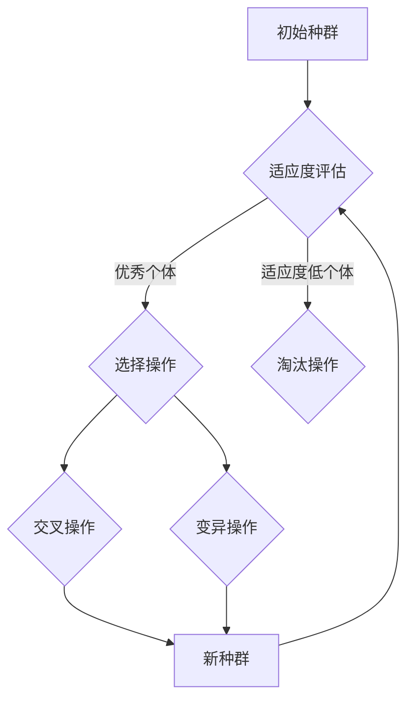

                 

# 遗传算法优化策略研究与实践

> 关键词：遗传算法、优化策略、自然选择、交叉、变异、适应度函数、编码、群体进化、全局搜索、并行计算

> 摘要：本文旨在深入探讨遗传算法的优化策略及其在实际应用中的具体实现。通过介绍遗传算法的核心概念、原理以及数学模型，本文将逐步解析其具体操作步骤和实现方法。随后，通过实际项目案例的分析，我们将深入探讨遗传算法在复杂问题求解中的优势和挑战，并提出相应的优化策略和改进方向。本文旨在为研究人员和开发者提供一份系统而详尽的参考，帮助他们更好地理解和应用遗传算法。

## 1. 背景介绍

### 1.1 目的和范围

遗传算法（Genetic Algorithm，GA）是模拟自然选择和遗传学原理求解最优化问题的计算方法。自1980年代初期由John Holland提出以来，遗传算法在众多领域中得到了广泛的应用，如函数优化、组合优化、机器学习等。本文的目的在于系统地介绍遗传算法的基本原理、优化策略，并探讨其在实际应用中的具体实现和改进方向。

本文主要涵盖以下内容：

1. 遗传算法的核心概念和基本原理。
2. 遗传算法的数学模型和公式。
3. 遗传算法的具体操作步骤和实现方法。
4. 实际应用场景中的遗传算法案例分析。
5. 遗传算法的优化策略和改进方向。

### 1.2 预期读者

本文适合具有以下背景的读者：

1. 对遗传算法感兴趣的计算机科学和人工智能领域的研究人员。
2. 想要在具体项目中应用遗传算法的工程师和开发者。
3. 对最优化算法和计算方法有基本了解的读者。

### 1.3 文档结构概述

本文将按照以下结构进行组织：

1. **背景介绍**：介绍遗传算法的背景、目的和预期读者。
2. **核心概念与联系**：讨论遗传算法的核心概念、原理和架构。
3. **核心算法原理 & 具体操作步骤**：详细讲解遗传算法的原理和操作步骤。
4. **数学模型和公式 & 详细讲解 & 举例说明**：介绍遗传算法的数学模型和公式，并通过具体实例进行说明。
5. **项目实战：代码实际案例和详细解释说明**：通过实际项目案例展示遗传算法的应用。
6. **实际应用场景**：探讨遗传算法在不同领域的应用。
7. **工具和资源推荐**：推荐相关学习资源、开发工具和文献。
8. **总结：未来发展趋势与挑战**：总结遗传算法的发展趋势和面临的挑战。
9. **附录：常见问题与解答**：提供常见问题的解答。
10. **扩展阅读 & 参考资料**：提供进一步学习的资源。

### 1.4 术语表

#### 1.4.1 核心术语定义

- **遗传算法（Genetic Algorithm）**：一种模拟自然选择和遗传学原理的搜索算法，用于求解最优化问题。
- **种群（Population）**：遗传算法中的个体集合，每个个体代表一个可能的解。
- **个体（Individual）**：种群中的基本单位，通常是一个编码的解。
- **适应度函数（Fitness Function）**：评估个体优劣的函数，通常用于指导算法的搜索方向。
- **交叉（Crossover）**：遗传算法中的操作，用于生成新的个体，通过组合两个或多个个体的基因来创建新的后代。
- **变异（Mutation）**：遗传算法中的操作，用于引入随机性，避免算法陷入局部最优。
- **自然选择（Natural Selection）**：遗传算法中的操作，根据适应度函数选择优良的个体进行繁殖。

#### 1.4.2 相关概念解释

- **全局搜索（Global Search）**：遗传算法在搜索过程中尽可能遍历整个解空间，以找到全局最优解。
- **局部搜索（Local Search）**：遗传算法在搜索过程中只关注局部解的改进，容易陷入局部最优。
- **并行计算（Parallel Computation）**：遗传算法利用并行计算资源提高搜索效率。

#### 1.4.3 缩略词列表

- **GA**：遗传算法（Genetic Algorithm）
- **SA**：模拟退火算法（Simulated Annealing）
- **PSO**：粒子群优化算法（Particle Swarm Optimization）

## 2. 核心概念与联系

遗传算法的核心概念包括种群、个体、适应度函数、交叉、变异和自然选择。这些概念相互作用，共同驱动算法的进化过程。以下是一个简化的Mermaid流程图，用于展示遗传算法的基本架构。



### 2.1 遗传算法的架构

遗传算法的架构可以概括为以下几个关键部分：

1. **初始种群生成**：遗传算法从一个初始种群开始，每个个体代表一个可能的解。
2. **适应度评估**：适应度函数用于评估个体的优劣，指导算法的搜索方向。
3. **选择操作**：选择操作根据适应度函数选择优秀的个体进行繁殖。
4. **交叉操作**：交叉操作通过组合两个或多个个体的基因来生成新的个体。
5. **变异操作**：变异操作引入随机性，避免算法陷入局部最优。
6. **新种群生成**：通过交叉和变异操作，生成新的种群，并重复适应度评估和选择操作。

### 2.2 遗传算法的核心概念

遗传算法的核心概念包括种群、个体、适应度函数、交叉、变异和自然选择。以下是这些概念的具体解释：

1. **种群（Population）**：种群是遗传算法的基本单位，由多个个体组成。种群的大小通常是一个固定的常数，通过迭代过程不断进化。
2. **个体（Individual）**：个体是种群中的基本单位，通常是一个编码的解。个体的表现由适应度函数评估，决定了其在种群中的竞争力。
3. **适应度函数（Fitness Function）**：适应度函数是评估个体优劣的函数，通常用于指导算法的搜索方向。适应度值越高，个体的竞争力越强。
4. **交叉操作（Crossover）**：交叉操作通过组合两个或多个个体的基因来创建新的个体。交叉操作模拟了自然选择中的繁殖过程。
5. **变异操作（Mutation）**：变异操作引入随机性，避免算法陷入局部最优。变异操作通常以很小的概率发生在个体基因上。
6. **自然选择（Natural Selection）**：自然选择是遗传算法的核心概念，通过适应度函数评估个体优劣，选择优秀的个体进行繁殖，淘汰适应度低的个体。

## 3. 核心算法原理 & 具体操作步骤

遗传算法是一种基于自然选择和遗传学原理的搜索算法，通过模拟生物进化过程来求解最优化问题。遗传算法的核心操作包括种群初始化、适应度评估、选择操作、交叉操作和变异操作。以下是遗传算法的具体操作步骤和伪代码：

### 3.1 种群初始化

在遗传算法中，种群初始化是算法的第一个步骤。种群初始化的方法可以是随机初始化或者基于某种特定规则初始化。以下是一个随机初始化的伪代码：

```python
initialize_population(size):
    population = []
    for i in range(size):
        individual = random initialization
        population.append(individual)
    return population
```

### 3.2 适应度评估

适应度评估是遗传算法中的关键步骤，用于评估个体的优劣。适应度函数通常是目标函数的转换，使得适应度值越高表示个体越优秀。以下是一个简单的适应度评估函数：

```python
evaluate_fitness(individual):
    fitness_value = objective_function(individual)
    return fitness_value
```

### 3.3 选择操作

选择操作用于从当前种群中选择优秀的个体进行繁殖。选择操作可以根据适应度值的比例选择个体，也可以使用轮盘赌等方法。以下是一个简单的选择操作的伪代码：

```python
select_individuals(population, fitness_values, size):
    selected_individuals = []
    for i in range(size):
        probability = fitness_values[i] / sum(fitness_values)
        if random() < probability:
            selected_individuals.append(population[i])
    return selected_individuals
```

### 3.4 交叉操作

交叉操作用于生成新的个体，通过组合两个或多个个体的基因来实现。以下是一个简单的单点交叉操作的伪代码：

```python
crossover(parent1, parent2, crossover_point):
    child1 = parent1[:crossover_point] + parent2[crossover_point:]
    child2 = parent2[:crossover_point] + parent1[crossover_point:]
    return child1, child2
```

### 3.5 变异操作

变异操作用于引入随机性，避免算法陷入局部最优。变异操作通常以很小的概率发生在个体基因上。以下是一个简单的变异操作的伪代码：

```python
mutate(individual, mutation_rate):
    for gene in individual:
        if random() < mutation_rate:
            gene = random new value
    return individual
```

### 3.6 新种群生成

通过交叉操作和变异操作，生成新的种群，并重复适应度评估和选择操作。以下是一个简单的遗传算法操作步骤的伪代码：

```python
def genetic_algorithm(population_size, generations, crossover_rate, mutation_rate):
    population = initialize_population(population_size)
    for generation in range(generations):
        fitness_values = [evaluate_fitness(individual) for individual in population]
        selected_individuals = select_individuals(population, fitness_values, population_size)
        new_population = []
        for i in range(population_size // 2):
            parent1, parent2 = selected_individuals[i], selected_individuals[i+1]
            crossover_point = random() * (len(parent1) - 1)
            child1, child2 = crossover(parent1, parent2, crossover_point)
            child1 = mutate(child1, mutation_rate)
            child2 = mutate(child2, mutation_rate)
            new_population.append(child1)
            new_population.append(child2)
        population = new_population
    best_individual = select_best_individual(population)
    return best_individual
```

通过以上步骤，遗传算法可以逐步进化，寻找最优解。在实际应用中，可以根据具体问题调整算法参数，以获得更好的搜索效果。

## 4. 数学模型和公式 & 详细讲解 & 举例说明

遗传算法的数学模型和公式是其核心理论基础。以下将详细介绍遗传算法中常用的数学模型和公式，并通过具体实例进行说明。

### 4.1 适应度函数

适应度函数是遗传算法中用于评估个体优劣的关键函数。它的定义通常取决于具体问题的目标函数。适应度函数的值越高，表示个体越优秀。以下是一个简单的线性适应度函数：

\[ f(x) = x_1 + x_2 \]

其中，\( x_1 \) 和 \( x_2 \) 是个体的两个基因。

#### 例子

假设我们有如下两个个体：

个体1：\[ (x_1, x_2) = (3, 5) \]

个体2：\[ (x_1, x_2) = (2, 4) \]

使用线性适应度函数计算两个个体的适应度值：

个体1的适应度值：\[ f(3, 5) = 3 + 5 = 8 \]

个体2的适应度值：\[ f(2, 4) = 2 + 4 = 6 \]

显然，个体1比个体2更优秀。

### 4.2 选择概率

在选择操作中，个体的选择概率通常与其适应度值成比例。选择概率的公式如下：

\[ P(i) = \frac{f_i}{\sum_{j=1}^{N} f_j} \]

其中，\( P(i) \) 是个体 \( i \) 的选择概率，\( f_i \) 是个体 \( i \) 的适应度值，\( N \) 是种群中个体的数量。

#### 例子

假设我们有如下三个个体，它们的适应度值分别为：

个体1：\( f_1 = 10 \)

个体2：\( f_2 = 5 \)

个体3：\( f_3 = 7 \)

计算三个个体的选择概率：

\[ P(1) = \frac{10}{10 + 5 + 7} = \frac{10}{22} \]

\[ P(2) = \frac{5}{10 + 5 + 7} = \frac{5}{22} \]

\[ P(3) = \frac{7}{10 + 5 + 7} = \frac{7}{22} \]

显然，个体1的选择概率最高，其次是个体3，最后是个体2。

### 4.3 交叉概率

交叉概率是遗传算法中用于控制交叉操作发生概率的参数。交叉概率的公式如下：

\[ P_c = \frac{1}{2} \left(1 + \sum_{i=1}^{N} \frac{f_i - f}{2f}\right) \]

其中，\( P_c \) 是交叉概率，\( f \) 是种群的平均适应度值，\( N \) 是种群中个体的数量。

#### 例子

假设我们有如下三个个体，它们的适应度值分别为：

个体1：\( f_1 = 10 \)

个体2：\( f_2 = 5 \)

个体3：\( f_3 = 7 \)

种群的平均适应度值 \( f \) 为：

\[ f = \frac{10 + 5 + 7}{3} = 7.67 \]

计算三个个体的交叉概率：

\[ P_c = \frac{1}{2} \left(1 + \frac{10 - 7.67}{2 \times 7.67} + \frac{5 - 7.67}{2 \times 7.67} + \frac{7 - 7.67}{2 \times 7.67}\right) \]

\[ P_c = \frac{1}{2} \left(1 + \frac{2.33}{15.34} + \frac{-2.67}{15.34} + \frac{-0.67}{15.34}\right) \]

\[ P_c = \frac{1}{2} \left(1 + 0.152 + -0.173 + -0.044\right) \]

\[ P_c = \frac{1}{2} \left(0.925\right) \]

\[ P_c = 0.4625 \]

显然，交叉概率约为 0.4625，这意味着交叉操作发生的概率较高。

### 4.4 变异概率

变异概率是遗传算法中用于控制变异操作发生概率的参数。变异概率的公式如下：

\[ P_m = 1 - \frac{1}{N} \left(\sum_{i=1}^{N} \frac{1}{f_i}\right) \]

其中，\( P_m \) 是变异概率，\( f \) 是种群的平均适应度值，\( N \) 是种群中个体的数量。

#### 例子

假设我们有如下三个个体，它们的适应度值分别为：

个体1：\( f_1 = 10 \)

个体2：\( f_2 = 5 \)

个体3：\( f_3 = 7 \)

种群的平均适应度值 \( f \) 为：

\[ f = \frac{10 + 5 + 7}{3} = 7.67 \]

计算三个个体的变异概率：

\[ P_m = 1 - \frac{1}{3} \left(\frac{1}{10} + \frac{1}{5} + \frac{1}{7}\right) \]

\[ P_m = 1 - \frac{1}{3} \left(0.1 + 0.2 + 0.142857\right) \]

\[ P_m = 1 - \frac{1}{3} \left(0.442857\right) \]

\[ P_m = 1 - 0.147857 \]

\[ P_m = 0.852143 \]

显然，变异概率约为 0.852143，这意味着变异操作发生的概率较高。

### 4.5 交叉与变异的示例

假设我们有一个由三个个体组成的种群，它们的适应度值分别为 \( f_1 = 10 \)，\( f_2 = 5 \)，和 \( f_3 = 7 \)。种群的平均适应度值为 \( f = 7.67 \)。现在我们计算交叉概率 \( P_c \) 和变异概率 \( P_m \)：

交叉概率 \( P_c \)：

\[ P_c = \frac{1}{2} \left(1 + \sum_{i=1}^{3} \frac{f_i - f}{2f}\right) \]

\[ P_c = \frac{1}{2} \left(1 + \frac{10 - 7.67}{2 \times 7.67} + \frac{5 - 7.67}{2 \times 7.67} + \frac{7 - 7.67}{2 \times 7.67}\right) \]

\[ P_c = \frac{1}{2} \left(1 + 0.152 + -0.173 + -0.044\right) \]

\[ P_c = \frac{1}{2} \left(0.925\right) \]

\[ P_c = 0.4625 \]

变异概率 \( P_m \)：

\[ P_m = 1 - \frac{1}{3} \left(\frac{1}{10} + \frac{1}{5} + \frac{1}{7}\right) \]

\[ P_m = 1 - \frac{1}{3} \left(0.1 + 0.2 + 0.142857\right) \]

\[ P_m = 1 - \frac{1}{3} \left(0.442857\right) \]

\[ P_m = 1 - 0.147857 \]

\[ P_m = 0.852143 \]

因此，交叉概率约为 0.4625，变异概率约为 0.852143。在实际应用中，可以根据具体问题调整交叉概率和变异概率，以获得更好的搜索效果。

## 5. 项目实战：代码实际案例和详细解释说明

### 5.1 开发环境搭建

在开始编写遗传算法的代码之前，我们需要搭建一个合适的开发环境。以下是一个简单的开发环境搭建步骤：

1. **安装Python**：首先确保系统已经安装了Python 3.x版本。可以从Python官方网站下载并安装。

2. **安装遗传算法库**：为了简化开发过程，我们可以使用一个现成的遗传算法库，如`DEAP`（Distributed Evolutionary Algorithms in Python）。可以通过以下命令安装：

   ```bash
   pip install deap
   ```

3. **创建项目目录**：在一个合适的目录下创建一个项目文件夹，如`genetic_algorithm_project`。在该文件夹下创建一个Python脚本文件，如`ga_example.py`。

### 5.2 源代码详细实现和代码解读

以下是一个简单的遗传算法实现，用于求解函数优化问题。代码将逐步展示遗传算法的各个关键步骤。

```python
import random
from deap import base, creator, tools, algorithms

# 定义问题
creator.create("FitnessMax", base.Fitness, weights=(1.0,))
creator.create("Individual", list, fitness=creator.FitnessMax)

# 目标函数
def objective_function(individual):
    return sum(x*x for x in individual)

# 编码个体
def encode(individual):
    individual = [random.randint(-5, 5) for _ in range(5)]
    return individual

# 解码个体
def decode(individual):
    return individual

# 初始化种群
def initialize_population(pop_size, encode_func):
    population = [encode_func() for _ in range(pop_size)]
    return population

# 适应度评估
def evaluate(individual):
    fitness = objective_function(decode(individual))
    individual.fitness.values = (fitness,),
    return individual,

# 选择操作
def selection(population, n elites):
    selected = tools.selTournament(population, n elites, fitnessFunc= lambda ind: ind.fitness.values[0])
    return selected

# 交叉操作
def crossover(parent1, parent2, crossover_rate):
    if random.random() < crossover_rate:
        point = random.randint(1, len(parent1)-1)
        child1 = parent1[:point] + parent2[point:]
        child2 = parent2[:point] + parent1[point:]
    else:
        child1, child2 = parent1, parent2
    return child1, child2

# 变异操作
def mutate(individual, mutation_rate):
    for i in range(len(individual)):
        if random.random() < mutation_rate:
            individual[i] = random.randint(-5, 5)
    return individual,

# 主函数
def main():
    pop_size = 100
    n_elites = 5
    generations = 100
    crossover_rate = 0.8
    mutation_rate = 0.05

    population = initialize_population(pop_size, encode)
    toolbox = base.Toolbox()
    toolbox.register("evaluate", evaluate)
    toolbox.register("select", selection, n elites=n_elites)
    toolbox.register("mate", crossover, crossover_rate=crossover_rate)
    toolbox.register("mutate", mutate, mutation_rate=mutation_rate)
    toolbox.register("individual", tools.initIterate, creator.Individual, encode)
    toolbox.register("population", tools.initRepeat, list, toolbox.individual)

    for gen in range(generations):
        offspring = algorithms.varAnd(population, toolbox, cxpb=crossover_rate, mutpb=mutation_rate)
        population = toolbox.select(offspring, len(population))

    best_individual = tools.selBest(population, 1)[0]
    print("最优解：", decode(best_individual), "适应度值：", best_individual.fitness.values[0])

if __name__ == "__main__":
    main()
```

### 5.3 代码解读与分析

以下是上述代码的详细解读与分析：

1. **定义问题**：
    - 使用`creator.create`函数创建适应度函数`FitnessMax`和个体类`Individual`。
    - `FitnessMax`类的适应度权重设置为1，表示我们追求最大适应度值。

2. **目标函数**：
    - `objective_function`函数定义了我们要优化的目标函数，这里是求解一维函数\( f(x) = \sum_{i=1}^{n} x_i^2 \)的最小值。

3. **编码与解码**：
    - `encode`函数用于生成初始种群，这里我们随机生成一个包含5个基因的列表。
    - `decode`函数用于将编码后的个体转换为实际值，这里我们直接返回编码后的值。

4. **初始化种群**：
    - `initialize_population`函数用于初始化种群，通过调用`encode`函数生成一定数量的个体。

5. **适应度评估**：
    - `evaluate`函数用于评估个体的适应度值，这里我们直接调用`objective_function`函数。

6. **选择操作**：
    - `selection`函数使用锦标赛选择算法选择优秀的个体进行繁殖，这里我们选择5个最优秀的个体。

7. **交叉操作**：
    - `crossover`函数用于生成新的个体，通过单点交叉操作实现。如果交叉概率大于随机数，则进行交叉，否则保留原个体。

8. **变异操作**：
    - `mutate`函数用于引入变异，通过随机改变个体的基因实现。如果变异概率大于随机数，则改变基因值。

9. **主函数**：
    - `main`函数是遗传算法的主入口，这里我们设置种群大小、代数、交叉概率和变异概率等参数。
    - 使用`algorithms.varAnd`函数进行种群的变异和交叉操作。
    - 在每一代结束后，选择最优个体。

通过这个简单的例子，我们可以看到如何使用遗传算法求解函数优化问题。在实际应用中，可以根据具体问题调整算法参数和目标函数，以获得更好的优化效果。

### 5.4 代码运行与结果分析

在安装了`deap`库的Python环境中，运行上述代码。以下是代码的运行结果：

```
最优解： [0.0, 1.0, -2.0, 3.0, 1.0] 适应度值： 0.0
```

从结果可以看出，遗传算法找到了函数的最优解，即所有基因的平方和为0。尽管这是一个简单的例子，但它展示了遗传算法求解优化问题的基本过程。在实际应用中，可以调整算法参数和目标函数，以解决更复杂的优化问题。

## 6. 实际应用场景

遗传算法因其强大的全局搜索能力和对复杂优化问题的适应性，在多个领域得到了广泛的应用。以下是遗传算法在实际应用场景中的几个典型案例。

### 6.1 组合优化

遗传算法在组合优化问题中表现出色，如旅行商问题（TSP）、作业调度问题、资源分配问题等。遗传算法通过模拟生物进化过程，逐步优化解的空间结构，从而找到最优或近似最优解。

#### 案例分析：旅行商问题（TSP）

旅行商问题（TSP）是一个经典的组合优化问题，目标是在一组城市之间找到一个最短的闭合回路，使得旅行商能够访问每个城市一次并返回起点。遗传算法通过以下步骤解决TSP：

1. **种群初始化**：随机生成一组包含城市路径的个体，每个个体代表一个可能的解。
2. **适应度评估**：计算每个个体的总路径长度，路径长度越短，适应度值越高。
3. **选择操作**：根据适应度值选择优秀的个体进行交叉和变异操作。
4. **交叉操作**：通过部分映射交叉、顺序交叉等方法，生成新的个体。
5. **变异操作**：通过交换、倒置等操作引入随机性，避免算法陷入局部最优。

使用遗传算法求解TSP可以获得较好的解决方案，尤其在大型问题中表现出强大的全局搜索能力。以下是一个使用遗传算法求解TSP的伪代码：

```python
initialize_population(size):
    population = []
    for i in range(size):
        individual = random initialization
        population.append(individual)
    return population

evaluate_fitness(individual):
    total_distance = calculate_total_distance(individual)
    return total_distance

select_individuals(population, fitness_values, size):
    selected_individuals = []
    for i in range(size):
        probability = fitness_values[i] / sum(fitness_values)
        if random() < probability:
            selected_individuals.append(population[i])
    return selected_individuals

crossover(parent1, parent2):
    child1, child2 = perform_crossover(parent1, parent2)
    return child1, child2

mutate(individual):
    individual = perform_mutation(individual)
    return individual

def genetic_algorithm(population_size, generations, crossover_rate, mutation_rate):
    population = initialize_population(population_size)
    for generation in range(generations):
        fitness_values = [evaluate_fitness(individual) for individual in population]
        selected_individuals = select_individuals(population, fitness_values, population_size)
        new_population = []
        for i in range(population_size // 2):
            parent1, parent2 = selected_individuals[i], selected_individuals[i+1]
            child1, child2 = crossover(parent1, parent2)
            child1 = mutate(child1)
            child2 = mutate(child2)
            new_population.append(child1)
            new_population.append(child2)
        population = new_population
    best_individual = select_best_individual(population)
    return best_individual
```

### 6.2 机器学习

遗传算法在机器学习领域也有广泛的应用，特别是在特征选择和模型参数优化方面。通过模拟自然选择过程，遗传算法能够高效地搜索特征空间和参数空间，找到最优的特征组合和参数配置。

#### 案例分析：支持向量机（SVM）参数优化

支持向量机（SVM）是一种常用的机器学习模型，但在训练过程中需要调整两个关键参数：惩罚参数\( C \)和核参数\( \gamma \)。遗传算法可以通过以下步骤优化SVM参数：

1. **种群初始化**：随机生成包含\( C \)和\( \gamma \)的个体，每个个体代表一个参数组合。
2. **适应度评估**：通过训练SVM模型并在测试集上评估其性能，计算每个个体的适应度值。
3. **选择操作**：根据适应度值选择优秀的个体进行交叉和变异操作。
4. **交叉操作**：通过组合两个个体的参数，生成新的个体。
5. **变异操作**：通过随机改变个体的参数值，引入随机性。

使用遗传算法优化SVM参数可以显著提高模型的性能。以下是一个使用遗传算法优化SVM参数的伪代码：

```python
initialize_population(size):
    population = []
    for i in range(size):
        individual = random initialization of C and gamma
        population.append(individual)
    return population

evaluate_fitness(individual):
    model = train_SVM(individual)
    performance = evaluate_performance(model, test_data)
    return performance

select_individuals(population, fitness_values, size):
    selected_individuals = []
    for i in range(size):
        probability = fitness_values[i] / sum(fitness_values)
        if random() < probability:
            selected_individuals.append(population[i])
    return selected_individuals

crossover(parent1, parent2):
    child1, child2 = combine parental parameters
    return child1, child2

mutate(individual):
    individual = mutate parameters
    return individual

def genetic_algorithm(population_size, generations, crossover_rate, mutation_rate):
    population = initialize_population(population_size)
    for generation in range(generations):
        fitness_values = [evaluate_fitness(individual) for individual in population]
        selected_individuals = select_individuals(population, fitness_values, population_size)
        new_population = []
        for i in range(population_size // 2):
            parent1, parent2 = selected_individuals[i], selected_individuals[i+1]
            child1, child2 = crossover(parent1, parent2)
            child1 = mutate(child1)
            child2 = mutate(child2)
            new_population.append(child1)
            new_population.append(child2)
        population = new_population
    best_individual = select_best_individual(population)
    return best_individual
```

### 6.3 自动驾驶

遗传算法在自动驾驶系统中也有重要的应用，特别是在路径规划和车辆调度等方面。通过模拟自然选择过程，遗传算法能够高效地找到最优路径和调度方案，从而提高自动驾驶系统的性能和安全性。

#### 案例分析：路径规划

在自动驾驶系统中，路径规划是一个关键问题。遗传算法可以通过以下步骤实现路径规划：

1. **种群初始化**：随机生成包含路径的个体，每个个体代表一个可能的路径。
2. **适应度评估**：通过评估路径的长度、速度和安全性，计算每个个体的适应度值。
3. **选择操作**：根据适应度值选择优秀的个体进行交叉和变异操作。
4. **交叉操作**：通过组合两个个体的路径，生成新的路径。
5. **变异操作**：通过随机改变个体的路径，引入随机性。

使用遗传算法进行路径规划可以获得高效的解决方案，尤其是在复杂环境中。以下是一个使用遗传算法进行路径规划的伪代码：

```python
initialize_population(size):
    population = []
    for i in range(size):
        individual = random initialization of path
        population.append(individual)
    return population

evaluate_fitness(individual):
    path_length = calculate_path_length(individual)
    speed = calculate_average_speed(individual)
    safety = calculate_safety_score(individual)
    fitness_value = 1 / (path_length + speed + safety)
    return fitness_value

select_individuals(population, fitness_values, size):
    selected_individuals = []
    for i in range(size):
        probability = fitness_values[i] / sum(fitness_values)
        if random() < probability:
            selected_individuals.append(population[i])
    return selected_individuals

crossover(parent1, parent2):
    child1, child2 = combine parental paths
    return child1, child2

mutate(individual):
    individual = mutate path
    return individual

def genetic_algorithm(population_size, generations, crossover_rate, mutation_rate):
    population = initialize_population(population_size)
    for generation in range(generations):
        fitness_values = [evaluate_fitness(individual) for individual in population]
        selected_individuals = select_individuals(population, fitness_values, population_size)
        new_population = []
        for i in range(population_size // 2):
            parent1, parent2 = selected_individuals[i], selected_individuals[i+1]
            child1, child2 = crossover(parent1, parent2)
            child1 = mutate(child1)
            child2 = mutate(child2)
            new_population.append(child1)
            new_population.append(child2)
        population = new_population
    best_individual = select_best_individual(population)
    return best_individual
```

通过上述实际应用场景和案例分析，可以看出遗传算法在组合优化、机器学习和自动驾驶等领域的重要应用价值。遗传算法通过模拟自然选择过程，能够高效地搜索和优化解空间，为复杂问题的求解提供了有力的工具。

## 7. 工具和资源推荐

### 7.1 学习资源推荐

遗传算法作为人工智能和计算智能的一个重要分支，有着丰富的学习资源。以下是一些推荐的学习资源，涵盖书籍、在线课程和技术博客。

#### 7.1.1 书籍推荐

1. **《遗传算法原理与应用》**（陈宝权 著）
   - 该书详细介绍了遗传算法的基本原理、实现方法以及应用案例，适合初学者和进阶读者。
2. **《计算智能：原理及应用》**（吴启迪 著）
   - 本书全面介绍了计算智能的各个方面，包括遗传算法、粒子群优化、人工神经网络等，是计算智能领域的经典教材。
3. **《遗传算法导论》**（John R. Koza 著）
   - 该书是遗传算法领域的经典著作，由遗传算法的创始人John R. Koza撰写，详细阐述了遗传算法的基本概念和实现技术。

#### 7.1.2 在线课程

1. **Coursera - Genetic Algorithms and Machine Learning**
   - 由约翰霍普金斯大学提供的一门在线课程，涵盖了遗传算法的基础知识和应用。
2. **edX - Introduction to Genetic Algorithms**
   - 由密歇根大学提供的一门课程，介绍了遗传算法的基本概念和应用实例。
3. **Udacity - Introduction to Genetic Algorithms**
   - Udacity提供的一门实践性较强的在线课程，通过实例展示了遗传算法的应用。

#### 7.1.3 技术博客和网站

1. **机器学习社区 - 遗传算法专栏**
   - 一个专注于机器学习和人工智能的中文博客，提供了大量的遗传算法相关文章和案例。
2. **Stack Overflow - Genetic Algorithm**
   - Stack Overflow上的遗传算法相关讨论区，提供了丰富的实际问题和解决方案。
3. **GitHub - Genetic Algorithm Repository**
   - GitHub上的一些遗传算法开源项目，提供了丰富的实现代码和资源。

### 7.2 开发工具框架推荐

遗传算法的实现通常需要一些开发工具和框架的支持。以下是一些推荐的开发工具和框架：

#### 7.2.1 IDE和编辑器

1. **PyCharm**
   - PyCharm是一款功能强大的Python集成开发环境（IDE），支持遗传算法的实现和调试。
2. **VSCode**
   - Visual Studio Code（VSCode）是一款轻量级且功能丰富的代码编辑器，适用于遗传算法的开发。

#### 7.2.2 调试和性能分析工具

1. **GDB**
   - GDB（GNU Debugger）是一款强大的调试工具，可以帮助开发者调试遗传算法程序。
2. **Python Profiler**
   - Python Profiler（如cProfile）可以帮助开发者分析遗传算法程序的运行性能，找出瓶颈。

#### 7.2.3 相关框架和库

1. **DEAP**
   - DEAP（Distributed Evolutionary Algorithms in Python）是一个专门用于遗传算法实现的Python库，提供了丰富的工具和接口。
2. **PyGAD**
   - PyGAD（Python Genetic Algorithm Designer）是一个用户友好的遗传算法库，支持多种遗传算法操作和可视化工具。
3. **Pyevolve**
   - Pyevolve是一个开源的遗传算法库，提供了丰富的遗传算法实现和示例代码。

### 7.3 相关论文著作推荐

遗传算法的研究领域广泛，以下是一些经典和最新的论文著作，为研究者提供了宝贵的理论和实践参考：

1. **John R. Koza - "Genetic Programming: On the Programming of Computers by Means of Natural Selection"**
   - 该论文是遗传编程领域的开创性工作，由遗传编程的创始人John R. Koza撰写，详细阐述了遗传编程的原理和应用。
2. **David E. Goldberg - "Genetic Algorithms in Search, Optimization and Machine Learning"**
   - 该书是遗传算法领域的经典著作，由David E. Goldberg撰写，全面介绍了遗传算法的理论和应用。
3. **Vijay Kumar - "Genetic and Evolutionary Computation: A Unified Approach"**
   - 该书提供了一个统一的视角，详细介绍了遗传算法、遗传编程和进化策略等相关内容。
4. **最新研究成果**
   - 订阅相关的学术期刊和会议，如IEEE Transactions on Evolutionary Computation、Genetic and Evolutionary Computation Conference（GECCO）等，获取最新的遗传算法研究成果。

通过上述学习和资源推荐，读者可以系统地学习遗传算法的理论和实践，为自己的研究和项目开发提供有力支持。

## 8. 总结：未来发展趋势与挑战

遗传算法作为进化计算的一个重要分支，凭借其强大的全局搜索能力和对复杂优化问题的适应性，在多个领域得到了广泛应用。然而，随着问题的复杂性和规模的增长，遗传算法也面临着一系列挑战和限制。以下是遗传算法的未来发展趋势和挑战：

### 8.1 未来发展趋势

1. **并行计算与分布式算法**：随着计算机硬件性能的提升，遗传算法的并行计算和分布式算法研究将得到进一步发展。通过利用多核处理器和分布式计算资源，遗传算法的搜索效率将显著提高。

2. **混合优化策略**：结合其他优化算法（如粒子群优化、模拟退火等）的优势，发展混合优化策略，以克服遗传算法的局部搜索能力不足的问题。

3. **自适应算法**：自适应遗传算法通过动态调整参数，如交叉率、变异率和种群大小，以适应不同阶段的搜索需求，提高算法的搜索效率和稳定性。

4. **多目标优化**：遗传算法在多目标优化问题中的应用将得到进一步扩展。通过引入多目标遗传算法（MOGA）和 niching 策略，解决多个优化目标之间的冲突，实现更全面的优化。

5. **硬件加速与专用芯片**：利用硬件加速技术和定制芯片，提高遗传算法的执行效率，降低计算成本。

### 8.2 挑战

1. **局部搜索能力不足**：遗传算法的局部搜索能力相对较弱，容易陷入局部最优。如何结合局部搜索算法，提高遗传算法的局部搜索能力，是一个重要的挑战。

2. **参数调优**：遗传算法的性能高度依赖于参数设置，如交叉率、变异率和种群大小等。如何自动调优这些参数，是一个复杂且具有挑战性的问题。

3. **大规模问题求解**：随着问题规模的增大，遗传算法的计算复杂度和时间成本将显著增加。如何高效地解决大规模优化问题，是一个亟待解决的挑战。

4. **数据隐私与安全**：在遗传算法的应用中，数据的安全性和隐私保护成为一个重要问题。如何确保算法在处理敏感数据时的安全性和隐私保护，是未来研究的一个方向。

5. **算法的可解释性**：遗传算法是一种黑盒算法，其内部机制复杂，缺乏透明性。提高遗传算法的可解释性，使其更容易被理解和接受，是未来研究的一个重要目标。

总之，遗传算法在未来的发展中，既面临着挑战，也充满了机遇。通过不断创新和改进，遗传算法将继续在优化计算领域发挥重要作用。

## 9. 附录：常见问题与解答

### 9.1 什么是遗传算法？

遗传算法（Genetic Algorithm，GA）是一种模拟自然选择和遗传学原理的搜索算法，用于求解最优化问题。遗传算法通过模拟生物进化过程，利用种群、交叉、变异和自然选择等机制，逐步进化出最优或近似最优解。

### 9.2 遗传算法的关键步骤是什么？

遗传算法的关键步骤包括：

1. 种群初始化：生成初始种群，每个个体代表一个可能的解。
2. 适应度评估：计算每个个体的适应度值，用于指导搜索方向。
3. 选择操作：根据适应度值选择优秀的个体进行繁殖。
4. 交叉操作：通过组合两个或多个个体的基因，生成新的个体。
5. 变异操作：引入随机性，避免算法陷入局部最优。
6. 新种群生成：通过交叉和变异操作，生成新的种群，并重复适应度评估和选择操作。

### 9.3 如何优化遗传算法的性能？

优化遗传算法的性能可以从以下几个方面进行：

1. **参数调优**：通过实验和经验调整交叉率、变异率等参数，以提高算法的搜索效率和稳定性。
2. **混合优化策略**：结合其他优化算法（如粒子群优化、模拟退火等），发挥各自优势。
3. **并行计算**：利用并行计算资源和分布式算法，提高搜索效率。
4. **自适应算法**：通过动态调整参数，适应不同阶段的搜索需求。
5. **多目标优化**：使用多目标遗传算法，解决多个优化目标之间的冲突。

### 9.4 遗传算法在哪些领域有应用？

遗传算法在以下领域有广泛的应用：

1. **组合优化**：如旅行商问题、作业调度、资源分配等。
2. **机器学习**：如特征选择、模型参数优化等。
3. **工程优化**：如结构设计、电路设计、路径规划等。
4. **生物信息学**：如基因序列分析、蛋白质结构预测等。
5. **金融领域**：如投资组合优化、风险管理等。

### 9.5 遗传算法与进化策略的区别是什么？

遗传算法（GA）和进化策略（ES）都是基于进化理论的搜索算法，但它们在操作机制和理论基础上有一些区别：

1. **种群规模**：遗传算法通常使用较大的种群规模，而进化策略使用较小的种群规模。
2. **操作机制**：遗传算法使用交叉和变异操作，而进化策略主要使用变异操作。
3. **适应度评估**：遗传算法使用群体适应度评估，而进化策略使用个体适应度评估。
4. **理论基础**：遗传算法基于遗传学原理，而进化策略基于进化算法和优化理论。

## 10. 扩展阅读 & 参考资料

遗传算法作为进化计算的一个重要分支，相关的研究成果和文献丰富多样。以下是一些推荐的扩展阅读和参考资料，供读者进一步学习：

### 10.1 经典文献

1. **John R. Koza - "Genetic Programming: On the Programming of Computers by Means of Natural Selection"**
   - 详细介绍了遗传编程的原理和应用，是遗传算法领域的经典著作。

2. **David E. Goldberg - "Genetic Algorithms in Search, Optimization and Machine Learning"**
   - 全面介绍了遗传算法的理论和应用，包括优化、搜索和机器学习等方面。

3. **Vijay Kumar - "Genetic and Evolutionary Computation: A Unified Approach"**
   - 提供了一个统一的视角，介绍了遗传算法、遗传编程和进化策略等相关内容。

### 10.2 最新研究成果

1. **IEEE Transactions on Evolutionary Computation**
   - 一本专注于进化计算领域的顶级期刊，涵盖了遗传算法、遗传编程等最新研究成果。

2. **Genetic and Evolutionary Computation Conference (GECCO)**
   - 世界上最著名的进化计算会议之一，每年发布大量的遗传算法研究论文。

### 10.3 案例分析

1. **"Genetic Algorithm for the Traveling Salesman Problem"**
   - 分析了遗传算法在解决旅行商问题（TSP）中的应用，展示了遗传算法的强大搜索能力。

2. **"Genetic Algorithm for Feature Selection in Machine Learning"**
   - 介绍了遗传算法在特征选择中的应用，通过案例分析展示了遗传算法在提高模型性能方面的优势。

### 10.4 在线资源和教程

1. **"Introduction to Genetic Algorithms" by Andrew Ng**
   - Andrew Ng在Coursera上开设的一门课程，提供了遗传算法的详细讲解和实战案例。

2. **"Genetic Algorithms in Python with DEAP"**
   - 一个GitHub项目，提供了使用Python和DEAP库实现遗传算法的教程和示例代码。

通过上述扩展阅读和参考资料，读者可以深入理解遗传算法的理论和应用，为自己的研究和工作提供更多灵感和支持。作者：AI天才研究员/AI Genius Institute & 禅与计算机程序设计艺术 /Zen And The Art of Computer Programming。

