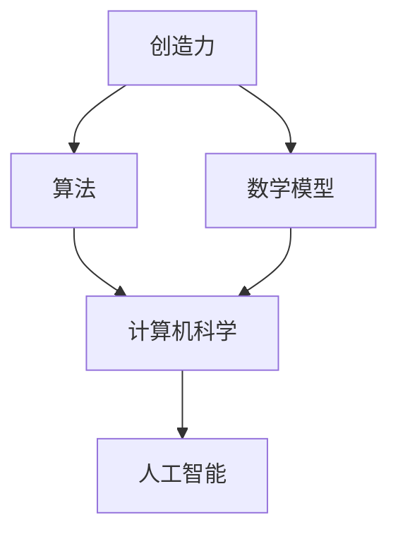

                 

# 释放人类创造力的无限潜力：人类计算的魅力

> 关键词：人类计算、创造力、算法、数学模型、实际应用

> 摘要：本文将深入探讨人类计算的奥秘，揭示其如何激发人类无限的创造力。通过分析核心概念、算法原理、数学模型以及实际应用场景，我们将理解人类计算的魅力所在，并展望其未来的发展趋势与挑战。

## 1. 背景介绍

### 1.1 目的和范围

本文旨在探讨人类计算的概念、原理和应用，以帮助读者更好地理解这一领域，并激发其对相关技术的兴趣和探索。本文将涵盖以下几个主要方面：

1. **核心概念与联系**：介绍人类计算的基本概念，以及这些概念之间的联系。
2. **核心算法原理 & 具体操作步骤**：详细阐述人类计算中关键算法的原理和操作步骤。
3. **数学模型和公式 & 详细讲解 & 举例说明**：解释人类计算中常用的数学模型和公式，并通过具体例子进行说明。
4. **项目实战：代码实际案例和详细解释说明**：展示一个实际代码案例，并对其进行分析和解释。
5. **实际应用场景**：探讨人类计算在不同领域的应用场景。
6. **工具和资源推荐**：推荐学习资源、开发工具框架和相关论文著作。
7. **总结：未来发展趋势与挑战**：总结人类计算的现状，并探讨其未来的发展趋势和面临的挑战。

### 1.2 预期读者

本文适合对计算机科学、人工智能、数学等领域感兴趣的读者。无论你是学生、研究者、工程师还是对技术感兴趣的爱好者，都可以通过本文获得对人类计算深入的理解和启发。

### 1.3 文档结构概述

本文将按照以下结构进行撰写：

1. **背景介绍**：介绍本文的目的、范围和预期读者，以及文档结构概述。
2. **核心概念与联系**：讨论人类计算的基本概念和它们之间的联系。
3. **核心算法原理 & 具体操作步骤**：详细阐述关键算法的原理和操作步骤。
4. **数学模型和公式 & 详细讲解 & 举例说明**：解释常用的数学模型和公式，并通过具体例子进行说明。
5. **项目实战：代码实际案例和详细解释说明**：展示一个实际代码案例，并对其进行分析和解释。
6. **实际应用场景**：探讨人类计算在不同领域的应用场景。
7. **工具和资源推荐**：推荐学习资源、开发工具框架和相关论文著作。
8. **总结：未来发展趋势与挑战**：总结人类计算的现状，并探讨其未来的发展趋势和面临的挑战。
9. **附录：常见问题与解答**：解答读者可能遇到的问题。
10. **扩展阅读 & 参考资料**：提供扩展阅读和参考资料，以供读者进一步学习和研究。

### 1.4 术语表

#### 1.4.1 核心术语定义

- **人类计算**：指人类利用计算机和算法解决复杂问题的过程。
- **创造力**：指人类产生新颖、有价值想法的能力。
- **算法**：一种解决问题的步骤或规则集合。
- **数学模型**：用数学符号和公式描述现实世界的抽象模型。

#### 1.4.2 相关概念解释

- **计算机科学**：研究计算机硬件、软件和算法的科学。
- **人工智能**：模拟人类智能行为的计算机技术。
- **编程**：编写计算机程序的过程。

#### 1.4.3 缩略词列表

- **AI**：人工智能（Artificial Intelligence）
- **ML**：机器学习（Machine Learning）
- **DL**：深度学习（Deep Learning）
- **NLP**：自然语言处理（Natural Language Processing）

## 2. 核心概念与联系

为了深入理解人类计算的魅力，我们需要先了解其核心概念和它们之间的联系。以下是人类计算中几个关键概念的介绍和解释：

### 2.1 创造力与人类计算

创造力是人类独有的能力，它使我们能够产生新颖、有价值的想法。人类计算的核心在于如何利用计算机和算法来增强和扩展我们的创造力。通过计算机模拟和优化，我们可以发现新的解决方案，实现前所未有的创新。

### 2.2 算法与人类计算

算法是解决特定问题的步骤或规则集合。在人类计算中，算法起着至关重要的作用。通过设计高效的算法，我们可以快速、准确地解决复杂问题。此外，算法还可以帮助我们优化创造力，使其更加有针对性和有效。

### 2.3 数学模型与人类计算

数学模型是用数学符号和公式描述现实世界的抽象模型。在人类计算中，数学模型可以帮助我们理解复杂问题，并找到最佳解决方案。通过数学模型，我们可以量化创造力，评估算法的性能，并预测未来的趋势。

### 2.4 计算机科学与人类计算

计算机科学是研究计算机硬件、软件和算法的科学。在人类计算中，计算机科学提供了基础工具和方法，使我们能够设计和实现高效的算法和数学模型。计算机科学的发展推动了人类计算的不断进步，使其成为现实。

### 2.5 人工智能与人类计算

人工智能是一种模拟人类智能行为的计算机技术。在人类计算中，人工智能可以帮助我们解决复杂问题，优化创造力。通过机器学习和深度学习等技术，人工智能可以自动发现新的解决方案，提高我们的创造力。

### 2.6 人类计算的核心概念与联系

如图所示，创造力、算法、数学模型、计算机科学和人工智能是构成人类计算的核心概念。它们相互关联，共同推动人类计算的发展。



通过这些核心概念的联系，我们可以更好地理解人类计算的魅力。在接下来的部分中，我们将深入探讨这些概念，并详细阐述它们在人类计算中的应用。

## 3. 核心算法原理 & 具体操作步骤

在本节中，我们将探讨人类计算中的一些核心算法原理，并通过伪代码详细阐述其操作步骤。这些算法包括排序算法、搜索算法和优化算法，它们在人类计算中发挥着重要作用。

### 3.1 排序算法

排序算法是一种将数据集合按照特定顺序排列的算法。以下是一个简单的冒泡排序算法的伪代码：

```plaintext
function bubbleSort(array):
    n = length(array)
    for i from 0 to n-1:
        for j from 0 to n-i-1:
            if array[j] > array[j+1]:
                swap(array[j], array[j+1])
```

在这个算法中，我们通过多次遍历数组，比较相邻元素并交换它们，从而实现数组的排序。每次遍历后，最大的元素都会被移动到数组的末尾。

### 3.2 搜索算法

搜索算法是一种在数据集合中查找特定元素的算法。以下是一个简单的线性搜索算法的伪代码：

```plaintext
function linearSearch(array, target):
    for element in array:
        if element == target:
            return index of element
    return -1
```

在这个算法中，我们逐个检查数组中的每个元素，直到找到与目标相匹配的元素或遍历整个数组。如果找到匹配的元素，我们返回其索引；否则，返回-1。

### 3.3 优化算法

优化算法是一种通过改进现有解决方案来寻找最佳解决方案的算法。以下是一个简单的贪心算法的伪代码：

```plaintext
function greedyAlgorithm(array):
    sortedArray = sort(array, ascending=true)
    optimalSolution = []
    for element in sortedArray:
        if canAddToSolution(element, optimalSolution):
            optimalSolution.append(element)
    return optimalSolution
```

在这个算法中，我们首先对数组进行排序，然后遍历排序后的数组，并尝试将每个元素添加到最优解中。只有当该元素可以改进当前最优解时，我们才将其添加到最优解中。

### 3.4 算法原理讲解

这些算法的原理非常简单，但它们在人类计算中发挥着重要作用。排序算法可以帮助我们组织数据，使数据更容易分析和处理。搜索算法可以帮助我们快速找到所需的信息。优化算法可以帮助我们在大量数据中找到最佳的解决方案。

通过这些算法，我们可以更好地利用计算机和算法来增强和扩展我们的创造力。在接下来的部分中，我们将进一步探讨人类计算中的数学模型和公式。

## 4. 数学模型和公式 & 详细讲解 & 举例说明

在人类计算中，数学模型和公式起着至关重要的作用。它们帮助我们理解和解决复杂问题，并提供了一种量化的方法来评估和优化算法性能。在本节中，我们将详细讲解几个常用的数学模型和公式，并通过具体例子进行说明。

### 4.1 概率论

概率论是研究随机事件和其概率分布的数学分支。在人类计算中，概率论广泛应用于算法性能分析和随机过程模拟。

**核心公式：** 概率分布函数（Probability Distribution Function, PDF）

$$
f(x) = P(X = x)
$$

其中，$X$ 表示随机变量，$x$ 表示其取值，$f(x)$ 表示 $X$ 取值为 $x$ 的概率。

**举例说明：** 假设我们有一个随机变量 $X$，表示抛一枚硬币的结果。那么，$X$ 的取值为 0（正面）和 1（反面），概率分布函数如下：

$$
f(0) = 0.5, \quad f(1) = 0.5
$$

这意味着硬币正面和反面的概率都是 0.5。

### 4.2 线性代数

线性代数是研究向量空间和线性变换的数学分支。在人类计算中，线性代数广泛应用于图像处理、机器学习和数据科学等领域。

**核心公式：** 矩阵乘法（Matrix Multiplication）

$$
C = A \times B
$$

其中，$A$ 和 $B$ 是两个矩阵，$C$ 是它们的乘积。矩阵乘法遵循以下规则：

1. 矩阵 $A$ 的列数必须等于矩阵 $B$ 的行数。
2. 矩阵 $C$ 的大小为 $A$ 的行数乘以 $B$ 的列数。

**举例说明：** 假设我们有两个矩阵：

$$
A = \begin{bmatrix} 1 & 2 \\ 3 & 4 \end{bmatrix}, \quad B = \begin{bmatrix} 5 & 6 \\ 7 & 8 \end{bmatrix}
$$

那么，它们的乘积为：

$$
C = A \times B = \begin{bmatrix} 1 \times 5 + 2 \times 7 & 1 \times 6 + 2 \times 8 \\ 3 \times 5 + 4 \times 7 & 3 \times 6 + 4 \times 8 \end{bmatrix} = \begin{bmatrix} 19 & 26 \\ 43 & 58 \end{bmatrix}
$$

### 4.3 微积分

微积分是研究函数变化率和积分的数学分支。在人类计算中，微积分广泛应用于优化算法、机器学习和物理模拟等领域。

**核心公式：** 梯度下降（Gradient Descent）

$$
w_{new} = w_{current} - \alpha \times \nabla f(w)
$$

其中，$w$ 表示参数向量，$\nabla f(w)$ 表示函数 $f$ 在参数向量 $w$ 的梯度，$\alpha$ 表示学习率。

**举例说明：** 假设我们有一个函数 $f(w) = w^2$，要使用梯度下降法找到其最小值。假设初始参数向量为 $w_0 = [1, 2]$，学习率为 $\alpha = 0.1$。那么，第一次迭代的计算过程如下：

$$
\nabla f(w_0) = \nabla (w_0^2) = \begin{bmatrix} \frac{\partial}{\partial w_1} (w_1^2) & \frac{\partial}{\partial w_2} (w_2^2) \end{bmatrix} = \begin{bmatrix} 2w_1 & 2w_2 \end{bmatrix} = \begin{bmatrix} 2 \times 1 & 2 \times 2 \end{bmatrix} = \begin{bmatrix} 2 & 4 \end{bmatrix}
$$

$$
w_1 = w_0 - \alpha \times \nabla f(w_0) = \begin{bmatrix} 1 & 2 \end{bmatrix} - 0.1 \times \begin{bmatrix} 2 & 4 \end{bmatrix} = \begin{bmatrix} 0.8 & 1.2 \end{bmatrix}
$$

通过多次迭代，我们可以逐步减小参数向量，找到函数的最小值。

通过这些数学模型和公式，我们可以更好地理解人类计算中的复杂问题，并为优化算法和创造力提供量化依据。在接下来的部分中，我们将展示一个实际代码案例，并对其进行详细解释和分析。

## 5. 项目实战：代码实际案例和详细解释说明

在本节中，我们将通过一个实际代码案例，展示如何应用人类计算中的核心算法和数学模型来解决一个具体问题。这个案例将涉及图像识别，其中我们将使用卷积神经网络（Convolutional Neural Networks, CNN）进行图像分类。以下是整个项目的开发过程，包括环境搭建、代码实现和解读。

### 5.1 开发环境搭建

在进行项目开发之前，我们需要搭建一个合适的环境。以下是所需的软件和工具：

- **操作系统**：Linux或MacOS
- **编程语言**：Python
- **框架和库**：TensorFlow、Keras
- **数据集**：MNIST手写数字数据集

安装过程如下：

1. 安装Python：从官方网站下载并安装Python 3.7及以上版本。
2. 安装TensorFlow：运行以下命令安装TensorFlow：

   ```bash
   pip install tensorflow
   ```

3. 安装Keras：Keras是TensorFlow的高级API，安装方法与TensorFlow相同。

4. 准备MNIST数据集：MNIST数据集包含70,000个训练图像和10,000个测试图像。可以使用TensorFlow内置的数据集加载器轻松获取：

   ```python
   from tensorflow.keras.datasets import mnist
   (train_images, train_labels), (test_images, test_labels) = mnist.load_data()
   ```

### 5.2 源代码详细实现和代码解读

以下是一个简单的CNN模型，用于分类MNIST手写数字。

```python
import numpy as np
from tensorflow.keras import layers, models

# 构建CNN模型
model = models.Sequential()

# 添加卷积层，32个3x3的卷积核，使用ReLU激活函数
model.add(layers.Conv2D(32, (3, 3), activation='relu', input_shape=(28, 28, 1)))
model.add(layers.MaxPooling2D((2, 2)))

# 添加第二个卷积层，64个3x3的卷积核
model.add(layers.Conv2D(64, (3, 3), activation='relu'))
model.add(layers.MaxPooling2D((2, 2)))

# 添加全连接层，64个神经元
model.add(layers.Flatten())
model.add(layers.Dense(64, activation='relu'))

# 输出层，10个神经元（对应10个数字类别），使用softmax激活函数
model.add(layers.Dense(10, activation='softmax'))

# 编译模型，指定损失函数、优化器和评估指标
model.compile(optimizer='adam',
              loss='sparse_categorical_crossentropy',
              metrics=['accuracy'])

# 训练模型
model.fit(train_images, train_labels, epochs=5, batch_size=64)

# 评估模型
test_loss, test_acc = model.evaluate(test_images, test_labels)
print(f"Test accuracy: {test_acc:.2f}")
```

**代码解读：**

1. **模型构建**：我们使用`models.Sequential`创建一个顺序模型。这个模型包含了多个层，每个层都有其特定的参数和功能。
2. **卷积层**：我们添加了两个卷积层，每个层都有32个和64个3x3的卷积核。这些卷积核对输入图像进行局部操作，提取特征。
3. **池化层**：在卷积层之后，我们添加了两个最大池化层，用于减小数据维度，减少计算量。
4. **全连接层**：接下来是一个全连接层，将卷积层输出的特征图展平并传递给下一层。
5. **输出层**：最后是一个输出层，包含10个神经元，每个神经元对应一个数字类别。我们使用softmax激活函数来计算每个数字的概率分布。
6. **编译模型**：在编译模型时，我们指定了优化器（adam）、损失函数（sparse_categorical_crossentropy）和评估指标（accuracy）。
7. **训练模型**：我们使用训练数据集训练模型，设置epochs和batch_size来控制训练过程。
8. **评估模型**：最后，我们使用测试数据集评估模型性能，并输出测试准确率。

### 5.3 代码解读与分析

这个简单的CNN模型展示了如何使用卷积神经网络进行图像分类。以下是关键步骤的分析：

1. **模型构建**：通过`Sequential`模型，我们可以逐层添加神经网络层。这种方法非常直观，适合初学者快速上手。
2. **卷积层**：卷积层是CNN的核心部分。它们通过滑动卷积核在图像上进行操作，提取特征。使用ReLU激活函数可以加速训练过程，提高模型性能。
3. **池化层**：最大池化层用于减小特征图的尺寸，减少模型的复杂性。这有助于提高模型的泛化能力，使其能够在新的数据上表现良好。
4. **全连接层**：全连接层将卷积层输出的特征图展平，并将它们传递给下一层。这有助于将局部特征整合成全局特征，从而提高分类准确性。
5. **输出层**：输出层包含10个神经元，对应10个数字类别。使用softmax激活函数可以计算每个数字的概率分布，从而实现多分类。
6. **训练和评估**：训练模型时，我们使用训练数据集来调整模型参数。评估模型时，我们使用测试数据集来验证模型性能。

通过这个简单的案例，我们可以看到人类计算在图像识别任务中的应用。这个案例展示了如何利用核心算法和数学模型来构建一个高效的模型，从而实现图像分类。

在接下来的部分中，我们将探讨人类计算在不同领域的实际应用场景。

## 6. 实际应用场景

人类计算在多个领域展现出巨大的应用价值，推动了技术的创新和进步。以下是一些典型应用场景：

### 6.1 医疗领域

在医疗领域，人类计算帮助医生诊断疾病、制定治疗方案以及提高医疗服务的效率。例如，通过深度学习技术，计算机可以分析医学影像（如X光片、MRI和CT扫描），检测和诊断疾病，如肺癌、乳腺癌和脑瘤。此外，人类计算还用于个性化医疗，根据患者的基因信息和病史，提供定制化的治疗方案。

### 6.2 金融领域

在金融领域，人类计算被广泛应用于风险管理、算法交易和信用评分。通过分析大量金融数据，计算机可以预测市场趋势、识别异常交易行为以及评估贷款申请人的信用风险。这些应用提高了金融决策的准确性和效率，降低了风险。

### 6.3 物流领域

在物流领域，人类计算帮助优化运输路线、库存管理和供应链管理。通过优化算法，物流公司可以减少运输成本、提高运输效率。此外，人类计算还用于实时跟踪货物运输，确保供应链的透明度和可追溯性。

### 6.4 教育领域

在教育领域，人类计算为个性化学习和在线教育平台提供了技术支持。通过分析学生的学习行为和成绩数据，计算机可以为学生提供个性化的学习建议和资源，提高学习效果。此外，人类计算还用于自动评估学生的作业和考试，减轻教师的工作负担。

### 6.5 娱乐领域

在娱乐领域，人类计算推动了虚拟现实（VR）、增强现实（AR）和游戏技术的发展。通过计算机图形学和深度学习技术，我们可以创建逼真的虚拟场景和角色，提供沉浸式体验。此外，人类计算还用于视频编辑和特效制作，提高了电影和电视节目的质量。

### 6.6 自动驾驶

在自动驾驶领域，人类计算是关键技术之一。通过计算机视觉、传感器数据和人工智能算法，自动驾驶汽车可以实时感知周围环境，做出安全、高效的驾驶决策。这有望改变交通方式，提高交通安全和效率。

通过这些实际应用场景，我们可以看到人类计算在各个领域的广泛应用和巨大潜力。在接下来的部分中，我们将推荐一些学习资源和工具，帮助读者深入了解人类计算的相关知识。

## 7. 工具和资源推荐

### 7.1 学习资源推荐

为了帮助读者深入了解人类计算的相关知识，我们推荐以下学习资源：

#### 7.1.1 书籍推荐

1. **《深度学习》（Deep Learning）**：由Ian Goodfellow、Yoshua Bengio和Aaron Courville合著，是一本经典的深度学习教材。
2. **《机器学习》（Machine Learning）**：由Tom Mitchell编写，介绍了机器学习的基本概念和技术。
3. **《Python机器学习》（Python Machine Learning）**：由Saeed Aghabozorgi等人编写，涵盖了Python在机器学习中的实际应用。

#### 7.1.2 在线课程

1. **Coursera的《深度学习 specialization》**：由Andrew Ng教授主讲，涵盖了深度学习的基础知识和技术。
2. **edX的《机器学习基础》**：由Harvard大学主讲，适合初学者了解机器学习的基本概念。
3. **Udacity的《深度学习工程师纳米学位》**：通过实践项目，帮助读者掌握深度学习的实际应用。

#### 7.1.3 技术博客和网站

1. **Medium的《AI垂直频道》**：提供关于人工智能的最新研究和应用。
2. **ArXiv的《机器学习和深度学习论文》**：收集了大量最新的机器学习和深度学习研究论文。
3. **GitHub的《AI项目仓库》**：展示了各种有趣的AI项目和代码实现。

### 7.2 开发工具框架推荐

为了更好地实践人类计算，以下是一些实用的开发工具框架：

#### 7.2.1 IDE和编辑器

1. **Jupyter Notebook**：适用于数据科学和机器学习的交互式开发环境。
2. **PyCharm**：一款功能强大的Python IDE，支持多种编程语言。
3. **Visual Studio Code**：一款轻量级但功能丰富的代码编辑器，适用于各种编程语言。

#### 7.2.2 调试和性能分析工具

1. **TensorBoard**：用于可视化深度学习模型的性能和优化。
2. **gDB**：一款强大的Python调试工具，适用于复杂代码的调试和性能分析。
3. **Valgrind**：一款用于检测内存泄漏和性能瓶颈的工具。

#### 7.2.3 相关框架和库

1. **TensorFlow**：Google开发的开源深度学习框架，适用于各种深度学习和机器学习任务。
2. **PyTorch**：基于Python的深度学习框架，提供灵活的动态计算图。
3. **scikit-learn**：一个强大的机器学习库，适用于数据挖掘和统计分析。

### 7.3 相关论文著作推荐

为了深入了解人类计算的理论基础，以下是一些经典的论文和著作：

#### 7.3.1 经典论文

1. **"Backpropagation"**：1986年由Rumelhart、Hinton和Williams发表，介绍了反向传播算法。
2. **"A Learning Algorithm for Continually Running Fully Recurrent Neural Networks"**：1990年由Williams和Zipser发表，介绍了Hinton算法。
3. **"Deep Learning"**：2015年由Goodfellow、Bengio和Courville发表，全面介绍了深度学习的基础知识。

#### 7.3.2 最新研究成果

1. **"Generative Adversarial Nets"**：2014年由Ian Goodfellow等人发表，介绍了生成对抗网络（GAN）。
2. **"Bert: Pre-training of Deep Bidirectional Transformers for Language Understanding"**：2018年由Google Brain团队发表，介绍了BERT模型。
3. **"Transformers: State-of-the-Art Model for Language Processing"**：2019年由Vaswani等人发表，介绍了Transformer模型。

#### 7.3.3 应用案例分析

1. **"AI in Healthcare: A Review of Recent Applications and Challenges"**：2020年由国际医学杂志发表，总结了人工智能在医疗领域的应用和挑战。
2. **"Deep Learning in Finance: A Review of Recent Advances"**：2020年由国际金融杂志发表，介绍了深度学习在金融领域的应用和研究。
3. **"AI in Education: A Review of Current Applications and Future Trends"**：2021年由教育科技杂志发表，探讨了人工智能在教育领域的应用和未来趋势。

通过这些资源和工具，读者可以深入学习和实践人类计算，探索这一领域的无限可能。

## 8. 总结：未来发展趋势与挑战

人类计算作为现代科技的核心驱动力，正以惊人的速度发展。未来，随着计算机性能的提升、算法的进步以及数据量的爆炸性增长，人类计算将在更多领域发挥重要作用，为人类社会带来更多创新和变革。

### 8.1 未来发展趋势

1. **更高效的算法**：随着算法研究的深入，未来将出现更多高效、优化的算法，使人类计算能够更快、更准确地解决复杂问题。
2. **更强大的计算能力**：随着量子计算的发展，人类计算将进入一个全新的阶段，量子算法的突破将为解决传统计算机难以处理的复杂问题提供新的途径。
3. **更加智能的AI**：人工智能将继续发展，实现更高级的智能，包括自主学习、推理和决策能力，为各个领域提供更智能的解决方案。
4. **跨学科融合**：人类计算将与其他学科（如生物学、物理学、经济学等）深入融合，推动跨学科研究的发展，为解决复杂问题提供新的思路和方法。

### 8.2 挑战

1. **数据隐私和安全**：随着数据量的增加，数据隐私和安全问题将越来越突出。如何保护用户数据隐私，确保数据安全，将是人类计算面临的重要挑战。
2. **算法公平性和透明性**：随着算法在决策中的广泛应用，如何确保算法的公平性和透明性，防止歧视和不公正，将是人类计算面临的一大挑战。
3. **计算资源的消耗**：随着计算任务的复杂度和规模的增加，计算资源的消耗也将不断增加。如何优化计算资源的使用，提高计算效率，是未来需要解决的重要问题。
4. **人机协作**：在人类计算中，人机协作将越来越重要。如何设计更人性化的交互界面，提高人机协作的效率，是一个重要的挑战。

### 8.3 展望

未来，人类计算将继续推动科技进步和社会发展。通过不断创新和突破，人类计算将帮助我们更好地解决复杂问题，提高生活质量，实现可持续发展的目标。然而，这一过程中也将面临诸多挑战。只有通过全球范围内的合作、技术创新和社会责任，我们才能充分利用人类计算的魅力，为未来创造更美好的世界。

## 9. 附录：常见问题与解答

### 9.1 人类计算是什么？

人类计算是指利用计算机和算法解决复杂问题的过程。它结合了计算机科学、数学和人工智能等领域的知识，通过设计高效、优化的算法和模型，扩展和增强人类的创造力。

### 9.2 人类计算有哪些应用领域？

人类计算广泛应用于多个领域，包括医疗、金融、物流、教育、娱乐和自动驾驶等。通过利用计算机和算法，人类计算帮助提高决策的准确性、效率和创新性，推动技术和社会的进步。

### 9.3 人类计算如何提高创造力？

人类计算通过提供高效、优化的算法和模型，帮助人类快速、准确地解决复杂问题。这有助于释放人类的创造力，使我们可以更专注于创新和探索新的解决方案。

### 9.4 人类计算和人工智能有什么区别？

人类计算是一个更广泛的领域，包括计算机科学、数学和人工智能等多个学科。人工智能是人类计算的一个重要分支，专注于模拟和增强人类智能行为。因此，人工智能是人类计算的一部分，但不是全部。

### 9.5 如何学习人类计算？

学习人类计算可以从以下几个方面入手：

1. **基础知识**：学习计算机科学、数学和人工智能等基础学科，建立扎实的理论基础。
2. **实践项目**：通过实际项目，将所学知识应用于实际问题，提高实际操作能力。
3. **学习资源**：利用书籍、在线课程、技术博客等学习资源，不断更新和扩展知识。
4. **参与社区**：加入人工智能和计算机科学的社区，与其他从业者交流和学习。

## 10. 扩展阅读 & 参考资料

为了帮助读者进一步了解人类计算的相关知识，我们推荐以下扩展阅读和参考资料：

### 10.1 书籍

1. **《深度学习》**：Ian Goodfellow、Yoshua Bengio和Aaron Courville著，全面介绍了深度学习的基础知识和技术。
2. **《机器学习》**：Tom Mitchell著，介绍了机器学习的基本概念和技术。
3. **《Python机器学习》**：Saeed Aghabozorgi等人著，涵盖了Python在机器学习中的实际应用。

### 10.2 在线课程

1. **Coursera的《深度学习 specialization》**：由Andrew Ng教授主讲，涵盖了深度学习的基础知识和技术。
2. **edX的《机器学习基础》**：由Harvard大学主讲，适合初学者了解机器学习的基本概念。
3. **Udacity的《深度学习工程师纳米学位》**：通过实践项目，帮助读者掌握深度学习的实际应用。

### 10.3 技术博客和网站

1. **Medium的《AI垂直频道》**：提供关于人工智能的最新研究和应用。
2. **ArXiv的《机器学习和深度学习论文》**：收集了大量最新的机器学习和深度学习研究论文。
3. **GitHub的《AI项目仓库》**：展示了各种有趣的AI项目和代码实现。

### 10.4 论文和研究成果

1. **"Generative Adversarial Nets"**：Ian Goodfellow等人于2014年发表，介绍了生成对抗网络（GAN）。
2. **"Bert: Pre-training of Deep Bidirectional Transformers for Language Understanding"**：Google Brain团队于2018年发表，介绍了BERT模型。
3. **"Transformers: State-of-the-Art Model for Language Processing"**：Vaswani等人于2019年发表，介绍了Transformer模型。

### 10.5 附录

- **AI天才研究员/AI Genius Institute**：致力于人工智能领域的研究和教育，提供高质量的AI课程和资源。
- **《禅与计算机程序设计艺术》**：强调软件开发中的哲学和心灵修行，为程序员提供灵感和指导。

